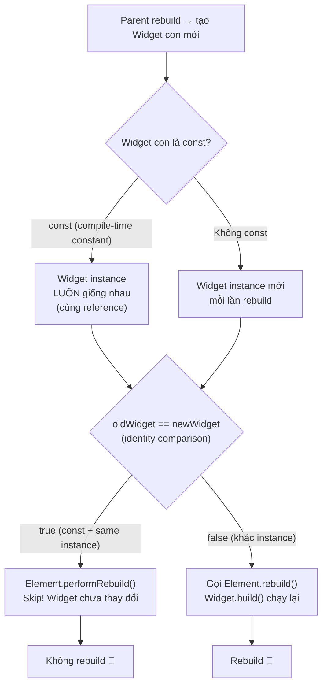

# Bài 2.4 — Widget Immutability & Reconciliation

## Phần 1 — Khái Niệm & Mục Tiêu Bài Học

### Tại sao bài này quan trọng?

Bạn có biết `const Text('Hello')` và `Text('Hello')` tạo ra hiệu ứng khác nhau trong Flutter không?

```dart
// Case 1: không const
Widget build(BuildContext context) {
  return Text('Hello'); // Tạo Text object MỚI mỗi lần build
}

// Case 2: const
Widget build(BuildContext context) {
  return const Text('Hello'); // Tái sử dụng CÙNG một object — compile-time constant
}
```

Với `const`: Flutter so sánh `oldWidget == newWidget` → `true` (identity equal) → **skip rebuild hoàn toàn**.

Đây là tối ưu hóa "miễn phí" — không tốn effort implement nhưng có thể giảm đáng kể số lần build.

### Bạn sẽ hiểu được sau bài này:
- Tại sao Widget phải `@immutable` — đây là design intentional
- `operator==` và `hashCode` trong Widget tree traversal
- `const` widget = identity equal → skip build
- Dùng `debugPrintRebuildDirtyWidgets` để đo rebuild count

---

## Phần 2 — Cơ Chế Hoạt Động (Under the Hood)

### Widget Equality và const Optimization



### `@immutable` — Design Intentional

Flutter chọn immutable Widget vì:

```
Mutable Widget (nguy hiểm):
  widget.count = 5;        // Thay đổi widget trực tiếp
  widget.count = 6;        // Thay đổi nữa
  // Flutter không biết widget đã thay đổi!
  // → Không trigger rebuild
  // → UI không sync với data

Immutable Widget (an toàn):
  setState(() { count = 6; }); // Thay đổi State
  build(context);               // Tạo Widget MỚI với count = 6
  // Flutter biết Widget mới khác Widget cũ → rebuild
```

### const Widget — Compile-time Constant Pool

```dart
// Tất cả const widget giống nhau → cùng một instance trong memory
const text1 = Text('Hello');
const text2 = Text('Hello');
print(identical(text1, text2)); // true — cùng reference!

// Không const → khác instance dù data giống
final text3 = Text('Hello');
final text4 = Text('Hello');
print(identical(text3, text4)); // false — khác reference!
```

---

## Phần 3 — Code Mẫu Chuẩn Google

### 3.1 — `@immutable` và const constructor

```dart
// @immutable: mọi field phải là final (kể cả inherited)
// Dart analyzer cảnh báo nếu vi phạm
@immutable
class ProductCard extends StatelessWidget {
  final String title;
  final double price;
  final String? imageUrl;
  final VoidCallback? onTap;

  // const constructor: cho phép dùng const ProductCard(...)
  const ProductCard({
    super.key,
    required this.title,
    required this.price,
    this.imageUrl,
    this.onTap,
  });

  @override
  Widget build(BuildContext context) {
    return Card(
      child: InkWell(
        onTap: onTap,
        child: Column(
          children: [
            if (imageUrl != null) Image.network(imageUrl!),
            // const ở đây được Flutter optimize
            const Padding(
              padding: EdgeInsets.all(8),
              child: SizedBox.shrink(),
            ),
            Text(title),
            Text('${price.toStringAsFixed(0)}đ'),
          ],
        ),
      ),
    );
  }
}
```

### 3.2 — `operator==` trong custom Widget

```dart
// Flutter mặc định dùng identity comparison (reference equality)
// Nếu muốn value equality → override operator==

// Trường hợp cần override: Widget chứa data muốn so sánh by value
@immutable
class AvatarWidget extends StatelessWidget {
  final String? imageUrl;
  final String initials;
  final double size;

  const AvatarWidget({
    super.key,
    this.imageUrl,
    required this.initials,
    this.size = 40,
  });

  // Override operator== để Flutter so sánh by value
  // → Khi parent rebuild với cùng data → skip build
  @override
  bool operator==(Object other) {
    if (identical(this, other)) return true;
    if (other.runtimeType != runtimeType) return false;
    final AvatarWidget avatar = other as AvatarWidget;
    return avatar.imageUrl == imageUrl
        && avatar.initials == initials
        && avatar.size == size;
  }

  @override
  int get hashCode => Object.hash(imageUrl, initials, size);

  @override
  Widget build(BuildContext context) {
    // ...
    return CircleAvatar(
      radius: size / 2,
      backgroundImage: imageUrl != null ? NetworkImage(imageUrl!) : null,
      child: imageUrl == null ? Text(initials) : null,
    );
  }
}

// Khi dùng:
AvatarWidget(imageUrl: 'http://...', initials: 'HA', size: 40)
// → Nếu parent rebuild với cùng args → operator== = true → Element skip rebuild
```

### 3.3 — Đo rebuild count với debug tools

```dart
// Bật rebuild logging trong debug mode
void main() {
  // Bật để thấy widget nào rebuild trong console
  debugPrintRebuildDirtyWidgets = true;

  runApp(const MyApp());
}

// Output khi chạy:
// I/flutter: Dirty: Text("Hello") (at build_context_demo.dart:42)
// I/flutter: Dirty: Column (at build_context_demo.dart:38)
// ...

// Hoặc dùng Widget Inspector trong Flutter DevTools:
// - Highlight rebuilds trực quan
// - Performance overlay

// Cách đo trong code:
class RebuildTracker extends StatelessWidget {
  final String name;
  final Widget child;

  const RebuildTracker({super.key, required this.name, required this.child});

  @override
  Widget build(BuildContext context) {
    // In ra mỗi khi widget này rebuild
    debugPrint('🔄 Rebuild: $name at ${DateTime.now()}');
    return child;
  }
}
```

### 3.4 — const Optimization patterns

```dart
// Pattern 1: Extract static const widgets
class ScreenWithStaticContent extends StatefulWidget {
  const ScreenWithStaticContent({super.key});
  @override State<ScreenWithStaticContent> createState() => _State();
}

class _State extends State<ScreenWithStaticContent> {
  int _count = 0;

  // ✅ Static const widget — không bao giờ rebuild dù parent setState
  static const _header = Column(
    children: [
      Text('Welcome!', style: TextStyle(fontSize: 24)),
      SizedBox(height: 8),
      Text('Tap the button below'),
      Divider(),
    ],
  );

  // ✅ Footer không thay đổi
  static const _footer = Text(
    'Version 1.0.0',
    style: TextStyle(color: Colors.grey),
  );

  @override
  Widget build(BuildContext context) {
    return Scaffold(
      body: Column(
        children: [
          _header,         // Const → không rebuild khi setState
          Text('Count: $_count'), // Rebuild khi _count thay đổi
          ElevatedButton(
            onPressed: () => setState(() => _count++),
            child: const Text('Tap'),
          ),
          _footer,         // Const → không rebuild
        ],
      ),
    );
  }
}

// Pattern 2: const trong list builder (khó hơn vì data dynamic)
// Nhưng const cho static parts bên trong item:
Widget _buildItem(Product product) {
  return Card(
    // Không thể const Card nếu child dynamic
    child: Row(
      children: [
        // Static part → const
        const Icon(Icons.shopping_cart, color: Colors.blue),
        const SizedBox(width: 8),
        // Dynamic part → không const
        Text(product.name),
        const Spacer(), // const!
        Text('${product.price}đ'),
      ],
    ),
  );
}
```

---

## Phần 4 — Lỗi Sai Phổ Biến & Best Practices

### ❌ Anti-pattern 1: Widget có mutable field

```dart
// ❌ Sai: Widget với mutable state → không dùng @immutable
class BadWidget extends StatelessWidget {
  String title; // Non-final! Vi phạm immutability

  BadWidget(this.title);

  @override Widget build(BuildContext context) => Text(title);
}

// ✅ Đúng: Mọi field final
@immutable
class GoodWidget extends StatelessWidget {
  final String title;
  const GoodWidget({super.key, required this.title});

  @override Widget build(BuildContext context) => Text(title);
}
```

### ❌ Anti-pattern 2: Quên `const` ở nơi có thể dùng

```dart
// ❌ Bỏ lỡ tối ưu hóa
Widget build(BuildContext context) {
  return Padding(
    padding: EdgeInsets.all(16), // ← không const
    child: Column(
      children: [
        Text('Title'),              // ← không const
        SizedBox(height: 8),       // ← không const
        Icon(Icons.star),           // ← không const
      ],
    ),
  );
}

// ✅ Const mọi nơi có thể
Widget build(BuildContext context) {
  return const Padding(
    padding: EdgeInsets.all(16),
    child: Column(
      children: [
        Text('Title'),
        SizedBox(height: 8),
        Icon(Icons.star),
      ],
    ),
  );
}
// Toàn bộ subtree const → không bao giờ rebuild! 🚀
```

### ❌ Anti-pattern 3: Tạo object trong const context

```dart
// ❌ Không thể const vì DateTime.now() không phải const
const myWidget = Text(
  '${DateTime.now()}', // ❌ Compile error
);

// ❌ Không thể const vì callback không phải const
const button = ElevatedButton(
  onPressed: myFunction, // ❌ Function không phải const value
  child: Text('Go'),
);

// ✅ Đúng: const chỉ khi tất cả args là compile-time constant
const label = Text('Go');
// ElevatedButton cần onPressed → không const được
```

### ❌ Anti-pattern 4: Bỏ qua `const` warning của flutter_lints

```yaml
# pubspec.yaml — nên bật
dev_dependencies:
  flutter_lints: ^5.0.0
```

```dart
// flutter_lints tự động cảnh báo: "prefer_const_constructors"
// Đừng bỏ qua warning này — đây là tối ưu hóa miễn phí!
```

---

## Phần 5 — Bài Tập Củng Cố Tư Duy

### Challenge: Đo rebuild count — trước và sau optimization

**Tình huống:** Một màn hình với header, list sản phẩm, và counter. Mỗi lần increment counter, toàn bộ màn hình rebuild.

```dart
class DemoScreen extends StatefulWidget {
  const DemoScreen({super.key});
  @override State<DemoScreen> createState() => _DemoScreenState();
}

class _DemoScreenState extends State<DemoScreen> {
  int _count = 0;

  @override
  Widget build(BuildContext context) {
    return Column(children: [
      // Header (không thay đổi)
      Text('Welcome to Shop', style: Theme.of(context).textTheme.headlineMedium),
      Icon(Icons.store),
      Divider(),
      // Product list (không thay đổi)
      ...List.generate(5, (i) => Text('Product $i')),
      // Counter (thay đổi)
      Text('Count: $_count'),
      ElevatedButton(
        onPressed: () => setState(() => _count++),
        child: Text('Increment'),
      ),
    ]);
  }
}
```

**Nhiệm vụ:**
1. Bật `debugPrintRebuildDirtyWidgets = true`
2. Đếm số widget rebuild mỗi lần nhấn button
3. Thêm `const` vào những chỗ có thể
4. Tách Counter thành widget riêng (đặt `setState` trong widget con)
5. Đếm lại — sự khác biệt là bao nhiêu?

### Câu hỏi phỏng vấn liên quan:

1. **"Tại sao Flutter chọn immutable Widget thay vì mutable?"**
   - Immutable → có thể so sánh bằng reference (const) → skip rebuild
   - Mutable → không biết khi nào thay đổi → phải luôn rebuild
   - Tách biệt Widget (description) và State (mutable data) → cleaner architecture

2. **"`const` Widget có phải luôn tốt hơn không?"**
   - `const` luôn tốt hơn nếu widget không có dynamic data
   - Với dynamic data (từ API, user input): không dùng const được
   - Nhưng phần static bên trong dynamic widget vẫn có thể const

3. **"Khi nào override `operator==` cho Widget?"**
   - Hiếm — thường const là đủ
   - Override khi Widget có nhiều fields phức tạp và muốn value equality
   - Phải override cả `hashCode` khi override `operator==`
