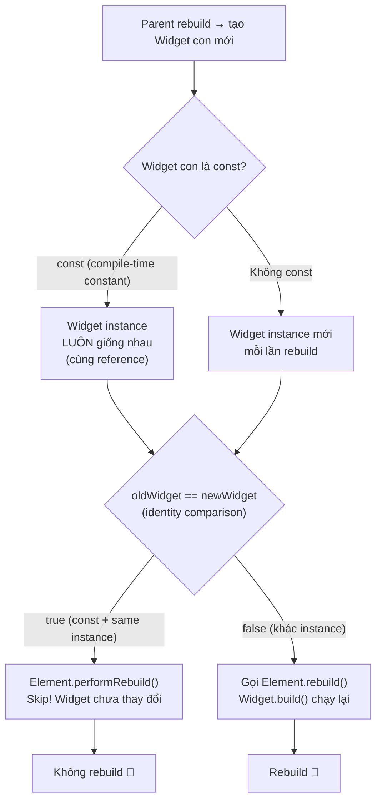

# Bài 2.4 — Widget Immutability & Reconciliation

## Phần 1 — Khái Niệm & Mục Tiêu Bài Học

### 1.1 — Tại Sao Bài Này Quan Trọng?

Flutter rebuild Widget tree hàng chục lần mỗi giây. Nếu không có cơ chế kiểm soát, mọi widget trong app đều sẽ rebuild mỗi frame — dẫn đến lag, jank, và battery drain.

Flutter giải quyết bằng hai cơ chế cốt lõi: **Immutability** (đảm bảo Widget không tự thay đổi) và **Reconciliation** (thuật toán diff Widget tree cũ vs mới để quyết định rebuild tối thiểu).

### 1.2 — Vấn Đề Cốt Lõi: "Nếu Widget Mutable, Flutter Không Thể Tối Ưu Hóa"

Hãy hình dung Widget có thể thay đổi trực tiếp:

```
# Giả sử Widget mutable (không phải cách Flutter hoạt động)
myText.text = "Hello";      // thay đổi trực tiếp
# Flutter không biết myText đã thay đổi → không trigger rebuild
# → UI không sync với data (stale UI)

# Hoặc Flutter phải poll/watch mọi field mọi lúc
# → Tốn CPU khổng lồ, phức tạp hóa engine
```

**Giải pháp của Flutter: Widget bất biến (Immutable)**

Thay vì thay đổi Widget → luôn **tạo Widget mới** với data mới:

```
setState() được gọi
→ build() chạy lại → tạo Widget tree MỚI
→ Flutter diff Widget tree mới vs cũ (Reconciliation)
→ Chỉ cập nhật phần thực sự thay đổi
```

**Tại sao diff hiệu quả?** Vì Widget immutable → Flutter có thể so sánh `identical(oldWidget, newWidget)`. Nếu cùng reference (trường hợp `const`) → không cần rebuild gì cả.

```dart
// const → cùng reference → Flutter skip hoàn toàn
const Text('Hello') // mỗi lần build() trả về CÙNG object → identical = true → 0 rebuilds

// Không const → khác reference dù data giống
Text('Hello')       // mỗi lần build() tạo Text MỚI → identical = false → rebuilt
```

**Reconciliation Algorithm** quyết định từng Element trong tree:
- `identical(old, new)` = true → **skip hoàn toàn** (const optimization)
- `canUpdate(old, new)` = true (same runtimeType + key) → **update** Element, giữ State
- `canUpdate(old, new)` = false → **unmount + createElement mới**, State mới

### 1.3 — Bạn Sẽ Hiểu Được Sau Bài Này:

- `@immutable` là gì và tại sao Widget phải tuân thủ
- Reconciliation algorithm: ba kết quả (skip / update / recreate)
- `const` widget = identity equal → skip build hoàn toàn
- `operator==` trong Widget và khi nào có ý nghĩa
- Cách đo rebuild count để tối ưu performance

---

## Phần 2 — Cơ Chế Hoạt Động (Under the Hood)

### 2.1 — Định Nghĩa Chuyên Sâu: Widget Immutability

#### Định nghĩa:

**Widget Immutability** là nguyên tắc thiết kế bắt buộc: mọi Widget trong Flutter phải có **tất cả fields là `final`** và không có setter mutable. Dart annotation `@immutable` biểu thị và enforces nguyên tắc này.

```dart
// Flutter source: widgets/framework.dart
@immutable
abstract class Widget extends DiagnosticableTree {
  const Widget({this.key});
  final Key? key;
  // Mọi field trong Widget subclass phải final
}
```

**Đặc tính cốt lõi của Widget Immutable:**

| Đặc tính | Cụ thể | Lý do |
|---|---|---|
| **Tất cả fields là `final`** | Không có `var`, không có setter | Không thể thay đổi sau khi tạo |
| **`@immutable` annotation** | Analyzer kiểm tra, không phải runtime | Compile-time enforcement |
| **`const` constructor** | Cho phép compile-time constant | Enable `identical()` optimization |
| **Tạo mới khi data thay đổi** | `setState()` → `build()` → Widget mới | Push thay đổi ra ngoài thay vì mutate |

#### Widget Immutability KHÔNG có nghĩa là:
- **UI không thay đổi** — UI thay đổi qua việc tạo Widget mới trong `build()`
- **Không có state** — State được tách riêng vào `State<T>` object trong `StatefulWidget`
- **Performance chậm** — Widget object rất rẻ để tạo; expensive object là `RenderObject`

#### So sánh Widget vs State vs RenderObject về mutability:

| | Widget | State | RenderObject |
|---|---|---|---|
| **Mutability** | Immutable (`@immutable`) | Mutable (có `setState`) | Mutable (có `markNeedsLayout`) |
| **Lifecycle** | Thoáng qua — recreate mỗi rebuild | Bền lâu — sống cùng Element | Bền lâu — sống cùng Element |
| **Purpose** | Mô tả UI (config) | Lưu mutable data của UI | Đo, vẽ pixel thực sự |

---

### 2.2 — Định Nghĩa Chuyên Sâu: Reconciliation Algorithm

#### Định nghĩa:

**Reconciliation** là quá trình Flutter **so sánh Widget tree mới (sau rebuild) với Element tree hiện có** để quyết định cách cập nhật tối thiểu — không rebuild những gì không thay đổi.

Flutter's reconciliation không giống React's diffing — Flutter thực hiện **single-pass O(n)** (linear, không O(n²)) nhờ giả định:
1. Widgets cùng vị trí thường cùng type
2. Key giúp match widgets vượt vị trí

#### Ba kết quả của Reconciliation:

```
Khi build() tạo ra Widget mới tại một vị trí:

1. identical(oldWidget, newWidget) = true
   → [SKIP] Không làm gì — const optimization
   → Element, State, RenderObject KHÔNG đổi

2. canUpdate(oldWidget, newWidget) = true  [same runtimeType + key]
   → [UPDATE] element.update(newWidget)
   → Element và State được GIỮ NGUYÊN
   → State.didUpdateWidget(oldWidget) được gọi
   → RenderObject.markNeedsLayout() nếu config thay đổi

3. canUpdate(oldWidget, newWidget) = false  [khác type HOẶC khác key]
   → [RECREATE] deactivate(oldElement) + createElement(newWidget)
   → Element MỚI được tạo
   → State MỚI (initState() được gọi)
   → RenderObject MỚI
```

#### Reconciliation KHÔNG phải là:
- **Full tree re-render** — chỉ những gì thay đổi mới được xử lý
- **Deep comparison của widget fields** — chỉ check `runtimeType` và `key`
- **Giống React Virtual DOM diff** — Flutter diff Element tree, không phải Widget tree

#### Bảng so sánh ba kết quả:

| | Skip (const) | Update | Recreate |
|---|---|---|---|
| **Điều kiện** | `identical()` = true | `canUpdate()` = true | `canUpdate()` = false |
| **Element** | Giữ nguyên | Giữ nguyên | Tạo mới |
| **State** | Không đổi | Không đổi (gọi `didUpdateWidget`) | Tạo mới (`initState`) |
| **RenderObject** | Không paint lại | `update()` nếu config đổi | Tạo mới |
| **Chi phí** | O(0) ✅ | O(1) ✅ | O(depth) ⚠️ |

---

### 2.3 — Widget Equality và const Optimization



### 2.4 — `@immutable` — Design Intentional

Flutter chọn immutable Widget vì:

```
Mutable Widget (nguy hiểm):
  widget.count = 5;        // Thay đổi widget trực tiếp
  widget.count = 6;        // Thay đổi nữa
  // Flutter không biết widget đã thay đổi!
  // → Không trigger rebuild
  // → UI không sync với data

Immutable Widget (an toàn):
  setState(() { count = 6; }); // Thay đổi State
  build(context);               // Tạo Widget MỚI với count = 6
  // Flutter biết Widget mới khác Widget cũ → rebuild
```

### 2.5 — const Widget — Compile-time Constant Pool

```dart
// Tất cả const widget giống nhau → cùng một instance trong memory
const text1 = Text('Hello');
const text2 = Text('Hello');
print(identical(text1, text2)); // true — cùng reference!

// Không const → khác instance dù data giống
final text3 = Text('Hello');
final text4 = Text('Hello');
print(identical(text3, text4)); // false — khác reference!
```

---

## Phần 3 — Code Mẫu Chuẩn Google

### 3.1 — `@immutable` và const constructor

```dart
// @immutable: mọi field phải là final (kể cả inherited)
// Dart analyzer cảnh báo nếu vi phạm
@immutable
class ProductCard extends StatelessWidget {
  final String title;
  final double price;
  final String? imageUrl;
  final VoidCallback? onTap;

  // const constructor: cho phép dùng const ProductCard(...)
  const ProductCard({
    super.key,
    required this.title,
    required this.price,
    this.imageUrl,
    this.onTap,
  });

  @override
  Widget build(BuildContext context) {
    return Card(
      child: InkWell(
        onTap: onTap,
        child: Column(
          children: [
            if (imageUrl != null) Image.network(imageUrl!),
            // const ở đây được Flutter optimize
            const Padding(
              padding: EdgeInsets.all(8),
              child: SizedBox.shrink(),
            ),
            Text(title),
            Text('${price.toStringAsFixed(0)}đ'),
          ],
        ),
      ),
    );
  }
}
```

### 3.2 — `operator==` trong custom Widget

```dart
// Flutter mặc định dùng identity comparison (reference equality)
// Nếu muốn value equality → override operator==

// Trường hợp cần override: Widget chứa data muốn so sánh by value
@immutable
class AvatarWidget extends StatelessWidget {
  final String? imageUrl;
  final String initials;
  final double size;

  const AvatarWidget({
    super.key,
    this.imageUrl,
    required this.initials,
    this.size = 40,
  });

  // Override operator== để Flutter so sánh by value
  // → Khi parent rebuild với cùng data → skip build
  @override
  bool operator==(Object other) {
    if (identical(this, other)) return true;
    if (other.runtimeType != runtimeType) return false;
    final AvatarWidget avatar = other as AvatarWidget;
    return avatar.imageUrl == imageUrl
        && avatar.initials == initials
        && avatar.size == size;
  }

  @override
  int get hashCode => Object.hash(imageUrl, initials, size);

  @override
  Widget build(BuildContext context) {
    // ...
    return CircleAvatar(
      radius: size / 2,
      backgroundImage: imageUrl != null ? NetworkImage(imageUrl!) : null,
      child: imageUrl == null ? Text(initials) : null,
    );
  }
}

// Khi dùng:
AvatarWidget(imageUrl: 'http://...', initials: 'HA', size: 40)
// → Nếu parent rebuild với cùng args → operator== = true → Element skip rebuild
```

### 3.3 — Đo rebuild count với debug tools

```dart
// Bật rebuild logging trong debug mode
void main() {
  // Bật để thấy widget nào rebuild trong console
  debugPrintRebuildDirtyWidgets = true;

  runApp(const MyApp());
}

// Output khi chạy:
// I/flutter: Dirty: Text("Hello") (at build_context_demo.dart:42)
// I/flutter: Dirty: Column (at build_context_demo.dart:38)
// ...

// Hoặc dùng Widget Inspector trong Flutter DevTools:
// - Highlight rebuilds trực quan
// - Performance overlay

// Cách đo trong code:
class RebuildTracker extends StatelessWidget {
  final String name;
  final Widget child;

  const RebuildTracker({super.key, required this.name, required this.child});

  @override
  Widget build(BuildContext context) {
    // In ra mỗi khi widget này rebuild
    debugPrint('🔄 Rebuild: $name at ${DateTime.now()}');
    return child;
  }
}
```

### 3.4 — const Optimization patterns

```dart
// Pattern 1: Extract static const widgets
class ScreenWithStaticContent extends StatefulWidget {
  const ScreenWithStaticContent({super.key});
  @override State<ScreenWithStaticContent> createState() => _State();
}

class _State extends State<ScreenWithStaticContent> {
  int _count = 0;

  // ✅ Static const widget — không bao giờ rebuild dù parent setState
  static const _header = Column(
    children: [
      Text('Welcome!', style: TextStyle(fontSize: 24)),
      SizedBox(height: 8),
      Text('Tap the button below'),
      Divider(),
    ],
  );

  // ✅ Footer không thay đổi
  static const _footer = Text(
    'Version 1.0.0',
    style: TextStyle(color: Colors.grey),
  );

  @override
  Widget build(BuildContext context) {
    return Scaffold(
      body: Column(
        children: [
          _header,         // Const → không rebuild khi setState
          Text('Count: $_count'), // Rebuild khi _count thay đổi
          ElevatedButton(
            onPressed: () => setState(() => _count++),
            child: const Text('Tap'),
          ),
          _footer,         // Const → không rebuild
        ],
      ),
    );
  }
}

// Pattern 2: const trong list builder (khó hơn vì data dynamic)
// Nhưng const cho static parts bên trong item:
Widget _buildItem(Product product) {
  return Card(
    // Không thể const Card nếu child dynamic
    child: Row(
      children: [
        // Static part → const
        const Icon(Icons.shopping_cart, color: Colors.blue),
        const SizedBox(width: 8),
        // Dynamic part → không const
        Text(product.name),
        const Spacer(), // const!
        Text('${product.price}đ'),
      ],
    ),
  );
}
```

---

## Phần 4 — Lỗi Sai Phổ Biến & Best Practices

### ❌ Anti-pattern 1: Widget có mutable field

```dart
// ❌ Sai: Widget với mutable state → không dùng @immutable
class BadWidget extends StatelessWidget {
  String title; // Non-final! Vi phạm immutability

  BadWidget(this.title);

  @override Widget build(BuildContext context) => Text(title);
}

// ✅ Đúng: Mọi field final
@immutable
class GoodWidget extends StatelessWidget {
  final String title;
  const GoodWidget({super.key, required this.title});

  @override Widget build(BuildContext context) => Text(title);
}
```

### ❌ Anti-pattern 2: Quên `const` ở nơi có thể dùng

```dart
// ❌ Bỏ lỡ tối ưu hóa
Widget build(BuildContext context) {
  return Padding(
    padding: EdgeInsets.all(16), // ← không const
    child: Column(
      children: [
        Text('Title'),              // ← không const
        SizedBox(height: 8),       // ← không const
        Icon(Icons.star),           // ← không const
      ],
    ),
  );
}

// ✅ Const mọi nơi có thể
Widget build(BuildContext context) {
  return const Padding(
    padding: EdgeInsets.all(16),
    child: Column(
      children: [
        Text('Title'),
        SizedBox(height: 8),
        Icon(Icons.star),
      ],
    ),
  );
}
// Toàn bộ subtree const → không bao giờ rebuild! 🚀
```

### ❌ Anti-pattern 3: Tạo object trong const context

```dart
// ❌ Không thể const vì DateTime.now() không phải const
const myWidget = Text(
  '${DateTime.now()}', // ❌ Compile error
);

// ❌ Không thể const vì callback không phải const
const button = ElevatedButton(
  onPressed: myFunction, // ❌ Function không phải const value
  child: Text('Go'),
);

// ✅ Đúng: const chỉ khi tất cả args là compile-time constant
const label = Text('Go');
// ElevatedButton cần onPressed → không const được
```

### ❌ Anti-pattern 4: Bỏ qua `const` warning của flutter_lints

```yaml
# pubspec.yaml — nên bật
dev_dependencies:
  flutter_lints: ^5.0.0
```

```dart
// flutter_lints tự động cảnh báo: "prefer_const_constructors"
// Đừng bỏ qua warning này — đây là tối ưu hóa miễn phí!
```

---

## Phần 5 — Bài Tập Củng Cố Tư Duy

### Challenge: Đo rebuild count — trước và sau optimization

**Tình huống:** Một màn hình với header, list sản phẩm, và counter. Mỗi lần increment counter, toàn bộ màn hình rebuild.

```dart
class DemoScreen extends StatefulWidget {
  const DemoScreen({super.key});
  @override State<DemoScreen> createState() => _DemoScreenState();
}

class _DemoScreenState extends State<DemoScreen> {
  int _count = 0;

  @override
  Widget build(BuildContext context) {
    return Column(children: [
      // Header (không thay đổi)
      Text('Welcome to Shop', style: Theme.of(context).textTheme.headlineMedium),
      Icon(Icons.store),
      Divider(),
      // Product list (không thay đổi)
      ...List.generate(5, (i) => Text('Product $i')),
      // Counter (thay đổi)
      Text('Count: $_count'),
      ElevatedButton(
        onPressed: () => setState(() => _count++),
        child: Text('Increment'),
      ),
    ]);
  }
}
```

**Nhiệm vụ:**
1. Bật `debugPrintRebuildDirtyWidgets = true`
2. Đếm số widget rebuild mỗi lần nhấn button
3. Thêm `const` vào những chỗ có thể
4. Tách Counter thành widget riêng (đặt `setState` trong widget con)
5. Đếm lại — sự khác biệt là bao nhiêu?

### Câu Hỏi Phỏng Vấn

> **[Junior]** — nắm khái niệm | **[Middle]** — hiểu cơ chế | **[Senior]** — hiểu Flutter internals | **[Trace Code]** — đọc code và dự đoán output

---

#### Q1 [Junior] — "Tại sao Flutter chọn immutable Widget thay vì mutable?"

**Trả lời chuẩn:**

Immutable Widget là nền tảng của toàn bộ performance model của Flutter. Có 3 lý do cốt lõi:

**1. `const` deduplication:** `const Text('hello')` → compiler tạo một instance duy nhất, mọi nơi dùng `const Text('hello')` đều trỏ cùng object. Flutter so sánh `identical(old, new)` → true → skip toàn bộ rebuild subtree.

**2. Không có "change detection" overhead:** Với mutable widget, Flutter phải theo dõi (observe) mỗi field để biết khi nào thay đổi — tốn CPU. Với immutable widget, bất kỳ thay đổi nào cũng tạo widget mới → so sánh đơn giản.

**3. Tách biệt description và state:** Widget là "blueprint", State là "data mutable". Tách biệt này cho phép Flutter recreate Widget tree thoải mái (cheap) mà không ảnh hưởng đến State (được giữ trong Element).

---

#### Q2 [Junior] — "`const` Widget có phải luôn tốt hơn không? Khi nào không dùng được?"

**Trả lời chuẩn:**

`const` tốt hơn khi widget **không phụ thuộc vào runtime data**. Không thể dùng `const` khi widget nhận giá trị từ variable, function, hay expression không phải compile-time constant.

```dart
// ✅ Dùng const được — toàn bộ là compile-time constant
const Padding(
  padding: EdgeInsets.all(16),
  child: Text('Hello'),
)

// ❌ Không dùng const được — title từ variable
Text(user.name)             // runtime value
Text('Count: $counter')    // string interpolation với runtime value
Container(color: myColor)  // runtime color

// ✅ Partial const — phần static bên trong dynamic widget vẫn được
Scaffold(
  appBar: AppBar(title: Text(user.name)), // dynamic
  body: const Center(child: Text('Content')), // static → const được
)
```

**Rule of thumb:** Dùng `const` ở bất cứ đâu IDE/linter suggest. Không cần manually hunt — flutter analyze sẽ chỉ ra.

---

#### Q3 [Middle] — "Khi nào override `operator==` cho Widget? Rủi ro là gì?"

**Trả lời chuẩn:**

Override `operator==` hiếm khi cần thiết vì `const` đã giải quyết hầu hết use case. Tuy nhiên có một trường hợp: khi Widget có data source phức tạp và bạn muốn skip rebuild dù widget không phải `const`.

```dart
class DataWidget extends StatelessWidget {
  final DataModel data;
  const DataWidget({super.key, required this.data});

  @override
  bool operator==(Object other) =>
      other is DataWidget && other.data.id == data.id; // custom equality

  @override
  int get hashCode => data.id.hashCode;
}
```

**Lưu ý quan trọng:** `operator==` cho Widget **không trực tiếp ảnh hưởng** đến Flutter's reconciliation. Flutter dùng `canUpdate()` (check `runtimeType + key`) và `identical()` để skip build — **không phải `==`**. Override `==` chỉ hữu ích nếu bạn có logic tùy chỉnh so sánh widget trong code của mình, không phải trong Flutter engine.

**Rủi ro:** Nếu override `==` sai (e.g., không override `hashCode`), sẽ vi phạm Dart equality contract → bugs khó trace.

---

#### Q4 [Senior] — "`canUpdate(Widget old, Widget new)` check những gì chính xác? Khi nào Flutter tạo Element mới?"

**Trả lời chuẩn:**

```dart
// Flutter framework source
static bool canUpdate(Widget oldWidget, Widget newWidget) {
  return oldWidget.runtimeType == newWidget.runtimeType
      && oldWidget.key == newWidget.key;
}
```

**`canUpdate()` = true → `element.update(newWidget)`:** Element được reuse, config được cập nhật, State (nếu có) được giữ nguyên. `didUpdateWidget()` được gọi trên State.

**`canUpdate()` = false → unmount + `createElement()`:** Element cũ bị deactivate → dispose → một Element hoàn toàn mới được tạo → State mới.

**Kịch bản hay gặp:**
```dart
// ❌ Mất State mỗi khi condition thay đổi — khác runtimeType!
condition ? const Counter() : const Timer()

// ❌ Mất State vì key khác nhau
condition
    ? const MyWidget(key: Key('on'))
    : const MyWidget(key: Key('off'))

// ✅ Giữ State — cùng runtimeType, không key
condition
    ? MyWidget(value: 1)
    : MyWidget(value: 2) // canUpdate = true → update, State giữ nguyên

// ✅ Dùng Visibility để ẩn mà không mất State
Visibility(visible: condition, child: const MyWidget())
```

---

#### Q5 [Middle] — "`const` constructor và Widget memory deduplication — compiler/runtime làm gì?"

**Trả lời chuẩn:**

`const` trong Dart hoạt động theo cơ chế **canonical instances** (còn gọi là compile-time constants):

```dart
// Compiler tạo 1 instance duy nhất cho toàn bộ compile unit
const a = Text('hello');
const b = Text('hello');
print(identical(a, b)); // true — cùng object trong memory

// Runtime: widget tree được built với cùng reference
// Flutter: identical(oldWidget, newWidget) → true → SKIP rebuild
```

**Cơ chế trong Flutter engine:** Trong `Element.performRebuild()`, trước khi gọi `widget.build(context)` để rebuild children, Flutter check:

```dart
// Pseudo-code từ ComponentElement.performRebuild()
Widget built = build(); // gọi lại build()
// Sau đó trong updateChild():
if (identical(child.widget, newWidget)) {
  // Skip — widget chưa thay đổi, không cần update element
  return child;
}
```

**Lưu ý:** `const` deduplication chỉ hoạt động trong cùng compile unit (file). Across libraries, compiler có thể tạo các instances khác nhau nhưng `==` vẫn true (vì Dart compare const bằng structural equality).

---

#### Q6 [Middle] — "Tại sao `runtimeType` check trong `canUpdate()` quan trọng hơn `==` check?"

**Trả lời chuẩn:**

`runtimeType` check đảm bảo Flutter **không nhầm lẫn Element** giữa các loại Widget khác nhau. Mỗi Widget type có cách tạo Element riêng — `StatelessWidget.createElement()` tạo `StatelessElement`, `StatefulWidget.createElement()` tạo `StatefulElement`.

Nếu Flutter chỉ dùng `==`, một Widget custom có thể khai báo `==` với Widget khác type → Flutter sẽ cố `update()` Element với Widget không tương thích → crash hoặc undefined behavior.

`runtimeType` check còn quan trọng cho trường hợp:
```dart
// Khi điều kiện thay đổi, runtimeType khác → Element mới được tạo
// Không có State nào bị "nhầm chỗ"
isLoggedIn ? const HomePage() : const LoginPage()
```

---

#### Q7 [Trace Code] — "Xác định widget nào sẽ rebuild khi `setState()` được gọi"

```dart
class ParentWidget extends StatefulWidget {
  const ParentWidget({super.key});
  @override
  State<ParentWidget> createState() => _ParentWidgetState();
}

class _ParentWidgetState extends State<ParentWidget> {
  int counter = 0;

  @override
  Widget build(BuildContext context) {
    return Column(
      children: [
        const ExpensiveWidget(),           // (A)
        Text('Counter: $counter'),         // (B)
        ChildWidget(value: counter),       // (C)
        const ChildWidget(value: 42),      // (D)
        ElevatedButton(
          onPressed: () => setState(() => counter++),
          child: const Text('Increment'),  // (E)
        ),
      ],
    );
  }
}

class ExpensiveWidget extends StatelessWidget {
  const ExpensiveWidget({super.key});
  @override
  Widget build(BuildContext context) {
    print('ExpensiveWidget build');
    return const SizedBox(height: 100, child: Text('Expensive'));
  }
}

class ChildWidget extends StatelessWidget {
  final int value;
  const ChildWidget({super.key, required this.value});
  @override
  Widget build(BuildContext context) {
    print('ChildWidget($value) build');
    return Text('Value: $value');
  }
}
```

**Khi nhấn button, những widget nào có `build()` được gọi?**

**Output:**
```
ChildWidget(1) build
```
*(Giả sử counter tăng từ 0 lên 1)*

**Giải thích từng widget:**
- **(A) `const ExpensiveWidget()`** → `identical(old, new)` = true → **SKIP build** → không in gì ✅
- **(B) `Text('Counter: $counter')`** → Widget mới được tạo (string khác) → `Text.build()` được gọi nội bộ (không có print)
- **(C) `ChildWidget(value: counter)`** → **Không phải `const`** → widget mới được tạo → `canUpdate()` = true → `ChildWidget.build()` được gọi → **in "ChildWidget(1) build"** ✅
- **(D) `const ChildWidget(value: 42)`** → `identical(old, new)` = true → **SKIP build** → không in gì ✅
- **(E) `const Text('Increment')`** bên trong Button → `const` → SKIP

**Bài học:** `(C)` có thể được tối ưu thành `const` nếu `value` là compile-time constant, nhưng vì nó phụ thuộc vào `counter` (runtime) thì không được. Tuy nhiên, nếu dùng `RepaintBoundary` wrap `(C)`, paint của nó sẽ được isolate khỏi parent.
