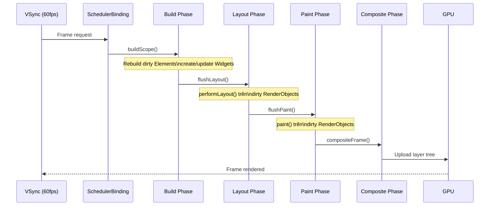
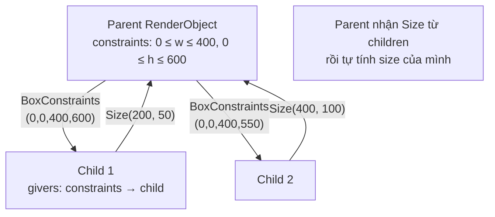

# Bài 2.5 — RenderObject & Layout Protocol

## Phần 1 — Khái Niệm & Mục Tiêu Bài Học

### 1.1 — Tại Sao Bài Này Quan Trọng?

Widget là "blueprint". Element là "cầu nối". Nhưng ai thực sự **đo**, **đặt vị trí**, và **vẽ** UI lên màn hình?

**RenderObject** — đây là tầng thực sự chạy khi bạn thấy pixel trên màn hình. Mọi developer Flutter đều gặp các lỗi phát sinh từ tầng này — nhưng ít người hiểu tại sao chúng xảy ra.

### 1.2 — Vấn Đề Cốt Lõi: "Widget Rebuild Rẻ, Nhưng Layout Không Rẻ — Và Chúng Là Hai Thứ Khác Nhau"

**Các pain point thực tế developer gặp hàng ngày — và nguyên nhân từ RenderObject:**

**Pain point 1: Yellow-black overflow stripe**
```
════════ Exception caught by rendering library ═══════════════
A RenderFlex overflowed by 42 pixels on the bottom.
```
→ Xảy ra vì `Column` nhận `unbounded height` từ parent (thường là `ListView` hoặc `SingleChildScrollView`) nhưng không biết cách tự giới hạn. RenderFlex cố layout children và phát hiện tổng size vượt quá constraint.

**Pain point 2: `setState()` không ảnh hưởng đến layout như mong đợi**
```dart
setState(() => _width = 200); // Tưởng rằng widget sẽ resize ngay
// Thực ra: Widget mới được tạo → updateRenderObject() → markNeedsLayout()
// → Layout KHÔNG xảy ra ngay, xảy ra tại VSync tiếp theo (16ms sau)
```

**Pain point 3: Nhầm lẫn `markNeedsLayout()` vs `setState()`**
```dart
// Trong custom RenderObject
set color(Color value) {
  _color = value;
  setState(() {}); // ❌ setState() không tồn tại trong RenderObject!
  markNeedsLayout(); // ✅ Đúng với RenderObject — nhưng đây là overkill nếu chỉ thay màu
  markNeedsPaint();  // ✅ Đúng hơn nếu chỉ visual thay đổi
}
```

**Pain point 4: `IntrinsicWidth` làm layout cực chậm**
```dart
// Developer thêm IntrinsicWidth để "fix" width mismatch
IntrinsicWidth(child: Column(children: [...]))
// Không biết rằng: IntrinsicWidth = 2 layout passes cho toàn subtree
// Với list phức tạp: O(n²) layout time → jank rõ ràng
```

**Tại sao không chỉ cần Widget?**

Widget rebuild rất rẻ — Widget là Dart object nhỏ, tạo/hủy hàng nghìn cái mỗi giây không vấn đề. Nhưng **layout và paint là tốn kém** — cần tính toán constraint, measure text, paint path. Flutter tách RenderObject ra để:

1. **Cache layout results**: RenderObject giữ `_cachedDryLayout`, `_cachedBaseline` — không tính lại nếu constraints chưa thay đổi
2. **Dirty propagation thông minh**: Chỉ re-layout những RenderObject bị ảnh hưởng, không re-layout cả tree
3. **Relayout boundary**: Một số RenderObject (`RepaintBoundary`, widget có fixed size) tạo ra "barrier" — dirty state không propagate qua đây

### 1.3 — Bạn Sẽ Hiểu Được Sau Bài Này:

- `RenderObject`, `RenderBox`, `RenderSliver` — phân cấp và khi nào dùng loại nào
- `performLayout()`, `paint()`, `hitTestSelf()` — ba trách nhiệm cốt lõi
- `markNeedsLayout()` vs `markNeedsPaint()` — khi nào dùng cái nào và tại sao
- `flushLayout()` trong render pipeline — flow từ setState đến pixel
- Khi nào cần viết custom `RenderObject` vs dùng `CustomPainter`

---

## Phần 2 — Cơ Chế Hoạt Động (Under the Hood)

### 2.1 — Định Nghĩa Chuyên Sâu: RenderObject

#### Định nghĩa:

`RenderObject` là **node trong Render Tree**, chịu trách nhiệm ba nhiệm vụ cốt lõi của UI rendering: **layout** (đo và xác định kích thước/vị trí), **paint** (vẽ pixel lên canvas), và **hit testing** (xác định widget nào nhận pointer event).

```dart
// Flutter source: rendering/object.dart
abstract class RenderObject extends AbstractNode
    with DiagnosticableTreeMixin {
  // Ba phương thức cốt lõi mà subclass phải implement:
  void performLayout();           // tính size/position của self và children
  void paint(PaintingContext context, Offset offset); // vẽ lên canvas
  bool hitTestSelf(Offset position); // hit test không bao gồm children
}
```

**Phân cấp RenderObject:**

```
RenderObject (abstract — định nghĩa layout/paint/hit-test protocol)
├── RenderBox                     — dùng BoxConstraints (width/height bounds)
│   ├── RenderProxyBox            — delegate mọi thứ cho single child
│   ├── RenderShiftedBox          — child + offset (Padding, Align...)
│   ├── RenderFlex                — Row, Column layout algorithm
│   ├── RenderStack               — Stack/Positioned algorithm
│   └── RenderCustomBox           — Custom widget extends này
└── RenderSliver                  — dùng SliverConstraints (scroll-aware)
    ├── RenderSliverList          — SliverList
    ├── RenderSliverGrid          — SliverGrid
    └── RenderSliverToBoxAdapter  — chuyển Box widget vào sliver context
```

#### Phân biệt ba loại chính:

| | `RenderObject` | `RenderBox` | `RenderSliver` |
|---|---|---|---|
| **Constraint type** | Abstract (tự định nghĩa) | `BoxConstraints` (minW, maxW, minH, maxH) | `SliverConstraints` (scroll extent, viewport) |
| **Size/geometry** | Tùy chỉnh | `Size` (width, height) | `SliverGeometry` (paint extent, scroll extent) |
| **Khi nào extend** | Hiếm — cần layout hoàn toàn custom | **Thông thường nhất** — mọi widget layout thường | Khi widget cần scroll-aware layout |
| **Ví dụ widget** | (internal) | Container, Row, Column, Stack | SliverList, SliverGrid, SliverAppBar |

#### Định nghĩa BoxConstraints:

`BoxConstraints` là kiểu constraint được truyền từ parent xuống child trong `RenderBox` layout:

```dart
class BoxConstraints {
  final double minWidth;   // child phải >= minWidth
  final double maxWidth;   // child phải <= maxWidth (có thể = infinity)
  final double minHeight;  // child phải >= minHeight
  final double maxHeight;  // child phải <= maxHeight (có thể = infinity)
}
```

**Ba loại BoxConstraints:**

| Loại | Điều kiện | Ý nghĩa | Ví dụ |
|---|---|---|---|
| **Tight** | `min == max` cho cả width và height | Parent ép child có đúng size | `SizedBox(100, 100)` truyền tight constraints |
| **Loose** | `min == 0`, `max` có giá trị | Child có thể nhỏ hơn tùy ý | `Column` truyền loose height cho children |
| **Unbounded** | `max == double.infinity` | Không giới hạn theo chiều đó | `ListView` truyền unbounded height xuống children |

> **Rule vàng:** Unbounded constraints + widget muốn fit content = OK. Unbounded constraints + widget muốn expand = **crash overflow**. Đây là nguồn gốc của lỗi "RenderFlex overflowed".

---

### 2.2 — Flutter Render Pipeline



### 2.3 — Layout Protocol — Constraints Down, Sizes Up



### 2.4 — markNeedsLayout Propagation

```
Widget gọi setState()
  → Element.markNeedsBuild()
    → Rebuild → Widget mới
      → Widget.updateRenderObject()
        → RenderObject.markNeedsLayout()
          → Propagate lên ancestor cho đến relayout boundary
            → Tại VSync tiếp theo: flushLayout() từ relayout boundary xuống
```

---

## Phần 3 — Code Mẫu Chuẩn Google

### 3.1 — Anatomy của RenderBox

```dart
// RenderBox = RenderObject dùng BoxConstraints (most common)
// Mọi Widget layout thông thường (Container, Row, Column...) đều là RenderBox

// Custom RenderBox đơn giản nhất
class RenderCustomBox extends RenderBox {
  String _text;
  TextPainter? _textPainter;

  RenderCustomBox({required String text}) : _text = text;

  set text(String value) {
    if (_text == value) return;
    _text = value;
    // Thông báo cần layout lại vì text thay đổi
    markNeedsLayout();
  }

  @override
  void performLayout() {
    // 1. Nhận constraints từ parent
    final constraints = this.constraints;
    // BoxConstraints có: minWidth, maxWidth, minHeight, maxHeight

    _textPainter = TextPainter(
      text: TextSpan(text: _text),
      textDirection: TextDirection.ltr,
    )..layout(maxWidth: constraints.maxWidth);

    // 2. Tính size của mình và báo cho parent
    size = constraints.constrain(Size(
      _textPainter!.width,
      _textPainter!.height,
    ));
    // constraints.constrain() đảm bảo size nằm trong constraints của parent
  }

  @override
  void paint(PaintingContext context, Offset offset) {
    // 3. Vẽ lên canvas với offset (vị trí do parent xác định)
    _textPainter?.paint(context.canvas, offset);
  }

  @override
  bool hitTestSelf(Offset position) {
    // 4. Click có hit widget này không?
    // position là tọa độ local (đã trừ offset của widget)
    return size.contains(position);
  }
}
```

### 3.2 — CustomPainter vs CustomRenderObject

```dart
// CustomPainter: chỉ custom PAINTING (vẽ), không custom layout
// Dùng khi: muốn vẽ graphics, chart, animation phức tạp
// Layout vẫn do parent RenderBox xử lý

class CircleChartPainter extends CustomPainter {
  final List<double> values;
  final List<Color> colors;

  const CircleChartPainter({required this.values, required this.colors});

  @override
  void paint(Canvas canvas, Size size) {
    final center = Offset(size.width / 2, size.height / 2);
    final radius = size.shortestSide / 2;
    var startAngle = -math.pi / 2; // Bắt đầu từ 12 giờ

    final total = values.fold(0.0, (sum, v) => sum + v);

    for (var i = 0; i < values.length; i++) {
      final sweepAngle = (values[i] / total) * 2 * math.pi;
      canvas.drawArc(
        Rect.fromCircle(center: center, radius: radius),
        startAngle,
        sweepAngle,
        true, // useCenter
        Paint()..color = colors[i % colors.length],
      );
      startAngle += sweepAngle;
    }
  }

  // Chỉ repaint khi values hoặc colors thay đổi
  @override
  bool shouldRepaint(CircleChartPainter old) =>
      !listEquals(values, old.values) || !listEquals(colors, old.colors);
}

// Cách dùng trong Widget tree
CustomPaint(
  size: const Size(200, 200),
  painter: CircleChartPainter(
    values: const [30, 50, 20],
    colors: const [Colors.red, Colors.blue, Colors.green],
  ),
)
```

### 3.3 — Đọc Layout Trace trong DevTools

```dart
// Thêm debug helpers để trace layout
class LayoutDebugger extends SingleChildRenderObjectWidget {
  final String name;
  const LayoutDebugger({super.key, required this.name, required super.child});

  @override
  RenderObject createRenderObject(BuildContext context) =>
      _RenderLayoutDebugger(name: name);
}

class _RenderLayoutDebugger extends RenderProxyBox {
  final String name;
  _RenderLayoutDebugger({required this.name});

  @override
  void performLayout() {
    super.performLayout(); // Delegate tới child

    // Log sau khi layout xong
    debugPrint('[$name] constraints: $constraints');
    debugPrint('[$name] size: $size');
  }

  @override
  void paint(PaintingContext context, Offset offset) {
    super.paint(context, offset);

    // Vẽ border để debug
    context.canvas.drawRect(
      offset & size, // & operator tạo Rect từ Offset và Size
      Paint()
        ..color = Colors.red.withOpacity(0.3)
        ..style = PaintingStyle.stroke
        ..strokeWidth = 1,
    );
  }
}
```

### 3.4 — RepaintBoundary — Isolate repaint

```dart
// RepaintBoundary tạo layer mới trong compositor
// Widget bên trong có thể repaint độc lập không ảnh hưởng parent

class AnimatedScoreWidget extends StatefulWidget {
  final int score;
  const AnimatedScoreWidget({super.key, required this.score});
  @override State<AnimatedScoreWidget> createState() => _AnimatedScoreState();
}

class _AnimatedScoreState extends State<AnimatedScoreWidget>
    with SingleTickerProviderStateMixin {
  late AnimationController _controller;
  late Animation<double> _scale;

  @override
  void initState() {
    super.initState();
    _controller = AnimationController(vsync: this, duration: const Duration(milliseconds: 200));
    _scale = Tween<double>(begin: 1, end: 1.3).animate(
      CurvedAnimation(parent: _controller, curve: Curves.elasticOut),
    );
  }

  @override
  void didUpdateWidget(AnimatedScoreWidget old) {
    super.didUpdateWidget(old);
    if (old.score != widget.score) {
      _controller.forward(from: 0); // Animation mỗi khi score thay đổi
    }
  }

  @override
  void dispose() {
    _controller.dispose();
    super.dispose();
  }

  @override
  Widget build(BuildContext context) {
    // RepaintBoundary: widget này repaint độc lập
    // Khi animation chạy → chỉ phần này repaint, không phải toàn màn hình
    return RepaintBoundary(
      child: ScaleTransition(
        scale: _scale,
        child: Text(
          '${widget.score}',
          style: const TextStyle(fontSize: 48, fontWeight: FontWeight.bold),
        ),
      ),
    );
  }
}
```

---

## Phần 4 — Lỗi Sai Phổ Biến & Best Practices

### ❌ Anti-pattern 1: Gọi `markNeedsLayout` vs `markNeedsPaint` sai

```dart
// ❌ Sai: Dùng markNeedsLayout khi chỉ cần repaint
// markNeedsLayout trigger cả layout VÀ paint — tốn hơn
class RenderColorBox extends RenderBox {
  Color _color;
  RenderColorBox({required Color color}) : _color = color;

  set color(Color value) {
    if (_color == value) return;
    _color = value;
    markNeedsLayout(); // ❌ Không cần layout lại — size không thay đổi
  }
}

// ✅ Đúng: Chỉ thay đổi màu → chỉ cần repaint
set color(Color value) {
  if (_color == value) return;
  _color = value;
  markNeedsPaint(); // ✅ Chỉ trigger paint phase
}

// Rule:
// - Thay đổi SIZE → markNeedsLayout() (bao gồm cả paint)
// - Chỉ thay đổi appearance → markNeedsPaint()
```

### ❌ Anti-pattern 2: Custom RenderObject khi CustomPainter là đủ

```dart
// ❌ Overkill: Custom RenderObject cho việc chỉ cần vẽ
class RenderLineChart extends RenderBox {
  List<double> _data;
  // 50 dòng code chỉ để vẽ line chart...
}

// ✅ Đúng: CustomPainter cho pure drawing task
class LineChartPainter extends CustomPainter {
  final List<double> data;
  const LineChartPainter({required this.data});

  @override
  void paint(Canvas canvas, Size size) {
    final paint = Paint()..color = Colors.blue..strokeWidth = 2;
    // Draw lines...
  }

  @override
  bool shouldRepaint(LineChartPainter old) => data != old.data;
}

// CustomPainter phù hợp: charts, signatures, games, drawings
// Custom RenderObject cần khi: custom layout logic, hit testing phức tạp
```

### ❌ Anti-pattern 3: Quên `constraints.constrain()` trong `performLayout()`

```dart
// ❌ Sai: Set size không qua constraints → có thể vi phạm parent constraints
@override
void performLayout() {
  size = Size(200, 100); // Hardcode! Sai nếu parent constraint nhỏ hơn
}

// ✅ Đúng: Luôn constrain size trong parent constraints
@override
void performLayout() {
  final desiredSize = Size(200, 100);
  size = constraints.constrain(desiredSize);
  // constrain() clamp size vào [min, max] của constraints
}
```

---

## Phần 5 — Bài Tập Củng Cố Tư Duy

### Challenge: Đọc Layout Trace trong DevTools

**Nhiệm vụ:**
1. Tạo app đơn giản với `LayoutDebugger` wrapper (code ở Phần 3.3)
2. Wrap một `Column` có `Text` và `ElevatedButton` bên trong
3. Chạy app và đọc console output — constraint nào được truyền vào Column?
4. Thêm `Expanded` vào một child — constraints thay đổi như thế nào?

**Câu hỏi:**
- Tại sao Column nhận `maxHeight = infinity` từ Scaffold body?
- Khi thêm `SizedBox(height: 100)` → constraint của Column thay đổi không?
- `RepaintBoundary` ảnh hưởng gì đến layout trace?

### Thử Thách Tư Duy & Thẩm Định Chuyên Sâu (Conceptual & Deep-Dive Check)

> **[Junior]** — nắm khái niệm | **[Middle]** — hiểu cơ chế | **[Senior]** — hiểu Flutter internals | **[Trace Code]** — đọc code và dự đoán output

---

#### Q1 [Junior] — "Ba giai đoạn trong Flutter render pipeline là gì?"

**Trả lời chuẩn:**

Flutter render pipeline có **3 giai đoạn chính** mỗi frame:

| Giai đoạn | Class chịu trách nhiệm | Làm gì |
|---|---|---|
| **Build** | `BuildOwner`, `Element` | Rebuild widget tree, reconcile element tree |
| **Layout** | `PipelineOwner`, `RenderObject` | Tính size và position cho mỗi RenderObject |
| **Paint** | `PipelineOwner`, `RenderObject` | Vẽ lên `PictureLayer` (Canvas) |

**Thứ tự:** Build → Layout → Paint → Composite (GPU)

Sau paint, Skia/Impeller nhận các layer và composite thành frame cuối. `RepaintBoundary` tạo layer riêng — layer này có thể được cached và reuse mà không cần repaint nếu không có gì thay đổi.

---

#### Q2 [Junior] — "Sự khác biệt giữa `markNeedsLayout()` và `markNeedsPaint()`?"

**Trả lời chuẩn:**

| | `markNeedsLayout()` | `markNeedsPaint()` |
|---|---|---|
| **Trigger** | Layout + Paint cả hai | Chỉ Paint |
| **Khi dùng** | Size hoặc position thay đổi | Chỉ visual thay đổi (color, opacity...) |
| **Chi phí** | Cao hơn (re-layout subtree) | Thấp hơn (chỉ repaint) |
| **Propagate** | Lên parent (parent cần re-layout nếu dùng child size) | Không propagate lên parent |

```dart
// Trong custom RenderObject
void changeColor(Color newColor) {
  _color = newColor;
  markNeedsPaint(); // ✅ Chỉ paint thay đổi, size không đổi
}

void changeSize(double newSize) {
  _size = newSize;
  markNeedsLayout(); // ✅ Size thay đổi → cần layout lại
}
```

---

#### Q3 [Middle] — "Khi nào dùng `CustomPainter` vs viết custom `RenderObject`?"

**Trả lời chuẩn:**

| | `CustomPainter` | Custom `RenderObject` |
|---|---|---|
| **Độ phức tạp** | Thấp — chỉ cần paint logic | Cao — implement full RenderBox protocol |
| **Layout control** | Không — parent quyết định size | Có — `performLayout()` tự tính size |
| **Hit testing** | Hạn chế | Đầy đủ — override `hitTest()` |
| **Use case** | Charts, custom shapes, drawings | Widgets với layout phức tạp (custom grid, physics) |

```dart
// CustomPainter — đủ cho hầu hết use case
class MyPainter extends CustomPainter {
  @override
  void paint(Canvas canvas, Size size) { /* draw */ }
  @override
  bool shouldRepaint(MyPainter old) => false;
}
// Dùng qua CustomPaint widget — parent quyết định size

// Custom RenderBox — khi cần kiểm soát layout
class MyRenderBox extends RenderBox {
  @override
  void performLayout() {
    size = constraints.constrain(const Size(200, 100)); // tự quyết size
  }
  @override
  void paint(PaintingContext context, Offset offset) { /* draw */ }
  @override
  bool hitTest(BoxHitTestResult result, {required Offset position}) {
    // custom hit testing
    return true;
  }
}
```

---

#### Q4 [Senior] — "Layout protocol chi tiết: `child.layout(constraints, parentUsesSize: ?)` — `parentUsesSize` ảnh hưởng gì?"

**Trả lời chuẩn:**

`parentUsesSize` là tham số quan trọng trong layout protocol quyết định **dependency relationship** giữa parent và child:

```dart
// Trong performLayout() của parent
child!.layout(
  constraints,
  parentUsesSize: true,  // parent sẽ dùng child.size để tính layout của mình
);
// Sau khi layout xong:
final childSize = child!.size; // an toàn vì parentUsesSize: true
```

**`parentUsesSize: true`:**
- Parent đăng ký dependency vào child size
- Khi child `markNeedsLayout()` → parent cũng bị `markNeedsLayout()` (propagate lên)
- Cần thiết khi parent tính position/size của mình dựa trên child size

**`parentUsesSize: false` (default):**
- Parent không quan tâm đến child size
- Child layout change không trigger parent re-layout
- Hiệu quả hơn vì isolate layout changes

```dart
// Ví dụ: Stack layout
// Non-positioned children: parent cần size → parentUsesSize: true
// Positioned children: parent không cần size → parentUsesSize: false
child.layout(childConstraints, parentUsesSize: !isPositioned);
```

---

#### Q5 [Middle] — "Tại sao `IntrinsicWidth`/`IntrinsicHeight` làm chậm layout?"

**Trả lời chuẩn:**

Flutter layout bình thường là **single-pass**: constraints đi xuống, sizes đi lên. Chỉ cần một lần traversal.

`IntrinsicWidth`/`IntrinsicHeight` yêu cầu **2 passes**:

**Pass 1 — Intrinsic measurement:** Hỏi child "nếu không bị constraint, mày muốn rộng bao nhiêu?" → Gọi `child.getMinIntrinsicWidth()` / `getMaxIntrinsicWidth()`. Đây là một layout pass riêng biệt trên toàn subtree.

**Pass 2 — Actual layout:** Layout thực sự với constraint đã tính được từ pass 1.

→ Toàn bộ subtree bên trong `IntrinsicWidth` bị layout **hai lần**. Với deep tree hoặc nhiều `IntrinsicWidth` lồng nhau → layout time O(n²).

```dart
// ❌ Tránh — 2-pass layout
IntrinsicWidth(
  child: Column(children: [...]) // column phức tạp → chậm
)

// ✅ Thay thế — specify width cụ thể
SizedBox(
  width: 200,
  child: Column(children: [...]) // single-pass
)
```

---

#### Q6 [Senior] — "Hit testing trong `RenderBox`: `hitTest()` algorithm hoạt động thế nào?"

**Trả lời chuẩn:**

Hit testing trong Flutter đi theo **thứ tự ngược với paint** (last-painted = top-most = first hit):

```dart
// RenderBox.hitTest() — default implementation
bool hitTest(BoxHitTestResult result, {required Offset position}) {
  if (size.contains(position)) {
    if (hitTestChildren(result, position: position) ||
        hitTestSelf(result, position: position)) {
      result.add(BoxHitTestEntry(this, position));
      return true;
    }
  }
  return false;
}
```

**Thứ tự:**
1. Check nếu `position` nằm trong bounding box
2. `hitTestChildren()` — hit test children TRƯỚC (depth-first, last child trước)
3. `hitTestSelf()` — nếu không có child nào nhận → check self
4. Nếu bất kỳ ai return true → thêm vào `HitTestResult`

**GestureDetector và Gesture Arena:** Khi hit test xong, `HitTestResult` chứa list các `HitTestEntry`. Gesture system đưa pointer events đến tất cả entries → mỗi `GestureRecognizer` tham gia Gesture Arena → một winner nhận toàn bộ gesture.

**HitTestBehavior:**
- `opaque`: luôn return true, chặn events đến widget phía sau
- `translucent`: return true nhưng cho phép events tiếp tục đến widget phía sau
- `deferToChild`: chỉ true nếu child nhận

---

#### Q7 [Trace Code] — "`CustomPainter.shouldRepaint()` trả về false/true — pipeline ảnh hưởng thế nào?"

```dart
class CounterPainter extends CustomPainter {
  final int count;
  CounterPainter(this.count);

  @override
  void paint(Canvas canvas, Size size) {
    print('Painting count: $count');
    canvas.drawCircle(size.center(Offset.zero), 50, Paint()..color = Colors.blue);
    final tp = TextPainter(
      text: TextSpan(text: '$count', style: const TextStyle(fontSize: 24)),
      textDirection: TextDirection.ltr,
    )..layout();
    tp.paint(canvas, size.center(Offset.zero));
  }

  @override
  bool shouldRepaint(CounterPainter old) {
    print('shouldRepaint: old=${old.count}, new=$count');
    return old.count != count; // chỉ repaint khi count thay đổi
  }
}

// Dùng trong StatefulWidget
CustomPaint(painter: CounterPainter(_count))
```

**Scenario A:** `_count` tăng từ 5 lên 6 (do setState). Output?

```
shouldRepaint: old=5, new=6
Painting count: 6
```
`shouldRepaint()` = true → Flutter gọi lại `paint()`.

**Scenario B:** Parent rebuild nhưng `_count` vẫn là 5 (ví dụ: parent có state khác thay đổi). Output?

```
shouldRepaint: old=5, new=5
```
`shouldRepaint()` = false → Flutter **SKIP** `paint()` → không in "Painting count". Canvas được reuse từ lần trước.

**Cơ chế:** `CustomPaint` widget tạo `RenderCustomPaint`. Khi widget được update, `RenderCustomPaint.didUpdateWidget()` kiểm tra `painter.shouldRepaint(oldPainter)`. Nếu false → không gọi `markNeedsPaint()` → paint layer được cache. Đây là tương đương `const` nhưng cho custom painting.
