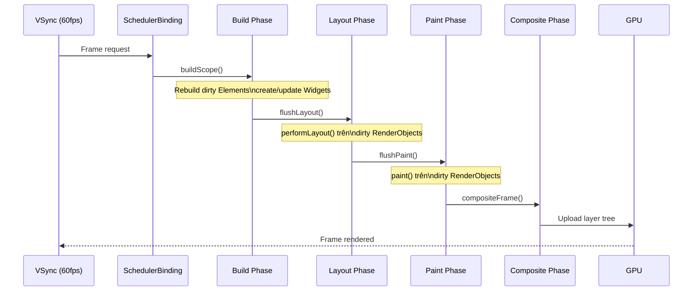
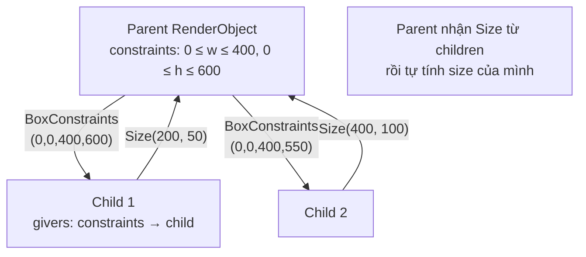

# Bài 2.5 — RenderObject & Layout Protocol

## Phần 1 — Khái Niệm & Mục Tiêu Bài Học

### Tại sao bài này quan trọng?

Widget là "blueprint". Element là "cầu nối". Nhưng ai thực sự **đo**, **đặt vị trí**, và **vẽ** UI lên màn hình?

**RenderObject** — đây là tầng thực sự chạy khi bạn thấy pixel trên màn hình.

Hiểu RenderObject giúp bạn:
- Debug layout issue phức tạp (overflow, zero-size, infinite constraint)
- Biết tại sao `markNeedsLayout()` không giống `setState()`
- Quyết định khi nào viết `CustomPainter` vs `CustomRenderObject`
- Đọc Flutter DevTools layout trace có ý nghĩa

### Bạn sẽ hiểu được sau bài này:
- `performLayout()`, `paint()`, `hitTestSelf()` — ba trách nhiệm của RenderObject
- `markNeedsLayout()` và dirty propagation chain
- `flushLayout()` trong render pipeline
- Khi nào cần viết custom RenderObject vs dùng CustomPainter

---

## Phần 2 — Cơ Chế Hoạt Động (Under the Hood)

### Flutter Render Pipeline



### Layout Protocol — Constraints Down, Sizes Up



### markNeedsLayout propagation

```
Widget gọi setState()
  → Element.markNeedsBuild()
    → Rebuild → Widget mới
      → Widget.updateRenderObject()
        → RenderObject.markNeedsLayout()
          → Propagate lên ancestor cho đến relayout boundary
            → Tại VSync tiếp theo: flushLayout() từ relayout boundary xuống
```

---

## Phần 3 — Code Mẫu Chuẩn Google

### 3.1 — Anatomy của RenderBox

```dart
// RenderBox = RenderObject dùng BoxConstraints (most common)
// Mọi Widget layout thông thường (Container, Row, Column...) đều là RenderBox

// Custom RenderBox đơn giản nhất
class RenderCustomBox extends RenderBox {
  String _text;
  TextPainter? _textPainter;

  RenderCustomBox({required String text}) : _text = text;

  set text(String value) {
    if (_text == value) return;
    _text = value;
    // Thông báo cần layout lại vì text thay đổi
    markNeedsLayout();
  }

  @override
  void performLayout() {
    // 1. Nhận constraints từ parent
    final constraints = this.constraints;
    // BoxConstraints có: minWidth, maxWidth, minHeight, maxHeight

    _textPainter = TextPainter(
      text: TextSpan(text: _text),
      textDirection: TextDirection.ltr,
    )..layout(maxWidth: constraints.maxWidth);

    // 2. Tính size của mình và báo cho parent
    size = constraints.constrain(Size(
      _textPainter!.width,
      _textPainter!.height,
    ));
    // constraints.constrain() đảm bảo size nằm trong constraints của parent
  }

  @override
  void paint(PaintingContext context, Offset offset) {
    // 3. Vẽ lên canvas với offset (vị trí do parent xác định)
    _textPainter?.paint(context.canvas, offset);
  }

  @override
  bool hitTestSelf(Offset position) {
    // 4. Click có hit widget này không?
    // position là tọa độ local (đã trừ offset của widget)
    return size.contains(position);
  }
}
```

### 3.2 — CustomPainter vs CustomRenderObject

```dart
// CustomPainter: chỉ custom PAINTING (vẽ), không custom layout
// Dùng khi: muốn vẽ graphics, chart, animation phức tạp
// Layout vẫn do parent RenderBox xử lý

class CircleChartPainter extends CustomPainter {
  final List<double> values;
  final List<Color> colors;

  const CircleChartPainter({required this.values, required this.colors});

  @override
  void paint(Canvas canvas, Size size) {
    final center = Offset(size.width / 2, size.height / 2);
    final radius = size.shortestSide / 2;
    var startAngle = -math.pi / 2; // Bắt đầu từ 12 giờ

    final total = values.fold(0.0, (sum, v) => sum + v);

    for (var i = 0; i < values.length; i++) {
      final sweepAngle = (values[i] / total) * 2 * math.pi;
      canvas.drawArc(
        Rect.fromCircle(center: center, radius: radius),
        startAngle,
        sweepAngle,
        true, // useCenter
        Paint()..color = colors[i % colors.length],
      );
      startAngle += sweepAngle;
    }
  }

  // Chỉ repaint khi values hoặc colors thay đổi
  @override
  bool shouldRepaint(CircleChartPainter old) =>
      !listEquals(values, old.values) || !listEquals(colors, old.colors);
}

// Cách dùng trong Widget tree
CustomPaint(
  size: const Size(200, 200),
  painter: CircleChartPainter(
    values: const [30, 50, 20],
    colors: const [Colors.red, Colors.blue, Colors.green],
  ),
)
```

### 3.3 — Đọc Layout Trace trong DevTools

```dart
// Thêm debug helpers để trace layout
class LayoutDebugger extends SingleChildRenderObjectWidget {
  final String name;
  const LayoutDebugger({super.key, required this.name, required super.child});

  @override
  RenderObject createRenderObject(BuildContext context) =>
      _RenderLayoutDebugger(name: name);
}

class _RenderLayoutDebugger extends RenderProxyBox {
  final String name;
  _RenderLayoutDebugger({required this.name});

  @override
  void performLayout() {
    super.performLayout(); // Delegate tới child

    // Log sau khi layout xong
    debugPrint('[$name] constraints: $constraints');
    debugPrint('[$name] size: $size');
  }

  @override
  void paint(PaintingContext context, Offset offset) {
    super.paint(context, offset);

    // Vẽ border để debug
    context.canvas.drawRect(
      offset & size, // & operator tạo Rect từ Offset và Size
      Paint()
        ..color = Colors.red.withOpacity(0.3)
        ..style = PaintingStyle.stroke
        ..strokeWidth = 1,
    );
  }
}
```

### 3.4 — RepaintBoundary — Isolate repaint

```dart
// RepaintBoundary tạo layer mới trong compositor
// Widget bên trong có thể repaint độc lập không ảnh hưởng parent

class AnimatedScoreWidget extends StatefulWidget {
  final int score;
  const AnimatedScoreWidget({super.key, required this.score});
  @override State<AnimatedScoreWidget> createState() => _AnimatedScoreState();
}

class _AnimatedScoreState extends State<AnimatedScoreWidget>
    with SingleTickerProviderStateMixin {
  late AnimationController _controller;
  late Animation<double> _scale;

  @override
  void initState() {
    super.initState();
    _controller = AnimationController(vsync: this, duration: const Duration(milliseconds: 200));
    _scale = Tween<double>(begin: 1, end: 1.3).animate(
      CurvedAnimation(parent: _controller, curve: Curves.elasticOut),
    );
  }

  @override
  void didUpdateWidget(AnimatedScoreWidget old) {
    super.didUpdateWidget(old);
    if (old.score != widget.score) {
      _controller.forward(from: 0); // Animation mỗi khi score thay đổi
    }
  }

  @override
  void dispose() {
    _controller.dispose();
    super.dispose();
  }

  @override
  Widget build(BuildContext context) {
    // RepaintBoundary: widget này repaint độc lập
    // Khi animation chạy → chỉ phần này repaint, không phải toàn màn hình
    return RepaintBoundary(
      child: ScaleTransition(
        scale: _scale,
        child: Text(
          '${widget.score}',
          style: const TextStyle(fontSize: 48, fontWeight: FontWeight.bold),
        ),
      ),
    );
  }
}
```

---

## Phần 4 — Lỗi Sai Phổ Biến & Best Practices

### ❌ Anti-pattern 1: Gọi `markNeedsLayout` vs `markNeedsPaint` sai

```dart
// ❌ Sai: Dùng markNeedsLayout khi chỉ cần repaint
// markNeedsLayout trigger cả layout VÀ paint — tốn hơn
class RenderColorBox extends RenderBox {
  Color _color;
  RenderColorBox({required Color color}) : _color = color;

  set color(Color value) {
    if (_color == value) return;
    _color = value;
    markNeedsLayout(); // ❌ Không cần layout lại — size không thay đổi
  }
}

// ✅ Đúng: Chỉ thay đổi màu → chỉ cần repaint
set color(Color value) {
  if (_color == value) return;
  _color = value;
  markNeedsPaint(); // ✅ Chỉ trigger paint phase
}

// Rule:
// - Thay đổi SIZE → markNeedsLayout() (bao gồm cả paint)
// - Chỉ thay đổi appearance → markNeedsPaint()
```

### ❌ Anti-pattern 2: Custom RenderObject khi CustomPainter là đủ

```dart
// ❌ Overkill: Custom RenderObject cho việc chỉ cần vẽ
class RenderLineChart extends RenderBox {
  List<double> _data;
  // 50 dòng code chỉ để vẽ line chart...
}

// ✅ Đúng: CustomPainter cho pure drawing task
class LineChartPainter extends CustomPainter {
  final List<double> data;
  const LineChartPainter({required this.data});

  @override
  void paint(Canvas canvas, Size size) {
    final paint = Paint()..color = Colors.blue..strokeWidth = 2;
    // Draw lines...
  }

  @override
  bool shouldRepaint(LineChartPainter old) => data != old.data;
}

// CustomPainter phù hợp: charts, signatures, games, drawings
// Custom RenderObject cần khi: custom layout logic, hit testing phức tạp
```

### ❌ Anti-pattern 3: Quên `constraints.constrain()` trong `performLayout()`

```dart
// ❌ Sai: Set size không qua constraints → có thể vi phạm parent constraints
@override
void performLayout() {
  size = Size(200, 100); // Hardcode! Sai nếu parent constraint nhỏ hơn
}

// ✅ Đúng: Luôn constrain size trong parent constraints
@override
void performLayout() {
  final desiredSize = Size(200, 100);
  size = constraints.constrain(desiredSize);
  // constrain() clamp size vào [min, max] của constraints
}
```

---

## Phần 5 — Bài Tập Củng Cố Tư Duy

### Challenge: Đọc Layout Trace trong DevTools

**Nhiệm vụ:**
1. Tạo app đơn giản với `LayoutDebugger` wrapper (code ở Phần 3.3)
2. Wrap một `Column` có `Text` và `ElevatedButton` bên trong
3. Chạy app và đọc console output — constraint nào được truyền vào Column?
4. Thêm `Expanded` vào một child — constraints thay đổi như thế nào?

**Câu hỏi:**
- Tại sao Column nhận `maxHeight = infinity` từ Scaffold body?
- Khi thêm `SizedBox(height: 100)` → constraint của Column thay đổi không?
- `RepaintBoundary` ảnh hưởng gì đến layout trace?

### Câu hỏi phỏng vấn liên quan:

1. **"Ba giai đoạn trong Flutter render pipeline?"**
   - Build: Tạo/update Widget → Element
   - Layout: Tính size và vị trí (performLayout)
   - Paint: Vẽ lên canvas (paint)

2. **"Sự khác biệt giữa `markNeedsLayout()` và `markNeedsPaint()`?"**
   - `markNeedsLayout()`: trigger cả layout lẫn paint (layout thay đổi size/position)
   - `markNeedsPaint()`: chỉ trigger paint (appearance thay đổi, size/position giữ nguyên)

3. **"Khi nào nên dùng `CustomPainter` vs viết custom `RenderObject`?"**
   - CustomPainter: chỉ cần custom drawing, layout do parent quyết định
   - Custom RenderObject: cần custom layout logic, hit testing, hoặc complex RenderBox protocol
