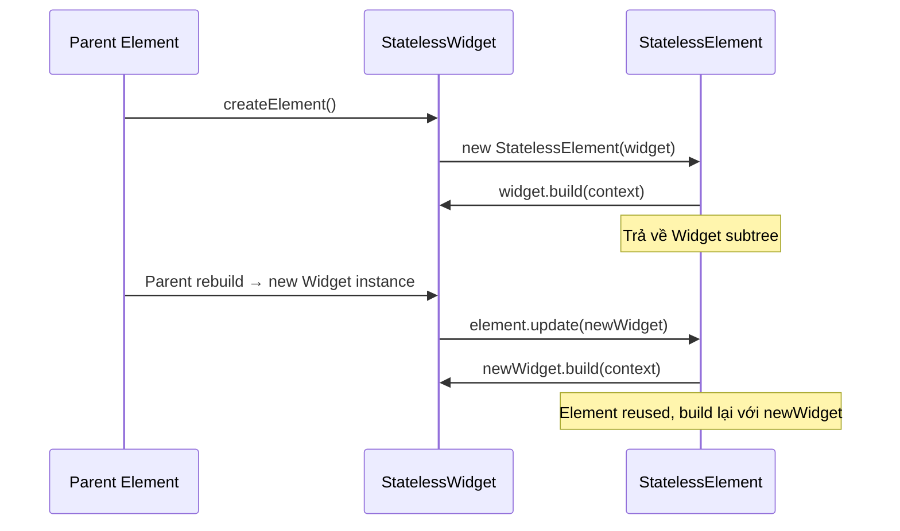
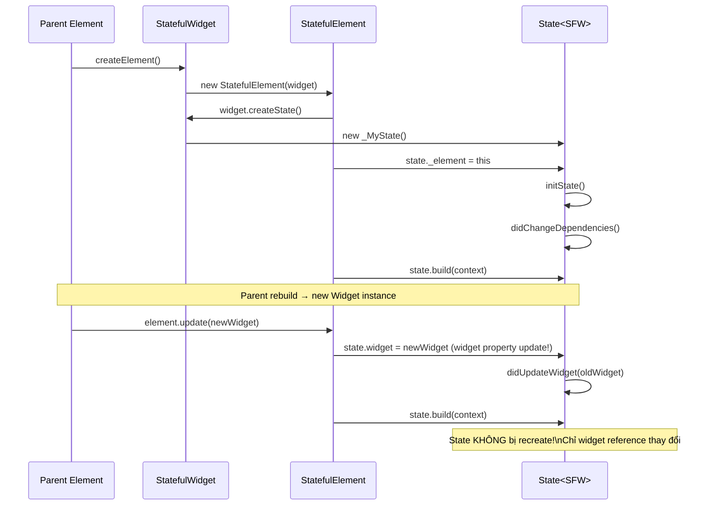

# Bài 3.1 — StatelessWidget vs StatefulWidget Internals

## Phần 1 — Khái Niệm & Mục Tiêu Bài Học

### Tại sao bài này quan trọng?

Câu hỏi phỏng vấn cơ bản: *"Sự khác biệt giữa StatelessWidget và StatefulWidget?"*

Câu trả lời ngây thơ: *"StatelessWidget không có State."*

Câu trả lời đúng: *"StatefulWidget có hai object — Widget (factory/config) và State (mutable data holder). Element giữ reference đến State, không phải Widget. Khi parent rebuild tạo Widget mới, Element reuse State cũ."*

Hiểu cơ chế này giải thích:
- Tại sao State không bị mất khi parent rebuild
- Tại sao đổi Widget property không tự động update State (cần `didUpdateWidget`)
- Khi nào nên dùng StatelessWidget vs StatefulWidget

### Bạn sẽ hiểu được sau bài này:
- `StatelessElement` và `StatefulElement` — hai loại Element khác nhau
- Widget chỉ là "factory" — State object mới là nơi sống lâu
- Lifecycle từ góc nhìn Element
- Decision tree: khi nào chọn Stateless vs Stateful

---

## Phần 2 — Cơ Chế Hoạt Động (Under the Hood)

### StatelessWidget — Đơn giản



### StatefulWidget — Phức tạp hơn



**Điểm quan trọng:**
- `State._element` = Element giữ State
- `State.widget` = current Widget config (cập nhật khi parent rebuild)
- State object tồn tại trong suốt lifecycle của Element

---

## Phần 3 — Code Mẫu Chuẩn Google

### 3.1 — StatelessWidget — Khi nào dùng

```dart
// StatelessWidget: UI chỉ phụ thuộc vào input (props)
// Không có internal mutable state
// build() là pure function của props + context

@immutable
class UserAvatar extends StatelessWidget {
  final String? imageUrl;
  final String initials;
  final double radius;
  final Color? backgroundColor;

  const UserAvatar({
    super.key,
    this.imageUrl,
    required this.initials,
    this.radius = 24,
    this.backgroundColor,
  });

  @override
  Widget build(BuildContext context) {
    final theme = Theme.of(context);
    final bg = backgroundColor ?? theme.colorScheme.primaryContainer;

    return CircleAvatar(
      radius: radius,
      backgroundColor: bg,
      backgroundImage: imageUrl != null ? NetworkImage(imageUrl!) : null,
      child: imageUrl == null
          ? Text(
              initials.toUpperCase(),
              style: TextStyle(
                color: theme.colorScheme.onPrimaryContainer,
                fontSize: radius * 0.7,
              ),
            )
          : null,
    );
  }
}

// StatelessWidget phù hợp khi:
// ✅ Chỉ display data — không modify
// ✅ Không cần subscribe to stream
// ✅ Không cần AnimationController
// ✅ Không cần init/dispose lifecycle
```

### 3.2 — StatefulWidget — Khi nào cần

```dart
// StatefulWidget: có internal mutable state
// State thay đổi theo user interaction hoặc time

class ExpandableCard extends StatefulWidget {
  final String title;
  final Widget content;

  const ExpandableCard({
    super.key,
    required this.title,
    required this.content,
  });

  // Widget chỉ là factory — không chứa state _isExpanded
  @override
  State<ExpandableCard> createState() => _ExpandableCardState();
}

class _ExpandableCardState extends State<ExpandableCard> {
  // State sống trong đây — không phải trong Widget
  bool _isExpanded = false;

  // widget.title: truy cập config từ Widget hiện tại
  // Tự động update khi parent truyền title mới (qua didUpdateWidget)
  @override
  Widget build(BuildContext context) {
    return Card(
      child: Column(
        children: [
          InkWell(
            onTap: () => setState(() => _isExpanded = !_isExpanded),
            child: Padding(
              padding: const EdgeInsets.all(16),
              child: Row(
                children: [
                  Expanded(child: Text(widget.title)),
                  Icon(_isExpanded ? Icons.expand_less : Icons.expand_more),
                ],
              ),
            ),
          ),
          AnimatedCrossFade(
            firstChild: const SizedBox.shrink(),
            secondChild: Padding(
              padding: const EdgeInsets.all(16),
              child: widget.content,
            ),
            crossFadeState: _isExpanded
                ? CrossFadeState.showSecond
                : CrossFadeState.showFirst,
            duration: const Duration(milliseconds: 200),
          ),
        ],
      ),
    );
  }
}
```

### 3.3 — `widget` property và `didUpdateWidget`

```dart
// widget property: tự động sync với latest Widget từ parent
// Không cần lưu thủ công, Dart Element xử lý

class TimerDisplay extends StatefulWidget {
  final Duration initialDuration;
  final bool isRunning; // Parent có thể pause/resume từ ngoài

  const TimerDisplay({
    super.key,
    required this.initialDuration,
    required this.isRunning,
  });

  @override
  State<TimerDisplay> createState() => _TimerDisplayState();
}

class _TimerDisplayState extends State<TimerDisplay> {
  late Duration _remaining;
  Timer? _timer;

  @override
  void initState() {
    super.initState();
    _remaining = widget.initialDuration; // Đọc từ widget lần đầu
    if (widget.isRunning) _startTimer();
  }

  @override
  void didUpdateWidget(TimerDisplay oldWidget) {
    super.didUpdateWidget(oldWidget);

    // Được gọi khi parent tạo Widget mới với config khác
    // oldWidget = Widget cũ, widget = Widget mới (tự động update)

    if (oldWidget.isRunning != widget.isRunning) {
      // isRunning thay đổi từ ngoài
      if (widget.isRunning) {
        _startTimer();
      } else {
        _stopTimer();
      }
    }

    if (oldWidget.initialDuration != widget.initialDuration) {
      // Duration reset từ ngoài
      _remaining = widget.initialDuration;
    }
  }

  void _startTimer() {
    _timer = Timer.periodic(const Duration(seconds: 1), (_) {
      if (!mounted) return;
      setState(() {
        if (_remaining.inSeconds > 0) {
          _remaining -= const Duration(seconds: 1);
        } else {
          _stopTimer();
        }
      });
    });
  }

  void _stopTimer() {
    _timer?.cancel();
    _timer = null;
  }

  @override
  void dispose() {
    _timer?.cancel(); // Luôn cancel timer!
    super.dispose();
  }

  @override
  Widget build(BuildContext context) {
    final minutes = _remaining.inMinutes.remainder(60).toString().padLeft(2, '0');
    final seconds = _remaining.inSeconds.remainder(60).toString().padLeft(2, '0');
    return Text('$minutes:$seconds',
        style: Theme.of(context).textTheme.displayMedium);
  }
}
```

### 3.4 — Decision Tree: Stateless vs Stateful

```dart
// Hỏi: Widget này cần gì?
// 1. Chỉ hiển thị data từ props? → StatelessWidget
// 2. Cần Track user interaction? → StatefulWidget
// 3. Cần start/stop something (timer, animation, stream)? → StatefulWidget
// 4. Nhưng state có thể hoist lên parent không? → Có thể vẫn Stateless

// Ví dụ: Form field — có thể là Stateless nếu controller từ parent
class NameField extends StatelessWidget {
  final TextEditingController controller; // Controller từ parent
  final String? errorText;

  const NameField({super.key, required this.controller, this.errorText});

  @override
  Widget build(BuildContext context) {
    return TextField(
      controller: controller,
      decoration: InputDecoration(
        labelText: 'Họ và tên',
        errorText: errorText,
      ),
    );
  }
}

// FormScreen là StatefulWidget — giữ controller và validation state
class FormScreen extends StatefulWidget {
  const FormScreen({super.key});
  @override State<FormScreen> createState() => _FormScreenState();
}

class _FormScreenState extends State<FormScreen> {
  final _nameController = TextEditingController();
  String? _nameError;

  @override
  void dispose() {
    _nameController.dispose();
    super.dispose();
  }

  @override
  Widget build(BuildContext context) {
    return Column(children: [
      NameField(
        controller: _nameController,
        errorText: _nameError,
      ),
    ]);
  }
}
```

---

## Phần 4 — Lỗi Sai Phổ Biến & Best Practices

### ❌ Anti-pattern 1: Lưu widget config trong State field

```dart
// ❌ Sai: Copy widget config vào State field → có thể stale
class _BadState extends State<MyWidget> {
  late String _title; // Copy từ widget.title

  @override
  void initState() {
    super.initState();
    _title = widget.title; // OK lần đầu
    // Nhưng nếu parent thay đổi widget.title → _title không update!
  }

  @override
  Widget build(BuildContext context) {
    return Text(_title); // Hiển thị title cũ!
  }
}

// ✅ Đúng: Đọc trực tiếp từ widget (tự động sync)
class _GoodState extends State<MyWidget> {
  @override
  Widget build(BuildContext context) {
    return Text(widget.title); // Luôn là giá trị mới nhất
  }
}

// Ngoại lệ: cần giá trị "snapshot" tại thời điểm mount
class _GoodStateWithSnapshot extends State<MyWidget> {
  late final String _initialTitle; // final → chỉ set một lần

  @override
  void initState() {
    super.initState();
    _initialTitle = widget.title; // Dùng làm "initial value"
  }
}
```

### ❌ Anti-pattern 2: StatefulWidget không cần thiết

```dart
// ❌ Sai: Dùng StatefulWidget khi Stateless là đủ
class _ProductTileState extends State<ProductTile> {
  // Không có state field nào!

  @override
  Widget build(BuildContext context) {
    return ListTile(
      title: Text(widget.product.name),
      subtitle: Text('${widget.product.price}đ'),
    );
  }
}

// ✅ Đúng: StatelessWidget
class ProductTile extends StatelessWidget {
  final Product product;
  const ProductTile({super.key, required this.product});

  @override
  Widget build(BuildContext context) {
    return ListTile(
      title: Text(product.name),
      subtitle: Text('${product.price}đ'),
    );
  }
}
```

---

## Phần 5 — Bài Tập Củng Cố Tư Duy

### Challenge: Giải thích tại sao State không bị mất khi parent rebuild

**Tình huống:**
```dart
class ParentWidget extends StatefulWidget { ... }
class _ParentState extends State<ParentWidget> {
  int _parentCount = 0;

  @override
  Widget build(BuildContext context) {
    return Column(children: [
      // Mỗi lần _parentCount thay đổi → ParentWidget rebuild
      // → Column tạo lại → ChildWidget tạo object mới
      ChildWidget(label: 'Count: $_parentCount'),
      ElevatedButton(
        onPressed: () => setState(() => _parentCount++),
        child: const Text('Increment parent'),
      ),
    ]);
  }
}

class ChildWidget extends StatefulWidget {
  final String label;
  const ChildWidget({super.key, required this.label});
  @override State<ChildWidget> createState() => _ChildWidgetState();
}

class _ChildWidgetState extends State<ChildWidget> {
  int _childCount = 0; // State riêng của child
  @override Widget build(BuildContext context) => Column(children: [
    Text(widget.label), // Update khi parent rebuild
    Text('Child count: $_childCount'), // Không bị reset!
    ElevatedButton(onPressed: () => setState(() => _childCount++), child: const Text('+1')),
  ]);
}
```

**Câu hỏi:**
1. Khi parent increment → child rebuild → `_childCount` có bị reset về 0 không? Tại sao?
2. `widget.label` trong child có update theo `_parentCount` không?
3. Nếu thêm `key: UniqueKey()` vào ChildWidget → kết quả thay đổi thế nào?

### Câu Hỏi Phỏng Vấn

> **[Junior]** — nắm khái niệm | **[Middle]** — hiểu cơ chế | **[Senior]** — hiểu Flutter internals | **[Trace Code]** — đọc code và dự đoán output

---

#### Q1 [Junior] — "Tại sao `Widget.createState()` trả về `State`, không phải Widget tự có State?"

**Trả lời chuẩn:**

Vì **Widget phải immutable** — đây là quy tắc căn bản của Flutter. Một Widget immutable không thể chứa mutable data như counter, text, v.v.

Thay vào đó, Flutter tách biệt:
- **Widget** = immutable config/blueprint (đặt trong tree)
- **State** = mutable data (được giữ bởi `StatefulElement`)

Khi `StatefulElement` lần đầu mount, nó gọi `widget.createState()` và giữ reference đến State object. Khi parent rebuild → tạo `StatefulWidget` mới → `StatefulElement.update(newWidget)` → State **không bị recreate** — chỉ `widget` property của State được cập nhật.

```
StatefulWidget (immutable, recreated mỗi rebuild)
    ↓ createState() — chỉ gọi 1 lần
StatefulElement (mutable, tồn tại suốt lifecycle)
    ↓ giữ reference
_MyState (mutable, tồn tại suốt lifecycle)
    → _count, _controller, v.v.
```

---

#### Q2 [Junior] — "Khi nào nên convert `StatelessWidget` thành `StatefulWidget`?"

**Trả lời chuẩn:**

Convert khi widget cần **một trong những điều sau**:

| Cần gì | Lý do cần StatefulWidget |
|---|---|
| Internal mutable state | `_count`, `_isSelected`, `_text` |
| Lifecycle hooks | `initState()`, `dispose()`, `didUpdateWidget()` |
| `AnimationController` | Cần `TickerProvider` (mixin) |
| `Timer` hoặc periodic task | Cần cleanup trong `dispose()` |
| Stream subscription | Cần cancel trong `dispose()` |
| Scroll controller | Cần `ScrollController()` và dispose |

**Nguyên tắc:** Bắt đầu với `StatelessWidget`. Convert sang `StatefulWidget` chỉ khi có lý do cụ thể ở trên. Đừng convert "phòng ngừa" — StatefulWidget có overhead hơn StatelessWidget.

---

#### Q3 [Middle] — "`didUpdateWidget` được gọi khi nào? Sử dụng thế nào cho đúng?"

**Trả lời chuẩn:**

`didUpdateWidget(T oldWidget)` được gọi khi:
- Parent rebuild → tạo Widget mới cùng `runtimeType + key` (→ `canUpdate()` = true)
- `StatefulElement.update(newWidget)` → `state.didUpdateWidget(oldWidget)` trước khi rebuild

**Use case điển hình — sync controller với prop mới:**

```dart
class VideoPlayer extends StatefulWidget {
  final String url;
  const VideoPlayer({super.key, required this.url});
  @override
  State<VideoPlayer> createState() => _VideoPlayerState();
}

class _VideoPlayerState extends State<VideoPlayer> {
  late VideoController _controller;

  @override
  void initState() {
    super.initState();
    _controller = VideoController(widget.url);
  }

  @override
  void didUpdateWidget(VideoPlayer oldWidget) {
    super.didUpdateWidget(oldWidget);
    // URL thay đổi → cần load lại video
    if (oldWidget.url != widget.url) {
      _controller.dispose();
      _controller = VideoController(widget.url);
    }
  }

  @override
  void dispose() {
    _controller.dispose();
    super.dispose();
  }
}
```

**Lưu ý:** Nếu không override `didUpdateWidget`, State sẽ dùng controller/data cũ khi prop thay đổi — đây là bug phổ biến.

---

#### Q4 [Senior] — "Khi parent rebuild, `StatefulWidget` child có bị recreate không? State có bị reset không?"

**Trả lời chuẩn:**

**Widget** bị recreate (tạo object mới), nhưng **State không bị reset**. Đây là điểm then chốt:

```
Parent.build() được gọi
  ↓ tạo ChildWidget() mới (object mới trên heap)
  ↓ Element.updateChild(oldChildElement, newChildWidget)
    ↓ canUpdate(oldChildElement.widget, newChildWidget) = true?
      YES → StatefulElement.update(newChildWidget)
              ↓ state._widget = newChildWidget  (cập nhật config)
              ↓ state.didUpdateWidget(oldWidget) (notify thay đổi)
              ↓ element.markNeedsBuild()
              → State._count, State._controller... KHÔNG ĐỔI
      NO  → element.unmount() + newChildWidget.createElement()
              → createState() được gọi lại → State MỚI → reset hoàn toàn
```

**Thực tế:** Vì parent thường tạo child widget với cùng `runtimeType` và không có key (hoặc cùng key), `canUpdate()` = true → State tồn tại bền vững qua mọi rebuild của parent. Đây là lý do ta có thể tin tưởng State không bị mất ngẫu nhiên.

---

#### Q5 [Middle] — "`mounted` property là gì? Tại sao async gap nguy hiểm?"

**Trả lời chuẩn:**

`State.mounted` trả về `true` khi State hiện đang được attach vào Element tree (giữa `initState()` và `dispose()`). Sau `dispose()`, `mounted = false`.

**Nguy hiểm của async gap:** Bất kỳ `await` nào đều tạo một "gap" — code sau `await` chạy trong một microtask/event sau đó. Trong khoảng thời gian này, widget có thể bị unmount (user navigate back, widget bị remove).

```dart
// ❌ Bug tiềm ẩn — crash hoặc setState after dispose
Future<void> loadData() async {
  final data = await repository.fetch();  // await tạo gap
  // Widget có thể đã dispose trong khi await
  setState(() => _data = data); // nếu disposed → crash trong debug, silent bug trong release
}

// ✅ Pattern an toàn
Future<void> loadData() async {
  final data = await repository.fetch();
  if (!mounted) return; // guard — kiểm tra trước khi dùng State
  setState(() => _data = data);
}
```

**Flutter lint:** `use_build_context_synchronously` sẽ warn về việc dùng `context` sau `await` mà không check `mounted`.

---

#### Q6 [Middle] — "`StatelessWidget.build()` vs `State.build()` — Framework gọi hai cái này khác nhau thế nào?"

**Trả lời chuẩn:**

| | `StatelessWidget.build()` | `State.build()` |
|---|---|---|
| **Gọi bởi** | `StatelessElement.build()` | `StatefulElement.build()` |
| **Khi nào** | Mỗi khi `StatelessElement` bị mark dirty | Mỗi khi `StatefulElement` bị mark dirty (qua setState, InheritedWidget thay đổi) |
| **Context là** | `StatelessElement` (chính nó) | `StatefulElement` (element của widget, không phải State) |
| **Return** | Widget mô tả UI | Widget mô tả UI |

```dart
// StatelessElement.build() — từ Flutter source (simplified)
@override
Widget build() => (widget as StatelessWidget).build(this);

// StatefulElement.build() — từ Flutter source (simplified)
@override
Widget build() => state.build(this); // gọi State.build, truyền self (element) làm context
```

Điểm khác biệt quan trọng: `StatefulElement` quản lý lifecycle của State, còn `StatelessElement` chỉ đơn giản delegate build về Widget. Với StatefulWidget, `context` trong `build(context)` là `StatefulElement` — element đại diện cho Widget, không phải cho State.

---

#### Q7 [Trace Code] — "Xác định lifecycle sequence khi parent thay đổi config của StatefulWidget child"

```dart
class Parent extends StatefulWidget {
  const Parent({super.key});
  @override
  State<Parent> createState() => _ParentState();
}

class _ParentState extends State<Parent> {
  int config = 0;
  @override
  Widget build(BuildContext context) => Column(children: [
    Child(config: config),
    ElevatedButton(
      onPressed: () => setState(() => config++),
      child: const Text('Change Config'),
    ),
  ]);
}

class Child extends StatefulWidget {
  final int config;
  const Child({super.key, required this.config});
  @override
  State<Child> createState() => _ChildState();
}

class _ChildState extends State<Child> {
  @override
  void initState() { super.initState(); print('initState'); }

  @override
  void didUpdateWidget(Child old) {
    super.didUpdateWidget(old);
    print('didUpdateWidget: ${old.config} → ${widget.config}');
  }

  @override
  void didChangeDependencies() {
    super.didChangeDependencies();
    print('didChangeDependencies');
  }

  @override
  Widget build(BuildContext context) { print('build'); return Text('${widget.config}'); }

  @override
  void dispose() { print('dispose'); super.dispose(); }
}
```

**Lần đầu load app:** `initState → didChangeDependencies → build`

**Nhấn button (config: 0→1):**
```
didUpdateWidget: 0 → 1
build
```
*(initState và didChangeDependencies KHÔNG được gọi lại — State được reuse)*

**Nếu đổi Child thành `Child(key: UniqueKey(), config: config)`, nhấn button:**
```
dispose          ← State cũ bị destroy
initState        ← State mới được tạo
didChangeDependencies
build
```
*(UniqueKey() tạo key mới mỗi rebuild → canUpdate() = false → createElement() → State mới)*
