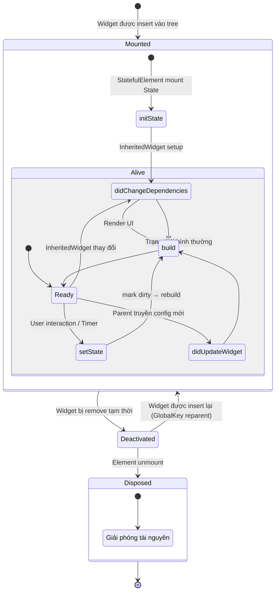

# Bài 3.2 — Vòng Đời Đầy Đủ của StatefulWidget

## Phần 1 — Khái Niệm & Mục Tiêu Bài Học

### Tại sao bài này quan trọng?

Lỗi memory leak phổ biến nhất trong Flutter:

```dart
class _MyState extends State<MyWidget> {
  StreamSubscription? _sub;

  @override
  void initState() {
    super.initState();
    _sub = someStream.listen((_) { /* ... */ }); // Subscribe
  }
  // QUÊN dispose() → Stream vẫn chạy sau khi widget unmount!
  // → Memory leak + setState after dispose
}
```

Hiểu đầy đủ lifecycle giúp bạn:
- Biết *đúng chỗ* để khởi tạo và giải phóng tài nguyên
- Tránh "calling setState after dispose" error
- Handle widget config change đúng cách qua `didUpdateWidget`
- Dùng InheritedWidget correctly qua `didChangeDependencies`

### Bạn sẽ hiểu được sau bài này:
- 7 phase lifecycle theo thứ tự đúng
- `super.initState()` phải là dòng đầu tiên, `super.dispose()` là dòng cuối
- `didUpdateWidget` vs `didChangeDependencies` — khác nhau như thế nào
- Implement stream subscription lifecycle hoàn chỉnh

---

## Phần 2 — Cơ Chế Hoạt Động (Under the Hood)

### Full State Lifecycle



### Thứ tự gọi super()

```
initState():
  super.initState()  ← PHẢI là dòng ĐẦU TIÊN
  _myInit()

dispose():
  _myCleanup()
  super.dispose()    ← PHẢI là dòng CUỐI CÙNG

Lý do: Flutter framework cần setup/teardown trước khi code của bạn chạy
```

---

## Phần 3 — Code Mẫu Chuẩn Google

### 3.1 — Template đầy đủ lifecycle

```dart
class FullLifecycleWidget extends StatefulWidget {
  final String userId;
  final bool isActive;

  const FullLifecycleWidget({
    super.key,
    required this.userId,
    required this.isActive,
  });

  @override
  State<FullLifecycleWidget> createState() => _FullLifecycleWidgetState();
}

class _FullLifecycleWidgetState extends State<FullLifecycleWidget> {
  // Tài nguyên cần cleanup
  StreamSubscription<UserData>? _userSub;
  Timer? _refreshTimer;
  late final TextEditingController _searchController;

  // State data
  UserData? _userData;
  String? _errorMessage;

  // ─── PHASE 1: initState ───────────────────────────────────────────────────
  @override
  void initState() {
    super.initState(); // BẮT BUỘC là dòng đầu tiên

    // ✅ Setup tài nguyên không cần context/InheritedWidget
    _searchController = TextEditingController();

    // ✅ Subscribe stream (với widget.userId có sẵn)
    _subscribeToUser(widget.userId);

    // ✅ Timer
    if (widget.isActive) _startRefreshTimer();

    // ❌ KHÔNG dùng Theme.of(context), Navigator.of(context)
    // ❌ KHÔNG gọi setState
    debugPrint('initState: userId=${widget.userId}');
  }

  // ─── PHASE 2: didChangeDependencies ──────────────────────────────────────
  @override
  void didChangeDependencies() {
    super.didChangeDependencies(); // Gọi trước

    // ✅ Dùng context để lấy InheritedWidget
    // Được gọi sau initState VÀ mỗi khi dependency (InheritedWidget) thay đổi
    final locale = Localizations.localeOf(context);
    debugPrint('didChangeDependencies: locale=$locale');

    // ✅ Có thể gọi setState hoặc update state ở đây
  }

  // ─── PHASE 3: build ───────────────────────────────────────────────────────
  @override
  Widget build(BuildContext context) {
    // Build phải là pure function của state + context
    // Không có side effects trong build!
    return switch ((_userData, _errorMessage)) {
      (final data?, null) => _buildContent(data),
      (null, final err?) => _buildError(err),
      _ => const CircularProgressIndicator(),
    };
  }

  Widget _buildContent(UserData data) => Column(
    children: [Text(data.name), Text(data.email)],
  );

  Widget _buildError(String error) => Text('Error: $error',
      style: const TextStyle(color: Colors.red));

  // ─── PHASE 4: didUpdateWidget ─────────────────────────────────────────────
  @override
  void didUpdateWidget(FullLifecycleWidget oldWidget) {
    super.didUpdateWidget(oldWidget); // Gọi trước

    // Được gọi khi parent rebuild truyền config mới
    // oldWidget = config cũ, widget = config mới (đã update)

    if (oldWidget.userId != widget.userId) {
      // userId thay đổi → cần unsubscribe cũ, subscribe mới
      _userSub?.cancel();
      _subscribeToUser(widget.userId);
    }

    if (oldWidget.isActive != widget.isActive) {
      if (widget.isActive) {
        _startRefreshTimer();
      } else {
        _refreshTimer?.cancel();
        _refreshTimer = null;
      }
    }
  }

  // ─── PHASE 5: deactivate ─────────────────────────────────────────────────
  @override
  void deactivate() {
    // Được gọi khi widget bị remove khỏi tree TẠMTHỜI
    // (ví dụ: GlobalKey reparenting)
    // Ít gặp — không cần override thường xuyên
    debugPrint('deactivate');
    super.deactivate();
  }

  // ─── PHASE 6: dispose ─────────────────────────────────────────────────────
  @override
  void dispose() {
    // Giải phóng tài nguyên TRƯỚC super.dispose()
    _userSub?.cancel();
    _refreshTimer?.cancel();
    _searchController.dispose();
    // Không gọi setState sau đây!

    super.dispose(); // BẮT BUỘC là dòng cuối cùng
    debugPrint('dispose: widget đã bị unmount');
  }

  // ─── Helper methods ───────────────────────────────────────────────────────
  void _subscribeToUser(String userId) {
    _userSub = UserRepository().watchUser(userId).listen(
      (data) {
        if (!mounted) return; // Guard sau async
        setState(() => _userData = data);
      },
      onError: (error) {
        if (!mounted) return;
        setState(() => _errorMessage = error.toString());
      },
    );
  }

  void _startRefreshTimer() {
    _refreshTimer = Timer.periodic(
      const Duration(minutes: 5),
      (_) {
        if (!mounted) return;
        // Refresh logic
      },
    );
  }
}
```

### 3.2 — Stream Subscription Lifecycle đúng cách

```dart
// Template chuẩn cho bất kỳ widget nào cần subscribe stream
class StreamConsumerWidget extends StatefulWidget {
  final Stream<List<Message>> messageStream;
  const StreamConsumerWidget({super.key, required this.messageStream});
  @override State<StreamConsumerWidget> createState() => _StreamConsumerState();
}

class _StreamConsumerState extends State<StreamConsumerWidget> {
  StreamSubscription<List<Message>>? _subscription;
  List<Message> _messages = [];

  @override
  void initState() {
    super.initState();
    _subscribe(widget.messageStream);
  }

  @override
  void didUpdateWidget(StreamConsumerWidget oldWidget) {
    super.didUpdateWidget(oldWidget);
    // Stream reference thay đổi → unsubscribe cũ, subscribe mới
    if (oldWidget.messageStream != widget.messageStream) {
      _subscription?.cancel();
      _subscribe(widget.messageStream);
    }
  }

  void _subscribe(Stream<List<Message>> stream) {
    _subscription = stream.listen(
      (messages) {
        if (!mounted) return;
        setState(() => _messages = messages);
      },
      onError: (e) => debugPrint('Stream error: $e'),
      cancelOnError: false, // Không cancel khi có error (reconnect tự động)
    );
  }

  @override
  void dispose() {
    _subscription?.cancel(); // QUAN TRỌNG: cancel trước super.dispose()
    super.dispose();
  }

  @override
  Widget build(BuildContext context) {
    return ListView.builder(
      itemCount: _messages.length,
      itemBuilder: (_, i) => MessageBubble(message: _messages[i]),
    );
  }
}
```

---

## Phần 4 — Lỗi Sai Phổ Biến & Best Practices

### ❌ Anti-pattern 1: `super.initState()` không phải dòng đầu

```dart
// ❌ Sai: Setup trước super() → framework chưa sẵn sàng
@override
void initState() {
  _controller = AnimationController(vsync: this); // vsync dùng TickerProvider
  super.initState(); // ❌ TickerProvider chưa được setup!
}

// ✅ Đúng
@override
void initState() {
  super.initState(); // Framework setup trước
  _controller = AnimationController(vsync: this); // Sau đó mới dùng
}
```

### ❌ Anti-pattern 2: `super.dispose()` không phải dòng cuối

```dart
// ❌ Sai: cleanup sau super() → framework đã teardown
@override
void dispose() {
  super.dispose();         // Framework teardown xong
  _controller.dispose();  // ❌ Framework state không còn valid
}

// ✅ Đúng
@override
void dispose() {
  _controller.dispose();  // Cleanup trước
  _subscription?.cancel();
  super.dispose();         // Framework teardown cuối
}
```

### ❌ Anti-pattern 3: setState sau dispose

```dart
// ❌ Sai: Callback từ async operation có thể chạy sau dispose
class _BadState extends State<MyWidget> {
  @override
  void initState() {
    super.initState();
    fetchData().then((data) {
      // fetchData mất 5 giây. Trong thời gian đó widget có thể dispose!
      setState(() => _data = data); // 💥 setState after dispose
    });
  }
}

// ✅ Đúng: Check mounted trước setState
Future<void> _load() async {
  final data = await fetchData();
  if (!mounted) return; // Guard!
  setState(() => _data = data);
}
```

### ❌ Anti-pattern 4: Quên cleanup trong dispose

```dart
// ❌ Sai: Không cancel subscription
@override
void initState() {
  super.initState();
  someStream.listen((data) => setState(() => _data = data));
  // Không lưu subscription → không cancel được!
}

// ✅ Đúng
StreamSubscription? _sub;

@override
void initState() {
  super.initState();
  _sub = someStream.listen((data) {
    if (!mounted) return;
    setState(() => _data = data);
  });
}

@override
void dispose() {
  _sub?.cancel();
  super.dispose();
}
```

---

## Phần 5 — Bài Tập Củng Cố Tư Duy

### Challenge: Implement Stream Subscription Lifecycle Đúng Cách

**Yêu cầu:** Xây dựng `ChatScreen` với:
1. Subscribe Firebase Firestore stream của room messages
2. Khi `roomId` thay đổi (user chọn room khác) → unsubscribe cũ, subscribe mới
3. Hiển thị loading trong lúc chờ data đầu tiên
4. Handle error gracefully
5. Cancel subscription khi navigate away

**Template bắt đầu:**
```dart
class ChatScreen extends StatefulWidget {
  final String roomId; // Có thể thay đổi
  const ChatScreen({super.key, required this.roomId});
  @override State<ChatScreen> createState() => _ChatScreenState();
}
```

**Gợi ý:** Dùng `ConnectionState` của `AsyncSnapshot` để track loading state, hoặc quản lý state riêng với field `_isLoading`.

### Câu Hỏi Phỏng Vấn

> **[Junior]** — nắm khái niệm | **[Middle]** — hiểu cơ chế | **[Senior]** — hiểu Flutter internals | **[Trace Code]** — đọc code và dự đoán output

---

#### Q1 [Junior] — "Thứ tự lifecycle methods khi widget mount lần đầu là gì?"

**Trả lời chuẩn:**

```
StatefulWidget.createState()          // tạo State object
    ↓
State.initState()                     // setup: controller, timer, subscription
    ↓
State.didChangeDependencies()         // lần đầu: safe để dùng context.watch()
    ↓
State.build(context)                  // tạo UI lần đầu
    ↓
[User interactions / parent rebuilds]
    ↓
State.didUpdateWidget(oldWidget)?     // nếu parent rebuild với config mới
State.didChangeDependencies()?        // nếu InheritedWidget thay đổi
State.build(context)                  // rebuild UI
    ↓
State.deactivate()                    // widget rời khỏi tree (navigate away)
    ↓
State.dispose()                       // cleanup: dispose controller, cancel sub
```

**Nhớ:** `initState` không thể dùng `context.watch()` / `dependOn`. `didChangeDependencies` là nơi an toàn đầu tiên để làm điều đó.

---

#### Q2 [Junior] — "Sự khác biệt giữa `didUpdateWidget` và `didChangeDependencies`?"

**Trả lời chuẩn:**

| | `didUpdateWidget(T oldWidget)` | `didChangeDependencies()` |
|---|---|---|
| **Trigger** | Parent rebuild tạo Widget mới (cùng type+key) | InheritedWidget mà widget phụ thuộc thay đổi |
| **Có old data** | Có — `oldWidget` là Widget trước đó | Không — cần so sánh tự thủ công |
| **Use case** | Sync internal resource khi config thay đổi | Re-fetch data khi locale/theme thay đổi |
| **Gọi sau** | Sau `element.update()` trước `build()` | Sau `initState()` (lần đầu) hoặc sau dependency change |

```dart
@override
void didUpdateWidget(VideoPlayer oldWidget) {
  super.didUpdateWidget(oldWidget);
  if (oldWidget.url != widget.url) { // config thay đổi
    _controller.load(widget.url);
  }
}

@override
void didChangeDependencies() {
  super.didChangeDependencies();
  // InheritedWidget thay đổi — an toàn để dùng context
  _locale = Localizations.localeOf(context);
}
```

---

#### Q3 [Middle] — "Tại sao `dispose()` cần cleanup TRƯỚC `super.dispose()`? Điều gì xảy ra nếu làm ngược?"

**Trả lời chuẩn:**

`super.dispose()` (tức là `State.dispose()` của Flutter framework) thực hiện:
- Teardown `TickerProvider` (nếu dùng `SingleTickerProviderStateMixin`)
- Clear bindings và mounted flag (`_debugLifecycleState = _StateLifecycle.defunct`)
- Sau đó `mounted` = false

Nếu cleanup **sau** `super.dispose()`:
```dart
// ❌ Sai — crash!
@override
void dispose() {
  super.dispose(); // ← mounted = false, TickerProvider torn down
  _controller.dispose(); // ← AnimationController cố stop Ticker đã torn down → assertion error
  _subscription.cancel(); // ← ok nhưng conceptually wrong
}

// ✅ Đúng — cleanup resources trước khi framework teardown
@override
void dispose() {
  _controller.dispose();    // dừng animation (Ticker vẫn còn hoạt động)
  _subscription.cancel();   // hủy stream
  _focusNode.dispose();     // release focus
  super.dispose();          // ← bây giờ mới teardown framework resources
}
```

**Quy tắc:** Bất cứ thứ gì bạn tạo trong `initState()` → dispose trong `dispose()` TRƯỚC `super.dispose()`.

---

#### Q4 [Senior] — "`didChangeDependencies()` được gọi khi nào chính xác? Tại sao nó chạy sau `initState()` lần đầu?"

**Trả lời chuẩn:**

`didChangeDependencies()` được gọi trong 2 trường hợp:

**1. Lần đầu sau `initState()`:** Đây là thiết kế của framework — `StatefulElement.mount()` gọi `initState()`, sau đó `firstBuild()`, sau đó `performRebuild()`, trong đó `performRebuild()` gọi `_updateInheritance()` → `didChangeDependencies()`. Mục đích: đảm bảo code phụ thuộc InheritedWidget có thể chạy ngay lần đầu build.

**2. Khi InheritedWidget thay đổi:** Khi `InheritedWidget.updateShouldNotify()` = true → Flutter mark tất cả dependents dirty → `Element.didChangeDependencies()` → `State.didChangeDependencies()` được gọi trước `build()` tiếp theo.

```dart
@override
void didChangeDependencies() {
  super.didChangeDependencies();
  // Chạy: (a) ngay sau initState, (b) khi Locale/Theme/Provider data thay đổi
  final locale = Localizations.localeOf(context); // an toàn ở đây
  if (_locale != locale) {
    _locale = locale;
    _reloadLocalizedContent(); // re-fetch khi ngôn ngữ thay đổi
  }
}
```

**Tối ưu:** Nếu logic expensive, hãy compare trước khi execute (như ví dụ trên) vì `didChangeDependencies` có thể được gọi nhiều lần.

---

#### Q5 [Middle] — "Hot reload ảnh hưởng đến lifecycle thế nào? `reassemble()` là gì?"

**Trả lời chuẩn:**

**Hot reload** (Ctrl+S / `r` trong flutter run) chỉ inject code mới vào Dart VM và rebuild widget tree — **không** restart app, không clear State.

Lifecycle khi hot reload:
```
reassemble()    // được gọi trên mọi State trong tree
    ↓
build()         // rebuild UI với code mới
```

`State.reassemble()` được design để override cho dev-time debugging:

```dart
@override
void reassemble() {
  super.reassemble();
  // Reset nội bộ giúp hot reload hoạt động tốt hơn
  // Ví dụ: image cache, custom data
  _cachedImage = null; // clear cache để load lại với code mới
}
```

**Hot restart** (`R` viết hoa) thì khác — restart hoàn toàn app, mọi State bị mất, lifecycle bắt đầu lại từ `main()`.

**Điểm quan trọng cho interview:** Nếu hot reload không cập nhật đúng (ví dụ: `initState` có logic quan trọng), bạn cần hot restart. `reassemble()` là hook để xử lý edge case này.

---

#### Q6 [Senior] — "`deactivate()` vs `dispose()` — khác biệt và khi nào mỗi cái được gọi?"

**Trả lời chuẩn:**

| | `deactivate()` | `dispose()` |
|---|---|---|
| **Khi nào** | Widget rời khỏi tree (tạm thời hoặc vĩnh viễn) | Widget bị permanently remove khỏi tree |
| **mounted** | Vẫn = true tại thời điểm gọi | Sau `super.dispose()` → mounted = false |
| **Có thể remount** | Có (GlobalKey reparenting, đang trong deactivated pool) | Không |
| **Thường override** | Hiếm | Thường — cleanup resources |

```
Navigate push new route:
  Old screen: deactivate() (nhưng KHÔNG dispose — vẫn trong stack)

Navigate pop:
  Old screen: deactivate() → dispose() (vĩnh viễn xóa)
  Previous screen: (được activate lại nếu đang trong deactivated state)
```

**GlobalKey reparenting:** Flutter có thể move Element từ tree position này sang position khác bằng `deactivate()` + remount. Đây là lý do GlobalKey cho phép "teleport" widget sang vị trí khác mà không mất State.

---

#### Q7 [Trace Code] — "Navigate to → tap back → navigate again: lifecycle methods nào được gọi?"

```dart
// Route A: HomeScreen
// Route B: DetailScreen — StatefulWidget với print trong mọi lifecycle method
class _DetailState extends State<DetailScreen> {
  @override void initState() { super.initState(); print('initState'); }
  @override void didChangeDependencies() { super.didChangeDependencies(); print('didChangeDependencies'); }
  @override void build(context) { print('build'); return const Scaffold(); }
  @override void deactivate() { super.deactivate(); print('deactivate'); }
  @override void dispose() { print('dispose'); super.dispose(); }
}
```

**Lần 1: Navigate từ Home → Detail:**
```
initState
didChangeDependencies
build
```

**Tap back (pop Detail):**
```
deactivate
dispose
```

**Lần 2: Navigate lại Home → Detail:**
```
initState           ← State hoàn toàn mới (lần trước đã dispose)
didChangeDependencies
build
```

**Điểm quan trọng:** Mỗi lần navigate đến route mới (push), một Element và State mới được tạo. Không có State nào được "cached" giữa các lần navigate (trừ khi dùng `AutomaticKeepAliveClientMixin` với PageView/TabBarView hoặc nested navigator).
