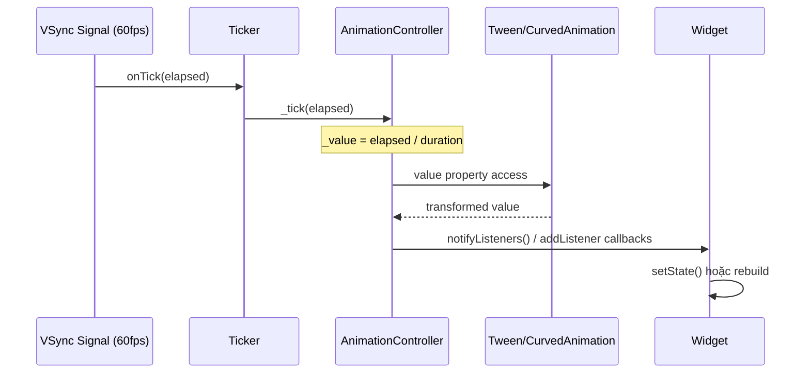

# Bài 3.4 — Ticker & AnimationController Lifecycle

## Phần 1 — Khái Niệm & Mục Tiêu Bài Học

### Tại sao bài này quan trọng?

Memory leak phổ biến thứ hai trong Flutter (sau stream subscription):

```dart
class _AnimatedState extends State<AnimatedWidget> {
  late AnimationController _controller;

  @override
  void initState() {
    super.initState();
    _controller = AnimationController(vsync: this, ...);
    // QUÊN dispose! → AnimationController giữ Ticker alive
    // → Ticker vẫn tick mỗi frame → memory leak + battery drain
  }
  // Không có dispose()!
}
```

Flutter sẽ cảnh báo bằng assertion error trong debug mode, nhưng trong release — nó sẽ âm thầm leak.

### Bạn sẽ hiểu được sau bài này:
- Ticker là gì — cầu nối giữa VSync và animation
- `TickerProviderStateMixin` vs `SingleTickerProviderStateMixin`
- AnimationController: `forward`, `reverse`, `repeat`, `stop`
- `addListener` vs `AnimatedBuilder` vs `AnimationBuilder` — khi nào dùng cái nào
- Tại sao `dispose()` AnimationController là bắt buộc

---

## Phần 2 — Cơ Chế Hoạt Động (Under the Hood)

### Ticker → AnimationController → Animation



### Ticker Lifecycle

```
Ticker:
  active (ticking)  ──[dispose]──►  disposed
       ↑                               
  [mixin setup in initState]          
       │                               
  paused (khi app background) ←→ active
```

**Tại sao VSync quan trọng:**
- Không có vsync: animation tick bất kể frame rate → lãng phí CPU
- Có vsync (TickerProvider): tick đồng bộ với frame rate của màn hình → smooth

---

## Phần 3 — Code Mẫu Chuẩn Google

### 3.1 — SingleTickerProviderStateMixin

```dart
// Dùng khi chỉ cần 1 AnimationController
class FadeInWidget extends StatefulWidget {
  final Widget child;
  const FadeInWidget({super.key, required this.child});
  @override State<FadeInWidget> createState() => _FadeInWidgetState();
}

class _FadeInWidgetState extends State<FadeInWidget>
    with SingleTickerProviderStateMixin {
  // SingleTickerProviderStateMixin: tạo 1 Ticker, vsync = this
  late final AnimationController _controller;
  late final Animation<double> _opacity;

  @override
  void initState() {
    super.initState();
    _controller = AnimationController(
      vsync: this, // this = mixin cung cấp Ticker
      duration: const Duration(milliseconds: 500),
    );

    // CurvedAnimation: apply easing curve lên controller (0.0 → 1.0 linear)
    _opacity = CurvedAnimation(
      parent: _controller,
      curve: Curves.easeIn,
    );

    // Auto-start animation khi widget mount
    _controller.forward();
  }

  @override
  void dispose() {
    // BẮT BUỘC: dispose AnimationController → cancel Ticker → giải phóng resource
    _controller.dispose();
    super.dispose();
  }

  @override
  Widget build(BuildContext context) {
    // FadeTransition listen animation → không cần setState
    return FadeTransition(
      opacity: _opacity,
      child: widget.child,
    );
  }
}
```

### 3.2 — TickerProviderStateMixin — Nhiều controllers

```dart
// Dùng khi cần 2+ AnimationController
class ComplexAnimationWidget extends StatefulWidget {
  const ComplexAnimationWidget({super.key});
  @override State<ComplexAnimationWidget> createState() => _ComplexAnimState();
}

class _ComplexAnimState extends State<ComplexAnimationWidget>
    with TickerProviderStateMixin {
  // TickerProviderStateMixin: tạo nhiều Ticker được
  late final AnimationController _slideController;
  late final AnimationController _fadeController;
  late final AnimationController _scaleController;

  late final Animation<Offset> _slideAnimation;
  late final Animation<double> _fadeAnimation;
  late final Animation<double> _scaleAnimation;

  @override
  void initState() {
    super.initState();

    _slideController = AnimationController(
      vsync: this, duration: const Duration(milliseconds: 600),
    );
    _fadeController = AnimationController(
      vsync: this, duration: const Duration(milliseconds: 400),
    );
    _scaleController = AnimationController(
      vsync: this, duration: const Duration(milliseconds: 500),
    );

    _slideAnimation = Tween<Offset>(
      begin: const Offset(0, 1), // Bắt đầu từ dưới
      end: Offset.zero,
    ).animate(CurvedAnimation(parent: _slideController, curve: Curves.elasticOut));

    _fadeAnimation = Tween<double>(begin: 0, end: 1)
        .animate(_fadeController);

    _scaleAnimation = Tween<double>(begin: 0.8, end: 1.0)
        .animate(CurvedAnimation(parent: _scaleController, curve: Curves.bounceOut));

    // Staggered: bắt đầu lần lượt
    _fadeController.forward();
    Future.delayed(const Duration(milliseconds: 100), () {
      if (mounted) _slideController.forward();
    });
    Future.delayed(const Duration(milliseconds: 200), () {
      if (mounted) _scaleController.forward();
    });
  }

  @override
  void dispose() {
    // Dispose tất cả controllers!
    _slideController.dispose();
    _fadeController.dispose();
    _scaleController.dispose();
    super.dispose();
  }

  @override
  Widget build(BuildContext context) {
    return SlideTransition(
      position: _slideAnimation,
      child: FadeTransition(
        opacity: _fadeAnimation,
        child: ScaleTransition(
          scale: _scaleAnimation,
          child: const Card(child: FlutterLogo(size: 100)),
        ),
      ),
    );
  }
}
```

### 3.3 — addListener vs AnimatedBuilder

```dart
class LoadingSpinner extends StatefulWidget {
  const LoadingSpinner({super.key});
  @override State<LoadingSpinner> createState() => _LoadingSpinnerState();
}

class _LoadingSpinnerState extends State<LoadingSpinner>
    with SingleTickerProviderStateMixin {
  late final AnimationController _controller;

  @override
  void initState() {
    super.initState();
    _controller = AnimationController(
      vsync: this,
      duration: const Duration(seconds: 1),
    )..repeat(); // Lặp vô hạn
  }

  @override
  void dispose() {
    _controller.dispose();
    super.dispose();
  }

  @override
  Widget build(BuildContext context) {
    // ❌ Cách 1: addListener + setState — rebuild TOÀN BỘ widget
    // (không dùng cách này cho animation loops)

    // ✅ Cách 2: AnimatedBuilder — chỉ rebuild phần trong builder
    return AnimatedBuilder(
      animation: _controller,
      // builder chỉ rebuild phần này, không rebuild parent
      builder: (context, child) {
        return Transform.rotate(
          angle: _controller.value * 2 * 3.14159,
          // child được pass xuống từ ngoài → không rebuild
          child: child,
        );
      },
      // child: Widget không thay đổi theo animation → optimize
      child: const Icon(Icons.refresh, size: 40),
    );
  }
}

// Cách 3: Dùng AnimationController trực tiếp trong Transition widgets
// FadeTransition, SlideTransition, ScaleTransition, RotationTransition
// → Hiệu năng tốt nhất, paint trực tiếp không qua rebuild
class OptimalSpinner extends StatefulWidget { ... }
class _OptimalSpinnerState extends State<OptimalSpinner>
    with SingleTickerProviderStateMixin {
  late final AnimationController _controller;

  @override
  void initState() {
    super.initState();
    _controller = AnimationController(vsync: this, duration: const Duration(seconds: 1))
      ..repeat();
  }

  @override
  void dispose() { _controller.dispose(); super.dispose(); }

  @override
  Widget build(BuildContext context) {
    // RotationTransition không cần rebuild → cực kỳ efficient
    return RotationTransition(
      turns: _controller, // Animation value 0.0 → 1.0 = 0 → 360 độ
      child: const Icon(Icons.refresh, size: 40),
    );
  }
}
```

### 3.4 — Control animation: forward, reverse, repeat

```dart
class ExpandableButton extends StatefulWidget {
  final String label;
  final VoidCallback onAction;
  const ExpandableButton({super.key, required this.label, required this.onAction});
  @override State<ExpandableButton> createState() => _ExpandableButtonState();
}

class _ExpandableButtonState extends State<ExpandableButton>
    with SingleTickerProviderStateMixin {
  late final AnimationController _controller;
  late final Animation<double> _widthFactor;

  bool _isExpanded = false;

  @override
  void initState() {
    super.initState();
    _controller = AnimationController(
      vsync: this,
      duration: const Duration(milliseconds: 300),
    );
    _widthFactor = Tween<double>(begin: 0.3, end: 1.0).animate(
      CurvedAnimation(parent: _controller, curve: Curves.easeInOut),
    );
  }

  @override
  void dispose() {
    _controller.dispose();
    super.dispose();
  }

  void _toggle() {
    setState(() => _isExpanded = !_isExpanded);
    if (_isExpanded) {
      _controller.forward();  // 0.0 → 1.0
    } else {
      _controller.reverse();  // 1.0 → 0.0
    }
  }

  @override
  Widget build(BuildContext context) {
    return AnimatedBuilder(
      animation: _controller,
      builder: (context, child) {
        return FractionallySizedBox(
          widthFactor: _widthFactor.value,
          child: child,
        );
      },
      child: ElevatedButton(
        onPressed: _toggle,
        child: Row(
          mainAxisAlignment: MainAxisAlignment.center,
          children: [
            Text(widget.label),
            Icon(_isExpanded ? Icons.close : Icons.arrow_forward),
          ],
        ),
      ),
    );
  }
}
```

---

## Phần 4 — Lỗi Sai Phổ Biến & Best Practices

### ❌ Anti-pattern 1: Quên dispose AnimationController

```dart
// ❌ Nguy hiểm: memory leak không lỗi rõ ràng
class _LeakyState extends State<MyWidget>
    with SingleTickerProviderStateMixin {
  late final AnimationController _controller;

  @override
  void initState() {
    super.initState();
    _controller = AnimationController(vsync: this, duration: const Duration(seconds: 1));
    _controller.repeat();
  }
  // Không có dispose() → Ticker vẫn tick mỗi frame → battery drain!

// ✅ Đúng: dispose bắt buộc
  @override
  void dispose() {
    _controller.dispose(); // Stop ticker, giải phóng resources
    super.dispose();
  }
}
```

### ❌ Anti-pattern 2: Dùng `TickerProviderStateMixin` cho 1 controller

```dart
// ❌ Không sai nhưng không optimal: TickerProviderStateMixin khi chỉ cần 1 ticker
class _BadState extends State<MyWidget> with TickerProviderStateMixin {
  late final AnimationController _controller; // Chỉ 1 controller

// ✅ Đúng: Single cho single controller
class _GoodState extends State<MyWidget> with SingleTickerProviderStateMixin {
  late final AnimationController _controller;
```

### ❌ Anti-pattern 3: addListener + setState cho animation

```dart
// ❌ Không optimal: setState mỗi frame → rebuild toàn bộ widget subtree
class _SlowAnimState extends State<MyWidget>
    with SingleTickerProviderStateMixin {
  late final AnimationController _controller;
  double _value = 0;

  @override
  void initState() {
    super.initState();
    _controller = AnimationController(vsync: this, duration: const Duration(seconds: 1));
    _controller.addListener(() {
      setState(() => _value = _controller.value); // Rebuild mỗi frame!
    });
    _controller.repeat();
  }

  @override
  Widget build(BuildContext context) {
    return Transform.rotate(angle: _value * 2 * 3.14, child: const Icon(Icons.star));
  }
}

// ✅ Đúng: AnimatedBuilder chỉ rebuild phần cần
class _FastAnimState extends State<MyWidget>
    with SingleTickerProviderStateMixin {
  late final AnimationController _controller;

  @override void initState() {
    super.initState();
    _controller = AnimationController(vsync: this, duration: const Duration(seconds: 1))
      ..repeat();
  }

  @override void dispose() { _controller.dispose(); super.dispose(); }

  @override
  Widget build(BuildContext context) {
    return AnimatedBuilder(
      animation: _controller,
      builder: (_, child) => Transform.rotate(
        angle: _controller.value * 2 * 3.14,
        child: child,
      ),
      child: const Icon(Icons.star), // Static child không rebuild
    );
  }
}
```

---

## Phần 5 — Bài Tập Củng Cố Tư Duy

### Challenge: Implement Loading Spinner với AnimationController

**Yêu cầu:**
1. Spinner quay vô hạn với `RotationTransition`
2. Có thể `start()` và `stop()` từ parent widget
3. Khi stop: animation fade out (opacity 1 → 0 trong 200ms)
4. Khi start: animation fade in và bắt đầu quay

**Thiết kế API:**
```dart
class LoadingSpinner extends StatefulWidget {
  final bool isLoading;
  const LoadingSpinner({super.key, required this.isLoading});
}
```

**Gợi ý:**
- Cần 2 AnimationController: một cho rotation, một cho fade
- Dùng `TickerProviderStateMixin` (không phải Single)
- Override `didUpdateWidget` để detect `isLoading` thay đổi

### Câu hỏi phỏng vấn liên quan:

1. **"Ticker là gì trong Flutter?"**
   - Object receive VSync callbacks và drive animation forward
   - TickerProvider tạo Ticker được sync với display refresh rate
   - Khi widget dispose → ticker phải stop để tránh memory leak

2. **"Sự khác biệt giữa `SingleTickerProviderStateMixin` và `TickerProviderStateMixin`?"**
   - Single: chỉ cấp 1 Ticker (cho 1 AnimationController)
   - Multi: cấp nhiều Ticker (cho nhiều AnimationController)
   - Single có assertion: tạo 2 controller sẽ throw error trong debug

3. **"Tại sao `AnimatedBuilder` tốt hơn `addListener + setState` cho animation?"**
   - setState rebuild toàn bộ subtree từ widget đó
   - AnimatedBuilder chỉ rebuild phần trong `builder` callback
   - Transition widgets (FadeTransition, SlideTransition) tốt nhất — paint layer trực tiếp, không rebuild Widget
