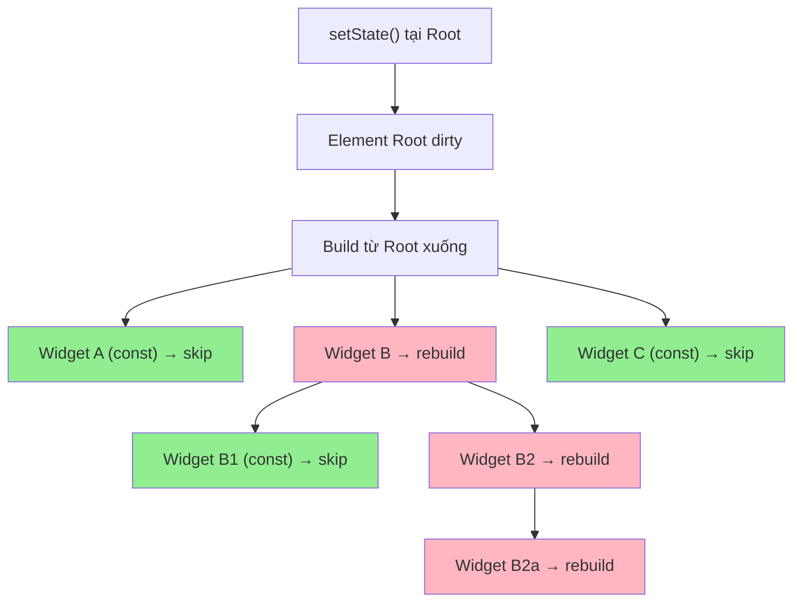

# Bài 3.5 — Widget Rebuild Optimization

## Phần 1 — Khái Niệm & Mục Tiêu Bài Học

### Tại sao bài này quan trọng?

Một Flutter app "chạy trơn" 60fps có nghĩa là mỗi frame phải hoàn thành trong 16ms. Rebuild không cần thiết ăn mất thời gian đó và gây jank.

**Vòng đời của một frame có jank:**
```
Frame 16ms budget:
├── Widget rebuild (30ms!) ← ĐÂY LÀ VẤN ĐỀ
├── Layout (3ms)
├── Paint (2ms)
└── Composite (1ms)
Total: 36ms → DROPPED FRAME → Jank!
```

Bài này tổng hợp mọi kỹ thuật tối ưu rebuild mà không cần thư viện bên ngoài.

### Bạn sẽ hiểu được sau bài này:
- `const` constructor — tối ưu hóa miễn phí
- `RepaintBoundary` — isolate paint layer
- `AutomaticKeepAliveClientMixin` — keep State sống khi scroll off screen
- `Builder` widget — tạo scope context mới
- Đo rebuild bằng `debugPrintRebuildDirtyWidgets` và Widget Inspector

---

## Phần 2 — Cơ Chế Hoạt Động (Under the Hood)

### Rebuild propagation



### RepaintBoundary — Layer isolation

```
Không có RepaintBoundary:
  Khi animation chạy → toàn bộ layer repaint
  ┌─────────────────────────────────────┐
  │         Main Layer (repaint all)    │
  │  Header | ProductList | Animation   │
  └─────────────────────────────────────┘

Với RepaintBoundary:
  Animation có layer riêng → chỉ layer đó repaint
  ┌──────────────────┐  ┌─────────────┐
  │  Header          │  │ Animation   │
  │  ProductList     │  │ Layer       │
  │  (không repaint) │  │ (repaint)   │
  └──────────────────┘  └─────────────┘
```

---

## Phần 3 — Code Mẫu Chuẩn Google

### 3.1 — const Constructor — Tối ưu miễn phí

```dart
// Rule: Nếu widget không có dynamic data → const
// Flutter optimizer: const Widget == const Widget → skip rebuild

class ProductScreen extends StatefulWidget {
  const ProductScreen({super.key});
  @override State<ProductScreen> createState() => _ProductScreenState();
}

class _ProductScreenState extends State<ProductScreen> {
  List<Product> _products = [];
  bool _isLoading = true;

  @override
  Widget build(BuildContext context) {
    return Scaffold(
      // const AppBar → không rebuild khi _products thay đổi
      appBar: AppBar(
        title: const Text('Sản Phẩm'), // const Text
        actions: const [
          Icon(Icons.search),
          SizedBox(width: 8),
        ],
      ),
      body: Column(
        children: [
          // const → không rebuild
          const Padding(
            padding: EdgeInsets.all(16),
            child: Text('Tất cả sản phẩm'),
          ),
          if (_isLoading)
            // const CircularProgressIndicator → không rebuild
            const Center(child: CircularProgressIndicator())
          else
            // ProductGrid nhận data dynamic → không const được
            // Nhưng bên trong ProductGrid có thể có const
            Expanded(child: _ProductGrid(products: _products)),
          // const footer → không rebuild
          const _Footer(),
        ],
      ),
    );
  }
}

// Static content → const constructor → never rebuild
class _Footer extends StatelessWidget {
  const _Footer();

  @override
  Widget build(BuildContext context) {
    return const ColoredBox(
      color: Color(0xFFF5F5F5),
      child: Padding(
        padding: EdgeInsets.all(16),
        child: Text('© 2025 Flutter App', textAlign: TextAlign.center),
      ),
    );
  }
}
```

### 3.2 — RepaintBoundary — Isolate heavy painter

```dart
class ProductListWithBadge extends StatelessWidget {
  final List<Product> products;
  final Animation<double> pulseAnimation; // Animation liên tục

  const ProductListWithBadge({
    super.key,
    required this.products,
    required this.pulseAnimation,
  });

  @override
  Widget build(BuildContext context) {
    return Stack(
      children: [
        // Danh sách sản phẩm — KHÔNG muốn repaint mỗi lần animation tick
        ListView.builder(
          itemCount: products.length,
          itemBuilder: (_, i) => ProductTile(product: products[i]),
        ),

        // Badge animation — Isolate trong layer riêng
        Positioned(
          right: 16,
          bottom: 16,
          child: RepaintBoundary(
            // Mọi repaint từ pulseAnimation chỉ xảy ra trong layer này
            // ListView bên ngoài không bị ảnh hưởng!
            child: AnimatedBuilder(
              animation: pulseAnimation,
              builder: (_, child) => Transform.scale(
                scale: pulseAnimation.value,
                child: child,
              ),
              child: FloatingActionButton(
                onPressed: () {},
                child: const Icon(Icons.add),
              ),
            ),
          ),
        ),
      ],
    );
  }
}

// RepaintBoundary tốt cho:
// ✅ Widget có animation/transition riêng
// ✅ Widget được update thường xuyên (chat bubble, timer, ticker)
// ✅ Widget lớn và phức tạp trong scrollable list
// ❌ Không nên dùng cho mọi widget — mỗi layer có overhead
```

### 3.3 — AutomaticKeepAliveClientMixin

```dart
// Vấn đề: PageView hoặc TabBarView dispose tab khi scroll away
// → State bị mất, phải load lại mỗi lần quay lại tab

class ProductTabContent extends StatefulWidget {
  final String category;
  const ProductTabContent({super.key, required this.category});
  @override State<ProductTabContent> createState() => _ProductTabContentState();
}

class _ProductTabContentState extends State<ProductTabContent>
    with AutomaticKeepAliveClientMixin {
  List<Product> _products = [];
  bool _loaded = false;

  @override
  void initState() {
    super.initState();
    _loadProducts();
  }

  Future<void> _loadProducts() async {
    final products = await ProductRepository().fetchByCategory(widget.category);
    if (!mounted) return;
    setState(() {
      _products = products;
      _loaded = true;
    });
  }

  // BẮT BUỘC override khi dùng AutomaticKeepAliveClientMixin
  // return true → State được giữ sống khi scroll off screen
  // return false → dispose bình thường
  @override
  bool get wantKeepAlive => _loaded; // Giữ sống khi đã load xong

  @override
  Widget build(BuildContext context) {
    super.build(context); // BẮT BUỘC gọi trong AutomaticKeepAliveClientMixin

    if (!_loaded) return const CircularProgressIndicator();
    return ListView.builder(
      itemCount: _products.length,
      itemBuilder: (_, i) => ProductTile(product: _products[i]),
    );
  }
}

// Dùng trong TabBarView
TabBarView(
  children: [
    ProductTabContent(category: 'electronics'),
    ProductTabContent(category: 'clothing'),
    ProductTabContent(category: 'books'),
    // Khi chuyển tab → tab cũ giữ State nếu wantKeepAlive = true
  ],
)
```

### 3.4 — Builder — Context scope mới

```dart
// Builder: tạo scope mới để có context phù hợp
// Và cũng giới hạn rebuild scope

class FormScreen extends StatefulWidget {
  const FormScreen({super.key});
  @override State<FormScreen> createState() => _FormScreenState();
}

class _FormScreenState extends State<FormScreen> {
  final _formKey = GlobalKey<FormState>();
  bool _isSubmitting = false;

  @override
  Widget build(BuildContext context) {
    return Scaffold(
      appBar: AppBar(title: const Text('Form')),
      body: Form(
        key: _formKey,
        child: Column(
          children: [
            const _StaticFormHeader(), // const → không rebuild
            const TextFormField(), // const nếu không cần controller từ ngoài
            // Builder: Nếu submit button cần context của Form
            // hoặc muốn giới hạn rebuild chỉ button khi _isSubmitting thay đổi
            Builder(
              builder: (formContext) {
                return ElevatedButton(
                  onPressed: _isSubmitting ? null : () => _submit(formContext),
                  child: _isSubmitting
                      ? const SizedBox(
                          width: 20, height: 20,
                          child: CircularProgressIndicator(strokeWidth: 2),
                        )
                      : const Text('Submit'),
                );
              },
            ),
          ],
        ),
      ),
    );
  }

  Future<void> _submit(BuildContext formContext) async {
    if (!(_formKey.currentState?.validate() ?? false)) return;

    setState(() => _isSubmitting = true);
    try {
      await _sendData();
      if (!mounted) return;
      ScaffoldMessenger.of(context).showSnackBar(
        const SnackBar(content: Text('Thành công!')),
      );
    } finally {
      if (mounted) setState(() => _isSubmitting = false);
    }
  }

  Future<void> _sendData() async {
    await Future.delayed(const Duration(seconds: 2));
  }
}

class _StaticFormHeader extends StatelessWidget {
  const _StaticFormHeader();
  @override
  Widget build(BuildContext context) {
    return const Padding(
      padding: EdgeInsets.all(24),
      child: Column(
        children: [
          Icon(Icons.edit_document, size: 48),
          SizedBox(height: 8),
          Text('Điền thông tin', style: TextStyle(fontSize: 20)),
        ],
      ),
    );
  }
}
```

### 3.5 — Đo rebuild bằng tools

```dart
void main() {
  // Option 1: Bật global rebuild logging
  // debugPrintRebuildDirtyWidgets = true;

  runApp(const MyApp());
}

// Option 2: Wrap widget muốn track
class RebuildCounter extends StatelessWidget {
  final String name;
  final Widget child;
  static final Map<String, int> _counts = {};

  const RebuildCounter({super.key, required this.name, required this.child});

  @override
  Widget build(BuildContext context) {
    _counts[name] = (_counts[name] ?? 0) + 1;
    if (kDebugMode) {
      print('[$name] rebuild #${_counts[name]}');
    }
    return child;
  }
}

// Dùng:
RebuildCounter(
  name: 'ProductList',
  child: ProductList(products: products),
)
```

---

## Phần 4 — Lỗi Sai Phổ Biến & Best Practices

### ❌ Anti-pattern 1: RepaintBoundary quá nhiều chỗ

```dart
// ❌ Sai: Wrap mọi widget bằng RepaintBoundary
Widget build(BuildContext context) {
  return Column(children: [
    RepaintBoundary(child: Text('Hello')),    // Không cần
    RepaintBoundary(child: Icon(Icons.star)), // Không cần
    RepaintBoundary(child: const SizedBox()), // Vô nghĩa!
  ]);
}
// Mỗi RepaintBoundary tạo layer mới → overhead bộ nhớ + composite time

// ✅ Đúng: Chỉ dùng khi có animation riêng hoặc widget update thường xuyên
RepaintBoundary(
  child: AnimatedWidget(...), // Có animation → isolation có ý nghĩa
)
```

### ❌ Anti-pattern 2: AutomaticKeepAlive mọi Tab

```dart
// ❌ Sai: wantKeepAlive = true luôn → mọi tab giữ State → tốn memory
@override
bool get wantKeepAlive => true; // Không phân biệt trường hợp

// ✅ Đúng: Chỉ keep alive khi đã load xong và có data cần giữ
@override
bool get wantKeepAlive => _products.isNotEmpty && _errorMessage == null;
```

### ❌ Anti-pattern 3: Bỏ `super.build(context)` trong AutomaticKeepAlive

```dart
// ❌ Sai: Quên super.build() → mixin không hoạt động → State bị dispose
@override
Widget build(BuildContext context) {
  // super.build(context); ← QUÊN!
  return ListView.builder(...);
}

// ✅ Đúng
@override
Widget build(BuildContext context) {
  super.build(context); // PHẢI gọi đầu tiên
  return ListView.builder(...);
}
```

---

## Phần 5 — Bài Tập Củng Cố Tư Duy

### Challenge: Optimize Product List Screen — 50 Rebuild → <5

**Setup:**

Tạo màn hình có:
- Header với thông tin user (Avatar + name)
- Search bar
- Danh sách 20 products
- Floating Action Button với badge count
- Bottom navigation

Bật `debugPrintRebuildDirtyWidgets = true`.

**Kịch bản test:**
1. Gõ vào search bar → bao nhiêu widget rebuild?
2. Nhấn FAB (badge count++) → bao nhiêu widget rebuild?
3. Navigate tab → bao nhiêu widget rebuild?

**Nhiệm vụ:**
1. Tách State phù hợp vào widget con
2. Thêm `const` nơi có thể
3. Thêm `RepaintBoundary` cho FAB badge animation
4. Dùng `AutomaticKeepAlive` cho product list per tab
5. Đo lại → target <5 rebuild cho mỗi action

### Thử Thách Tư Duy & Thẩm Định Chuyên Sâu (Conceptual & Deep-Dive Check)

> **[Junior]** — nắm khái niệm | **[Middle]** — hiểu cơ chế | **[Senior]** — hiểu Flutter internals | **[Trace Code]** — đọc code và dự đoán output

---

#### Q1 [Junior] — "Flutter tối ưu hóa rebuild như thế nào? Liệt kê các cơ chế chính."

**Trả lời chuẩn:**

Flutter có **4 cơ chế tối ưu rebuild** chính:

| Cơ chế | Cách hoạt động | Khi áp dụng |
|---|---|---|
| **`const` widget** | `identical(old, new)` = true → skip toàn bộ subtree | Widget không có dynamic data |
| **Element reuse** | `canUpdate()` = true → `update()` thay vì `createElement()` | Luôn xảy ra khi cùng type+key |
| **Dirty marking** | Chỉ dirty elements mới rebuild, không phải toàn tree | Tự động qua `setState()` |
| **`RepaintBoundary`** | Cô lập paint scope → layer riêng được cache | Widget animate/update thường xuyên |

**Quan trọng nhất cho developer:** `const` và `RepaintBoundary`. Element reuse và dirty marking là tự động — framework làm cho bạn.

---

#### Q2 [Junior] — "Khi nào nên dùng `RepaintBoundary`? Khi nào không nên?"

**Trả lời chuẩn:**

**Nên dùng khi:**
- Widget chứa animation chạy liên tục (animation clock, loading spinner)
- Widget update với tần suất cao (realtime chart, video frame)
- Widget có `CustomPainter` heavy và thay đổi độc lập với phần còn lại

```dart
// Widget đếm thời gian — update mỗi giây
RepaintBoundary(
  child: TimerDisplay(), // chỉ layer này repaint mỗi giây
)
// Phần còn lại của screen không bị ảnh hưởng
```

**Không nên dùng khi:**
- Widget ít thay đổi — overhead của layer cao hơn lợi ích
- Mỗi `RepaintBoundary` tốn memory (GPU texture)
- Đặt quá nhiều boundary → fragmented layers → composite overhead

**Nguyên tắc:** Flutter DevTools → Repaint Rainbow sẽ show vùng nào đang repaint. Chỉ thêm `RepaintBoundary` khi thấy unnecessary repaint qua profiling.

---

#### Q3 [Middle] — "`const` widget trong list: mỗi item cần `const` hay cả `ListView` cần `const`?"

**Trả lời chuẩn:**

**`ListView` không thể `const`** vì nó nhận `children` là List — list items thường là runtime data. Nhưng **từng item có thể `const`** nếu item không có dynamic data:

```dart
// ❌ Toàn bộ ListView không const được (children từ model)
ListView(
  children: items.map((item) => ListTile(title: Text(item.name))).toList(),
)

// ✅ Items static → const từng item
ListView(
  children: const [
    ListTile(title: Text('Settings')), // const
    ListTile(title: Text('Profile')),  // const
    Divider(),                         // const
  ],
)

// ✅ Mix: item static → const, item dynamic → không
ListView(
  children: [
    const ListTile(title: Text('Static')), // const
    ListTile(title: Text(dynamicTitle)),   // không const
  ],
)
```

**Với `ListView.builder`:** Builder function chạy mỗi khi item được scrolled into view. Nếu item hoàn toàn static, có thể cache widget instance thay vì dùng `const` trong builder.

---

#### Q4 [Senior] — "`RepaintBoundary` tạo layer riêng thế nào? Layer tree vs Widget tree?"

**Trả lời chuẩn:**

Flutter duy trì **2 cây riêng biệt** cho rendering:

```
Widget Tree         Element Tree        RenderObject Tree       Layer Tree
(blueprint)         (lifecycle)         (layout/paint logic)    (GPU composite)

RepaintBoundary  →  RenderRepaintBoundary                    → OffsetLayer (composite layer)
  └─ Column      →  RenderFlex         → [paint vào layer]   → PictureLayer
      └─ Text     → RenderParagraph    → [paint vào layer]   → (same PictureLayer)
```

Khi `RepaintBoundary` tạo `OffsetLayer` (composite layer), nội dung bên trong được render vào một `Picture` riêng. Flutter GPU compositor nhận các layer này và composite chúng. Nếu nội dung của `OffsetLayer` không thay đổi, Flutter **reuse cached texture** từ GPU — không cần repaint.

```
Frame N:   RepaintBoundary content thay đổi → repaint PictureLayer → upload texture mới lên GPU
Frame N+1: Content không thay đổi → reuse GPU texture → cost ≈ 0
```

**Overhead:** Mỗi composite layer cần một GPU texture allocation. Nhiều layer → nhiều texture → VRAM pressure. Cân nhắc tradeoff repaint cost vs VRAM cost.

---

#### Q5 [Middle] — "Cách đo rebuild thực tế trong Flutter? Tools nào hỗ trợ?"

**Trả lời chuẩn:**

**1. Flutter DevTools — Performance tab:**
```
flutter run --profile
# Mở DevTools → Performance → Record
# Xem "UI thread" → tìm "build" events
```

**2. Debug flags (chỉ debug mode):**
```dart
// In ra mọi widget rebuild khi dirty
import 'package:flutter/rendering.dart';
debugPrintRebuildDirtyWidgets = true;

// Highlight vùng repaint (Flutter DevTools tích hợp)
// Hoặc: debugRepaintRainbowEnabled = true;
```

**3. Widget Inspector → Highlight Repaints:**
- Flutter DevTools → Widget Inspector → "Highlight Repaints"
- Vùng đang repaint sẽ được highlighted với màu random

**4. Custom profiling:**
```dart
class TrackedWidget extends StatelessWidget {
  @override
  Widget build(BuildContext context) {
    debugPrint('TrackedWidget build: ${DateTime.now()}');
    return const Text('Hello');
  }
}
```

---

#### Q6 [Middle] — "`AutomaticKeepAliveClientMixin` hoạt động thế nào? Khi nào cần `super.build(context)`?"

**Trả lời chuẩn:**

`AutomaticKeepAliveClientMixin` giữ State sống khi widget bị scrolled off viewport trong `PageView`, `TabBarView`, hoặc `ListView` với keepAlive.

```dart
class _MyTabState extends State<MyTab>
    with AutomaticKeepAliveClientMixin {
  
  @override
  bool get wantKeepAlive => true; // ← signal: giữ Element sống

  @override
  Widget build(BuildContext context) {
    super.build(context); // ← PHẢI gọi — mixin dùng để notify parent
    return const Text('Tab content');
  }
}
```

**Tại sao phải gọi `super.build(context)`?**

`AutomaticKeepAliveClientMixin.build()` gọi `KeepAliveNotification` để notify `PageView`/`TabBarView` rằng widget này muốn sống. Nếu không gọi `super.build()`, notification không được gửi → `wantKeepAlive` bị ignore → State vẫn bị dispose khi scroll off.

**Cơ chế:** `PageView` implement `AutomaticKeepAlive` wrapper — nó listen `KeepAliveNotification` và quyết định có unmount child State hay không.

---

#### Q7 [Trace Code] — "Dự đoán widget nào rebuild khi `ChangeNotifier.notifyListeners()` được gọi trong Provider tree"

```dart
// Counter model
class CounterModel extends ChangeNotifier {
  int value = 0;
  void increment() { value++; notifyListeners(); }
}

// Widget tree
class App extends StatelessWidget {
  @override
  Widget build(context) {
    return ChangeNotifierProvider(
      create: (_) => CounterModel(),
      child: const Column(
        children: [
          CounterText(),   // (A) dùng context.watch
          StaticWidget(),  // (B) không dùng provider
          CounterButton(), // (C) dùng context.read (không watch)
        ],
      ),
    );
  }
}

class CounterText extends StatelessWidget {
  const CounterText({super.key});
  @override
  Widget build(context) {
    print('CounterText build');
    final count = context.watch<CounterModel>().value; // register dependency
    return Text('$count');
  }
}

class StaticWidget extends StatelessWidget {
  const StaticWidget({super.key});
  @override
  Widget build(context) {
    print('StaticWidget build');
    return const Text('Static');
  }
}

class CounterButton extends StatelessWidget {
  const CounterButton({super.key});
  @override
  Widget build(context) {
    print('CounterButton build');
    return ElevatedButton(
      onPressed: () => context.read<CounterModel>().increment(), // không watch
      child: const Text('Increment'),
    );
  }
}
```

**Khi nhấn button, output là:**

```
CounterText build
```

**Giải thích:**
- **(A) `CounterText`** dùng `context.watch<CounterModel>()` → `dependOnInheritedWidgetOfExactType` → đăng ký dependency. Khi `notifyListeners()` → `ChangeNotifierProvider` gọi `setState()` → `InheritedWidget.updateShouldNotify()` = true → chỉ dependents rebuild → **CounterText.build() được gọi**
- **(B) `StaticWidget`** là `const` và không phụ thuộc provider → **KHÔNG rebuild**
- **(C) `CounterButton`** dùng `context.read()` → `getElementForInheritedWidgetOfExactType` (không đăng ký dependency) → **KHÔNG rebuild**
