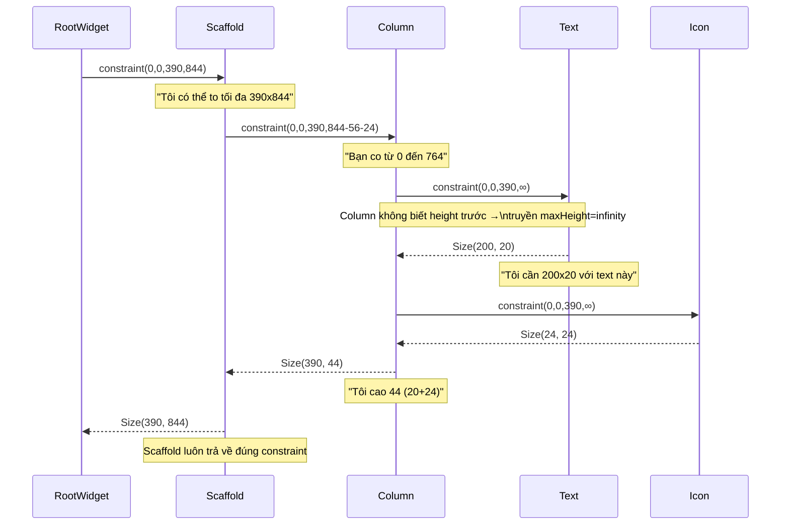

# Bài 4.1 — Constraints Go Down, Sizes Go Up

## Phần 1 — Khái Niệm & Mục Tiêu Bài Học

### Tại sao bài này quan trọng?

Một trong những quy tắc quan trọng nhất mà Flutter team document:

> **"Constraints go down. Sizes go up. Parent sets position."**
> — Flutter Layout Documentation

Hiểu quy tắc này là hiểu **toàn bộ layout system của Flutter**. Mọi lỗi overflow, mọi widget "không chịu expand", mọi "infinity constraint" đều giải thích được bằng quy tắc này.

```
❌ Không hiểu: "Tại sao Text không tự co lại trong Row?"
✅ Hiểu: Row truyền constraint maxWidth=infinity → Text không biết giới hạn
```

### Bạn sẽ hiểu được sau bài này:
- Quy trình truyền constraint từ parent xuống child
- Tại sao Flutter không cần multiple layout passes (không có layout thrash)
- Child không được "chọn" size tùy ý — phải tuân thủ constraints từ parent
- "Parent sets position" — child không tự đặt vị trí của mình

---

## Phần 2 — Cơ Chế Hoạt Động (Under the Hood)

### Single-pass Layout



### "Constraints go down" — Quy tắc 1

Parent truyền `BoxConstraints` xuống child:
```
BoxConstraints {
  minWidth:  double   // Tối thiểu
  maxWidth:  double   // Tối đa (có thể là infinity)
  minHeight: double   // Tối thiểu
  maxHeight: double   // Tối đa (có thể là infinity)
}
```

### "Sizes go up" — Quy tắc 2

Child trả về `Size` lên parent **trong phạm vi constraints được cho**:
- Child không thể trả về size nhỏ hơn min
- Child không thể trả về size lớn hơn max
- Nếu child muốn size vô hạn → layout error

### "Parent sets position" — Quy tắc 3

```
Child không tự set offset/position của mình.
Parent quyết định đặt child ở đâu SAU KHI biết size của child.

Column:
  child1.layout(constraint) → child1.size
  child2.layout(constraint) → child2.size
  child1.offset = Offset(0, 0)           # Parent đặt
  child2.offset = Offset(0, child1.height) # Parent đặt
```

---

## Phần 3 — Code Mẫu Chuẩn Google

### 3.1 — Visualize constraint flow

```dart
// Wrap widget để in ra constraint nhận được
class ConstraintPrinter extends SingleChildRenderObjectWidget {
  final String name;
  const ConstraintPrinter({super.key, required this.name, required super.child});

  @override
  RenderObject createRenderObject(BuildContext context) =>
      _RenderConstraintPrinter(name: name);

  @override
  void updateRenderObject(BuildContext context, _RenderConstraintPrinter renderObject) {
    renderObject.name = name;
  }
}

class _RenderConstraintPrinter extends RenderProxyBox {
  String name;
  _RenderConstraintPrinter({required this.name});

  @override
  void performLayout() {
    // In ra TRƯỚC khi layout child
    debugPrint('[$name] received: $constraints');
    super.performLayout();
    debugPrint('[$name] returned size: $size');
  }
}

// Cách dùng để trace:
Widget build(BuildContext context) {
  return Column(
    children: [
      ConstraintPrinter(
        name: 'Text',
        child: const Text('Hello Flutter'),
      ),
    ],
  );
}
// Output:
// [Text] received: BoxConstraints(0.0<=w<=390.0, 0.0<=h<=Infinity)
// [Text] returned size: Size(97.0, 20.0)
```

### 3.2 — Tại sao Flutter không có layout thrash

```dart
// Android/Web: có thể có multiple layout passes
// Widget A đo → Widget B đo → B phụ thuộc A → A đo lại → B đo lại → ...
// → O(n²) hoặc tệ hơn

// Flutter: single-pass layout nhờ constraint protocol
// Parent truyền constraint xuống → child layout một lần → trả size → parent đặt vị trí
// → O(n) — linear với số widget

// Ngoại lệ: IntrinsicWidth/IntrinsicHeight gây 2 passes → avoid khi có thể!
Widget withoutThrash = LayoutBuilder(
  builder: (context, constraints) {
    // constraints là BoxConstraints từ parent
    // Đây là single-pass — không gây thrash
    final isWide = constraints.maxWidth > 600;
    return isWide ? WideLayout() : NarrowLayout();
  },
);
```

### 3.3 — Tương tác constraint thực tế

```dart
// Scaffold body nhận tight constraint (maxHeight = screen - appbar - bottom)
// Container nhận same constraint từ Scaffold body
// Text trong Container: nhận loose constraint

Widget build(BuildContext context) {
  return Scaffold(
    // Scaffold body: tight constraint = full remaining screen
    body: Container(
      // Container "pass through" constraint nếu không specify size
      // Nếu Container có width/height → tạo tight constraint mới
      color: Colors.grey[200],
      child: Column(
        children: [
          // Text nhận loose constraint từ Column (maxWidth=screen, maxHeight=infinity)
          // Text tự chọn size phù hợp với content
          const Text('I decide my own size within constraints'),

          // SizedBox tạo tight constraint cho child
          SizedBox(
            width: 200, // Child phải đúng 200
            height: 100, // Child phải đúng 100
            child: Container(color: Colors.blue), // Nhận tight 200x100
          ),

          // Expanded: tạo constraint tight height cho remaining space
          Expanded(
            child: Container(
              color: Colors.green,
              // Nhận tight constraint = remaining height sau SizedBox
            ),
          ),
        ],
      ),
    ),
  );
}
```

### 3.4 — Quy tắc khi debug layout

```dart
// Câu hỏi khi gặp layout issue:
// 1. Widget này nhận constraint nào từ parent?
// 2. Widget muốn size bao nhiêu?
// 3. Có conflict không?

// Dùng LayoutBuilder để inspect constraint
LayoutBuilder(
  builder: (context, constraints) {
    // constraints = BoxConstraints từ parent
    assert(() {
      debugPrint(
        'My constraints: '
        'w=${constraints.minWidth}..${constraints.maxWidth}, '
        'h=${constraints.minHeight}..${constraints.maxHeight}',
      );
      return true;
    }());

    return const Text('Debug layout');
  },
)

// Hoặc dùng Flutter DevTools → Widget Inspector
// → Select widget → "Details" panel → "Constraints"
```

---

## Phần 4 — Lỗi Sai Phổ Biến & Best Practices

### ❌ Anti-pattern 1: Widget muốn size tự do không trong constraint

```dart
// ❌ Lỗi phổ biến: Đặt Container không bounded bên trong unbounded constraint
Row(
  children: [
    Container(
      color: Colors.blue,
      // Không có width → Container muốn full width
      // Row truyền maxWidth=infinity → Container nhận infinity
      // → Container không thể có size vô hạn → RenderFlex overflow!
    ),
  ],
)

// ✅ Giải pháp 1: Chỉ định width cụ thể
Row(children: [
  Container(width: 100, color: Colors.blue),
])

// ✅ Giải pháp 2: Dùng Expanded để flex theo available space
Row(children: [
  Expanded(child: Container(color: Colors.blue)),
])

// ✅ Giải pháp 3: Dùng Flexible với FlexFit.loose
Row(children: [
  Flexible(child: Container(color: Colors.blue)),
])
```

### ❌ Anti-pattern 2: Thêm IntrinsicWidth/IntrinsicHeight không cần thiết

```dart
// ❌ Overkill: IntrinsicHeight gây 2 layout passes → chậm hơn
Row(
  crossAxisAlignment: CrossAxisAlignment.stretch,
  children: [
    IntrinsicHeight( // 2 passes!
      child: Column(/* ... */),
    ),
    IntrinsicHeight( // 2 passes!
      child: Column(/* ... */),
    ),
  ],
)

// ✅ Đúng: Nếu cần equal height, dùng approach khác
// (e.g., custom layout, Stack with positioned, v.v.)
```

---

## Phần 5 — Bài Tập Củng Cố Tư Duy

### Challenge: Giải thích tại sao Text không cần width trong Column

```dart
Column(
  children: [
    Text('Đây là một đoạn text dài bất kỳ'),
    // Tại sao Text biết không vượt quá chiều rộng Column?
    // Tại sao Text không cần bạn chỉ định width?
  ],
)
```

**Trả lời:** (Không xem đáp án ngay — phân tích từng bước)
1. Column nhận constraint gì từ Scaffold body?
2. Column truyền constraint gì xuống Text?
3. Text dùng constraint đó như thế nào để wrap text?

### Thử Thách Tư Duy & Thẩm Định Chuyên Sâu (Conceptual & Deep-Dive Check)

> **[Junior]** — nắm khái niệm | **[Middle]** — hiểu cơ chế | **[Senior]** — hiểu Flutter internals | **[Trace Code]** — đọc code và dự đoán output

---

#### Q1 [Junior] — "Giải thích 'Constraints go down, Sizes go up, Parent sets position'"

**Trả lời chuẩn:**

Đây là nguyên tắc layout căn bản của Flutter — toàn bộ hệ thống layout hoạt động theo 3 bước:

**1. Constraints go down (ràng buộc đi xuống):**
Parent truyền `BoxConstraints(minW, maxW, minH, maxH)` xuống cho child. Child phải chọn size nằm trong khoảng này.

**2. Sizes go up (kích thước đi lên):**
Child quyết định size của mình (trong phạm vi constraints) và báo lên cho parent.

**3. Parent sets position (parent đặt vị trí):**
Parent dùng size đã biết của child để quyết định đặt child ở offset (x, y) nào.

```
Screen (tight constraint: 390×844)
  ↓ constraints: w[0..390] h[0..844]
Column
  ↓ constraints: w[390..390] (tight width), h[0..∞] (unbounded height)
  Row
    ↓ constraints: w[0..390] h[0..∞]
    Text('Hello')
      → size: 50×20 (text intrinsic size)
    ← size: 50×20
  ← Column places Row at y=0, x=0
← Column returns size: 390×20
```

---

#### Q2 [Junior] — "Làm thế nào debug 'RenderFlex overflowed by X pixels'?"

**Trả lời chuẩn:**

Lỗi overflow xảy ra khi tổng kích thước children vượt quá available space của Row/Column.

**Bước debug:**
1. Xác định widget nào trong Row/Column không có constraint/bounded size
2. Dùng `LayoutBuilder` để print constraints tại runtime

```dart
// Debug constraints
LayoutBuilder(
  builder: (context, constraints) {
    debugPrint('Constraints: $constraints');
    return Row(children: [...]);
  },
)
```

**Các fix phổ biến:**
```dart
// ❌ Text không có width constraint trong Row → overflow
Row(children: [Text(veryLongString)])

// ✅ Fix 1: Expanded — fill remaining space
Row(children: [Expanded(child: Text(veryLongString))])

// ✅ Fix 2: Flexible — shrink nếu đủ, không expand
Row(children: [Flexible(child: Text(veryLongString))])

// ✅ Fix 3: SizedBox — constrain width cụ thể
Row(children: [SizedBox(width: 200, child: Text(veryLongString))])
```

---

#### Q3 [Middle] — "Flutter single-pass layout hoạt động thế nào? Tại sao hiệu quả hơn CSS reflow?"

**Trả lời chuẩn:**

**CSS reflow:** Có thể xảy ra nhiều passes khi một element thay đổi size ảnh hưởng đến container, container ảnh hưởng đến sibling, v.v. — gây "layout thrashing" O(n²).

**Flutter single-pass layout:** Nhờ nguyên tắc "Constraints go down, Sizes go up", Flutter đảm bảo **mỗi RenderObject được layout đúng một lần**:

```
Parent gọi child.layout(constraints)
  → Child gọi grandchild.layout(innerConstraints)
    → Grandchild return size
  ← Child return size (dựa trên grandchild size)
← Parent nhận size, set position
```

Vì constraints đi từ trên xuống và sizes đi từ dưới lên, không có vòng lặp phụ thuộc — mỗi node trong tree được visit đúng một lần (DFS traversal).

**Ngoại lệ duy nhất:** `IntrinsicWidth`/`IntrinsicHeight` yêu cầu pre-measurement pass → gây 2 layout passes. Đây là lý do Flutter khuyến cáo tránh dùng chúng trong hot paths.

---

#### Q4 [Senior] — "`LayoutBuilder` nhận constraints từ đâu? Nó có tạo RenderObject riêng không?"

**Trả lời chuẩn:**

`LayoutBuilder` tạo ra `RenderConstrainedLayoutBuilder` (extends `RenderBox`). Trong `performLayout()`, nó:
1. Nhận `BoxConstraints` từ parent (giống mọi RenderBox khác)
2. Truyền constraints này vào `builder` callback như tham số
3. Build child với widget returned từ callback
4. Layout child với constraints đó

```dart
// LayoutBuilder không phải "magic" — nó chỉ expose constraints đã nhận từ parent
// Pseudo-code của RenderConstrainedLayoutBuilder.performLayout():
@override
void performLayout() {
  // constraints là BoxConstraints đã nhận từ parent — như mọi RenderBox
  final child = updateCallback(constraints); // gọi builder với constraints
  child.layout(constraints, parentUsesSize: true);
  size = child.size;
}
```

**Tại sao `LayoutBuilder` tốt hơn `MediaQuery` cho responsive component:**
- `MediaQuery.of(context).size` = screen size → không phản ánh actual available space cho component
- `LayoutBuilder` constraints = actual space từ parent → đúng cho responsive component
- Ví dụ: component trong sidebar chỉ có 300px width, nhưng `MediaQuery` trả về full screen 1024px

---

#### Q5 [Middle] — "Tight constraint vs loose constraint — `Center` widget nhận được gì?"

**Trả lời chuẩn:**

```dart
// Scaffold body truyền tight constraint cho Center:
// BoxConstraints(minW=390, maxW=390, minH=844, maxH=844) — tight

Center(
  child: const Text('Hello'),
)
```

`Center` nhận tight constraint từ Scaffold body. Trong `performLayout()`, Center:
1. Loosen constraint cho child: `constraints.loosen()` → `BoxConstraints(0..390, 0..844)` (min = 0)
2. Layout child với loose constraint → Text chọn natural size (e.g., 50×20)
3. Center đặt child ở giữa: `offset = Alignment.center.inscribe(childSize, constraints.biggest)`
4. Center tự report size = tight constraint size (390×844) — không phải child size

**Điểm quan trọng:** `Center` luôn fill toàn bộ available space (tight constraint từ parent), sau đó center child trong đó. Nếu Center được wrap bởi `SizedBox(width: 100, height: 100)` → Center fill 100×100 và center child trong đó.

---

#### Q6 [Middle] — "`SizedBox(width: 100)` trong Row: Text bên trong bị clip không?"

**Trả lời chuẩn:**

```dart
Row(
  children: [
    SizedBox(
      width: 100,
      child: Text('This is a very long text that might overflow'),
    ),
  ],
)
```

**Không bị clip mặc định** — Flutter không clip overflow trừ khi có `overflow: Overflow.clip` hoặc `clipBehavior: Clip.hardEdge`.

**Điều xảy ra:**
1. Row truyền constraint cho SizedBox: `BoxConstraints(0..remainingWidth, 0..height)`
2. SizedBox enforce tight width: `BoxConstraints(100..100, 0..height)` → truyền xuống Text
3. Text cố render trong 100px nhưng text dài hơn → Text wraps sang dòng mới (nếu có height) hoặc overflow
4. SizedBox trả size 100×(text height) lên Row
5. **Phần overflow hiện ra ngoài SizedBox boundary** — visible trong debug mode với yellow/black stripes

**Fix:**
```dart
SizedBox(
  width: 100,
  child: Text(
    'Long text',
    overflow: TextOverflow.ellipsis, // "Long tex..."
    maxLines: 1,
  ),
)
```

---

#### Q7 [Trace Code] — "Dự đoán layout: Column chứa SizedBox và Expanded — ai nhận được bao nhiêu space?"

```dart
Column(
  children: [
    SizedBox(height: 100, child: Container(color: Colors.red)),    // (A)
    Expanded(child: Container(color: Colors.blue)),                  // (B)
    SizedBox(height: 50, child: Container(color: Colors.green)),    // (C)
    Flexible(
      flex: 2,
      child: Container(color: Colors.yellow),
    ),                                                               // (D)
  ],
)
// Giả sử screen height = 800px
```

**Column layout algorithm:**

**Pass 1 — Non-flex children trước:**
- (A) SizedBox: 100px → báo lên 100px
- (C) SizedBox: 50px → báo lên 50px
- Remaining space = 800 - 100 - 50 = **650px** cho flex children

**Pass 2 — Flex children:**
- (B) Expanded (flex=1, tight): nhận 650 × 1/(1+2) = **≈217px** — buộc phải fill đúng 217px
- (D) Flexible (flex=2, loose): nhận 650 × 2/(1+2) = **≈433px** — có thể nhỏ hơn nếu child không fill

**Kết quả:**
- (A) Red: 100px
- (B) Blue: ≈217px (fill hoàn toàn)
- (C) Green: 50px
- (D) Yellow: ≈433px (nếu Container — fill hết flex share; nếu Text ngắn — nhỏ hơn)
