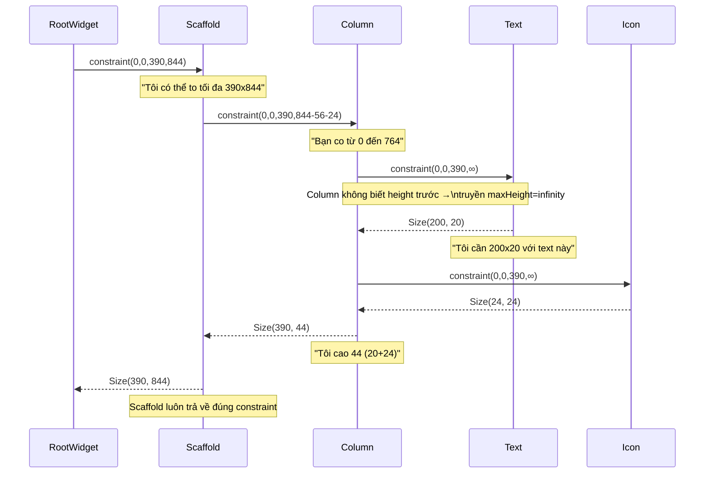

# Bài 4.1 — Constraints Go Down, Sizes Go Up

## Phần 1 — Khái Niệm & Mục Tiêu Bài Học

### Tại sao bài này quan trọng?

Một trong những quy tắc quan trọng nhất mà Flutter team document:

> **"Constraints go down. Sizes go up. Parent sets position."**
> — Flutter Layout Documentation

Hiểu quy tắc này là hiểu **toàn bộ layout system của Flutter**. Mọi lỗi overflow, mọi widget "không chịu expand", mọi "infinity constraint" đều giải thích được bằng quy tắc này.

```
❌ Không hiểu: "Tại sao Text không tự co lại trong Row?"
✅ Hiểu: Row truyền constraint maxWidth=infinity → Text không biết giới hạn
```

### Bạn sẽ hiểu được sau bài này:
- Quy trình truyền constraint từ parent xuống child
- Tại sao Flutter không cần multiple layout passes (không có layout thrash)
- Child không được "chọn" size tùy ý — phải tuân thủ constraints từ parent
- "Parent sets position" — child không tự đặt vị trí của mình

---

## Phần 2 — Cơ Chế Hoạt Động (Under the Hood)

### Single-pass Layout



### "Constraints go down" — Quy tắc 1

Parent truyền `BoxConstraints` xuống child:
```
BoxConstraints {
  minWidth:  double   // Tối thiểu
  maxWidth:  double   // Tối đa (có thể là infinity)
  minHeight: double   // Tối thiểu
  maxHeight: double   // Tối đa (có thể là infinity)
}
```

### "Sizes go up" — Quy tắc 2

Child trả về `Size` lên parent **trong phạm vi constraints được cho**:
- Child không thể trả về size nhỏ hơn min
- Child không thể trả về size lớn hơn max
- Nếu child muốn size vô hạn → layout error

### "Parent sets position" — Quy tắc 3

```
Child không tự set offset/position của mình.
Parent quyết định đặt child ở đâu SAU KHI biết size của child.

Column:
  child1.layout(constraint) → child1.size
  child2.layout(constraint) → child2.size
  child1.offset = Offset(0, 0)           # Parent đặt
  child2.offset = Offset(0, child1.height) # Parent đặt
```

---

## Phần 3 — Code Mẫu Chuẩn Google

### 3.1 — Visualize constraint flow

```dart
// Wrap widget để in ra constraint nhận được
class ConstraintPrinter extends SingleChildRenderObjectWidget {
  final String name;
  const ConstraintPrinter({super.key, required this.name, required super.child});

  @override
  RenderObject createRenderObject(BuildContext context) =>
      _RenderConstraintPrinter(name: name);

  @override
  void updateRenderObject(BuildContext context, _RenderConstraintPrinter renderObject) {
    renderObject.name = name;
  }
}

class _RenderConstraintPrinter extends RenderProxyBox {
  String name;
  _RenderConstraintPrinter({required this.name});

  @override
  void performLayout() {
    // In ra TRƯỚC khi layout child
    debugPrint('[$name] received: $constraints');
    super.performLayout();
    debugPrint('[$name] returned size: $size');
  }
}

// Cách dùng để trace:
Widget build(BuildContext context) {
  return Column(
    children: [
      ConstraintPrinter(
        name: 'Text',
        child: const Text('Hello Flutter'),
      ),
    ],
  );
}
// Output:
// [Text] received: BoxConstraints(0.0<=w<=390.0, 0.0<=h<=Infinity)
// [Text] returned size: Size(97.0, 20.0)
```

### 3.2 — Tại sao Flutter không có layout thrash

```dart
// Android/Web: có thể có multiple layout passes
// Widget A đo → Widget B đo → B phụ thuộc A → A đo lại → B đo lại → ...
// → O(n²) hoặc tệ hơn

// Flutter: single-pass layout nhờ constraint protocol
// Parent truyền constraint xuống → child layout một lần → trả size → parent đặt vị trí
// → O(n) — linear với số widget

// Ngoại lệ: IntrinsicWidth/IntrinsicHeight gây 2 passes → avoid khi có thể!
Widget withoutThrash = LayoutBuilder(
  builder: (context, constraints) {
    // constraints là BoxConstraints từ parent
    // Đây là single-pass — không gây thrash
    final isWide = constraints.maxWidth > 600;
    return isWide ? WideLayout() : NarrowLayout();
  },
);
```

### 3.3 — Tương tác constraint thực tế

```dart
// Scaffold body nhận tight constraint (maxHeight = screen - appbar - bottom)
// Container nhận same constraint từ Scaffold body
// Text trong Container: nhận loose constraint

Widget build(BuildContext context) {
  return Scaffold(
    // Scaffold body: tight constraint = full remaining screen
    body: Container(
      // Container "pass through" constraint nếu không specify size
      // Nếu Container có width/height → tạo tight constraint mới
      color: Colors.grey[200],
      child: Column(
        children: [
          // Text nhận loose constraint từ Column (maxWidth=screen, maxHeight=infinity)
          // Text tự chọn size phù hợp với content
          const Text('I decide my own size within constraints'),

          // SizedBox tạo tight constraint cho child
          SizedBox(
            width: 200, // Child phải đúng 200
            height: 100, // Child phải đúng 100
            child: Container(color: Colors.blue), // Nhận tight 200x100
          ),

          // Expanded: tạo constraint tight height cho remaining space
          Expanded(
            child: Container(
              color: Colors.green,
              // Nhận tight constraint = remaining height sau SizedBox
            ),
          ),
        ],
      ),
    ),
  );
}
```

### 3.4 — Quy tắc khi debug layout

```dart
// Câu hỏi khi gặp layout issue:
// 1. Widget này nhận constraint nào từ parent?
// 2. Widget muốn size bao nhiêu?
// 3. Có conflict không?

// Dùng LayoutBuilder để inspect constraint
LayoutBuilder(
  builder: (context, constraints) {
    // constraints = BoxConstraints từ parent
    assert(() {
      debugPrint(
        'My constraints: '
        'w=${constraints.minWidth}..${constraints.maxWidth}, '
        'h=${constraints.minHeight}..${constraints.maxHeight}',
      );
      return true;
    }());

    return const Text('Debug layout');
  },
)

// Hoặc dùng Flutter DevTools → Widget Inspector
// → Select widget → "Details" panel → "Constraints"
```

---

## Phần 4 — Lỗi Sai Phổ Biến & Best Practices

### ❌ Anti-pattern 1: Widget muốn size tự do không trong constraint

```dart
// ❌ Lỗi phổ biến: Đặt Container không bounded bên trong unbounded constraint
Row(
  children: [
    Container(
      color: Colors.blue,
      // Không có width → Container muốn full width
      // Row truyền maxWidth=infinity → Container nhận infinity
      // → Container không thể có size vô hạn → RenderFlex overflow!
    ),
  ],
)

// ✅ Giải pháp 1: Chỉ định width cụ thể
Row(children: [
  Container(width: 100, color: Colors.blue),
])

// ✅ Giải pháp 2: Dùng Expanded để flex theo available space
Row(children: [
  Expanded(child: Container(color: Colors.blue)),
])

// ✅ Giải pháp 3: Dùng Flexible với FlexFit.loose
Row(children: [
  Flexible(child: Container(color: Colors.blue)),
])
```

### ❌ Anti-pattern 2: Thêm IntrinsicWidth/IntrinsicHeight không cần thiết

```dart
// ❌ Overkill: IntrinsicHeight gây 2 layout passes → chậm hơn
Row(
  crossAxisAlignment: CrossAxisAlignment.stretch,
  children: [
    IntrinsicHeight( // 2 passes!
      child: Column(/* ... */),
    ),
    IntrinsicHeight( // 2 passes!
      child: Column(/* ... */),
    ),
  ],
)

// ✅ Đúng: Nếu cần equal height, dùng approach khác
// (e.g., custom layout, Stack with positioned, v.v.)
```

---

## Phần 5 — Bài Tập Củng Cố Tư Duy

### Challenge: Giải thích tại sao Text không cần width trong Column

```dart
Column(
  children: [
    Text('Đây là một đoạn text dài bất kỳ'),
    // Tại sao Text biết không vượt quá chiều rộng Column?
    // Tại sao Text không cần bạn chỉ định width?
  ],
)
```

**Trả lời:** (Không xem đáp án ngay — phân tích từng bước)
1. Column nhận constraint gì từ Scaffold body?
2. Column truyền constraint gì xuống Text?
3. Text dùng constraint đó như thế nào để wrap text?

### Câu hỏi phỏng vấn liên quan:

1. **"Giải thích 'Constraints go down, Sizes go up, Parent sets position'"**
   - Parent truyền BoxConstraints xuống → child layout trong phạm vi đó
   - Child trả Size lên → parent biết child to/nhỏ bao nhiêu
   - Parent quyết định đặt child ở offset nào

2. **"Flutter layout có thể xảy ra layout thrash không?"**
   - Không trong trường hợp thông thường — single-pass layout
   - Ngoại lệ: `IntrinsicWidth`/`IntrinsicHeight` gây 2 passes — tránh khi có thể

3. **"Làm thế nào để debug 'RenderFlex overflowed'?"**
   - Xác định widget nào trong Row/Column không có constraint width/height
   - Dùng `Expanded`, `Flexible`, hoặc specify size cụ thể
   - Dùng `LayoutBuilder` để print constraints tại runtime
