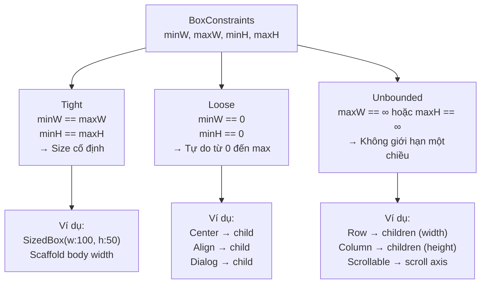

# Bài 4.2 — BoxConstraints: Tight, Loose, Unbounded

## Phần 1 — Khái Niệm & Mục Tiêu Bài Học

### Tại sao bài này quan trọng?

Mọi layout error trong Flutter đều liên quan đến một trong ba loại constraint:

```
"A RenderFlex overflowed by 42 pixels"  → Child gặp Unbounded constraint
"RenderBox was not laid out"            → Constraint chain bị broken
"Horizontal viewport was given unbounded height" → Scrollable trong Unbounded
```

Biết phân biệt ba loại constraint giúp bạn:
- Debug overflow error trong 30 giây
- Hiểu tại sao `ListView` bên trong `Column` cần `Expanded`
- Không dùng `SizedBox.expand()` bừa bãi

### Bạn sẽ hiểu được sau bài này:
- **Tight constraint**: `minWidth == maxWidth` và `minHeight == maxHeight`
- **Loose constraint**: `minWidth == 0, minHeight == 0`
- **Unbounded constraint**: `maxWidth == infinity` hoặc `maxHeight == infinity`
- Debug "RenderFlex overflowed" bằng cách đọc constraint chain

---

## Phần 2 — Cơ Chế Hoạt Động (Under the Hood)

### Phân loại BoxConstraints



### Ai tạo ra loại constraint nào?

```
Tight constraints:
  ├── Scaffold.body (width = screen width, height = remaining height)
  ├── SizedBox với w và h cụ thể
  ├── FractionallySizedBox
  └── ConstrainedBox với tight constraints

Loose constraints:
  ├── Center → child (minW=0, minH=0, maxW/H từ parent)
  ├── Align → child
  ├── Container không có size → pass through
  └── Padding → child (trừ padding size)

Unbounded constraints:
  ├── Row → children (maxWidth = ∞)
  ├── Column → children (maxHeight = ∞)
  ├── ListView/SingleChildScrollView → scroll direction = ∞
  └── Wrap → children (∞ theo wrap direction)
```

---

## Phần 3 — Code Mẫu Chuẩn Google

### 3.1 — Tight Constraint

```dart
// SizedBox tạo tight constraint cho child
Widget build(BuildContext context) {
  return Column(
    children: [
      // SizedBox: minW=maxW=200, minH=maxH=100 → tight
      SizedBox(
        width: 200,
        height: 100,
        child: Container(
          // Container nhận tight 200x100
          // Không thể to hơn, không thể nhỏ hơn
          color: Colors.blue,
          child: const Text('Tôi bị ép vào 200x100'),
        ),
      ),

      // Scaffold body: tight width = screen width
      // (không cần SizedBox để fill width trong Scaffold body)
      Container(
        height: 50,
        color: Colors.green,
        // Tự động fill full width vì parent (Scaffold body) truyền tight width
      ),
    ],
  );
}

// Kiểm tra xem constraint có tight không:
void checkTight(BoxConstraints c) {
  print('Width tight: ${c.hasTightWidth}'); // minWidth == maxWidth
  print('Height tight: ${c.hasTightHeight}');
  print('Tight: ${c.isTight}'); // cả width lẫn height đều tight
}
```

### 3.2 — Loose Constraint

```dart
// Center tạo loose constraint cho child
// minW=0, minH=0 → child tự chọn size nhỏ hơn maxW/maxH
Widget build(BuildContext context) {
  return Center(
    child: Container(
      // Center truyền: minW=0, minH=0, maxW=screen.w, maxH=screen.h
      // Container không có size → chọn wrap_content
      // Container TỰ CHỌN size dựa trên content
      padding: const EdgeInsets.all(16),
      decoration: BoxDecoration(
        color: Colors.white,
        borderRadius: BorderRadius.circular(8),
        boxShadow: const [BoxShadow(blurRadius: 8)],
      ),
      child: const Text('Tôi tự chọn size dựa trên content'),
    ),
  );
}

// Loose constraint trong Align:
Align(
  alignment: Alignment.topLeft,
  child: Container(
    color: Colors.red,
    width: 100,  // OK: 100 ≤ maxWidth
    height: 50,  // OK: 50 ≤ maxHeight
  ),
)
```

### 3.3 — Unbounded Constraint và cách xử lý

```dart
// Column truyền maxHeight=infinity cho children
// → Children KHÔNG ĐƯỢC trả về infinite size
// → ListView trong Column: PROBLEM!

// ❌ LỖI: ListView trong Column không có bounded height
Widget badLayout() {
  return Column(
    children: [
      const Text('Header'),
      ListView.builder( // ❌ Column truyền maxHeight=∞ xuống ListView
        // ListView yêu cầu bounded height → AssertionError!
        itemCount: 10,
        itemBuilder: (_, i) => Text('Item $i'),
      ),
    ],
  );
}

// ✅ FIX 1: Dùng Expanded để cho ListView bounded height
Widget fixedLayout1() {
  return Column(
    children: [
      const Text('Header'),
      Expanded( // Expanded truyền tight constraint xuống ListView
        child: ListView.builder(
          itemCount: 10,
          itemBuilder: (_, i) => Text('Item $i'),
        ),
      ),
    ],
  );
}

// ✅ FIX 2: Dùng shrinkWrap khi danh sách nhỏ (KHÔNG dùng cho list dài)
Widget fixedLayout2() {
  return Column(
    children: [
      const Text('Header'),
      ListView.builder(
        shrinkWrap: true,   // ListView tự tính height theo content
        physics: const NeverScrollableScrollPhysics(), // Tắt scroll của ListView
        itemCount: 5,       // Số lượng nhỏ mới dùng shrinkWrap!
        itemBuilder: (_, i) => Text('Item $i'),
      ),
    ],
  );
}

// ✅ FIX 3: Dùng CustomScrollView + Slivers (tốt nhất cho list lớn)
Widget fixedLayout3() {
  return CustomScrollView(
    slivers: [
      const SliverToBoxAdapter(child: Text('Header')),
      SliverList.builder(
        itemCount: 100,
        itemBuilder: (_, i) => Text('Item $i'),
      ),
    ],
  );
}
```

### 3.4 — Đọc và debug constraint chain

```dart
// LayoutBuilder: nhận constraint từ parent, không tạo thêm overhead
Widget debugConstraints(BuildContext context) {
  return Column(
    children: [
      LayoutBuilder(
        builder: (context, constraints) {
          // Trong debug mode: in constraint nhận được
          assert(() {
            debugPrint(
              'Column child constraint: '
              'w=${constraints.minWidth}..${constraints.maxWidth} '
              'h=${constraints.minHeight}..${constraints.maxHeight} '
              'isTight=${constraints.isTight} '
              'hasBoundedWidth=${constraints.hasBoundedWidth} '
              'hasBoundedHeight=${constraints.hasBoundedHeight}',
            );
            return true;
          }());

          return const Text('Debug me');
        },
      ),
    ],
  );
}
// Output: Column child constraint: w=0.0..390.0 h=0.0..Infinity
// → Bounded width, Unbounded height → Text OK, ListView NOT OK
```

---

## Phần 4 — Lỗi Sai Phổ Biến & Best Practices

### ❌ Anti-pattern 1: shrinkWrap=true cho list dài

```dart
// ❌ Nguy hiểm về hiệu năng: shrinkWrap build mọi item để tính height
ListView.builder(
  shrinkWrap: true, // Mất virtualization → build 1000 items cùng lúc!
  itemCount: 1000,
  itemBuilder: (_, i) => ExpensiveWidget(index: i),
)

// ✅ Đúng: Expanded + ListView.builder (virtualization vẫn hoạt động)
Expanded(
  child: ListView.builder(
    itemCount: 1000,
    itemBuilder: (_, i) => ExpensiveWidget(index: i),
    // Chỉ build items trong viewport + buffer
  ),
)
```

### ❌ Anti-pattern 2: SingleChildScrollView không bounded

```dart
// ❌ Lỗi: SingleChildScrollView trong Column không bounded
Column(
  children: [
    SingleChildScrollView( // Column truyền maxHeight=∞ → Scrollable không biết "full height"
      child: Column(/* ... */),
    ),
  ],
)

// ✅ Đúng: Expanded trước SingleChildScrollView
Column(
  children: [
    const Text('Header'),
    Expanded(
      child: SingleChildScrollView(
        child: Column(/* content... */),
      ),
    ),
  ],
)
```

### ❌ Anti-pattern 3: Row trong Row gây overflow

```dart
// ❌ Sai: Inner Row cũng nhận unbounded maxWidth từ outer Row
Row(
  children: [
    Row( // Outer Row: maxWidth=∞ → Inner Row cũng ∞
      children: [
        Container(width: 200, color: Colors.blue),
        // Overflow không phát hiện được compile-time!
      ],
    ),
  ],
)

// ✅ Đúng: Dùng Expanded hoặc Flexible
Row(
  children: [
    Expanded( // Tạo tight constraint cho inner Row
      child: Row(
        children: [
          Expanded(child: Container(color: Colors.blue)),
          Container(width: 80, color: Colors.red),
        ],
      ),
    ),
  ],
)
```

---

## Phần 5 — Bài Tập Củng Cố Tư Duy

### Challenge: Debug "RenderFlex overflowed" bằng constraint chain

**Tình huống:** Code sau bị lỗi overflow. Debug không dùng trial-and-error:

```dart
Widget build(BuildContext context) {
  return Column(
    children: [
      Row(
        children: [
          Text('Sản phẩm: '),
          Text(
            'Đây là tên sản phẩm rất dài, có thể vượt quá chiều rộng màn hình',
          ),
        ],
      ),
    ],
  );
}
```

**Phân tích:**
1. Column nhận constraint gì từ Scaffold body?
2. Row nhận constraint gì từ Column?
3. Mỗi Text nhận constraint gì từ Row?
4. Text muốn width bao nhiêu?
5. Tại sao overflow xảy ra?
6. Sửa thế nào?

### Câu hỏi phỏng vấn liên quan:

1. **"Tight vs Loose constraint là gì?"**
   - Tight: `min == max` — widget bị ép vào một size cụ thể
   - Loose: `min == 0` — widget tự do chọn size từ 0 đến max

2. **"Tại sao `ListView` trong `Column` gây lỗi?"**
   - Column truyền maxHeight=∞ xuống ListView
   - ListView cần bounded maxHeight để biết viewport size
   - Fix: wrap ListView trong `Expanded` để có tight height constraint

3. **"Sự khác biệt giữa `Expanded` và `Flexible`?"**
   - `Expanded = Flexible(fit: FlexFit.tight)` — tight, fill remaining space hoàn toàn
   - `Flexible(fit: FlexFit.loose)` — flex nhưng không bắt buộc fill — child có thể nhỏ hơn
