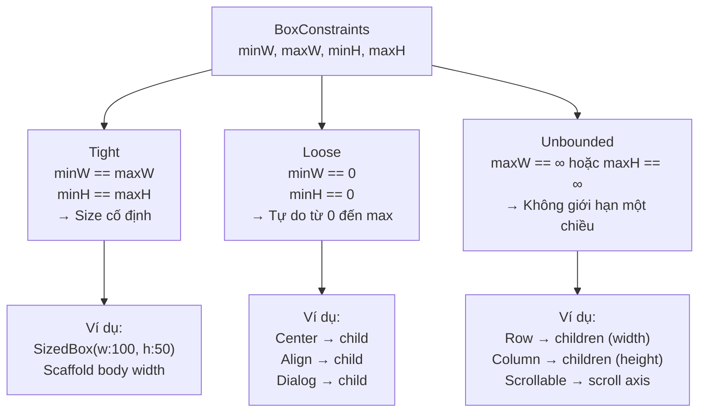

# Bài 4.2 — BoxConstraints: Tight, Loose, Unbounded

## Phần 1 — Khái Niệm & Mục Tiêu Bài Học

### Tại sao bài này quan trọng?

Mọi layout error trong Flutter đều liên quan đến một trong ba loại constraint:

```
"A RenderFlex overflowed by 42 pixels"  → Child gặp Unbounded constraint
"RenderBox was not laid out"            → Constraint chain bị broken
"Horizontal viewport was given unbounded height" → Scrollable trong Unbounded
```

Biết phân biệt ba loại constraint giúp bạn:
- Debug overflow error trong 30 giây
- Hiểu tại sao `ListView` bên trong `Column` cần `Expanded`
- Không dùng `SizedBox.expand()` bừa bãi

### Bạn sẽ hiểu được sau bài này:
- **Tight constraint**: `minWidth == maxWidth` và `minHeight == maxHeight`
- **Loose constraint**: `minWidth == 0, minHeight == 0`
- **Unbounded constraint**: `maxWidth == infinity` hoặc `maxHeight == infinity`
- Debug "RenderFlex overflowed" bằng cách đọc constraint chain

---

## Phần 2 — Cơ Chế Hoạt Động (Under the Hood)

### Phân loại BoxConstraints



### Ai tạo ra loại constraint nào?

```
Tight constraints:
  ├── Scaffold.body (width = screen width, height = remaining height)
  ├── SizedBox với w và h cụ thể
  ├── FractionallySizedBox
  └── ConstrainedBox với tight constraints

Loose constraints:
  ├── Center → child (minW=0, minH=0, maxW/H từ parent)
  ├── Align → child
  ├── Container không có size → pass through
  └── Padding → child (trừ padding size)

Unbounded constraints:
  ├── Row → children (maxWidth = ∞)
  ├── Column → children (maxHeight = ∞)
  ├── ListView/SingleChildScrollView → scroll direction = ∞
  └── Wrap → children (∞ theo wrap direction)
```

---

## Phần 3 — Code Mẫu Chuẩn Google

### 3.1 — Tight Constraint

```dart
// SizedBox tạo tight constraint cho child
Widget build(BuildContext context) {
  return Column(
    children: [
      // SizedBox: minW=maxW=200, minH=maxH=100 → tight
      SizedBox(
        width: 200,
        height: 100,
        child: Container(
          // Container nhận tight 200x100
          // Không thể to hơn, không thể nhỏ hơn
          color: Colors.blue,
          child: const Text('Tôi bị ép vào 200x100'),
        ),
      ),

      // Scaffold body: tight width = screen width
      // (không cần SizedBox để fill width trong Scaffold body)
      Container(
        height: 50,
        color: Colors.green,
        // Tự động fill full width vì parent (Scaffold body) truyền tight width
      ),
    ],
  );
}

// Kiểm tra xem constraint có tight không:
void checkTight(BoxConstraints c) {
  print('Width tight: ${c.hasTightWidth}'); // minWidth == maxWidth
  print('Height tight: ${c.hasTightHeight}');
  print('Tight: ${c.isTight}'); // cả width lẫn height đều tight
}
```

### 3.2 — Loose Constraint

```dart
// Center tạo loose constraint cho child
// minW=0, minH=0 → child tự chọn size nhỏ hơn maxW/maxH
Widget build(BuildContext context) {
  return Center(
    child: Container(
      // Center truyền: minW=0, minH=0, maxW=screen.w, maxH=screen.h
      // Container không có size → chọn wrap_content
      // Container TỰ CHỌN size dựa trên content
      padding: const EdgeInsets.all(16),
      decoration: BoxDecoration(
        color: Colors.white,
        borderRadius: BorderRadius.circular(8),
        boxShadow: const [BoxShadow(blurRadius: 8)],
      ),
      child: const Text('Tôi tự chọn size dựa trên content'),
    ),
  );
}

// Loose constraint trong Align:
Align(
  alignment: Alignment.topLeft,
  child: Container(
    color: Colors.red,
    width: 100,  // OK: 100 ≤ maxWidth
    height: 50,  // OK: 50 ≤ maxHeight
  ),
)
```

### 3.3 — Unbounded Constraint và cách xử lý

```dart
// Column truyền maxHeight=infinity cho children
// → Children KHÔNG ĐƯỢC trả về infinite size
// → ListView trong Column: PROBLEM!

// ❌ LỖI: ListView trong Column không có bounded height
Widget badLayout() {
  return Column(
    children: [
      const Text('Header'),
      ListView.builder( // ❌ Column truyền maxHeight=∞ xuống ListView
        // ListView yêu cầu bounded height → AssertionError!
        itemCount: 10,
        itemBuilder: (_, i) => Text('Item $i'),
      ),
    ],
  );
}

// ✅ FIX 1: Dùng Expanded để cho ListView bounded height
Widget fixedLayout1() {
  return Column(
    children: [
      const Text('Header'),
      Expanded( // Expanded truyền tight constraint xuống ListView
        child: ListView.builder(
          itemCount: 10,
          itemBuilder: (_, i) => Text('Item $i'),
        ),
      ),
    ],
  );
}

// ✅ FIX 2: Dùng shrinkWrap khi danh sách nhỏ (KHÔNG dùng cho list dài)
Widget fixedLayout2() {
  return Column(
    children: [
      const Text('Header'),
      ListView.builder(
        shrinkWrap: true,   // ListView tự tính height theo content
        physics: const NeverScrollableScrollPhysics(), // Tắt scroll của ListView
        itemCount: 5,       // Số lượng nhỏ mới dùng shrinkWrap!
        itemBuilder: (_, i) => Text('Item $i'),
      ),
    ],
  );
}

// ✅ FIX 3: Dùng CustomScrollView + Slivers (tốt nhất cho list lớn)
Widget fixedLayout3() {
  return CustomScrollView(
    slivers: [
      const SliverToBoxAdapter(child: Text('Header')),
      SliverList.builder(
        itemCount: 100,
        itemBuilder: (_, i) => Text('Item $i'),
      ),
    ],
  );
}
```

### 3.4 — Đọc và debug constraint chain

```dart
// LayoutBuilder: nhận constraint từ parent, không tạo thêm overhead
Widget debugConstraints(BuildContext context) {
  return Column(
    children: [
      LayoutBuilder(
        builder: (context, constraints) {
          // Trong debug mode: in constraint nhận được
          assert(() {
            debugPrint(
              'Column child constraint: '
              'w=${constraints.minWidth}..${constraints.maxWidth} '
              'h=${constraints.minHeight}..${constraints.maxHeight} '
              'isTight=${constraints.isTight} '
              'hasBoundedWidth=${constraints.hasBoundedWidth} '
              'hasBoundedHeight=${constraints.hasBoundedHeight}',
            );
            return true;
          }());

          return const Text('Debug me');
        },
      ),
    ],
  );
}
// Output: Column child constraint: w=0.0..390.0 h=0.0..Infinity
// → Bounded width, Unbounded height → Text OK, ListView NOT OK
```

---

## Phần 4 — Lỗi Sai Phổ Biến & Best Practices

### ❌ Anti-pattern 1: shrinkWrap=true cho list dài

```dart
// ❌ Nguy hiểm về hiệu năng: shrinkWrap build mọi item để tính height
ListView.builder(
  shrinkWrap: true, // Mất virtualization → build 1000 items cùng lúc!
  itemCount: 1000,
  itemBuilder: (_, i) => ExpensiveWidget(index: i),
)

// ✅ Đúng: Expanded + ListView.builder (virtualization vẫn hoạt động)
Expanded(
  child: ListView.builder(
    itemCount: 1000,
    itemBuilder: (_, i) => ExpensiveWidget(index: i),
    // Chỉ build items trong viewport + buffer
  ),
)
```

### ❌ Anti-pattern 2: SingleChildScrollView không bounded

```dart
// ❌ Lỗi: SingleChildScrollView trong Column không bounded
Column(
  children: [
    SingleChildScrollView( // Column truyền maxHeight=∞ → Scrollable không biết "full height"
      child: Column(/* ... */),
    ),
  ],
)

// ✅ Đúng: Expanded trước SingleChildScrollView
Column(
  children: [
    const Text('Header'),
    Expanded(
      child: SingleChildScrollView(
        child: Column(/* content... */),
      ),
    ),
  ],
)
```

### ❌ Anti-pattern 3: Row trong Row gây overflow

```dart
// ❌ Sai: Inner Row cũng nhận unbounded maxWidth từ outer Row
Row(
  children: [
    Row( // Outer Row: maxWidth=∞ → Inner Row cũng ∞
      children: [
        Container(width: 200, color: Colors.blue),
        // Overflow không phát hiện được compile-time!
      ],
    ),
  ],
)

// ✅ Đúng: Dùng Expanded hoặc Flexible
Row(
  children: [
    Expanded( // Tạo tight constraint cho inner Row
      child: Row(
        children: [
          Expanded(child: Container(color: Colors.blue)),
          Container(width: 80, color: Colors.red),
        ],
      ),
    ),
  ],
)
```

---

## Phần 5 — Bài Tập Củng Cố Tư Duy

### Challenge: Debug "RenderFlex overflowed" bằng constraint chain

**Tình huống:** Code sau bị lỗi overflow. Debug không dùng trial-and-error:

```dart
Widget build(BuildContext context) {
  return Column(
    children: [
      Row(
        children: [
          Text('Sản phẩm: '),
          Text(
            'Đây là tên sản phẩm rất dài, có thể vượt quá chiều rộng màn hình',
          ),
        ],
      ),
    ],
  );
}
```

**Phân tích:**
1. Column nhận constraint gì từ Scaffold body?
2. Row nhận constraint gì từ Column?
3. Mỗi Text nhận constraint gì từ Row?
4. Text muốn width bao nhiêu?
5. Tại sao overflow xảy ra?
6. Sửa thế nào?

### Thử Thách Tư Duy & Thẩm Định Chuyên Sâu (Conceptual & Deep-Dive Check)

> **[Junior]** — nắm khái niệm | **[Middle]** — hiểu cơ chế | **[Senior]** — hiểu Flutter internals | **[Trace Code]** — đọc code và dự đoán output

---

#### Q1 [Junior] — "Tight, Loose, và Unbounded constraint khác nhau thế nào?"

**Trả lời chuẩn:**

| Loại | Đặc điểm | Ví dụ |
|---|---|---|
| **Tight** | `min == max` | Scaffold body: `BoxConstraints(390, 390, 844, 844)` |
| **Loose** | `min == 0` | Center truyền cho child: `BoxConstraints(0, 390, 0, 844)` |
| **Unbounded** | `max == infinity` | Column truyền cho children: `BoxConstraints(0, 390, 0, ∞)` |

```dart
// Tight — widget bị ép đúng một size, không có lựa chọn
BoxConstraints.tight(Size(100, 100))
// → minWidth=100, maxWidth=100, minHeight=100, maxHeight=100

// Loose — widget tự chọn size từ 0 đến max
BoxConstraints.loose(Size(300, 500))
// → minWidth=0, maxWidth=300, minHeight=0, maxHeight=500

// Unbounded — width hoặc height không giới hạn
BoxConstraints(minWidth: 0, maxWidth: double.infinity, ...)
// Widget phải có "natural size" — không thể chọn infinity
```

---

#### Q2 [Junior] — "Tại sao `ListView` bên trong `Column` gây lỗi? Cách fix?"

**Trả lời chuẩn:**

`Column` truyền **unbounded height** (`maxHeight = ∞`) xuống các children. `ListView` cần biết viewport height để tính scroll position và virtualize items — nó không thể hoạt động với `maxHeight = ∞`.

```
Column (nhận tight height từ Scaffold)
  ↓ truyền BoxConstraints(0..390, 0..∞) xuống children
  ListView
    → muốn biết viewport height để layout → nhận ∞ → "Cannot provide width/height = infinity"
    → throw: RenderBox was not laid out
```

**Fixes:**
```dart
// Fix 1: Expanded — cho ListView tight height (remaining space)
Column(children: [
  const Text('Header'),
  Expanded(child: ListView.builder(...)), // ListView nhận tight height
])

// Fix 2: SizedBox — constrain ListView cụ thể
Column(children: [
  SizedBox(height: 300, child: ListView(...)),
])

// Fix 3: Nếu list nhỏ + không cần virtualization
Column(children: [
  ...items.map((i) => ListTile(...)).toList(),
])
```

---

#### Q3 [Middle] — "Sự khác biệt giữa `Expanded` và `Flexible`? Khi nào dùng cái nào?"

**Trả lời chuẩn:**

`Expanded` là `Flexible(fit: FlexFit.tight)` — hai class khác nhau nhưng `Expanded` về cơ bản delegate về `Flexible`:

| | `Expanded` | `Flexible(fit: FlexFit.loose)` |
|---|---|---|
| **Constraint cho child** | Tight (buộc fill flex share) | Loose (có thể nhỏ hơn flex share) |
| **Child nhận được** | Chính xác `flex share` pixels | Tối đa `flex share` pixels |
| **Ví dụ** | Container fill đúng phần chia | Text chỉ chiếm width cần thiết |

```dart
Row(children: [
  Expanded(child: Container(color: Colors.red)),    // fill 1/2 width chính xác
  Flexible(child: Text('short')),                    // chỉ dùng text width, không fill
])

// vs.

Row(children: [
  Expanded(child: Container(color: Colors.red)),    // fill 1/2
  Expanded(child: Text('short')),                   // fill 1/2, text bị stretch
])
```

**Rule of thumb:** Dùng `Expanded` khi muốn fill space. Dùng `Flexible` khi muốn widget có thể nhỏ hơn share nếu nội dung nhỏ.

---

#### Q4 [Senior] — "Unbounded constraint (`maxWidth = infinity`) gây vấn đề gì? Tại sao `Text` crash trong `Row` khi không có constraint?"

**Trả lời chuẩn:**

`Row` truyền **unbounded width** (`maxWidth = ∞`) cho non-flex children. `Text` widget trong trường hợp bình thường cần biết `maxWidth` để biết khi nào cần wrap sang dòng mới.

**Text trong Row không có constraint:**
```
Row truyền BoxConstraints(0..∞, 0..height) → Text
Text: "maxWidth = ∞ → tôi render thành 1 dòng infinitely wide"
Text trả size: (1000px, 20px) → Row tổng cộng = 1000px > screen width
→ Overflow!
```

**Không crash nhưng overflow** — đây là lý do thấy yellow-black overflow stripe.

**Khi nào crash thực sự:** `RenderBox` yêu cầu `maxWidth` là finite trong một số trường hợp specific (e.g., `RenderFlex` khi tính intrinsic width với unbounded constraint). Lỗi: `BoxConstraints forces an infinite width.`

```dart
// Row → Column → Row pattern: Column truyền unbounded height
// Row con nhận bounded width từ Column nhưng truyền unbounded width cho Text
Row(children: [
  Expanded(child: Text('...')), // ✅ Expanded → tight width constraint cho Text
  Text('...'),                  // ❌ unbounded → overflow
])
```

---

#### Q5 [Middle] — "`Container()` không có child, không có width/height: size là bao nhiêu? Tại sao?"

**Trả lời chuẩn:**

`Container` không có child và không có explicit size → **match parent constraint**:

```dart
// Trong Scaffold body (tight constraint: 390×844)
Container()  // → size = 390×844 (fill parent)

// Trong Center (loose constraint: 0..390 × 0..844)
Center(child: Container()) // → size = 0×0 (shrink to minimum)

// Trong Row (unbounded width)
Row(children: [Container(color: Colors.red)]) // → size = 0×0 (no child, shrink)
```

**Quy tắc của `Container`:**
- **Có child:** wrap child (tight constraint = child size)
- **Không có child + tight constraint:** fill parent
- **Không có child + loose constraint:** minimum size (thường 0×0)
- **Có `width`/`height` explicit:** dùng giá trị đó bất kể constraint

```dart
// Debug: dùng LayoutBuilder để xem container nhận constraint gì
LayoutBuilder(builder: (ctx, c) {
  debugPrint('Container constraints: $c');
  return Container(color: Colors.red);
})
```

---

#### Q6 [Senior] — "`FlexFit.tight` vs `FlexFit.loose` trong `RenderFlex.performLayout()` — cơ chế nội bộ?"

**Trả lời chuẩn:**

`RenderFlex` (RenderObject của Row/Column) có 2-pass layout:

**Pass 1 — Non-flex children:**
```dart
for (final child in nonFlexChildren) {
  child.layout(innerConstraints, parentUsesSize: true);
  totalFlex += 0; // không flex
  allocatedSize += child.size.mainSize;
}
freeSpace = mainAxisExtent - allocatedSize;
```

**Pass 2 — Flex children (Expanded/Flexible):**
```dart
for (final child in flexChildren) {
  final flexShare = freeSpace * (child.flex / totalFlex);
  
  if (child.fit == FlexFit.tight) {
    // Buộc child fill đúng flexShare
    child.layout(BoxConstraints.tight(flexShare), parentUsesSize: true);
  } else { // FlexFit.loose
    // Cho phép child nhỏ hơn flexShare
    child.layout(BoxConstraints(maxMainAxis: flexShare), parentUsesSize: true);
  }
}
```

**Kết quả:** `FlexFit.tight` (Expanded) → child **phải** fill `flexShare`. `FlexFit.loose` (Flexible) → child **có thể** nhỏ hơn. Unused space trong `FlexFit.loose` không được redistribute — nó trở thành "wasted" space trong Row/Column.

---

#### Q7 [Trace Code] — "`Column` chứa `ListView` không có `Expanded`: crash hay không? Tại sao? Cách fix?"

```dart
// Code A
Widget buildA() {
  return Scaffold(
    body: Column(
      children: [
        const Text('Header'),
        ListView(
          children: List.generate(10, (i) => ListTile(title: Text('Item $i'))),
        ),
      ],
    ),
  );
}

// Code B
Widget buildB() {
  return Scaffold(
    body: Column(
      children: [
        const Text('Header'),
        Expanded(
          child: ListView(
            children: List.generate(10, (i) => ListTile(title: Text('Item $i'))),
          ),
        ),
      ],
    ),
  );
}

// Code C
Widget buildC() {
  return Scaffold(
    body: ListView(
      children: [
        const Text('Header'),
        ...List.generate(10, (i) => ListTile(title: Text('Item $i'))),
      ],
    ),
  );
}
```

**Code A:** ❌ **Crash** — Column truyền `maxHeight = ∞` cho ListView. ListView không biết viewport height → `RenderViewport: hasSize is false` hoặc `Cannot size parent that does not have a known height`.

**Code B:** ✅ **OK** — Expanded force Column chia remaining space (sau Header) cho ListView → ListView nhận tight height → biết viewport → layout và scroll đúng.

**Code C:** ✅ **OK** — Không có nested Column+ListView. ListView scroll toàn bộ nội dung bao gồm cả Header. Đây là cách đơn giản nhất nếu không cần Header fixed.

**Khi nào dùng Code B vs Code C:**
- Code B: Header phải fixed (không scroll theo), content scroll độc lập
- Code C: Header scroll cùng với content → UX tự nhiên hơn
