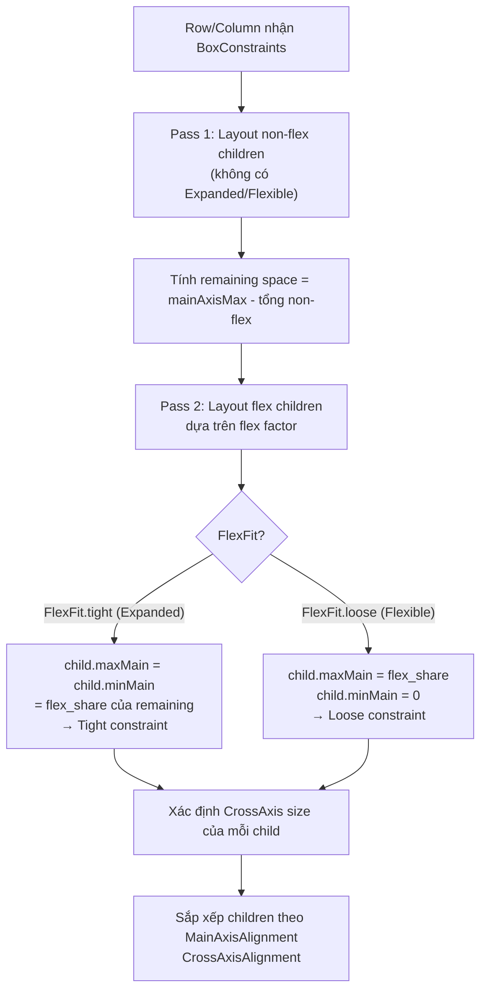

# Bài 4.3 — Flex Layouts: Row, Column, Expanded, Flexible

## Phần 1 — Khái Niệm & Mục Tiêu Bài Học

### Tại sao bài này quan trọng?

Row và Column là hai widget bạn dùng nhiều nhất trong Flutter. Nhưng bao nhiêu developer thực sự hiểu sự khác biệt giữa `Expanded` và `Flexible`?

```dart
// Câu đố: Hai layout này khác nhau thế nào?
Row(children: [
  Expanded(child: Container(color: Colors.red)),
  const SizedBox(width: 100),
])

Row(children: [
  Flexible(child: Container(color: Colors.red)),
  const SizedBox(width: 100),
])
```

**Đáp án:** `Expanded` → Container fill toàn bộ remaining space (tight). `Flexible` → Container *có thể* nhỏ hơn nếu content nhỏ hơn remaining space (loose).

### Bạn sẽ hiểu được sau bài này:
- MainAxisSize, MainAxisAlignment, CrossAxisAlignment
- `Expanded` = `Flexible(fit: FlexFit.tight)` — buộc fill remaining
- `Flexible(fit: FlexFit.loose)` — flex nhưng không force fill
- `Spacer`, `SizedBox`, `Divider` — dùng đúng công cụ
- Implement complex card layout thuần Row/Column

---

## Phần 2 — Cơ Chế Hoạt Động (Under the Hood)

### Flex Layout Algorithm



### Flex Factor — Chia sẻ remaining space

```
Row width = 300
Non-flex: SizedBox(60) + SizedBox(40) = 100
Remaining = 200

Expanded(flex: 1) + Expanded(flex: 2) + Expanded(flex: 1)
Total flex = 1+2+1 = 4
→ flex:1 nhận 200 * (1/4) = 50
→ flex:2 nhận 200 * (2/4) = 100
→ flex:1 nhận 200 * (1/4) = 50
```

---

## Phần 3 — Code Mẫu Chuẩn Google

### 3.1 — MainAxisAlignment và CrossAxisAlignment

```dart
// Horizontal layout (Row):
// MainAxis = horizontal, CrossAxis = vertical
// Vertical layout (Column):
// MainAxis = vertical, CrossAxis = horizontal

class FlexDemoScreen extends StatelessWidget {
  const FlexDemoScreen({super.key});

  @override
  Widget build(BuildContext context) {
    return Scaffold(
      body: SingleChildScrollView(
        child: Column(
          // mainAxisSize: min → shrink to content height (không fill)
          // mainAxisSize: max (default) → fill available height
          mainAxisSize: MainAxisSize.min,
          crossAxisAlignment: CrossAxisAlignment.stretch, // Stretch children width
          children: [
            // MainAxisAlignment
            _DemoSection(
              label: 'start (default)',
              child: Row(
                mainAxisAlignment: MainAxisAlignment.start,
                children: _colorBoxes(),
              ),
            ),
            _DemoSection(
              label: 'center',
              child: Row(
                mainAxisAlignment: MainAxisAlignment.center,
                children: _colorBoxes(),
              ),
            ),
            _DemoSection(
              label: 'end',
              child: Row(
                mainAxisAlignment: MainAxisAlignment.end,
                children: _colorBoxes(),
              ),
            ),
            _DemoSection(
              label: 'spaceBetween',
              child: Row(
                mainAxisAlignment: MainAxisAlignment.spaceBetween,
                children: _colorBoxes(),
              ),
            ),
            _DemoSection(
              label: 'spaceAround',
              child: Row(
                mainAxisAlignment: MainAxisAlignment.spaceAround,
                children: _colorBoxes(),
              ),
            ),
            _DemoSection(
              label: 'spaceEvenly',
              child: Row(
                mainAxisAlignment: MainAxisAlignment.spaceEvenly,
                children: _colorBoxes(),
              ),
            ),
          ],
        ),
      ),
    );
  }

  List<Widget> _colorBoxes() => [
    Container(width: 40, height: 40, color: Colors.red),
    Container(width: 60, height: 40, color: Colors.green),
    Container(width: 30, height: 40, color: Colors.blue),
  ];
}

class _DemoSection extends StatelessWidget {
  final String label;
  final Widget child;
  const _DemoSection({required this.label, required this.child});

  @override
  Widget build(BuildContext context) {
    return Column(
      crossAxisAlignment: CrossAxisAlignment.start,
      children: [
        Padding(
          padding: const EdgeInsets.fromLTRB(8, 16, 8, 4),
          child: Text(label, style: const TextStyle(fontWeight: FontWeight.bold)),
        ),
        ColoredBox(
          color: Colors.grey.shade200,
          child: child,
        ),
      ],
    );
  }
}
```

### 3.2 — Expanded vs Flexible

```dart
class ExpandedVsFlexible extends StatelessWidget {
  const ExpandedVsFlexible({super.key});

  @override
  Widget build(BuildContext context) {
    return Column(
      children: [
        // Expanded: fill toàn bộ remaining space (tight constraint)
        // Container bị ép phải có width = remaining
        _RowDemo(
          label: 'Expanded (tight)',
          child: Row(
            children: [
              Expanded(
                child: Container(
                  height: 40,
                  color: Colors.blue,
                  // Nếu Text ngắn → Container vẫn fill full remaining
                  child: const Text('Short'),
                ),
              ),
              Container(width: 80, height: 40, color: Colors.red),
            ],
          ),
        ),

        const SizedBox(height: 16),

        // Flexible: loose constraint → Container chỉ to bằng content
        // Nếu content nhỏ hơn remaining → Container nhỏ hơn
        _RowDemo(
          label: 'Flexible (loose)',
          child: Row(
            children: [
              Flexible(
                child: Container(
                  height: 40,
                  color: Colors.blue.shade200,
                  // Container chỉ rộng bằng Text "Short"
                  child: const Text('Short'),
                ),
              ),
              Container(width: 80, height: 40, color: Colors.red),
            ],
          ),
        ),

        const SizedBox(height: 16),

        // Flex factor: chia remaining space theo tỷ lệ
        _RowDemo(
          label: 'Expanded flex:2 và flex:1',
          child: Row(
            children: [
              Expanded(
                flex: 2, // Nhận 2/3 remaining space
                child: Container(height: 40, color: Colors.blue),
              ),
              Expanded(
                flex: 1, // Nhận 1/3 remaining space
                child: Container(height: 40, color: Colors.green),
              ),
            ],
          ),
        ),
      ],
    );
  }
}

class _RowDemo extends StatelessWidget {
  final String label;
  final Widget child;
  const _RowDemo({required this.label, required this.child});

  @override
  Widget build(BuildContext context) => Column(
    crossAxisAlignment: CrossAxisAlignment.start,
    children: [
      Text(label),
      child,
    ],
  );
}
```

### 3.3 — Spacer, SizedBox, Divider — Dùng đúng công cụ

```dart
class SpacingTools extends StatelessWidget {
  const SpacingTools({super.key});

  @override
  Widget build(BuildContext context) {
    return Column(
      children: [
        // SizedBox: khoảng cách cố định giữa các widget
        const Text('Item 1'),
        const SizedBox(height: 8),  // 8px cố định
        const Text('Item 2'),
        const SizedBox(height: 16), // 16px cố định
        const Text('Item 3'),

        // Spacer = Expanded(flex:1) — lấy remaining space trong Flex
        Row(
          children: [
            const Text('Left'),
            const Spacer(), // Push text sang phải
            const Text('Right'),
          ],
        ),

        // Spacer với flex
        Row(
          children: [
            const Icon(Icons.home),
            const Spacer(flex: 2), // Nhiều space hơn
            const Icon(Icons.settings),
            const Spacer(flex: 1), // Ít space hơn
            const Icon(Icons.person),
          ],
        ),

        // Divider: đường kẻ ngang trong Column
        const Divider(height: 1, color: Colors.grey),
        // VerticalDivider: đường kẻ dọc trong Row
        SizedBox(
          height: 40,
          child: Row(
            children: [
              const Text('Trái'),
              const VerticalDivider(width: 16, color: Colors.grey),
              const Text('Phải'),
            ],
          ),
        ),
      ],
    );
  }
}
```

### 3.4 — Complex Card Layout thuần Row/Column

```dart
// Minh họa: Build product card phức tạp chỉ dùng Row/Column
class ProductDetailCard extends StatelessWidget {
  final Product product;
  const ProductDetailCard({super.key, required this.product});

  @override
  Widget build(BuildContext context) {
    final theme = Theme.of(context);

    return Card(
      clipBehavior: Clip.antiAlias,
      child: Column(
        crossAxisAlignment: CrossAxisAlignment.stretch,
        mainAxisSize: MainAxisSize.min,
        children: [
          // Product image + sale badge (Stack used here — see 4.4)
          AspectRatio(
            aspectRatio: 16 / 9,
            child: Image.network(product.imageUrl, fit: BoxFit.cover),
          ),

          Padding(
            padding: const EdgeInsets.all(12),
            child: Column(
              crossAxisAlignment: CrossAxisAlignment.start,
              children: [
                // Title row: name + rating
                Row(
                  crossAxisAlignment: CrossAxisAlignment.start,
                  children: [
                    Expanded(
                      child: Text(
                        product.name,
                        style: theme.textTheme.titleMedium?.copyWith(
                          fontWeight: FontWeight.bold,
                        ),
                        maxLines: 2,
                        overflow: TextOverflow.ellipsis,
                      ),
                    ),
                    const SizedBox(width: 8),
                    Row(
                      mainAxisSize: MainAxisSize.min,
                      children: [
                        const Icon(Icons.star, color: Colors.amber, size: 16),
                        Text('${product.rating}',
                            style: theme.textTheme.bodySmall),
                      ],
                    ),
                  ],
                ),

                const SizedBox(height: 4),

                // Category chip
                Text(
                  product.category,
                  style: theme.textTheme.bodySmall?.copyWith(
                    color: theme.colorScheme.primary,
                  ),
                ),

                const SizedBox(height: 8),

                // Price + Add to cart
                Row(
                  children: [
                    Column(
                      crossAxisAlignment: CrossAxisAlignment.start,
                      children: [
                        if (product.originalPrice != null)
                          Text(
                            '${product.originalPrice!.toStringAsFixed(0)}đ',
                            style: theme.textTheme.bodySmall?.copyWith(
                              decoration: TextDecoration.lineThrough,
                              color: Colors.grey,
                            ),
                          ),
                        Text(
                          '${product.price.toStringAsFixed(0)}đ',
                          style: theme.textTheme.titleMedium?.copyWith(
                            color: theme.colorScheme.primary,
                            fontWeight: FontWeight.bold,
                          ),
                        ),
                      ],
                    ),
                    const Spacer(),
                    FilledButton.icon(
                      onPressed: () {},
                      icon: const Icon(Icons.add_shopping_cart),
                      label: const Text('Thêm'),
                    ),
                  ],
                ),
              ],
            ),
          ),
        ],
      ),
    );
  }
}
```

---

## Phần 4 — Lỗi Sai Phổ Biến & Best Practices

### ❌ Anti-pattern 1: Expanded bên ngoài Row/Column

```dart
// ❌ Lỗi: Expanded chỉ valid bên trong Row, Column, hoặc Flex
Column(children: [
  Row(children: [
    Expanded( // ❌ Expanded bên trong Row → OK
      child: Expanded( // ❌ Expanded bên trong Expanded → Lỗi!
        child: Text('Hi'),
      ),
    ),
  ]),
])

// ✅ Đúng: Expanded chỉ ở level trực tiếp trong Flex
Column(children: [
  Row(children: [
    Expanded(child: Text('Hi')), // ✅
  ]),
])
```

### ❌ Anti-pattern 2: CrossAxisAlignment.stretch + Column bên trong Column

```dart
// ❌ Gây confusion: outer Column stretch → inner Column stretch → text stretched
Column(
  crossAxisAlignment: CrossAxisAlignment.stretch,
  children: [
    Column( // Inner Column cũng bị stretch
      children: [
        Text('Text bị stretch đến edge!'), // Text bị kéo dãn
      ],
    ),
  ],
)

// ✅ Đúng: Explicit crossAxisAlignment cho inner Column
Column(
  crossAxisAlignment: CrossAxisAlignment.stretch,
  children: [
    Column(
      crossAxisAlignment: CrossAxisAlignment.start, // Override
      children: [
        const Text('Text giữ size tự nhiên'),
      ],
    ),
  ],
)
```

### ❌ Anti-pattern 3: Dùng SizedBox thay Spacer trong Flex

```dart
// ❌ Không responsive: SizedBox(width: 100) cố định
Row(children: [
  const Text('Left'),
  const SizedBox(width: 100), // Cố định 100px — không responsive!
  const Text('Right'),
])

// ✅ Đúng: Spacer = Expanded → flex theo available space
Row(children: [
  const Text('Left'),
  const Spacer(), // Tự động fill remaining
  const Text('Right'),
])
```

---

## Phần 5 — Bài Tập Củng Cố Tư Duy

### Challenge: Implement Card Layout Phức Tạp

**Yêu cầu:** Xây dựng `HotelCard` với layout:
```
┌──────────────────────────────────┐
│  [Image 120x120]  Hotel Name     │
│                   ★★★★★ 4.8      │
│                   Location       │
│                   ...            │
│  Amenities: 🏊 🍽️ 🅿️            │
│  [From $99/night]    [Book Now] │
└──────────────────────────────────┘
```

**Constraints:**
- Image bên trái, text bên phải — dùng Row
- Star rating và review count cùng hàng
- Amenities icons với gap đều nhau
- Price bên trái, button bên phải — dùng Spacer

### Câu hỏi phỏng vấn liên quan:

1. **"Sự khác biệt giữa `Expanded` và `Flexible`?"**
   - `Expanded` = `Flexible(fit: FlexFit.tight)` — child bị ép fill flex share
   - `Flexible(fit: FlexFit.loose)` — child có thể nhỏ hơn flex share

2. **"MainAxisSize.min vs MainAxisSize.max?"**
   - `max` (default): Column/Row fill toàn bộ available space
   - `min`: shrink to fit children — không expand thêm

3. **"Khi nào dùng `Spacer` thay vì `SizedBox`?"**
   - `Spacer`: khi cần fill remaining space (responsive)
   - `SizedBox`: khi cần khoảng cách cố định
