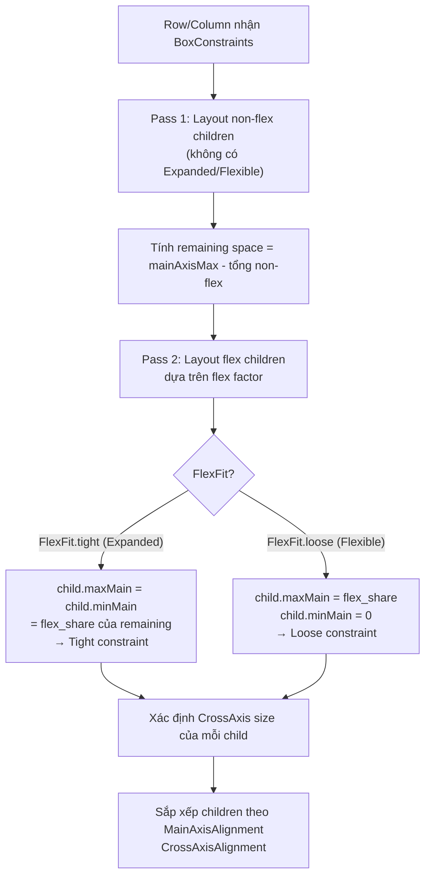

# Bài 4.3 — Flex Layouts: Row, Column, Expanded, Flexible

## Phần 1 — Khái Niệm & Mục Tiêu Bài Học

### Tại sao bài này quan trọng?

Row và Column là hai widget bạn dùng nhiều nhất trong Flutter. Nhưng bao nhiêu developer thực sự hiểu sự khác biệt giữa `Expanded` và `Flexible`?

```dart
// Câu đố: Hai layout này khác nhau thế nào?
Row(children: [
  Expanded(child: Container(color: Colors.red)),
  const SizedBox(width: 100),
])

Row(children: [
  Flexible(child: Container(color: Colors.red)),
  const SizedBox(width: 100),
])
```

**Đáp án:** `Expanded` → Container fill toàn bộ remaining space (tight). `Flexible` → Container *có thể* nhỏ hơn nếu content nhỏ hơn remaining space (loose).

### Bạn sẽ hiểu được sau bài này:
- MainAxisSize, MainAxisAlignment, CrossAxisAlignment
- `Expanded` = `Flexible(fit: FlexFit.tight)` — buộc fill remaining
- `Flexible(fit: FlexFit.loose)` — flex nhưng không force fill
- `Spacer`, `SizedBox`, `Divider` — dùng đúng công cụ
- Implement complex card layout thuần Row/Column

---

## Phần 2 — Cơ Chế Hoạt Động (Under the Hood)

### Flex Layout Algorithm



### Flex Factor — Chia sẻ remaining space

```
Row width = 300
Non-flex: SizedBox(60) + SizedBox(40) = 100
Remaining = 200

Expanded(flex: 1) + Expanded(flex: 2) + Expanded(flex: 1)
Total flex = 1+2+1 = 4
→ flex:1 nhận 200 * (1/4) = 50
→ flex:2 nhận 200 * (2/4) = 100
→ flex:1 nhận 200 * (1/4) = 50
```

---

## Phần 3 — Code Mẫu Chuẩn Google

### 3.1 — MainAxisAlignment và CrossAxisAlignment

```dart
// Horizontal layout (Row):
// MainAxis = horizontal, CrossAxis = vertical
// Vertical layout (Column):
// MainAxis = vertical, CrossAxis = horizontal

class FlexDemoScreen extends StatelessWidget {
  const FlexDemoScreen({super.key});

  @override
  Widget build(BuildContext context) {
    return Scaffold(
      body: SingleChildScrollView(
        child: Column(
          // mainAxisSize: min → shrink to content height (không fill)
          // mainAxisSize: max (default) → fill available height
          mainAxisSize: MainAxisSize.min,
          crossAxisAlignment: CrossAxisAlignment.stretch, // Stretch children width
          children: [
            // MainAxisAlignment
            _DemoSection(
              label: 'start (default)',
              child: Row(
                mainAxisAlignment: MainAxisAlignment.start,
                children: _colorBoxes(),
              ),
            ),
            _DemoSection(
              label: 'center',
              child: Row(
                mainAxisAlignment: MainAxisAlignment.center,
                children: _colorBoxes(),
              ),
            ),
            _DemoSection(
              label: 'end',
              child: Row(
                mainAxisAlignment: MainAxisAlignment.end,
                children: _colorBoxes(),
              ),
            ),
            _DemoSection(
              label: 'spaceBetween',
              child: Row(
                mainAxisAlignment: MainAxisAlignment.spaceBetween,
                children: _colorBoxes(),
              ),
            ),
            _DemoSection(
              label: 'spaceAround',
              child: Row(
                mainAxisAlignment: MainAxisAlignment.spaceAround,
                children: _colorBoxes(),
              ),
            ),
            _DemoSection(
              label: 'spaceEvenly',
              child: Row(
                mainAxisAlignment: MainAxisAlignment.spaceEvenly,
                children: _colorBoxes(),
              ),
            ),
          ],
        ),
      ),
    );
  }

  List<Widget> _colorBoxes() => [
    Container(width: 40, height: 40, color: Colors.red),
    Container(width: 60, height: 40, color: Colors.green),
    Container(width: 30, height: 40, color: Colors.blue),
  ];
}

class _DemoSection extends StatelessWidget {
  final String label;
  final Widget child;
  const _DemoSection({required this.label, required this.child});

  @override
  Widget build(BuildContext context) {
    return Column(
      crossAxisAlignment: CrossAxisAlignment.start,
      children: [
        Padding(
          padding: const EdgeInsets.fromLTRB(8, 16, 8, 4),
          child: Text(label, style: const TextStyle(fontWeight: FontWeight.bold)),
        ),
        ColoredBox(
          color: Colors.grey.shade200,
          child: child,
        ),
      ],
    );
  }
}
```

### 3.2 — Expanded vs Flexible

```dart
class ExpandedVsFlexible extends StatelessWidget {
  const ExpandedVsFlexible({super.key});

  @override
  Widget build(BuildContext context) {
    return Column(
      children: [
        // Expanded: fill toàn bộ remaining space (tight constraint)
        // Container bị ép phải có width = remaining
        _RowDemo(
          label: 'Expanded (tight)',
          child: Row(
            children: [
              Expanded(
                child: Container(
                  height: 40,
                  color: Colors.blue,
                  // Nếu Text ngắn → Container vẫn fill full remaining
                  child: const Text('Short'),
                ),
              ),
              Container(width: 80, height: 40, color: Colors.red),
            ],
          ),
        ),

        const SizedBox(height: 16),

        // Flexible: loose constraint → Container chỉ to bằng content
        // Nếu content nhỏ hơn remaining → Container nhỏ hơn
        _RowDemo(
          label: 'Flexible (loose)',
          child: Row(
            children: [
              Flexible(
                child: Container(
                  height: 40,
                  color: Colors.blue.shade200,
                  // Container chỉ rộng bằng Text "Short"
                  child: const Text('Short'),
                ),
              ),
              Container(width: 80, height: 40, color: Colors.red),
            ],
          ),
        ),

        const SizedBox(height: 16),

        // Flex factor: chia remaining space theo tỷ lệ
        _RowDemo(
          label: 'Expanded flex:2 và flex:1',
          child: Row(
            children: [
              Expanded(
                flex: 2, // Nhận 2/3 remaining space
                child: Container(height: 40, color: Colors.blue),
              ),
              Expanded(
                flex: 1, // Nhận 1/3 remaining space
                child: Container(height: 40, color: Colors.green),
              ),
            ],
          ),
        ),
      ],
    );
  }
}

class _RowDemo extends StatelessWidget {
  final String label;
  final Widget child;
  const _RowDemo({required this.label, required this.child});

  @override
  Widget build(BuildContext context) => Column(
    crossAxisAlignment: CrossAxisAlignment.start,
    children: [
      Text(label),
      child,
    ],
  );
}
```

### 3.3 — Spacer, SizedBox, Divider — Dùng đúng công cụ

```dart
class SpacingTools extends StatelessWidget {
  const SpacingTools({super.key});

  @override
  Widget build(BuildContext context) {
    return Column(
      children: [
        // SizedBox: khoảng cách cố định giữa các widget
        const Text('Item 1'),
        const SizedBox(height: 8),  // 8px cố định
        const Text('Item 2'),
        const SizedBox(height: 16), // 16px cố định
        const Text('Item 3'),

        // Spacer = Expanded(flex:1) — lấy remaining space trong Flex
        Row(
          children: [
            const Text('Left'),
            const Spacer(), // Push text sang phải
            const Text('Right'),
          ],
        ),

        // Spacer với flex
        Row(
          children: [
            const Icon(Icons.home),
            const Spacer(flex: 2), // Nhiều space hơn
            const Icon(Icons.settings),
            const Spacer(flex: 1), // Ít space hơn
            const Icon(Icons.person),
          ],
        ),

        // Divider: đường kẻ ngang trong Column
        const Divider(height: 1, color: Colors.grey),
        // VerticalDivider: đường kẻ dọc trong Row
        SizedBox(
          height: 40,
          child: Row(
            children: [
              const Text('Trái'),
              const VerticalDivider(width: 16, color: Colors.grey),
              const Text('Phải'),
            ],
          ),
        ),
      ],
    );
  }
}
```

### 3.4 — Complex Card Layout thuần Row/Column

```dart
// Minh họa: Build product card phức tạp chỉ dùng Row/Column
class ProductDetailCard extends StatelessWidget {
  final Product product;
  const ProductDetailCard({super.key, required this.product});

  @override
  Widget build(BuildContext context) {
    final theme = Theme.of(context);

    return Card(
      clipBehavior: Clip.antiAlias,
      child: Column(
        crossAxisAlignment: CrossAxisAlignment.stretch,
        mainAxisSize: MainAxisSize.min,
        children: [
          // Product image + sale badge (Stack used here — see 4.4)
          AspectRatio(
            aspectRatio: 16 / 9,
            child: Image.network(product.imageUrl, fit: BoxFit.cover),
          ),

          Padding(
            padding: const EdgeInsets.all(12),
            child: Column(
              crossAxisAlignment: CrossAxisAlignment.start,
              children: [
                // Title row: name + rating
                Row(
                  crossAxisAlignment: CrossAxisAlignment.start,
                  children: [
                    Expanded(
                      child: Text(
                        product.name,
                        style: theme.textTheme.titleMedium?.copyWith(
                          fontWeight: FontWeight.bold,
                        ),
                        maxLines: 2,
                        overflow: TextOverflow.ellipsis,
                      ),
                    ),
                    const SizedBox(width: 8),
                    Row(
                      mainAxisSize: MainAxisSize.min,
                      children: [
                        const Icon(Icons.star, color: Colors.amber, size: 16),
                        Text('${product.rating}',
                            style: theme.textTheme.bodySmall),
                      ],
                    ),
                  ],
                ),

                const SizedBox(height: 4),

                // Category chip
                Text(
                  product.category,
                  style: theme.textTheme.bodySmall?.copyWith(
                    color: theme.colorScheme.primary,
                  ),
                ),

                const SizedBox(height: 8),

                // Price + Add to cart
                Row(
                  children: [
                    Column(
                      crossAxisAlignment: CrossAxisAlignment.start,
                      children: [
                        if (product.originalPrice != null)
                          Text(
                            '${product.originalPrice!.toStringAsFixed(0)}đ',
                            style: theme.textTheme.bodySmall?.copyWith(
                              decoration: TextDecoration.lineThrough,
                              color: Colors.grey,
                            ),
                          ),
                        Text(
                          '${product.price.toStringAsFixed(0)}đ',
                          style: theme.textTheme.titleMedium?.copyWith(
                            color: theme.colorScheme.primary,
                            fontWeight: FontWeight.bold,
                          ),
                        ),
                      ],
                    ),
                    const Spacer(),
                    FilledButton.icon(
                      onPressed: () {},
                      icon: const Icon(Icons.add_shopping_cart),
                      label: const Text('Thêm'),
                    ),
                  ],
                ),
              ],
            ),
          ),
        ],
      ),
    );
  }
}
```

---

## Phần 4 — Lỗi Sai Phổ Biến & Best Practices

### ❌ Anti-pattern 1: Expanded bên ngoài Row/Column

```dart
// ❌ Lỗi: Expanded chỉ valid bên trong Row, Column, hoặc Flex
Column(children: [
  Row(children: [
    Expanded( // ❌ Expanded bên trong Row → OK
      child: Expanded( // ❌ Expanded bên trong Expanded → Lỗi!
        child: Text('Hi'),
      ),
    ),
  ]),
])

// ✅ Đúng: Expanded chỉ ở level trực tiếp trong Flex
Column(children: [
  Row(children: [
    Expanded(child: Text('Hi')), // ✅
  ]),
])
```

### ❌ Anti-pattern 2: CrossAxisAlignment.stretch + Column bên trong Column

```dart
// ❌ Gây confusion: outer Column stretch → inner Column stretch → text stretched
Column(
  crossAxisAlignment: CrossAxisAlignment.stretch,
  children: [
    Column( // Inner Column cũng bị stretch
      children: [
        Text('Text bị stretch đến edge!'), // Text bị kéo dãn
      ],
    ),
  ],
)

// ✅ Đúng: Explicit crossAxisAlignment cho inner Column
Column(
  crossAxisAlignment: CrossAxisAlignment.stretch,
  children: [
    Column(
      crossAxisAlignment: CrossAxisAlignment.start, // Override
      children: [
        const Text('Text giữ size tự nhiên'),
      ],
    ),
  ],
)
```

### ❌ Anti-pattern 3: Dùng SizedBox thay Spacer trong Flex

```dart
// ❌ Không responsive: SizedBox(width: 100) cố định
Row(children: [
  const Text('Left'),
  const SizedBox(width: 100), // Cố định 100px — không responsive!
  const Text('Right'),
])

// ✅ Đúng: Spacer = Expanded → flex theo available space
Row(children: [
  const Text('Left'),
  const Spacer(), // Tự động fill remaining
  const Text('Right'),
])
```

---

## Phần 5 — Bài Tập Củng Cố Tư Duy

### Challenge: Implement Card Layout Phức Tạp

**Yêu cầu:** Xây dựng `HotelCard` với layout:
```
┌──────────────────────────────────┐
│  [Image 120x120]  Hotel Name     │
│                   ★★★★★ 4.8      │
│                   Location       │
│                   ...            │
│  Amenities: 🏊 🍽️ 🅿️            │
│  [From $99/night]    [Book Now] │
└──────────────────────────────────┘
```

**Constraints:**
- Image bên trái, text bên phải — dùng Row
- Star rating và review count cùng hàng
- Amenities icons với gap đều nhau
- Price bên trái, button bên phải — dùng Spacer

### Thử Thách Tư Duy & Thẩm Định Chuyên Sâu (Conceptual & Deep-Dive Check)

> **[Junior]** — nắm khái niệm | **[Middle]** — hiểu cơ chế | **[Senior]** — hiểu Flutter internals | **[Trace Code]** — đọc code và dự đoán output

---

#### Q1 [Junior] — "Sự khác biệt giữa `Expanded` và `Flexible`?"

**Trả lời chuẩn:**

`Expanded` là `Flexible(fit: FlexFit.tight)` — chúng chỉ khác nhau về `FlexFit`:

| | `Expanded` | `Flexible(fit: FlexFit.loose)` |
|---|---|---|
| **Child constraint** | Tight (buộc fill) | Loose (tối đa là flex share) |
| **Nếu child nhỏ hơn share** | Vẫn bị stretch đến flex share | Chỉ dùng kích thước thực của child |
| **Ví dụ điển hình** | Container, Column fill space | Text, Icon — không muốn stretch |

```dart
Row(children: [
  Flexible(child: Text('Short')),         // Text: natural width, không stretch
  Expanded(child: Container(color: red)), // Container: fill remaining space
])

// vs hai Expanded:
Row(children: [
  Expanded(child: Text('Short')),         // Text bị stretch đến 1/2 Row width
  Expanded(child: Container(color: red)),
])
```

---

#### Q2 [Junior] — "`MainAxisSize.min` vs `MainAxisSize.max` — ảnh hưởng gì đến Column/Row?"

**Trả lời chuẩn:**

| | `MainAxisSize.max` (default) | `MainAxisSize.min` |
|---|---|---|
| **Size trả về parent** | Fill toàn bộ main axis available | Shrink to fit children |
| **Available space** | Parent cho bao nhiêu, dùng bấy nhiêu | Chỉ dùng đúng size cần |
| **Ảnh hưởng Spacer** | Spacer hoạt động (có space để fill) | Spacer = size 0 (không có extra space) |

```dart
// MainAxisSize.max (default)
Column(
  mainAxisSize: MainAxisSize.max, // fill toàn bộ height từ parent
  children: [Text('A'), Text('B')],
) // height = parent available height

// MainAxisSize.min
Column(
  mainAxisSize: MainAxisSize.min, // chỉ cao bằng children
  children: [Text('A'), Text('B')],
) // height = height(A) + height(B)
// ← hữu ích cho Card/Dialog chỉ cao bằng nội dung
```

---

#### Q3 [Middle] — "Khi nào dùng `Spacer` thay vì `SizedBox`?"

**Trả lời chuẩn:**

| | `Spacer` | `SizedBox(width/height: x)` |
|---|---|---|
| **Loại space** | Flexible — fill remaining space | Fixed — luôn cùng size |
| **Responsive** | Tự điều chỉnh theo screen | Không |
| **Tương đương** | `Expanded(child: SizedBox.shrink())` | Cố định |

```dart
// Spacer — responsive layout
Row(children: [
  const Text('Left'),
  const Spacer(),              // fill toàn bộ remaining space
  const Text('Right'),
])
// → Left ... Right (left căn trái, right căn phải, space tự điều chỉnh)

// SizedBox — fixed spacing
Row(children: [
  const Text('Left'),
  const SizedBox(width: 16),  // luôn 16px, không responsive
  const Text('Right'),
])

// Spacer với flex
Row(children: [
  const Text('A'),
  const Spacer(flex: 2),      // 2/3 remaining space
  const Text('B'),
  const Spacer(flex: 1),      // 1/3 remaining space
  const Text('C'),
])
```

---

#### Q4 [Senior] — "Flex layout algorithm 2 passes: giải thích chi tiết `RenderFlex.performLayout()`"

**Trả lời chuẩn:**

`RenderFlex.performLayout()` có **2 passes** rõ ràng:

**Pass 1 — Inflexible children (không có flex/không có `Expanded`/`Flexible`):**
```
Loop inflexible children:
  child.layout(innerConstraints)
  allocatedSize += child.mainAxisExtent
  crossSize = max(crossSize, child.crossAxisExtent)

freeSpace = mainAxisAvailable - allocatedSize
totalFlex = sum(child.flex for flexible children)
```

**Pass 2 — Flexible children (có `Expanded` hoặc `Flexible`):**
```
remainingSpace = freeSpace
Loop flexible children:
  flexShare = freeSpace * (child.flex / totalFlex)
  if FlexFit.tight:
    child.layout(tightConstraint(flexShare))
  else: // FlexFit.loose
    child.layout(looseConstraint(max=flexShare))
  allocatedFlexSpace += child.mainAxisExtent
```

**Sau 2 passes:** Xác định offset cho mỗi child dựa trên `mainAxisAlignment` và `crossAxisAlignment`.

**Vì sao 2 passes?** Pass 1 cần biết tổng space của inflexible children trước, mới tính được `freeSpace` cho flexible children trong pass 2.

---

#### Q5 [Middle] — "`crossAxisAlignment: CrossAxisAlignment.stretch` làm gì với constraints?"

**Trả lời chuẩn:**

`CrossAxisAlignment.stretch` truyền **tight cross-axis constraint** cho children:

```dart
// Row với CrossAxisAlignment.stretch
Row(
  crossAxisAlignment: CrossAxisAlignment.stretch,
  children: [
    Container(color: Colors.red, width: 50),   // → height = parent height (tight!)
    Container(color: Colors.blue, width: 100),  // → height = parent height (tight!)
    const Text('Hello'),                         // → height = parent height (text bị stretch)
  ],
)
```

**Cơ chế:**
```
Row nhận constraint: BoxConstraints(0..390, 200..200) (tight height từ parent)
Với CrossAxisAlignment.stretch:
  child.layout(BoxConstraints(0..childWidth, 200..200)) // tight height!
  → children buộc phải có height = 200px

Với CrossAxisAlignment.start (default):
  child.layout(BoxConstraints(0..childWidth, 0..200)) // loose height
  → children tự chọn natural height
```

**Use case:** Làm tất cả cards trong Row có cùng height (fill Row height) — thay vì dùng `IntrinsicHeight` (2-pass, chậm hơn).

---

#### Q6 [Middle] — "Overflow trong Row/Column: `Overflow.clip` vs `Overflow.visible`?"

**Trả lời chuẩn:**

`Overflow` là deprecated enum trong Flutter mới — thay bằng `ClipBehavior`. Tuy nhiên câu hỏi về clipping vẫn quan trọng:

```dart
// Mặc định: overflow KHÔNG bị clip — hiện yellow/black stripes trong debug
Row(children: [
  Container(width: 400, color: Colors.red), // 400px > screen 390px
  // → 10px bị overflow, hiện stripe debug, không bị clip
])

// Clip overflow
OverflowBox(
  child: Container(width: 400, color: Colors.red),
) // clip tại boundary

// Dùng ClipRect để clip:
ClipRect(
  child: Row(children: [
    Container(width: 400, color: Colors.red),
  ]),
) // clip overflow tại Row boundary
```

**Trong production (release mode):** Overflow không hiển thị stripe nhưng nội dung vẫn visible (không bị clip). Để clip overflow, phải dùng `ClipRect`, `ClipRRect`, hoặc `ClipPath` explicitly.

---

#### Q7 [Trace Code] — "Row với 3 `Expanded` (flex 1,2,1): mỗi child nhận bao nhiêu % width?"

```dart
// Screen width = 390px
Row(
  children: [
    Expanded(
      flex: 1,
      child: Container(color: Colors.red, child: const Text('A')),
    ),
    Expanded(
      flex: 2,
      child: Container(color: Colors.blue, child: const Text('B')),
    ),
    Expanded(
      flex: 1,
      child: Container(color: Colors.green, child: const Text('C')),
    ),
  ],
)
```

**Tính toán:**

Pass 1 (non-flex children): Không có → `freeSpace = 390px`

Pass 2 (flex children):
- `totalFlex = 1 + 2 + 1 = 4`
- **A** (flex=1): `390 × 1/4 = **97.5px**` (25%)
- **B** (flex=2): `390 × 2/4 = **195px**` (50%)
- **C** (flex=1): `390 × 1/4 = **97.5px**` (25%)

**Thêm fixed-width item:**
```dart
Row(children: [
  const SizedBox(width: 50),           // fixed 50px (Pass 1)
  Expanded(flex: 1, child: ...),       // (390-50) × 1/3 = 113px
  Expanded(flex: 2, child: ...),       // (390-50) × 2/3 = 227px
])
```
Pass 1: SizedBox = 50px, `freeSpace = 390 - 50 = 340px`
Pass 2: flex child nhận `340px` tổng cộng theo tỉ lệ.
