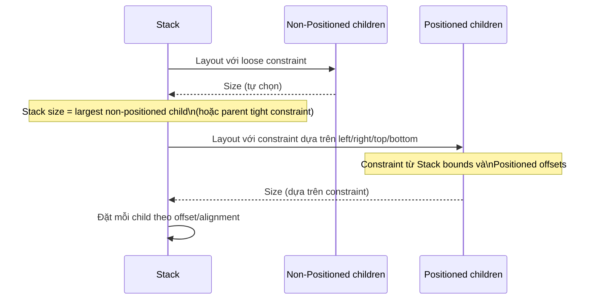

# Bài 4.4 — Stack, Positioned & Overlays

## Phần 1 — Khái Niệm & Mục Tiêu Bài Học

### Tại sao bài này quan trọng?

Row và Column xếp widget theo đường thẳng (horizontal/vertical). Nhưng UI thực tế thường cần **chồng lớp**:

- Badge notification lên icon
- Nút play overlay lên thumbnail video
- Watermark text trên ảnh
- Tooltip floating bên cạnh widget
- Bottom sheet sliding lên trên content

Tất cả đều cần `Stack` — widget xếp children chồng lên nhau.

### Bạn sẽ hiểu được sau bài này:
- `Stack` coordinate system — origin ở đâu?
- `Positioned` — đặt widget tại tọa độ tuyệt đối
- `Align` — đặt widget theo alignment trong Stack
- `LayoutBuilder` — build adaptive layout theo available space
- `OverflowBox`, `FittedBox`, `AspectRatio` — control sizing

---

## Phần 2 — Cơ Chế Hoạt Động (Under the Hood)

### Stack Layout Algorithm



### Stack Coordinate System

```
Stack (width=390, height=844)
Coordinate: (0,0) = top-left corner

  (0,0)────────────────────────(390,0)
    │                                │
    │    Positioned(               │
    │      left: 50,    → x=50    │
    │      top: 100,    → y=100   │
    │      child: Box(80x80)       │
    │    )                         │
    │                               │
  (0,844)──────────────────────(390,844)
```

---

## Phần 3 — Code Mẫu Chuẩn Google

### 3.1 — Stack và Positioned cơ bản

```dart
class NotificationBadge extends StatelessWidget {
  final Widget icon;
  final int badgeCount;
  const NotificationBadge({super.key, required this.icon, required this.badgeCount});

  @override
  Widget build(BuildContext context) {
    // Stack size = largest non-positioned child = icon size
    return Stack(
      clipBehavior: Clip.none, // Cho phép badge vượt ra ngoài Stack bounds
      children: [
        icon, // Non-positioned → xác định Stack size

        // Badge: Positioned ở góc trên phải của icon
        if (badgeCount > 0)
          Positioned(
            right: -6, // Âm → vượt ra ngoài Stack bounds (cần Clip.none)
            top: -6,
            child: Container(
              constraints: const BoxConstraints(minWidth: 20),
              padding: const EdgeInsets.symmetric(horizontal: 4, vertical: 2),
              decoration: BoxDecoration(
                color: Theme.of(context).colorScheme.error,
                borderRadius: BorderRadius.circular(10),
              ),
              child: Text(
                badgeCount > 99 ? '99+' : '$badgeCount',
                style: const TextStyle(
                  color: Colors.white,
                  fontSize: 10,
                  fontWeight: FontWeight.bold,
                ),
                textAlign: TextAlign.center,
              ),
            ),
          ),
      ],
    );
  }
}

// Dùng:
NotificationBadge(
  icon: const Icon(Icons.notifications, size: 32),
  badgeCount: 5,
)
```

### 3.2 — Align trong Stack

```dart
// Align vs Positioned:
// Align: dùng alignment (-1.0 đến 1.0) → responsive theo Stack size
// Positioned: dùng absolute pixel offset → cố định

class VideoThumbnail extends StatelessWidget {
  final String thumbnailUrl;
  final Duration duration;
  final VoidCallback? onPlay;

  const VideoThumbnail({
    super.key,
    required this.thumbnailUrl,
    required this.duration,
    this.onPlay,
  });

  @override
  Widget build(BuildContext context) {
    return Stack(
      children: [
        // Background image — fill Stack
        Positioned.fill(
          child: Image.network(thumbnailUrl, fit: BoxFit.cover),
        ),

        // Gradient overlay → readable text
        Positioned.fill(
          child: DecoratedBox(
            decoration: BoxDecoration(
              gradient: LinearGradient(
                begin: Alignment.topCenter,
                end: Alignment.bottomCenter,
                colors: [Colors.transparent, Colors.black.withOpacity(0.7)],
              ),
            ),
          ),
        ),

        // Play button — center
        Align(
          alignment: Alignment.center,
          child: IconButton(
            onPressed: onPlay,
            icon: const Icon(Icons.play_circle_filled, color: Colors.white),
            iconSize: 64,
          ),
        ),

        // Duration badge — bottom right
        Align(
          alignment: Alignment.bottomRight,
          child: Padding(
            padding: const EdgeInsets.all(8),
            child: Container(
              padding: const EdgeInsets.symmetric(horizontal: 6, vertical: 2),
              decoration: BoxDecoration(
                color: Colors.black.withOpacity(0.7),
                borderRadius: BorderRadius.circular(4),
              ),
              child: Text(
                _formatDuration(duration),
                style: const TextStyle(color: Colors.white, fontSize: 12),
              ),
            ),
          ),
        ),
      ],
    );
  }

  String _formatDuration(Duration d) {
    final m = d.inMinutes.remainder(60).toString().padLeft(2, '0');
    final s = d.inSeconds.remainder(60).toString().padLeft(2, '0');
    return '$m:$s';
  }
}
```

### 3.3 — LayoutBuilder — Adaptive Layout

```dart
// LayoutBuilder: build widget dựa trên constraint thực tế từ parent
// Khác với MediaQuery (screen size), LayoutBuilder biết EXACTLY available space

class AdaptiveProductCard extends StatelessWidget {
  final Product product;
  const AdaptiveProductCard({super.key, required this.product});

  @override
  Widget build(BuildContext context) {
    return LayoutBuilder(
      builder: (context, constraints) {
        // Quyết định layout dựa trên available width
        final isWide = constraints.maxWidth > 300;

        if (isWide) {
          // Wide layout: image + text side by side
          return Row(
            children: [
              SizedBox(
                width: 120,
                child: Image.network(product.imageUrl, fit: BoxFit.cover),
              ),
              Expanded(
                child: Padding(
                  padding: const EdgeInsets.all(12),
                  child: _ProductInfo(product: product),
                ),
              ),
            ],
          );
        } else {
          // Narrow layout: image on top, text below
          return Column(
            crossAxisAlignment: CrossAxisAlignment.stretch,
            children: [
              AspectRatio(
                aspectRatio: 16 / 9,
                child: Image.network(product.imageUrl, fit: BoxFit.cover),
              ),
              Padding(
                padding: const EdgeInsets.all(12),
                child: _ProductInfo(product: product),
              ),
            ],
          );
        }
      },
    );
  }
}

class _ProductInfo extends StatelessWidget {
  final Product product;
  const _ProductInfo({required this.product});

  @override
  Widget build(BuildContext context) {
    return Column(
      crossAxisAlignment: CrossAxisAlignment.start,
      children: [
        Text(product.name, style: Theme.of(context).textTheme.titleMedium),
        Text('${product.price}đ', style: Theme.of(context).textTheme.bodyLarge),
      ],
    );
  }
}
```

### 3.4 — AspectRatio và FittedBox

```dart
class ImageSection extends StatelessWidget {
  final String imageUrl;
  const ImageSection({super.key, required this.imageUrl});

  @override
  Widget build(BuildContext context) {
    return Column(
      children: [
        // AspectRatio: giữ tỷ lệ width:height cố định
        AspectRatio(
          aspectRatio: 16 / 9, // width/height
          child: Image.network(imageUrl, fit: BoxFit.cover),
        ),

        const SizedBox(height: 16),

        // FittedBox: scale child để fit vào available space
        // Dùng khi content (text, icon) cần scale theo container
        SizedBox(
          width: 200,
          height: 100,
          child: FittedBox(
            fit: BoxFit.contain, // Scale down để fit, giữ aspect ratio
            child: Column(
              children: const [
                Icon(Icons.star, size: 60),
                Text('5.0 Rating', style: TextStyle(fontSize: 24)),
              ],
            ),
          ),
        ),

        const SizedBox(height: 16),

        // OverflowBox: cho phép child vượt ra ngoài parent bounds
        // Dùng cho effect đặc biệt như parallax, overlapping
        SizedBox(
          width: 200,
          height: 100,
          child: OverflowBox(
            maxWidth: 300, // Cho phép child rộng đến 300 dù parent chỉ 200
            child: Container(
              width: 300,
              height: 80,
              color: Colors.blue.withOpacity(0.3),
              child: const Center(child: Text('Overflow!')),
            ),
          ),
        ),
      ],
    );
  }
}
```

---

## Phần 4 — Lỗi Sai Phổ Biến & Best Practices

### ❌ Anti-pattern 1: Stack không có non-positioned child

```dart
// ❌ Lỗi: Stack size = 0 nếu không có non-positioned child
// → Positioned children có reference size = 0
Stack(
  children: [
    Positioned(left: 10, top: 10, child: Text('Tôi ở đâu?')),
    // Không có non-positioned child → Stack size = 0 → Positioned dựa trên 0x0!
  ],
)

// ✅ Đúng: Luôn có non-positioned child để xác định Stack size
Stack(
  children: [
    Container(width: 200, height: 200, color: Colors.grey), // Base
    const Positioned(left: 10, top: 10, child: Text('Tôi ở (10,10)')),
  ],
)
```

### ❌ Anti-pattern 2: Quên `clipBehavior` khi badge overflow

```dart
// ❌ Badge bị clip dù dùng âm offset
Stack(
  // clipBehavior: Clip.hardEdge (default) → clip child ra ngoài bounds
  children: [
    const Icon(Icons.notifications, size: 32),
    Positioned(
      right: -6, top: -6, // Muốn ra ngoài
      child: _badge, // 💥 Bị clip!
    ),
  ],
)

// ✅ Đúng
Stack(
  clipBehavior: Clip.none, // Cho phép overflow
  children: [
    const Icon(Icons.notifications, size: 32),
    Positioned(right: -6, top: -6, child: _badge), // Hiện đúng
  ],
)
```

### ❌ Anti-pattern 3: Positioned.fill thay Positioned không cần thiết

```dart
// ❌ Verbose
Positioned(left: 0, top: 0, right: 0, bottom: 0, child: Widget())

// ✅ Ngắn gọn hơn
Positioned.fill(child: Widget())
```

---

## Phần 5 — Bài Tập Củng Cố Tư Duy

### Challenge: Xây Avatar Badge Overlay

**Yêu cầu:** Component `UserAvatar` với:
1. Ảnh avatar hình tròn
2. Online status badge (chấm xanh) ở góc dưới phải
3. Badge overflow ra ngoài một chút (Clip.none)
4. Có `size` parameter để scale toàn bộ component
5. Nếu `isOnline = false` → không hiện badge

**Design spec:**
```
     ┌──────────┐
     │  Avatar  │
     │   Image  │●  ← Badge (12x12, màu xanh, border trắng 2px)
     └──────────┘
```

**Gợi ý:**
- Stack với `CircleAvatar` làm base
- `Positioned` cho badge: `right: 0, bottom: 0`
- Badge: Container với `BoxDecoration(shape: BoxShape.circle)`
- Border white: `Border.all(color: Colors.white, width: 2)`

### Thử Thách Tư Duy & Thẩm Định Chuyên Sâu (Conceptual & Deep-Dive Check)

> **[Junior]** — nắm khái niệm | **[Middle]** — hiểu cơ chế | **[Senior]** — hiểu Flutter internals | **[Trace Code]** — đọc code và dự đoán output

---

#### Q1 [Junior] — "Stack xác định size như thế nào? Positioned vs non-positioned children?"

**Trả lời chuẩn:**

Stack size phụ thuộc vào **non-positioned children** (children không bọc trong `Positioned`):

| Trường hợp | Stack size |
|---|---|
| Có non-positioned children | Bằng child lớn nhất (trong phạm vi constraint) |
| Tất cả đều Positioned | Fill toàn bộ parent constraint (tight hoặc loose) |

```dart
// Stack với non-positioned child → size = child size
Stack(
  children: [
    Container(width: 200, height: 200, color: Colors.blue),  // non-positioned
    Positioned(top: 10, left: 10, child: Icon(Icons.star)),   // positioned
  ],
) // Stack size = 200×200 (theo non-positioned Container)

// Stack không có non-positioned child → fill parent
Stack(
  children: [
    Positioned(top: 0, left: 0, right: 0, bottom: 0, child: Container(color: blue)),
    Positioned(top: 10, right: 10, child: Icon(Icons.star)),
  ],
) // Stack fill toàn bộ parent
```

---

#### Q2 [Junior] — "Sự khác biệt giữa `Align` và `Positioned` trong Stack?"

**Trả lời chuẩn:**

| | `Align` | `Positioned` |
|---|---|---|
| **Positioning** | Fraction alignment (-1.0 đến 1.0) | Pixel offsets (left, top, right, bottom) |
| **Responsive** | Tự điều chỉnh theo Stack size | Cố định tại pixel offset |
| **Chiếm Stack size** | Có (non-positioned) | Không |
| **Use case** | Center, top-right corner | Absolute position |

```dart
Stack(
  children: [
    Container(width: 300, height: 300, color: Colors.grey),
    
    // Align — responsive: luôn ở bottom-right của Stack
    const Align(
      alignment: Alignment.bottomRight,
      child: FloatingActionButton(onPressed: null, child: Icon(Icons.add)),
    ),
    
    // Positioned — absolute: 10px từ top, 10px từ right
    const Positioned(
      top: 10,
      right: 10,
      child: Icon(Icons.star, color: Colors.red),
    ),
  ],
)
```

---

#### Q3 [Middle] — "`Overlay` trong Flutter là gì? Navigator dùng Overlay thế nào?"

**Trả lời chuẩn:**

`Overlay` là widget đặc biệt hoạt động như một **Stack có thể insert entries từ bất kỳ đâu trong app**. Nó là infrastructure của Navigator, Dialog, SnackBar, và Tooltip.

```
MaterialApp
  └─ Navigator
      └─ Overlay         ← widget đặc biệt — "floating layer" trên toàn app
          ├─ OverlayEntry (route /home)
          ├─ OverlayEntry (route /profile)  ← push mới → insert OverlayEntry
          └─ OverlayEntry (dialog)           ← Dialog.show() → insert OverlayEntry
```

**Cách Navigator dùng Overlay:**
```dart
// Khi Navigator.push() được gọi:
final overlayEntry = OverlayEntry(
  builder: (context) => newRoute.buildPage(context, ...), // render route mới
);
Overlay.of(context)?.insert(overlayEntry); // đặt route mới lên trên

// Khi Navigator.pop():
overlayEntry.remove(); // xóa route khỏi Overlay
```

**Custom Overlay:** Bạn có thể dùng `Overlay.of(context)?.insert()` để show custom widget trên toàn screen mà không cần Dialog/Route — useful cho tooltips, custom dropdown, v.v.

---

#### Q4 [Senior] — "Stack paint order: child nào được paint trên cùng? Hit testing đi theo thứ tự nào?"

**Trả lời chuẩn:**

**Paint order:** Children trong Stack được paint theo thứ tự **index tăng dần** — child cuối cùng trong list sẽ được paint trên cùng (on top).

```dart
Stack(
  children: [
    Container(color: Colors.red),   // (0) — paint đầu tiên, ở dưới cùng
    Container(color: Colors.blue),  // (1) — paint thứ hai, che lên red
    Container(color: Colors.green), // (2) — paint cuối, ở trên cùng (visible)
  ],
)
// Kết quả: chỉ thấy green (che toàn bộ)
```

**Hit testing:** Đi theo thứ tự **ngược lại** (last child first) — child visible nhất (painted last) được kiểm tra đầu tiên trong hit test. Điều này đảm bảo tap events đến widget visible, không phải widget bị che.

```dart
Stack(
  children: [
    GestureDetector(                    // (0) — hit test sau
      onTap: () => print('red tapped'),
      child: Container(width: 200, height: 200, color: Colors.red),
    ),
    Positioned(                         // (1) — hit test trước (visible, painted last)
      top: 50, left: 50,
      child: GestureDetector(
        onTap: () => print('blue tapped'),
        child: Container(width: 100, height: 100, color: Colors.blue),
      ),
    ),
  ],
)
// Tap vào vùng blue → "blue tapped" (hit test dừng tại blue)
// Tap vào vùng red (ngoài blue) → "red tapped"
```

---

#### Q5 [Middle] — "`Positioned.fill` vs `Positioned(left:0, top:0, right:0, bottom:0)` — có khác không?"

**Trả lời chuẩn:**

**Không khác** về layout behavior — `Positioned.fill` là convenience constructor:

```dart
// Hai cách này hoàn toàn tương đương:
Positioned.fill(child: Container(color: Colors.red))
Positioned(left: 0, top: 0, right: 0, bottom: 0, child: Container(color: Colors.red))
```

`Positioned.fill` cũng có `offset` parameter cho khoảng cách đều nhau:
```dart
Positioned.fill(
  left: 16,    // từ left edge + 16px
  top: 16,     // từ top edge + 16px
  right: 16,   // từ right edge + 16px
  bottom: 16,  // từ bottom edge + 16px
  child: ...,
)
// Tương đương Positioned(left:16, top:16, right:16, bottom:16)
```

**Lưu ý:** Khi Positioned có cả `left` và `right` (hoặc `top` và `bottom`), width (hoặc height) của child được tính: `Stack.width - left - right`. Đây là cách làm child fill specific region trong Stack.

---

#### Q6 [Middle] — "Tại sao `Stack` không thể dùng `Spacer`? Cách thay thế?"

**Trả lời chuẩn:**

`Spacer` là `Expanded(child: SizedBox.shrink())` — nó chỉ hoạt động trong **Flex layout** (Row/Column) vì dựa vào `RenderFlex.performLayout()` để chia flex space.

`Stack` dùng `RenderStack.performLayout()` — không có flex concept, không có "remaining space" để distribute. Positioned children dùng absolute coordinates, non-positioned children chỉ align trong Stack bounds.

**Thay thế cho Spacer trong Stack:**

```dart
// Muốn đặt widget ở bottom của Stack:
Stack(
  children: [
    Container(width: 200, height: 200, color: Colors.blue),
    
    // ❌ Spacer không hoạt động trong Stack
    
    // ✅ Dùng Align
    const Align(
      alignment: Alignment.bottomCenter,
      child: Text('Bottom'),
    ),
    
    // ✅ Dùng Positioned
    const Positioned(
      bottom: 0,
      left: 0, right: 0,
      child: Text('Bottom'),
    ),
  ],
)
```

---

#### Q7 [Trace Code] — "Stack với non-positioned + positioned child: xác định final size của Stack"

```dart
Widget build(BuildContext context) {
  return Center(
    child: Stack(
      children: [
        // (A) Non-positioned
        Container(
          width: 200,
          height: 150,
          color: Colors.blue,
        ),
        // (B) Positioned với width/height implicit
        Positioned(
          top: 10,
          left: 10,
          child: Container(
            width: 300, // lớn hơn Stack!
            height: 50,
            color: Colors.red.withOpacity(0.7),
          ),
        ),
        // (C) Positioned.fill
        Positioned.fill(
          child: Container(color: Colors.green.withOpacity(0.3)),
        ),
      ],
    ),
  );
}
```

**Xác định Stack size và visual:**

**Stack size = size của non-positioned children = `(A) = 200×150`**

Vì Center truyền loose constraint, Stack chọn minimum size cần thiết = `(A)`.

**Visual từ dưới lên:**
1. `(A)` Blue 200×150 — painted first (bottom)
2. `(B)` Red 300×50 tại (10,10) — **300px > 200px (Stack width)** → overflow 100px bên phải Stack — visible nếu không có clip
3. `(C)` Positioned.fill = fill Stack size (200×150) — Green transparent overlay

**Overflow behavior:** `(B)` overflow ra ngoài Stack nhưng không bị clip mặc định. Trong debug mode thấy overflow stripe. Để clip: `Stack(clipBehavior: Clip.hardEdge, ...)` hoặc `ClipRect(child: Stack(...))`.

Nếu dùng `Stack(clipBehavior: Clip.hardEdge)` → `(B)` bị clip tại 200px width.
