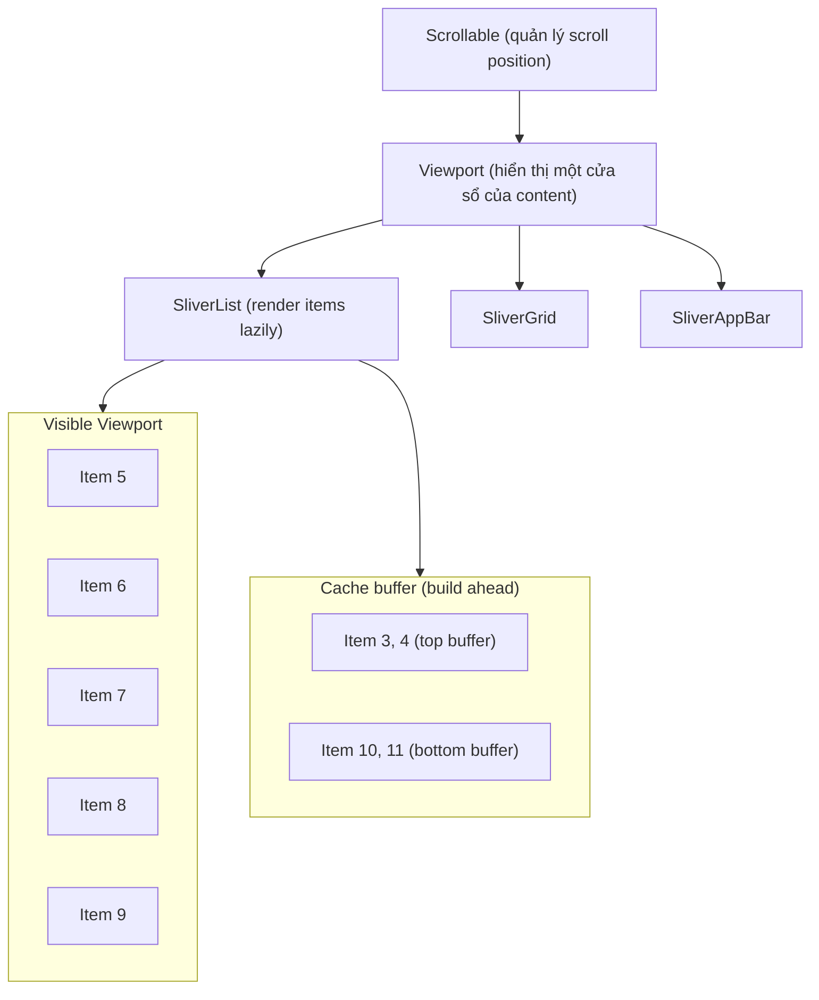

# Bài 4.5 — Scrollables & Virtualization

## Phần 1 — Khái Niệm & Mục Tiêu Bài Học

### Tại sao bài này quan trọng?

```dart
// Cách naive: build 1000 widget ngay lập tức
Column(
  children: List.generate(1000, (i) => ProductCard(product: products[i])),
)
// → 1000 widget build cùng lúc → 1000 layout → 1000 paint → JANK!

// Cách đúng: ListView.builder — virtualization
ListView.builder(
  itemCount: 1000,
  itemBuilder: (context, i) => ProductCard(product: products[i]),
)
// → Chỉ build ~20 widget trong viewport + buffer → Smooth scrolling
```

**Virtualization** là kỹ thuật chỉ build/render những gì user thực sự nhìn thấy.

### Bạn sẽ hiểu được sau bài này:
- `ListView.builder` vs `ListView` — sự khác biệt về virtualization
- `SliverList`, `SliverGrid`, `CustomScrollView` — powerful combo
- `ScrollController` — lắng nghe và control scroll position
- Implement infinite scroll với `ScrollController`

---

## Phần 2 — Cơ Chế Hoạt Động (Under the Hood)

### Viewport và Sliver Protocol



### ListView vs ListView.builder

```
ListView([widget1, widget2, ...]):
  - Build TẤT CẢ children ngay lập tức
  - Tốt cho danh sách nhỏ (<50 items)
  - Không lazy

ListView.builder(itemCount: N, itemBuilder: fn):
  - Chỉ build items trong viewport + cache extent
  - Tốt cho danh sách dài (100+ items)
  - Lazy build — O(viewport_size) không phải O(N)
  - Items được recycle khi scroll ra khỏi viewport
```

---

## Phần 3 — Code Mẫu Chuẩn Google

### 3.1 — ListView.builder — Cơ bản đúng cách

```dart
class ProductListScreen extends StatelessWidget {
  final List<Product> products;
  const ProductListScreen({super.key, required this.products});

  @override
  Widget build(BuildContext context) {
    if (products.isEmpty) {
      return const Center(child: Text('Chưa có sản phẩm'));
    }

    return ListView.builder(
      // Số lượng items — cho ListView biết "tổng chiều dài"
      itemCount: products.length,
      // cacheExtent: số pixels build trước/sau viewport (mặc định 250)
      // Tăng để scroll smoother nhưng dùng nhiều memory hơn
      cacheExtent: 500,
      // Padding: khoảng cách nội dung với edge
      padding: const EdgeInsets.symmetric(horizontal: 16, vertical: 8),
      // itemBuilder: gọi lazy khi item cần hiển thị
      itemBuilder: (context, index) {
        final product = products[index];
        return Padding(
          padding: const EdgeInsets.only(bottom: 8),
          child: ProductCard(
            // Key giúp Flutter reuse Element đúng cho đúng product
            key: ValueKey(product.id),
            product: product,
          ),
        );
      },
    );
  }
}

// ListView.separated: tự động thêm separator giữa items
ListView.separated(
  itemCount: items.length,
  itemBuilder: (_, i) => ItemTile(item: items[i]),
  separatorBuilder: (_, i) => const Divider(height: 1),
)
```

### 3.2 — Slivers — Composable Scrollable

```dart
// CustomScrollView + Slivers = cực kỳ flexible
// Slivers có thể kết hợp: AppBar, Grid, List, Box... trong cùng scroll
class ShopScreen extends StatelessWidget {
  final List<Category> categories;
  final List<Product> featuredProducts;
  final List<Product> allProducts;

  const ShopScreen({
    super.key,
    required this.categories,
    required this.featuredProducts,
    required this.allProducts,
  });

  @override
  Widget build(BuildContext context) {
    return CustomScrollView(
      slivers: [
        // SliverAppBar: AppBar có thể collapse/expand khi scroll
        SliverAppBar(
          title: const Text('Shop'),
          floating: true,     // Xuất hiện lại khi scroll lên
          pinned: false,      // Không pin trên đầu
          expandedHeight: 200,
          flexibleSpace: const FlexibleSpaceBar(
            background: Placeholder(), // Banner image
          ),
        ),

        // SliverToBoxAdapter: wrap non-sliver widget
        SliverToBoxAdapter(
          child: Column(
            crossAxisAlignment: CrossAxisAlignment.start,
            children: [
              const Padding(
                padding: EdgeInsets.all(16),
                child: Text('Danh Mục', style: TextStyle(fontSize: 18, fontWeight: FontWeight.bold)),
              ),
              SizedBox(
                height: 100,
                // Horizontal scroll bên trong vertical scroll
                child: ListView.separated(
                  scrollDirection: Axis.horizontal,
                  padding: const EdgeInsets.symmetric(horizontal: 16),
                  itemCount: categories.length,
                  itemBuilder: (_, i) => CategoryChip(category: categories[i]),
                  separatorBuilder: (_, __) => const SizedBox(width: 8),
                ),
              ),
              const Padding(
                padding: EdgeInsets.fromLTRB(16, 24, 16, 8),
                child: Text('Nổi bật', style: TextStyle(fontSize: 18, fontWeight: FontWeight.bold)),
              ),
            ],
          ),
        ),

        // SliverGrid: grid layout lazy
        SliverGrid.builder(
          gridDelegate: const SliverGridDelegateWithFixedCrossAxisCount(
            crossAxisCount: 2,
            mainAxisSpacing: 8,
            crossAxisSpacing: 8,
            childAspectRatio: 0.75,
          ),
          itemCount: featuredProducts.length,
          itemBuilder: (_, i) => ProductCard(product: featuredProducts[i]),
        ),

        // Section header
        const SliverToBoxAdapter(
          child: Padding(
            padding: EdgeInsets.fromLTRB(16, 24, 16, 8),
            child: Text('Tất cả sản phẩm',
                style: TextStyle(fontSize: 18, fontWeight: FontWeight.bold)),
          ),
        ),

        // SliverList.builder: list lazy với Sliver protocol
        SliverList.builder(
          itemCount: allProducts.length,
          itemBuilder: (_, i) => Padding(
            padding: const EdgeInsets.symmetric(horizontal: 16, vertical: 4),
            child: ProductListTile(product: allProducts[i]),
          ),
        ),

        // Bottom padding
        const SliverPadding(padding: EdgeInsets.only(bottom: 80)),
      ],
    );
  }
}
```

### 3.3 — ScrollController — Lắng nghe và control

```dart
class InfiniteScrollList extends StatefulWidget {
  const InfiniteScrollList({super.key});
  @override State<InfiniteScrollList> createState() => _InfiniteScrollListState();
}

class _InfiniteScrollListState extends State<InfiniteScrollList> {
  final _scrollController = ScrollController();
  final List<Product> _products = [];
  bool _isLoading = false;
  bool _hasMore = true;
  int _page = 0;

  @override
  void initState() {
    super.initState();
    _loadMore(); // Load trang đầu tiên

    // Lắng nghe scroll position
    _scrollController.addListener(_onScroll);
  }

  void _onScroll() {
    // Trigger load more khi còn 200px trước khi chạm đáy
    if (!_scrollController.hasClients) return;
    final maxScroll = _scrollController.position.maxScrollExtent;
    final current = _scrollController.offset;
    if (current >= maxScroll - 200 && !_isLoading && _hasMore) {
      _loadMore();
    }
  }

  Future<void> _loadMore() async {
    if (_isLoading) return;
    setState(() => _isLoading = true);

    try {
      final newProducts = await ProductRepository().fetchPage(page: _page, size: 20);
      if (!mounted) return;
      setState(() {
        _products.addAll(newProducts);
        _page++;
        _hasMore = newProducts.length == 20;
        _isLoading = false;
      });
    } catch (e) {
      if (!mounted) return;
      setState(() => _isLoading = false);
    }
  }

  @override
  void dispose() {
    // Phải dispose ScrollController
    _scrollController.dispose();
    super.dispose();
  }

  @override
  Widget build(BuildContext context) {
    return ListView.builder(
      controller: _scrollController,
      itemCount: _products.length + (_isLoading ? 1 : 0),
      itemBuilder: (context, index) {
        if (index >= _products.length) {
          // Loading indicator ở cuối
          return const Padding(
            padding: EdgeInsets.all(16),
            child: Center(child: CircularProgressIndicator()),
          );
        }
        return ProductCard(
          key: ValueKey(_products[index].id),
          product: _products[index],
        );
      },
    );
  }
}
```

### 3.4 — ScrollController — Snap và animate

```dart
class ScrollToTopButton extends StatefulWidget {
  final Widget child;
  const ScrollToTopButton({super.key, required this.child});
  @override State<ScrollToTopButton> createState() => _ScrollToTopButtonState();
}

class _ScrollToTopButtonState extends State<ScrollToTopButton> {
  final _scrollController = ScrollController();
  bool _showButton = false;

  @override
  void initState() {
    super.initState();
    _scrollController.addListener(() {
      final shouldShow = _scrollController.offset > 300;
      if (shouldShow != _showButton) {
        setState(() => _showButton = shouldShow);
      }
    });
  }

  @override
  void dispose() {
    _scrollController.dispose();
    super.dispose();
  }

  void _scrollToTop() {
    _scrollController.animateTo(
      0, // Offset = 0 = top
      duration: const Duration(milliseconds: 500),
      curve: Curves.easeInOut,
    );
  }

  @override
  Widget build(BuildContext context) {
    return Stack(
      children: [
        // List truyền controller
        Positioned.fill(
          child: Builder(
            builder: (context) => ListView.builder(
              controller: _scrollController,
              itemCount: 100,
              itemBuilder: (_, i) => ListTile(title: Text('Item $i')),
            ),
          ),
        ),

        // Scroll to top button — animated
        Positioned(
          right: 16,
          bottom: 16,
          child: AnimatedOpacity(
            opacity: _showButton ? 1.0 : 0.0,
            duration: const Duration(milliseconds: 200),
            child: FloatingActionButton.small(
              onPressed: _showButton ? _scrollToTop : null,
              child: const Icon(Icons.keyboard_arrow_up),
            ),
          ),
        ),
      ],
    );
  }
}
```

---

## Phần 4 — Lỗi Sai Phổ Biến & Best Practices

### ❌ Anti-pattern 1: `shrinkWrap: true` cho list dài

```dart
// ❌ Performance killer: shrinkWrap vô hiệu hóa virtualization
ListView.builder(
  shrinkWrap: true, // Build ALL items để tính height → 1000 items build = 1000 ms!
  itemCount: 1000,
  itemBuilder: (_, i) => ExpensiveWidget(index: i),
)

// ✅ Đúng: Dùng Expanded hoặc SizedBox với height
Expanded(
  child: ListView.builder(
    itemCount: 1000,
    itemBuilder: (_, i) => ExpensiveWidget(index: i),
  ),
)
```

### ❌ Anti-pattern 2: Quên dispose ScrollController

```dart
// ❌ Memory leak: ScrollController giữ listener alive
class _BadState extends State<MyWidget> {
  final _ctrl = ScrollController();
  // Không dispose → memory leak

// ✅ Đúng
class _GoodState extends State<MyWidget> {
  late final ScrollController _ctrl;

  @override void initState() {
    super.initState();
    _ctrl = ScrollController();
  }

  @override void dispose() {
    _ctrl.dispose(); // Giải phóng listener
    super.dispose();
  }
}
```

### ❌ Anti-pattern 3: Nested scrollables cùng chiều

```dart
// ❌ Conflict: outer và inner scroll cùng chiều dọc
SingleChildScrollView(
  child: Column(children: [
    ListView.builder( // ❌ Cả hai scroll dọc → conflict!
      shrinkWrap: true, // Bắt buộc dùng shrinkWrap → mất virtualization
      physics: const NeverScrollableScrollPhysics(),
    ),
  ]),
)

// ✅ Đúng: Dùng Slivers để kết hợp
CustomScrollView(
  slivers: [
    SliverToBoxAdapter(child: Header()),
    SliverList.builder(itemBuilder: ...), // Cùng scroll context
  ],
)
```

---

## Phần 5 — Bài Tập Củng Cố Tư Duy

### Challenge: Implement Infinite Scroll List với ScrollController

**Yêu cầu:**
1. Load trang đầu (20 items) khi màn hình mở
2. Khi scroll đến cuối (còn 200px) → load thêm 20 items
3. Hiện loading indicator ở cuối list khi đang load
4. Nếu hết data → không trigger load thêm
5. Nếu error → hiện retry button ở cuối

**Gợi ý:**
- State: `List<Product>`, `bool isLoading`, `bool hasMore`, `String? error`
- Dùng `addListener` trên `ScrollController`
- `position.maxScrollExtent - offset < threshold` để detect near-end

### Câu hỏi phỏng vấn liên quan:

1. **"Sự khác biệt giữa `ListView` và `ListView.builder`?"**
   - `ListView`: build tất cả children ngay lập tức — cho list nhỏ
   - `ListView.builder`: lazy build — chỉ items trong viewport + buffer — cho list dài

2. **"Sliver là gì trong Flutter?"**
   - Sliver = portion of scrollable area có thể scroll lazily
   - `SliverList`, `SliverGrid`, `SliverAppBar` là sliver widgets
   - `CustomScrollView` kết hợp nhiều slivers trong cùng scroll context

3. **"Tại sao `shrinkWrap: true` nguy hiểm cho list dài?"**
   - `shrinkWrap` cần biết toàn bộ height → build tất cả items → mất virtualization
   - 1000 items với `shrinkWrap` = 1000 ms lag
