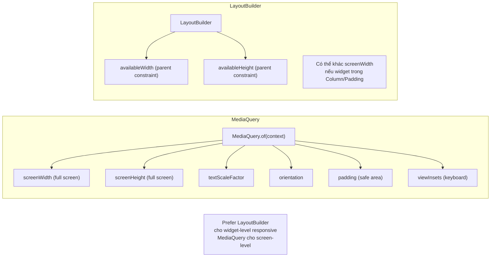

# Bài 4.6 — Responsive & Adaptive Layouts

## Phần 1 — Khái Niệm & Mục Tiêu Bài Học

### Tại sao bài này quan trọng?

Flutter target multiple platforms (mobile, tablet, web, desktop) — một codebase. Nhưng UI đẹp trên phone không có nghĩa là đẹp trên tablet:

```
Phone (390px wide):
  [List item 1]
  [List item 2]
  [List item 3]

Tablet (900px wide) — nếu không responsive:
  [List item 1                      ]  ← Trông rất lạ, nhiều whitespace
  [List item 2                      ]

Tablet — nếu responsive:
  [List item 1] | [Detail view     ]  ← Master-detail layout!
  [List item 2] |                    
  [List item 3] |                    
```

### Sự khác biệt: Responsive vs Adaptive

- **Responsive**: thay đổi layout theo *kích thước* màn hình (column count, font size)
- **Adaptive**: thay đổi *hành vi* theo *platform* (Material trên Android, Cupertino trên iOS)

### Bạn sẽ hiểu được sau bài này:
- `MediaQuery` — screen size, orientation, text scale
- `LayoutBuilder` — available space từ parent
- Responsive breakpoints: mobile / tablet / desktop
- `OrientationBuilder` — portrait vs landscape
- Flexible spacing với `Flexible` và `FractionallySizedBox`

---

## Phần 2 — Cơ Chế Hoạt Động (Under the Hood)

### MediaQuery vs LayoutBuilder



### Breakpoints Strategy

```
Mobile:  0     - 599px
Tablet:  600px - 1023px
Desktop: 1024px+

Nhưng Flutter app trên tablet thường chạy cả hai:
- Phone app trên tablet → MediaQuery.size.width = tablet width → cần responsive
- Native tablet app → phải design cho tablet
```

---

## Phần 3 — Code Mẫu Chuẩn Google

### 3.1 — Breakpoint system đơn giản

```dart
// Định nghĩa breakpoints một lần, dùng khắp app
enum Breakpoint { mobile, tablet, desktop }

extension BreakpointExt on double {
  Breakpoint get breakpoint {
    if (this >= 1024) return Breakpoint.desktop;
    if (this >= 600) return Breakpoint.tablet;
    return Breakpoint.mobile;
  }
}

// Helper extension trên BuildContext
extension ResponsiveContext on BuildContext {
  double get screenWidth => MediaQuery.of(this).size.width;
  Breakpoint get breakpoint => screenWidth.breakpoint;
  bool get isMobile => breakpoint == Breakpoint.mobile;
  bool get isTablet => breakpoint == Breakpoint.tablet;
  bool get isDesktop => breakpoint == Breakpoint.desktop;
}

// Dùng:
Widget build(BuildContext context) {
  return switch (context.breakpoint) {
    Breakpoint.mobile => MobileLayout(),
    Breakpoint.tablet => TabletLayout(),
    Breakpoint.desktop => DesktopLayout(),
  };
}
```

### 3.2 — Responsive Column Count

```dart
class ResponsiveProductGrid extends StatelessWidget {
  final List<Product> products;
  const ResponsiveProductGrid({super.key, required this.products});

  @override
  Widget build(BuildContext context) {
    return LayoutBuilder(
      builder: (context, constraints) {
        // Tính column count dựa trên available width
        // (không phải screen width!)
        final columnCount = switch (constraints.maxWidth) {
          >= 1024 => 4,   // Desktop: 4 columns
          >= 600  => 3,   // Tablet: 3 columns
          >= 400  => 2,   // Large phone: 2 columns
          _       => 1,   // Small phone: 1 column
        };

        return GridView.builder(
          gridDelegate: SliverGridDelegateWithFixedCrossAxisCount(
            crossAxisCount: columnCount,
            mainAxisSpacing: 8,
            crossAxisSpacing: 8,
            childAspectRatio: 0.75,
          ),
          itemCount: products.length,
          itemBuilder: (_, i) => ProductCard(product: products[i]),
        );
      },
    );
  }
}
```

### 3.3 — Master-Detail Layout cho tablet

```dart
class ProductMasterDetail extends StatefulWidget {
  final List<Product> products;
  const ProductMasterDetail({super.key, required this.products});
  @override State<ProductMasterDetail> createState() => _ProductMasterDetailState();
}

class _ProductMasterDetailState extends State<ProductMasterDetail> {
  Product? _selectedProduct;

  @override
  Widget build(BuildContext context) {
    return LayoutBuilder(
      builder: (context, constraints) {
        final isWide = constraints.maxWidth >= 600;

        if (isWide) {
          // Tablet: Master-Detail side by side
          return Row(
            children: [
              // Master: 40% width
              SizedBox(
                width: constraints.maxWidth * 0.4,
                child: _MasterList(
                  products: widget.products,
                  selectedId: _selectedProduct?.id,
                  onSelect: (p) => setState(() => _selectedProduct = p),
                ),
              ),
              // Divider
              const VerticalDivider(width: 1),
              // Detail: remaining 60%
              Expanded(
                child: _selectedProduct != null
                    ? ProductDetailView(product: _selectedProduct!)
                    : const Center(child: Text('Chọn sản phẩm để xem chi tiết')),
              ),
            ],
          );
        } else {
          // Mobile: List only, detail on push
          return _MasterList(
            products: widget.products,
            selectedId: null,
            onSelect: (p) {
              Navigator.push(
                context,
                MaterialPageRoute(
                  builder: (_) => Scaffold(
                    appBar: AppBar(title: Text(p.name)),
                    body: ProductDetailView(product: p),
                  ),
                ),
              );
            },
          );
        }
      },
    );
  }
}

class _MasterList extends StatelessWidget {
  final List<Product> products;
  final String? selectedId;
  final ValueChanged<Product> onSelect;

  const _MasterList({
    required this.products,
    required this.selectedId,
    required this.onSelect,
  });

  @override
  Widget build(BuildContext context) {
    return ListView.builder(
      itemCount: products.length,
      itemBuilder: (_, i) {
        final product = products[i];
        final isSelected = product.id == selectedId;
        return ListTile(
          selected: isSelected,
          selectedTileColor: Theme.of(context).colorScheme.primaryContainer,
          title: Text(product.name),
          subtitle: Text('${product.price}đ'),
          onTap: () => onSelect(product),
        );
      },
    );
  }
}
```

### 3.4 — OrientationBuilder và Text Scale

```dart
class AdaptiveScreen extends StatelessWidget {
  const AdaptiveScreen({super.key});

  @override
  Widget build(BuildContext context) {
    // MediaQuery cung cấp nhiều thông tin hữu ích
    final mediaQuery = MediaQuery.of(context);
    final textScale = mediaQuery.textScaler;
    final padding = mediaQuery.padding; // Safe area (notch, home indicator)

    return OrientationBuilder(
      builder: (context, orientation) {
        // Thay đổi layout theo portrait/landscape
        final isPortrait = orientation == Orientation.portrait;

        return Padding(
          // Tôn trọng safe area
          padding: EdgeInsets.only(
            top: padding.top,
            bottom: padding.bottom,
          ),
          child: isPortrait ? _PortraitLayout() : _LandscapeLayout(),
        );
      },
    );
  }
}

class _PortraitLayout extends StatelessWidget {
  @override
  Widget build(BuildContext context) {
    return Column(
      children: [
        // Flexible width cho portrait
        const Expanded(child: ProductList()),
        const _BottomBar(),
      ],
    );
  }
}

class _LandscapeLayout extends StatelessWidget {
  @override
  Widget build(BuildContext context) {
    return Row(
      children: [
        // Sidebar cho landscape
        const SizedBox(width: 200, child: ProductList()),
        const VerticalDivider(width: 1),
        const Expanded(child: MainContent()),
      ],
    );
  }
}
```

### 3.5 — FractionallySizedBox — Percentage-based sizing

```dart
Widget build(BuildContext context) {
  return Column(
    children: [
      // 80% chiều rộng parent
      FractionallySizedBox(
        widthFactor: 0.8, // 80%
        child: TextField(decoration: InputDecoration(labelText: 'Email')),
      ),

      const SizedBox(height: 16),

      // 100% chiều rộng, 50% chiều cao
      FractionallySizedBox(
        widthFactor: 1.0,
        heightFactor: 0.5,
        child: Image.network(bannerUrl, fit: BoxFit.cover),
      ),

      // Flexible spacing: responsive gap
      const Spacer(), // Fill remaining

      // Safe button width
      FractionallySizedBox(
        widthFactor: 0.9,
        child: FilledButton(
          onPressed: () {},
          child: const Text('Tiếp tục'),
        ),
      ),
    ],
  );
}
```

---

## Phần 4 — Lỗi Sai Phổ Biến & Best Practices

### ❌ Anti-pattern 1: Hardcode pixel size

```dart
// ❌ Sai: hardcode pixel → vỡ trên màn hình khác
Container(
  width: 390, // Chỉ đúng trên iPhone 14!
  height: 844,
)

// ✅ Đúng: Responsive
LayoutBuilder(
  builder: (context, constraints) => Container(
    width: constraints.maxWidth, // Fill available
    height: constraints.maxHeight * 0.5, // 50% available
  ),
)
```

### ❌ Anti-pattern 2: `MediaQuery.of(context).size` trong deep widget

```dart
// ❌ Không chính xác: screenWidth ≠ available width nếu trong Drawer/Dialog
Widget build(BuildContext context) {
  final screenWidth = MediaQuery.of(context).size.width; // Screen size!
  return Container(width: screenWidth * 0.5); // Sai khi widget trong Drawer
}

// ✅ Đúng: LayoutBuilder cho accurate available space
LayoutBuilder(
  builder: (context, constraints) => Container(
    width: constraints.maxWidth * 0.5, // Actual available width
  ),
)
```

### ❌ Anti-pattern 3: Không test tablet layout

```dart
// Dùng Flutter DevTools Device Toolbar:
// Chrome DevTools → Device Toolbar → chọn tablet
// Hoặc trong Android Studio: AVD Manager → Pixel Tablet

// Minimum testing:
// - Phone portrait: 390x844
// - Phone landscape: 844x390
// - Tablet portrait: 768x1024
// - Tablet landscape: 1024x768
```

---

## Phần 5 — Bài Tập Củng Cố Tư Duy

### Challenge: Layout Thay Đổi Từ 1 Cột (Mobile) → 2 Cột (Tablet)

**Yêu cầu:**
- Mobile (<600px): danh sách 1 cột dọc
- Tablet (>=600px): grid 2 cột
- Desktop (>=1024px): grid 3 cột
- Khi chọn item trên tablet: hiện detail ở bên phải (master-detail)
- Khi chọn item trên mobile: navigate sang màn hình mới

**Gợi ý:**
- `LayoutBuilder` cho column count
- `Row` + `VerticalDivider` cho master-detail
- `Navigator.push` cho mobile detail

### Thử Thách Tư Duy & Thẩm Định Chuyên Sâu (Conceptual & Deep-Dive Check)

> **[Junior]** — nắm khái niệm | **[Middle]** — hiểu cơ chế | **[Senior]** — hiểu Flutter internals | **[Trace Code]** — đọc code và dự đoán output

---

#### Q1 [Junior] — "Responsive vs Adaptive trong Flutter — khác biệt là gì?"

**Trả lời chuẩn:**

| | Responsive | Adaptive |
|---|---|---|
| **Thay đổi dựa trên** | Screen size / available space | Platform (iOS vs Android vs Web) |
| **Mục tiêu** | Layout phù hợp với kích thước | UI pattern phù hợp với platform |
| **Ví dụ** | 1 column phone → 3 column tablet | Material Switch (Android) vs Cupertino Switch (iOS) |

```dart
// Responsive — layout thay đổi theo screen width
LayoutBuilder(builder: (ctx, constraints) {
  if (constraints.maxWidth > 600) {
    return const TwoColumnLayout();
  }
  return const SingleColumnLayout();
})

// Adaptive — widget thay đổi theo platform
Platform.isIOS
    ? CupertinoSwitch(value: _val, onChanged: ...)
    : Switch(value: _val, onChanged: ...)

// Hoặc dùng adaptive constructors (Flutter 3+)
Switch.adaptive(value: _val, onChanged: ...)
```

---

#### Q2 [Junior] — "`FractionallySizedBox` dùng khi nào?"

**Trả lời chuẩn:**

`FractionallySizedBox` cho phép size widget theo **phần trăm của parent**, thay vì giá trị pixel cố định:

```dart
// Button chiếm 80% width của parent
FractionallySizedBox(
  widthFactor: 0.8,   // 80% of parent width
  child: ElevatedButton(
    onPressed: () {},
    child: const Text('Login'),
  ),
)

// Banner chiếm 30% height
FractionallySizedBox(
  heightFactor: 0.3,  // 30% of parent height
  child: Container(color: Colors.blue),
)

// Trong Row/Column — cần Flexible wrapper
Row(children: [
  Flexible(
    child: FractionallySizedBox(
      widthFactor: 0.6, // 60% of Flexible's allocation
      child: Container(color: Colors.red),
    ),
  ),
])
```

**Ưu điểm so với hardcoded pixels:** Tự động scale trên mọi screen size — phone, tablet, desktop.

---

#### Q3 [Middle] — "Khi nào dùng `MediaQuery` vs `LayoutBuilder`? Trade-off?"

**Trả lời chuẩn:**

| | `MediaQuery.of(context)` | `LayoutBuilder` |
|---|---|---|
| **Trả về** | Screen-level info (size, padding, textScale) | Available space từ parent constraint |
| **Phù hợp** | Screen-level decisions | Component-level decisions |
| **Rebuild khi** | Screen size / orientation / insets thay đổi | Constraint từ parent thay đổi |
| **Ví dụ** | Safe area insets, keyboard visibility | Column count trong grid, sidebar width |

```dart
// ✅ MediaQuery — screen-level
Widget buildBottomBar() {
  final bottomInset = MediaQuery.of(context).viewInsets.bottom; // keyboard height
  return Padding(
    padding: EdgeInsets.only(bottom: bottomInset),
    child: const BottomBar(),
  );
}

// ✅ LayoutBuilder — component-level
Widget buildCard() {
  return LayoutBuilder(
    builder: (ctx, constraints) {
      // Component này có thể nằm trong sidebar (300px) hoặc full screen (390px)
      return constraints.maxWidth > 350
          ? const WideCardLayout()
          : const NarrowCardLayout();
    },
  );
}
// Không dùng MediaQuery vì card không biết nó đang ở đâu trong layout
```

---

#### Q4 [Senior] — "`MediaQuery.of(context)` gây rebuild khi nào? Tại sao `MediaQuery.sizeOf()` (Flutter 3.10+) tốt hơn?"

**Trả lời chuẩn:**

`MediaQuery.of(context)` register dependency vào **toàn bộ `MediaQueryData` object**. Bất kỳ thay đổi nào trong `MediaQueryData` (size, orientation, textScaleFactor, viewInsets, padding, v.v.) đều trigger rebuild.

**Vấn đề:** Khi keyboard xuất hiện, `viewInsets.bottom` thay đổi → `MediaQueryData` thay đổi → **mọi widget dùng `MediaQuery.of(context)`** đều rebuild — kể cả widget chỉ dùng `size` (không liên quan đến keyboard).

**Flutter 3.10+ giải pháp — fine-grained methods:**

```dart
// ❌ Cũ — rebuild khi bất kỳ MediaQueryData field nào thay đổi
final size = MediaQuery.of(context).size;

// ✅ Mới — chỉ rebuild khi size thay đổi (orientation change)
final size = MediaQuery.sizeOf(context);

// ✅ Các phương thức fine-grained khác
final padding = MediaQuery.paddingOf(context);
final viewInsets = MediaQuery.viewInsetsOf(context);
final textScaleFactor = MediaQuery.textScalerOf(context);
```

**Cơ chế:** `MediaQuery.sizeOf(context)` gọi `context.dependOnInheritedWidgetOfExactType<MediaQuery>()` với một "aspect" filter, chỉ register dependency vào `size` field — không phải toàn bộ `MediaQueryData`.

---

#### Q5 [Middle] — "Breakpoint approach vs `LayoutBuilder` approach: trade-off?"

**Trả lời chuẩn:**

**Breakpoint approach:**
```dart
// Global breakpoints
const mobileBreakpoint = 600.0;
const tabletBreakpoint = 1200.0;

// Dùng MediaQuery (screen level)
final width = MediaQuery.sizeOf(context).width;
if (width > tabletBreakpoint) return const TabletLayout();
if (width > mobileBreakpoint) return const TabletLayout();
return const MobileLayout();
```

**LayoutBuilder approach:**
```dart
// Local available space
LayoutBuilder(builder: (ctx, constraints) {
  if (constraints.maxWidth > 600) return const WideLayout();
  return const NarrowLayout();
})
```

| Aspect | Breakpoint (MediaQuery) | LayoutBuilder |
|---|---|---|
| **Scope** | Screen-level global | Component-level local |
| **Reuse** | Component phụ thuộc screen size → khó reuse | Component phụ thuộc available space → reusable |
| **Testing** | Cần mock screen size | Chỉ cần mock constraints |
| **Sideeffects** | Rebuild khi keyboard show (nếu dùng `MediaQuery.of`) | Chỉ rebuild khi parent layout thay đổi |

**Best practice:** Dùng breakpoints cho **screen-level routing** (which screen layout to show). Dùng `LayoutBuilder` cho **component-level adaptation** (how component renders given available space).

---

#### Q6 [Middle] — "`AdaptiveScaffold` (Flutter Adaptive Library) giải quyết vấn đề gì?"

**Trả lời chuẩn:**

`AdaptiveScaffold` từ package `flutter_adaptive_scaffold` giải quyết vấn đề **boilerplate responsive navigation** — thường phải viết nhiều `if/else` để handle phone/tablet/desktop:

```dart
// Không có AdaptiveScaffold — phải tự handle mọi breakpoint
Widget build(context) {
  final width = MediaQuery.sizeOf(context).width;
  if (width > 1200) {
    return Row(children: [
      SizedBox(width: 300, child: NavigationDrawer(...)),
      Expanded(child: body),
      SizedBox(width: 300, child: SecondaryPanel()),
    ]);
  }
  if (width > 600) {
    return Row(children: [
      NavigationRail(...),
      Expanded(child: body),
    ]);
  }
  return Scaffold(bottomNavigationBar: ..., body: body);
}

// Với AdaptiveScaffold — declarative, tự handle breakpoints
AdaptiveScaffold(
  destinations: const [...],
  body: (_) => const MainContent(),
  secondaryBody: (_) => const DetailPanel(), // chỉ show trên tablet+
)
// Tự động: phone → BottomNav, tablet → NavigationRail, desktop → Drawer + rail
```

`LayoutBuilder` thuần không giải quyết được **navigation pattern** — nó chỉ cho biết available space, không có khái niệm về navigation components.

---

#### Q7 [Trace Code] — "`MediaQuery.textScaleFactor` thay đổi: widget nào bị ảnh hưởng?"

```dart
class App extends StatelessWidget {
  @override
  Widget build(BuildContext context) {
    return MaterialApp(
      home: Scaffold(
        body: Column(
          children: [
            // (A) Text với explicit style
            const Text(
              'Hello World',
              style: TextStyle(fontSize: 16),
            ),
            
            // (B) Text với fontSize không set
            const Text('Default size'),
            
            // (C) Icon
            const Icon(Icons.star, size: 24),
            
            // (D) Container với height cố định
            Container(height: 50, color: Colors.blue),
            
            // (E) Text với textScaler disabled
            Text(
              'No Scale',
              style: const TextStyle(fontSize: 16),
              textScaler: TextScaler.noScaling, // Flutter 3.12+
            ),
          ],
        ),
      ),
    );
  }
}
```

**Khi user tăng system font size (textScaleFactor: 1.0 → 1.5):**

- **(A) `Text(style: TextStyle(fontSize: 16))`** → **bị ảnh hưởng** — Flutter nhân `fontSize × textScaleFactor` = 16 × 1.5 = 24px → Text lớn hơn
- **(B) `Text('Default size')`** → **bị ảnh hưởng** — default fontSize từ Theme, cũng được scale
- **(C) `Icon(size: 24)`** → **không bị ảnh hưởng** (mặc định) — Icon size không phụ thuộc textScaleFactor
- **(D) `Container(height: 50)`** → **không bị ảnh hưởng** — hardcoded pixel
- **(E) `Text(textScaler: TextScaler.noScaling)`** → **không bị ảnh hưởng** — đã opt out

**Hậu quả thực tế:** Text dài hơn có thể overflow container cố định → layout break. Nên dùng `flexible` sizing cho containers chứa Text, hoặc test với textScaleFactor lớn trong DevTools.
