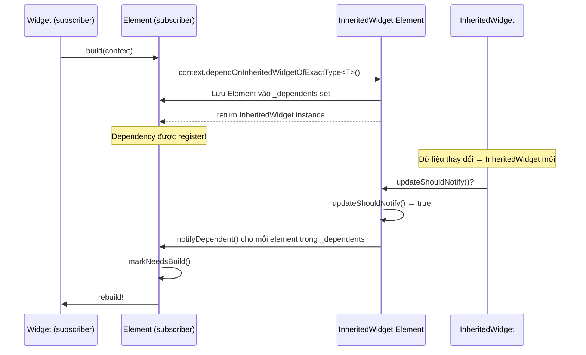

# Bài 5.2 — dependOnInheritedWidgetOfExactType

## Phần 1 — Khái Niệm & Mục Tiêu Bài Học

### Tại sao bài này quan trọng?

Mọi Flutter developer gọi `Theme.of(context)` hàng ngày, nhưng ít ai biết bên trong là:

```dart
// Flutter source: ThemeData.of(context)
static ThemeData of(BuildContext context) {
  final _InheritedTheme inheritedTheme =
      context.dependOnInheritedWidgetOfExactType<_InheritedTheme>()!;
  return inheritedTheme.theme;
}
```

Khi bạn gọi `Theme.of(context)`:
1. Flutter tìm ancestor `_InheritedTheme` trong element tree
2. **Đăng ký dependency**: widget này sẽ rebuild khi theme thay đổi
3. Trả về theme data

Câu hỏi: *"Nếu gọi trong `initState()` thay vì `build()` thì sao?"*

### Bạn sẽ hiểu được sau bài này:
- `dependOnInheritedWidgetOfExactType` vs `getInheritedWidgetOfExactType`
- Dependency registration — tại sao quan trọng
- Tại sao phải gọi trong `build()` hoặc `didChangeDependencies()`, không phải `initState()`
- Trace rebuild flow khi InheritedWidget thay đổi

---

## Phần 2 — Cơ Chế Hoạt Động (Under the Hood)

### Dependency Registration Flow



### `dependOn` vs `getInherited` — Khác biệt quan trọng

```
dependOnInheritedWidgetOfExactType<T>():
  ✓ Đăng ký dependency
  ✓ Widget sẽ rebuild khi T thay đổi
  ✓ Dùng trong build() hoặc didChangeDependencies()

getInheritedWidgetOfExactType<T>():
  ✗ KHÔNG đăng ký dependency
  ✓ Widget KHÔNG rebuild tự động khi T thay đổi
  ✓ Dùng khi chỉ muốn read một lần (e.g., trong initState)
```

---

## Phần 3 — Code Mẫu Chuẩn Google

### 3.1 — `dependOn` vs `getInherited`

```dart
class LocaleAwareWidget extends StatefulWidget {
  const LocaleAwareWidget({super.key});
  @override State<LocaleAwareWidget> createState() => _LocaleAwareWidgetState();
}

class _LocaleAwareWidgetState extends State<LocaleAwareWidget> {
  late String _formattedDate;

  @override
  void initState() {
    super.initState();
    // ✅ getInheritedWidgetOfExactType: read-only, không đăng ký dependency
    // Phù hợp ở initState khi chỉ cần giá trị ban đầu
    // Nhưng nếu locale thay đổi sau này → widget KHÔNG rebuild
    final locale = context.getInheritedWidgetOfExactType<Localizations>()
        ?.locale ?? const Locale('vi');
    _formattedDate = _formatDate(DateTime.now(), locale);
  }

  @override
  void didChangeDependencies() {
    super.didChangeDependencies();
    // ✅ dependOn: đăng ký dependency, được gọi khi locale thay đổi
    // → Widget auto-rebuild khi Localizations thay đổi
    final locale = Localizations.localeOf(context); // Internally dùng dependOn
    _formattedDate = _formatDate(DateTime.now(), locale);
  }

  String _formatDate(DateTime date, Locale locale) {
    // Format date theo locale
    return '${date.day}/${date.month}/${date.year}';
  }

  @override
  Widget build(BuildContext context) {
    return Text(_formattedDate);
  }
}
```

### 3.2 — Custom InheritedWidget với cả hai accessors

```dart
class CartData extends InheritedWidget {
  final Cart cart;
  final VoidCallback onClear;

  const CartData({
    super.key,
    required this.cart,
    required this.onClear,
    required super.child,
  });

  // Đăng ký dependency → widget rebuild khi cart thay đổi
  static CartData of(BuildContext context) {
    final result = context.dependOnInheritedWidgetOfExactType<CartData>();
    assert(result != null, 'CartData không tìm thấy. Bạn có quên bọc CartProvider không?');
    return result!;
  }

  // Không đăng ký dependency → chỉ read tại thời điểm gọi
  // Dùng trong callback/onPressed không cần widget rebuild
  static CartData? readOnce(BuildContext context) {
    return context.getInheritedWidgetOfExactType<CartData>();
  }

  @override
  bool updateShouldNotify(CartData oldWidget) {
    return cart != oldWidget.cart;
  }
}

// Widget REACTIVE: rebuild khi cart thay đổi
class CartBadge extends StatelessWidget {
  const CartBadge({super.key});

  @override
  Widget build(BuildContext context) {
    // dependOn → rebuild khi CartData thay đổi
    final cart = CartData.of(context).cart;
    return Badge(
      label: Text('${cart.itemCount}'),
      child: const Icon(Icons.shopping_cart),
    );
  }
}

// Widget NON-REACTIVE: chỉ đọc khi button được nhấn
class ClearCartButton extends StatelessWidget {
  const ClearCartButton({super.key});

  @override
  Widget build(BuildContext context) {
    return TextButton(
      onPressed: () {
        // readOnce trong callback: không cần rebuild tracking
        CartData.readOnce(context)?.onClear();
      },
      child: const Text('Xóa giỏ hàng'),
    );
  }
}
```

### 3.3 — Trace rebuild flow thực tế

```dart
// Demo: Quan sát rebuild khi InheritedWidget thay đổi

class CounterProvider extends StatefulWidget {
  final Widget child;
  const CounterProvider({super.key, required this.child});
  @override State<CounterProvider> createState() => CounterProviderState();

  static int of(BuildContext context) =>
      context.dependOnInheritedWidgetOfExactType<_CounterData>()!.count;

  static CounterProviderState? stateOf(BuildContext context) =>
      context.findAncestorStateOfType<CounterProviderState>();
}

class CounterProviderState extends State<CounterProvider> {
  int _count = 0;

  void increment() => setState(() => _count++);

  @override
  Widget build(BuildContext context) {
    return _CounterData(count: _count, child: widget.child);
  }
}

class _CounterData extends InheritedWidget {
  final int count;
  const _CounterData({required this.count, required super.child});

  @override
  bool updateShouldNotify(_CounterData old) {
    final changed = count != old.count;
    if (changed) debugPrint('CounterData changed: ${old.count} → $count');
    return changed;
  }
}

// Widget A: SUBSCRIBE → rebuild khi count thay đổi
class CounterDisplay extends StatelessWidget {
  const CounterDisplay({super.key});
  @override
  Widget build(BuildContext context) {
    final count = CounterProvider.of(context); // dependOn
    debugPrint('CounterDisplay rebuild: count=$count');
    return Text('Count: $count', style: const TextStyle(fontSize: 32));
  }
}

// Widget B: KHÔNG subscribe → không rebuild
class NonReactiveWidget extends StatelessWidget {
  const NonReactiveWidget({super.key});
  @override
  Widget build(BuildContext context) {
    debugPrint('NonReactiveWidget rebuild (chỉ khi parent rebuild)');
    return const Text('Tôi không subscribe counter');
  }
}

// Widget C: Chỉ đọc count một lần trong callback
class IncrementButton extends StatelessWidget {
  const IncrementButton({super.key});
  @override
  Widget build(BuildContext context) {
    return ElevatedButton(
      onPressed: () {
        CounterProvider.stateOf(context)?.increment();
      },
      child: const Text('Tăng'),
    );
  }
}
```

---

## Phần 4 — Lỗi Sai Phổ Biến & Best Practices

### ❌ Anti-pattern 1: `dependOn` trong `initState()`

```dart
// ❌ Sai: initState chạy trước khi element hoàn toàn được add vào tree
// → có thể không tìm thấy InheritedWidget
// → dependency không được register đúng cách
@override
void initState() {
  super.initState();
  final theme = Theme.of(context); // Có thể crash hoặc register sai
}

// ✅ Đúng: Dùng didChangeDependencies cho InheritedWidget access
@override
void didChangeDependencies() {
  super.didChangeDependencies();
  final theme = Theme.of(context); // Safe!
}

// ✅ Hoặc trong build() trực tiếp:
@override
Widget build(BuildContext context) {
  final theme = Theme.of(context); // Always safe
  return Text('data', style: theme.textTheme.bodyMedium);
}
```

### ❌ Anti-pattern 2: Lưu result của `of()` vào field

```dart
// ❌ Sai: Lưu InheritedWidget data vào field → có thể stale
class _BadState extends State<MyWidget> {
  late ThemeData _theme; // Cached → stale khi theme thay đổi!

  @override
  void initState() {
    super.initState();
    _theme = Theme.of(context); // Lưu tại initState
  }

  @override
  Widget build(BuildContext context) {
    return Text('data', style: _theme.textTheme.bodyMedium); // Stale!
  }
}

// ✅ Đúng: Luôn gọi of(context) trong build()
@override
Widget build(BuildContext context) {
  final theme = Theme.of(context); // Fresh mỗi build
  return Text('data', style: theme.textTheme.bodyMedium);
}
```

---

## Phần 5 — Bài Tập Củng Cố Tư Duy

### Challenge: Trace rebuild flow khi InheritedWidget thay đổi

**Sử dụng CounterProvider demo ở trên:**
1. Chạy app với `debugPrint` active
2. Nhấn button increment
3. Quan sát output: widget nào rebuild và widget nào không
4. Thêm widget mới vào tree nhưng KHÔNG gọi `CounterProvider.of(context)` → widget đó có rebuild không?

### Thử Thách Tư Duy & Thẩm Định Chuyên Sâu (Conceptual & Deep-Dive Check)

> **[Junior]** — nắm khái niệm | **[Middle]** — hiểu cơ chế | **[Senior]** — hiểu Flutter internals | **[Trace Code]** — đọc code và dự đoán output

---

#### Q1 [Junior] — "Sự khác biệt giữa `dependOn` và `getInherited`?"

**Trả lời chuẩn:**

| | `dependOnInheritedWidgetOfExactType<T>()` | `getInheritedWidgetOfExactType<T>()` |
|---|---|---|
| **Đăng ký dependency** | Có — element được thêm vào `_dependents` | Không |
| **Auto-rebuild** | Có — khi InheritedWidget thay đổi | Không |
| **Use case** | Reactive UI (cần update khi data thay đổi) | Đọc 1 lần trong initState, callbacks |
| **Performance** | Tốn thêm overhead để track dependency | Nhẹ hơn |

```dart
// Widget cần reactive — dùng dependOn (thông qua context.watch hoặc .of())
@override Widget build(context) {
  final theme = Theme.of(context); // internally: dependOnInheritedWidgetOfExactType
  return Text('hello', style: TextStyle(color: theme.primaryColor));
  // Widget này rebuild khi theme thay đổi
}

// Callback không cần reactive — dùng read (context.read hoặc getInherited)
ElevatedButton(
  onPressed: () {
    // Đọc 1 lần trong handler — không cần watch
    final router = GoRouter.of(context); // hoặc context.read<Router>()
    router.go('/home');
  },
  child: const Text('Go'),
)
```

---

#### Q2 [Junior] — "Tại sao không gọi `dependOnInheritedWidgetOfExactType` trong `initState()`?"

**Trả lời chuẩn:**

`initState()` được gọi trong `Element.mount()` — tại thời điểm này, Element **chưa được kết nối hoàn toàn** vào tree. Cụ thể, `_inheritedElements` map (cache để tìm InheritedWidget) chưa được populate.

```dart
// ❌ Sai — có thể return null hoặc throw
@override void initState() {
  super.initState();
  final theme = Theme.of(context);   // dependOnInheritedWidgetOfExactType
  // Lỗi: 'dependOnInheritedWidgetOfExactType was called before build()'
}

// ✅ Đúng — dùng didChangeDependencies
@override void didChangeDependencies() {
  super.didChangeDependencies();
  final theme = Theme.of(context);   // an toàn ở đây
  _primaryColor = theme.primaryColor;
}

// ✅ Cũng OK nếu chỉ cần đọc 1 lần mà không watch (dùng read thay vì watch)
// Nhưng vẫn dùng didChangeDependencies để an toàn
```

**Ngoại lệ:** `MediaQuery.of(context)` trong `initState()` sẽ không crash ngay nhưng dependency không được registered → widget sẽ không rebuild khi MediaQuery thay đổi — behavior không như mong đợi.

---

#### Q3 [Middle] — "`didChangeDependencies()` được gọi khi nào chính xác?"

**Trả lời chuẩn:**

`didChangeDependencies()` được gọi trong **2 trường hợp**:

**1. Lần đầu sau `initState()`:**
Sequence: `mount()` → `initState()` → `firstBuild()` → trong build scope, sau `_updateInheritance()` → `didChangeDependencies()`

**2. Khi InheritedWidget thay đổi:**
Sequence: InheritedWidget notify → `element.didChangeDependencies()` → `State.didChangeDependencies()` → element được mark dirty → `build()` được gọi

```dart
@override
void didChangeDependencies() {
  super.didChangeDependencies();
  // Pattern tốt: guard để tránh execute nếu data không thực sự thay đổi
  final newLocale = Localizations.localeOf(context);
  if (newLocale == _currentLocale) return; // no-op nếu không đổi
  _currentLocale = newLocale;
  _loadLocalizedData(newLocale); // chỉ reload khi locale thực sự thay đổi
}
```

**Lưu ý:** `didChangeDependencies()` có thể được gọi **nhiều lần** (mỗi khi bất kỳ InheritedWidget nào widget phụ thuộc thay đổi). Luôn guard với condition check.

---

#### Q4 [Senior] — "`dependOnInheritedWidgetOfExactType` lưu dependency ở đâu? `Element._dependencies` list?"

**Trả lời chuẩn:**

Dependency được lưu ở **hai phía**:

**Phía Consumer Element:**
```dart
// Element._dependencies: Set<InheritedElement>
// Lưu tất cả InheritedElements mà element này phụ thuộc
Set<InheritedElement>? _dependencies;
```

**Phía InheritedElement:**
```dart
// InheritedElement._dependents: Map<Element, Object?>
// Key: dependent element, Value: aspect (phần data cụ thể, nếu có)
Map<Element, Object?> _dependents = HashMap<Element, Object?>();
```

**Quá trình:**
```dart
// Element.dependOnInheritedWidgetOfExactType<T>()
InheritedElement? ancestor = _inheritedElements[T]; // O(1) lookup
if (ancestor != null) {
  // Đăng ký 2 chiều:
  _dependencies ??= HashSet<InheritedElement>();
  _dependencies!.add(ancestor);   // element biết nó phụ thuộc InheritedElement nào
  ancestor.updateDependencies(this, null); // InheritedElement biết ai phụ thuộc nó
}
```

**Cleanup:** Khi element unmount → `_dependencies` được clear → InheritedElement's `_dependents` được update → không còn notify element đã unmount.

---

#### Q5 [Middle] — "Tại sao `getElementForInheritedWidgetOfExactType` (không register) ít dùng hơn?"

**Trả lời chuẩn:**

`getElementForInheritedWidgetOfExactType()` (deprecated, giờ là `getInheritedWidgetOfExactType()`) chỉ lookup InheritedElement mà không đăng ký dependency — có 2 lý do hiếm dùng:

**1. Không reactive:** Widget không tự rebuild khi data thay đổi. Phải tự implement update mechanism → boilerplate.

**2. Use case hẹp:** Chỉ hữu ích trong:
- `initState()` / `dispose()` — không thể dùng `dependOn` ở đây
- Event handlers / callbacks — đọc data 1 lần, không cần reactive
- Nếu widget sẽ sớm bị rebuild vì lý do khác (e.g., parent rebuild)

```dart
// Rare valid use case: đọc navigator trong dispose
@override
void dispose() {
  // context.dependOn ở đây không hợp lý — widget đang unmount
  // Dùng read thay thế:
  final analytics = context.getInheritedWidgetOfExactType<AnalyticsScope>()!;
  analytics.logEvent('screen_closed');
  super.dispose();
}
```

---

#### Q6 [Middle] — "`of(context)` pattern: tại sao convention này quan trọng cho testability?"

**Trả lời chuẩn:**

`of(context)` là convention Flutter cho static factory method trên `InheritedWidget`:

```dart
class AppTheme extends InheritedWidget {
  final ThemeData data;
  
  // Convention: static of() method
  static ThemeData of(BuildContext context) =>
      context.dependOnInheritedWidgetOfExactType<AppTheme>()!.data;
  
  // Hoặc với null safety:
  static ThemeData? maybeOf(BuildContext context) =>
      context.dependOnInheritedWidgetOfExactType<AppTheme>()?.data;
}
```

**Lợi ích:**
- **Testability:** Trong test, wrap widget under test với `AppTheme(data: mockTheme, ...)` → component nhận mock data mà không cần change implementation
- **Encapsulation:** Consumer không biết implementation details — chỉ biết `AppTheme.of(context)` trả về `ThemeData`
- **Swappable:** Có thể swap implementation (e.g., `InheritedWidget` → `InheritedNotifier` → Provider) mà không break consumers

```dart
// Test
testWidgets('renders with custom theme', (tester) async {
  await tester.pumpWidget(
    AppTheme(
      data: ThemeData(primaryColor: Colors.red), // mock theme
      child: const WidgetUnderTest(),
    ),
  );
  // WidgetUnderTest nhận ThemeData.red mà không thay đổi code
});
```

---

#### Q7 [Trace Code] — "`didChangeDependencies` bị gọi bao nhiêu lần?"

```dart
class MultiDepWidget extends StatefulWidget {
  const MultiDepWidget({super.key});
  @override State<MultiDepWidget> createState() => _MultiDepWidgetState();
}

class _MultiDepWidgetState extends State<MultiDepWidget> {
  int _depCallCount = 0;

  @override
  void didChangeDependencies() {
    super.didChangeDependencies();
    _depCallCount++;
    print('didChangeDependencies #$_depCallCount');
  }

  @override
  Widget build(BuildContext context) {
    // Widget phụ thuộc VÀO CẢ HAI InheritedWidgets
    final theme = Theme.of(context);           // dep 1
    final mediaQuery = MediaQuery.of(context); // dep 2
    return Text('${theme.primaryColor} ${mediaQuery.size}');
  }
}

// Scenario: Trong 3 giây sau khi widget mount, xảy ra:
// - Giây 1: Theme thay đổi (dark/light mode toggle)
// - Giây 2: Keyboard xuất hiện (MediaQuery.viewInsets thay đổi)
// - Giây 3: Không có gì thay đổi
```

**Output:**
```
didChangeDependencies #1   // lần đầu sau initState — LUÔN gọi
didChangeDependencies #2   // giây 1: Theme thay đổi → updateShouldNotify = true
didChangeDependencies #3   // giây 2: MediaQuery thay đổi → updateShouldNotify = true
                            // giây 3: không có gì → không gọi thêm
```

**Điểm quan trọng:**
- Lần đầu là **guaranteed** — không phụ thuộc vào InheritedWidget nào thay đổi
- Mỗi dependency thay đổi → 1 lần gọi riêng biệt (không batch)
- Nếu cả Theme và MediaQuery thay đổi trong cùng frame → có thể gọi 2 lần hoặc 1 lần (Flutter có thể batch)
- Guard với `if (condition)` trong `didChangeDependencies` để tránh repeated expensive operations
