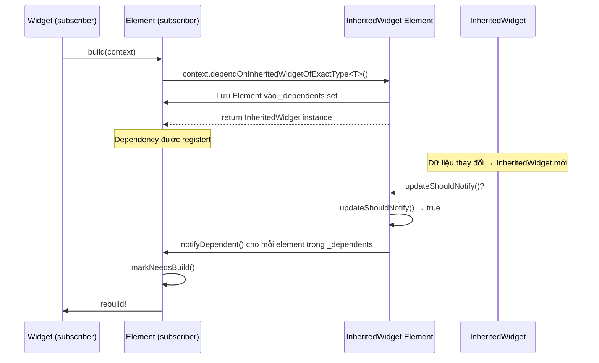

# Bài 5.2 — dependOnInheritedWidgetOfExactType

## Phần 1 — Khái Niệm & Mục Tiêu Bài Học

### Tại sao bài này quan trọng?

Mọi Flutter developer gọi `Theme.of(context)` hàng ngày, nhưng ít ai biết bên trong là:

```dart
// Flutter source: ThemeData.of(context)
static ThemeData of(BuildContext context) {
  final _InheritedTheme inheritedTheme =
      context.dependOnInheritedWidgetOfExactType<_InheritedTheme>()!;
  return inheritedTheme.theme;
}
```

Khi bạn gọi `Theme.of(context)`:
1. Flutter tìm ancestor `_InheritedTheme` trong element tree
2. **Đăng ký dependency**: widget này sẽ rebuild khi theme thay đổi
3. Trả về theme data

Câu hỏi: *"Nếu gọi trong `initState()` thay vì `build()` thì sao?"*

### Bạn sẽ hiểu được sau bài này:
- `dependOnInheritedWidgetOfExactType` vs `getInheritedWidgetOfExactType`
- Dependency registration — tại sao quan trọng
- Tại sao phải gọi trong `build()` hoặc `didChangeDependencies()`, không phải `initState()`
- Trace rebuild flow khi InheritedWidget thay đổi

---

## Phần 2 — Cơ Chế Hoạt Động (Under the Hood)

### Dependency Registration Flow



### `dependOn` vs `getInherited` — Khác biệt quan trọng

```
dependOnInheritedWidgetOfExactType<T>():
  ✓ Đăng ký dependency
  ✓ Widget sẽ rebuild khi T thay đổi
  ✓ Dùng trong build() hoặc didChangeDependencies()

getInheritedWidgetOfExactType<T>():
  ✗ KHÔNG đăng ký dependency
  ✓ Widget KHÔNG rebuild tự động khi T thay đổi
  ✓ Dùng khi chỉ muốn read một lần (e.g., trong initState)
```

---

## Phần 3 — Code Mẫu Chuẩn Google

### 3.1 — `dependOn` vs `getInherited`

```dart
class LocaleAwareWidget extends StatefulWidget {
  const LocaleAwareWidget({super.key});
  @override State<LocaleAwareWidget> createState() => _LocaleAwareWidgetState();
}

class _LocaleAwareWidgetState extends State<LocaleAwareWidget> {
  late String _formattedDate;

  @override
  void initState() {
    super.initState();
    // ✅ getInheritedWidgetOfExactType: read-only, không đăng ký dependency
    // Phù hợp ở initState khi chỉ cần giá trị ban đầu
    // Nhưng nếu locale thay đổi sau này → widget KHÔNG rebuild
    final locale = context.getInheritedWidgetOfExactType<Localizations>()
        ?.locale ?? const Locale('vi');
    _formattedDate = _formatDate(DateTime.now(), locale);
  }

  @override
  void didChangeDependencies() {
    super.didChangeDependencies();
    // ✅ dependOn: đăng ký dependency, được gọi khi locale thay đổi
    // → Widget auto-rebuild khi Localizations thay đổi
    final locale = Localizations.localeOf(context); // Internally dùng dependOn
    _formattedDate = _formatDate(DateTime.now(), locale);
  }

  String _formatDate(DateTime date, Locale locale) {
    // Format date theo locale
    return '${date.day}/${date.month}/${date.year}';
  }

  @override
  Widget build(BuildContext context) {
    return Text(_formattedDate);
  }
}
```

### 3.2 — Custom InheritedWidget với cả hai accessors

```dart
class CartData extends InheritedWidget {
  final Cart cart;
  final VoidCallback onClear;

  const CartData({
    super.key,
    required this.cart,
    required this.onClear,
    required super.child,
  });

  // Đăng ký dependency → widget rebuild khi cart thay đổi
  static CartData of(BuildContext context) {
    final result = context.dependOnInheritedWidgetOfExactType<CartData>();
    assert(result != null, 'CartData không tìm thấy. Bạn có quên bọc CartProvider không?');
    return result!;
  }

  // Không đăng ký dependency → chỉ read tại thời điểm gọi
  // Dùng trong callback/onPressed không cần widget rebuild
  static CartData? readOnce(BuildContext context) {
    return context.getInheritedWidgetOfExactType<CartData>();
  }

  @override
  bool updateShouldNotify(CartData oldWidget) {
    return cart != oldWidget.cart;
  }
}

// Widget REACTIVE: rebuild khi cart thay đổi
class CartBadge extends StatelessWidget {
  const CartBadge({super.key});

  @override
  Widget build(BuildContext context) {
    // dependOn → rebuild khi CartData thay đổi
    final cart = CartData.of(context).cart;
    return Badge(
      label: Text('${cart.itemCount}'),
      child: const Icon(Icons.shopping_cart),
    );
  }
}

// Widget NON-REACTIVE: chỉ đọc khi button được nhấn
class ClearCartButton extends StatelessWidget {
  const ClearCartButton({super.key});

  @override
  Widget build(BuildContext context) {
    return TextButton(
      onPressed: () {
        // readOnce trong callback: không cần rebuild tracking
        CartData.readOnce(context)?.onClear();
      },
      child: const Text('Xóa giỏ hàng'),
    );
  }
}
```

### 3.3 — Trace rebuild flow thực tế

```dart
// Demo: Quan sát rebuild khi InheritedWidget thay đổi

class CounterProvider extends StatefulWidget {
  final Widget child;
  const CounterProvider({super.key, required this.child});
  @override State<CounterProvider> createState() => CounterProviderState();

  static int of(BuildContext context) =>
      context.dependOnInheritedWidgetOfExactType<_CounterData>()!.count;

  static CounterProviderState? stateOf(BuildContext context) =>
      context.findAncestorStateOfType<CounterProviderState>();
}

class CounterProviderState extends State<CounterProvider> {
  int _count = 0;

  void increment() => setState(() => _count++);

  @override
  Widget build(BuildContext context) {
    return _CounterData(count: _count, child: widget.child);
  }
}

class _CounterData extends InheritedWidget {
  final int count;
  const _CounterData({required this.count, required super.child});

  @override
  bool updateShouldNotify(_CounterData old) {
    final changed = count != old.count;
    if (changed) debugPrint('CounterData changed: ${old.count} → $count');
    return changed;
  }
}

// Widget A: SUBSCRIBE → rebuild khi count thay đổi
class CounterDisplay extends StatelessWidget {
  const CounterDisplay({super.key});
  @override
  Widget build(BuildContext context) {
    final count = CounterProvider.of(context); // dependOn
    debugPrint('CounterDisplay rebuild: count=$count');
    return Text('Count: $count', style: const TextStyle(fontSize: 32));
  }
}

// Widget B: KHÔNG subscribe → không rebuild
class NonReactiveWidget extends StatelessWidget {
  const NonReactiveWidget({super.key});
  @override
  Widget build(BuildContext context) {
    debugPrint('NonReactiveWidget rebuild (chỉ khi parent rebuild)');
    return const Text('Tôi không subscribe counter');
  }
}

// Widget C: Chỉ đọc count một lần trong callback
class IncrementButton extends StatelessWidget {
  const IncrementButton({super.key});
  @override
  Widget build(BuildContext context) {
    return ElevatedButton(
      onPressed: () {
        CounterProvider.stateOf(context)?.increment();
      },
      child: const Text('Tăng'),
    );
  }
}
```

---

## Phần 4 — Lỗi Sai Phổ Biến & Best Practices

### ❌ Anti-pattern 1: `dependOn` trong `initState()`

```dart
// ❌ Sai: initState chạy trước khi element hoàn toàn được add vào tree
// → có thể không tìm thấy InheritedWidget
// → dependency không được register đúng cách
@override
void initState() {
  super.initState();
  final theme = Theme.of(context); // Có thể crash hoặc register sai
}

// ✅ Đúng: Dùng didChangeDependencies cho InheritedWidget access
@override
void didChangeDependencies() {
  super.didChangeDependencies();
  final theme = Theme.of(context); // Safe!
}

// ✅ Hoặc trong build() trực tiếp:
@override
Widget build(BuildContext context) {
  final theme = Theme.of(context); // Always safe
  return Text('data', style: theme.textTheme.bodyMedium);
}
```

### ❌ Anti-pattern 2: Lưu result của `of()` vào field

```dart
// ❌ Sai: Lưu InheritedWidget data vào field → có thể stale
class _BadState extends State<MyWidget> {
  late ThemeData _theme; // Cached → stale khi theme thay đổi!

  @override
  void initState() {
    super.initState();
    _theme = Theme.of(context); // Lưu tại initState
  }

  @override
  Widget build(BuildContext context) {
    return Text('data', style: _theme.textTheme.bodyMedium); // Stale!
  }
}

// ✅ Đúng: Luôn gọi of(context) trong build()
@override
Widget build(BuildContext context) {
  final theme = Theme.of(context); // Fresh mỗi build
  return Text('data', style: theme.textTheme.bodyMedium);
}
```

---

## Phần 5 — Bài Tập Củng Cố Tư Duy

### Challenge: Trace rebuild flow khi InheritedWidget thay đổi

**Sử dụng CounterProvider demo ở trên:**
1. Chạy app với `debugPrint` active
2. Nhấn button increment
3. Quan sát output: widget nào rebuild và widget nào không
4. Thêm widget mới vào tree nhưng KHÔNG gọi `CounterProvider.of(context)` → widget đó có rebuild không?

### Câu hỏi phỏng vấn liên quan:

1. **"Sự khác biệt giữa `dependOn` và `getInherited`?"**
   - `dependOn`: đăng ký dependency → auto-rebuild khi InheritedWidget thay đổi
   - `getInherited`: chỉ read → không auto-rebuild

2. **"Tại sao không gọi `dependOn` trong `initState()`?"**
   - `initState` chạy trước widget hoàn toàn được attach vào tree
   - Dependency registration chưa được setup đầy đủ
   - Dùng `didChangeDependencies()` thay thế

3. **"`didChangeDependencies()` được gọi khi nào?"**
   - Lần đầu sau `initState()`
   - Mỗi khi InheritedWidget mà widget phụ thuộc thay đổi giá trị
