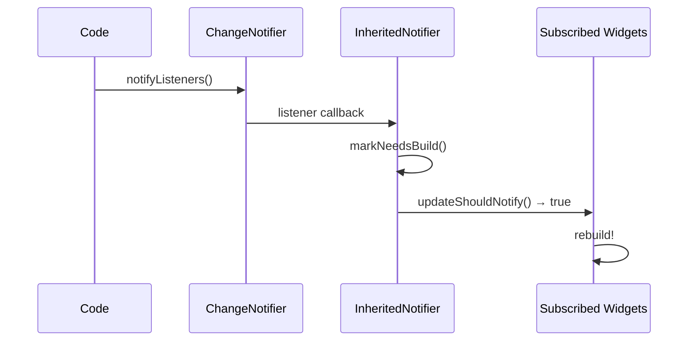

# Bài 5.3 — InheritedNotifier & ChangeNotifier

## Phần 1 — Khái Niệm & Mục Tiêu Bài Học

### Tại sao bài này quan trọng?

`InheritedWidget` có một hạn chế: để cập nhật data, bạn cần `StatefulWidget` cha để gọi `setState()`, tạo `InheritedWidget` mới, rồi `updateShouldNotify()` trigger rebuild. Rất verbose.

`InheritedNotifier` kết hợp `InheritedWidget` + `ChangeNotifier` vào một class:

```dart
// Trước: 3 class (StatefulWidget + State + InheritedWidget)
// Sau: 1 InheritedNotifier<T extends Listenable>
```

Và `ValueNotifier<T>` là `ChangeNotifier` đơn giản nhất — rất thường dùng trong Flutter.

### Bạn sẽ hiểu được sau bài này:
- `ChangeNotifier`: pattern notify listeners khi state thay đổi
- `ValueNotifier<T>`: single-value observable
- `InheritedNotifier<T>`: InheritedWidget tự động listen Listenable
- `ListenableBuilder` (Flutter 3.7+): rebuild chỉ khi listener notify

---

## Phần 2 — Cơ Chế Hoạt Động (Under the Hood)

### ChangeNotifier → InheritedNotifier chain



### ValueNotifier — Simplest Listenable

```dart
// ValueNotifier<T> extends ChangeNotifier
// Gọi notifyListeners() tự động khi value thay đổi

final counter = ValueNotifier<int>(0);
counter.value = 1; // Automatically gọi notifyListeners()

// ChangeNotifier: manual
class CartModel extends ChangeNotifier {
  int _count = 0;
  int get count => _count;

  void add() {
    _count++;
    notifyListeners(); // Manual gọi
  }
}
```

---

## Phần 3 — Code Mẫu Chuẩn Google

### 3.1 — ValueNotifier + ListenableBuilder

```dart
// ValueNotifier: đơn giản nhất cho single-value state
class CounterScreen extends StatefulWidget {
  const CounterScreen({super.key});
  @override State<CounterScreen> createState() => _CounterScreenState();
}

class _CounterScreenState extends State<CounterScreen> {
  // ValueNotifier thay vì int _count + setState
  late final ValueNotifier<int> _counterNotifier;

  @override
  void initState() {
    super.initState();
    _counterNotifier = ValueNotifier<int>(0);
  }

  @override
  void dispose() {
    _counterNotifier.dispose(); // Bắt buộc dispose!
    super.dispose();
  }

  @override
  Widget build(BuildContext context) {
    return Scaffold(
      body: Column(
        mainAxisAlignment: MainAxisAlignment.center,
        children: [
          // Static header — không rebuild khi counter thay đổi
          const Text('Counter Demo', style: TextStyle(fontSize: 24)),
          const SizedBox(height: 16),

          // ListenableBuilder: chỉ rebuild phần này khi notifier change
          ListenableBuilder(
            listenable: _counterNotifier,
            builder: (context, _) {
              return Text(
                '${_counterNotifier.value}',
                style: const TextStyle(fontSize: 64, fontWeight: FontWeight.bold),
              );
            },
          ),

          // Nút tăng/giảm
          Row(
            mainAxisAlignment: MainAxisAlignment.center,
            children: [
              ElevatedButton(
                onPressed: () => _counterNotifier.value--,
                child: const Icon(Icons.remove),
              ),
              const SizedBox(width: 16),
              ElevatedButton(
                onPressed: () => _counterNotifier.value++,
                child: const Icon(Icons.add),
              ),
            ],
          ),
        ],
      ),
    );
  }
}
```

### 3.2 — ChangeNotifier — Complex state model

```dart
class ShoppingCart extends ChangeNotifier {
  final List<CartItem> _items = [];

  List<CartItem> get items => List.unmodifiable(_items);
  int get itemCount => _items.fold(0, (sum, i) => sum + i.quantity);
  double get total => _items.fold(0, (sum, i) => sum + i.subtotal);

  void addProduct(Product product, {int quantity = 1}) {
    final existingIndex = _items.indexWhere((i) => i.productId == product.id);
    if (existingIndex >= 0) {
      final existing = _items[existingIndex];
      _items[existingIndex] = existing.copyWith(
        quantity: existing.quantity + quantity,
      );
    } else {
      _items.add(CartItem(
        productId: product.id,
        productName: product.name,
        price: product.price,
        quantity: quantity,
      ));
    }
    notifyListeners(); // Notify tất cả listeners
  }

  void removeItem(String productId) {
    _items.removeWhere((i) => i.productId == productId);
    notifyListeners();
  }

  void clear() {
    _items.clear();
    notifyListeners();
  }
}
```

### 3.3 — InheritedNotifier — Kết hợp tốt nhất

```dart
// InheritedNotifier<T extends Listenable>:
// Tự động listen T và rebuild subscribers khi T notify

class CartProvider extends InheritedNotifier<ShoppingCart> {
  const CartProvider({
    super.key,
    required ShoppingCart cart,
    required super.child,
  }) : super(notifier: cart);

  static ShoppingCart of(BuildContext context) {
    return context
        .dependOnInheritedWidgetOfExactType<CartProvider>()!
        .notifier!;
  }

  // InheritedNotifier tự handle updateShouldNotify dựa trên notifier
  // Không cần override!
}

// Sử dụng trong app:
class MyApp extends StatelessWidget {
  final ShoppingCart _cart = ShoppingCart();

  @override
  Widget build(BuildContext context) {
    return CartProvider(
      cart: _cart,
      child: MaterialApp(
        home: ShopScreen(),
      ),
    );
  }
}

// Widget subscribe cart:
class CartSummary extends StatelessWidget {
  const CartSummary({super.key});

  @override
  Widget build(BuildContext context) {
    // dependOn → rebuild khi cart notifyListeners()
    final cart = CartProvider.of(context);
    return Column(
      children: [
        Text('${cart.itemCount} sản phẩm'),
        Text('Tổng: ${cart.total.toStringAsFixed(0)}đ'),
      ],
    );
  }
}

// Widget add to cart:
class AddToCartButton extends StatelessWidget {
  final Product product;
  const AddToCartButton({super.key, required this.product});

  @override
  Widget build(BuildContext context) {
    return ElevatedButton(
      onPressed: () {
        // Không cần context.dependOn — không cần rebuild
        CartProvider.of(context).addProduct(product);
      },
      child: const Text('Thêm vào giỏ'),
    );
  }
}
```

### 3.4 — Shopping Cart Counter với InheritedNotifier

```dart
// Scenario thực tế: Shopping cart badge trên AppBar
class ShopApp extends StatelessWidget {
  final ShoppingCart _cart = ShoppingCart();

  ShopApp({super.key});

  @override
  Widget build(BuildContext context) {
    return CartProvider(
      cart: _cart,
      child: MaterialApp(
        home: Scaffold(
          appBar: AppBar(
            title: const Text('Shop'),
            actions: const [CartBadge()],
          ),
          body: const ProductCatalog(),
        ),
      ),
    );
  }
}

class CartBadge extends StatelessWidget {
  const CartBadge({super.key});

  @override
  Widget build(BuildContext context) {
    // Chỉ widget này rebuild khi cart thay đổi — không phải toàn bộ AppBar
    final cart = CartProvider.of(context);
    final count = cart.itemCount;
    return Badge.count(
      count: count,
      isLabelVisible: count > 0,
      child: IconButton(
        icon: const Icon(Icons.shopping_cart),
        onPressed: () => Navigator.pushNamed(context, '/cart'),
      ),
    );
  }
}
```

---

## Phần 4 — Lỗi Sai Phổ Biến & Best Practices

### ❌ Anti-pattern 1: Không dispose ValueNotifier/ChangeNotifier

```dart
// ❌ Memory leak
class _BadState extends State<MyWidget> {
  final counter = ValueNotifier<int>(0); // Không dispose!
}

// ✅ Đúng
class _GoodState extends State<MyWidget> {
  late final ValueNotifier<int> counter;

  @override
  void initState() {
    super.initState();
    counter = ValueNotifier<int>(0);
  }

  @override
  void dispose() {
    counter.dispose(); // Dispose trước super
    super.dispose();
  }
}
```

### ❌ Anti-pattern 2: Gọi `notifyListeners()` trong getter

```dart
// ❌ Nguy hiểm: getter gọi notifyListeners() → vòng lặp rebuild
class BadModel extends ChangeNotifier {
  int _count = 0;
  int get count {
    notifyListeners(); // ❌ Gọi mỗi khi ai đọc count!
    return _count;
  }
}

// ✅ Đúng: chỉ notify khi data THAY ĐỔI
class GoodModel extends ChangeNotifier {
  int _count = 0;
  int get count => _count; // Getter đơn giản

  void increment() {
    _count++;
    notifyListeners(); // Notify sau khi thay đổi
  }
}
```

### ❌ Anti-pattern 3: ValueNotifier cho complex state

```dart
// ❌ Khó quản lý: Nhiều ValueNotifier riêng lẻ
class _ProfileState extends State<ProfileScreen> {
  final _name = ValueNotifier<String>('');
  final _email = ValueNotifier<String>('');
  final _avatar = ValueNotifier<String?>('');
  // → Phải dispose tất cả, rebuild không đồng bộ

// ✅ Đúng: ChangeNotifier cho complex state
class ProfileModel extends ChangeNotifier {
  String _name = '';
  String _email = '';
  String? _avatar;

  void update({String? name, String? email, String? avatar}) {
    _name = name ?? _name;
    _email = email ?? _email;
    _avatar = avatar ?? _avatar;
    notifyListeners(); // 1 lần notify cho tất cả thay đổi
  }
}
```

---

## Phần 5 — Bài Tập Củng Cố Tư Duy

### Challenge: Shopping Cart Counter với InheritedNotifier

**Yêu cầu:**
1. `ShoppingCart extends ChangeNotifier` với `addProduct`, `removeProduct`, `clear`
2. `CartProvider extends InheritedNotifier<ShoppingCart>`
3. Badge trên AppBar hiển thị số lượng item
4. Product list với "Add to Cart" button
5. Cart detail screen với list items và total

**Bonus:**
- Dùng `ListenableBuilder` để chỉ rebuild badge, không rebuild toàn AppBar
- Cart count animation khi thêm/xóa item

### Thử Thách Tư Duy & Thẩm Định Chuyên Sâu (Conceptual & Deep-Dive Check)

> **[Junior]** — nắm khái niệm | **[Middle]** — hiểu cơ chế | **[Senior]** — hiểu Flutter internals | **[Trace Code]** — đọc code và dự đoán output

---

#### Q1 [Junior] — "`ChangeNotifier` hoạt động như thế nào? Implement `Listenable` là gì?"

**Trả lời chuẩn:**

`ChangeNotifier` implement `Listenable` interface, tức là nó có thể được "listened to" — các observers đăng ký listener và nhận callback khi state thay đổi:

```dart
class CartModel extends ChangeNotifier {
  final List<Item> _items = [];
  List<Item> get items => List.unmodifiable(_items);
  
  void addItem(Item item) {
    _items.add(item);
    notifyListeners(); // thông báo tất cả listeners
  }
  
  void removeItem(String id) {
    _items.removeWhere((i) => i.id == id);
    notifyListeners();
  }
}

// Đăng ký listener thủ công:
final cart = CartModel();
cart.addListener(() {
  print('Cart changed: ${cart.items.length} items');
});
cart.addItem(Item('apple')); // → prints: "Cart changed: 1 items"
```

**`Listenable` interface:** `addListener(VoidCallback)` và `removeListener(VoidCallback)` — bất kỳ widget hoặc object nào có thể "listen" mà không cần biết implementation chi tiết.

---

#### Q2 [Junior] — "Sự khác biệt giữa `ValueNotifier` và `ChangeNotifier`?"

**Trả lời chuẩn:**

| | `ValueNotifier<T>` | `ChangeNotifier` |
|---|---|---|
| **State** | Một giá trị duy nhất (`.value`) | Nhiều fields phức tạp |
| **Notify** | Tự động khi `.value` được set (nếu != old) | Thủ công gọi `notifyListeners()` |
| **Widgets** | `ValueListenableBuilder<T>` | `AnimatedBuilder` hoặc Provider/Consumer |
| **Khi dùng** | Counter, bool flag, single string | Shopping cart, form state, user profile |

```dart
// ValueNotifier — đơn giản, auto-notify
final counter = ValueNotifier<int>(0);
counter.value++; // tự động notify listeners

ValueListenableBuilder<int>(
  valueListenable: counter,
  builder: (ctx, count, _) => Text('$count'),
)

// ChangeNotifier — complex state
class UserProfile extends ChangeNotifier {
  String _name = '';
  String _email = '';
  bool _isLoading = false;
  
  // Phải gọi notifyListeners() thủ công
  Future<void> load() async {
    _isLoading = true;
    notifyListeners(); // notify khi loading starts
    final data = await api.getProfile();
    _name = data.name;
    _email = data.email;
    _isLoading = false;
    notifyListeners(); // notify khi data loaded
  }
}
```

---

#### Q3 [Middle] — "Tại sao `InheritedNotifier` tiện hơn `InheritedWidget + StatefulWidget`?"

**Trả lời chuẩn:**

Để làm `InheritedWidget` reactive, cần kết hợp 3 class:
1. `InheritedWidget` — expose data
2. `StatefulWidget` — hold mutable state và call `setState()` khi Notifier thay đổi
3. `ChangeNotifier` — actual data model

`InheritedNotifier` eliminates lớp 2:

```dart
// ❌ Cách cũ: 3 classes
class CounterNotifier extends ChangeNotifier {
  int _count = 0;
  int get count => _count;
  void increment() { _count++; notifyListeners(); }
}

class CounterProvider extends StatefulWidget { ... }
class _CounterProviderState extends State<CounterProvider> {
  final notifier = CounterNotifier();
  @override void initState() { notifier.addListener(_update); }
  void _update() => setState(() {}); // boilerplate!
  @override Widget build(context) => CounterInherited(notifier: notifier, child: widget.child);
}

class CounterInherited extends InheritedWidget { ... }

// ✅ InheritedNotifier: chỉ 2 classes
class CounterNotifier extends ChangeNotifier {
  int _count = 0;
  int get count => _count;
  void increment() { _count++; notifyListeners(); }
}

class CounterScope extends InheritedNotifier<CounterNotifier> {
  const CounterScope({required super.notifier, required super.child, super.key});
  
  static CounterNotifier of(BuildContext context) =>
      context.dependOnInheritedWidgetOfExactType<CounterScope>()!.notifier!;
}
// InheritedNotifier tự listen Notifier và update khi notifyListeners() được gọi
```

---

#### Q4 [Senior] — "`ChangeNotifier._listeners` là gì? `notifyListeners()` iterate thế nào?"

**Trả lời chuẩn:**

`ChangeNotifier` dùng một **fixed-size array** (`ObserverList`) thay vì `List` thông thường để track listeners — tối ưu cho trường hợp thêm/xóa listener thường xuyên:

```dart
// Flutter source (simplified)
class ChangeNotifier implements Listenable {
  int _count = 0;
  static final List<VoidCallback?> _emptyListeners = List<VoidCallback?>.filled(0, null);
  List<VoidCallback?> _listeners = _emptyListeners;
  int _notificationCallStackDepth = 0;
  int _reentrantlyRemovedListeners = 0;
  bool _debugDisposed = false;

  void notifyListeners() {
    final int end = _count;
    for (int i = 0; i < end; i++) {
      _listeners[i]?.call(); // null check vì removeListener làm null (không xóa slot)
    }
    // Sau khi iterate, compact list (xóa nulls)
    if (_reentrantlyRemovedListeners > 0) {
      _removeNullListeners();
    }
  }
}
```

**Concurrent modification safety:** Nếu một listener gọi `removeListener` trong khi `notifyListeners` đang iterate, slot được set thành null (không xóa ngay để tránh index shift). Sau khi iterate xong, nulls được remove.

**Vấn đề với Lists lớn:** 10000+ listeners → iterate O(n) mỗi `notifyListeners()`. `ChangeNotifier` được design cho O(n) nhỏ. Với fan-out lớn, cân nhắc `StreamController` (more efficient broadcasting).

---

#### Q5 [Middle] — "`ValueNotifier<T>` setter so sánh bằng `==` hay `identical`? Ảnh hưởng rebuild?"

**Trả lời chuẩn:**

`ValueNotifier` dùng **`==`** (value equality), không phải `identical` (reference equality):

```dart
// ValueNotifier source
set value(T newValue) {
  if (_value == newValue) return; // == check, không phải identical
  _value = newValue;
  notifyListeners();
}
```

**Ảnh hưởng với các loại data:**

```dart
// Primitive types (int, String, bool): == và identical thường giống nhau
final counter = ValueNotifier<int>(0);
counter.value = 0; // 0 == 0 → true → KHÔNG notify → ✅ đúng

// Object với override ==:
final name = ValueNotifier<String>('Alice');
name.value = 'Alice'; // 'Alice' == 'Alice' → true → KHÔNG notify → ✅ đúng

// Object KHÔNG override == (default reference equality):
final list = ValueNotifier<List<int>>([1, 2, 3]);
list.value = [1, 2, 3]; // [1,2,3] == [1,2,3] → true (List override ==) → KHÔNG notify
list.value = [...list.value, 4]; // new list → khác reference → notify → ✅

// ⚠️ Custom object không override ==:
class Point { final int x, y; const Point(this.x, this.y); }
final point = ValueNotifier<Point>(const Point(1, 1));
point.value = const Point(1, 1); // identical → true (const) → KHÔNG notify ✅
point.value = Point(1, 1); // new instance, no == override → not identical → NOTIFY (unexpected!)
```

**Rule:** Với ValueNotifier, nên dùng `const` objects hoặc override `==` + `hashCode` cho value types.

---

#### Q6 [Middle] — "Khi nào `ChangeNotifier` gây memory leak? Pattern 'lắng nghe mà không removeListener'?"

**Trả lời chuẩn:**

Memory leak xảy ra khi Widget/Object đăng ký listener nhưng **không bao giờ remove** khi không còn cần:

```dart
// ❌ Memory leak
class _MyState extends State<MyWidget> {
  final CartModel cart = CartModel(); // hoặc inject từ provider

  @override
  void initState() {
    super.initState();
    cart.addListener(_onCartChanged); // đăng ký listener
    // Quên removeListener trong dispose!
  }

  void _onCartChanged() { setState(() {}); }

  // ❌ Không có dispose → cart._listeners vẫn giữ reference đến _onCartChanged
  // → _MyState không được GC dù widget đã unmount
  // → _onCartChanged tiếp tục được gọi sau khi widget unmount → crash!
}

// ✅ Đúng
class _MyState extends State<MyWidget> {
  @override
  void initState() {
    super.initState();
    cart.addListener(_onCartChanged);
  }
  
  void _onCartChanged() {
    if (!mounted) return; // guard
    setState(() {});
  }
  
  @override
  void dispose() {
    cart.removeListener(_onCartChanged); // QUAN TRỌNG
    super.dispose();
  }
}

// ✅✅ Tốt nhất: dùng AnimatedBuilder/ValueListenableBuilder (tự cleanup)
AnimatedBuilder(
  animation: cart, // ChangeNotifier là Listenable
  builder: (ctx, _) => Text('${cart.items.length} items'),
)
// AnimatedBuilder tự addListener trong initState và removeListener trong dispose
```

---

#### Q7 [Trace Code] — "`ValueNotifier<List<Item>>` — thêm item vào list: có trigger rebuild không?"

```dart
// Setup
final items = ValueNotifier<List<String>>(['apple', 'banana']);

ValueListenableBuilder<List<String>>(
  valueListenable: items,
  builder: (ctx, list, _) {
    print('rebuild: $list');
    return ListView(
      children: list.map((i) => Text(i)).toList(),
    );
  },
)

// Scenario A: mutate existing list
items.value.add('cherry'); // mutate directly, KHÔNG reassign
print('After add: ${items.value}'); // ['apple', 'banana', 'cherry']

// Scenario B: reassign với list mới
items.value = [...items.value, 'date'];
print('After reassign: ${items.value}'); // ['apple', 'banana', 'cherry', 'date']
```

**Scenario A:** `items.value.add('cherry')` — mutate list trực tiếp, **KHÔNG reassign** `items.value`. `ValueNotifier.set()` **không được gọi** → `notifyListeners()` không chạy → **KHÔNG rebuild** ValueListenableBuilder.

Nhưng `items.value` vẫn là `['apple', 'banana', 'cherry']` (vì List là reference type, đã bị mutate). Khi rebuild lần tiếp theo vì lý do khác → UI sẽ show 'cherry'.

**Scenario B:** `items.value = [...]` — reassign `items.value`. `ValueNotifier.set()` chạy: `newValue == oldValue`? `[..., 'date'] == ['apple',...]`? → List `==` check: nếu là `List<String>`, Dart's default `operator==` cho List check deep equality → `[apple,banana,cherry] != [apple,banana,cherry,date]` → **true (different) → `notifyListeners()` → rebuild**

**Output:**
```
# Scenario A: không có output "rebuild" mới
After add: [apple, banana, cherry]

# Scenario B:
rebuild: [apple, banana, cherry, date]
After reassign: [apple, banana, cherry, date]
```

**Lesson:** Luôn tạo list mới (`[...old, item]` hoặc `List.from(old)..add(item)`) thay vì mutate khi dùng với `ValueNotifier`.
