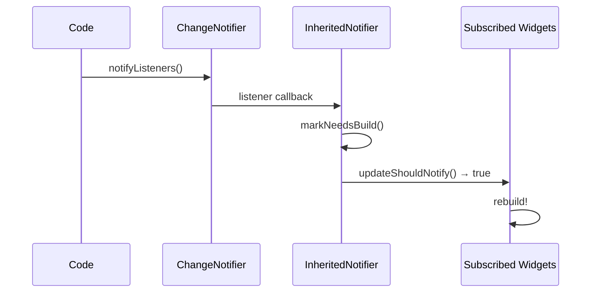

# Bài 5.3 — InheritedNotifier & ChangeNotifier

## Phần 1 — Khái Niệm & Mục Tiêu Bài Học

### Tại sao bài này quan trọng?

`InheritedWidget` có một hạn chế: để cập nhật data, bạn cần `StatefulWidget` cha để gọi `setState()`, tạo `InheritedWidget` mới, rồi `updateShouldNotify()` trigger rebuild. Rất verbose.

`InheritedNotifier` kết hợp `InheritedWidget` + `ChangeNotifier` vào một class:

```dart
// Trước: 3 class (StatefulWidget + State + InheritedWidget)
// Sau: 1 InheritedNotifier<T extends Listenable>
```

Và `ValueNotifier<T>` là `ChangeNotifier` đơn giản nhất — rất thường dùng trong Flutter.

### Bạn sẽ hiểu được sau bài này:
- `ChangeNotifier`: pattern notify listeners khi state thay đổi
- `ValueNotifier<T>`: single-value observable
- `InheritedNotifier<T>`: InheritedWidget tự động listen Listenable
- `ListenableBuilder` (Flutter 3.7+): rebuild chỉ khi listener notify

---

## Phần 2 — Cơ Chế Hoạt Động (Under the Hood)

### ChangeNotifier → InheritedNotifier chain



### ValueNotifier — Simplest Listenable

```dart
// ValueNotifier<T> extends ChangeNotifier
// Gọi notifyListeners() tự động khi value thay đổi

final counter = ValueNotifier<int>(0);
counter.value = 1; // Automatically gọi notifyListeners()

// ChangeNotifier: manual
class CartModel extends ChangeNotifier {
  int _count = 0;
  int get count => _count;

  void add() {
    _count++;
    notifyListeners(); // Manual gọi
  }
}
```

---

## Phần 3 — Code Mẫu Chuẩn Google

### 3.1 — ValueNotifier + ListenableBuilder

```dart
// ValueNotifier: đơn giản nhất cho single-value state
class CounterScreen extends StatefulWidget {
  const CounterScreen({super.key});
  @override State<CounterScreen> createState() => _CounterScreenState();
}

class _CounterScreenState extends State<CounterScreen> {
  // ValueNotifier thay vì int _count + setState
  late final ValueNotifier<int> _counterNotifier;

  @override
  void initState() {
    super.initState();
    _counterNotifier = ValueNotifier<int>(0);
  }

  @override
  void dispose() {
    _counterNotifier.dispose(); // Bắt buộc dispose!
    super.dispose();
  }

  @override
  Widget build(BuildContext context) {
    return Scaffold(
      body: Column(
        mainAxisAlignment: MainAxisAlignment.center,
        children: [
          // Static header — không rebuild khi counter thay đổi
          const Text('Counter Demo', style: TextStyle(fontSize: 24)),
          const SizedBox(height: 16),

          // ListenableBuilder: chỉ rebuild phần này khi notifier change
          ListenableBuilder(
            listenable: _counterNotifier,
            builder: (context, _) {
              return Text(
                '${_counterNotifier.value}',
                style: const TextStyle(fontSize: 64, fontWeight: FontWeight.bold),
              );
            },
          ),

          // Nút tăng/giảm
          Row(
            mainAxisAlignment: MainAxisAlignment.center,
            children: [
              ElevatedButton(
                onPressed: () => _counterNotifier.value--,
                child: const Icon(Icons.remove),
              ),
              const SizedBox(width: 16),
              ElevatedButton(
                onPressed: () => _counterNotifier.value++,
                child: const Icon(Icons.add),
              ),
            ],
          ),
        ],
      ),
    );
  }
}
```

### 3.2 — ChangeNotifier — Complex state model

```dart
class ShoppingCart extends ChangeNotifier {
  final List<CartItem> _items = [];

  List<CartItem> get items => List.unmodifiable(_items);
  int get itemCount => _items.fold(0, (sum, i) => sum + i.quantity);
  double get total => _items.fold(0, (sum, i) => sum + i.subtotal);

  void addProduct(Product product, {int quantity = 1}) {
    final existingIndex = _items.indexWhere((i) => i.productId == product.id);
    if (existingIndex >= 0) {
      final existing = _items[existingIndex];
      _items[existingIndex] = existing.copyWith(
        quantity: existing.quantity + quantity,
      );
    } else {
      _items.add(CartItem(
        productId: product.id,
        productName: product.name,
        price: product.price,
        quantity: quantity,
      ));
    }
    notifyListeners(); // Notify tất cả listeners
  }

  void removeItem(String productId) {
    _items.removeWhere((i) => i.productId == productId);
    notifyListeners();
  }

  void clear() {
    _items.clear();
    notifyListeners();
  }
}
```

### 3.3 — InheritedNotifier — Kết hợp tốt nhất

```dart
// InheritedNotifier<T extends Listenable>:
// Tự động listen T và rebuild subscribers khi T notify

class CartProvider extends InheritedNotifier<ShoppingCart> {
  const CartProvider({
    super.key,
    required ShoppingCart cart,
    required super.child,
  }) : super(notifier: cart);

  static ShoppingCart of(BuildContext context) {
    return context
        .dependOnInheritedWidgetOfExactType<CartProvider>()!
        .notifier!;
  }

  // InheritedNotifier tự handle updateShouldNotify dựa trên notifier
  // Không cần override!
}

// Sử dụng trong app:
class MyApp extends StatelessWidget {
  final ShoppingCart _cart = ShoppingCart();

  @override
  Widget build(BuildContext context) {
    return CartProvider(
      cart: _cart,
      child: MaterialApp(
        home: ShopScreen(),
      ),
    );
  }
}

// Widget subscribe cart:
class CartSummary extends StatelessWidget {
  const CartSummary({super.key});

  @override
  Widget build(BuildContext context) {
    // dependOn → rebuild khi cart notifyListeners()
    final cart = CartProvider.of(context);
    return Column(
      children: [
        Text('${cart.itemCount} sản phẩm'),
        Text('Tổng: ${cart.total.toStringAsFixed(0)}đ'),
      ],
    );
  }
}

// Widget add to cart:
class AddToCartButton extends StatelessWidget {
  final Product product;
  const AddToCartButton({super.key, required this.product});

  @override
  Widget build(BuildContext context) {
    return ElevatedButton(
      onPressed: () {
        // Không cần context.dependOn — không cần rebuild
        CartProvider.of(context).addProduct(product);
      },
      child: const Text('Thêm vào giỏ'),
    );
  }
}
```

### 3.4 — Shopping Cart Counter với InheritedNotifier

```dart
// Scenario thực tế: Shopping cart badge trên AppBar
class ShopApp extends StatelessWidget {
  final ShoppingCart _cart = ShoppingCart();

  ShopApp({super.key});

  @override
  Widget build(BuildContext context) {
    return CartProvider(
      cart: _cart,
      child: MaterialApp(
        home: Scaffold(
          appBar: AppBar(
            title: const Text('Shop'),
            actions: const [CartBadge()],
          ),
          body: const ProductCatalog(),
        ),
      ),
    );
  }
}

class CartBadge extends StatelessWidget {
  const CartBadge({super.key});

  @override
  Widget build(BuildContext context) {
    // Chỉ widget này rebuild khi cart thay đổi — không phải toàn bộ AppBar
    final cart = CartProvider.of(context);
    final count = cart.itemCount;
    return Badge.count(
      count: count,
      isLabelVisible: count > 0,
      child: IconButton(
        icon: const Icon(Icons.shopping_cart),
        onPressed: () => Navigator.pushNamed(context, '/cart'),
      ),
    );
  }
}
```

---

## Phần 4 — Lỗi Sai Phổ Biến & Best Practices

### ❌ Anti-pattern 1: Không dispose ValueNotifier/ChangeNotifier

```dart
// ❌ Memory leak
class _BadState extends State<MyWidget> {
  final counter = ValueNotifier<int>(0); // Không dispose!
}

// ✅ Đúng
class _GoodState extends State<MyWidget> {
  late final ValueNotifier<int> counter;

  @override
  void initState() {
    super.initState();
    counter = ValueNotifier<int>(0);
  }

  @override
  void dispose() {
    counter.dispose(); // Dispose trước super
    super.dispose();
  }
}
```

### ❌ Anti-pattern 2: Gọi `notifyListeners()` trong getter

```dart
// ❌ Nguy hiểm: getter gọi notifyListeners() → vòng lặp rebuild
class BadModel extends ChangeNotifier {
  int _count = 0;
  int get count {
    notifyListeners(); // ❌ Gọi mỗi khi ai đọc count!
    return _count;
  }
}

// ✅ Đúng: chỉ notify khi data THAY ĐỔI
class GoodModel extends ChangeNotifier {
  int _count = 0;
  int get count => _count; // Getter đơn giản

  void increment() {
    _count++;
    notifyListeners(); // Notify sau khi thay đổi
  }
}
```

### ❌ Anti-pattern 3: ValueNotifier cho complex state

```dart
// ❌ Khó quản lý: Nhiều ValueNotifier riêng lẻ
class _ProfileState extends State<ProfileScreen> {
  final _name = ValueNotifier<String>('');
  final _email = ValueNotifier<String>('');
  final _avatar = ValueNotifier<String?>('');
  // → Phải dispose tất cả, rebuild không đồng bộ

// ✅ Đúng: ChangeNotifier cho complex state
class ProfileModel extends ChangeNotifier {
  String _name = '';
  String _email = '';
  String? _avatar;

  void update({String? name, String? email, String? avatar}) {
    _name = name ?? _name;
    _email = email ?? _email;
    _avatar = avatar ?? _avatar;
    notifyListeners(); // 1 lần notify cho tất cả thay đổi
  }
}
```

---

## Phần 5 — Bài Tập Củng Cố Tư Duy

### Challenge: Shopping Cart Counter với InheritedNotifier

**Yêu cầu:**
1. `ShoppingCart extends ChangeNotifier` với `addProduct`, `removeProduct`, `clear`
2. `CartProvider extends InheritedNotifier<ShoppingCart>`
3. Badge trên AppBar hiển thị số lượng item
4. Product list với "Add to Cart" button
5. Cart detail screen với list items và total

**Bonus:**
- Dùng `ListenableBuilder` để chỉ rebuild badge, không rebuild toàn AppBar
- Cart count animation khi thêm/xóa item

### Câu hỏi phỏng vấn liên quan:

1. **"ChangeNotifier hoạt động như thế nào?"**
   - Giữ danh sách listeners
   - `notifyListeners()` gọi tất cả listeners khi state thay đổi
   - Implement `Listenable` interface

2. **"Sự khác biệt giữa `ValueNotifier` và `ChangeNotifier`?"**
   - `ValueNotifier<T>`: single value, auto notify khi `.value` thay đổi
   - `ChangeNotifier`: complex state với nhiều fields, manual gọi `notifyListeners()`

3. **"Tại sao `InheritedNotifier` tiện hơn `InheritedWidget + StatefulWidget`?"**
   - Không cần StatefulWidget riêng chỉ để gọi setState
   - Tự động rebuild khi Notifier.notifyListeners() được gọi
   - Less boilerplate — 1 class thay vì 3
