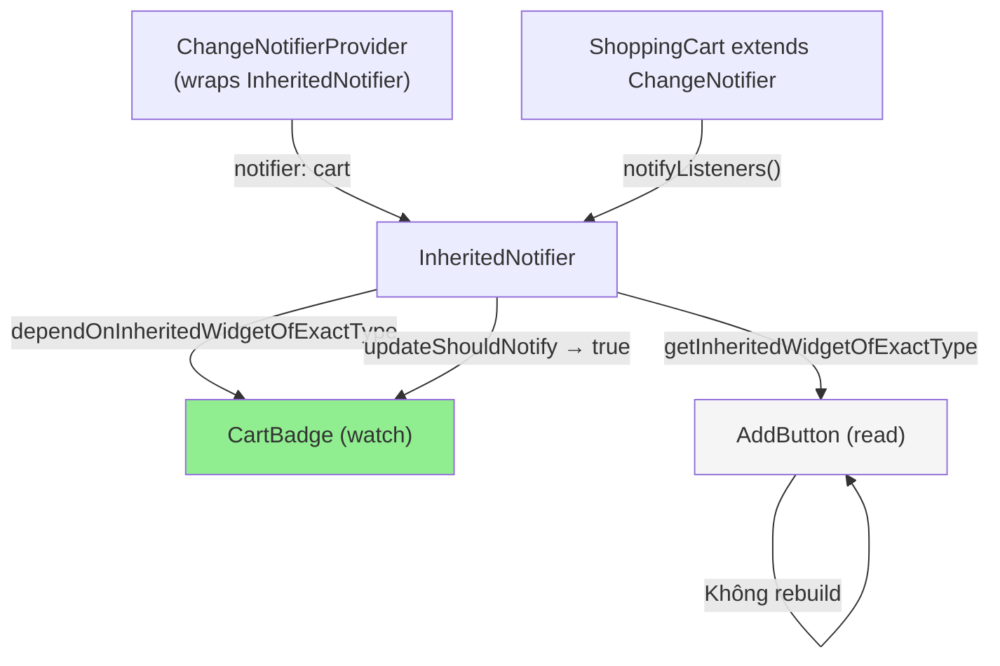

# Bài 5.4 — Provider Pattern Foundation

## Phần 1 — Khái Niệm & Mục Tiêu Bài Học

### Tại sao bài này quan trọng?

Sau khi học InheritedWidget và InheritedNotifier, bạn sẽ nhận ra: mọi state management package Flutter đều build trên cơ chế đó. `provider` là package phổ biến nhất — và là wrapper mỏng trên `InheritedWidget`.

```dart
// Provider nguồn gốc là InheritedWidget
// Nhưng provider handle:
// - Tự động dispose ChangeNotifier
// - MultiProvider để gộp nhiều provider
// - Consumer/Selector để giới hạn rebuild scope
// - context.read() vs context.watch() — sugar syntax
```

Hiểu Provider giúp bạn:
- Dùng package phổ biến nhất Flutter ecosystem đúng cách
- Hiểu tại sao `context.watch()` rebuild widget nhưng `context.read()` thì không
- Tối ưu rebuild với `Selector`

### Bạn sẽ hiểu được sau bài này:
- `ChangeNotifierProvider` — cung cấp model xuống tree
- `Consumer<T>` — subscribe và rebuild widget
- `Selector<T, S>` — subscribe chỉ khi phần cụ thể của model thay đổi
- Migrate từ InheritedNotifier (bài 5.3) sang Provider

---

## Phần 2 — Cơ Chế Hoạt Động (Under the Hood)

### Provider internals



### context.watch() vs context.read() vs context.select()

```
context.watch<T>()      = context.dependOnInheritedWidgetOfExactType<T>()
                        → Subscribe + rebuild khi T notify

context.read<T>()       = context.getInheritedWidgetOfExactType<T>()
                        → Read-only, không rebuild
                        → Dùng trong callbacks/onPressed

context.select<T, R>()  = Subscribe chỉ khi result của selector fn thay đổi
                        → Fine-grained rebuild control
```

---

## Phần 3 — Code Mẫu Chuẩn Google

### 3.1 — Setup Provider

```yaml
# pubspec.yaml
dependencies:
  provider: ^6.0.0
```

```dart
// main.dart — Setup providers ở root
void main() {
  runApp(
    // MultiProvider: nhiều provider cùng lúc
    MultiProvider(
      providers: [
        // ChangeNotifierProvider: create + manage lifecycle của ChangeNotifier
        ChangeNotifierProvider<ShoppingCart>(
          create: (_) => ShoppingCart(),
          // lazy: true (default) — tạo khi lần đầu được dùng
          // lazy: false — tạo ngay khi widget tree build
        ),
        ChangeNotifierProvider<UserModel>(
          create: (_) => UserModel(),
        ),
        // Provider (không phải ChangeNotifierProvider): cho immutable data
        Provider<AppConfig>(
          create: (_) => AppConfig.fromEnv(),
        ),
      ],
      child: const MyApp(),
    ),
  );
}
```

### 3.2 — Consumer và context.watch()

```dart
// Consumer: widget wrapper dùng builder pattern
class CartSummaryConsumer extends StatelessWidget {
  const CartSummaryConsumer({super.key});

  @override
  Widget build(BuildContext context) {
    return Consumer<ShoppingCart>(
      builder: (context, cart, child) {
        // builder được gọi mỗi khi cart.notifyListeners()
        return Column(
          children: [
            Text('${cart.itemCount} items'),
            Text('${cart.total.toStringAsFixed(0)}đ'),
            // child: widget không thay đổi → pass vào để optimize
            child!, // child không rebuild!
          ],
        );
      },
      // child: Widget static, không phụ thuộc vào cart
      // Được build một lần và pass vào builder
      child: const Text('Giỏ hàng của bạn'),
    );
  }
}

// context.watch() — sugar syntax, cùng tác dụng với Consumer
class CartBadge extends StatelessWidget {
  const CartBadge({super.key});

  @override
  Widget build(BuildContext context) {
    // watch: subscribe → rebuild khi cart notify
    final cart = context.watch<ShoppingCart>();
    return Badge.count(
      count: cart.itemCount,
      isLabelVisible: cart.itemCount > 0,
      child: const Icon(Icons.shopping_cart),
    );
  }
}

// context.read() — không rebuild
class AddToCartButton extends StatelessWidget {
  final Product product;
  const AddToCartButton({super.key, required this.product});

  @override
  Widget build(BuildContext context) {
    return ElevatedButton(
      onPressed: () {
        // read: không subscribe → dùng trong callback
        context.read<ShoppingCart>().addProduct(product);
      },
      child: const Text('Thêm vào giỏ'),
    );
  }
}
```

### 3.3 — Selector — Fine-grained rebuild

```dart
// Vấn đề với context.watch():
// Cart có nhiều field: items, total, discount, deliveryFee
// CartBadge chỉ cần itemCount — nhưng watch rebuild khi bất kỳ field nào thay đổi

// Selector: chỉ rebuild khi phần cụ thể thay đổi
class CartBadgeOptimized extends StatelessWidget {
  const CartBadgeOptimized({super.key});

  @override
  Widget build(BuildContext context) {
    // Selector<T (provider type), R (selected value type)>
    // builder chỉ rebuild khi giá trị selector fn thay đổi
    return Selector<ShoppingCart, int>(
      selector: (_, cart) => cart.itemCount, // Chọn chỉ itemCount
      builder: (context, count, child) {
        // Chỉ rebuild khi itemCount thay đổi
        // Không rebuild khi cart.discount thay đổi!
        return Badge.count(
          count: count,
          isLabelVisible: count > 0,
          child: child!,
        );
      },
      child: const Icon(Icons.shopping_cart),
    );
  }
}

// Selector với record (Dart 3)
class CartInfoRow extends StatelessWidget {
  const CartInfoRow({super.key});

  @override
  Widget build(BuildContext context) {
    return Selector<ShoppingCart, (int count, double total)>(
      selector: (_, cart) => (cart.itemCount, cart.total),
      // shouldRebuild: custom equality (default: ==)
      shouldRebuild: (prev, next) => prev != next,
      builder: (context, (count, total), _) {
        return Row(
          children: [
            Text('$count sản phẩm'),
            const Spacer(),
            Text('${total.toStringAsFixed(0)}đ'),
          ],
        );
      },
    );
  }
}
```

### 3.4 — Migrate từ InheritedNotifier sang Provider

```dart
// TRƯỚC (bài 5.3): InheritedNotifier
class CartProvider extends InheritedNotifier<ShoppingCart> {
  const CartProvider({
    super.key,
    required ShoppingCart cart,
    required super.child,
  }) : super(notifier: cart);

  static ShoppingCart of(BuildContext context) =>
      context.dependOnInheritedWidgetOfExactType<CartProvider>()!.notifier!;
}

// Widget root:
CartProvider(
  cart: ShoppingCart(),
  child: MaterialApp(...)
)

// SAU: Provider (ít boilerplate hơn, features phong phú hơn)
// Không cần CartProvider class riêng!
ChangeNotifierProvider<ShoppingCart>(
  create: (_) => ShoppingCart(),
  child: MaterialApp(...),
)

// Widget: thay CartProvider.of(context) bằng context.watch/read
// TRƯỚC:
final cart = CartProvider.of(context);

// SAU:
final cart = context.watch<ShoppingCart>(); // Rebuild khi cart notify
// hoặc:
final cart = context.read<ShoppingCart>(); // Không rebuild
```

---

## Phần 4 — Lỗi Sai Phổ Biến & Best Practices

### ❌ Anti-pattern 1: context.watch() trong callback

```dart
// ❌ Sai: context.watch() trong onPressed — gây vấn đề
ElevatedButton(
  onPressed: () {
    final cart = context.watch<ShoppingCart>(); // ❌ Trong callback!
    cart.addProduct(product);
  },
  child: const Text('Add'),
)

// ✅ Đúng: context.read() trong callback
ElevatedButton(
  onPressed: () {
    context.read<ShoppingCart>().addProduct(product); // ✅
  },
  child: const Text('Add'),
)
```

### ❌ Anti-pattern 2: Provider trong build() trực tiếp

```dart
// ❌ Sai: Tạo provider trong build → recreate mỗi lần parent rebuild
Widget build(BuildContext context) {
  return ChangeNotifierProvider( // ❌ Tạo mới mỗi rebuild!
    create: (_) => ShoppingCart(),
    child: const CartScreen(),
  );
}

// ✅ Đúng: Provider ở level phù hợp trong widget tree
// (StatefulWidget nếu cần, hoặc root của route)
```

### ❌ Anti-pattern 3: Selector với complex object không implement ==

```dart
// ❌ Sai: Selector không biết CartSummary thay đổi vì no == override
Selector<Cart, CartSummary>(
  selector: (_, cart) => CartSummary(count: cart.count, total: cart.total),
  // CartSummary không implement == → luôn rebuild!
)

// ✅ Đúng: Selector với primitive hoặc Record
Selector<Cart, (int, double)>(
  selector: (_, cart) => (cart.count, cart.total), // Record có == tự động
  builder: ...
)
```

---

## Phần 5 — Bài Tập Củng Cố Tư Duy

### Challenge: Migrate InheritedNotifier Cart → Provider

**Bài tập:** Lấy code từ bài 5.3 (`InheritedNotifier`) và migrate sang `provider` package:

1. Xóa `CartProvider extends InheritedNotifier`
2. Thêm `provider` dependency
3. Wrap root với `ChangeNotifierProvider<ShoppingCart>`
4. Thay `CartProvider.of(context)` bằng `context.watch<ShoppingCart>()`
5. Thay `CartProvider.of(context)` trong callbacks bằng `context.read<ShoppingCart>()`
6. Tối ưu badge với `Selector<ShoppingCart, int>` (chỉ rebuild theo itemCount)

### Thử Thách Tư Duy & Thẩm Định Chuyên Sâu (Conceptual & Deep-Dive Check)

> **[Junior]** — nắm khái niệm | **[Middle]** — hiểu cơ chế | **[Senior]** — hiểu Flutter internals | **[Trace Code]** — đọc code và dự đoán output

---

#### Q1 [Junior] — "Provider package build trên gì? Có 'magic' không?"

**Trả lời chuẩn:**

Provider build hoàn toàn trên `InheritedWidget` — không có magic, chỉ là abstraction layer giúp dễ dùng hơn:

```
Provider ecosystem:
  ChangeNotifierProvider<T>
    → InheritedNotifier<T>        (= InheritedWidget + auto-listen Notifier)
      → InheritedWidget             (Flutter built-in)
        → dependOnInheritedWidgetOfExactType (Flutter built-in)

context.watch<T>()
  → dependOnInheritedWidgetOfExactType<InheritedProvider<T>>()
  → trả về T value, đăng ký dependency

context.read<T>()
  → getInheritedWidgetOfExactType<InheritedProvider<T>>()
  → trả về T value, KHÔNG đăng ký dependency
```

**Provider thêm gì so với InheritedWidget thuần:**
- **Lifecycle management:** Tự dispose ChangeNotifier khi Provider bị remove
- **MultiProvider:** Gom nhiều providers không bị pyramid nesting
- **Type inference:** Không cần generic type mỗi lần
- **Error messages:** Readable hơn khi Provider not found

---

#### Q2 [Junior] — "Khi nào dùng `Consumer` vs `context.watch()`?"

**Trả lời chuẩn:**

| | `context.watch<T>()` | `Consumer<T>` |
|---|---|---|
| **Vị trí** | Trong `build()` method | Bất kỳ đâu trong widget tree |
| **Rebuild scope** | Toàn bộ widget `build()` | Chỉ phần trong `builder` callback |
| **`child` param** | Không có | Có — static widget không rebuild |
| **Code style** | Clean, functional | Explicit, verbose hơn |

```dart
// context.watch — rebuild toàn bộ _CartScreenState.build()
@override
Widget build(BuildContext context) {
  final cart = context.watch<CartModel>(); // toàn build() rebuild
  return Column(children: [
    const ExpensiveStaticWidget(), // rebuild cùng với cart update!
    Text('${cart.items.length} items'),
  ]);
}

// Consumer — chỉ rebuild phần cần
@override
Widget build(BuildContext context) {
  return Column(children: [
    const ExpensiveStaticWidget(), // KHÔNG rebuild khi cart thay đổi
    Consumer<CartModel>(
      builder: (ctx, cart, child) => Text('${cart.items.length} items'),
      // child: optional static widget được pass vào builder (không rebuild)
    ),
  ]);
}
```

**Rule of thumb:** Dùng `context.watch()` khi rebuild scope nhỏ (leaf widget). Dùng `Consumer` khi cần isolate rebuild trong một widget phức tạp.

---

#### Q3 [Middle] — "Tại sao `Selector` tốt hơn `Consumer` cho rebuild optimization?"

**Trả lời chuẩn:**

`Consumer` rebuild khi **bất kỳ thứ gì** trong ChangeNotifier thay đổi (vì nghe `notifyListeners()`). `Selector` rebuild chỉ khi **giá trị được select** thay đổi:

```dart
class UserProfile extends ChangeNotifier {
  String _name = 'Alice';
  int _age = 30;
  bool _isOnline = false;
  
  // Khi _isOnline thay đổi → notifyListeners() → Consumer rebuild
  void setOnline(bool online) {
    _isOnline = online;
    notifyListeners();
  }
  
  void updateName(String name) {
    _name = name;
    notifyListeners();
  }
}

// Consumer — rebuild khi isOnline hoặc name hoặc age thay đổi
Consumer<UserProfile>(
  builder: (ctx, profile, _) => Text(profile.name), // chỉ cần name!
)

// Selector — chỉ rebuild khi name thay đổi
Selector<UserProfile, String>(
  selector: (ctx, profile) => profile.name, // chỉ watch name
  builder: (ctx, name, _) => Text(name),
)
// isOnline thay đổi → Selector.selector() return 'Alice' = 'Alice' → KHÔNG rebuild
```

**Use case quan trọng:** Khi app có nhiều unrelated state fields, `Selector` tránh cascade rebuild không cần thiết.

---

#### Q4 [Senior] — "`context.watch<T>()` internals: gọi `dependOnInheritedWidgetOfExactType` hay cơ chế khác?"

**Trả lời chuẩn:**

`context.watch<T>()` là extension method được Provider package thêm vào `BuildContext`. Nó delegate đến `Provider.of<T>(context, listen: true)`:

```dart
// Provider source (simplified)
static T of<T>(BuildContext context, {bool listen = true}) {
  try {
    return Provider._inheritedElementOf<T>(context, listen: listen);
  } catch (e) { ... }
}

static T _inheritedElementOf<T>(BuildContext context, {required bool listen}) {
  final inheritedElement = context._getElementForInheritedWidgetOfExactType<InheritedProvider<T>>();
  
  if (listen) {
    // Giống dependOnInheritedWidgetOfExactType
    context.dependOnInheritedElement(inheritedElement);
  }
  
  return inheritedElement.value; // trả về T value từ InheritedProvider
}
```

**Cơ chế:** Về cơ bản là `dependOnInheritedWidgetOfExactType<InheritedProvider<T>>()` nhưng extract value từ đó. Provider wraps ChangeNotifier trong `InheritedNotifier<T>` — khi Notifier `notifyListeners()`, InheritedNotifier mark dirty → `InheritedElement.notifyClients()` → rebuild watchers.

**Điểm tinh tế:** Provider dùng `InheritedProvider` (không phải `InheritedNotifier` trực tiếp) với `_NotifierAspect` để support fine-grained watching trong một số trường hợp.

---

#### Q5 [Middle] — "`ProxyProvider` vs `ChangeNotifierProxyProvider` — khác nhau thế nào?"

**Trả lời chuẩn:**

| | `ProxyProvider<A, B>` | `ChangeNotifierProxyProvider<A, B>` |
|---|---|---|
| **Output type B** | Any object | `ChangeNotifier` subclass |
| **B mutable** | Không — mỗi lần A thay đổi, B mới được tạo | Có — B được update thay vì recreate |
| **Listeners** | B không listen được | B có thể `notifyListeners()` |
| **Use case** | Transform A sang computed value | B cần A data + tự có state |

```dart
// ProxyProvider — khi B là simple computed value
ProxyProvider<AuthModel, ApiClient>(
  update: (ctx, auth, _) => ApiClient(token: auth.token),
  // Mỗi khi AuthModel thay đổi → ApiClient MỚI được tạo
  child: const App(),
)

// ChangeNotifierProxyProvider — khi B là ChangeNotifier phụ thuộc A
ChangeNotifierProxyProvider<AuthModel, CartModel>(
  create: (ctx) => CartModel(),
  update: (ctx, auth, cart) {
    cart!.updateToken(auth.token); // update existing CartModel với data mới
    return cart; // trả về CÙNG instance (không tạo mới)
  },
  child: const App(),
)
```

---

#### Q6 [Senior] — "`Selector<T, S>` so sánh giá trị bằng `==` hay custom? Ảnh hưởng khi select List/Map?"

**Trả lời chuẩn:**

`Selector` dùng hàm `shouldRebuild` — mặc định là `==`:

```dart
// Provider source
class Selector<A, S> extends Selector0<S> {
  Selector({
    required S Function(BuildContext, A) selector,
    bool Function(S, S)? shouldRebuild, // custom equality function
    required Widget Function(BuildContext, S, Widget?) builder,
    ...
  });
}
```

**Vấn đề với List/Map:**

```dart
// ❌ Vấn đề: selector trả về List mới mỗi lần → == false → luôn rebuild
Selector<UserModel, List<String>>(
  selector: (ctx, user) => user.friends, // nếu friends là new List mỗi lần
  builder: (ctx, friends, _) => FriendsList(friends: friends),
)
// user.friends không thay đổi nhưng return List mới → Selector rebuild!

// ✅ Fix 1: return cùng instance nếu không thay đổi
Selector<UserModel, List<String>>(
  selector: (ctx, user) => user.friends, // UserModel trả về CÙNG List instance
  shouldRebuild: (prev, next) => !listEquals(prev, next), // deep compare
  builder: ...
)

// ✅ Fix 2: selector trả về derived value không phải collection
Selector<UserModel, int>(
  selector: (ctx, user) => user.friends.length, // int → == đơn giản
  builder: (ctx, count, _) => Text('$count friends'),
)
```

**Best practice:** Chọn selector value là primitive type khi có thể. Nếu cần collection, implement `shouldRebuild` với `listEquals`/`mapEquals` từ `foundation.dart`.

---

#### Q7 [Trace Code] — "`context.read()` vs `context.watch()` trong callback: cái nào an toàn?"

```dart
class ProductPage extends StatelessWidget {
  const ProductPage({super.key});

  @override
  Widget build(BuildContext context) {
    // (A) watch trong build
    final cart = context.watch<CartModel>();

    return Column(
      children: [
        Text('Items: ${cart.items.length}'),
        
        // (B) watch trong builder callback
        Builder(
          builder: (ctx) {
            final cart2 = ctx.watch<CartModel>(); // context từ Builder
            return Text('Items (b): ${cart2.items.length}');
          },
        ),
        
        // (C) read trong onPressed
        ElevatedButton(
          onPressed: () {
            context.read<CartModel>().addItem('apple'); // read trong callback
          },
          child: const Text('Add'),
        ),
        
        // (D) watch trong onPressed — NGUY HIỂM
        ElevatedButton(
          onPressed: () {
            final cartD = context.watch<CartModel>(); // watch trong callback!
            cartD.addItem('banana');
          },
          child: const Text('Add Banana'),
        ),
      ],
    );
  }
}
```

**Phân tích:**

- **(A) `context.watch()` trong `build()`** → ✅ **Đúng** — register dependency → widget rebuild khi CartModel thay đổi

- **(B) `ctx.watch()` trong Builder's `builder`** → ✅ **Đúng** — `ctx` là context của Builder widget, Builder được rebuild khi CartModel thay đổi (scope nhỏ hơn)

- **(C) `context.read()` trong `onPressed`** → ✅ **Đúng** — đọc 1 lần trong callback, không cần watch. Đây là cách khuyến nghị.

- **(D) `context.watch()` trong `onPressed`** → ❌ **SAI** — gọi `dependOnInheritedWidgetOfExactType` trong callback (không phải trong `build()`) → **Flutter warn** hoặc unexpected behavior. Watch chỉ có ý nghĩa trong `build()` — nếu gọi trong callback, dependency được đăng ký sai lúc. Flutter lint `provider_parameters` sẽ cảnh báo về điều này.

**Rule:** `context.read()` → callbacks/initState. `context.watch()` → chỉ trong `build()`.
