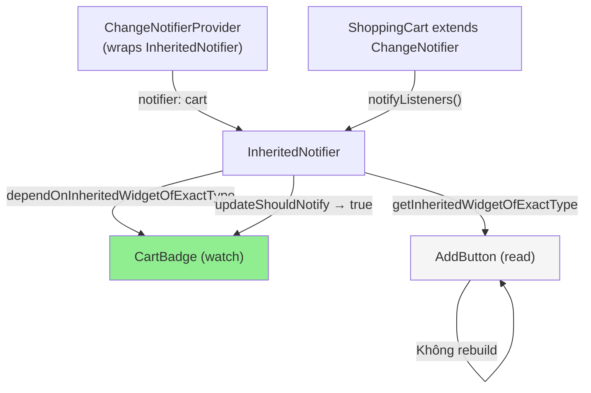

# Bài 5.4 — Provider Pattern Foundation

## Phần 1 — Khái Niệm & Mục Tiêu Bài Học

### Tại sao bài này quan trọng?

Sau khi học InheritedWidget và InheritedNotifier, bạn sẽ nhận ra: mọi state management package Flutter đều build trên cơ chế đó. `provider` là package phổ biến nhất — và là wrapper mỏng trên `InheritedWidget`.

```dart
// Provider nguồn gốc là InheritedWidget
// Nhưng provider handle:
// - Tự động dispose ChangeNotifier
// - MultiProvider để gộp nhiều provider
// - Consumer/Selector để giới hạn rebuild scope
// - context.read() vs context.watch() — sugar syntax
```

Hiểu Provider giúp bạn:
- Dùng package phổ biến nhất Flutter ecosystem đúng cách
- Hiểu tại sao `context.watch()` rebuild widget nhưng `context.read()` thì không
- Tối ưu rebuild với `Selector`

### Bạn sẽ hiểu được sau bài này:
- `ChangeNotifierProvider` — cung cấp model xuống tree
- `Consumer<T>` — subscribe và rebuild widget
- `Selector<T, S>` — subscribe chỉ khi phần cụ thể của model thay đổi
- Migrate từ InheritedNotifier (bài 5.3) sang Provider

---

## Phần 2 — Cơ Chế Hoạt Động (Under the Hood)

### Provider internals



### context.watch() vs context.read() vs context.select()

```
context.watch<T>()      = context.dependOnInheritedWidgetOfExactType<T>()
                        → Subscribe + rebuild khi T notify

context.read<T>()       = context.getInheritedWidgetOfExactType<T>()
                        → Read-only, không rebuild
                        → Dùng trong callbacks/onPressed

context.select<T, R>()  = Subscribe chỉ khi result của selector fn thay đổi
                        → Fine-grained rebuild control
```

---

## Phần 3 — Code Mẫu Chuẩn Google

### 3.1 — Setup Provider

```yaml
# pubspec.yaml
dependencies:
  provider: ^6.0.0
```

```dart
// main.dart — Setup providers ở root
void main() {
  runApp(
    // MultiProvider: nhiều provider cùng lúc
    MultiProvider(
      providers: [
        // ChangeNotifierProvider: create + manage lifecycle của ChangeNotifier
        ChangeNotifierProvider<ShoppingCart>(
          create: (_) => ShoppingCart(),
          // lazy: true (default) — tạo khi lần đầu được dùng
          // lazy: false — tạo ngay khi widget tree build
        ),
        ChangeNotifierProvider<UserModel>(
          create: (_) => UserModel(),
        ),
        // Provider (không phải ChangeNotifierProvider): cho immutable data
        Provider<AppConfig>(
          create: (_) => AppConfig.fromEnv(),
        ),
      ],
      child: const MyApp(),
    ),
  );
}
```

### 3.2 — Consumer và context.watch()

```dart
// Consumer: widget wrapper dùng builder pattern
class CartSummaryConsumer extends StatelessWidget {
  const CartSummaryConsumer({super.key});

  @override
  Widget build(BuildContext context) {
    return Consumer<ShoppingCart>(
      builder: (context, cart, child) {
        // builder được gọi mỗi khi cart.notifyListeners()
        return Column(
          children: [
            Text('${cart.itemCount} items'),
            Text('${cart.total.toStringAsFixed(0)}đ'),
            // child: widget không thay đổi → pass vào để optimize
            child!, // child không rebuild!
          ],
        );
      },
      // child: Widget static, không phụ thuộc vào cart
      // Được build một lần và pass vào builder
      child: const Text('Giỏ hàng của bạn'),
    );
  }
}

// context.watch() — sugar syntax, cùng tác dụng với Consumer
class CartBadge extends StatelessWidget {
  const CartBadge({super.key});

  @override
  Widget build(BuildContext context) {
    // watch: subscribe → rebuild khi cart notify
    final cart = context.watch<ShoppingCart>();
    return Badge.count(
      count: cart.itemCount,
      isLabelVisible: cart.itemCount > 0,
      child: const Icon(Icons.shopping_cart),
    );
  }
}

// context.read() — không rebuild
class AddToCartButton extends StatelessWidget {
  final Product product;
  const AddToCartButton({super.key, required this.product});

  @override
  Widget build(BuildContext context) {
    return ElevatedButton(
      onPressed: () {
        // read: không subscribe → dùng trong callback
        context.read<ShoppingCart>().addProduct(product);
      },
      child: const Text('Thêm vào giỏ'),
    );
  }
}
```

### 3.3 — Selector — Fine-grained rebuild

```dart
// Vấn đề với context.watch():
// Cart có nhiều field: items, total, discount, deliveryFee
// CartBadge chỉ cần itemCount — nhưng watch rebuild khi bất kỳ field nào thay đổi

// Selector: chỉ rebuild khi phần cụ thể thay đổi
class CartBadgeOptimized extends StatelessWidget {
  const CartBadgeOptimized({super.key});

  @override
  Widget build(BuildContext context) {
    // Selector<T (provider type), R (selected value type)>
    // builder chỉ rebuild khi giá trị selector fn thay đổi
    return Selector<ShoppingCart, int>(
      selector: (_, cart) => cart.itemCount, // Chọn chỉ itemCount
      builder: (context, count, child) {
        // Chỉ rebuild khi itemCount thay đổi
        // Không rebuild khi cart.discount thay đổi!
        return Badge.count(
          count: count,
          isLabelVisible: count > 0,
          child: child!,
        );
      },
      child: const Icon(Icons.shopping_cart),
    );
  }
}

// Selector với record (Dart 3)
class CartInfoRow extends StatelessWidget {
  const CartInfoRow({super.key});

  @override
  Widget build(BuildContext context) {
    return Selector<ShoppingCart, (int count, double total)>(
      selector: (_, cart) => (cart.itemCount, cart.total),
      // shouldRebuild: custom equality (default: ==)
      shouldRebuild: (prev, next) => prev != next,
      builder: (context, (count, total), _) {
        return Row(
          children: [
            Text('$count sản phẩm'),
            const Spacer(),
            Text('${total.toStringAsFixed(0)}đ'),
          ],
        );
      },
    );
  }
}
```

### 3.4 — Migrate từ InheritedNotifier sang Provider

```dart
// TRƯỚC (bài 5.3): InheritedNotifier
class CartProvider extends InheritedNotifier<ShoppingCart> {
  const CartProvider({
    super.key,
    required ShoppingCart cart,
    required super.child,
  }) : super(notifier: cart);

  static ShoppingCart of(BuildContext context) =>
      context.dependOnInheritedWidgetOfExactType<CartProvider>()!.notifier!;
}

// Widget root:
CartProvider(
  cart: ShoppingCart(),
  child: MaterialApp(...)
)

// SAU: Provider (ít boilerplate hơn, features phong phú hơn)
// Không cần CartProvider class riêng!
ChangeNotifierProvider<ShoppingCart>(
  create: (_) => ShoppingCart(),
  child: MaterialApp(...),
)

// Widget: thay CartProvider.of(context) bằng context.watch/read
// TRƯỚC:
final cart = CartProvider.of(context);

// SAU:
final cart = context.watch<ShoppingCart>(); // Rebuild khi cart notify
// hoặc:
final cart = context.read<ShoppingCart>(); // Không rebuild
```

---

## Phần 4 — Lỗi Sai Phổ Biến & Best Practices

### ❌ Anti-pattern 1: context.watch() trong callback

```dart
// ❌ Sai: context.watch() trong onPressed — gây vấn đề
ElevatedButton(
  onPressed: () {
    final cart = context.watch<ShoppingCart>(); // ❌ Trong callback!
    cart.addProduct(product);
  },
  child: const Text('Add'),
)

// ✅ Đúng: context.read() trong callback
ElevatedButton(
  onPressed: () {
    context.read<ShoppingCart>().addProduct(product); // ✅
  },
  child: const Text('Add'),
)
```

### ❌ Anti-pattern 2: Provider trong build() trực tiếp

```dart
// ❌ Sai: Tạo provider trong build → recreate mỗi lần parent rebuild
Widget build(BuildContext context) {
  return ChangeNotifierProvider( // ❌ Tạo mới mỗi rebuild!
    create: (_) => ShoppingCart(),
    child: const CartScreen(),
  );
}

// ✅ Đúng: Provider ở level phù hợp trong widget tree
// (StatefulWidget nếu cần, hoặc root của route)
```

### ❌ Anti-pattern 3: Selector với complex object không implement ==

```dart
// ❌ Sai: Selector không biết CartSummary thay đổi vì no == override
Selector<Cart, CartSummary>(
  selector: (_, cart) => CartSummary(count: cart.count, total: cart.total),
  // CartSummary không implement == → luôn rebuild!
)

// ✅ Đúng: Selector với primitive hoặc Record
Selector<Cart, (int, double)>(
  selector: (_, cart) => (cart.count, cart.total), // Record có == tự động
  builder: ...
)
```

---

## Phần 5 — Bài Tập Củng Cố Tư Duy

### Challenge: Migrate InheritedNotifier Cart → Provider

**Bài tập:** Lấy code từ bài 5.3 (`InheritedNotifier`) và migrate sang `provider` package:

1. Xóa `CartProvider extends InheritedNotifier`
2. Thêm `provider` dependency
3. Wrap root với `ChangeNotifierProvider<ShoppingCart>`
4. Thay `CartProvider.of(context)` bằng `context.watch<ShoppingCart>()`
5. Thay `CartProvider.of(context)` trong callbacks bằng `context.read<ShoppingCart>()`
6. Tối ưu badge với `Selector<ShoppingCart, int>` (chỉ rebuild theo itemCount)

### Câu hỏi phỏng vấn liên quan:

1. **"Provider package build trên gì?"**
   - Build trên `InheritedWidget` — không có magic
   - `ChangeNotifierProvider` = `InheritedNotifier` với thêm lifecycle management

2. **"Khi nào dùng `Consumer` vs `context.watch()`?"**
   - `context.watch()`: đơn giản, rebuild toàn bộ widget
   - `Consumer`: có `child` param để tách static widget không rebuild

3. **"Tại sao `Selector` tốt hơn `Consumer` cho rebuild optimization?"**
   - `Consumer` rebuild khi bất kỳ thứ gì trong ChangeNotifier thay đổi
   - `Selector` chỉ rebuild khi giá trị được chọn thay đổi — fine-grained control
