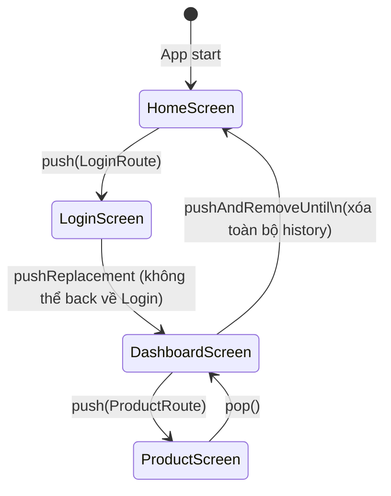

# Bài 6.1 — Navigator 1.0: Push & Pop

## Phần 1 — Khái Niệm & Mục Tiêu Bài Học

### Tại sao bài này quan trọng?

Flutter Navigator 1.0 dùng mô hình **stack** — giống call stack của program. Mọi màn hình mới được push lên đỉnh stack, back button pop khỏi đỉnh:

```
Initial:    [HomeScreen]
Push Login: [HomeScreen, LoginScreen]
Push Dashboard: [HomeScreen, LoginScreen, DashboardScreen]
Pop:        [HomeScreen, LoginScreen]
Pop:        [HomeScreen]
```

Navigator 1.0 đơn giản và đủ dùng cho 80% app. Navigator 2.0 (bài 6.4) cho web URL và deep linking.

### Bạn sẽ hiểu được sau bài này:
- `Navigator.push()`, `pop()`, `pushReplacement()`, `pushAndRemoveUntil()`
- `MaterialPageRoute` và `CupertinoPageRoute`
- `PopScope` (Flutter 3.12+) — intercept back button
- Login flow với `pushReplacement`

---

## Phần 2 — Cơ Chế Hoạt Động (Under the Hood)

### Navigator Stack Model



### Route Transition

```
MaterialPageRoute (Android):     Slide từ phải → trái
CupertinoPageRoute (iOS style):  Slide từ phải + hero transition
PageRouteBuilder (custom):       Định nghĩa transition bất kỳ
```

---

## Phần 3 — Code Mẫu Chuẩn Google

### 3.1 — Push và Pop cơ bản

```dart
class HomeScreen extends StatelessWidget {
  const HomeScreen({super.key});

  @override
  Widget build(BuildContext context) {
    return Scaffold(
      appBar: AppBar(title: const Text('Home')),
      body: Center(
        child: Column(
          mainAxisAlignment: MainAxisAlignment.center,
          children: [
            ElevatedButton(
              onPressed: () {
                // Push: thêm route mới lên đỉnh stack
                Navigator.push(
                  context,
                  MaterialPageRoute(
                    builder: (_) => const ProductListScreen(),
                    // settings: RouteSettings(name: '/products') — cho named route
                  ),
                );
              },
              child: const Text('Xem sản phẩm'),
            ),
            const SizedBox(height: 16),
            ElevatedButton(
              onPressed: () {
                // push với custom transition
                Navigator.push(
                  context,
                  PageRouteBuilder(
                    pageBuilder: (_, animation, __) => const SettingsScreen(),
                    transitionsBuilder: (_, animation, __, child) {
                      return FadeTransition(opacity: animation, child: child);
                    },
                    transitionDuration: const Duration(milliseconds: 300),
                  ),
                );
              },
              child: const Text('Settings (fade)'),
            ),
          ],
        ),
      ),
    );
  }
}

class ProductListScreen extends StatelessWidget {
  const ProductListScreen({super.key});

  @override
  Widget build(BuildContext context) {
    return Scaffold(
      appBar: AppBar(title: const Text('Sản phẩm')),
      // AppBar tự thêm back button khi có route phía trước
      body: Center(
        child: ElevatedButton(
          // pop: xóa route hiện tại khỏi đỉnh stack
          onPressed: () => Navigator.pop(context),
          child: const Text('Quay lại'),
        ),
      ),
    );
  }
}
```

### 3.2 — Login Flow với pushReplacement

```dart
class LoginScreen extends StatefulWidget {
  const LoginScreen({super.key});
  @override State<LoginScreen> createState() => _LoginScreenState();
}

class _LoginScreenState extends State<LoginScreen> {
  bool _isLoading = false;

  Future<void> _login(String email, String password) async {
    setState(() => _isLoading = true);
    try {
      await AuthService().signIn(email: email, password: password);

      if (!mounted) return;

      // pushReplacement: thay HomeScreen → DashboardScreen trong stack
      // Không thể back về LoginScreen sau khi login thành công
      Navigator.pushReplacement(
        context,
        MaterialPageRoute(builder: (_) => const DashboardScreen()),
      );
    } catch (e) {
      if (!mounted) return;
      setState(() => _isLoading = false);
      ScaffoldMessenger.of(context).showSnackBar(
        SnackBar(content: Text('Đăng nhập thất bại: $e')),
      );
    }
  }

  @override
  Widget build(BuildContext context) => Scaffold(/* ... */);
}

// pushAndRemoveUntil: push mới + xóa toàn bộ stack cũ
// Dùng sau logout hoặc onboarding complete
void _onLogout(BuildContext context) {
  Navigator.pushAndRemoveUntil(
    context,
    MaterialPageRoute(builder: (_) => const LoginScreen()),
    (route) => false, // Xóa tất cả route trong stack
  );
}

// pushNamedAndRemoveUntil với predicate
void _resetToHome(BuildContext context) {
  Navigator.pushAndRemoveUntil(
    context,
    MaterialPageRoute(builder: (_) => const HomeScreen()),
    (route) => route.isFirst, // Giữ lại route đầu tiên nếu có
  );
}
```

### 3.3 — PopScope — Intercept Back Button

```dart
// Flutter 3.12+: PopScope thay thế WillPopScope (deprecated)
class FormWithUnsavedChanges extends StatefulWidget {
  const FormWithUnsavedChanges({super.key});
  @override State<FormWithUnsavedChanges> createState() => _FormState();
}

class _FormState extends State<FormWithUnsavedChanges> {
  bool _hasUnsavedChanges = false;
  final _formKey = GlobalKey<FormState>();

  Future<bool> _confirmDiscard() async {
    if (!_hasUnsavedChanges) return true;

    final confirmed = await showDialog<bool>(
      context: context,
      builder: (_) => AlertDialog(
        title: const Text('Bỏ thay đổi?'),
        content: const Text('Bạn có thay đổi chưa lưu. Bỏ đi?'),
        actions: [
          TextButton(
            onPressed: () => Navigator.pop(context, false),
            child: const Text('Tiếp tục chỉnh sửa'),
          ),
          FilledButton(
            onPressed: () => Navigator.pop(context, true),
            child: const Text('Bỏ thay đổi'),
          ),
        ],
      ),
    );
    return confirmed ?? false;
  }

  @override
  Widget build(BuildContext context) {
    return PopScope(
      // canPop: false → ngăn back gesture/button mặc định
      canPop: !_hasUnsavedChanges,
      // onPopInvokedWithResult: được gọi khi có attempt pop
      onPopInvokedWithResult: (didPop, _) async {
        if (didPop) return; // Đã pop thành công

        // didPop = false → canPop = false → hỏi user
        final shouldPop = await _confirmDiscard();
        if (shouldPop && mounted) {
          Navigator.pop(context);
        }
      },
      child: Scaffold(
        appBar: AppBar(title: const Text('Form')),
        body: Form(
          key: _formKey,
          onChanged: () => setState(() => _hasUnsavedChanges = true),
          child: const Column(children: [
            TextFormField(decoration: InputDecoration(labelText: 'Tên')),
            TextFormField(decoration: InputDecoration(labelText: 'Email')),
          ]),
        ),
      ),
    );
  }
}
```

---

## Phần 4 — Lỗi Sai Phổ Biến & Best Practices

### ❌ Anti-pattern 1: Push trong build()

```dart
// ❌ Nguy hiểm: Vòng lặp redirect vô hạn
Widget build(BuildContext context) {
  if (!isLoggedIn) {
    Navigator.push(context, MaterialPageRoute(builder: (_) => LoginScreen()));
    // 💥 build chạy → push → rebuild → push lại...
  }
  return MainScreen();
}

// ✅ Đúng: Navigate trong initState hoặc callback
@override
void initState() {
  super.initState();
  WidgetsBinding.instance.addPostFrameCallback((_) {
    if (!isLoggedIn) {
      Navigator.pushReplacement(context, MaterialPageRoute(builder: (_) => LoginScreen()));
    }
  });
}
```

### ❌ Anti-pattern 2: context sau async trong navigation

```dart
// ❌ Nguy hiểm
Future<void> _login() async {
  await authService.login();
  Navigator.pushReplacement(context, ...); // Context có thể invalid!
}

// ✅ Đúng
Future<void> _login() async {
  await authService.login();
  if (!mounted) return;
  Navigator.pushReplacement(context, ...);
}
```

### ❌ Anti-pattern 3: WillPopScope (deprecated)

```dart
// ❌ Deprecated từ Flutter 3.12
WillPopScope(
  onWillPop: () async => false,
  child: ...,
)

// ✅ Đúng: PopScope
PopScope(
  canPop: false,
  onPopInvokedWithResult: (didPop, _) { /* handle */ },
  child: ...,
)
```

---

## Phần 5 — Bài Tập Củng Cố Tư Duy

### Challenge: Implement Login Flow

**Yêu cầu:**
1. `SplashScreen` → check logged in → navigate tương ứng
2. `LoginScreen` → login thành công → `HomeScreen` (pushReplacement)
3. `HomeScreen` có logout button → `LoginScreen` (pushAndRemoveUntil)
4. Form chỉnh sửa profile có `PopScope` ngăn back nếu có thay đổi chưa lưu

### Câu hỏi phỏng vấn liên quan:

1. **"Sự khác biệt giữa `push`, `pushReplacement`, `pushAndRemoveUntil`?"**
   - `push`: thêm route mới, có thể back về route cũ
   - `pushReplacement`: thay route hiện tại — không back được
   - `pushAndRemoveUntil`: push mới + xóa routes cũ theo predicate

2. **"`PopScope` vs `WillPopScope`?"**
   - `WillPopScope`: deprecated từ 3.12, dùng async Future<bool>
   - `PopScope`: mới, `canPop` sync, `onPopInvokedWithResult` cho result

3. **"Khi nào dùng `PageRouteBuilder`?"**
   - Khi cần custom transition animation
   - Fade, scale, slide — bất kỳ animation nào
