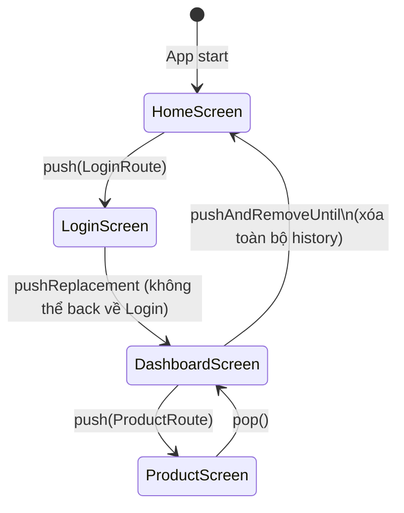

# Bài 6.1 — Navigator 1.0: Push & Pop

## Phần 1 — Khái Niệm & Mục Tiêu Bài Học

### Tại sao bài này quan trọng?

Flutter Navigator 1.0 dùng mô hình **stack** — giống call stack của program. Mọi màn hình mới được push lên đỉnh stack, back button pop khỏi đỉnh:

```
Initial:    [HomeScreen]
Push Login: [HomeScreen, LoginScreen]
Push Dashboard: [HomeScreen, LoginScreen, DashboardScreen]
Pop:        [HomeScreen, LoginScreen]
Pop:        [HomeScreen]
```

Navigator 1.0 đơn giản và đủ dùng cho 80% app. Navigator 2.0 (bài 6.4) cho web URL và deep linking.

### Bạn sẽ hiểu được sau bài này:
- `Navigator.push()`, `pop()`, `pushReplacement()`, `pushAndRemoveUntil()`
- `MaterialPageRoute` và `CupertinoPageRoute`
- `PopScope` (Flutter 3.12+) — intercept back button
- Login flow với `pushReplacement`

---

## Phần 2 — Cơ Chế Hoạt Động (Under the Hood)

### Navigator Stack Model



### Route Transition

```
MaterialPageRoute (Android):     Slide từ phải → trái
CupertinoPageRoute (iOS style):  Slide từ phải + hero transition
PageRouteBuilder (custom):       Định nghĩa transition bất kỳ
```

---

## Phần 3 — Code Mẫu Chuẩn Google

### 3.1 — Push và Pop cơ bản

```dart
class HomeScreen extends StatelessWidget {
  const HomeScreen({super.key});

  @override
  Widget build(BuildContext context) {
    return Scaffold(
      appBar: AppBar(title: const Text('Home')),
      body: Center(
        child: Column(
          mainAxisAlignment: MainAxisAlignment.center,
          children: [
            ElevatedButton(
              onPressed: () {
                // Push: thêm route mới lên đỉnh stack
                Navigator.push(
                  context,
                  MaterialPageRoute(
                    builder: (_) => const ProductListScreen(),
                    // settings: RouteSettings(name: '/products') — cho named route
                  ),
                );
              },
              child: const Text('Xem sản phẩm'),
            ),
            const SizedBox(height: 16),
            ElevatedButton(
              onPressed: () {
                // push với custom transition
                Navigator.push(
                  context,
                  PageRouteBuilder(
                    pageBuilder: (_, animation, __) => const SettingsScreen(),
                    transitionsBuilder: (_, animation, __, child) {
                      return FadeTransition(opacity: animation, child: child);
                    },
                    transitionDuration: const Duration(milliseconds: 300),
                  ),
                );
              },
              child: const Text('Settings (fade)'),
            ),
          ],
        ),
      ),
    );
  }
}

class ProductListScreen extends StatelessWidget {
  const ProductListScreen({super.key});

  @override
  Widget build(BuildContext context) {
    return Scaffold(
      appBar: AppBar(title: const Text('Sản phẩm')),
      // AppBar tự thêm back button khi có route phía trước
      body: Center(
        child: ElevatedButton(
          // pop: xóa route hiện tại khỏi đỉnh stack
          onPressed: () => Navigator.pop(context),
          child: const Text('Quay lại'),
        ),
      ),
    );
  }
}
```

### 3.2 — Login Flow với pushReplacement

```dart
class LoginScreen extends StatefulWidget {
  const LoginScreen({super.key});
  @override State<LoginScreen> createState() => _LoginScreenState();
}

class _LoginScreenState extends State<LoginScreen> {
  bool _isLoading = false;

  Future<void> _login(String email, String password) async {
    setState(() => _isLoading = true);
    try {
      await AuthService().signIn(email: email, password: password);

      if (!mounted) return;

      // pushReplacement: thay HomeScreen → DashboardScreen trong stack
      // Không thể back về LoginScreen sau khi login thành công
      Navigator.pushReplacement(
        context,
        MaterialPageRoute(builder: (_) => const DashboardScreen()),
      );
    } catch (e) {
      if (!mounted) return;
      setState(() => _isLoading = false);
      ScaffoldMessenger.of(context).showSnackBar(
        SnackBar(content: Text('Đăng nhập thất bại: $e')),
      );
    }
  }

  @override
  Widget build(BuildContext context) => Scaffold(/* ... */);
}

// pushAndRemoveUntil: push mới + xóa toàn bộ stack cũ
// Dùng sau logout hoặc onboarding complete
void _onLogout(BuildContext context) {
  Navigator.pushAndRemoveUntil(
    context,
    MaterialPageRoute(builder: (_) => const LoginScreen()),
    (route) => false, // Xóa tất cả route trong stack
  );
}

// pushNamedAndRemoveUntil với predicate
void _resetToHome(BuildContext context) {
  Navigator.pushAndRemoveUntil(
    context,
    MaterialPageRoute(builder: (_) => const HomeScreen()),
    (route) => route.isFirst, // Giữ lại route đầu tiên nếu có
  );
}
```

### 3.3 — PopScope — Intercept Back Button

```dart
// Flutter 3.12+: PopScope thay thế WillPopScope (deprecated)
class FormWithUnsavedChanges extends StatefulWidget {
  const FormWithUnsavedChanges({super.key});
  @override State<FormWithUnsavedChanges> createState() => _FormState();
}

class _FormState extends State<FormWithUnsavedChanges> {
  bool _hasUnsavedChanges = false;
  final _formKey = GlobalKey<FormState>();

  Future<bool> _confirmDiscard() async {
    if (!_hasUnsavedChanges) return true;

    final confirmed = await showDialog<bool>(
      context: context,
      builder: (_) => AlertDialog(
        title: const Text('Bỏ thay đổi?'),
        content: const Text('Bạn có thay đổi chưa lưu. Bỏ đi?'),
        actions: [
          TextButton(
            onPressed: () => Navigator.pop(context, false),
            child: const Text('Tiếp tục chỉnh sửa'),
          ),
          FilledButton(
            onPressed: () => Navigator.pop(context, true),
            child: const Text('Bỏ thay đổi'),
          ),
        ],
      ),
    );
    return confirmed ?? false;
  }

  @override
  Widget build(BuildContext context) {
    return PopScope(
      // canPop: false → ngăn back gesture/button mặc định
      canPop: !_hasUnsavedChanges,
      // onPopInvokedWithResult: được gọi khi có attempt pop
      onPopInvokedWithResult: (didPop, _) async {
        if (didPop) return; // Đã pop thành công

        // didPop = false → canPop = false → hỏi user
        final shouldPop = await _confirmDiscard();
        if (shouldPop && mounted) {
          Navigator.pop(context);
        }
      },
      child: Scaffold(
        appBar: AppBar(title: const Text('Form')),
        body: Form(
          key: _formKey,
          onChanged: () => setState(() => _hasUnsavedChanges = true),
          child: const Column(children: [
            TextFormField(decoration: InputDecoration(labelText: 'Tên')),
            TextFormField(decoration: InputDecoration(labelText: 'Email')),
          ]),
        ),
      ),
    );
  }
}
```

---

## Phần 4 — Lỗi Sai Phổ Biến & Best Practices

### ❌ Anti-pattern 1: Push trong build()

```dart
// ❌ Nguy hiểm: Vòng lặp redirect vô hạn
Widget build(BuildContext context) {
  if (!isLoggedIn) {
    Navigator.push(context, MaterialPageRoute(builder: (_) => LoginScreen()));
    // 💥 build chạy → push → rebuild → push lại...
  }
  return MainScreen();
}

// ✅ Đúng: Navigate trong initState hoặc callback
@override
void initState() {
  super.initState();
  WidgetsBinding.instance.addPostFrameCallback((_) {
    if (!isLoggedIn) {
      Navigator.pushReplacement(context, MaterialPageRoute(builder: (_) => LoginScreen()));
    }
  });
}
```

### ❌ Anti-pattern 2: context sau async trong navigation

```dart
// ❌ Nguy hiểm
Future<void> _login() async {
  await authService.login();
  Navigator.pushReplacement(context, ...); // Context có thể invalid!
}

// ✅ Đúng
Future<void> _login() async {
  await authService.login();
  if (!mounted) return;
  Navigator.pushReplacement(context, ...);
}
```

### ❌ Anti-pattern 3: WillPopScope (deprecated)

```dart
// ❌ Deprecated từ Flutter 3.12
WillPopScope(
  onWillPop: () async => false,
  child: ...,
)

// ✅ Đúng: PopScope
PopScope(
  canPop: false,
  onPopInvokedWithResult: (didPop, _) { /* handle */ },
  child: ...,
)
```

---

## Phần 5 — Bài Tập Củng Cố Tư Duy

### Challenge: Implement Login Flow

**Yêu cầu:**
1. `SplashScreen` → check logged in → navigate tương ứng
2. `LoginScreen` → login thành công → `HomeScreen` (pushReplacement)
3. `HomeScreen` có logout button → `LoginScreen` (pushAndRemoveUntil)
4. Form chỉnh sửa profile có `PopScope` ngăn back nếu có thay đổi chưa lưu

### Thử Thách Tư Duy & Thẩm Định Chuyên Sâu (Conceptual & Deep-Dive Check)

> **[Junior]** — nắm khái niệm | **[Middle]** — hiểu cơ chế | **[Senior]** — hiểu Flutter internals | **[Trace Code]** — đọc code và dự đoán output

---

#### Q1 [Junior] — "Sự khác biệt giữa `push`, `pushReplacement`, `pushAndRemoveUntil`?"

**Trả lời chuẩn:**

| Method | Stack sau khi gọi | Back button |
|---|---|---|
| `push(route)` | [..., current, new] | Quay về current |
| `pushReplacement(route)` | [..., new] | Quay về route trước current |
| `pushAndRemoveUntil(route, predicate)` | [routes thỏa predicate, new] | Tùy theo predicate |

```dart
// push — thêm vào stack
Navigator.push(context, MaterialPageRoute(builder: (_) => const DetailPage()));
// Stack: [Home, Detail]

// pushReplacement — replace route hiện tại
// Dùng cho: Login → Home (không muốn back về Login)
Navigator.pushReplacement(context, MaterialPageRoute(builder: (_) => const HomePage()));
// Stack: [Home] (Login bị xóa)

// pushAndRemoveUntil — xóa tất cả route cho đến khi gặp route thỏa điều kiện
// Dùng cho: Logout → Login (xóa toàn bộ stack)
Navigator.pushAndRemoveUntil(
  context,
  MaterialPageRoute(builder: (_) => const LoginPage()),
  (route) => false, // xóa TẤT CẢ routes
);
// Stack: [Login]

// pushAndRemoveUntil — giữ lại đến Home
Navigator.pushAndRemoveUntil(
  context,
  MaterialPageRoute(builder: (_) => const SuccessPage()),
  ModalRoute.withName('/home'), // giữ Home và trên đó
);
```

---

#### Q2 [Junior] — "`PopScope` vs `WillPopScope` — khác biệt và cách dùng?"

**Trả lời chuẩn:**

`WillPopScope` deprecated từ Flutter 3.12 vì không tương thích với predictive back gesture (Android 14+).

| | `WillPopScope` (deprecated) | `PopScope` (Flutter 3.12+) |
|---|---|---|
| **Callback** | `Future<bool> onWillPop()` | `void onPopInvokedWithResult(didPop, result)` |
| **Control pop** | `return false` để cancel | `canPop: false` để disable |
| **Predictive back** | Không support | Support đầy đủ |

```dart
// ✅ PopScope — cách mới
PopScope(
  canPop: false, // disable pop (back button bị disable)
  onPopInvokedWithResult: (didPop, result) {
    if (didPop) return; // đã pop rồi, không cần làm gì
    // Custom logic khi user cố pop nhưng bị block
    showDialog(context: context, builder: (_) => const ExitDialog());
  },
  child: const MyPage(),
)

// Cho phép pop conditionally:
PopScope(
  canPop: _formHasNoChanges, // true = allow pop, false = block
  onPopInvokedWithResult: (didPop, _) {
    if (!didPop) _showUnsavedChangesDialog();
  },
  child: const MyForm(),
)
```

---

#### Q3 [Middle] — "Khi nào dùng `PageRouteBuilder`? Cách implement custom transition?"

**Trả lời chuẩn:**

`PageRouteBuilder` cho phép custom hoàn toàn transition animation giữa routes:

```dart
// Fade transition
Navigator.push(
  context,
  PageRouteBuilder(
    pageBuilder: (ctx, animation, secondaryAnimation) => const DetailPage(),
    transitionsBuilder: (ctx, animation, secondaryAnimation, child) {
      return FadeTransition(
        opacity: animation, // 0.0 → 1.0 khi push
        child: child,
      );
    },
    transitionDuration: const Duration(milliseconds: 300),
  ),
);

// Slide from bottom
transitionsBuilder: (ctx, animation, secondaryAnimation, child) {
  final tween = Tween<Offset>(begin: const Offset(0, 1), end: Offset.zero)
      .chain(CurveTween(curve: Curves.easeOut));
  return SlideTransition(
    position: animation.drive(tween),
    child: child,
  );
},

// Scale + fade
transitionsBuilder: (ctx, anim, secAnim, child) {
  return ScaleTransition(
    scale: anim.drive(CurveTween(curve: Curves.elasticOut)),
    child: FadeTransition(opacity: anim, child: child),
  );
},
```

**`animation`:** 0.0 → 1.0 khi route enter (push). 1.0 → 0.0 khi route exit (pop).
**`secondaryAnimation`:** 1.0 → 0.0 khi một route mới được push ON TOP của route này.

---

#### Q4 [Senior] — "Navigator stack là gì ở tầng implementation? `Overlay` và `OverlayEntry` liên quan thế nào?"

**Trả lời chuẩn:**

`Navigator` không maintain một "stack" theo nghĩa đen — nó dùng `Overlay` để hiển thị routes:

```
Navigator widget
  ↓ holds
  _RouteEntry list (= logical "stack")
  ↓ renders through
  Overlay widget              ← special Stack-like widget
    OverlayEntry (route /home)
    OverlayEntry (route /profile)  ← pushed, rendered on top
```

**Khi `Navigator.push()` được gọi:**
1. Navigator tạo `_RouteEntry` với route mới
2. Route build widget thông qua `buildPage()`
3. `OverlayEntry` được tạo với route's page
4. `Overlay.insert(overlayEntry)` — route hiện trên screen
5. Transition animation chạy (`_ModalRoute._animation`)

**Khi `Navigator.pop()` được gọi:**
1. Top `_RouteEntry` được marked as `popping`
2. Reverse animation chạy
3. Sau animation hoàn thành: `overlayEntry.remove()` — route biến mất
4. State của route bị `dispose()`

**Tại sao Overlay thay vì Stack:** Overlay cho phép insert entries từ bất kỳ đâu (Dialog, SnackBar, Tooltip) mà không cần thay đổi widget tree structure.

---

#### Q5 [Middle] — "`Navigator.of(context, rootNavigator: true)` vs mặc định — khi nào cần?"

**Trả lời chuẩn:**

```dart
// Mặc định: tìm Navigator gần nhất trong tree
Navigator.of(context)

// rootNavigator: true: bỏ qua nested navigators, lấy root Navigator
Navigator.of(context, rootNavigator: true)
```

**Khi cần `rootNavigator: true`:**

```dart
// Scenario: App có nested Navigator trong Tab
MaterialApp (root Navigator)
  └─ Scaffold
      └─ BottomNavigationBar
          └─ TabView
              └─ TabNavigator (nested Navigator)
                  └─ TabDetailPage

// ❌ Vấn đề: Dialog show trong nested Navigator → Dialog cũng nằm trong Tab
showDialog(
  context: context, // context của TabDetailPage
  builder: (_) => const AlertDialog(...),
);
// Dialog bị clip trong Tab, không phủ toàn màn hình!

// ✅ Fix: dùng rootNavigator để show Dialog ở root level
showDialog(
  context: context,
  useRootNavigator: true, // Dialog phủ toàn màn hình kể cả TabBar
  builder: (_) => const AlertDialog(...),
);
```

---

#### Q6 [Middle] — "`PopScope.canPop = false` — Flutter xử lý back gesture thế nào trên Android/iOS?"

**Trả lời chuẩn:**

**Android predictive back gesture (Android 14+):**
- Khi `canPop = true`: gesture preview animation hiện — user thấy màn hình trước khi pop
- Khi `canPop = false`: gesture bị consumed nhưng không trigger pop — `onPopInvokedWithResult(false, null)` được gọi

**iOS swipe-to-back gesture:**
- Khi `canPop = true`: swipe từ left edge → slide transition ngược → pop
- Khi `canPop = false`: swipe gesture bị disable — không có animation preview

**Cơ chế Flutter:**
```
User gesture → iOS/Android gesture recognizer
  → BackGestureRecognizer (Flutter)
    → check: route.popGestureEnabled
      → route.popGestureEnabled = canPop && !route.hasScopedWillPopCallback
        → true: begin pop gesture
        → false: consume gesture, gọi onPopInvokedWithResult(false, null)
```

**Điểm quan trọng:** `PopScope` wrap child và override `popGestureEnabled` của route hiện tại — không phải custom GestureDetector.

---

#### Q7 [Trace Code] — "`pushAndRemoveUntil` với predicate: xác định stack còn lại"

```dart
// Initial stack: [SplashPage, LoginPage, HomePage, ProfilePage, SettingsPage]
// Đang ở SettingsPage, thực thi:

// Case A:
Navigator.pushAndRemoveUntil(
  context,
  MaterialPageRoute(builder: (_) => const NewPage()),
  (route) => route.isFirst,
);

// Case B:
Navigator.pushAndRemoveUntil(
  context,
  MaterialPageRoute(builder: (_) => const NewPage()),
  ModalRoute.withName('/home'),
);

// Case C:
Navigator.pushAndRemoveUntil(
  context,
  MaterialPageRoute(builder: (_) => const NewPage()),
  (route) => false,
);
```

**Stack sau mỗi case:**

**Case A — `(route) => route.isFirst`:** Giữ lại route đầu tiên (SplashPage), xóa phần còn lại, thêm NewPage
```
Stack: [SplashPage, NewPage]
```

**Case B — `ModalRoute.withName('/home')`:** Xóa từ top xuống cho đến khi gặp route tên `/home` (inclusive nếu không phải `/home`). Giữ lại `/home` và mọi thứ trước nó:
```
Stack: [SplashPage, LoginPage, HomePage, NewPage]
// (Xóa ProfilePage, SettingsPage; giữ HomePage vì tên khớp)
```

**Case C — `(route) => false`:** Predicate luôn false → xóa TẤT CẢ routes cũ:
```
Stack: [NewPage]
// Xóa SplashPage, LoginPage, HomePage, ProfilePage, SettingsPage
// Không thể back — NewPage là route duy nhất
```
