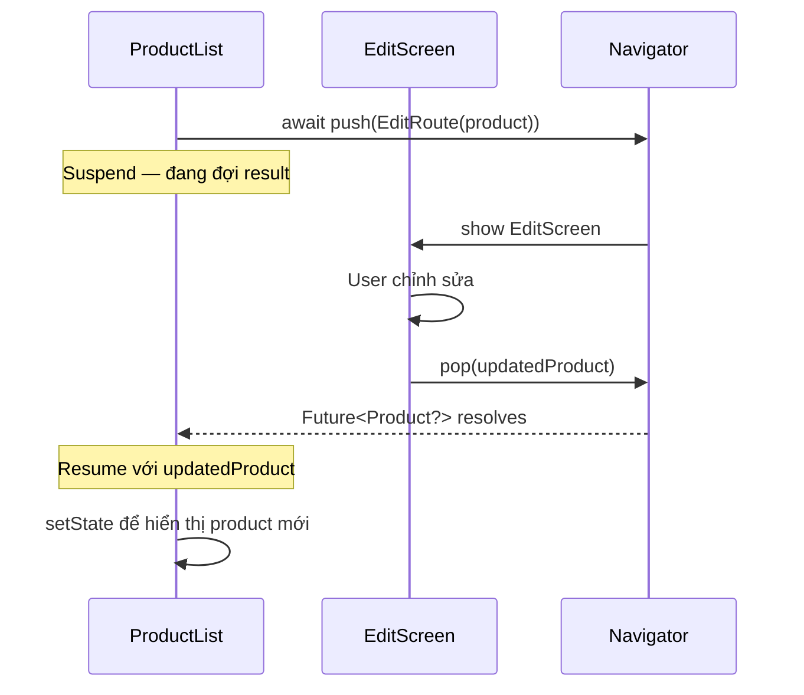

# Bài 6.2 — Truyền & Nhận Data Qua Navigator

## Phần 1 — Khái Niệm & Mục Tiêu Bài Học

### Tại sao bài này quan trọng?

Navigation không chỉ là chuyển màn hình — thường cần truyền data *đến* màn hình mới, và nhận kết quả *trở về* màn hình cũ:

```
List → Detail: Truyền product ID
Detail → Edit: Truyền product object
Edit → Detail: Trả về updated product
Detail → List: Không return (chỉ pop)
```

Flutter cung cấp cơ chế type-safe để làm điều này mà không cần global state.

### Bạn sẽ hiểu được sau bài này:
- Truyền data qua constructor Route (type-safe)
- `Navigator.pop(result)` và `await Navigator.push()` — nhận kết quả
- `RouteSettings.arguments` — truyền qua named route
- Pattern hoàn chỉnh: List → Detail → Edit → trả kết quả về

---

## Phần 2 — Cơ Chế Hoạt Động (Under the Hood)

### Push-Pop Result Flow



---

## Phần 3 — Code Mẫu Chuẩn Google

### 3.1 — Truyền data qua constructor

```dart
// Type-safe: compiler check args khi navigate
class ProductDetailScreen extends StatelessWidget {
  // Product được truyền qua constructor — type safe!
  final Product product;
  const ProductDetailScreen({super.key, required this.product});

  @override
  Widget build(BuildContext context) {
    return Scaffold(
      appBar: AppBar(title: Text(product.name)),
      body: Column(
        children: [
          Image.network(product.imageUrl),
          Text('${product.price}đ'),
          Text(product.description),
        ],
      ),
    );
  }
}

// Navigate với data:
void _onProductTap(Product product) {
  Navigator.push(
    context,
    MaterialPageRoute(
      builder: (_) => ProductDetailScreen(product: product), // Type-safe
    ),
  );
}
```

### 3.2 — Nhận kết quả với `await push()`

```dart
class ProductListScreen extends StatefulWidget {
  const ProductListScreen({super.key});
  @override State<ProductListScreen> createState() => _ProductListState();
}

class _ProductListState extends State<ProductListScreen> {
  List<Product> _products = [...]; // Initial data

  Future<void> _editProduct(int index) async {
    final product = _products[index];

    // push trả về Future<T?> — có thể null nếu user back
    final updatedProduct = await Navigator.push<Product>(
      context,
      MaterialPageRoute(
        builder: (_) => EditProductScreen(product: product),
      ),
    );

    // null check: user có thể đã back mà không save
    if (updatedProduct == null) return;

    // mounted check sau await
    if (!mounted) return;

    setState(() {
      _products[index] = updatedProduct;
    });
  }

  Future<void> _addProduct() async {
    final newProduct = await Navigator.push<Product>(
      context,
      MaterialPageRoute(
        builder: (_) => const CreateProductScreen(),
      ),
    );

    if (newProduct == null || !mounted) return;

    setState(() => _products.add(newProduct));
  }

  @override
  Widget build(BuildContext context) {
    return Scaffold(
      appBar: AppBar(
        title: const Text('Sản phẩm'),
        actions: [
          IconButton(icon: const Icon(Icons.add), onPressed: _addProduct),
        ],
      ),
      body: ListView.builder(
        itemCount: _products.length,
        itemBuilder: (_, i) => ListTile(
          title: Text(_products[i].name),
          onTap: () => _editProduct(i),
        ),
      ),
    );
  }
}

// EditProductScreen: pop với updated product
class EditProductScreen extends StatefulWidget {
  final Product product;
  const EditProductScreen({super.key, required this.product});
  @override State<EditProductScreen> createState() => _EditProductState();
}

class _EditProductState extends State<EditProductScreen> {
  late final TextEditingController _nameController;
  late final TextEditingController _priceController;

  @override
  void initState() {
    super.initState();
    _nameController = TextEditingController(text: widget.product.name);
    _priceController = TextEditingController(
      text: widget.product.price.toString(),
    );
  }

  @override
  void dispose() {
    _nameController.dispose();
    _priceController.dispose();
    super.dispose();
  }

  void _save() {
    final name = _nameController.text.trim();
    final price = double.tryParse(_priceController.text);

    if (name.isEmpty || price == null) return;

    // Pop với result — trả về Product đã chỉnh sửa
    final updated = widget.product.copyWith(name: name, price: price);
    Navigator.pop(context, updated); // Flutter resolves Future với updated
  }

  @override
  Widget build(BuildContext context) {
    return Scaffold(
      appBar: AppBar(
        title: const Text('Chỉnh sửa'),
        actions: [
          TextButton(
            onPressed: _save,
            child: const Text('Lưu', style: TextStyle(color: Colors.white)),
          ),
        ],
      ),
      body: Padding(
        padding: const EdgeInsets.all(16),
        child: Column(
          children: [
            TextField(
              controller: _nameController,
              decoration: const InputDecoration(labelText: 'Tên sản phẩm'),
            ),
            const SizedBox(height: 16),
            TextField(
              controller: _priceController,
              decoration: const InputDecoration(labelText: 'Giá'),
              keyboardType: const TextInputType.numberWithOptions(decimal: true),
            ),
          ],
        ),
      ),
    );
  }
}
```

### 3.3 — RouteSettings.arguments cho Named Routes

```dart
// Named route với arguments (bài 6.3 sẽ đi sâu hơn)
// Cách tiếp cận kém type-safe hơn constructor — nhưng flexible cho deep linking

// Declare route
MaterialApp(
  onGenerateRoute: (settings) {
    if (settings.name == '/product-detail') {
      final product = settings.arguments as Product?;
      if (product == null) return null; // Invalid argument
      return MaterialPageRoute(
        builder: (_) => ProductDetailScreen(product: product),
        settings: settings,
      );
    }
    return null;
  },
)

// Navigate với arguments:
Navigator.pushNamed(
  context,
  '/product-detail',
  arguments: product, // Passed qua RouteSettings.arguments
);

// Trong screen:
class ProductDetailScreen extends StatelessWidget {
  const ProductDetailScreen({super.key, required this.product});
  final Product product;
  // ...

  // Hoặc lấy từ route settings trong build:
  static Route<void> route(Product product) => MaterialPageRoute(
    builder: (_) => ProductDetailScreen(product: product),
    settings: RouteSettings(name: '/product-detail', arguments: product),
  );
}
```

---

## Phần 4 — Lỗi Sai Phổ Biến & Best Practices

### ❌ Anti-pattern 1: Không check null result

```dart
// ❌ Sai: Crash nếu user back mà không save
final result = await Navigator.push<Product>(...);
setState(() => _product = result!); // 💥 Nếu result null

// ✅ Đúng: Xử lý null case
final result = await Navigator.push<Product>(...);
if (result == null) return; // User back, không làm gì
setState(() => _product = result);
```

### ❌ Anti-pattern 2: Quên mounted check

```dart
// ❌ Sai: setState sau await mà không check mounted
Future<void> _openEdit() async {
  final result = await Navigator.push<Product>(...);
  setState(() => _product = result ?? _product); // 💥 Nếu widget disposed
}

// ✅ Đúng
Future<void> _openEdit() async {
  final result = await Navigator.push<Product>(...);
  if (!mounted) return;
  setState(() => _product = result ?? _product);
}
```

### ❌ Anti-pattern 3: Global state cho data chỉ cần local

```dart
// ❌ Overkill: Dùng Provider/BLoC chỉ để truyền data sang một màn hình
// Và nhận kết quả về

// ✅ Đúng: await push + pop(result) đủ cho trường hợp này
final result = await Navigator.push<EditResult>(
  context,
  MaterialPageRoute(builder: (_) => EditScreen(item: item)),
);
```

---

## Phần 5 — Bài Tập Củng Cố Tư Duy

### Challenge: Detail → Edit → Trả Kết Quả Về List

**Flow:**
```
ProductList → tap item → ProductDetail → tap edit → EditProduct
                                                         ↓
ProductList ← update list      ProductDetail ← updated product
```

**Yêu cầu:**
1. `ProductList`: list sản phẩm, tap → `ProductDetail`
2. `ProductDetail`: xem chi tiết, có nút "Chỉnh sửa" → `EditProduct`
3. `EditProduct`: form chỉnh sửa, save → pop(updatedProduct)
4. `ProductDetail` nhận updated product → pop(updatedProduct) lên List
5. `ProductList` update item trong list

### Thử Thách Tư Duy & Thẩm Định Chuyên Sâu (Conceptual & Deep-Dive Check)

> **[Junior]** — nắm khái niệm | **[Middle]** — hiểu cơ chế | **[Senior]** — hiểu Flutter internals | **[Trace Code]** — đọc code và dự đoán output

---

#### Q1 [Junior] — "Tại sao dùng constructor để truyền data tốt hơn global state?"

**Trả lời chuẩn:**

Truyền data qua constructor (dependency injection) có 3 lợi thế chính:

**1. Type safety compile-time:**
```dart
// Constructor — compile-time safe
Navigator.push(context, MaterialPageRoute(
  builder: (_) => ProductDetailPage(productId: 'p123'), // ← type-checked
));

// Global state — runtime error nếu quên set
globalState.productId = 'p123'; // có thể quên
Navigator.push(context, MaterialPageRoute(builder: (_) => const ProductDetailPage()));
// ProductDetailPage đọc globalState.productId — null nếu quên set!
```

**2. Explicit dependency:** Constructor cho biết rõ ràng screen cần data gì. `ProductDetailPage(productId: 'p123')` → ai đọc code biết ngay screen cần `productId`.

**3. Lifecycle clean:** Sau navigation về, data không còn tồn tại trong memory (garbage collected). Global state phải tự cleanup → dễ bug (stale data từ lần navigate trước).

---

#### Q2 [Junior] — "Làm thế nào nhận kết quả từ màn hình con? Cách dùng `pop` với result?"

**Trả lời chuẩn:**

```dart
// Màn hình cha — await Future từ Navigator.push
Future<void> _selectColor() async {
  final Color? selectedColor = await Navigator.push<Color>(
    context,
    MaterialPageRoute(builder: (_) => const ColorPickerPage()),
  );
  
  // Future complete khi ColorPickerPage gọi pop
  if (selectedColor != null && mounted) {
    setState(() => _selectedColor = selectedColor);
  }
}

// Màn hình con — truyền result khi pop
class ColorPickerPage extends StatelessWidget {
  @override
  Widget build(BuildContext context) {
    return Scaffold(
      body: ListView(
        children: Colors.primaries.map((color) =>
          GestureDetector(
            onTap: () => Navigator.pop(context, color), // pop với result
            child: Container(height: 50, color: color),
          ),
        ).toList(),
      ),
    );
  }
}
```

**Nếu user nhấn back (không chọn):** `Navigator.pop(context)` không có result → Future trả về `null` → `selectedColor = null` → null check tránh crash.

---

#### Q3 [Middle] — "Khi nào `RouteSettings.arguments` tốt hơn constructor injection?"

**Trả lời chuẩn:**

| | Constructor injection | `RouteSettings.arguments` |
|---|---|---|
| **Type safety** | Compile-time | Runtime (cần cast) |
| **Deep link** | Không dùng được | Dùng được |
| **Named routes** | Không dùng được | Dùng được |
| **Code clarity** | Rõ hơn | Ít rõ hơn |

**Khi dùng arguments:**

```dart
// Deep link: app nhận URL /product/123 → navigate với args từ URL
onGenerateRoute: (settings) {
  if (settings.name == '/product') {
    final args = settings.arguments as Map<String, String>;
    return MaterialPageRoute(
      builder: (_) => ProductPage(id: args['id']!),
    );
  }
},

// Navigate với named route + arguments
Navigator.pushNamed(
  context,
  '/product',
  arguments: {'id': '123', 'category': 'electronics'},
);

// Nhận arguments trong page
@override
Widget build(BuildContext context) {
  final args = ModalRoute.of(context)!.settings.arguments as Map<String, String>;
  return Text(args['id']!);
}
```

**Nhược điểm:** `arguments` là `Object?` → phải cast thủ công, không có compile-time check → dễ crash nếu cast sai type.

---

#### Q4 [Senior] — "`Navigator.push<T>()` trả về `Future<T?>` — Future này complete khi nào? Ai resolve nó?"

**Trả lời chuẩn:**

`Future<T?>` được tạo bởi `ModalRoute` và complete khi route bị pop:

```dart
// Navigator source (simplified)
Future<T?> push<T extends Object?>(Route<T> route) {
  // Route tạo Completer internally
  // _PopupRoute, ModalRoute đều có completer
  _history.add(_RouteEntry(route, initialState: _RouteLifecycle.push));
  route.install(); // setup overlay entry
  return route.popped; // Future từ route's completer
}

// ModalRoute.pop(T? result) — được gọi khi Navigator.pop()
void pop([T? result]) {
  _popCompleter.complete(result); // resolve Future với result
}
```

**Timeline:**
```
Navigator.push<Color>(...)
  ↓ returns Future<Color?>
  ↓ Future pending (route đang hiện)
  
User chọn màu → Navigator.pop(context, Colors.red)
  ↓ ModalRoute._popCompleter.complete(Colors.red)
  ↓ Pop animation chạy
  ↓ Sau animation: Future<Color?> complete với Colors.red
  
await Navigator.push<Color>(...) ← unblocks với Colors.red
```

**Quan trọng:** Future chỉ complete sau khi **animation pop hoàn thành** — không phải ngay khi `Navigator.pop()` được gọi. Điều này đảm bảo màn hình cha không rebuild trước khi animation kết thúc.

---

#### Q5 [Middle] — "Type safety khi dùng `RouteSettings.arguments` vs constructor injection — trade-off?"

**Trả lời chuẩn:**

**Constructor injection — compile-time safe:**
```dart
// Dart compiler verify tại compile time
ProductPage(productId: 123) // ← Error nếu productId là String nhưng truyền int
ProductPage(productId: 'abc') // ✅ type-checked

// Rõ ràng dependencies
class ProductPage extends StatelessWidget {
  final String productId; // ← rõ ràng page cần gì
  final String? category; // ← optional
}
```

**`RouteSettings.arguments` — runtime:**
```dart
// Không có compile-time check
Navigator.pushNamed(context, '/product', arguments: 123); // int thay vì String
// Compile OK → runtime crash khi cast

// Trong ProductPage:
final args = ModalRoute.of(context)!.settings.arguments;
final productId = args as String; // ← crash nếu args là int!

// Safer cast:
final productId = args is String ? args : args.toString(); // verbose
```

**Hybrid pattern — best of both worlds:**
```dart
class ProductPageArgs {
  final String productId;
  final String? category;
  const ProductPageArgs({required this.productId, this.category});
}

// Navigate:
Navigator.pushNamed(context, '/product',
  arguments: const ProductPageArgs(productId: 'p123'));

// Trong page:
final args = ModalRoute.of(context)!.settings.arguments as ProductPageArgs;
// Vẫn cần cast nhưng type-safe hơn vì là typed class
```

---

#### Q6 [Middle] — "Tại sao không nên dùng global variable để pass data giữa screens?"

**Trả lời chuẩn:**

Global variables tạo **implicit hidden dependencies** — code trở nên khó understand và debug:

**3 vấn đề chính:**

**1. Stale data:** Nếu quên reset global variable sau navigation, screen tiếp theo nhận data cũ từ lần navigate trước.

**2. Testing không thể isolate:** Muốn test `ProductDetailPage` standalone → phải setup global state trước → tests phụ thuộc lẫn nhau → flaky.

**3. Race condition với async:** 
```dart
// Screen A set global state
globalProductId = 'p123';
// Async delay...
await someOperation(); 
// Screen B cũng set global state trong khi A đang await
globalProductId = 'p456'; // ← race condition!
// A continues với global 'p456' thay vì 'p123'!
Navigator.push(...); // → navigate với wrong data
```

**Acceptable use cases:** Truly global config (theme preference, locale) — không phải per-navigation data.

---

#### Q7 [Trace Code] — "Pop với result qua nhiều screens: xác định Future value"

```dart
// Screen A push Screen B, Screen B push Screen C
// Stack: [A, B, C]

// Trong Screen C, user nhấn button:
onPressed: () => Navigator.pop(context, 'result_from_C'),

// Trong Screen B, awaiting push của C:
Future<void> _goToC() async {
  final result = await Navigator.push<String>(
    context,
    MaterialPageRoute(builder: (_) => const ScreenC()),
  );
  print('B received: $result');
  // B quyết định có truyền result lên A không
  if (result != null) {
    Navigator.pop(context, 'B_processed_$result');
  }
}

// Trong Screen A, awaiting push của B:
Future<void> _goToB() async {
  final result = await Navigator.push<String>(
    context,
    MaterialPageRoute(builder: (_) => const ScreenB()),
  );
  print('A received: $result');
}
```

**Output khi C pop:**

```
B received: result_from_C
A received: B_processed_result_from_C
```

**Luồng:**
1. C gọi `Navigator.pop(context, 'result_from_C')` → B's Future complete với `'result_from_C'`
2. B print `'B received: result_from_C'`
3. B gọi `Navigator.pop(context, 'B_processed_result_from_C')` → A's Future complete
4. A print `'A received: B_processed_result_from_C'`

**Nếu user nhấn back button trong B (không pop programmatically):**
```
A received: null
```
Vì back button gọi `Navigator.pop(context)` không có result → A nhận `null`.
