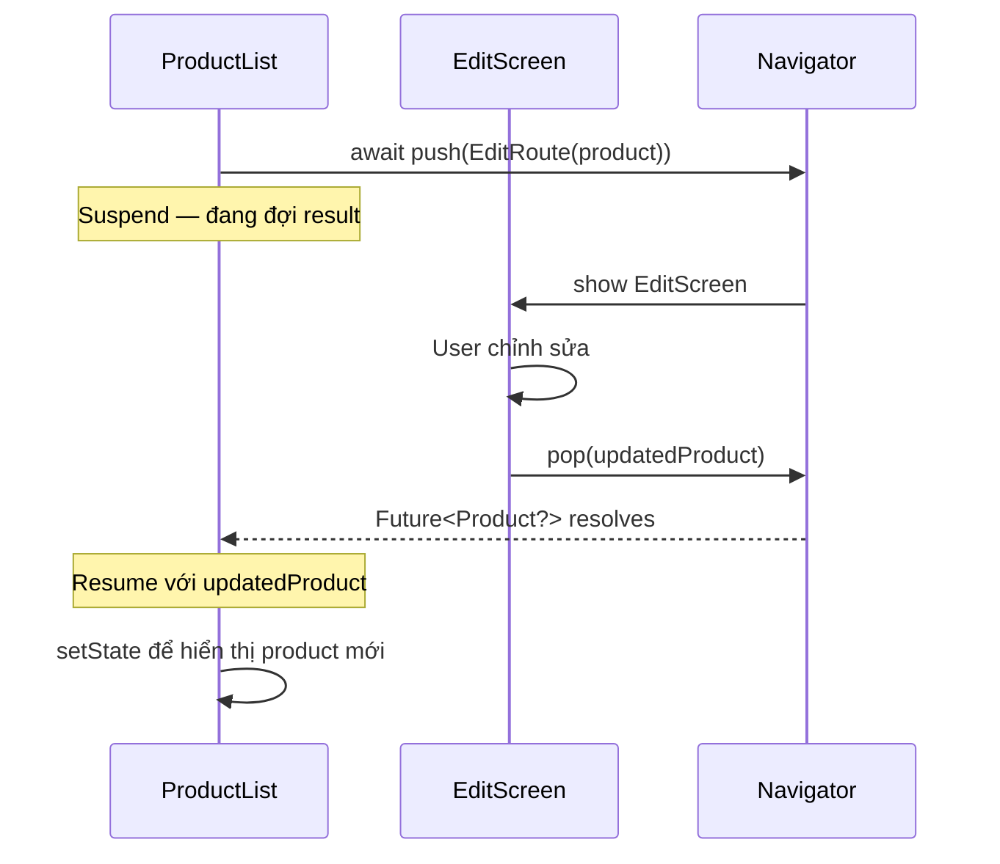

# Bài 6.2 — Truyền & Nhận Data Qua Navigator

## Phần 1 — Khái Niệm & Mục Tiêu Bài Học

### Tại sao bài này quan trọng?

Navigation không chỉ là chuyển màn hình — thường cần truyền data *đến* màn hình mới, và nhận kết quả *trở về* màn hình cũ:

```
List → Detail: Truyền product ID
Detail → Edit: Truyền product object
Edit → Detail: Trả về updated product
Detail → List: Không return (chỉ pop)
```

Flutter cung cấp cơ chế type-safe để làm điều này mà không cần global state.

### Bạn sẽ hiểu được sau bài này:
- Truyền data qua constructor Route (type-safe)
- `Navigator.pop(result)` và `await Navigator.push()` — nhận kết quả
- `RouteSettings.arguments` — truyền qua named route
- Pattern hoàn chỉnh: List → Detail → Edit → trả kết quả về

---

## Phần 2 — Cơ Chế Hoạt Động (Under the Hood)

### Push-Pop Result Flow



---

## Phần 3 — Code Mẫu Chuẩn Google

### 3.1 — Truyền data qua constructor

```dart
// Type-safe: compiler check args khi navigate
class ProductDetailScreen extends StatelessWidget {
  // Product được truyền qua constructor — type safe!
  final Product product;
  const ProductDetailScreen({super.key, required this.product});

  @override
  Widget build(BuildContext context) {
    return Scaffold(
      appBar: AppBar(title: Text(product.name)),
      body: Column(
        children: [
          Image.network(product.imageUrl),
          Text('${product.price}đ'),
          Text(product.description),
        ],
      ),
    );
  }
}

// Navigate với data:
void _onProductTap(Product product) {
  Navigator.push(
    context,
    MaterialPageRoute(
      builder: (_) => ProductDetailScreen(product: product), // Type-safe
    ),
  );
}
```

### 3.2 — Nhận kết quả với `await push()`

```dart
class ProductListScreen extends StatefulWidget {
  const ProductListScreen({super.key});
  @override State<ProductListScreen> createState() => _ProductListState();
}

class _ProductListState extends State<ProductListScreen> {
  List<Product> _products = [...]; // Initial data

  Future<void> _editProduct(int index) async {
    final product = _products[index];

    // push trả về Future<T?> — có thể null nếu user back
    final updatedProduct = await Navigator.push<Product>(
      context,
      MaterialPageRoute(
        builder: (_) => EditProductScreen(product: product),
      ),
    );

    // null check: user có thể đã back mà không save
    if (updatedProduct == null) return;

    // mounted check sau await
    if (!mounted) return;

    setState(() {
      _products[index] = updatedProduct;
    });
  }

  Future<void> _addProduct() async {
    final newProduct = await Navigator.push<Product>(
      context,
      MaterialPageRoute(
        builder: (_) => const CreateProductScreen(),
      ),
    );

    if (newProduct == null || !mounted) return;

    setState(() => _products.add(newProduct));
  }

  @override
  Widget build(BuildContext context) {
    return Scaffold(
      appBar: AppBar(
        title: const Text('Sản phẩm'),
        actions: [
          IconButton(icon: const Icon(Icons.add), onPressed: _addProduct),
        ],
      ),
      body: ListView.builder(
        itemCount: _products.length,
        itemBuilder: (_, i) => ListTile(
          title: Text(_products[i].name),
          onTap: () => _editProduct(i),
        ),
      ),
    );
  }
}

// EditProductScreen: pop với updated product
class EditProductScreen extends StatefulWidget {
  final Product product;
  const EditProductScreen({super.key, required this.product});
  @override State<EditProductScreen> createState() => _EditProductState();
}

class _EditProductState extends State<EditProductScreen> {
  late final TextEditingController _nameController;
  late final TextEditingController _priceController;

  @override
  void initState() {
    super.initState();
    _nameController = TextEditingController(text: widget.product.name);
    _priceController = TextEditingController(
      text: widget.product.price.toString(),
    );
  }

  @override
  void dispose() {
    _nameController.dispose();
    _priceController.dispose();
    super.dispose();
  }

  void _save() {
    final name = _nameController.text.trim();
    final price = double.tryParse(_priceController.text);

    if (name.isEmpty || price == null) return;

    // Pop với result — trả về Product đã chỉnh sửa
    final updated = widget.product.copyWith(name: name, price: price);
    Navigator.pop(context, updated); // Flutter resolves Future với updated
  }

  @override
  Widget build(BuildContext context) {
    return Scaffold(
      appBar: AppBar(
        title: const Text('Chỉnh sửa'),
        actions: [
          TextButton(
            onPressed: _save,
            child: const Text('Lưu', style: TextStyle(color: Colors.white)),
          ),
        ],
      ),
      body: Padding(
        padding: const EdgeInsets.all(16),
        child: Column(
          children: [
            TextField(
              controller: _nameController,
              decoration: const InputDecoration(labelText: 'Tên sản phẩm'),
            ),
            const SizedBox(height: 16),
            TextField(
              controller: _priceController,
              decoration: const InputDecoration(labelText: 'Giá'),
              keyboardType: const TextInputType.numberWithOptions(decimal: true),
            ),
          ],
        ),
      ),
    );
  }
}
```

### 3.3 — RouteSettings.arguments cho Named Routes

```dart
// Named route với arguments (bài 6.3 sẽ đi sâu hơn)
// Cách tiếp cận kém type-safe hơn constructor — nhưng flexible cho deep linking

// Declare route
MaterialApp(
  onGenerateRoute: (settings) {
    if (settings.name == '/product-detail') {
      final product = settings.arguments as Product?;
      if (product == null) return null; // Invalid argument
      return MaterialPageRoute(
        builder: (_) => ProductDetailScreen(product: product),
        settings: settings,
      );
    }
    return null;
  },
)

// Navigate với arguments:
Navigator.pushNamed(
  context,
  '/product-detail',
  arguments: product, // Passed qua RouteSettings.arguments
);

// Trong screen:
class ProductDetailScreen extends StatelessWidget {
  const ProductDetailScreen({super.key, required this.product});
  final Product product;
  // ...

  // Hoặc lấy từ route settings trong build:
  static Route<void> route(Product product) => MaterialPageRoute(
    builder: (_) => ProductDetailScreen(product: product),
    settings: RouteSettings(name: '/product-detail', arguments: product),
  );
}
```

---

## Phần 4 — Lỗi Sai Phổ Biến & Best Practices

### ❌ Anti-pattern 1: Không check null result

```dart
// ❌ Sai: Crash nếu user back mà không save
final result = await Navigator.push<Product>(...);
setState(() => _product = result!); // 💥 Nếu result null

// ✅ Đúng: Xử lý null case
final result = await Navigator.push<Product>(...);
if (result == null) return; // User back, không làm gì
setState(() => _product = result);
```

### ❌ Anti-pattern 2: Quên mounted check

```dart
// ❌ Sai: setState sau await mà không check mounted
Future<void> _openEdit() async {
  final result = await Navigator.push<Product>(...);
  setState(() => _product = result ?? _product); // 💥 Nếu widget disposed
}

// ✅ Đúng
Future<void> _openEdit() async {
  final result = await Navigator.push<Product>(...);
  if (!mounted) return;
  setState(() => _product = result ?? _product);
}
```

### ❌ Anti-pattern 3: Global state cho data chỉ cần local

```dart
// ❌ Overkill: Dùng Provider/BLoC chỉ để truyền data sang một màn hình
// Và nhận kết quả về

// ✅ Đúng: await push + pop(result) đủ cho trường hợp này
final result = await Navigator.push<EditResult>(
  context,
  MaterialPageRoute(builder: (_) => EditScreen(item: item)),
);
```

---

## Phần 5 — Bài Tập Củng Cố Tư Duy

### Challenge: Detail → Edit → Trả Kết Quả Về List

**Flow:**
```
ProductList → tap item → ProductDetail → tap edit → EditProduct
                                                         ↓
ProductList ← update list      ProductDetail ← updated product
```

**Yêu cầu:**
1. `ProductList`: list sản phẩm, tap → `ProductDetail`
2. `ProductDetail`: xem chi tiết, có nút "Chỉnh sửa" → `EditProduct`
3. `EditProduct`: form chỉnh sửa, save → pop(updatedProduct)
4. `ProductDetail` nhận updated product → pop(updatedProduct) lên List
5. `ProductList` update item trong list

### Câu hỏi phỏng vấn liên quan:

1. **"Tại sao dùng constructor để truyền data tốt hơn global state?"**
   - Type-safe compile-time
   - Explicit dependency — rõ ràng screen cần gì
   - Không cần cleanup state sau navigation

2. **"Làm thế nào nhận kết quả từ màn hình con?"**
   - `await Navigator.push<Result>(...)` trả về Future
   - Màn hình con gọi `Navigator.pop(context, result)` để resolve Future

3. **"Khi nào `RouteSettings.arguments` tốt hơn constructor?"**
   - Deep link: URL → extract args → navigate → không có object để truyền
   - Named routes với args dynamic (không biết type trước)
