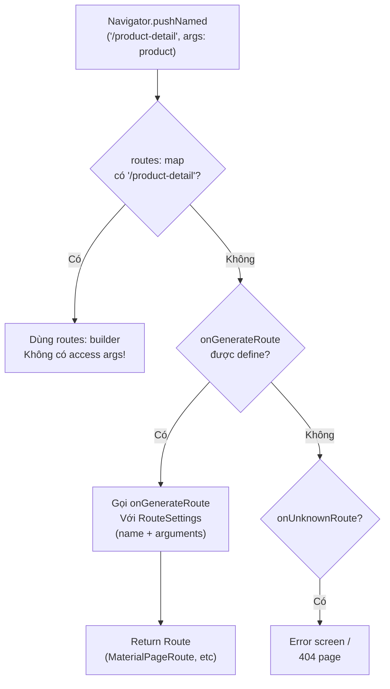

# Bài 6.3 — Named Routes & OnGenerateRoute

## Phần 1 — Khái Niệm & Mục Tiêu Bài Học

### Named routes giải quyết vấn đề gì?

Với constructor approach (bài 6.2), navigate phải có reference đến Widget class:

```dart
Navigator.push(context, MaterialPageRoute(builder: (_) => ProductDetailScreen(product: p)));
// Caller biết: ProductDetailScreen, MaterialPageRoute, Product object
```

Named routes cho phép navigate bằng string:

```dart
Navigator.pushNamed(context, '/product-detail', arguments: product);
// Caller chỉ cần biết route name và arguments
```

Tradeoff: ít type-safety hơn, nhưng decoupled hơn và hỗ trợ deep link.

### Bạn sẽ hiểu được sau bài này:
- `routes:` map — simple nhưng nhiều giới hạn
- `onGenerateRoute:` — flexible và powerful
- Type-safe arguments pattern với `ModalRoute.of(context)!.settings.arguments`
- Anti-pattern: khi nào không nên dùng named routes

---

## Phần 2 — Cơ Chế Hoạt Động (Under the Hood)

### Route Resolution Flow



---

## Phần 3 — Code Mẫu Chuẩn Google

### 3.1 — routes: map — Simple case

```dart
// routes: map phù hợp cho:
// - App nhỏ (<5 màn hình)
// - Màn hình không cần arguments
// - Không cần điều kiện để navigate (auth check, etc)

MaterialApp(
  initialRoute: '/',
  routes: {
    '/': (_) => const HomeScreen(),
    '/settings': (_) => const SettingsScreen(),
    '/about': (_) => const AboutScreen(),
    // Hạn chế: không thể truyền typed arguments qua routes map
    // '/product-detail': (_) => ProductDetailScreen(product: ???),
  },
)

// Navigate:
Navigator.pushNamed(context, '/settings');
Navigator.pushReplacementNamed(context, '/');
```

### 3.2 — onGenerateRoute — Flexible và powerful

```dart
// Định nghĩa route names là constants để tránh typo
abstract final class AppRoutes {
  static const home = '/';
  static const login = '/login';
  static const productList = '/products';
  static const productDetail = '/products/detail';
  static const editProduct = '/products/edit';
  static const cart = '/cart';
  static const profile = '/profile';
  static const settings = '/settings';
}

// onGenerateRoute: full control
MaterialApp(
  initialRoute: AppRoutes.home,
  onGenerateRoute: AppRouter.generate,
  onUnknownRoute: (settings) => MaterialPageRoute(
    builder: (_) => const NotFoundScreen(),
  ),
)

// Router class: centralized route mapping
class AppRouter {
  static Route<dynamic>? generate(RouteSettings settings) {
    final args = settings.arguments;

    return switch (settings.name) {
      AppRoutes.home => MaterialPageRoute(
          builder: (_) => const HomeScreen(),
          settings: settings,
        ),

      AppRoutes.login => MaterialPageRoute(
          builder: (_) => const LoginScreen(),
          settings: settings,
        ),

      AppRoutes.productList => MaterialPageRoute(
          builder: (_) => const ProductListScreen(),
          settings: settings,
        ),

      AppRoutes.productDetail => _productDetailRoute(args, settings),
      AppRoutes.editProduct => _editProductRoute(args, settings),

      AppRoutes.cart => MaterialPageRoute(
          builder: (_) => const CartScreen(),
          settings: settings,
        ),

      _ => null, // null → onUnknownRoute
    };
  }

  // Type-safe argument extraction
  static Route<void>? _productDetailRoute(dynamic args, RouteSettings settings) {
    if (args is! Product) {
      // Invalid args → error screen
      return MaterialPageRoute(
        builder: (_) => ErrorScreen(
          message: 'productDetail cần Product argument',
        ),
      );
    }
    return MaterialPageRoute(
      builder: (_) => ProductDetailScreen(product: args),
      settings: settings,
    );
  }

  static Route<Product?>? _editProductRoute(dynamic args, RouteSettings settings) {
    if (args is! Product) return null;
    return MaterialPageRoute<Product?>(
      builder: (_) => EditProductScreen(product: args),
      settings: settings,
    );
  }
}
```

### 3.3 — Navigate với onGenerateRoute

```dart
class ProductListScreen extends StatefulWidget {
  const ProductListScreen({super.key});
  @override State<ProductListScreen> createState() => _ProductListState();
}

class _ProductListState extends State<ProductListScreen> {
  List<Product> _products = [];

  Future<void> _openDetail(Product product) async {
    await Navigator.pushNamed(
      context,
      AppRoutes.productDetail,
      arguments: product, // Type-safe tại call site
    );
  }

  Future<void> _editProduct(Product product) async {
    // pushNamed với return value
    final updated = await Navigator.pushNamed<Product>(
      context,
      AppRoutes.editProduct,
      arguments: product,
    );

    if (updated == null || !mounted) return;
    setState(() {
      final index = _products.indexWhere((p) => p.id == updated.id);
      if (index >= 0) _products[index] = updated;
    });
  }

  @override
  Widget build(BuildContext context) {
    return Scaffold(
      appBar: AppBar(title: const Text('Sản phẩm')),
      body: ListView.builder(
        itemCount: _products.length,
        itemBuilder: (_, i) {
          final product = _products[i];
          return ListTile(
            title: Text(product.name),
            trailing: IconButton(
              icon: const Icon(Icons.edit),
              onPressed: () => _editProduct(product),
            ),
            onTap: () => _openDetail(product),
          );
        },
      ),
    );
  }
}
```

### 3.4 — Lấy arguments trong màn hình

```dart
// Cách 1: Qua constructor (type-safe, ưu tiên)
class ProductDetailScreen extends StatelessWidget {
  final Product product;
  const ProductDetailScreen({super.key, required this.product});
  // ...
}

// Cách 2: Qua ModalRoute.settings.arguments
// Dùng khi navigate bằng string và không có typed constructor
class ProductDetailScreenV2 extends StatelessWidget {
  const ProductDetailScreenV2({super.key});

  @override
  Widget build(BuildContext context) {
    // Lấy arguments từ route
    final args = ModalRoute.of(context)!.settings.arguments;

    if (args is! Product) {
      return const Scaffold(
        body: Center(child: Text('Lỗi: Thiếu thông tin sản phẩm')),
      );
    }

    final product = args;
    return Scaffold(
      appBar: AppBar(title: Text(product.name)),
      body: Text(product.description),
    );
  }
}
```

---

## Phần 4 — Lỗi Sai Phổ Biến & Best Practices

### ❌ Anti-pattern 1: Dùng `routes:` cho app lớn

```dart
// ❌ Không scale: routes: map không có dynamic args, không có auth guard
MaterialApp(
  routes: {
    '/': (_) => HomeScreen(),
    '/dashboard': (_) => DashboardScreen(), // Có cần login không?
    '/product': (_) => ProductScreen(),     // Product ID từ đâu?
    // Tất cả đều thiếu context, logic, và type safety
  },
)

// ✅ Đúng cho app >5 screens: onGenerateRoute với AppRouter class
```

### ❌ Anti-pattern 2: String literals cho route names

```dart
// ❌ Typo không phát hiện lúc compile
Navigator.pushNamed(context, '/produts'); // Typo!

// ✅ Constants
Navigator.pushNamed(context, AppRoutes.productList); // Compile-time safe
```

### ❌ Anti-pattern 3: Cast arguments không safe

```dart
// ❌ Crash nếu args sai type
final product = ModalRoute.of(context)!.settings.arguments as Product;
// 💥 Nếu arguments là null hoặc không phải Product

// ✅ Safe cast với kiểm tra
final args = ModalRoute.of(context)!.settings.arguments;
if (args is! Product) {
  return const ErrorWidget(message: 'Invalid arguments');
}
final product = args;
```

---

## Phần 5 — Bài Tập Củng Cố Tư Duy

### Challenge: Tổ chức Named Routes cho App 8 Màn Hình

**App có các màn hình:** Splash, Login, Register, Home, ProductList, ProductDetail(id), Cart, Profile

**Nhiệm vụ:**
1. Định nghĩa `AppRoutes` constants
2. Implement `AppRouter.generate()` với type-safe args cho ProductDetail
3. Thêm auth guard: `/home`, `/cart`, `/profile` cần login (check trong `generate`)
4. Handle unknown routes với `onUnknownRoute`

**Gợi ý cho auth guard:**
```dart
case AppRoutes.home:
  if (!AuthService.isLoggedIn) {
    return MaterialPageRoute(builder: (_) => const LoginScreen());
  }
  return MaterialPageRoute(builder: (_) => const HomeScreen());
```

### Câu Hỏi Phỏng Vấn

> **[Junior]** — nắm khái niệm | **[Middle]** — hiểu cơ chế | **[Senior]** — hiểu Flutter internals | **[Trace Code]** — đọc code và dự đoán output

---

#### Q1 [Junior] — "Sự khác biệt giữa `routes:` map và `onGenerateRoute:`?"

**Trả lời chuẩn:**

| | `routes: Map<String, WidgetBuilder>` | `onGenerateRoute: RouteFactory` |
|---|---|---|
| **Arguments** | Không support | Support `settings.arguments` |
| **Custom transition** | Không — dùng default | Có — PageRouteBuilder |
| **Guard/auth check** | Không | Có — redirect trong factory |
| **Dynamic route** | Không | Có — pattern matching |
| **Complexity** | Đơn giản | Linh hoạt |

```dart
// routes: — simple, no args
MaterialApp(
  routes: {
    '/home': (_) => const HomePage(),
    '/profile': (_) => const ProfilePage(),
    // Không thể truyền args!
  },
)

// onGenerateRoute: — full control
MaterialApp(
  onGenerateRoute: (settings) {
    // Guard
    if (!AuthService.isLoggedIn && settings.name != '/login') {
      return MaterialPageRoute(builder: (_) => const LoginPage());
    }
    
    switch (settings.name) {
      case '/product':
        final args = settings.arguments as ProductArgs;
        return MaterialPageRoute(builder: (_) => ProductPage(args: args));
      case '/':
        return MaterialPageRoute(builder: (_) => const HomePage());
      default:
        return MaterialPageRoute(builder: (_) => const NotFoundPage());
    }
  },
)
```

---

#### Q2 [Junior] — "Tại sao nên dùng constants cho route names? Cách tổ chức?"

**Trả lời chuẩn:**

**Vấn đề với string literals:**
```dart
// ❌ String literals — dễ typo, khó refactor
Navigator.pushNamed(context, '/prodcut'); // typo!
// Compile OK → runtime: route not found
```

**Constants — compile-time safe:**
```dart
// ✅ Central route definitions
abstract class AppRoutes {
  static const home = '/';
  static const login = '/login';
  static const product = '/product';
  static const productDetail = '/product/detail';
  
  // Prevent instantiation
  const AppRoutes._();
}

// Dùng constants — IDE autocomplete, refactoring-safe
Navigator.pushNamed(context, AppRoutes.product);
// Đổi tên route → chỉ đổi 1 chỗ trong AppRoutes, không phải tìm khắp codebase
```

**Tổ chức nâng cao:**
```dart
// Route constants với type-safe navigation helpers
abstract class Routes {
  static const home = '/';
  static const product = '/product';
  
  static void goToProduct(BuildContext context, String id) {
    Navigator.pushNamed(context, product, arguments: ProductArgs(id: id));
  }
}
// Gọi: Routes.goToProduct(context, 'p123')
```

---

#### Q3 [Middle] — "Route guard (auth check trước khi navigate): implement thế nào với `onGenerateRoute`?"

**Trả lời chuẩn:**

```dart
// Global auth guard với onGenerateRoute
MaterialApp(
  onGenerateRoute: (settings) {
    // Định nghĩa routes cần auth
    final protectedRoutes = {'/home', '/profile', '/settings'};
    
    // Auth check
    if (protectedRoutes.contains(settings.name) && !AuthService.isLoggedIn) {
      // Redirect về login, lưu lại intended destination
      return MaterialPageRoute(
        builder: (_) => LoginPage(redirectTo: settings.name),
      );
    }
    
    // Normal route resolution
    return _resolveRoute(settings);
  },
)

// Sau khi login thành công:
class _LoginPageState extends State<LoginPage> {
  Future<void> _login() async {
    await AuthService.login(...);
    if (!mounted) return;
    // Navigate về intended destination sau login
    Navigator.pushReplacementNamed(
      context,
      widget.redirectTo ?? '/',
    );
  }
}
```

**Hạn chế:** Guard này chỉ chạy khi `pushNamed()` — không handle deep links tự động. GoRouter hoặc Navigator 2.0 với `redirect` callback xử lý case này tốt hơn.

---

#### Q4 [Senior] — "`onGenerateRoute` nhận `RouteSettings`: cơ chế nào gọi nó? Route không match thì sao?"

**Trả lời chuẩn:**

**Khi `Navigator.pushNamed(context, '/product')` được gọi:**

```dart
// Navigator source (simplified)
Future<T?> pushNamed<T extends Object?>(String routeName, {Object? arguments}) {
  return push<T>(_routeNamed<T>(routeName, arguments: arguments)!);
}

Route<T>? _routeNamed<T>(String name, {Object? arguments}) {
  final RouteSettings settings = RouteSettings(name: name, arguments: arguments);
  
  // 1. Check routes map trước
  Route<T>? route = widget.onGenerateInitialRoutes != null
      ? null
      : _routes[name]?.call(navigator) as Route<T>?;
  
  // 2. Nếu không có trong routes map → gọi onGenerateRoute
  if (route == null && widget.onGenerateRoute != null) {
    route = widget.onGenerateRoute!(settings) as Route<T>?;
  }
  
  // 3. Nếu vẫn null → gọi onUnknownRoute (404 handler)
  if (route == null && widget.onUnknownRoute != null) {
    route = widget.onUnknownRoute!(settings) as Route<T>?;
  }
  
  return route;
}
```

**`onUnknownRoute` — 404 handler:**
```dart
MaterialApp(
  onGenerateRoute: (settings) => _resolveRoute(settings),
  onUnknownRoute: (settings) => MaterialPageRoute(
    builder: (_) => NotFoundPage(routeName: settings.name),
  ),
)
```

Nếu cả `onGenerateRoute` và `onUnknownRoute` đều return null → Flutter throw `NavigatorException`.

---

#### Q5 [Middle] — "Named routes vs explicit push — trade-off về type safety và maintainability?"

**Trả lời chuẩn:**

| Aspect | Named routes | Explicit `push(Route)` |
|---|---|---|
| **Type safety** | Thấp — String route name | Cao — Widget type checked |
| **Args** | Loosely typed (`Object?`) | Strongly typed constructor |
| **Deep link** | Support native | Cần mapping code |
| **Code navigation** | Khó trace (string → route) | Dễ Ctrl+Click |
| **Testing** | Route factory cần test | Widget test trực tiếp |

```dart
// Named — loosely typed
Navigator.pushNamed(context, '/product', arguments: {'id': '123'});
// Trong page: args as Map<String, String> → cast, có thể crash

// Explicit — type safe
Navigator.push(context, MaterialPageRoute(
  builder: (_) => ProductPage(id: '123'), // compile-time safe
));

// Best of both: typed wrapper
class AppRouter {
  static Route<T> product<T>(String id) => MaterialPageRoute(
    settings: const RouteSettings(name: '/product'),
    builder: (_) => ProductPage(id: id),
  );
}
Navigator.push(context, AppRouter.product('123'));
// Type-safe + URL tracking (thông qua RouteSettings.name)
```

---

#### Q6 [Middle] — "Dynamic route matching với `onGenerateRoute` — ví dụ `/product/:id`?"

**Trả lời chuẩn:**

`onGenerateRoute` nhận full route string — cần parse thủ công:

```dart
MaterialApp(
  onGenerateRoute: (settings) {
    final uri = Uri.parse(settings.name ?? '/');
    
    // Match /product/:id
    if (uri.pathSegments.length == 2 && uri.pathSegments[0] == 'product') {
      final productId = uri.pathSegments[1];
      return MaterialPageRoute(
        builder: (_) => ProductDetailPage(id: productId),
      );
    }
    
    // Match /category/:name/products
    if (uri.pathSegments.length == 3 && 
        uri.pathSegments[0] == 'category' &&
        uri.pathSegments[2] == 'products') {
      final category = uri.pathSegments[1];
      return MaterialPageRoute(
        builder: (_) => CategoryProductsPage(category: category),
      );
    }
    
    // Query params: /search?q=flutter
    if (uri.path == '/search') {
      final query = uri.queryParameters['q'];
      return MaterialPageRoute(
        builder: (_) => SearchPage(initialQuery: query),
      );
    }
    
    return null; // → onUnknownRoute
  },
)
```

**Khi dùng GoRouter thay thế:** Route patterns trở nên đơn giản hơn nhiều:
```dart
GoRoute(path: '/product/:id', builder: (ctx, state) => ProductPage(id: state.pathParameters['id']!))
```

---

#### Q7 [Trace Code] — "Deep link với named route: flow từ platform OS đến Widget"

```dart
// pubspec.yaml: flutter_deep_linking hoặc cấu hình intent-filter
// Android intent: android.intent.action.VIEW với URI 'myapp://product/p123'

// Flutter app setup
MaterialApp(
  onGenerateRoute: (settings) {
    final name = settings.name;
    // ... route resolution
  },
)

// Hỏi: khi OS gửi deep link 'myapp://product/p123', flow đến Widget là gì?
```

**Flow chi tiết:**

```
OS → Android Intent / iOS Universal Link
  ↓
Flutter Engine nhận URI qua platform channel
  ↓
WidgetsBinding.handlePushRoute('/product/p123')
  ↓
Navigator.pushNamed(context, '/product/p123')
  ↓
_Navigator._routeNamed('/product/p123')
  ↓
onGenerateRoute(RouteSettings(name: '/product/p123'))
  ↓ parse URI: pathSegments = ['product', 'p123']
  ↓
MaterialPageRoute(builder: (_) => ProductDetailPage(id: 'p123'))
  ↓
ProductDetailPage widget được render
```

**Điểm quan trọng:**
- Deep link hoạt động với named routes vì `handlePushRoute` gọi `pushNamed`
- Nếu app chưa mở: OS launch app → `initialRoute` = deep link URL
- Nếu app đang chạy: push route mới lên stack hiện tại
- GoRouter xử lý cả 2 case elegantly qua `redirect` và `initialLocation`
