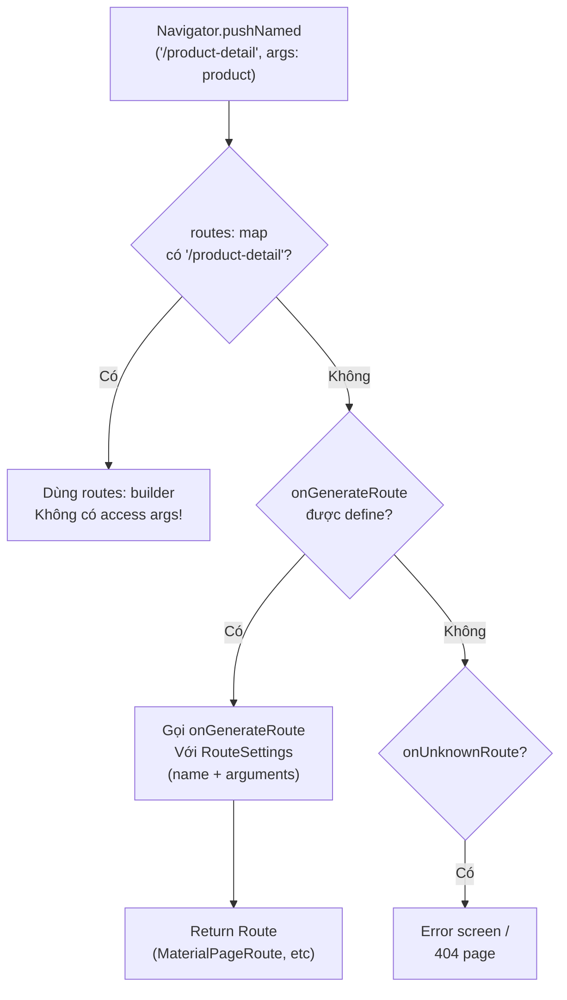

# Bài 6.3 — Named Routes & OnGenerateRoute

## Phần 1 — Khái Niệm & Mục Tiêu Bài Học

### Named routes giải quyết vấn đề gì?

Với constructor approach (bài 6.2), navigate phải có reference đến Widget class:

```dart
Navigator.push(context, MaterialPageRoute(builder: (_) => ProductDetailScreen(product: p)));
// Caller biết: ProductDetailScreen, MaterialPageRoute, Product object
```

Named routes cho phép navigate bằng string:

```dart
Navigator.pushNamed(context, '/product-detail', arguments: product);
// Caller chỉ cần biết route name và arguments
```

Tradeoff: ít type-safety hơn, nhưng decoupled hơn và hỗ trợ deep link.

### Bạn sẽ hiểu được sau bài này:
- `routes:` map — simple nhưng nhiều giới hạn
- `onGenerateRoute:` — flexible và powerful
- Type-safe arguments pattern với `ModalRoute.of(context)!.settings.arguments`
- Anti-pattern: khi nào không nên dùng named routes

---

## Phần 2 — Cơ Chế Hoạt Động (Under the Hood)

### Route Resolution Flow



---

## Phần 3 — Code Mẫu Chuẩn Google

### 3.1 — routes: map — Simple case

```dart
// routes: map phù hợp cho:
// - App nhỏ (<5 màn hình)
// - Màn hình không cần arguments
// - Không cần điều kiện để navigate (auth check, etc)

MaterialApp(
  initialRoute: '/',
  routes: {
    '/': (_) => const HomeScreen(),
    '/settings': (_) => const SettingsScreen(),
    '/about': (_) => const AboutScreen(),
    // Hạn chế: không thể truyền typed arguments qua routes map
    // '/product-detail': (_) => ProductDetailScreen(product: ???),
  },
)

// Navigate:
Navigator.pushNamed(context, '/settings');
Navigator.pushReplacementNamed(context, '/');
```

### 3.2 — onGenerateRoute — Flexible và powerful

```dart
// Định nghĩa route names là constants để tránh typo
abstract final class AppRoutes {
  static const home = '/';
  static const login = '/login';
  static const productList = '/products';
  static const productDetail = '/products/detail';
  static const editProduct = '/products/edit';
  static const cart = '/cart';
  static const profile = '/profile';
  static const settings = '/settings';
}

// onGenerateRoute: full control
MaterialApp(
  initialRoute: AppRoutes.home,
  onGenerateRoute: AppRouter.generate,
  onUnknownRoute: (settings) => MaterialPageRoute(
    builder: (_) => const NotFoundScreen(),
  ),
)

// Router class: centralized route mapping
class AppRouter {
  static Route<dynamic>? generate(RouteSettings settings) {
    final args = settings.arguments;

    return switch (settings.name) {
      AppRoutes.home => MaterialPageRoute(
          builder: (_) => const HomeScreen(),
          settings: settings,
        ),

      AppRoutes.login => MaterialPageRoute(
          builder: (_) => const LoginScreen(),
          settings: settings,
        ),

      AppRoutes.productList => MaterialPageRoute(
          builder: (_) => const ProductListScreen(),
          settings: settings,
        ),

      AppRoutes.productDetail => _productDetailRoute(args, settings),
      AppRoutes.editProduct => _editProductRoute(args, settings),

      AppRoutes.cart => MaterialPageRoute(
          builder: (_) => const CartScreen(),
          settings: settings,
        ),

      _ => null, // null → onUnknownRoute
    };
  }

  // Type-safe argument extraction
  static Route<void>? _productDetailRoute(dynamic args, RouteSettings settings) {
    if (args is! Product) {
      // Invalid args → error screen
      return MaterialPageRoute(
        builder: (_) => ErrorScreen(
          message: 'productDetail cần Product argument',
        ),
      );
    }
    return MaterialPageRoute(
      builder: (_) => ProductDetailScreen(product: args),
      settings: settings,
    );
  }

  static Route<Product?>? _editProductRoute(dynamic args, RouteSettings settings) {
    if (args is! Product) return null;
    return MaterialPageRoute<Product?>(
      builder: (_) => EditProductScreen(product: args),
      settings: settings,
    );
  }
}
```

### 3.3 — Navigate với onGenerateRoute

```dart
class ProductListScreen extends StatefulWidget {
  const ProductListScreen({super.key});
  @override State<ProductListScreen> createState() => _ProductListState();
}

class _ProductListState extends State<ProductListScreen> {
  List<Product> _products = [];

  Future<void> _openDetail(Product product) async {
    await Navigator.pushNamed(
      context,
      AppRoutes.productDetail,
      arguments: product, // Type-safe tại call site
    );
  }

  Future<void> _editProduct(Product product) async {
    // pushNamed với return value
    final updated = await Navigator.pushNamed<Product>(
      context,
      AppRoutes.editProduct,
      arguments: product,
    );

    if (updated == null || !mounted) return;
    setState(() {
      final index = _products.indexWhere((p) => p.id == updated.id);
      if (index >= 0) _products[index] = updated;
    });
  }

  @override
  Widget build(BuildContext context) {
    return Scaffold(
      appBar: AppBar(title: const Text('Sản phẩm')),
      body: ListView.builder(
        itemCount: _products.length,
        itemBuilder: (_, i) {
          final product = _products[i];
          return ListTile(
            title: Text(product.name),
            trailing: IconButton(
              icon: const Icon(Icons.edit),
              onPressed: () => _editProduct(product),
            ),
            onTap: () => _openDetail(product),
          );
        },
      ),
    );
  }
}
```

### 3.4 — Lấy arguments trong màn hình

```dart
// Cách 1: Qua constructor (type-safe, ưu tiên)
class ProductDetailScreen extends StatelessWidget {
  final Product product;
  const ProductDetailScreen({super.key, required this.product});
  // ...
}

// Cách 2: Qua ModalRoute.settings.arguments
// Dùng khi navigate bằng string và không có typed constructor
class ProductDetailScreenV2 extends StatelessWidget {
  const ProductDetailScreenV2({super.key});

  @override
  Widget build(BuildContext context) {
    // Lấy arguments từ route
    final args = ModalRoute.of(context)!.settings.arguments;

    if (args is! Product) {
      return const Scaffold(
        body: Center(child: Text('Lỗi: Thiếu thông tin sản phẩm')),
      );
    }

    final product = args;
    return Scaffold(
      appBar: AppBar(title: Text(product.name)),
      body: Text(product.description),
    );
  }
}
```

---

## Phần 4 — Lỗi Sai Phổ Biến & Best Practices

### ❌ Anti-pattern 1: Dùng `routes:` cho app lớn

```dart
// ❌ Không scale: routes: map không có dynamic args, không có auth guard
MaterialApp(
  routes: {
    '/': (_) => HomeScreen(),
    '/dashboard': (_) => DashboardScreen(), // Có cần login không?
    '/product': (_) => ProductScreen(),     // Product ID từ đâu?
    // Tất cả đều thiếu context, logic, và type safety
  },
)

// ✅ Đúng cho app >5 screens: onGenerateRoute với AppRouter class
```

### ❌ Anti-pattern 2: String literals cho route names

```dart
// ❌ Typo không phát hiện lúc compile
Navigator.pushNamed(context, '/produts'); // Typo!

// ✅ Constants
Navigator.pushNamed(context, AppRoutes.productList); // Compile-time safe
```

### ❌ Anti-pattern 3: Cast arguments không safe

```dart
// ❌ Crash nếu args sai type
final product = ModalRoute.of(context)!.settings.arguments as Product;
// 💥 Nếu arguments là null hoặc không phải Product

// ✅ Safe cast với kiểm tra
final args = ModalRoute.of(context)!.settings.arguments;
if (args is! Product) {
  return const ErrorWidget(message: 'Invalid arguments');
}
final product = args;
```

---

## Phần 5 — Bài Tập Củng Cố Tư Duy

### Challenge: Tổ chức Named Routes cho App 8 Màn Hình

**App có các màn hình:** Splash, Login, Register, Home, ProductList, ProductDetail(id), Cart, Profile

**Nhiệm vụ:**
1. Định nghĩa `AppRoutes` constants
2. Implement `AppRouter.generate()` với type-safe args cho ProductDetail
3. Thêm auth guard: `/home`, `/cart`, `/profile` cần login (check trong `generate`)
4. Handle unknown routes với `onUnknownRoute`

**Gợi ý cho auth guard:**
```dart
case AppRoutes.home:
  if (!AuthService.isLoggedIn) {
    return MaterialPageRoute(builder: (_) => const LoginScreen());
  }
  return MaterialPageRoute(builder: (_) => const HomeScreen());
```

### Câu hỏi phỏng vấn liên quan:

1. **"Sự khác biệt giữa `routes:` và `onGenerateRoute:`?"**
   - `routes:`: simple map, không có args, không có guard
   - `onGenerateRoute`: full control, args, guard, transitions

2. **"Tại sao nên dùng constants cho route names?"**
   - Tránh typo (compile-time safe)
   - IDE auto-complete và refactoring
   - Centralized documentation

3. **"Làm thế nào handle deep link với named routes?"**
   - `onGenerateRoute` nhận route name từ deeplink URL
   - Parse URL → extract args → create route
   - Navigator 2.0/GoRouter handles này tốt hơn (bài 6.4)
