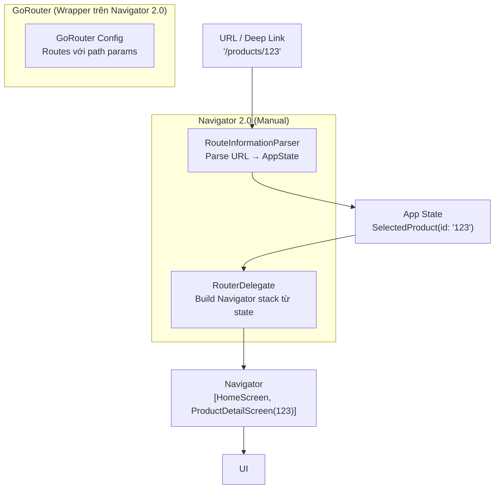

# Bài 6.4 — Triết Lý Declarative Routing

## Phần 1 — Khái Niệm & Mục Tiêu Bài Học

### Vấn đề của Navigator 1.0

Navigator 1.0 (push/pop) là **imperative** — bạn nói *"làm gì"*, không nói *"muốn trạng thái gì"*:

```dart
// Imperative (Navigator 1.0):
Navigator.push(context, MaterialPageRoute(builder: (_) => ProductScreen()));
// Lệnh: "Push màn hình này lên stack"

// Declarative (Navigator 2.0):
// App state: user chọn product → Router tự build stack phù hợp
// Khi URL thay đổi → stack thay đổi tương ứng
```

**Vấn đề cụ thể của Navigator 1.0:**
- Không sync với URL (web app)
- Deep link khó: `myapp://product/123` → cần manually parse và push
- Back button browser không hoạt động đúng

### Bạn sẽ hiểu được sau bài này:
- Navigator 2.0 tư duy: Router, RouterDelegate, RouteInformationParser
- Tại sao cần GoRouter/Auto Route cho production app
- GoRouter minimal example — mapping concept

---

## Phần 2 — Cơ Chế Hoạt Động (Under the Hood)

### Navigator 2.0 Architecture



### GoRouter — Tại sao phổ biến

```
GoRouter giải quyết:
✓ URL sync tự động
✓ Deep link handling
✓ Path parameters: /products/:id
✓ Query parameters: /products?category=electronics
✓ Nested routing (ShellRoute)
✓ Redirect (auth guard)
✓ Back button hoạt động đúng trên web
```

---

## Phần 3 — Code Mẫu Chuẩn Google

### 3.1 — GoRouter Setup

```yaml
# pubspec.yaml
dependencies:
  go_router: ^14.0.0
```

```dart
// router.dart — Centralized routing config
import 'package:go_router/go_router.dart';

final GoRouter appRouter = GoRouter(
  initialLocation: '/',
  debugLogDiagnostics: true, // Log navigation trong debug

  // Route definitions
  routes: [
    GoRoute(
      path: '/',
      builder: (context, state) => const HomeScreen(),
    ),
    GoRoute(
      path: '/login',
      builder: (context, state) => const LoginScreen(),
    ),
    GoRoute(
      path: '/products',
      builder: (context, state) => const ProductListScreen(),
      routes: [
        // Nested route: /products/:id
        GoRoute(
          path: ':id', // Path param
          builder: (context, state) {
            final id = state.pathParameters['id']!;
            return ProductDetailScreen(productId: id);
          },
          routes: [
            // /products/:id/edit
            GoRoute(
              path: 'edit',
              builder: (context, state) {
                final id = state.pathParameters['id']!;
                return EditProductScreen(productId: id);
              },
            ),
          ],
        ),
      ],
    ),
    GoRoute(
      path: '/cart',
      builder: (context, state) => const CartScreen(),
    ),
    GoRoute(
      path: '/profile',
      builder: (context, state) => const ProfileScreen(),
    ),
  ],

  // Auth redirect
  redirect: (context, state) {
    final isLoggedIn = AuthService.instance.isLoggedIn;
    final isLoginPage = state.matchedLocation == '/login';

    if (!isLoggedIn && !isLoginPage) {
      // Redirect về login + preserve intended route
      return '/login?redirectTo=${state.matchedLocation}';
    }
    if (isLoggedIn && isLoginPage) {
      return '/'; // Đã login → về home
    }
    return null; // Không redirect
  },

  // Error screen
  errorBuilder: (context, state) => Scaffold(
    body: Center(child: Text('404: ${state.error}')),
  ),
);

// main.dart
void main() {
  runApp(MaterialApp.router(
    routerConfig: appRouter,
    theme: ThemeData(useMaterial3: true),
  ));
}
```

### 3.2 — Navigate với GoRouter

```dart
class ProductListScreen extends StatelessWidget {
  const ProductListScreen({super.key});

  @override
  Widget build(BuildContext context) {
    return Scaffold(
      appBar: AppBar(title: const Text('Sản phẩm')),
      body: ListView.builder(
        itemCount: 10,
        itemBuilder: (context, i) => ListTile(
          title: Text('Product $i'),
          onTap: () {
            // GoRouter navigate: context.go() thay vì Navigator.push()
            context.go('/products/$i');
            // Hoặc: context.push('/products/$i') — giống push truyền thống
          },
        ),
      ),
    );
  }
}

class ProductDetailScreen extends StatelessWidget {
  final String productId;
  const ProductDetailScreen({super.key, required this.productId});

  @override
  Widget build(BuildContext context) {
    return Scaffold(
      appBar: AppBar(title: Text('Product $productId')),
      body: Column(
        children: [
          Text('Product ID: $productId'),
          ElevatedButton(
            onPressed: () {
              // Navigate với nested path
              context.go('/products/$productId/edit');
            },
            child: const Text('Chỉnh sửa'),
          ),
          ElevatedButton(
            onPressed: () => context.pop(), // Giống Navigator.pop()
            child: const Text('Quay lại'),
          ),
        ],
      ),
    );
  }
}
```

### 3.3 — go() vs push() vs replace() trong GoRouter

```dart
// go(): Update URL, clear history nếu không phải nested route
// Giống pushReplacement trong Navigator 1.0
context.go('/home');

// push(): Thêm vào history stack
// Giống Navigator.push()
context.push('/product/123');

// pop(): Quay lại
context.pop();
context.pop<Product>(updatedProduct); // Với result

// pushReplacement(): Thay route hiện tại
context.pushReplacement('/dashboard');

// Query params:
context.go('/products?category=electronics&sort=price');
// Đọc trong route:
final category = state.uri.queryParameters['category'];
```

### 3.4 — ShellRoute — Bottom Navigation + Nested routing

```dart
// ShellRoute: Persistent shell (BottomNavigationBar) với nested routes
final GoRouter shellRouter = GoRouter(
  routes: [
    ShellRoute(
      builder: (context, state, child) {
        // Shell: AppBar + BottomNavigationBar
        return MainShell(child: child);
      },
      routes: [
        GoRoute(path: '/home', builder: (_, __) => const HomeTab()),
        GoRoute(path: '/products', builder: (_, __) => const ProductsTab()),
        GoRoute(path: '/cart', builder: (_, __) => const CartTab()),
        GoRoute(path: '/profile', builder: (_, __) => const ProfileTab()),
      ],
    ),
  ],
);

class MainShell extends StatelessWidget {
  final Widget child;
  const MainShell({super.key, required this.child});

  @override
  Widget build(BuildContext context) {
    return Scaffold(
      body: child, // Nội dung tab hiện tại
      bottomNavigationBar: NavigationBar(
        selectedIndex: _getSelectedIndex(context),
        onDestinationSelected: (index) {
          const routes = ['/home', '/products', '/cart', '/profile'];
          context.go(routes[index]);
        },
        destinations: const [
          NavigationDestination(icon: Icon(Icons.home), label: 'Home'),
          NavigationDestination(icon: Icon(Icons.shopping_bag), label: 'Sản phẩm'),
          NavigationDestination(icon: Icon(Icons.shopping_cart), label: 'Giỏ hàng'),
          NavigationDestination(icon: Icon(Icons.person), label: 'Hồ sơ'),
        ],
      ),
    );
  }

  int _getSelectedIndex(BuildContext context) {
    final location = GoRouterState.of(context).matchedLocation;
    if (location.startsWith('/products')) return 1;
    if (location.startsWith('/cart')) return 2;
    if (location.startsWith('/profile')) return 3;
    return 0; // home
  }
}
```

---

## Phần 4 — Lỗi Sai Phổ Biến & Best Practices

### ❌ Anti-pattern 1: Mix Navigator 1.0 với GoRouter

```dart
// ❌ Nguy hiểm: Dùng cả hai cùng lúc → state không sync
Navigator.push(context, MaterialPageRoute(builder: (_) => ProductScreen()));
// GoRouter không biết về screen này → URL không cập nhật, back button lạ

// ✅ Đúng: Chỉ dùng một trong hai. Với GoRouter → dùng context.push/go/pop
context.push('/products/123');
```

### ❌ Anti-pattern 2: Hardcode path strings trong nhiều nơi

```dart
// ❌ Sai: Typo hoặc path change → silent bug
context.go('/produts/123'); // Typo!

// ✅ Đúng: Constants cho paths
abstract final class AppPaths {
  static const home = '/';
  static const products = '/products';
  static String product(String id) => '/products/$id';
  static String editProduct(String id) => '/products/$id/edit';
}

context.go(AppPaths.product('123'));
```

### ❌ Anti-pattern 3: Không test deep link handling

```dart
// Test deep link: adb shell am start -a android.intent.action.VIEW -d "myapp://products/123"
// GoRouter sẽ handle và navigate đúng route nếu config đúng

// Config deep link trong AndroidManifest.xml và Info.plist
// Verify với GoRouter.debugLogDiagnostics = true
```

---

## Phần 5 — Bài Tập Củng Cố Tư Duy

### Challenge: Đọc GoRouter Minimal Example

**Setup:** Tạo app đơn giản với GoRouter:
1. Home `/`
2. Products `/products`
3. Product Detail `/products/:id`
4. Cart `/cart`
5. Auth redirect: `/products` và `/cart` cần login

**Câu hỏi khi đọc code:**
1. Khi navigate `/products/123` — stack trông như thế nào?
2. `context.go('/home')` khác `context.push('/home')` ở điểm nào?
3. Redirect function được gọi ở đâu trong flow?

### Câu Hỏi Phỏng Vấn

> **[Junior]** — nắm khái niệm | **[Middle]** — hiểu cơ chế | **[Senior]** — hiểu Flutter internals | **[Trace Code]** — đọc code và dự đoán output

---

#### Q1 [Junior] — "Navigator 1.0 hạn chế gì khiến Navigator 2.0 ra đời?"

**Trả lời chuẩn:**

Navigator 1.0 có **4 hạn chế chính** khi phát triển Flutter Web và deep linking:

**1. Không sync URL:** Trên web, browser URL bar không được cập nhật khi navigate. Push `/profile` nhưng URL vẫn là `/` → không shareable link.

**2. Browser back button không đúng:** Back button của browser dùng browser history, không phải Flutter Navigator stack → inconsistent UX trên web.

**3. Deep link phức tạp:** Khi app nhận deep link `myapp://product/123`, phải viết custom code để translate URL sang Navigator operations. Không có native URL→route mapping.

**4. Imperative API khó test:** `Navigator.push(context, ...)` là imperative — khó để test navigation logic independent của UI. Muốn test "nếu user chưa login → redirect về login" phải render entire widget tree.

**Navigator 2.0 giải pháp:**
- `RouterDelegate`: state-driven — navigator phản ánh app state, không phải ngược lại
- `RouteInformationParser`: parse URL ↔ route state bidirectionally
- URL luôn sync với navigation state

---

#### Q2 [Junior] — "`GoRouter` là gì? Tại sao phổ biến hơn Navigator 2.0 thuần?"

**Trả lời chuẩn:**

`GoRouter` là package (từ Flutter team) wrap trên Navigator 2.0, cung cấp API đơn giản hơn:

```dart
// GoRouter setup
final router = GoRouter(
  initialLocation: '/',
  redirect: (ctx, state) {
    // Auth guard toàn cục
    if (!AuthService.isLoggedIn && state.uri.path != '/login') {
      return '/login';
    }
    return null; // không redirect
  },
  routes: [
    GoRoute(path: '/', builder: (ctx, _) => const HomePage()),
    GoRoute(
      path: '/product/:id',
      builder: (ctx, state) => ProductPage(id: state.pathParameters['id']!),
    ),
    ShellRoute(
      builder: (ctx, state, child) => ScaffoldWithNav(child: child),
      routes: [
        GoRoute(path: '/home', builder: (_, __) => const HomeTab()),
        GoRoute(path: '/search', builder: (_, __) => const SearchTab()),
      ],
    ),
  ],
);

MaterialApp.router(routerConfig: router)
```

**Tại sao phổ biến hơn Navigator 2.0 thuần:** Navigator 2.0 thuần yêu cầu implement `RouterDelegate` + `RouteInformationParser` manually — phức tạp, nhiều boilerplate. GoRouter cung cấp declarative API, URL sync, deep link, nested routing, redirect tất cả trong vài dòng config.

---

#### Q3 [Middle] — "`context.go()` vs `context.push()` trong GoRouter — khác nhau thế nào?"

**Trả lời chuẩn:**

| | `context.go(path)` | `context.push(path)` |
|---|---|---|
| **Navigation stack** | Replace history (no back) | Add to stack (can back) |
| **Back button** | Không thể back | Có thể back |
| **URL** | Sync URL, replace history | Sync URL, add to history |
| **Tương đương Nav 1.0** | `pushReplacementNamed` | `pushNamed` |

```dart
// context.go — replace navigation, không có back
// Dùng cho: login thành công → home (không muốn back về login)
onPressed: () => context.go('/home'),

// context.push — thêm vào stack, có back
// Dùng cho: tap item → detail (muốn back về list)
onPressed: () => context.push('/product/p123'),

// context.goNamed — như go() nhưng dùng route name thay vì path
onPressed: () => context.goNamed('home'),

// pop với result
context.pop('selected_color');
```

**Rule of thumb:** `go()` cho navigation chính (bottom nav tabs, post-auth redirect). `push()` cho navigation phụ (detail screens, dialogs, sub-flows).

---

#### Q4 [Senior] — "Navigator 2.0 `RouterDelegate` + `RouteInformationParser` — hai class này có nhiệm vụ gì?"

**Trả lời chuẩn:**

Navigator 2.0 tách biệt 2 trách nhiệm:

**`RouteInformationParser<T>`** — Translate giữa URL (string) và app state:
```dart
class AppRouteInformationParser extends RouteInformationParser<AppState> {
  // URL → AppState (khi app start hoặc deep link)
  @override
  Future<AppState> parseRouteInformation(RouteInformation routeInfo) async {
    final uri = Uri.parse(routeInfo.uri.toString());
    if (uri.pathSegments.isEmpty) return AppState.home();
    if (uri.pathSegments[0] == 'product') {
      return AppState.product(id: uri.pathSegments[1]);
    }
    return AppState.notFound();
  }
  
  // AppState → URL (để sync browser URL bar)
  @override
  RouteInformation restoreRouteInformation(AppState state) {
    return RouteInformation(uri: Uri.parse(state.toPath()));
  }
}
```

**`RouterDelegate<T>`** — Build Navigator widget dựa trên app state:
```dart
class AppRouterDelegate extends RouterDelegate<AppState>
    with ChangeNotifier, PopNavigatorRouterDelegateMixin {
  AppState _state = AppState.home();
  
  // GoRouter gọi method này khi state thay đổi
  @override
  Widget build(BuildContext context) {
    return Navigator(
      pages: [
        const MaterialPage(child: HomePage()),
        if (_state.isProduct)
          MaterialPage(child: ProductPage(id: _state.productId!)),
      ],
      onDidRemovePage: (page) {
        // Handle pop
        if (_state.isProduct) {
          _state = AppState.home();
          notifyListeners(); // URL sync
        }
      },
    );
  }
}
```

---

#### Q5 [Middle] — "`GoRouter` URL sync hoạt động thế nào? Browser URL được cập nhật ra sao?"

**Trả lời chuẩn:**

GoRouter implement `RouteInformationProvider` và `RouteInformationParser` → Flutter Router widget tự động sync URL với browser:

```
context.go('/product/p123')
  ↓
GoRouter._go('/product/p123')
  ↓
GoRouterDelegate.go('/product/p123')  // RouterDelegate state thay đổi
  ↓
RouterDelegate.notifyListeners()
  ↓
Router widget (Flutter built-in) được notify
  ↓
Router.build():
  1. Gọi RouterDelegate.build() → rebuild Navigator với new pages
  2. Gọi RouteInformationParser.restoreRouteInformation(newState)
     → trả về RouteInformation(uri: '/product/p123')
  3. Gọi RouteInformationProvider.routerReportNewRouteInformation(...)
     → trên web: history.pushState(null, '', '/product/p123') via platform channel
     → trên mobile: no-op (không có browser)
```

**Trên mobile:** URL sync là no-op (không có browser). Nhưng route state vẫn được maintain → deep link và `go()` vẫn hoạt động đúng.

---

#### Q6 [Middle] — "Nested navigation (bottom nav + inner navigator) — `ShellRoute` giải quyết gì?"

**Trả lời chuẩn:**

**Vấn đề:** Mỗi bottom nav tab cần navigator riêng — navigate trong tab không ảnh hưởng đến tab khác:

```
App
├─ Tab 1 (Home)
│   └─ HomeListScreen
│       └─ HomeDetailScreen  ← nested navigate
├─ Tab 2 (Search)
│   └─ SearchScreen
└─ Tab 3 (Profile)
    └─ ProfileScreen
```

**`ShellRoute` giải pháp:**
```dart
GoRouter(routes: [
  ShellRoute(
    // Shell = persistent UI wrapper (BottomNavigationBar)
    builder: (ctx, state, child) => ScaffoldWithBottomNav(
      currentIndex: _getTabIndex(state.uri.path),
      child: child, // ← active tab content
    ),
    routes: [
      GoRoute(
        path: '/home',
        builder: (_, __) => const HomeScreen(),
        routes: [
          // Nested route TRONG shell — bottom nav vẫn visible
          GoRoute(
            path: 'detail/:id',
            builder: (_, state) => HomeDetailScreen(id: state.pathParameters['id']!),
          ),
        ],
      ),
      GoRoute(path: '/search', builder: (_, __) => const SearchScreen()),
    ],
  ),
])
```

Với ShellRoute, navigate `/home/detail/123` → Shell (BottomNav) vẫn hiển thị, chỉ content area thay đổi. Khác với non-shell route: navigate sẽ thay thế toàn bộ screen (BottomNav biến mất).

---

#### Q7 [Trace Code] — "`context.go('/home')` vs `context.push('/home')`: history stack khác nhau thế nào?"

```dart
// Initial state: user ở màn hình Login (/login)
// GoRouter routes:
// / → HomePage
// /login → LoginPage  
// /product/:id → ProductPage

// Scenario A: login thành công → dùng go()
void onLoginSuccess() {
  context.go('/');
}

// Scenario B: từ Home, xem product → dùng push()
void onProductTap(String id) {
  context.push('/product/$id');
}

// Hỏi: browser history và navigation stack khác nhau thế nào?
```

**Scenario A — `context.go('/')`:**
```
Browser history: [... /login] → thêm '/' (REPLACE: /login → /)
Navigator pages: [MaterialPage(HomePage)] // chỉ HomePage
Back button: Không thể back về /login
URL: /

// Use case: Đúng cho post-login redirect — user không muốn back về login
```

**Scenario B — `context.push('/product/p123')` từ HomePage:**
```
Browser history: [... /, /product/p123]  // ADD new entry
Navigator pages: [MaterialPage(HomePage), MaterialPage(ProductPage)]
Back button: Back về / (HomePage)
URL: /product/p123

// Use case: Đúng cho detail navigation — user muốn back về list
```

**Nếu dùng `go()` thay vì `push()` cho Product:**
```
Navigator pages: [MaterialPage(ProductPage)] // HomePage bị xóa!
Back button: Không thể back → user bị "stuck" tại Product
```
→ Đây là lý do quan trọng phải chọn đúng `go()` vs `push()`.
