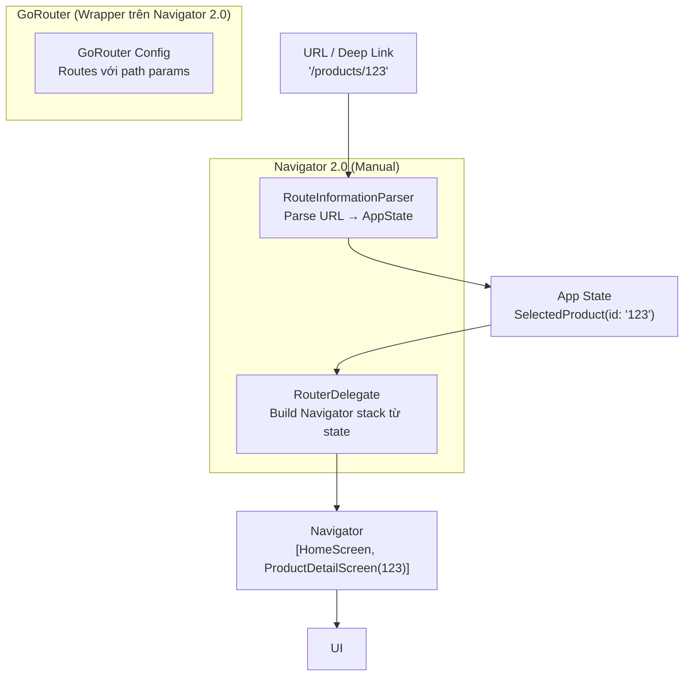

# Bài 6.4 — Triết Lý Declarative Routing

## Phần 1 — Khái Niệm & Mục Tiêu Bài Học

### Vấn đề của Navigator 1.0

Navigator 1.0 (push/pop) là **imperative** — bạn nói *"làm gì"*, không nói *"muốn trạng thái gì"*:

```dart
// Imperative (Navigator 1.0):
Navigator.push(context, MaterialPageRoute(builder: (_) => ProductScreen()));
// Lệnh: "Push màn hình này lên stack"

// Declarative (Navigator 2.0):
// App state: user chọn product → Router tự build stack phù hợp
// Khi URL thay đổi → stack thay đổi tương ứng
```

**Vấn đề cụ thể của Navigator 1.0:**
- Không sync với URL (web app)
- Deep link khó: `myapp://product/123` → cần manually parse và push
- Back button browser không hoạt động đúng

### Bạn sẽ hiểu được sau bài này:
- Navigator 2.0 tư duy: Router, RouterDelegate, RouteInformationParser
- Tại sao cần GoRouter/Auto Route cho production app
- GoRouter minimal example — mapping concept

---

## Phần 2 — Cơ Chế Hoạt Động (Under the Hood)

### Navigator 2.0 Architecture



### GoRouter — Tại sao phổ biến

```
GoRouter giải quyết:
✓ URL sync tự động
✓ Deep link handling
✓ Path parameters: /products/:id
✓ Query parameters: /products?category=electronics
✓ Nested routing (ShellRoute)
✓ Redirect (auth guard)
✓ Back button hoạt động đúng trên web
```

---

## Phần 3 — Code Mẫu Chuẩn Google

### 3.1 — GoRouter Setup

```yaml
# pubspec.yaml
dependencies:
  go_router: ^14.0.0
```

```dart
// router.dart — Centralized routing config
import 'package:go_router/go_router.dart';

final GoRouter appRouter = GoRouter(
  initialLocation: '/',
  debugLogDiagnostics: true, // Log navigation trong debug

  // Route definitions
  routes: [
    GoRoute(
      path: '/',
      builder: (context, state) => const HomeScreen(),
    ),
    GoRoute(
      path: '/login',
      builder: (context, state) => const LoginScreen(),
    ),
    GoRoute(
      path: '/products',
      builder: (context, state) => const ProductListScreen(),
      routes: [
        // Nested route: /products/:id
        GoRoute(
          path: ':id', // Path param
          builder: (context, state) {
            final id = state.pathParameters['id']!;
            return ProductDetailScreen(productId: id);
          },
          routes: [
            // /products/:id/edit
            GoRoute(
              path: 'edit',
              builder: (context, state) {
                final id = state.pathParameters['id']!;
                return EditProductScreen(productId: id);
              },
            ),
          ],
        ),
      ],
    ),
    GoRoute(
      path: '/cart',
      builder: (context, state) => const CartScreen(),
    ),
    GoRoute(
      path: '/profile',
      builder: (context, state) => const ProfileScreen(),
    ),
  ],

  // Auth redirect
  redirect: (context, state) {
    final isLoggedIn = AuthService.instance.isLoggedIn;
    final isLoginPage = state.matchedLocation == '/login';

    if (!isLoggedIn && !isLoginPage) {
      // Redirect về login + preserve intended route
      return '/login?redirectTo=${state.matchedLocation}';
    }
    if (isLoggedIn && isLoginPage) {
      return '/'; // Đã login → về home
    }
    return null; // Không redirect
  },

  // Error screen
  errorBuilder: (context, state) => Scaffold(
    body: Center(child: Text('404: ${state.error}')),
  ),
);

// main.dart
void main() {
  runApp(MaterialApp.router(
    routerConfig: appRouter,
    theme: ThemeData(useMaterial3: true),
  ));
}
```

### 3.2 — Navigate với GoRouter

```dart
class ProductListScreen extends StatelessWidget {
  const ProductListScreen({super.key});

  @override
  Widget build(BuildContext context) {
    return Scaffold(
      appBar: AppBar(title: const Text('Sản phẩm')),
      body: ListView.builder(
        itemCount: 10,
        itemBuilder: (context, i) => ListTile(
          title: Text('Product $i'),
          onTap: () {
            // GoRouter navigate: context.go() thay vì Navigator.push()
            context.go('/products/$i');
            // Hoặc: context.push('/products/$i') — giống push truyền thống
          },
        ),
      ),
    );
  }
}

class ProductDetailScreen extends StatelessWidget {
  final String productId;
  const ProductDetailScreen({super.key, required this.productId});

  @override
  Widget build(BuildContext context) {
    return Scaffold(
      appBar: AppBar(title: Text('Product $productId')),
      body: Column(
        children: [
          Text('Product ID: $productId'),
          ElevatedButton(
            onPressed: () {
              // Navigate với nested path
              context.go('/products/$productId/edit');
            },
            child: const Text('Chỉnh sửa'),
          ),
          ElevatedButton(
            onPressed: () => context.pop(), // Giống Navigator.pop()
            child: const Text('Quay lại'),
          ),
        ],
      ),
    );
  }
}
```

### 3.3 — go() vs push() vs replace() trong GoRouter

```dart
// go(): Update URL, clear history nếu không phải nested route
// Giống pushReplacement trong Navigator 1.0
context.go('/home');

// push(): Thêm vào history stack
// Giống Navigator.push()
context.push('/product/123');

// pop(): Quay lại
context.pop();
context.pop<Product>(updatedProduct); // Với result

// pushReplacement(): Thay route hiện tại
context.pushReplacement('/dashboard');

// Query params:
context.go('/products?category=electronics&sort=price');
// Đọc trong route:
final category = state.uri.queryParameters['category'];
```

### 3.4 — ShellRoute — Bottom Navigation + Nested routing

```dart
// ShellRoute: Persistent shell (BottomNavigationBar) với nested routes
final GoRouter shellRouter = GoRouter(
  routes: [
    ShellRoute(
      builder: (context, state, child) {
        // Shell: AppBar + BottomNavigationBar
        return MainShell(child: child);
      },
      routes: [
        GoRoute(path: '/home', builder: (_, __) => const HomeTab()),
        GoRoute(path: '/products', builder: (_, __) => const ProductsTab()),
        GoRoute(path: '/cart', builder: (_, __) => const CartTab()),
        GoRoute(path: '/profile', builder: (_, __) => const ProfileTab()),
      ],
    ),
  ],
);

class MainShell extends StatelessWidget {
  final Widget child;
  const MainShell({super.key, required this.child});

  @override
  Widget build(BuildContext context) {
    return Scaffold(
      body: child, // Nội dung tab hiện tại
      bottomNavigationBar: NavigationBar(
        selectedIndex: _getSelectedIndex(context),
        onDestinationSelected: (index) {
          const routes = ['/home', '/products', '/cart', '/profile'];
          context.go(routes[index]);
        },
        destinations: const [
          NavigationDestination(icon: Icon(Icons.home), label: 'Home'),
          NavigationDestination(icon: Icon(Icons.shopping_bag), label: 'Sản phẩm'),
          NavigationDestination(icon: Icon(Icons.shopping_cart), label: 'Giỏ hàng'),
          NavigationDestination(icon: Icon(Icons.person), label: 'Hồ sơ'),
        ],
      ),
    );
  }

  int _getSelectedIndex(BuildContext context) {
    final location = GoRouterState.of(context).matchedLocation;
    if (location.startsWith('/products')) return 1;
    if (location.startsWith('/cart')) return 2;
    if (location.startsWith('/profile')) return 3;
    return 0; // home
  }
}
```

---

## Phần 4 — Lỗi Sai Phổ Biến & Best Practices

### ❌ Anti-pattern 1: Mix Navigator 1.0 với GoRouter

```dart
// ❌ Nguy hiểm: Dùng cả hai cùng lúc → state không sync
Navigator.push(context, MaterialPageRoute(builder: (_) => ProductScreen()));
// GoRouter không biết về screen này → URL không cập nhật, back button lạ

// ✅ Đúng: Chỉ dùng một trong hai. Với GoRouter → dùng context.push/go/pop
context.push('/products/123');
```

### ❌ Anti-pattern 2: Hardcode path strings trong nhiều nơi

```dart
// ❌ Sai: Typo hoặc path change → silent bug
context.go('/produts/123'); // Typo!

// ✅ Đúng: Constants cho paths
abstract final class AppPaths {
  static const home = '/';
  static const products = '/products';
  static String product(String id) => '/products/$id';
  static String editProduct(String id) => '/products/$id/edit';
}

context.go(AppPaths.product('123'));
```

### ❌ Anti-pattern 3: Không test deep link handling

```dart
// Test deep link: adb shell am start -a android.intent.action.VIEW -d "myapp://products/123"
// GoRouter sẽ handle và navigate đúng route nếu config đúng

// Config deep link trong AndroidManifest.xml và Info.plist
// Verify với GoRouter.debugLogDiagnostics = true
```

---

## Phần 5 — Bài Tập Củng Cố Tư Duy

### Challenge: Đọc GoRouter Minimal Example

**Setup:** Tạo app đơn giản với GoRouter:
1. Home `/`
2. Products `/products`
3. Product Detail `/products/:id`
4. Cart `/cart`
5. Auth redirect: `/products` và `/cart` cần login

**Câu hỏi khi đọc code:**
1. Khi navigate `/products/123` — stack trông như thế nào?
2. `context.go('/home')` khác `context.push('/home')` ở điểm nào?
3. Redirect function được gọi ở đâu trong flow?

### Câu hỏi phỏng vấn liên quan:

1. **"Navigator 1.0 hạn chế gì khiến Navigator 2.0 ra đời?"**
   - Không sync URL (web)
   - Deep link handling phức tạp
   - Back button browser không hoạt động đúng
   - Imperative API khó test và reason about

2. **"GoRouter là gì?"**
   - Package wrapper trên Navigator 2.0
   - Declarative route config, URL sync, deep link, nested routing, redirect

3. **"`context.go()` vs `context.push()` trong GoRouter?"**
   - `go()`: navigate và replace history nếu same shell — URL-first thinking
   - `push()`: thêm vào stack — giống Navigator.push()
