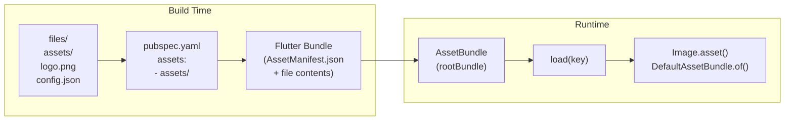

# Bài 7.1 — Asset Management Pipeline

## Phần 1 — Khái Niệm & Mục Tiêu Bài Học

### Tại sao bài này quan trọng?

Assets (ảnh, font, SVG, JSON config) là phần không thể thiếu của mọi Flutter app. Nhưng pipeline để đưa file từ disk vào UI ít được hiểu rõ:

```
File trên disk → pubspec.yaml khai báo → Flutter build bundle → AssetBundle runtime → Widget
```

Nếu không hiểu pipeline, bạn sẽ gặp:
- "Unable to load asset" — quên khai báo trong pubspec.yaml
- Ảnh không cache — không dùng `cached_network_image`
- SVG bị rasterized — không dùng `flutter_svg`

### Bạn sẽ hiểu được sau bài này:
- `pubspec.yaml` asset declaration — cú pháp đúng
- `AssetBundle`, `rootBundle` — cách Flutter load assets
- `Image.asset` vs `Image.network` vs `CachedNetworkImage`
- Font loading và SVG với `flutter_svg`
- Load JSON config từ assets

---

## Phần 2 — Cơ Chế Hoạt Động (Under the Hood)

### Asset Pipeline



### `rootBundle` vs `DefaultAssetBundle`

```
rootBundle: Global AssetBundle — load file trực tiếp từ bundle
            Dùng trong code không có BuildContext (service, model)

DefaultAssetBundle.of(context): AssetBundle từ context
            Có thể bị override trong test → testable
            Dùng trong Widget
```

---

## Phần 3 — Code Mẫu Chuẩn Google

### 3.1 — pubspec.yaml — Khai báo đúng

```yaml
# pubspec.yaml
flutter:
  assets:
    # Khai báo từng file
    - assets/images/logo.png
    - assets/config/app_config.json

    # Hoặc khai báo cả thư mục (include tất cả files trong thư mục đó)
    - assets/images/
    - assets/icons/
    # Không include subfolder! Cần khai báo riêng
    - assets/images/products/

  fonts:
    - family: Roboto
      fonts:
        - asset: assets/fonts/Roboto-Regular.ttf
        - asset: assets/fonts/Roboto-Bold.ttf
          weight: 700
        - asset: assets/fonts/Roboto-Italic.ttf
          style: italic

    - family: ProductSans
      fonts:
        - asset: assets/fonts/ProductSans-Regular.ttf
```

### 3.2 — Image assets

```dart
import 'package:cached_network_image/cached_network_image.dart';
import 'package:flutter_svg/flutter_svg.dart';

class ImageExamples extends StatelessWidget {
  const ImageExamples({super.key});

  @override
  Widget build(BuildContext context) {
    return Column(
      children: [
        // Image.asset: từ bundle
        Image.asset(
          'assets/images/logo.png',
          width: 120,
          height: 60,
          fit: BoxFit.contain,
          // Hiệu năng: cache trong memory tự động
        ),

        const SizedBox(height: 16),

        // Image.network: tải từ URL — không cache disk
        Image.network(
          'https://example.com/product.jpg',
          width: 200,
          height: 200,
          fit: BoxFit.cover,
          // Loading placeholder
          loadingBuilder: (context, child, progress) {
            if (progress == null) return child;
            return SizedBox(
              width: 200, height: 200,
              child: Center(
                child: CircularProgressIndicator(
                  value: progress.expectedTotalBytes != null
                      ? progress.cumulativeBytesLoaded / progress.expectedTotalBytes!
                      : null,
                ),
              ),
            );
          },
          // Error handler
          errorBuilder: (context, error, stackTrace) => const Icon(
            Icons.broken_image, size: 100, color: Colors.grey,
          ),
        ),

        const SizedBox(height: 16),

        // CachedNetworkImage: network + disk cache (ưu tiên dùng)
        CachedNetworkImage(
          imageUrl: 'https://example.com/product.jpg',
          width: 200,
          height: 200,
          fit: BoxFit.cover,
          placeholder: (context, url) => const CircularProgressIndicator(),
          errorWidget: (context, url, error) => const Icon(Icons.error),
          // fadeInDuration: animation khi load xong
          fadeInDuration: const Duration(milliseconds: 200),
        ),

        const SizedBox(height: 16),

        // SVG với flutter_svg
        SvgPicture.asset(
          'assets/icons/star.svg',
          width: 32,
          height: 32,
          colorFilter: const ColorFilter.mode(Colors.amber, BlendMode.srcIn),
        ),

        // SVG từ network
        SvgPicture.network(
          'https://example.com/icon.svg',
          width: 32,
          height: 32,
        ),
      ],
    );
  }
}
```

### 3.3 — Load JSON config từ assets

```dart
// assets/config/app_config.json
// {
//   "apiBaseUrl": "https://api.example.com",
//   "apiVersion": "v2",
//   "featureFlags": {
//     "enableNewCheckout": true,
//     "enableDarkMode": false
//   }
// }

class AppConfig {
  final String apiBaseUrl;
  final String apiVersion;
  final Map<String, bool> featureFlags;

  const AppConfig({
    required this.apiBaseUrl,
    required this.apiVersion,
    required this.featureFlags,
  });

  factory AppConfig.fromJson(Map<String, dynamic> json) {
    return AppConfig(
      apiBaseUrl: json['apiBaseUrl'] as String,
      apiVersion: json['apiVersion'] as String,
      featureFlags: Map<String, bool>.from(
        json['featureFlags'] as Map<String, dynamic>,
      ),
    );
  }

  bool isEnabled(String flag) => featureFlags[flag] ?? false;
}

class ConfigLoader {
  // Load config từ asset bundle
  static Future<AppConfig> load(BuildContext context) async {
    // Dùng DefaultAssetBundle thay vì rootBundle → testable
    final jsonString = await DefaultAssetBundle.of(context)
        .loadString('assets/config/app_config.json');
    final jsonMap = jsonDecode(jsonString) as Map<String, dynamic>;
    return AppConfig.fromJson(jsonMap);
  }

  // Load từ rootBundle (nếu không có context)
  static Future<AppConfig> loadWithoutContext() async {
    final jsonString = await rootBundle.loadString('assets/config/app_config.json');
    final jsonMap = jsonDecode(jsonString) as Map<String, dynamic>;
    return AppConfig.fromJson(jsonMap);
  }
}

// Dùng trong app startup:
class MyApp extends StatelessWidget {
  const MyApp({super.key});

  @override
  Widget build(BuildContext context) {
    return FutureBuilder<AppConfig>(
      future: ConfigLoader.loadWithoutContext(),
      builder: (context, snapshot) {
        if (!snapshot.hasData) return const MaterialApp(
          home: Scaffold(body: Center(child: CircularProgressIndicator())),
        );
        return _AppWithConfig(config: snapshot.requireData);
      },
    );
  }
}
```

---

## Phần 4 — Lỗi Sai Phổ Biến & Best Practices

### ❌ Anti-pattern 1: Quên khai báo asset trong pubspec.yaml

```yaml
# ❌ Sai: File có trên disk nhưng không khai báo
flutter:
  assets:
    - assets/images/logo.png
    # Quên: - assets/images/banner.png

# ✅ Đúng: Khai báo cả thư mục
flutter:
  assets:
    - assets/images/  # Tất cả files trong thư mục
```

### ❌ Anti-pattern 2: Dùng Image.network không có error handler

```dart
// ❌ Sai: Crash hoặc blank nếu URL sai/unreachable
Image.network('https://example.com/photo.jpg')

// ✅ Đúng: Luôn có errorBuilder
Image.network(
  url,
  errorBuilder: (_, __, ___) => const Icon(Icons.broken_image),
)
// ✅ Tốt hơn: CachedNetworkImage với cả hai placeholder và error
```

### ❌ Anti-pattern 3: Không dùng CachedNetworkImage

```dart
// ❌ Sai: Image.network không cache disk
// → Mỗi lần scroll ra khỏi viewport và trở lại → download lại!
Image.network(product.imageUrl)

// ✅ Đúng: CachedNetworkImage (package)
CachedNetworkImage(imageUrl: product.imageUrl)
// → Download một lần, cache trên disk, load từ cache các lần sau
```

---

## Phần 5 — Bài Tập Củng Cố Tư Duy

### Challenge: Load và Hiển Thị SVG Icon từ Assets

**Yêu cầu:**
1. Thêm `flutter_svg` vào dependencies
2. Download 3 SVG icons (home, cart, profile)
3. Khai báo trong `pubspec.yaml`
4. Tạo `AppIcon` widget nhận path và color
5. Dùng trong BottomNavigationBar

**Gợi ý:**
- `SvgPicture.asset(path, colorFilter: ColorFilter.mode(color, BlendMode.srcIn))`
- Test với màu khác nhau khi selected/unselected

### Câu hỏi phỏng vấn liên quan:

1. **"Sự khác biệt giữa `rootBundle` và `DefaultAssetBundle.of(context)`?"**
   - `rootBundle`: global, không testable
   - `DefaultAssetBundle.of(context)`: có thể override trong test → better testability

2. **"Tại sao nên dùng `CachedNetworkImage` thay vì `Image.network`?"**
   - `CachedNetworkImage` lưu vào disk cache → load offline, ít network request
   - `Image.network` chỉ memory cache → mất khi app restart

3. **"Làm thế nào dùng font custom trong Flutter?"**
   - Khai báo trong `pubspec.yaml` `fonts` section
   - Dùng `fontFamily: 'YourFont'` trong `TextStyle`
   - Có thể set default cho toàn app trong `ThemeData`
