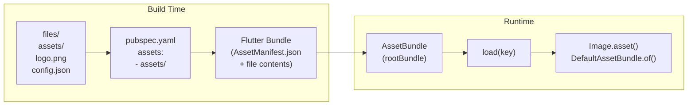

# Bài 7.1 — Asset Management Pipeline

## Phần 1 — Khái Niệm & Mục Tiêu Bài Học

### Tại sao bài này quan trọng?

Assets (ảnh, font, SVG, JSON config) là phần không thể thiếu của mọi Flutter app. Nhưng pipeline để đưa file từ disk vào UI ít được hiểu rõ:

```
File trên disk → pubspec.yaml khai báo → Flutter build bundle → AssetBundle runtime → Widget
```

Nếu không hiểu pipeline, bạn sẽ gặp:
- "Unable to load asset" — quên khai báo trong pubspec.yaml
- Ảnh không cache — không dùng `cached_network_image`
- SVG bị rasterized — không dùng `flutter_svg`

### Bạn sẽ hiểu được sau bài này:
- `pubspec.yaml` asset declaration — cú pháp đúng
- `AssetBundle`, `rootBundle` — cách Flutter load assets
- `Image.asset` vs `Image.network` vs `CachedNetworkImage`
- Font loading và SVG với `flutter_svg`
- Load JSON config từ assets

---

## Phần 2 — Cơ Chế Hoạt Động (Under the Hood)

### Asset Pipeline



### `rootBundle` vs `DefaultAssetBundle`

```
rootBundle: Global AssetBundle — load file trực tiếp từ bundle
            Dùng trong code không có BuildContext (service, model)

DefaultAssetBundle.of(context): AssetBundle từ context
            Có thể bị override trong test → testable
            Dùng trong Widget
```

---

## Phần 3 — Code Mẫu Chuẩn Google

### 3.1 — pubspec.yaml — Khai báo đúng

```yaml
# pubspec.yaml
flutter:
  assets:
    # Khai báo từng file
    - assets/images/logo.png
    - assets/config/app_config.json

    # Hoặc khai báo cả thư mục (include tất cả files trong thư mục đó)
    - assets/images/
    - assets/icons/
    # Không include subfolder! Cần khai báo riêng
    - assets/images/products/

  fonts:
    - family: Roboto
      fonts:
        - asset: assets/fonts/Roboto-Regular.ttf
        - asset: assets/fonts/Roboto-Bold.ttf
          weight: 700
        - asset: assets/fonts/Roboto-Italic.ttf
          style: italic

    - family: ProductSans
      fonts:
        - asset: assets/fonts/ProductSans-Regular.ttf
```

### 3.2 — Image assets

```dart
import 'package:cached_network_image/cached_network_image.dart';
import 'package:flutter_svg/flutter_svg.dart';

class ImageExamples extends StatelessWidget {
  const ImageExamples({super.key});

  @override
  Widget build(BuildContext context) {
    return Column(
      children: [
        // Image.asset: từ bundle
        Image.asset(
          'assets/images/logo.png',
          width: 120,
          height: 60,
          fit: BoxFit.contain,
          // Hiệu năng: cache trong memory tự động
        ),

        const SizedBox(height: 16),

        // Image.network: tải từ URL — không cache disk
        Image.network(
          'https://example.com/product.jpg',
          width: 200,
          height: 200,
          fit: BoxFit.cover,
          // Loading placeholder
          loadingBuilder: (context, child, progress) {
            if (progress == null) return child;
            return SizedBox(
              width: 200, height: 200,
              child: Center(
                child: CircularProgressIndicator(
                  value: progress.expectedTotalBytes != null
                      ? progress.cumulativeBytesLoaded / progress.expectedTotalBytes!
                      : null,
                ),
              ),
            );
          },
          // Error handler
          errorBuilder: (context, error, stackTrace) => const Icon(
            Icons.broken_image, size: 100, color: Colors.grey,
          ),
        ),

        const SizedBox(height: 16),

        // CachedNetworkImage: network + disk cache (ưu tiên dùng)
        CachedNetworkImage(
          imageUrl: 'https://example.com/product.jpg',
          width: 200,
          height: 200,
          fit: BoxFit.cover,
          placeholder: (context, url) => const CircularProgressIndicator(),
          errorWidget: (context, url, error) => const Icon(Icons.error),
          // fadeInDuration: animation khi load xong
          fadeInDuration: const Duration(milliseconds: 200),
        ),

        const SizedBox(height: 16),

        // SVG với flutter_svg
        SvgPicture.asset(
          'assets/icons/star.svg',
          width: 32,
          height: 32,
          colorFilter: const ColorFilter.mode(Colors.amber, BlendMode.srcIn),
        ),

        // SVG từ network
        SvgPicture.network(
          'https://example.com/icon.svg',
          width: 32,
          height: 32,
        ),
      ],
    );
  }
}
```

### 3.3 — Load JSON config từ assets

```dart
// assets/config/app_config.json
// {
//   "apiBaseUrl": "https://api.example.com",
//   "apiVersion": "v2",
//   "featureFlags": {
//     "enableNewCheckout": true,
//     "enableDarkMode": false
//   }
// }

class AppConfig {
  final String apiBaseUrl;
  final String apiVersion;
  final Map<String, bool> featureFlags;

  const AppConfig({
    required this.apiBaseUrl,
    required this.apiVersion,
    required this.featureFlags,
  });

  factory AppConfig.fromJson(Map<String, dynamic> json) {
    return AppConfig(
      apiBaseUrl: json['apiBaseUrl'] as String,
      apiVersion: json['apiVersion'] as String,
      featureFlags: Map<String, bool>.from(
        json['featureFlags'] as Map<String, dynamic>,
      ),
    );
  }

  bool isEnabled(String flag) => featureFlags[flag] ?? false;
}

class ConfigLoader {
  // Load config từ asset bundle
  static Future<AppConfig> load(BuildContext context) async {
    // Dùng DefaultAssetBundle thay vì rootBundle → testable
    final jsonString = await DefaultAssetBundle.of(context)
        .loadString('assets/config/app_config.json');
    final jsonMap = jsonDecode(jsonString) as Map<String, dynamic>;
    return AppConfig.fromJson(jsonMap);
  }

  // Load từ rootBundle (nếu không có context)
  static Future<AppConfig> loadWithoutContext() async {
    final jsonString = await rootBundle.loadString('assets/config/app_config.json');
    final jsonMap = jsonDecode(jsonString) as Map<String, dynamic>;
    return AppConfig.fromJson(jsonMap);
  }
}

// Dùng trong app startup:
class MyApp extends StatelessWidget {
  const MyApp({super.key});

  @override
  Widget build(BuildContext context) {
    return FutureBuilder<AppConfig>(
      future: ConfigLoader.loadWithoutContext(),
      builder: (context, snapshot) {
        if (!snapshot.hasData) return const MaterialApp(
          home: Scaffold(body: Center(child: CircularProgressIndicator())),
        );
        return _AppWithConfig(config: snapshot.requireData);
      },
    );
  }
}
```

---

## Phần 4 — Lỗi Sai Phổ Biến & Best Practices

### ❌ Anti-pattern 1: Quên khai báo asset trong pubspec.yaml

```yaml
# ❌ Sai: File có trên disk nhưng không khai báo
flutter:
  assets:
    - assets/images/logo.png
    # Quên: - assets/images/banner.png

# ✅ Đúng: Khai báo cả thư mục
flutter:
  assets:
    - assets/images/  # Tất cả files trong thư mục
```

### ❌ Anti-pattern 2: Dùng Image.network không có error handler

```dart
// ❌ Sai: Crash hoặc blank nếu URL sai/unreachable
Image.network('https://example.com/photo.jpg')

// ✅ Đúng: Luôn có errorBuilder
Image.network(
  url,
  errorBuilder: (_, __, ___) => const Icon(Icons.broken_image),
)
// ✅ Tốt hơn: CachedNetworkImage với cả hai placeholder và error
```

### ❌ Anti-pattern 3: Không dùng CachedNetworkImage

```dart
// ❌ Sai: Image.network không cache disk
// → Mỗi lần scroll ra khỏi viewport và trở lại → download lại!
Image.network(product.imageUrl)

// ✅ Đúng: CachedNetworkImage (package)
CachedNetworkImage(imageUrl: product.imageUrl)
// → Download một lần, cache trên disk, load từ cache các lần sau
```

---

## Phần 5 — Bài Tập Củng Cố Tư Duy

### Challenge: Load và Hiển Thị SVG Icon từ Assets

**Yêu cầu:**
1. Thêm `flutter_svg` vào dependencies
2. Download 3 SVG icons (home, cart, profile)
3. Khai báo trong `pubspec.yaml`
4. Tạo `AppIcon` widget nhận path và color
5. Dùng trong BottomNavigationBar

**Gợi ý:**
- `SvgPicture.asset(path, colorFilter: ColorFilter.mode(color, BlendMode.srcIn))`
- Test với màu khác nhau khi selected/unselected

### Câu Hỏi Phỏng Vấn

> **[Junior]** — nắm khái niệm | **[Middle]** — hiểu cơ chế | **[Senior]** — hiểu Flutter internals | **[Trace Code]** — đọc code và dự đoán output

---

#### Q1 [Junior] — "Sự khác biệt giữa `rootBundle` và `DefaultAssetBundle.of(context)`?"

**Trả lời chuẩn:**

| | `rootBundle` | `DefaultAssetBundle.of(context)` |
|---|---|---|
| **Scope** | Global singleton | Context-based (có thể override) |
| **Testability** | Không override được trong test | Có thể override → testable |
| **Source** | Luôn từ app assets | Có thể từ test fixtures |

```dart
// rootBundle — global, hard to test
final data = await rootBundle.loadString('assets/config.json');

// DefaultAssetBundle.of(context) — testable
final data = await DefaultAssetBundle.of(context).loadString('assets/config.json');

// Trong test: override với mock bundle
testWidgets('loads config', (tester) async {
  await tester.pumpWidget(
    DefaultAssetBundle(
      bundle: TestAssetBundle(), // mock bundle trả về test data
      child: const MyWidget(),
    ),
  );
});
```

**Quy tắc:** Trong production code, dùng `DefaultAssetBundle.of(context)` để code testable. Chỉ dùng `rootBundle` trong context không có `BuildContext` (e.g., trong `main()`).

---

#### Q2 [Junior] — "Tại sao nên dùng `CachedNetworkImage` thay vì `Image.network`?"

**Trả lời chuẩn:**

| | `Image.network` | `CachedNetworkImage` |
|---|---|---|
| **Memory cache** | Có (LRU) | Có |
| **Disk cache** | Không | Có (persistent) |
| **Offline** | Không | Có (từ disk cache) |
| **Placeholder** | Hạn chế | `placeholder`, `errorWidget` |
| **Loading state** | Chỉ `loadingBuilder` | `progressIndicatorBuilder` |

```dart
// Image.network — mất cache khi app restart
Image.network(
  'https://example.com/image.jpg',
  loadingBuilder: (ctx, child, progress) =>
      progress == null ? child : CircularProgressIndicator(),
)

// CachedNetworkImage — persistent disk cache
CachedNetworkImage(
  imageUrl: 'https://example.com/image.jpg',
  placeholder: (ctx, url) => const CircularProgressIndicator(),
  errorWidget: (ctx, url, err) => const Icon(Icons.error),
  // Lưu vào disk → lần sau load instant, offline cũng work
)
```

**Use case CachedNetworkImage:** Avatar, product images, content images — bất kỳ image nào user có thể xem nhiều lần.

---

#### Q3 [Middle] — "Làm thế nào dùng font custom trong Flutter? Resolution-aware assets?"

**Trả lời chuẩn:**

**Custom fonts:**
```yaml
# pubspec.yaml
flutter:
  fonts:
    - family: Montserrat
      fonts:
        - asset: assets/fonts/Montserrat-Regular.ttf
        - asset: assets/fonts/Montserrat-Bold.ttf
          weight: 700
        - asset: assets/fonts/Montserrat-Italic.ttf
          style: italic
```

```dart
// Dùng trong TextStyle
Text('Hello', style: TextStyle(fontFamily: 'Montserrat', fontWeight: FontWeight.bold))

// Set default cho toàn app
MaterialApp(
  theme: ThemeData(fontFamily: 'Montserrat'),
)
```

**Resolution-aware images:**
```yaml
flutter:
  assets:
    - assets/images/logo.png      # 1x (default)
    - assets/images/2x/logo.png   # 2x (high DPI)
    - assets/images/3x/logo.png   # 3x (very high DPI)
```

Flutter tự chọn resolution phù hợp với device pixel ratio:
- Device pixel ratio 1.0 → `assets/images/logo.png`
- Device pixel ratio 2.0 → `assets/images/2x/logo.png`
- Device pixel ratio 3.0 → `assets/images/3x/logo.png`

---

#### Q4 [Senior] — "Flutter asset pipeline: `pubspec.yaml` → build system → APK/IPA: asset được đóng gói thế nào?"

**Trả lời chuẩn:**

**Build pipeline:**

```
pubspec.yaml (flutter.assets) 
  ↓
flutter tool (dart pub get + flutter pub get)
  ↓ analyze asset manifest
asset_manifest.json được generate (map: logical path → physical path)
  ↓
flutter build process:
  - Android: assets đóng gói vào APK's assets/ folder
  - iOS: assets đóng gói vào app bundle (Resources/)
  ↓
Lúc runtime:
  AssetBundle.load('assets/config.json')
    → lookup trong asset_manifest.json
    → load từ APK/app bundle
    → return bytes
```

**Nội dung `AssetManifest.json`:**
```json
{
  "assets/config.json": ["assets/config.json"],
  "assets/images/logo.png": [
    "assets/images/logo.png",
    "assets/images/2x/logo.png",
    "assets/images/3x/logo.png"
  ]
}
```

**Lazy loading vs eager loading:** Tất cả assets được bundled vào APK/IPA, nhưng chỉ loaded vào memory khi cần (`AssetBundle.load()` là async và lazy). Tuy nhiên, toàn bộ assets tăng app size — cân nhắc dùng network assets cho content lớn.

---

#### Q5 [Middle] — "`Image.asset` vs `AssetImage` — khi nào dùng cái nào? Cache mechanism?"

**Trả lời chuẩn:**

| | `Image.asset(path)` | `AssetImage(path)` |
|---|---|---|
| **Type** | Widget | `ImageProvider` |
| **Dùng trong** | Widget tree trực tiếp | `DecorationImage`, `CircleAvatar`, v.v. |
| **Cache** | Tự động qua `PaintingBinding.imageCache` | Tự động qua `PaintingBinding.imageCache` |
| **Custom size** | `width`, `height` params | Phải wrap trong widget |

```dart
// Image.asset — widget trực tiếp
Image.asset(
  'assets/logo.png',
  width: 100,
  cacheWidth: 200, // cache ở resolution cao hơn
)

// AssetImage — ImageProvider cho Container decoration
Container(
  decoration: const BoxDecoration(
    image: DecorationImage(
      image: AssetImage('assets/background.png'),
      fit: BoxFit.cover,
    ),
  ),
)

// CircleAvatar
const CircleAvatar(
  backgroundImage: AssetImage('assets/avatar.png'),
)
```

**Cache:** Flutter dùng `ImageCache` (max 100 images, 100MB). Images được cached theo `ImageProvider` key. `AssetImage('logo.png')` và `Image.asset('logo.png')` dùng cùng cache key → không load lại.

---

#### Q6 [Middle] — "Vector asset (SVG) trong Flutter: tại sao không support native? `flutter_svg` dùng cơ chế gì?"

**Trả lời chuẩn:**

**Tại sao Flutter không support SVG native:**

SVG là format phức tạp (CSS animations, filters, masks, gradients, text, clip-path...). Implementing full SVG spec trong Flutter engine rất tốn chi phí và tăng bundle size. Flutter chọn focus vào Canvas API performance thay vì SVG rendering.

**`flutter_svg` package:**

```dart
// flutter_svg parse SVG → Flutter Canvas commands
SvgPicture.asset(
  'assets/icon.svg',
  width: 24,
  height: 24,
  colorFilter: const ColorFilter.mode(Colors.blue, BlendMode.srcIn),
)

// Từ network
SvgPicture.network('https://example.com/icon.svg')

// Từ string
SvgPicture.string('<svg>...</svg>')
```

**Cơ chế nội bộ:**
1. Parse SVG XML → `DrawableRoot` (AST of SVG elements)
2. Traverse AST → generate `Canvas.drawPath()`, `Canvas.drawRect()`, v.v.
3. Cache compiled picture (không parse lại mỗi lần)

**Hạn chế:** `flutter_svg` không support toàn bộ SVG spec (CSS animations, filters complex...). Với SVG phức tạp → consider convert sang PNG/WebP hoặc Lottie animation.

---

#### Q7 [Trace Code] — "Resolution-aware asset load thế nào với device pixel ratio 2.5?"

```dart
// pubspec.yaml:
// flutter:
//   assets:
//     - assets/images/icon.png      # 1x
//     - assets/images/2x/icon.png   # 2x
//     - assets/images/3x/icon.png   # 3x

// Device: pixel ratio = 2.5 (e.g., many Android phones)

Image.asset('assets/images/icon.png') // Cái nào được load?
```

**Flutter's resolution selection algorithm:**

Flutter tìm asset với **scale closest to (nhưng không nhỏ hơn) devicePixelRatio**:

```
devicePixelRatio = 2.5

Available scales: 1x, 2x, 3x

Flutter algorithm:
1. Tìm scale ≥ devicePixelRatio (gần nhất): 3x (scale=3.0) ✅
   (2x = 2.0 < 2.5 → skip; 3x = 3.0 ≥ 2.5 → chọn)
   
→ Load: assets/images/3x/icon.png
→ Render: image được scale xuống với ratio 3.0/2.5 = 1.2x
```

**Nếu chỉ có 1x và 2x (không có 3x):**
```
devicePixelRatio = 2.5
Available: 1x, 2x
Không có scale ≥ 2.5 → chọn scale cao nhất có sẵn: 2x
→ Load: assets/images/2x/icon.png (và scale up 2.5/2.0 = 1.25x)
→ Slightly blurry nhưng chấp nhận được
```

**Kết luận:** Luôn provide ít nhất 1x, 2x, 3x cho images quan trọng (icons, logos). Platform images app store yêu cầu 1x/2x/3x riêng — không dùng Flutter resolution system.
