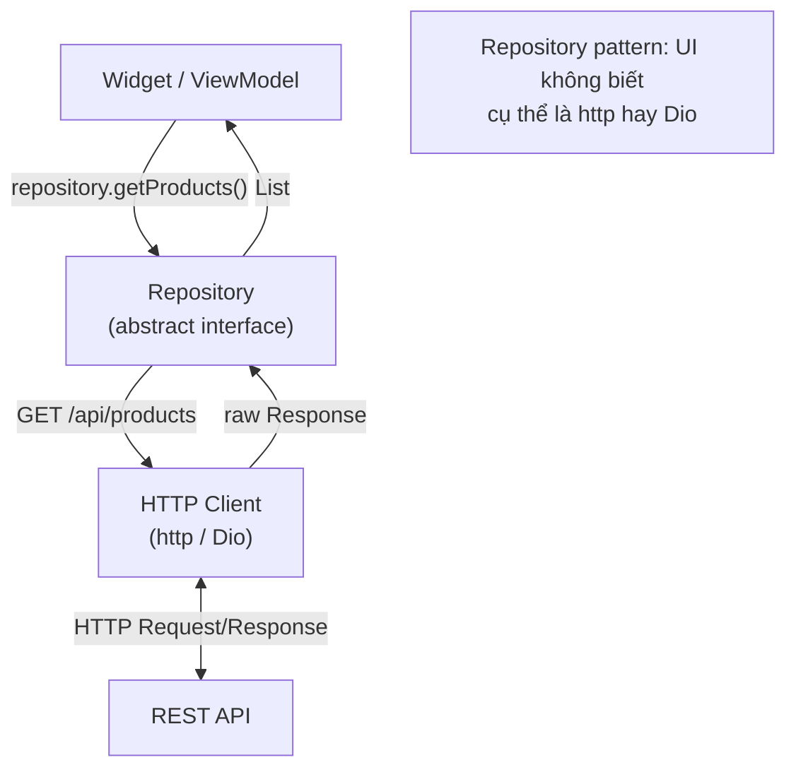

# Bài 7.2 — HTTP Client Basics

## Phần 1 — Khái Niệm & Mục Tiêu Bài Học

### Tại sao bài này quan trọng?

Hầu hết Flutter app đều kết nối API. Có hai lựa chọn chính:
- `http` package: lightweight, official-ish, đủ cho simple use case
- `Dio`: full-featured, interceptors, cancellation, form data, progress tracking

Biết khi nào dùng cái nào và cách sử dụng đúng là nền tảng cho mọi networked app.

### Bạn sẽ hiểu được sau bài này:
- `http` package: GET, POST, PUT, DELETE với error handling
- Headers, status codes, response body parsing
- `Dio`: interceptors, BaseOptions, timeouts
- Repository pattern để abstract HTTP calls

---

## Phần 2 — Cơ Chế Hoạt Động (Under the Hood)

### HTTP Client Architecture



---

## Phần 3 — Code Mẫu Chuẩn Google

### 3.1 — `http` package cơ bản

```yaml
# pubspec.yaml
dependencies:
  http: ^1.2.0
```

```dart
import 'package:http/http.dart' as http;

class SimpleApiClient {
  static const _baseUrl = 'https://jsonplaceholder.typicode.com';

  // GET request
  Future<List<Map<String, dynamic>>> getUsers() async {
    final uri = Uri.parse('$_baseUrl/users');
    final response = await http.get(
      uri,
      headers: {
        'Content-Type': 'application/json',
        'Accept': 'application/json',
      },
    );

    if (response.statusCode == 200) {
      final List<dynamic> json = jsonDecode(response.body);
      return json.cast<Map<String, dynamic>>();
    }

    throw HttpException('GET /users failed: ${response.statusCode}');
  }

  // POST request với body
  Future<Map<String, dynamic>> createPost({
    required String title,
    required String body,
    required int userId,
  }) async {
    final uri = Uri.parse('$_baseUrl/posts');
    final response = await http.post(
      uri,
      headers: {
        'Content-Type': 'application/json',
        'Authorization': 'Bearer $authToken',
      },
      body: jsonEncode({
        'title': title,
        'body': body,
        'userId': userId,
      }),
    );

    if (response.statusCode == 201) {
      return jsonDecode(response.body) as Map<String, dynamic>;
    }

    throw HttpException('POST /posts failed: ${response.statusCode}');
  }

  String get authToken => 'your-auth-token'; // From secure storage
}
```

### 3.2 — Dio — Production-ready client

```yaml
# pubspec.yaml
dependencies:
  dio: ^5.0.0
```

```dart
import 'package:dio/dio.dart';

// Singleton Dio client với config
class ApiClient {
  static final ApiClient _instance = ApiClient._();
  factory ApiClient() => _instance;
  ApiClient._();

  late final Dio _dio = Dio(
    BaseOptions(
      baseUrl: 'https://api.example.com',
      connectTimeout: const Duration(seconds: 10),
      receiveTimeout: const Duration(seconds: 30),
      headers: {
        'Content-Type': 'application/json',
        'Accept': 'application/json',
        'X-App-Version': '1.0.0',
      },
    ),
  )
    ..interceptors.add(_AuthInterceptor())
    ..interceptors.add(_LoggingInterceptor())
    ..interceptors.add(_ErrorInterceptor());

  // GET
  Future<Response<T>> get<T>(
    String path, {
    Map<String, dynamic>? queryParameters,
    Options? options,
  }) async {
    return _dio.get<T>(
      path,
      queryParameters: queryParameters,
      options: options,
    );
  }

  // POST
  Future<Response<T>> post<T>(
    String path, {
    dynamic data,
    Options? options,
  }) async {
    return _dio.post<T>(path, data: data, options: options);
  }

  // PUT
  Future<Response<T>> put<T>(String path, {dynamic data}) async {
    return _dio.put<T>(path, data: data);
  }

  // DELETE
  Future<Response<void>> delete(String path) async {
    return _dio.delete(path);
  }
}

// Auth Interceptor: tự động thêm token
class _AuthInterceptor extends Interceptor {
  @override
  void onRequest(RequestOptions options, RequestInterceptorHandler handler) {
    final token = AuthStorage.getToken();
    if (token != null) {
      options.headers['Authorization'] = 'Bearer $token';
    }
    handler.next(options); // Tiếp tục request
  }

  @override
  void onError(DioException err, ErrorInterceptorHandler handler) async {
    if (err.response?.statusCode == 401) {
      // Token expired → refresh token
      try {
        await AuthService().refreshToken();
        // Retry original request
        final retryResponse = await ApiClient()._dio.fetch(err.requestOptions);
        handler.resolve(retryResponse);
        return;
      } catch (_) {
        AuthService().logout();
      }
    }
    handler.next(err);
  }
}

// Logging Interceptor (debug only)
class _LoggingInterceptor extends Interceptor {
  @override
  void onRequest(RequestOptions options, RequestInterceptorHandler handler) {
    if (kDebugMode) {
      debugPrint('→ ${options.method} ${options.path}');
    }
    handler.next(options);
  }

  @override
  void onResponse(Response response, ResponseInterceptorHandler handler) {
    if (kDebugMode) {
      debugPrint('← ${response.statusCode} ${response.requestOptions.path}');
    }
    handler.next(response);
  }
}

// Error Interceptor: transform DioException → app exception
class _ErrorInterceptor extends Interceptor {
  @override
  void onError(DioException err, ErrorInterceptorHandler handler) {
    final appError = switch (err.type) {
      DioExceptionType.connectionTimeout ||
      DioExceptionType.receiveTimeout => const NetworkException(
          endpoint: '',
          message: 'Kết nối quá chậm',
        ),
      DioExceptionType.connectionError => const NetworkException(
          endpoint: '',
          message: 'Không có kết nối mạng',
        ),
      _ => NetworkException(
          endpoint: err.requestOptions.path,
          statusCode: err.response?.statusCode,
          message: 'Lỗi không xác định',
        ),
    };
    // Reject với app exception
    handler.reject(DioException(
      requestOptions: err.requestOptions,
      error: appError,
    ));
  }
}
```

### 3.3 — Repository Pattern

```dart
// Abstract interface: tách logic từ implementation
abstract interface class ProductRepository {
  Future<List<Product>> fetchProducts({int page = 0, int pageSize = 20});
  Future<Product> fetchProductById(String id);
  Future<Product> createProduct(CreateProductRequest request);
  Future<Product> updateProduct(String id, UpdateProductRequest request);
  Future<void> deleteProduct(String id);
}

// Concrete implementation với Dio
class ApiProductRepository implements ProductRepository {
  final ApiClient _client;

  const ApiProductRepository({ApiClient? client})
      : _client = client ?? const ApiClient();

  @override
  Future<List<Product>> fetchProducts({int page = 0, int pageSize = 20}) async {
    final response = await _client.get<List<dynamic>>(
      '/v1/products',
      queryParameters: {'page': page, 'size': pageSize},
    );

    final data = response.data;
    if (data == null) return [];

    return data
        .whereType<Map<String, dynamic>>()
        .map(Product.fromJson)
        .toList();
  }

  @override
  Future<Product> fetchProductById(String id) async {
    final response = await _client.get<Map<String, dynamic>>('/v1/products/$id');
    final data = response.data;
    if (data == null) throw const ParseException(fieldName: 'product', receivedValue: null);
    return Product.fromJson(data);
  }

  @override
  Future<Product> createProduct(CreateProductRequest request) async {
    final response = await _client.post<Map<String, dynamic>>(
      '/v1/products',
      data: request.toJson(),
    );
    return Product.fromJson(response.data!);
  }

  @override
  Future<Product> updateProduct(String id, UpdateProductRequest request) async {
    final response = await _client.put<Map<String, dynamic>>(
      '/v1/products/$id',
      data: request.toJson(),
    );
    return Product.fromJson(response.data!);
  }

  @override
  Future<void> deleteProduct(String id) async {
    await _client.delete('/v1/products/$id');
  }
}

// Mock repository cho test
class MockProductRepository implements ProductRepository {
  final List<Product> _products;
  MockProductRepository({List<Product>? products})
      : _products = products ?? _defaultProducts;

  @override
  Future<List<Product>> fetchProducts({int page = 0, int pageSize = 20}) async {
    await Future.delayed(const Duration(milliseconds: 100)); // Simulate network
    return _products.skip(page * pageSize).take(pageSize).toList();
  }

  // ... other methods

  static final List<Product> _defaultProducts = [
    Product(id: '1', name: 'Product A', price: 100000),
    Product(id: '2', name: 'Product B', price: 200000),
  ];
}
```

---

## Phần 4 — Lỗi Sai Phổ Biến & Best Practices

### ❌ Anti-pattern 1: Tạo Dio client mới mỗi lần gọi

```dart
// ❌ Sai: Tạo Dio object mới → mất interceptors, mất connection pool
Future<List<Product>> getProducts() async {
  final dio = Dio(); // Tạo mới mỗi lần!
  return dio.get('/products');
}

// ✅ Đúng: Singleton Dio instance
class ApiClient {
  static final ApiClient _instance = ApiClient._();
  factory ApiClient() => _instance;
  late final Dio _dio = Dio(BaseOptions(...));
}
```

### ❌ Anti-pattern 2: Catch DioException ở mọi nơi

```dart
// ❌ Sai: Xử lý lỗi ở UI layer — tight coupling
try {
  final products = await _repository.fetchProducts();
} on DioException catch (e) {
  // UI biết về Dio?! → coupling với HTTP client
}

// ✅ Đúng: Xử lý ở repository hoặc interceptor → trả về app exception
// Repository throws AppException, không phải DioException
```

### ❌ Anti-pattern 3: Không set timeout

```dart
// ❌ Không có timeout → chờ mãi nếu server không respond
final dio = Dio(BaseOptions(baseUrl: '...'));

// ✅ Luôn set timeout
final dio = Dio(BaseOptions(
  connectTimeout: const Duration(seconds: 10),
  receiveTimeout: const Duration(seconds: 30),
  sendTimeout: const Duration(seconds: 10),
));
```

---

## Phần 5 — Bài Tập Củng Cố Tư Duy

### Challenge: Fetch Danh Sách từ JSONPlaceholder

**Yêu cầu:**
1. Fetch `https://jsonplaceholder.typicode.com/posts` (100 posts)
2. Parse thành `Post(id, title, body, userId)` model
3. Hiển thị trong ListView
4. Handle loading, error, empty states
5. Add `Dio` với logging interceptor

**Bonus:**
- Implement pagination (load 10 posts mỗi lần)
- Pull-to-refresh với `RefreshIndicator`

### Thử Thách Tư Duy & Thẩm Định Chuyên Sâu (Conceptual & Deep-Dive Check)

> **[Junior]** — nắm khái niệm | **[Middle]** — hiểu cơ chế | **[Senior]** — hiểu Flutter internals | **[Trace Code]** — đọc code và dự đoán output

---

#### Q1 [Junior] — "Khi nào dùng `http` package, khi nào dùng `Dio`?"

**Trả lời chuẩn:**

| Feature | `http` | `Dio` |
|---|---|---|
| **Interceptors** | Không | Có |
| **Auth token refresh** | Manual, phức tạp | Built-in pattern |
| **File upload/download** | Hạn chế | Đầy đủ với progress |
| **Request cancellation** | Không | `CancelToken` |
| **Timeout** | Có | Có (granular hơn) |
| **FormData** | Không | Có |
| **Bundle size** | Nhỏ | Lớn hơn |

```dart
// Dùng http — simple GET
final response = await http.get(Uri.parse('https://api.example.com/users'));
final users = jsonDecode(response.body) as List;

// Dùng Dio — complex app
final dio = Dio(BaseOptions(
  baseUrl: 'https://api.example.com',
  connectTimeout: const Duration(seconds: 5),
  receiveTimeout: const Duration(seconds: 10),
));
final response = await dio.get('/users');
final users = response.data as List;
```

**Rule:** `http` cho simple app hoặc MVP. `Dio` cho production app cần auth, retry, logging.

---

#### Q2 [Junior] — "Interceptor trong Dio dùng để làm gì?"

**Trả lời chuẩn:**

`Interceptor` là middleware chạy **trước/sau** mỗi request/response, cho phép inject logic mà không thay đổi từng API call:

```dart
dio.interceptors.add(InterceptorsWrapper(
  // Chạy trước mỗi request
  onRequest: (options, handler) {
    final token = AuthService.getToken();
    options.headers['Authorization'] = 'Bearer $token';
    handler.next(options); // tiếp tục request
  },
  
  // Chạy khi nhận response thành công
  onResponse: (response, handler) {
    debugPrint('${response.requestOptions.method} ${response.requestOptions.path}: ${response.statusCode}');
    handler.next(response);
  },
  
  // Chạy khi có lỗi
  onError: (error, handler) async {
    if (error.response?.statusCode == 401) {
      // Token hết hạn → refresh
      await AuthService.refreshToken();
      // Retry request với token mới
      final retryResponse = await dio.fetch(error.requestOptions);
      handler.resolve(retryResponse);
    } else {
      handler.next(error); // propagate error
    }
  },
));
```

---

#### Q3 [Middle] — "Repository pattern có lợi ích gì? Cách implement cho networking?"

**Trả lời chuẩn:**

**Repository pattern** là abstraction layer giữa data source (network, database) và domain logic:

```dart
// Interface — domain không biết implementation
abstract class ProductRepository {
  Future<List<Product>> getProducts({int page = 1});
  Future<Product> getProductById(String id);
  Future<void> createProduct(Product product);
}

// Implementation dùng Dio
class DioProductRepository implements ProductRepository {
  final Dio _dio;
  DioProductRepository(this._dio);
  
  @override
  Future<List<Product>> getProducts({int page = 1}) async {
    final response = await _dio.get('/products', queryParameters: {'page': page});
    return (response.data as List).map(Product.fromJson).toList();
  }
}

// Mock implementation cho test
class MockProductRepository implements ProductRepository {
  @override
  Future<List<Product>> getProducts({int page = 1}) async {
    return [Product(id: '1', name: 'Test Product')];
  }
}

// Inject vào ViewModel
class ProductViewModel extends ChangeNotifier {
  final ProductRepository _repo; // depend on abstraction, not implementation
  ProductViewModel(this._repo);
}
```

**Lợi ích:** Swap implementation (Dio → http, network → local DB) mà không thay đổi ViewModel. Test ViewModel với Mock. Single place cho all data fetching logic.

---

#### Q4 [Senior] — "`Dio.interceptors` chain hoạt động thế nào? Flow chi tiết khi có nhiều interceptors?"

**Trả lời chuẩn:**

Dio interceptors là **chain of responsibility pattern**. Mỗi interceptor nhận request/response và quyết định `next()` (tiếp tục chain), `resolve()` (bypass tiếp theo, return response), hoặc `reject()` (propagate error):

```
Request flow (FIFO order):
  Request
  ↓ InterceptorA.onRequest()  → handler.next()
  ↓ InterceptorB.onRequest()  → handler.next()
  ↓ InterceptorC.onRequest()  → handler.next()
  ↓ [Network call]
  
Response flow (LIFO order — ngược lại):
  [Response từ server]
  ↓ InterceptorC.onResponse() → handler.next()
  ↓ InterceptorB.onResponse() → handler.next()
  ↓ InterceptorA.onResponse() → handler.next()
  ↓ [Caller nhận response]
  
Error flow:
  [Network error hoặc non-2xx status]
  ↓ InterceptorC.onError()    → handler.next() (hoặc handler.resolve() để retry)
  ↓ InterceptorB.onError()    → handler.next()
  ↓ InterceptorA.onError()    → handler.next()
  ↓ [Caller nhận DioException]
```

**Retry trong interceptor:**
```dart
onError: (error, handler) async {
  if (error.response?.statusCode == 401) {
    try {
      await _refreshToken();
      // Tạo request mới với token mới — bypass interceptors (tránh loop)
      final response = await _dio.fetch(error.requestOptions);
      handler.resolve(response); // ← bypass error interceptors phía sau
    } catch (e) {
      handler.reject(DioException(...)); // refresh thất bại
    }
  }
},
```

---

#### Q5 [Middle] — "Token refresh với Dio: implement `401 → refresh → retry` mà không leak concurrent requests?"

**Trả lời chuẩn:**

**Vấn đề race condition:** Nếu 3 requests đồng thời nhận 401, cả 3 đều try refresh token → 3 refresh calls → API có thể revoke tokens.

**Solution: Lock pattern với `Completer`:**

```dart
class AuthInterceptor extends Interceptor {
  final Dio _dio;
  bool _isRefreshing = false;
  final List<Completer<void>> _refreshCompleters = [];

  @override
  Future<void> onError(DioException error, ErrorInterceptorHandler handler) async {
    if (error.response?.statusCode != 401) {
      return handler.next(error);
    }
    
    if (_isRefreshing) {
      // Đã có refresh đang chạy — đợi nó xong
      final completer = Completer<void>();
      _refreshCompleters.add(completer);
      await completer.future; // đợi refresh xong
      // Retry với token mới
      final response = await _dio.fetch(error.requestOptions);
      return handler.resolve(response);
    }
    
    _isRefreshing = true;
    try {
      await AuthService.refreshToken();
      // Notify tất cả waiters
      for (final c in _refreshCompleters) c.complete();
      _refreshCompleters.clear();
      // Retry request này
      final response = await _dio.fetch(error.requestOptions);
      handler.resolve(response);
    } catch (e) {
      for (final c in _refreshCompleters) c.completeError(e);
      _refreshCompleters.clear();
      handler.next(error);
    } finally {
      _isRefreshing = false;
    }
  }
}
```

---

#### Q6 [Middle] — "`http.Client` cần dispose() không? Connection pooling là gì?"

**Trả lời chuẩn:**

`http.Client` nên được **disposed** khi không còn dùng để release socket connections:

```dart
// ❌ Tạo Client mỗi request — không tận dụng connection pooling
Future<void> fetchData() async {
  final client = http.Client();
  try {
    final response = await client.get(url);
    // xử lý response
  } finally {
    client.close(); // release sockets
  }
}

// ✅ Reuse Client — tận dụng connection pooling
class ApiClient {
  final http.Client _client = http.Client();
  
  Future<Map> get(String url) async {
    final response = await _client.get(Uri.parse(url));
    return jsonDecode(response.body);
  }
  
  void dispose() => _client.close(); // cleanup khi app close
}
```

**Connection pooling:** HTTP/1.1 và HTTP/2 support **keep-alive connections** — sau khi request hoàn thành, socket không đóng ngay mà được giữ trong pool. Request tiếp theo đến cùng host reuse socket đó → tiết kiệm TCP handshake overhead (~100-200ms).

`http.Client` duy trì internal socket pool. Tạo Client mới mỗi request → không có pooling → chậm hơn và tốn resources hơn.

---

#### Q7 [Trace Code] — "Request timeout vs connection timeout: xác định loại exception"

```dart
final dio = Dio(BaseOptions(
  baseUrl: 'https://api.slow-server.com',
  connectTimeout: const Duration(seconds: 3), // thời gian kết nối
  receiveTimeout: const Duration(seconds: 10), // thời gian nhận response
));

// Scenario A: Server không respond TCP handshake (server down)
try {
  final response = await dio.get('/data');
} on DioException catch (e) {
  print('Type: ${e.type}'); // ?
  print('Message: ${e.message}'); // ?
}

// Scenario B: Server kết nối OK nhưng xử lý rất chậm (>10s)
try {
  final response = await dio.get('/slow-endpoint');
} on DioException catch (e) {
  print('Type: ${e.type}'); // ?
}

// Scenario C: Server trả về 500 Internal Server Error
try {
  final response = await dio.get('/error-endpoint');
} on DioException catch (e) {
  print('Type: ${e.type}'); // ?
  print('StatusCode: ${e.response?.statusCode}'); // ?
}
```

**Kết quả:**

**Scenario A (server down, không kết nối được trong 3s):**
```
Type: DioExceptionType.connectionTimeout
Message: Connecting timed out [3000ms]
// connectTimeout bị vượt → DioExceptionType.connectionTimeout
```

**Scenario B (kết nối OK, nhưng response > 10s):**
```
Type: DioExceptionType.receiveTimeout
// Đã kết nối TCP, đang đợi response → receiveTimeout bị vượt
```

**Scenario C (500 Internal Server Error):**
```
Type: DioExceptionType.badResponse
StatusCode: 500
// Server respond với non-2xx → DioExceptionType.badResponse
// e.response != null → có thể đọc response body
```

**Lưu ý:** `DioExceptionType.connectionError` xảy ra khi có network issue (không có internet, DNS fail) — khác với timeout.
