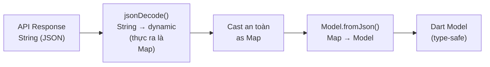

# Bài 7.3 — JSON Serialization & Models

## Phần 1 — Khái Niệm & Mục Tiêu Bài Học

### Tại sao bài này quan trọng?

JSON là ngôn ngữ chung giữa Flutter app và REST API. Nhưng từ JSON raw đến Dart model type-safe, cần:

```dart
// Raw JSON từ API:
// {"id": "abc", "name": "Flutter Book", "price": 99.0, "tags": ["dart", "flutter"]}

// Dart model:
final product = Product.fromJson(jsonDecode(response.body));
print(product.name.toUpperCase()); // Type-safe!
```

Bài này dùng **manual serialization** (không codegen) để bạn hiểu cơ chế. Production app thường dùng `json_serializable` để tự động generate code.

### Bạn sẽ hiểu được sau bài này:
- `jsonDecode`, `jsonEncode` — parse và encode JSON
- `fromJson` factory constructor pattern
- `toJson()` method
- Immutable model với `const` constructor và `copyWith`
- Parse nested JSON một cách an toàn

---

## Phần 2 — Cơ Chế Hoạt Động (Under the Hood)

### JSON → Dart Type Mapping

```
JSON          → Dart
null          → null
true/false    → bool
number (int)  → int
number (float) → double
"string"      → String
[...]         → List<dynamic>
{...}         → Map<String, dynamic>
```



---

## Phần 3 — Code Mẫu Chuẩn Google

### 3.1 — Model cơ bản với fromJson/toJson

```dart
import 'dart:convert';

// Immutable model (best practice)
class Product {
  final String id;
  final String name;
  final double price;
  final String? imageUrl;
  final List<String> tags;
  final ProductCategory category;
  final DateTime createdAt;

  const Product({
    required this.id,
    required this.name,
    required this.price,
    this.imageUrl,
    required this.tags,
    required this.category,
    required this.createdAt,
  });

  // Factory constructor fromJson — parse từ Map
  factory Product.fromJson(Map<String, dynamic> json) {
    return Product(
      id: json['id'] as String,
      name: json['name'] as String,
      price: (json['price'] as num).toDouble(), // num vì có thể là int hoặc double
      imageUrl: json['image_url'] as String?,   // Nullable — safe cast
      tags: (json['tags'] as List<dynamic>?)
              ?.map((e) => e as String)
              .toList() ?? [], // Default empty list nếu null
      category: ProductCategory.fromJson(
        json['category'] as Map<String, dynamic>,
      ),
      createdAt: DateTime.parse(json['created_at'] as String),
    );
  }

  // toJson — serialize về Map
  Map<String, dynamic> toJson() {
    return {
      'id': id,
      'name': name,
      'price': price,
      if (imageUrl != null) 'image_url': imageUrl, // Chỉ include nếu không null
      'tags': tags,
      'category': category.toJson(),
      'created_at': createdAt.toIso8601String(),
    };
  }

  // copyWith — immutable update pattern
  Product copyWith({
    String? id,
    String? name,
    double? price,
    String? imageUrl,
    List<String>? tags,
    ProductCategory? category,
    DateTime? createdAt,
  }) {
    return Product(
      id: id ?? this.id,
      name: name ?? this.name,
      price: price ?? this.price,
      imageUrl: imageUrl ?? this.imageUrl,
      tags: tags ?? this.tags,
      category: category ?? this.category,
      createdAt: createdAt ?? this.createdAt,
    );
  }

  // Equality để detect changes (dùng trong updateShouldNotify, ==)
  @override
  bool operator==(Object other) =>
      identical(this, other) ||
      other is Product &&
          runtimeType == other.runtimeType &&
          id == other.id &&
          name == other.name &&
          price == other.price;

  @override
  int get hashCode => Object.hash(id, name, price);

  @override
  String toString() => 'Product(id: $id, name: $name, price: $price)';
}

class ProductCategory {
  final String id;
  final String name;

  const ProductCategory({required this.id, required this.name});

  factory ProductCategory.fromJson(Map<String, dynamic> json) {
    return ProductCategory(
      id: json['id'] as String,
      name: json['name'] as String,
    );
  }

  Map<String, dynamic> toJson() => {'id': id, 'name': name};
}
```

### 3.2 — Parse List và Nested Objects an toàn

```dart
// Parse từ API response
class ProductApiResponse {
  final List<Product> items;
  final int total;
  final int page;
  final int pageSize;
  final bool hasMore;

  const ProductApiResponse({
    required this.items,
    required this.total,
    required this.page,
    required this.pageSize,
    required this.hasMore,
  });

  factory ProductApiResponse.fromJson(Map<String, dynamic> json) {
    // Parse nested list — quan trọng: cast đúng type
    final rawItems = json['items'];
    final List<Product> items;

    if (rawItems is List) {
      items = rawItems
          .whereType<Map<String, dynamic>>() // Filter ra items không phải Map
          .map(Product.fromJson)
          .toList();
    } else {
      items = [];
    }

    return ProductApiResponse(
      items: items,
      total: json['total'] as int? ?? 0,
      page: json['page'] as int? ?? 0,
      pageSize: json['page_size'] as int? ?? 20,
      hasMore: json['has_more'] as bool? ?? false,
    );
  }
}

// Sử dụng trong repository
Future<ProductApiResponse> fetchProducts({int page = 0}) async {
  final response = await _client.get('/v1/products?page=$page');
  final json = response.data as Map<String, dynamic>;
  return ProductApiResponse.fromJson(json);
}
```

### 3.3 — Type-safe JSON parsing utilities

```dart
// Extension để parse JSON an toàn, không throw
extension JsonExt on Map<String, dynamic> {
  String getString(String key, {String defaultValue = ''}) {
    return (this[key] as String?) ?? defaultValue;
  }

  int getInt(String key, {int defaultValue = 0}) {
    return (this[key] as int?) ?? defaultValue;
  }

  double getDouble(String key, {double defaultValue = 0}) {
    return (this[key] as num?)?.toDouble() ?? defaultValue;
  }

  bool getBool(String key, {bool defaultValue = false}) {
    return (this[key] as bool?) ?? defaultValue;
  }

  DateTime? getDateTime(String key) {
    final raw = this[key] as String?;
    if (raw == null) return null;
    return DateTime.tryParse(raw);
  }

  List<T> getList<T>(String key, T Function(dynamic) transform) {
    final raw = this[key];
    if (raw is! List) return [];
    return raw.map(transform).toList();
  }
}

// Model dùng extension — much cleaner
class UserProfile {
  final String id;
  final String name;
  final String email;
  final int age;
  final bool isPremium;
  final DateTime? lastSeen;
  final List<String> roles;

  const UserProfile({
    required this.id,
    required this.name,
    required this.email,
    required this.age,
    required this.isPremium,
    this.lastSeen,
    required this.roles,
  });

  factory UserProfile.fromJson(Map<String, dynamic> json) {
    return UserProfile(
      id: json.getString('id'),
      name: json.getString('name', defaultValue: 'Unknown'),
      email: json.getString('email'),
      age: json.getInt('age'),
      isPremium: json.getBool('is_premium'),
      lastSeen: json.getDateTime('last_seen'),
      roles: json.getList('roles', (r) => r as String),
    );
  }
}
```

### 3.4 — encode/decode và string conversion

```dart
class JsonHelper {
  // Encode model → JSON string
  static String encode(Object model) {
    if (model is Product) {
      return jsonEncode(model.toJson());
    }
    throw ArgumentError('Unknown model type: ${model.runtimeType}');
  }

  // Decode JSON string → Map
  static Map<String, dynamic> decode(String jsonString) {
    final dynamic decoded = jsonDecode(jsonString);
    if (decoded is! Map<String, dynamic>) {
      throw FormatException('Expected JSON object, got ${decoded.runtimeType}');
    }
    return decoded;
  }

  // Safe decode — không throw
  static Map<String, dynamic>? tryDecode(String jsonString) {
    try {
      return decode(jsonString);
    } on FormatException {
      return null;
    }
  }
}

// Lưu model vào SharedPreferences
Future<void> saveProduct(Product product) async {
  final prefs = await SharedPreferences.getInstance();
  await prefs.setString('last_viewed_product', jsonEncode(product.toJson()));
}

// Load model từ SharedPreferences
Future<Product?> loadLastProduct() async {
  final prefs = await SharedPreferences.getInstance();
  final jsonStr = prefs.getString('last_viewed_product');
  if (jsonStr == null) return null;

  final json = JsonHelper.tryDecode(jsonStr);
  if (json == null) return null;

  return Product.fromJson(json);
}
```

---

## Phần 4 — Lỗi Sai Phổ Biến & Best Practices

### ❌ Anti-pattern 1: Không cast type — dùng dynamic

```dart
// ❌ Nguy hiểm: Không có type check → runtime crash
factory Product.fromJson(dynamic json) {
  return Product(
    id: json['id'],           // dynamic → có thể null, có thể wrong type
    name: json['name'],       // Không có compile-time check
    price: json['price'],     // int? double? String? → crash khi dùng
  );
}

// ✅ Đúng: Cast tường minh
factory Product.fromJson(Map<String, dynamic> json) {
  return Product(
    id: json['id'] as String,       // Explicit cast → rõ ràng
    name: json['name'] as String,
    price: (json['price'] as num).toDouble(), // num → double an toàn
  );
}
```

### ❌ Anti-pattern 2: Mutable model — fields không final

```dart
// ❌ Sai: Mutable model → unexpected mutation, khó debug
class Product {
  String id;   // Non-final → có thể thay đổi bất kỳ lúc nào!
  String name;
  double price;
}

// ✅ Đúng: Immutable model với copyWith
class Product {
  final String id;
  final String name;
  final double price;

  const Product({required this.id, required this.name, required this.price});

  Product copyWith({String? id, String? name, double? price}) => Product(
    id: id ?? this.id,
    name: name ?? this.name,
    price: price ?? this.price,
  );
}
```

### ❌ Anti-pattern 3: Parse trong Widget build()

```dart
// ❌ Sai: Parse JSON trong build() → expensive CPU mỗi rebuild
Widget build(BuildContext context) {
  final product = Product.fromJson(jsonDecode(rawJson)); // Parse mỗi build!
  return Text(product.name);
}

// ✅ Đúng: Parse một lần trong initState hoặc repository
// Truyền model object (đã parse) vào widget
```

---

## Phần 5 — Bài Tập Củng Cố Tư Duy

### Challenge: Parse Nested JSON API Response

**API Response (JSONPlaceholder):**
```json
{
  "userId": 1,
  "id": 1,
  "title": "sunt aut facere repellat...",
  "body": "quia et suscipit..."
}
```

**Nhiệm vụ:**
1. Tạo `Post` model với `fromJson/toJson/copyWith`
2. Fetch 100 posts từ `jsonplaceholder.typicode.com/posts`
3. Parse tất cả thành `List<Post>`
4. Tạo `PostListResponse` với total count

**Mở rộng:**
- Thêm nested `User` object (fetch `/users/:id`)
- Cache posts vào SharedPreferences
- Implement offline-first: hiển thị cache trước, load fresh sau

### Câu hỏi phỏng vấn liên quan:

1. **"Sự khác biệt giữa manual serialization và `json_serializable`?"**
   - Manual: hiểu cơ chế, không cần build_runner, nhiều boilerplate
   - `json_serializable`: generate code tự động, ít lỗi, cần `build_runner`

2. **"Tại sao model phải immutable?"**
   - Dễ reason về state changes
   - `copyWith` tạo object mới → Flutter có thể detect thay đổi
   - Thread-safe hơn (no shared mutable state)

3. **"Tại sao dùng `(json['price'] as num).toDouble()` thay vì `json['price'] as double`?"**
   - JSON không phân biệt int và float: `99` → int, `99.0` → double
   - `as double` crash nếu server gửi `99` (int)
   - `as num` accept cả hai, `.toDouble()` convert an toàn
