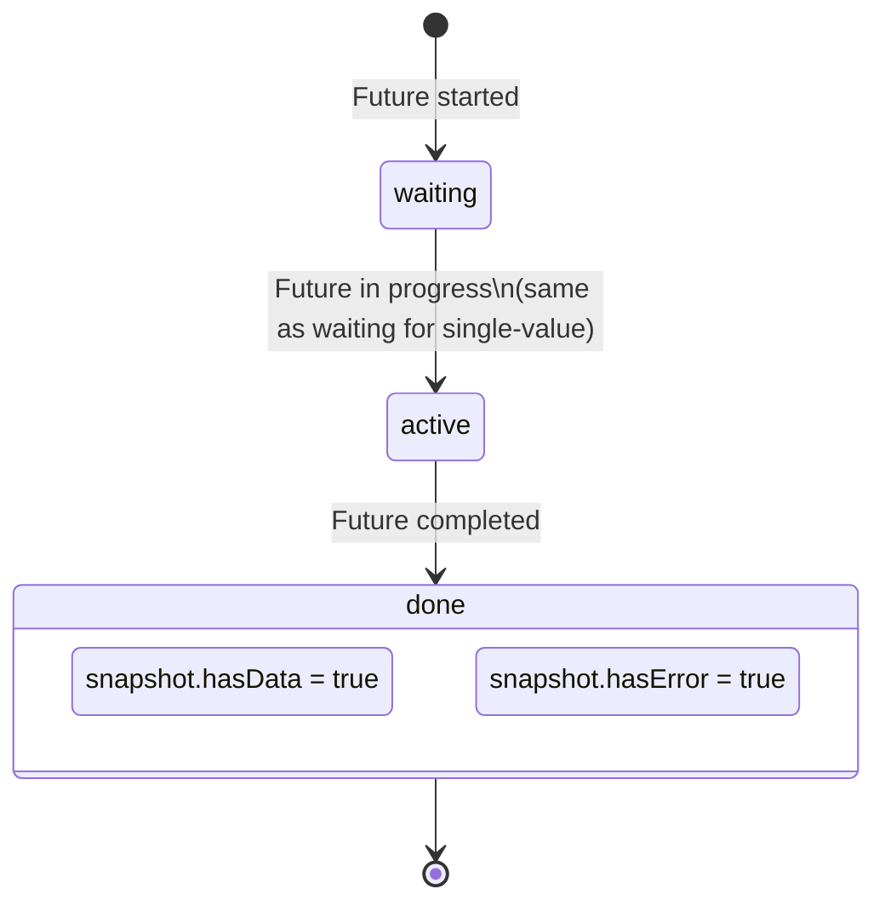

# Bài 7.4 — FutureBuilder & StreamBuilder

## Phần 1 — Khái Niệm & Mục Tiêu Bài Học

### Tại sao bài này quan trọng?

Flutter cung cấp hai widget built-in để kết nối async data với UI:
- `FutureBuilder<T>`: cho one-shot async operation (HTTP request, DB query)
- `StreamBuilder<T>`: cho ongoing data stream (Firebase, WebSocket, timer)

Anti-pattern phổ biến nhất với FutureBuilder:

```dart
// ❌ Bug: Tạo Future trong build() → Future mới mỗi rebuild → reset về loading state
Widget build(BuildContext context) {
  return FutureBuilder(
    future: fetchProducts(), // ← Tạo mới mỗi lần build()!
    builder: (_, snapshot) => ...,
  );
}
```

### Bạn sẽ hiểu được sau bài này:
- `ConnectionState` và `AsyncSnapshot` — các trạng thái của async data
- Anti-pattern: tạo Future trong `build()` → giải pháp với `late Future`
- `StreamBuilder`: realtime data với Firestore, WebSocket
- Pattern kết hợp với ViewModel/ChangeNotifier

---

## Phần 2 — Cơ Chế Hoạt Động (Under the Hood)

### FutureBuilder Lifecycle



### ConnectionState values

```dart
enum ConnectionState {
  none,     // Không có Future/Stream
  waiting,  // Đang chờ Future hoặc chờ data đầu tiên từ Stream
  active,   // Stream đang active, đã nhận ít nhất 1 value (Stream only)
  done,     // Future completed hoặc Stream closed
}
```

### AsyncSnapshot

```dart
AsyncSnapshot<T> {
  ConnectionState connectionState;
  T? data;          // Giá trị nếu có
  Object? error;    // Lỗi nếu có
  StackTrace? stackTrace;

  bool get hasData => data != null;
  bool get hasError => error != null;
  T get requireData => data!; // Throws nếu null
}
```

---

## Phần 3 — Code Mẫu Chuẩn Google

### 3.1 — FutureBuilder đúng cách

```dart
class ProductListScreen extends StatefulWidget {
  const ProductListScreen({super.key});
  @override State<ProductListScreen> createState() => _ProductListState();
}

class _ProductListState extends State<ProductListScreen> {
  // ✅ late Future: tạo một lần trong initState, không tạo lại mỗi build
  late final Future<List<Product>> _productsFuture;

  @override
  void initState() {
    super.initState();
    // Assign một lần — stable reference cho FutureBuilder
    _productsFuture = ProductRepository().fetchProducts();
  }

  Future<void> _refresh() async {
    // Khi pull-to-refresh: tạo Future mới và setState
    setState(() {
      _productsFuture = ProductRepository().fetchProducts();
    });
  }

  @override
  Widget build(BuildContext context) {
    return Scaffold(
      appBar: AppBar(title: const Text('Sản phẩm')),
      body: RefreshIndicator(
        onRefresh: _refresh,
        child: FutureBuilder<List<Product>>(
          future: _productsFuture, // Stable reference — không tạo mới
          builder: (context, snapshot) {
            return switch (snapshot.connectionState) {
              // Chưa bắt đầu hoặc đang chờ
              ConnectionState.none || ConnectionState.waiting =>
                  const Center(child: CircularProgressIndicator()),

              // Hoàn thành (có data hoặc error)
              ConnectionState.done => snapshot.hasError
                  ? _buildError(snapshot.error!)
                  : snapshot.hasData && snapshot.data!.isNotEmpty
                      ? _buildProductList(snapshot.data!)
                      : const Center(child: Text('Không có sản phẩm')),

              // active chỉ xảy ra với Stream, không với Future
              _ => const SizedBox.shrink(),
            };
          },
        ),
      ),
    );
  }

  Widget _buildError(Object error) {
    return Center(
      child: Column(
        mainAxisAlignment: MainAxisAlignment.center,
        children: [
          const Icon(Icons.error_outline, size: 64, color: Colors.red),
          const SizedBox(height: 16),
          Text('Lỗi: $error', textAlign: TextAlign.center),
          const SizedBox(height: 16),
          ElevatedButton(
            onPressed: _refresh,
            child: const Text('Thử lại'),
          ),
        ],
      ),
    );
  }

  Widget _buildProductList(List<Product> products) {
    return ListView.builder(
      itemCount: products.length,
      itemBuilder: (_, i) => ProductTile(product: products[i]),
    );
  }
}
```

### 3.2 — StreamBuilder — Realtime data

```dart
class RealtimeOrdersScreen extends StatelessWidget {
  const RealtimeOrdersScreen({super.key});

  @override
  Widget build(BuildContext context) {
    return Scaffold(
      appBar: AppBar(title: const Text('Đơn hàng realtime')),
      body: StreamBuilder<List<Order>>(
        // Stream từ Firestore hoặc WebSocket
        stream: OrderRepository().watchActiveOrders(),
        builder: (context, snapshot) {
          // Xử lý tất cả ConnectionState
          switch (snapshot.connectionState) {
            case ConnectionState.none:
              return const Center(child: Text('Chưa kết nối'));

            case ConnectionState.waiting:
              // Chưa có data đầu tiên
              return const Center(child: CircularProgressIndicator());

            case ConnectionState.active:
              if (snapshot.hasError) {
                return Center(child: Text('Lỗi: ${snapshot.error}'));
              }
              if (!snapshot.hasData || snapshot.data!.isEmpty) {
                return const Center(child: Text('Chưa có đơn hàng'));
              }
              return _buildOrderList(snapshot.requireData);

            case ConnectionState.done:
              // Stream đã đóng
              return const Center(child: Text('Kết nối đã đóng'));
          }
        },
      ),
    );
  }

  Widget _buildOrderList(List<Order> orders) {
    return ListView.builder(
      itemCount: orders.length,
      itemBuilder: (context, i) {
        final order = orders[i];
        return ListTile(
          title: Text('Đơn #${order.id}'),
          subtitle: Text(order.status.label),
          trailing: Text('${order.total.toStringAsFixed(0)}đ'),
          leading: Icon(
            order.status.icon,
            color: order.status.color,
          ),
        );
      },
    );
  }
}
```

### 3.3 — Kết hợp với ViewModel

```dart
// Thay vì dùng FutureBuilder trực tiếp → dùng ChangeNotifier
// → Tách business logic khỏi UI, dễ test hơn

class ProductViewModel extends ChangeNotifier {
  UiState<List<Product>> _state = const Initial();
  UiState<List<Product>> get state => _state;

  final ProductRepository _repository;
  ProductViewModel({ProductRepository? repository})
      : _repository = repository ?? ProductRepository();

  Future<void> loadProducts() async {
    _state = const Loading();
    notifyListeners();

    try {
      final products = await _repository.fetchProducts();
      _state = products.isEmpty
          ? const Success([])
          : Success(products);
    } catch (e) {
      _state = Failure(message: e.toString());
    }

    notifyListeners();
  }
}

// Widget: lắng nghe ViewModel, không cần FutureBuilder
class ProductListWithViewModel extends StatelessWidget {
  const ProductListWithViewModel({super.key});

  @override
  Widget build(BuildContext context) {
    return ChangeNotifierProvider(
      create: (_) => ProductViewModel()..loadProducts(),
      child: Scaffold(
        appBar: AppBar(title: const Text('Sản phẩm')),
        body: Consumer<ProductViewModel>(
          builder: (context, vm, _) => switch (vm.state) {
            Initial() => const SizedBox.shrink(),
            Loading() => const Center(child: CircularProgressIndicator()),
            Success(:final data) when data.isEmpty =>
                const Center(child: Text('Chưa có sản phẩm')),
            Success(:final data) => ListView.builder(
                itemCount: data.length,
                itemBuilder: (_, i) => ProductTile(product: data[i]),
              ),
            Failure(:final message) => Center(
                child: Column(
                  mainAxisAlignment: MainAxisAlignment.center,
                  children: [
                    Text('Lỗi: $message'),
                    ElevatedButton(
                      onPressed: () => context.read<ProductViewModel>().loadProducts(),
                      child: const Text('Thử lại'),
                    ),
                  ],
                ),
              ),
          },
        ),
      ),
    );
  }
}
```

---

## Phần 4 — Lỗi Sai Phổ Biến & Best Practices

### ❌ Anti-pattern 1: Tạo Future trong `build()`

```dart
// ❌ Bug nghiêm trọng: fetchProducts() được gọi mỗi build
Widget build(BuildContext context) {
  return FutureBuilder(
    future: fetchProducts(), // 💥 Mỗi setState → tạo Future mới → loading lại!
    builder: (_, snapshot) => ...,
  );
}

// ✅ Fix 1: late Future trong State
class _State extends State<MyWidget> {
  late final Future<List<Product>> _future;
  @override void initState() {
    super.initState();
    _future = fetchProducts(); // Tạo một lần
  }
  // FutureBuilder dùng _future
}

// ✅ Fix 2: ViewModel với ChangeNotifier (xem section 3.3)
```

### ❌ Anti-pattern 2: Không handle tất cả ConnectionState

```dart
// ❌ Thiếu: Không handle null data khi done
FutureBuilder<List<Product>>(
  future: _future,
  builder: (_, snapshot) {
    if (snapshot.hasError) return ErrorWidget();
    if (snapshot.hasData) return ProductList(snapshot.data!); // OK
    return LoadingWidget();
    // Bug: snapshot.connectionState == done nhưng data == null → stuck ở loading!
  },
)

// ✅ Đúng: Explicit handle done state
builder: (_, snapshot) {
  if (snapshot.connectionState == ConnectionState.waiting) return LoadingWidget();
  if (snapshot.connectionState == ConnectionState.done) {
    if (snapshot.hasError) return ErrorWidget();
    if (snapshot.hasData) return ProductList(snapshot.data!);
    return EmptyWidget(); // done nhưng data null (uncommon nhưng có thể)
  }
  return LoadingWidget();
}
```

### ❌ Anti-pattern 3: `snapshot.data!` không check

```dart
// ❌ Crash nếu data null
builder: (_, snapshot) => ProductList(products: snapshot.data!),

// ✅ Đúng
builder: (_, snapshot) {
  if (!snapshot.hasData) return const LoadingWidget();
  return ProductList(products: snapshot.requireData); // requireData throw nếu null
}
```

---

## Phần 5 — Bài Tập Củng Cố Tư Duy

### Challenge: Refactor FutureBuilder An Toàn với `late Future`

**Code có bug:**
```dart
class BuggyScreen extends StatelessWidget {
  @override
  Widget build(BuildContext context) {
    return FutureBuilder<String>(
      future: someExpensiveOperation(), // ← Bug!
      builder: (_, snapshot) => Text(snapshot.data ?? '...'),
    );
  }
}
```

**Nhiệm vụ:**
1. Convert sang `StatefulWidget`
2. Move future initialization vào `initState()`
3. Handle tất cả `ConnectionState`
4. Thêm refresh button
5. Thêm error retry

### Thử Thách Tư Duy & Thẩm Định Chuyên Sâu (Conceptual & Deep-Dive Check)

> **[Junior]** — nắm khái niệm | **[Middle]** — hiểu cơ chế | **[Senior]** — hiểu Flutter internals | **[Trace Code]** — đọc code và dự đoán output

---

#### Q1 [Junior] — "Tại sao không tạo `Future` trực tiếp trong `build()`?"

**Trả lời chuẩn:**

Mỗi lần `build()` được gọi → một `Future` mới được tạo → `FutureBuilder` reset về `ConnectionState.waiting` → UI thấy loading lại:

```dart
// ❌ Bug: Future trong build()
@override
Widget build(BuildContext context) {
  return FutureBuilder<User>(
    future: repository.fetchUser(), // ← tạo Future MỚI mỗi rebuild
    builder: (ctx, snapshot) {
      if (snapshot.connectionState == ConnectionState.waiting) {
        return const CircularProgressIndicator(); // ← flash mỗi rebuild!
      }
      return Text(snapshot.data?.name ?? '');
    },
  );
}
// Mỗi lần parent setState() → build() → Future mới → loading flash!

// ✅ Đúng: Future trong initState
late Future<User> _userFuture;

@override
void initState() {
  super.initState();
  _userFuture = repository.fetchUser(); // ← tạo 1 lần
}

@override
Widget build(BuildContext context) {
  return FutureBuilder<User>(
    future: _userFuture, // ← reuse Future
    builder: (ctx, snapshot) { ... },
  );
}
```

---

#### Q2 [Junior] — "Sự khác biệt giữa `snapshot.hasData` và `snapshot.data != null`?"

**Trả lời chuẩn:**

`hasData` là shorthand getter: `bool get hasData => data != null;` — chúng hoàn toàn tương đương.

**Nhưng cần kết hợp với `connectionState` để UI đúng:**

```dart
builder: (ctx, snapshot) {
  // ❌ Thiếu state check — có thể show lỗi ngay cả khi loading
  if (snapshot.hasError) return Text('Error: ${snapshot.error}');
  if (snapshot.hasData) return Text(snapshot.data!.name);
  return const CircularProgressIndicator();
  // Vấn đề: khi loading, không có data và không có error → CircularProgress
  // Nhưng khi Future chưa start → waiting state nhưng snapshot.data = null

  // ✅ Đầy đủ state machine
  switch (snapshot.connectionState) {
    case ConnectionState.none:
      return const Text('No future provided');
    case ConnectionState.waiting:
      return const CircularProgressIndicator();
    case ConnectionState.active:
      return Text('${snapshot.data}'); // cho Stream
    case ConnectionState.done:
      if (snapshot.hasError) return Text('Error: ${snapshot.error}');
      return Text(snapshot.data!.name);
  }
}
```

---

#### Q3 [Middle] — "Khi nào dùng `FutureBuilder` vs `ViewModel + Provider`?"

**Trả lời chuẩn:**

| | `FutureBuilder` | `ViewModel + Provider` |
|---|---|---|
| **State sharing** | Không — local to widget | Có — shared across widgets |
| **Caching** | Không — refetch khi widget rebuild | Có — ViewModel giữ data |
| **Business logic** | Không | Có — trong ViewModel |
| **Testing** | Khó | Dễ — test ViewModel independent |
| **Error retry** | Phải rebuild widget | `viewModel.retry()` |

```dart
// FutureBuilder — simple, one-off
// Dùng cho: Avatar URL, thông tin tĩnh, không cần share
FutureBuilder<String>(
  future: getUserAvatarUrl(userId),
  builder: (ctx, snapshot) => snapshot.hasData
      ? Image.network(snapshot.data!)
      : const CircleAvatar(),
)

// ViewModel + Provider — complex, shared
// Dùng cho: product list, cart, user profile — cần share, cần retry
class ProductViewModel extends ChangeNotifier {
  List<Product>? _products;
  bool _isLoading = false;
  String? _error;
  
  Future<void> loadProducts() async {
    _isLoading = true;
    notifyListeners();
    try {
      _products = await repository.getProducts();
    } catch (e) {
      _error = e.toString();
    } finally {
      _isLoading = false;
      notifyListeners();
    }
  }
}
```

---

#### Q4 [Senior] — "`FutureBuilder` lifecycle: `ConnectionState` transitions là gì?"

**Trả lời chuẩn:**

`FutureBuilder` là `StatefulWidget` — nó duy trì `AsyncSnapshot<T>` và update khi Future state thay đổi:

**State machine:**

```
Lúc build() chạy lần đầu:
  future == null → ConnectionState.none, data = null
  future != null → ConnectionState.waiting, data = null
  
  FutureBuilder.addListener(future)  ← subscribe to Future

Khi Future complete thành công:
  ConnectionState.done, data = result, error = null
  FutureBuilder.setState() → rebuild

Khi Future complete với error:
  ConnectionState.done, data = null, error = exception
  FutureBuilder.setState() → rebuild
```

**Quan trọng — `initialData`:**
```dart
FutureBuilder<List<Product>>(
  future: _productsFuture,
  initialData: const [],   // ← show immediately, không có loading flash
  builder: (ctx, snapshot) {
    // snapshot.connectionState = waiting nhưng snapshot.data = [] (not null)
    // hasData = true ngay từ đầu → không show loading nếu có initialData
    return ListView(...);
  },
)
```

**`ConnectionState.active`:** Chỉ dùng cho `StreamBuilder` — Stream emit nhiều events. Future chỉ có `waiting` và `done`.

---

#### Q5 [Middle] — "`StreamBuilder` vs `StreamBuilder` với `initialData`: khi nào nên cung cấp `initialData`?"

**Trả lời chuẩn:**

```dart
// Không có initialData — loading state ở đầu
StreamBuilder<List<Message>>(
  stream: chatRepository.messages,
  builder: (ctx, snapshot) {
    if (!snapshot.hasData) return const CircularProgressIndicator();
    return MessageList(messages: snapshot.data!);
  },
)
// Khi stream chưa emit → loading spinner

// Với initialData — không có loading flash
StreamBuilder<List<Message>>(
  stream: chatRepository.messages,
  initialData: cachedMessages, // ← từ local storage hoặc cache
  builder: (ctx, snapshot) {
    return MessageList(messages: snapshot.data!); // luôn có data
  },
)
```

**Khi nên dùng `initialData`:**
- Có data cached sẵn (local database, shared preferences)
- Stream luôn emit nhanh và không muốn loading flicker
- Offline-first app: show cached data → update khi online

**Khi không nên:**
- Stream là nguồn data duy nhất (không có cache)
- Loading state quan trọng với UX (progress indicator)
- `initialData` có thể stale so với stream data đầu tiên

---

#### Q6 [Middle] — "Tại sao `FutureBuilder` không cancel Future khi widget dispose? Hậu quả?"

**Trả lời chuẩn:**

Dart Futures **không thể cancel** — đây là design decision của Dart (khác với JavaScript Promise hay Kotlin Coroutine). Khi `FutureBuilder` widget dispose, nó chỉ stop listening nhưng Future vẫn tiếp tục chạy.

**Hậu quả:**
1. **Memory usage:** Future và callbacks vẫn occupy memory cho đến khi complete
2. **Side effects tiếp tục:** HTTP request vẫn chạy dù user đã navigate away — băng thông bị lãng phí
3. **setState sau dispose:** Nếu Future callback gọi `setState` → error (nhưng `FutureBuilder` đã handle điều này — nó check `mounted` trước khi update)

**Workarounds:**
```dart
// 1. Dio CancelToken — cancel HTTP request
class _ProductPageState extends State<ProductPage> {
  CancelToken? _cancelToken;
  
  @override
  void initState() {
    super.initState();
    _cancelToken = CancelToken();
    _future = dio.get('/products', cancelToken: _cancelToken).then(...);
  }
  
  @override
  void dispose() {
    _cancelToken?.cancel('widget disposed'); // cancel request
    super.dispose();
  }
}

// 2. Dùng async* + StreamBuilder — stream có thể cancel qua subscription
// 3. Dùng ViewModel + mounted check pattern
```

---

#### Q7 [Trace Code] — "Future được tạo trong `build()` vs `initState()`: behavior khác nhau thế nào?"

```dart
// Version A: Future trong build()
class VersionA extends StatefulWidget {
  const VersionA({super.key});
  @override State<VersionA> createState() => _VersionAState();
}

class _VersionAState extends State<VersionA> {
  int _counter = 0; // state khác không liên quan

  @override
  Widget build(BuildContext context) {
    return Column(children: [
      FutureBuilder<String>(
        future: Future.delayed(const Duration(seconds: 2), () => 'Hello'), // trong build!
        builder: (ctx, snapshot) {
          if (!snapshot.hasData) return const CircularProgressIndicator();
          return Text(snapshot.data!);
        },
      ),
      ElevatedButton(
        onPressed: () => setState(() => _counter++), // trigger rebuild
        child: Text('Tap: $_counter'),
      ),
    ]);
  }
}

// Version B: Future trong initState()
class _VersionBState extends State<VersionB> {
  int _counter = 0;
  late Future<String> _future;
  
  @override
  void initState() {
    super.initState();
    _future = Future.delayed(const Duration(seconds: 2), () => 'Hello');
  }
  
  @override
  Widget build(BuildContext context) {
    return Column(children: [
      FutureBuilder<String>(
        future: _future, // stable reference
        builder: (ctx, snapshot) {
          if (!snapshot.hasData) return const CircularProgressIndicator();
          return Text(snapshot.data!);
        },
      ),
      ElevatedButton(
        onPressed: () => setState(() => _counter++),
        child: Text('Tap: $_counter'),
      ),
    ]);
  }
}
```

**Kịch bản: App load → tap button sau 1 giây (trước khi Future complete)**

**Version A:**
- Load: CircularProgressIndicator hiện
- Tap button → `setState()` → `build()` → **Future MỚI được tạo** → FutureBuilder reset → loading từ đầu (2 giây nữa)
- Tap lần 2 → loading lại từ đầu → **infinite loading!**

**Version B:**
- Load: CircularProgressIndicator hiện
- Tap button → `setState()` → `build()` → `_future` là cùng reference → FutureBuilder **không reset** → tiếp tục đếm thời gian còn lại
- Sau 2 giây tổng: "Hello" hiện — không bị interrupt bởi tap

**Output thực tế:**
- Version A: tap → loading restart mỗi lần → "Hello" không bao giờ hiện nếu tap liên tục
- Version B: tap không ảnh hưởng → "Hello" hiện sau đúng 2 giây từ lúc load
