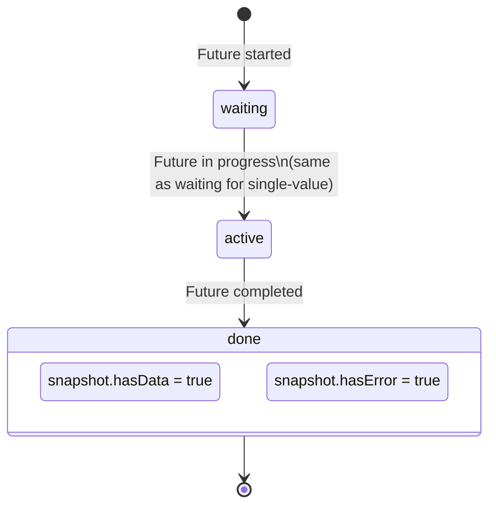

# Bài 7.4 — FutureBuilder & StreamBuilder

## Phần 1 — Khái Niệm & Mục Tiêu Bài Học

### Tại sao bài này quan trọng?

Flutter cung cấp hai widget built-in để kết nối async data với UI:
- `FutureBuilder<T>`: cho one-shot async operation (HTTP request, DB query)
- `StreamBuilder<T>`: cho ongoing data stream (Firebase, WebSocket, timer)

Anti-pattern phổ biến nhất với FutureBuilder:

```dart
// ❌ Bug: Tạo Future trong build() → Future mới mỗi rebuild → reset về loading state
Widget build(BuildContext context) {
  return FutureBuilder(
    future: fetchProducts(), // ← Tạo mới mỗi lần build()!
    builder: (_, snapshot) => ...,
  );
}
```

### Bạn sẽ hiểu được sau bài này:
- `ConnectionState` và `AsyncSnapshot` — các trạng thái của async data
- Anti-pattern: tạo Future trong `build()` → giải pháp với `late Future`
- `StreamBuilder`: realtime data với Firestore, WebSocket
- Pattern kết hợp với ViewModel/ChangeNotifier

---

## Phần 2 — Cơ Chế Hoạt Động (Under the Hood)

### FutureBuilder Lifecycle



### ConnectionState values

```dart
enum ConnectionState {
  none,     // Không có Future/Stream
  waiting,  // Đang chờ Future hoặc chờ data đầu tiên từ Stream
  active,   // Stream đang active, đã nhận ít nhất 1 value (Stream only)
  done,     // Future completed hoặc Stream closed
}
```

### AsyncSnapshot

```dart
AsyncSnapshot<T> {
  ConnectionState connectionState;
  T? data;          // Giá trị nếu có
  Object? error;    // Lỗi nếu có
  StackTrace? stackTrace;

  bool get hasData => data != null;
  bool get hasError => error != null;
  T get requireData => data!; // Throws nếu null
}
```

---

## Phần 3 — Code Mẫu Chuẩn Google

### 3.1 — FutureBuilder đúng cách

```dart
class ProductListScreen extends StatefulWidget {
  const ProductListScreen({super.key});
  @override State<ProductListScreen> createState() => _ProductListState();
}

class _ProductListState extends State<ProductListScreen> {
  // ✅ late Future: tạo một lần trong initState, không tạo lại mỗi build
  late final Future<List<Product>> _productsFuture;

  @override
  void initState() {
    super.initState();
    // Assign một lần — stable reference cho FutureBuilder
    _productsFuture = ProductRepository().fetchProducts();
  }

  Future<void> _refresh() async {
    // Khi pull-to-refresh: tạo Future mới và setState
    setState(() {
      _productsFuture = ProductRepository().fetchProducts();
    });
  }

  @override
  Widget build(BuildContext context) {
    return Scaffold(
      appBar: AppBar(title: const Text('Sản phẩm')),
      body: RefreshIndicator(
        onRefresh: _refresh,
        child: FutureBuilder<List<Product>>(
          future: _productsFuture, // Stable reference — không tạo mới
          builder: (context, snapshot) {
            return switch (snapshot.connectionState) {
              // Chưa bắt đầu hoặc đang chờ
              ConnectionState.none || ConnectionState.waiting =>
                  const Center(child: CircularProgressIndicator()),

              // Hoàn thành (có data hoặc error)
              ConnectionState.done => snapshot.hasError
                  ? _buildError(snapshot.error!)
                  : snapshot.hasData && snapshot.data!.isNotEmpty
                      ? _buildProductList(snapshot.data!)
                      : const Center(child: Text('Không có sản phẩm')),

              // active chỉ xảy ra với Stream, không với Future
              _ => const SizedBox.shrink(),
            };
          },
        ),
      ),
    );
  }

  Widget _buildError(Object error) {
    return Center(
      child: Column(
        mainAxisAlignment: MainAxisAlignment.center,
        children: [
          const Icon(Icons.error_outline, size: 64, color: Colors.red),
          const SizedBox(height: 16),
          Text('Lỗi: $error', textAlign: TextAlign.center),
          const SizedBox(height: 16),
          ElevatedButton(
            onPressed: _refresh,
            child: const Text('Thử lại'),
          ),
        ],
      ),
    );
  }

  Widget _buildProductList(List<Product> products) {
    return ListView.builder(
      itemCount: products.length,
      itemBuilder: (_, i) => ProductTile(product: products[i]),
    );
  }
}
```

### 3.2 — StreamBuilder — Realtime data

```dart
class RealtimeOrdersScreen extends StatelessWidget {
  const RealtimeOrdersScreen({super.key});

  @override
  Widget build(BuildContext context) {
    return Scaffold(
      appBar: AppBar(title: const Text('Đơn hàng realtime')),
      body: StreamBuilder<List<Order>>(
        // Stream từ Firestore hoặc WebSocket
        stream: OrderRepository().watchActiveOrders(),
        builder: (context, snapshot) {
          // Xử lý tất cả ConnectionState
          switch (snapshot.connectionState) {
            case ConnectionState.none:
              return const Center(child: Text('Chưa kết nối'));

            case ConnectionState.waiting:
              // Chưa có data đầu tiên
              return const Center(child: CircularProgressIndicator());

            case ConnectionState.active:
              if (snapshot.hasError) {
                return Center(child: Text('Lỗi: ${snapshot.error}'));
              }
              if (!snapshot.hasData || snapshot.data!.isEmpty) {
                return const Center(child: Text('Chưa có đơn hàng'));
              }
              return _buildOrderList(snapshot.requireData);

            case ConnectionState.done:
              // Stream đã đóng
              return const Center(child: Text('Kết nối đã đóng'));
          }
        },
      ),
    );
  }

  Widget _buildOrderList(List<Order> orders) {
    return ListView.builder(
      itemCount: orders.length,
      itemBuilder: (context, i) {
        final order = orders[i];
        return ListTile(
          title: Text('Đơn #${order.id}'),
          subtitle: Text(order.status.label),
          trailing: Text('${order.total.toStringAsFixed(0)}đ'),
          leading: Icon(
            order.status.icon,
            color: order.status.color,
          ),
        );
      },
    );
  }
}
```

### 3.3 — Kết hợp với ViewModel

```dart
// Thay vì dùng FutureBuilder trực tiếp → dùng ChangeNotifier
// → Tách business logic khỏi UI, dễ test hơn

class ProductViewModel extends ChangeNotifier {
  UiState<List<Product>> _state = const Initial();
  UiState<List<Product>> get state => _state;

  final ProductRepository _repository;
  ProductViewModel({ProductRepository? repository})
      : _repository = repository ?? ProductRepository();

  Future<void> loadProducts() async {
    _state = const Loading();
    notifyListeners();

    try {
      final products = await _repository.fetchProducts();
      _state = products.isEmpty
          ? const Success([])
          : Success(products);
    } catch (e) {
      _state = Failure(message: e.toString());
    }

    notifyListeners();
  }
}

// Widget: lắng nghe ViewModel, không cần FutureBuilder
class ProductListWithViewModel extends StatelessWidget {
  const ProductListWithViewModel({super.key});

  @override
  Widget build(BuildContext context) {
    return ChangeNotifierProvider(
      create: (_) => ProductViewModel()..loadProducts(),
      child: Scaffold(
        appBar: AppBar(title: const Text('Sản phẩm')),
        body: Consumer<ProductViewModel>(
          builder: (context, vm, _) => switch (vm.state) {
            Initial() => const SizedBox.shrink(),
            Loading() => const Center(child: CircularProgressIndicator()),
            Success(:final data) when data.isEmpty =>
                const Center(child: Text('Chưa có sản phẩm')),
            Success(:final data) => ListView.builder(
                itemCount: data.length,
                itemBuilder: (_, i) => ProductTile(product: data[i]),
              ),
            Failure(:final message) => Center(
                child: Column(
                  mainAxisAlignment: MainAxisAlignment.center,
                  children: [
                    Text('Lỗi: $message'),
                    ElevatedButton(
                      onPressed: () => context.read<ProductViewModel>().loadProducts(),
                      child: const Text('Thử lại'),
                    ),
                  ],
                ),
              ),
          },
        ),
      ),
    );
  }
}
```

---

## Phần 4 — Lỗi Sai Phổ Biến & Best Practices

### ❌ Anti-pattern 1: Tạo Future trong `build()`

```dart
// ❌ Bug nghiêm trọng: fetchProducts() được gọi mỗi build
Widget build(BuildContext context) {
  return FutureBuilder(
    future: fetchProducts(), // 💥 Mỗi setState → tạo Future mới → loading lại!
    builder: (_, snapshot) => ...,
  );
}

// ✅ Fix 1: late Future trong State
class _State extends State<MyWidget> {
  late final Future<List<Product>> _future;
  @override void initState() {
    super.initState();
    _future = fetchProducts(); // Tạo một lần
  }
  // FutureBuilder dùng _future
}

// ✅ Fix 2: ViewModel với ChangeNotifier (xem section 3.3)
```

### ❌ Anti-pattern 2: Không handle tất cả ConnectionState

```dart
// ❌ Thiếu: Không handle null data khi done
FutureBuilder<List<Product>>(
  future: _future,
  builder: (_, snapshot) {
    if (snapshot.hasError) return ErrorWidget();
    if (snapshot.hasData) return ProductList(snapshot.data!); // OK
    return LoadingWidget();
    // Bug: snapshot.connectionState == done nhưng data == null → stuck ở loading!
  },
)

// ✅ Đúng: Explicit handle done state
builder: (_, snapshot) {
  if (snapshot.connectionState == ConnectionState.waiting) return LoadingWidget();
  if (snapshot.connectionState == ConnectionState.done) {
    if (snapshot.hasError) return ErrorWidget();
    if (snapshot.hasData) return ProductList(snapshot.data!);
    return EmptyWidget(); // done nhưng data null (uncommon nhưng có thể)
  }
  return LoadingWidget();
}
```

### ❌ Anti-pattern 3: `snapshot.data!` không check

```dart
// ❌ Crash nếu data null
builder: (_, snapshot) => ProductList(products: snapshot.data!),

// ✅ Đúng
builder: (_, snapshot) {
  if (!snapshot.hasData) return const LoadingWidget();
  return ProductList(products: snapshot.requireData); // requireData throw nếu null
}
```

---

## Phần 5 — Bài Tập Củng Cố Tư Duy

### Challenge: Refactor FutureBuilder An Toàn với `late Future`

**Code có bug:**
```dart
class BuggyScreen extends StatelessWidget {
  @override
  Widget build(BuildContext context) {
    return FutureBuilder<String>(
      future: someExpensiveOperation(), // ← Bug!
      builder: (_, snapshot) => Text(snapshot.data ?? '...'),
    );
  }
}
```

**Nhiệm vụ:**
1. Convert sang `StatefulWidget`
2. Move future initialization vào `initState()`
3. Handle tất cả `ConnectionState`
4. Thêm refresh button
5. Thêm error retry

### Câu hỏi phỏng vấn liên quan:

1. **"Tại sao không tạo Future trong `build()`?"**
   - Mỗi rebuild tạo Future mới → FutureBuilder reset → UI nhìn thấy loading lại
   - Đặc biệt nghiêm trọng nếu rebuild nhiều lần (parent setState, InheritedWidget)

2. **"Sự khác biệt giữa `snapshot.hasData` và `snapshot.data != null`?"**
   - Chúng bằng nhau: `hasData` là shorthand cho `data != null`
   - Prefer `hasData` vì readable hơn

3. **"Khi nào dùng FutureBuilder vs ViewModel + Provider?"**
   - FutureBuilder: simple one-off async trong widget — không cần share state
   - ViewModel + Provider: state cần share, có business logic, cần test
