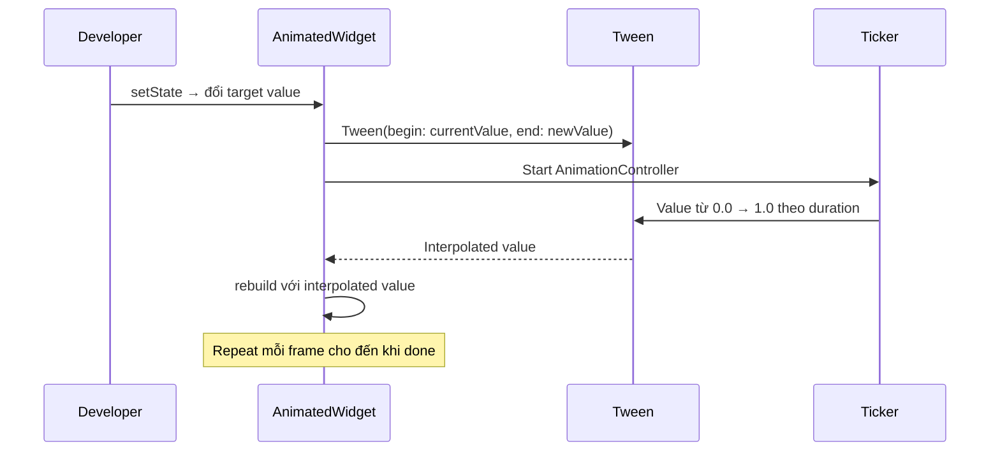

# Bài 8.1 — Implicit Animations

## Phần 1 — Khái Niệm & Mục Tiêu Bài Học

### Tại sao bài này quan trọng?

Animations làm app sống động và truyền đạt thay đổi state một cách tự nhiên. Flutter phân chia animation thành hai loại:

- **Implicit**: *"Tôi muốn widget này có property X"* → Flutter tự animate transition
- **Explicit**: *"Tôi điều khiển animation step by step với controller"*

Implicit animation là 80% nhu cầu thực tế — không cần AnimationController, không cần dispose.

```dart
// Implicit: chỉ đổi value, Flutter lo animation
AnimatedContainer(
  duration: const Duration(milliseconds: 300),
  width: _isExpanded ? 200 : 100, // Thay đổi → tự animate
)
```

### Bạn sẽ hiểu được sau bài này:
- `AnimatedContainer`, `AnimatedOpacity`, `AnimatedSwitcher`
- `TweenAnimationBuilder` — custom animated value
- Material Motion guidelines — chọn `duration` và `curve` phù hợp

---

## Phần 2 — Cơ Chế Hoạt Động (Under the Hood)

### Implicit Animation Flow



### ImplicitlyAnimatedWidget pattern

Flutter's built-in implicit animations đều extend `ImplicitlyAnimatedWidget`:
- Tự quản lý `AnimationController` internally
- Tự detect khi property thay đổi
- Tự animate từ old value đến new value

---

## Phần 3 — Code Mẫu Chuẩn Google

### 3.1 — AnimatedContainer

```dart
class ToggleCard extends StatefulWidget {
  const ToggleCard({super.key});
  @override State<ToggleCard> createState() => _ToggleCardState();
}

class _ToggleCardState extends State<ToggleCard> {
  bool _isExpanded = false;

  @override
  Widget build(BuildContext context) {
    return GestureDetector(
      onTap: () => setState(() => _isExpanded = !_isExpanded),
      child: AnimatedContainer(
        // Duration theo Material Motion guidelines
        duration: const Duration(milliseconds: 300),
        curve: Curves.easeInOut,
        // Animate tất cả thay đổi trong một lần setState
        width: _isExpanded ? 300 : 150,
        height: _isExpanded ? 200 : 80,
        padding: EdgeInsets.all(_isExpanded ? 24 : 8),
        decoration: BoxDecoration(
          color: _isExpanded
              ? Theme.of(context).colorScheme.primaryContainer
              : Theme.of(context).colorScheme.surface,
          borderRadius: BorderRadius.circular(_isExpanded ? 24 : 8),
          boxShadow: [
            BoxShadow(
              color: Colors.black.withOpacity(_isExpanded ? 0.2 : 0.05),
              blurRadius: _isExpanded ? 16 : 4,
            ),
          ],
        ),
        child: Column(
          mainAxisAlignment: MainAxisAlignment.center,
          children: [
            AnimatedRotation(
              turns: _isExpanded ? 0.5 : 0, // 180 độ
              duration: const Duration(milliseconds: 300),
              child: const Icon(Icons.expand_more),
            ),
            if (_isExpanded)
              const AnimatedOpacity(
                opacity: 1.0,
                duration: Duration(milliseconds: 200),
                child: Padding(
                  padding: EdgeInsets.only(top: 8),
                  child: Text('Nội dung mở rộng!'),
                ),
              ),
          ],
        ),
      ),
    );
  }
}
```

### 3.2 — AnimatedSwitcher — Cross-fade giữa widgets

```dart
class WeatherWidget extends StatefulWidget {
  final WeatherCondition condition;
  const WeatherWidget({super.key, required this.condition});
  @override State<WeatherWidget> createState() => _WeatherWidgetState();
}

class _WeatherWidgetState extends State<WeatherWidget> {
  WeatherCondition _condition = WeatherCondition.sunny;

  @override
  Widget build(BuildContext context) {
    return Column(
      children: [
        // AnimatedSwitcher: cross-fade khi child key thay đổi
        AnimatedSwitcher(
          duration: const Duration(milliseconds: 400),
          transitionBuilder: (child, animation) {
            // Custom transition: fade + scale
            return FadeTransition(
              opacity: animation,
              child: ScaleTransition(scale: animation, child: child),
            );
          },
          child: Icon(
            _condition.icon,
            key: ValueKey(_condition), // KEY QUAN TRỌNG: detect widget thay đổi
            size: 80,
            color: _condition.color,
          ),
        ),
        const SizedBox(height: 16),
        Row(
          mainAxisAlignment: MainAxisAlignment.center,
          children: WeatherCondition.values.map((c) =>
            ElevatedButton(
              onPressed: () => setState(() => _condition = c),
              child: Text(c.label),
            ),
          ).toList(),
        ),
      ],
    );
  }
}

enum WeatherCondition {
  sunny(Icons.wb_sunny, Colors.orange, 'Nắng'),
  cloudy(Icons.cloud, Colors.grey, 'Mây'),
  rainy(Icons.umbrella, Colors.blue, 'Mưa');

  final IconData icon;
  final Color color;
  final String label;
  const WeatherCondition(this.icon, this.color, this.label);
}
```

### 3.3 — TweenAnimationBuilder — Custom animated value

```dart
// TweenAnimationBuilder: animate bất kỳ Tween nào mà không cần AnimationController
class CircularProgressRing extends StatelessWidget {
  final double progress; // 0.0 đến 1.0
  final Duration animationDuration;

  const CircularProgressRing({
    super.key,
    required this.progress,
    this.animationDuration = const Duration(milliseconds: 500),
  });

  @override
  Widget build(BuildContext context) {
    return TweenAnimationBuilder<double>(
      tween: Tween<double>(begin: 0, end: progress),
      duration: animationDuration,
      curve: Curves.easeOut,
      builder: (context, value, child) {
        return CustomPaint(
          size: const Size(80, 80),
          painter: _RingPainter(
            progress: value,
            color: Theme.of(context).colorScheme.primary,
          ),
          child: Center(
            child: Text(
              '${(value * 100).round()}%',
              style: Theme.of(context).textTheme.titleMedium,
            ),
          ),
        );
      },
    );
  }
}

class _RingPainter extends CustomPainter {
  final double progress;
  final Color color;

  const _RingPainter({required this.progress, required this.color});

  @override
  void paint(Canvas canvas, Size size) {
    final center = Offset(size.width / 2, size.height / 2);
    final radius = size.shortestSide / 2 - 4;

    // Background ring
    canvas.drawCircle(
      center, radius,
      Paint()..color = color.withOpacity(0.2)..strokeWidth = 6..style = PaintingStyle.stroke,
    );

    // Progress arc
    canvas.drawArc(
      Rect.fromCircle(center: center, radius: radius),
      -math.pi / 2, // Bắt đầu từ 12 giờ
      2 * math.pi * progress, // Góc theo progress
      false,
      Paint()
        ..color = color
        ..strokeWidth = 6
        ..style = PaintingStyle.stroke
        ..strokeCap = StrokeCap.round,
    );
  }

  @override
  bool shouldRepaint(_RingPainter old) => progress != old.progress;
}
```

### 3.4 — Material Motion guidelines

```dart
// Material Motion: https://m3.material.io/styles/motion
// Duration: 100ms → 500ms tùy complexity
// Curve: easeInOut cho most, spring cho bouncy

class MaterialMotionExamples extends StatefulWidget {
  const MaterialMotionExamples({super.key});
  @override State<MaterialMotionExamples> createState() => _MaterialMotionState();
}

class _MaterialMotionState extends State<MaterialMotionExamples> {
  bool _visible = true;
  bool _selected = false;

  @override
  Widget build(BuildContext context) {
    return Column(
      children: [
        // Emphasize: 500ms, easeEmphasized
        AnimatedContainer(
          duration: const Duration(milliseconds: 500),
          curve: Curves.easeInOutCubicEmphasized, // Material 3 curve
          height: _selected ? 200 : 60,
          color: _selected ? Colors.indigo : Colors.indigoAccent,
          child: Center(child: Text(_selected ? 'Mở rộng' : 'Thu lại')),
        ),

        // Standard: 200ms, easeInOut → cho UI thay đổi nhỏ
        AnimatedOpacity(
          duration: const Duration(milliseconds: 200),
          opacity: _visible ? 1.0 : 0.0,
          child: const Text('Fade in/out'),
        ),

        // Controls
        Row(
          children: [
            ElevatedButton(
              onPressed: () => setState(() => _selected = !_selected),
              child: const Text('Toggle Card'),
            ),
            ElevatedButton(
              onPressed: () => setState(() => _visible = !_visible),
              child: const Text('Toggle Opacity'),
            ),
          ],
        ),
      ],
    );
  }
}
```

---

## Phần 4 — Lỗi Sai Phổ Biến & Best Practices

### ❌ Anti-pattern 1: Quên key trong AnimatedSwitcher

```dart
// ❌ Sai: Không có key → AnimatedSwitcher không detect widget thay đổi
// → Không animate!
AnimatedSwitcher(
  duration: const Duration(milliseconds: 300),
  child: Text(count.toString()), // Không có key
)

// ✅ Đúng: Key để AnimatedSwitcher biết widget "khác"
AnimatedSwitcher(
  duration: const Duration(milliseconds: 300),
  child: Text(
    count.toString(),
    key: ValueKey(count), // Key thay đổi → animate!
  ),
)
```

### ❌ Anti-pattern 2: Animation quá nhanh/chậm

```dart
// ❌ Quá nhanh: user không thấy
AnimatedContainer(duration: const Duration(milliseconds: 50), ...)

// ❌ Quá chậm: cảm giác lag
AnimatedContainer(duration: const Duration(milliseconds: 2000), ...)

// ✅ Material guidelines:
// - Nhỏ, đơn giản: 100-200ms
// - Vừa, phức tạp: 200-400ms
// - Toàn màn hình, nhấn mạnh: 300-500ms
```

---

## Phần 5 — Bài Tập Củng Cố Tư Duy

### Challenge: Toggle Button với Multi-property Animation

**Yêu cầu:**
1. Button "Like" — toggle trạng thái liked/unliked
2. Khi like: icon đổi từ `favorite_border` → `favorite`
3. Color đổi: grey → red
4. Scale: bounce effect (sử dụng `TweenAnimationBuilder` hoặc `AnimatedScale`)
5. Counter animate khi số thay đổi (`AnimatedSwitcher`)

### Thử Thách Tư Duy & Thẩm Định Chuyên Sâu (Conceptual & Deep-Dive Check)

> **[Junior]** — nắm khái niệm | **[Middle]** — hiểu cơ chế | **[Senior]** — hiểu Flutter internals | **[Trace Code]** — đọc code và dự đoán output

---

#### Q1 [Junior] — "Sự khác biệt giữa Implicit và Explicit animation?"

**Trả lời chuẩn:**

| | Implicit Animation | Explicit Animation |
|---|---|---|
| **Controller** | Không cần | Cần `AnimationController` |
| **Control** | Flutter tự animate khi value thay đổi | Bạn kiểm soát timing, repeat, reverse |
| **Code** | Ít code hơn | Nhiều code hơn |
| **Flexibility** | Thấp — chỉ A→B | Cao — sequence, stagger, loop |
| **Examples** | `AnimatedContainer`, `AnimatedOpacity` | `FadeTransition`, `SlideTransition` |

```dart
// Implicit — set value, Flutter animate tự động
AnimatedContainer(
  duration: const Duration(milliseconds: 300),
  curve: Curves.easeOut,
  width: _isExpanded ? 200.0 : 100.0, // chỉ cần thay đổi value
  color: _isSelected ? Colors.blue : Colors.grey,
  // Flutter tự tween từ giá trị cũ sang mới
)

// Explicit — bạn control hoàn toàn
AnimationController(vsync: this, duration: const Duration(milliseconds: 300));
FadeTransition(
  opacity: _controller, // bạn gọi _controller.forward() / .reverse()
  child: const MyWidget(),
)
```

---

#### Q2 [Junior] — "Tại sao cần `Key` trong `AnimatedSwitcher`? Điều gì xảy ra nếu không có?"

**Trả lời chuẩn:**

`AnimatedSwitcher` detect "new widget" bằng cách so sánh `Key` và `runtimeType`. Nếu cùng runtimeType và không có key (hoặc cùng key) → Flutter cho rằng đây là cùng widget được update → **không animate**.

```dart
// ❌ Không animate — cùng runtimeType (Text) và không có key
AnimatedSwitcher(
  duration: const Duration(milliseconds: 300),
  child: Text('$_counter'), // runtimeType = Text, không có key
)
// Khi _counter thay đổi: vẫn là Text → không switch → không animate!

// ✅ Animate — key khác nhau → AnimatedSwitcher detect widget mới
AnimatedSwitcher(
  duration: const Duration(milliseconds: 300),
  child: Text(
    '$_counter',
    key: ValueKey<int>(_counter), // ← key thay đổi theo value
  ),
)
// Khi _counter = 1 → 2: key('1') ≠ key('2') → widget mới → animate!
```

**Cơ chế:** AnimatedSwitcher so sánh `Widget.canUpdate(old, new)`. Nếu false (khác key/type) → animate out old, animate in new.

---

#### Q3 [Middle] — "Material Motion duration guidelines là gì? Curve nào cho Material 3?"

**Trả lời chuẩn:**

**Material Design 3 duration guidelines:**

| Category | Duration | Use case |
|---|---|---|
| **Short 1** | 50ms | UI feedback (hover, press) |
| **Short 2** | 100ms | Checkbox, radio state change |
| **Short 3** | 150ms | Badge, chip, small element |
| **Short 4** | 200ms | FAB → extended FAB |
| **Medium 1** | 250ms | Drawer open, menu |
| **Medium 2** | 300ms | Bottom sheet, dialog |
| **Medium 3** | 350ms | Navigation bar, rail |
| **Medium 4** | 400ms | Search bar |
| **Long 1** | 450ms | Navigation drawer (full) |

**Curves Material 3:**
```dart
// Emphasized — large elements, significant transitions
Curves.easeInOutCubicEmphasized // = Cubic(0.2, 0, 0, 1.0)

// Standard — default cho hầu hết animations
Curves.easeInOut

// Decelerate — elements entering screen
Curves.decelerate // = easeOut

// Accelerate — elements leaving screen
Curves.easeIn
```

---

#### Q4 [Senior] — "`ImplicitlyAnimatedWidget` dùng `AnimationController` nội bộ thế nào? Tween lerp hoạt động?"

**Trả lời chuẩn:**

`ImplicitlyAnimatedWidget` (base class của `AnimatedContainer`, `AnimatedOpacity`, v.v.) extend `StatefulWidget` và implement:

```dart
// Simplified AnimatedContainer internals
class _AnimatedContainerState extends AnimatedWidgetBaseState<AnimatedContainer> {
  // AnimatedWidgetBaseState extend ImplicitlyAnimatedWidgetState
  // → tự tạo AnimationController + SingleTickerProviderStateMixin

  Tween<double>? _width;
  Tween<Color?>? _color;
  
  @override
  void forEachTween(TweenVisitor<dynamic> visitor) {
    // Mỗi animated property có một Tween
    _width = visitor(
      _width,           // tween hiện tại
      widget.width,     // target value
      (value) => Tween<double>(begin: value as double),
    ) as Tween<double>?;
    
    _color = visitor(
      _color,
      widget.color,
      (value) => ColorTween(begin: value as Color),
    ) as Tween<Color?>?;
  }
  
  @override
  Widget build(BuildContext context) {
    final animation = this.animation; // từ AnimationController
    return Container(
      width: _width?.evaluate(animation),   // lerp từ old → new
      color: _color?.evaluate(animation),   // lerp color
    );
  }
}
```

**`Tween.lerp(t)` mechanism:**
```dart
// Khi didUpdateWidget với width mới:
// Old width = 100, new width = 200
// Tween: begin=100, end=200
// animation.value đi từ 0.0 → 1.0 (theo curve)
// evaluate(animation) = begin + (end - begin) * animation.value
//                     = 100 + (200-100) * 0.5 = 150 (ở giữa animation)
```

---

#### Q5 [Middle] — "`AnimatedSwitcher` detect 'new widget' bằng algorithm nào?"

**Trả lời chuẩn:**

`AnimatedSwitcher` dùng `Widget.canUpdate(oldChild, newChild)`:

```dart
// AnimatedSwitcher source (simplified)
void didUpdateWidget(AnimatedSwitcher oldWidget) {
  if (widget.child != null && Widget.canUpdate(widget.child!, _currentEntry!.widgetChild)) {
    // Cùng runtimeType + cùng key → update widget hiện tại, KHÔNG animate
    _updateTransitionForEntry(_currentEntry!, widget.child!);
  } else {
    // Khác runtimeType HOẶC khác key → widget mới → animate
    _addEntryForNewChild(animate: true);
  }
}
```

**Behavior:**
```dart
// Scenario 1: Text → Text (cùng type, không key)
child: Text('A') → Text('B')
// canUpdate(Text(A), Text(B)) = true (same type, both no key)
// → KHÔNG animate, chỉ update text

// Scenario 2: Text(key: 'a') → Text(key: 'b')
child: Text('A', key: Key('a')) → Text('B', key: Key('b'))
// canUpdate = false (khác key)
// → ANIMATE: A slide out, B slide in

// Scenario 3: Text → Icon (khác type)
child: Text('A') → Icon(Icons.star)
// canUpdate = false (khác runtimeType)
// → ANIMATE: Text fade out, Icon fade in
```

---

#### Q6 [Middle] — "`TweenAnimationBuilder` vs `AnimatedContainer` — khi nào nên dùng `TweenAnimationBuilder`?"

**Trả lời chuẩn:**

| | `AnimatedContainer` | `TweenAnimationBuilder<T>` |
|---|---|---|
| **Properties** | Fixed (color, width, height...) | Bất kỳ type T |
| **Custom type** | Không | Có — `Tween<MyType>` |
| **On complete** | Không | Có — `onEnd` callback |
| **Control flow** | Chỉ A→B | A→B với onEnd trigger |

```dart
// AnimatedContainer — đủ cho properties có sẵn
AnimatedContainer(
  duration: const Duration(milliseconds: 300),
  width: _width,
  color: _color,
)

// TweenAnimationBuilder — khi cần animate custom type hoặc onEnd
TweenAnimationBuilder<double>(
  tween: Tween<double>(begin: 0, end: _angle),
  duration: const Duration(milliseconds: 500),
  curve: Curves.elasticOut,
  onEnd: () => _onAnimationComplete(), // callback khi animation xong
  builder: (ctx, value, child) {
    return Transform.rotate(
      angle: value,
      child: child,
    );
  },
  child: const Icon(Icons.star), // static child (không rebuild theo animation)
)

// Custom tween type
TweenAnimationBuilder<Color?>(
  tween: ColorTween(begin: Colors.red, end: Colors.blue),
  duration: const Duration(seconds: 1),
  builder: (ctx, color, _) => Container(color: color),
)
```

---

#### Q7 [Trace Code] — "`AnimatedOpacity` với duration 300ms: khi nào animation bắt đầu?"

```dart
class FadeWidget extends StatefulWidget {
  const FadeWidget({super.key});
  @override State<FadeWidget> createState() => _FadeWidgetState();
}

class _FadeWidgetState extends State<FadeWidget> {
  double _opacity = 1.0;

  @override
  Widget build(BuildContext context) {
    return Column(
      children: [
        AnimatedOpacity(
          opacity: _opacity,
          duration: const Duration(milliseconds: 300),
          child: Container(width: 100, height: 100, color: Colors.blue),
        ),
        ElevatedButton(
          onPressed: () {
            print('Button pressed at: ${DateTime.now().millisecondsSinceEpoch}');
            setState(() => _opacity = 0.0);
          },
          child: const Text('Fade Out'),
        ),
      ],
    );
  }
}
```

**Khi button được nhấn:**

1. `setState(() => _opacity = 0.0)` → mark widget dirty
2. Frame boundary → `build()` được gọi → `AnimatedOpacity(opacity: 0.0)` widget mới
3. `AnimatedOpacity` detect: `opacity` thay đổi từ 1.0 → 0.0 (trong `didUpdateWidget`)
4. Tween được set: `begin = 1.0, end = 0.0`
5. `AnimationController.forward()` được gọi → animation bắt đầu **trong frame tiếp theo**

**Timeline:**
```
t=0ms:   Button pressed → setState()
t=~16ms: Build() → AnimatedOpacity detect change → animation START
t=~316ms: Animation COMPLETE → opacity = 0.0
```

**Animation bắt đầu KHÔNG phải ngay khi button pressed** mà trong frame tiếp theo sau `build()`. Delay = 1 frame (~16ms ở 60fps). Với `setState()` synchronous, delay này rất nhỏ và không nhận thấy được bởi user.
