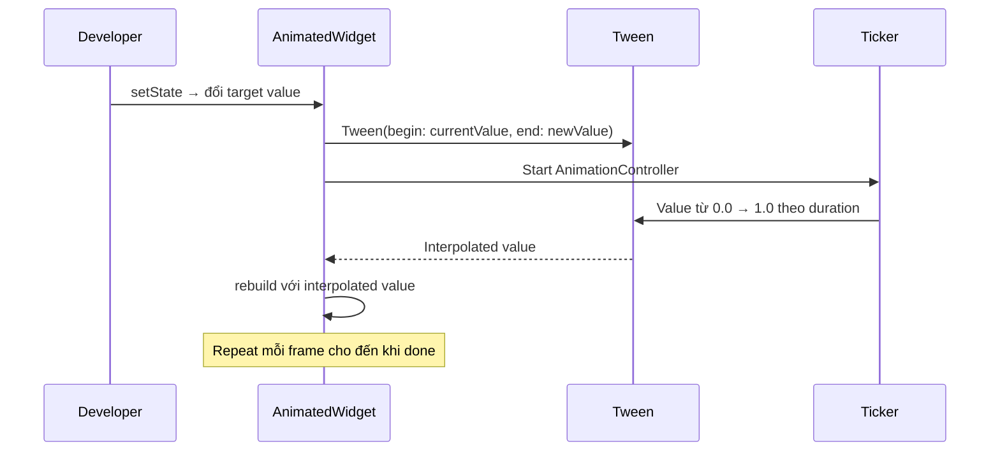

# Bài 8.1 — Implicit Animations

## Phần 1 — Khái Niệm & Mục Tiêu Bài Học

### Tại sao bài này quan trọng?

Animations làm app sống động và truyền đạt thay đổi state một cách tự nhiên. Flutter phân chia animation thành hai loại:

- **Implicit**: *"Tôi muốn widget này có property X"* → Flutter tự animate transition
- **Explicit**: *"Tôi điều khiển animation step by step với controller"*

Implicit animation là 80% nhu cầu thực tế — không cần AnimationController, không cần dispose.

```dart
// Implicit: chỉ đổi value, Flutter lo animation
AnimatedContainer(
  duration: const Duration(milliseconds: 300),
  width: _isExpanded ? 200 : 100, // Thay đổi → tự animate
)
```

### Bạn sẽ hiểu được sau bài này:
- `AnimatedContainer`, `AnimatedOpacity`, `AnimatedSwitcher`
- `TweenAnimationBuilder` — custom animated value
- Material Motion guidelines — chọn `duration` và `curve` phù hợp

---

## Phần 2 — Cơ Chế Hoạt Động (Under the Hood)

### Implicit Animation Flow



### ImplicitlyAnimatedWidget pattern

Flutter's built-in implicit animations đều extend `ImplicitlyAnimatedWidget`:
- Tự quản lý `AnimationController` internally
- Tự detect khi property thay đổi
- Tự animate từ old value đến new value

---

## Phần 3 — Code Mẫu Chuẩn Google

### 3.1 — AnimatedContainer

```dart
class ToggleCard extends StatefulWidget {
  const ToggleCard({super.key});
  @override State<ToggleCard> createState() => _ToggleCardState();
}

class _ToggleCardState extends State<ToggleCard> {
  bool _isExpanded = false;

  @override
  Widget build(BuildContext context) {
    return GestureDetector(
      onTap: () => setState(() => _isExpanded = !_isExpanded),
      child: AnimatedContainer(
        // Duration theo Material Motion guidelines
        duration: const Duration(milliseconds: 300),
        curve: Curves.easeInOut,
        // Animate tất cả thay đổi trong một lần setState
        width: _isExpanded ? 300 : 150,
        height: _isExpanded ? 200 : 80,
        padding: EdgeInsets.all(_isExpanded ? 24 : 8),
        decoration: BoxDecoration(
          color: _isExpanded
              ? Theme.of(context).colorScheme.primaryContainer
              : Theme.of(context).colorScheme.surface,
          borderRadius: BorderRadius.circular(_isExpanded ? 24 : 8),
          boxShadow: [
            BoxShadow(
              color: Colors.black.withOpacity(_isExpanded ? 0.2 : 0.05),
              blurRadius: _isExpanded ? 16 : 4,
            ),
          ],
        ),
        child: Column(
          mainAxisAlignment: MainAxisAlignment.center,
          children: [
            AnimatedRotation(
              turns: _isExpanded ? 0.5 : 0, // 180 độ
              duration: const Duration(milliseconds: 300),
              child: const Icon(Icons.expand_more),
            ),
            if (_isExpanded)
              const AnimatedOpacity(
                opacity: 1.0,
                duration: Duration(milliseconds: 200),
                child: Padding(
                  padding: EdgeInsets.only(top: 8),
                  child: Text('Nội dung mở rộng!'),
                ),
              ),
          ],
        ),
      ),
    );
  }
}
```

### 3.2 — AnimatedSwitcher — Cross-fade giữa widgets

```dart
class WeatherWidget extends StatefulWidget {
  final WeatherCondition condition;
  const WeatherWidget({super.key, required this.condition});
  @override State<WeatherWidget> createState() => _WeatherWidgetState();
}

class _WeatherWidgetState extends State<WeatherWidget> {
  WeatherCondition _condition = WeatherCondition.sunny;

  @override
  Widget build(BuildContext context) {
    return Column(
      children: [
        // AnimatedSwitcher: cross-fade khi child key thay đổi
        AnimatedSwitcher(
          duration: const Duration(milliseconds: 400),
          transitionBuilder: (child, animation) {
            // Custom transition: fade + scale
            return FadeTransition(
              opacity: animation,
              child: ScaleTransition(scale: animation, child: child),
            );
          },
          child: Icon(
            _condition.icon,
            key: ValueKey(_condition), // KEY QUAN TRỌNG: detect widget thay đổi
            size: 80,
            color: _condition.color,
          ),
        ),
        const SizedBox(height: 16),
        Row(
          mainAxisAlignment: MainAxisAlignment.center,
          children: WeatherCondition.values.map((c) =>
            ElevatedButton(
              onPressed: () => setState(() => _condition = c),
              child: Text(c.label),
            ),
          ).toList(),
        ),
      ],
    );
  }
}

enum WeatherCondition {
  sunny(Icons.wb_sunny, Colors.orange, 'Nắng'),
  cloudy(Icons.cloud, Colors.grey, 'Mây'),
  rainy(Icons.umbrella, Colors.blue, 'Mưa');

  final IconData icon;
  final Color color;
  final String label;
  const WeatherCondition(this.icon, this.color, this.label);
}
```

### 3.3 — TweenAnimationBuilder — Custom animated value

```dart
// TweenAnimationBuilder: animate bất kỳ Tween nào mà không cần AnimationController
class CircularProgressRing extends StatelessWidget {
  final double progress; // 0.0 đến 1.0
  final Duration animationDuration;

  const CircularProgressRing({
    super.key,
    required this.progress,
    this.animationDuration = const Duration(milliseconds: 500),
  });

  @override
  Widget build(BuildContext context) {
    return TweenAnimationBuilder<double>(
      tween: Tween<double>(begin: 0, end: progress),
      duration: animationDuration,
      curve: Curves.easeOut,
      builder: (context, value, child) {
        return CustomPaint(
          size: const Size(80, 80),
          painter: _RingPainter(
            progress: value,
            color: Theme.of(context).colorScheme.primary,
          ),
          child: Center(
            child: Text(
              '${(value * 100).round()}%',
              style: Theme.of(context).textTheme.titleMedium,
            ),
          ),
        );
      },
    );
  }
}

class _RingPainter extends CustomPainter {
  final double progress;
  final Color color;

  const _RingPainter({required this.progress, required this.color});

  @override
  void paint(Canvas canvas, Size size) {
    final center = Offset(size.width / 2, size.height / 2);
    final radius = size.shortestSide / 2 - 4;

    // Background ring
    canvas.drawCircle(
      center, radius,
      Paint()..color = color.withOpacity(0.2)..strokeWidth = 6..style = PaintingStyle.stroke,
    );

    // Progress arc
    canvas.drawArc(
      Rect.fromCircle(center: center, radius: radius),
      -math.pi / 2, // Bắt đầu từ 12 giờ
      2 * math.pi * progress, // Góc theo progress
      false,
      Paint()
        ..color = color
        ..strokeWidth = 6
        ..style = PaintingStyle.stroke
        ..strokeCap = StrokeCap.round,
    );
  }

  @override
  bool shouldRepaint(_RingPainter old) => progress != old.progress;
}
```

### 3.4 — Material Motion guidelines

```dart
// Material Motion: https://m3.material.io/styles/motion
// Duration: 100ms → 500ms tùy complexity
// Curve: easeInOut cho most, spring cho bouncy

class MaterialMotionExamples extends StatefulWidget {
  const MaterialMotionExamples({super.key});
  @override State<MaterialMotionExamples> createState() => _MaterialMotionState();
}

class _MaterialMotionState extends State<MaterialMotionExamples> {
  bool _visible = true;
  bool _selected = false;

  @override
  Widget build(BuildContext context) {
    return Column(
      children: [
        // Emphasize: 500ms, easeEmphasized
        AnimatedContainer(
          duration: const Duration(milliseconds: 500),
          curve: Curves.easeInOutCubicEmphasized, // Material 3 curve
          height: _selected ? 200 : 60,
          color: _selected ? Colors.indigo : Colors.indigoAccent,
          child: Center(child: Text(_selected ? 'Mở rộng' : 'Thu lại')),
        ),

        // Standard: 200ms, easeInOut → cho UI thay đổi nhỏ
        AnimatedOpacity(
          duration: const Duration(milliseconds: 200),
          opacity: _visible ? 1.0 : 0.0,
          child: const Text('Fade in/out'),
        ),

        // Controls
        Row(
          children: [
            ElevatedButton(
              onPressed: () => setState(() => _selected = !_selected),
              child: const Text('Toggle Card'),
            ),
            ElevatedButton(
              onPressed: () => setState(() => _visible = !_visible),
              child: const Text('Toggle Opacity'),
            ),
          ],
        ),
      ],
    );
  }
}
```

---

## Phần 4 — Lỗi Sai Phổ Biến & Best Practices

### ❌ Anti-pattern 1: Quên key trong AnimatedSwitcher

```dart
// ❌ Sai: Không có key → AnimatedSwitcher không detect widget thay đổi
// → Không animate!
AnimatedSwitcher(
  duration: const Duration(milliseconds: 300),
  child: Text(count.toString()), // Không có key
)

// ✅ Đúng: Key để AnimatedSwitcher biết widget "khác"
AnimatedSwitcher(
  duration: const Duration(milliseconds: 300),
  child: Text(
    count.toString(),
    key: ValueKey(count), // Key thay đổi → animate!
  ),
)
```

### ❌ Anti-pattern 2: Animation quá nhanh/chậm

```dart
// ❌ Quá nhanh: user không thấy
AnimatedContainer(duration: const Duration(milliseconds: 50), ...)

// ❌ Quá chậm: cảm giác lag
AnimatedContainer(duration: const Duration(milliseconds: 2000), ...)

// ✅ Material guidelines:
// - Nhỏ, đơn giản: 100-200ms
// - Vừa, phức tạp: 200-400ms
// - Toàn màn hình, nhấn mạnh: 300-500ms
```

---

## Phần 5 — Bài Tập Củng Cố Tư Duy

### Challenge: Toggle Button với Multi-property Animation

**Yêu cầu:**
1. Button "Like" — toggle trạng thái liked/unliked
2. Khi like: icon đổi từ `favorite_border` → `favorite`
3. Color đổi: grey → red
4. Scale: bounce effect (sử dụng `TweenAnimationBuilder` hoặc `AnimatedScale`)
5. Counter animate khi số thay đổi (`AnimatedSwitcher`)

### Câu hỏi phỏng vấn liên quan:

1. **"Sự khác biệt giữa Implicit và Explicit animation?"**
   - Implicit: set value → Flutter animate tự động, không cần controller
   - Explicit: bạn control timeline qua AnimationController

2. **"Tại sao cần Key trong AnimatedSwitcher?"**
   - AnimatedSwitcher detect "widget mới" bằng key comparison
   - Không có key: cùng runtimeType → không animate

3. **"Material Motion duration guidelines là gì?"**
   - Nhỏ: 100-200ms, Standard: 200-400ms, Emphasize: 300-500ms
   - Curve: `easeInOutCubicEmphasized` cho Material 3
