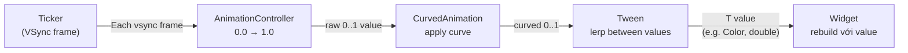

# Bài 8.2 — Explicit Animations & AnimationController

## Phần 1 — Khái Niệm & Mục Tiêu Bài Học

### Tại sao bài này quan trọng?

Khi implicit animations không đủ linh hoạt — bạn cần explicit control:
- Bắt đầu, dừng, reverse theo logic riêng
- Orchestrate nhiều animations theo sequence hoặc parallel
- Lắng nghe animation status để trigger hành động

```dart
// Explicit control: bạn là người điều khiển
_controller.forward();   // Bắt đầu
_controller.reverse();   // Chạy ngược
_controller.repeat();    // Lặp liên tục
_controller.stop();      // Dừng ngay
```

**Cảnh báo quan trọng**: AnimationController phải được `dispose()`! Quên dispose → memory leak.

### Bạn sẽ hiểu được sau bài này:
- `AnimationController`, `Tween`, `CurvedAnimation`
- `AnimatedBuilder` vs `addListener + setState`
- Difference: `forward()`, `reverse()`, `repeat()`, `reset()`
- Chaining animations với `.drive()` và `Interval`

---

## Phần 2 — Cơ Chế Hoạt Động (Under the Hood)

### Animation Value Flow



### AnimationController lifecycle trong State

```
initState() → new AnimationController(vsync: this)
                    ↓
              .forward() / .repeat()
                    ↓
              Each frame → value changes
                    ↓
              AnimatedBuilder rebuilds
                    ↓
dispose() → controller.dispose() ← BẮT BUỘC
```

---

## Phần 3 — Code Mẫu Chuẩn Google

### 3.1 — AnimationController cơ bản

```dart
class PulseButton extends StatefulWidget {
  final VoidCallback onPressed;
  final Widget child;

  const PulseButton({super.key, required this.onPressed, required this.child});

  @override
  State<PulseButton> createState() => _PulseButtonState();
}

class _PulseButtonState extends State<PulseButton>
    with SingleTickerProviderStateMixin {
  // SingleTickerProviderStateMixin: mixin cung cấp Ticker (VSync)
  // Dùng khi chỉ có 1 AnimationController

  late final AnimationController _controller;
  late final Animation<double> _scaleAnimation;

  @override
  void initState() {
    super.initState();

    _controller = AnimationController(
      vsync: this, // "this" = TickerProvider từ mixin
      duration: const Duration(milliseconds: 150),
    );

    // CurvedAnimation: wrap controller để apply curve
    final curvedAnimation = CurvedAnimation(
      parent: _controller,
      curve: Curves.easeInOut,
    );

    // Tween: map 0..1 của animation thành double value
    _scaleAnimation = Tween<double>(
      begin: 1.0,
      end: 0.92,
    ).animate(curvedAnimation);
  }

  @override
  void dispose() {
    _controller.dispose(); // BẮT BUỘC: ngăn memory leak
    super.dispose();
  }

  Future<void> _handleTap() async {
    await _controller.forward();      // Scale xuống
    await _controller.reverse();      // Scale lên lại
    widget.onPressed();               // Gọi callback sau animation
  }

  @override
  Widget build(BuildContext context) {
    // AnimatedBuilder: rebuild CHỈ phần widget bên trong khi animation thay đổi
    // → Hiệu quả hơn setState()
    return AnimatedBuilder(
      animation: _scaleAnimation, // Listen animation này
      builder: (context, child) {
        return Transform.scale(
          scale: _scaleAnimation.value,
          child: child, // child không rebuild theo animation
        );
      },
      child: ElevatedButton(
        // child truyền vào AnimatedBuilder.child không bị rebuild
        // → Flutter optimization: giữ nguyên subtree không đổi
        onPressed: _handleTap,
        child: widget.child,
      ),
    );
  }
}
```

### 3.2 — Nhiều Tween từ một Controller

```dart
class LoadingAnimation extends StatefulWidget {
  const LoadingAnimation({super.key});
  @override State<LoadingAnimation> createState() => _LoadingAnimationState();
}

class _LoadingAnimationState extends State<LoadingAnimation>
    with SingleTickerProviderStateMixin {
  late final AnimationController _controller;

  // Nhiều Animation từ MỘT controller bằng .drive()
  late final Animation<double> _rotationAnimation;
  late final Animation<double> _scaleAnimation;
  late final Animation<Color?> _colorAnimation;

  @override
  void initState() {
    super.initState();

    _controller = AnimationController(
      vsync: this,
      duration: const Duration(seconds: 2),
    )..repeat(); // Lặp liên tục ngay khi tạo

    // .drive(): thay thế .animate() — fluent API
    _rotationAnimation = _controller.drive(
      Tween<double>(begin: 0, end: 1), // 0 → 1 turn = 360 độ
    );

    // CurvedAnimation với Interval: chỉ animate trong khoảng 0.0-0.5
    _scaleAnimation = _controller.drive(
      Tween<double>(begin: 0.8, end: 1.2).chain(
        CurveTween(curve: const Interval(0.0, 0.5, curve: Curves.elasticOut)),
      ),
    );

    // Color animation
    _colorAnimation = _controller.drive(
      ColorTween(
        begin: Colors.blue,
        end: Colors.purple,
      ).chain(CurveTween(curve: Curves.easeInOut)),
    );
  }

  @override
  void dispose() {
    _controller.dispose();
    super.dispose();
  }

  @override
  Widget build(BuildContext context) {
    return AnimatedBuilder(
      animation: _controller, // Listen controller trực tiếp
      builder: (context, _) {
        return RotationTransition(
          turns: _rotationAnimation,
          child: ScaleTransition(
            scale: _scaleAnimation,
            child: Container(
              width: 60,
              height: 60,
              decoration: BoxDecoration(
                color: _colorAnimation.value,
                shape: BoxShape.circle,
              ),
            ),
          ),
        );
      },
    );
  }
}
```

### 3.3 — AnimationStatus Listener

```dart
class ExpandablePanel extends StatefulWidget {
  final Widget header;
  final Widget body;

  const ExpandablePanel({super.key, required this.header, required this.body});
  @override State<ExpandablePanel> createState() => _ExpandablePanelState();
}

class _ExpandablePanelState extends State<ExpandablePanel>
    with SingleTickerProviderStateMixin {
  late final AnimationController _controller;
  late final Animation<double> _expandAnimation;

  bool get _isExpanded => _controller.isCompleted;

  @override
  void initState() {
    super.initState();

    _controller = AnimationController(
      vsync: this,
      duration: const Duration(milliseconds: 300),
    );

    _expandAnimation = CurvedAnimation(
      parent: _controller,
      curve: Curves.easeInOut,
    );

    // Lắng nghe status để update UI state ngoài animation
    _controller.addStatusListener(_onStatusChanged);
  }

  void _onStatusChanged(AnimationStatus status) {
    // Rebuild để update icon rotation
    setState(() {});
  }

  @override
  void dispose() {
    _controller.removeStatusListener(_onStatusChanged); // Cleanup listener
    _controller.dispose();
    super.dispose();
  }

  void _toggle() {
    if (_isExpanded) {
      _controller.reverse();
    } else {
      _controller.forward();
    }
  }

  @override
  Widget build(BuildContext context) {
    return Column(
      children: [
        InkWell(
          onTap: _toggle,
          child: Padding(
            padding: const EdgeInsets.all(16),
            child: Row(
              mainAxisAlignment: MainAxisAlignment.spaceBetween,
              children: [
                widget.header,
                AnimatedRotation(
                  turns: _isExpanded ? 0.5 : 0,
                  duration: const Duration(milliseconds: 300),
                  child: const Icon(Icons.expand_more),
                ),
              ],
            ),
          ),
        ),
        // SizeTransition: animate height từ 0 đến full
        SizeTransition(
          sizeFactor: _expandAnimation,
          child: widget.body,
        ),
      ],
    );
  }
}
```

---

## Phần 4 — Lỗi Sai Phổ Biến & Best Practices

### ❌ Anti-pattern 1: Quên dispose AnimationController

```dart
// ❌ Memory leak: controller giữ Ticker alive sau khi widget unmount
class BadAnimation extends StatefulWidget { ... }
class _BadAnimationState extends State<BadAnimation>
    with SingleTickerProviderStateMixin {
  late final AnimationController _controller;

  @override
  void initState() {
    super.initState();
    _controller = AnimationController(vsync: this, duration: ...);
    _controller.repeat();
  }

  // ❌ Thiếu dispose() → Ticker vẫn chạy!

  @override
  Widget build(BuildContext context) => ...;
}

// ✅ Luôn override dispose
@override
void dispose() {
  _controller.dispose(); // Dừng Ticker, giải phóng resources
  super.dispose();
}
```

### ❌ Anti-pattern 2: addListener + setState thay vì AnimatedBuilder

```dart
// ❌ Không tốt: addListener + setState rebuild toàn bộ widget tree
class BadApproach extends State<MyWidget>
    with SingleTickerProviderStateMixin {
  late final AnimationController _controller;

  @override void initState() {
    super.initState();
    _controller = AnimationController(vsync: this, ...);
    // Mỗi frame → setState → rebuild toàn bộ build()
    _controller.addListener(() => setState(() {}));
  }

  @override
  Widget build(BuildContext context) {
    return Column(
      children: [
        // Chỉ cái này cần animate
        Transform.scale(scale: _controller.value, child: const Icon(Icons.star)),
        // Nhưng CẢ Column bị rebuild!
        const HeavyStaticWidget(),
        const AnotherStaticWidget(),
      ],
    );
  }
}

// ✅ AnimatedBuilder: scope rebuild nhỏ nhất
@override
Widget build(BuildContext context) {
  return Column(
    children: [
      AnimatedBuilder(
        animation: _controller,
        builder: (_, __) => Transform.scale(
          scale: _controller.value,
          child: const Icon(Icons.star),
        ),
      ),
      // Hai widget này KHÔNG rebuild theo animation
      const HeavyStaticWidget(),
      const AnotherStaticWidget(),
    ],
  );
}
```

### ❌ Anti-pattern 3: Dùng TickerProviderStateMixin khi chỉ cần một controller

```dart
// ❌ Không cần thiết: TickerProviderStateMixin cho phép nhiều tickers
class _MyState extends State<MyWidget> with TickerProviderStateMixin {
  late final AnimationController _controller; // Chỉ 1 controller

// ✅ SingleTickerProviderStateMixin khi có đúng 1 controller
class _MyState extends State<MyWidget> with SingleTickerProviderStateMixin {
  late final AnimationController _controller;
```

---

## Phần 5 — Bài Tập Củng Cố Tư Duy

### Challenge: Loading Spinner với AnimationController

**Yêu cầu:**
1. Spinner rotate 360° liên tục (`_controller.repeat()`)
2. Khi tap → spinner dừng, hiện checkmark với scale-in animation
3. Checkmark sau 2 giây → fade out, spinner restart
4. Dùng `addStatusListener` để trigger transition

**Gợi ý:**
- Dùng `TickerProviderStateMixin` vì cần 2 `AnimationController`
- Controller 1: rotation (repeat)
- Controller 2: checkmark appearance (forward, sau đó reverse)
- Manage state transition: loading → success → loading

### Thử Thách Tư Duy & Thẩm Định Chuyên Sâu (Conceptual & Deep-Dive Check)

> **[Junior]** — nắm khái niệm | **[Middle]** — hiểu cơ chế | **[Senior]** — hiểu Flutter internals | **[Trace Code]** — đọc code và dự đoán output

---

#### Q1 [Junior] — "Sự khác biệt giữa `SingleTickerProviderStateMixin` và `TickerProviderStateMixin`?"

**Trả lời chuẩn:**

| | `SingleTickerProviderStateMixin` | `TickerProviderStateMixin` |
|---|---|---|
| **Tickers** | Đúng 1 | Không giới hạn |
| **AnimationControllers** | 1 controller | Nhiều controllers |
| **Debug assertion** | Throw nếu createTicker() gọi >1 lần | Không giới hạn |
| **Performance** | Tốt hơn (simpler implementation) | Overhead nhỏ cho tracking |
| **Use case** | Single animation | Tab animation, staggered |

```dart
// ✅ Single — 1 animation
class _CardState extends State<Card>
    with SingleTickerProviderStateMixin {
  late AnimationController _controller;
  
  @override void initState() {
    super.initState();
    _controller = AnimationController(vsync: this, duration: ...);
    // Tạo controller thứ 2 → assertion error trong debug mode
  }
}

// ✅ Multi — nhiều animations
class _DashboardState extends State<Dashboard>
    with TickerProviderStateMixin {
  late AnimationController _headerController;
  late AnimationController _contentController;
  late AnimationController _footerController;
}
```

---

#### Q2 [Junior] — "`controller.forward()` vs `controller.repeat()` vs `controller.animateTo()`?"

**Trả lời chuẩn:**

| Method | Hành động | Return |
|---|---|---|
| `forward()` | current → 1.0 một lần | `TickerFuture` |
| `reverse()` | current → 0.0 một lần | `TickerFuture` |
| `repeat()` | Loop 0.0 → 1.0 → 0.0 mãi | `TickerFuture` |
| `animateTo(target)` | current → target một lần | `TickerFuture` |
| `stop()` | Dừng tại current value | `void` |
| `reset()` | Reset về 0.0 (không animate) | `void` |

```dart
// forward — play animation
_controller.forward(); // 0.0 → 1.0

// reverse — play ngược
_controller.reverse(); // 1.0 → 0.0

// repeat với reverse — ping-pong
_controller.repeat(reverse: true); // 0→1→0→1→... (infinite)

// repeat trong range
_controller.repeat(min: 0.3, max: 0.7); // loop trong 0.3 → 0.7

// animateTo — đến giá trị cụ thể
_controller.animateTo(0.5); // animate đến 50%

// Await completion
await _controller.forward().orCancel;
// Tiếp tục sau khi animation xong (hoặc bị cancel)
```

---

#### Q3 [Middle] — "Tại sao `AnimatedBuilder` tốt hơn `addListener + setState`?"

**Trả lời chuẩn:**

`addListener + setState` rebuild **toàn bộ `build()` method** của widget 60 lần/giây. `AnimatedBuilder` chỉ rebuild **phần trong `builder` callback**:

```dart
// ❌ addListener + setState — rebuild toàn bộ build()
@override void initState() {
  super.initState();
  _controller.addListener(() => setState(() {})); // rebuild ALL mỗi frame!
}

@override Widget build(context) {
  return Scaffold(
    appBar: AppBar(title: const Text('Title')), // không thay đổi → rebuild lãng phí!
    body: Column(children: [
      const ExpensiveWidget(),               // không thay đổi → rebuild lãng phí!
      Transform.scale(scale: _controller.value, child: const Box()), // chỉ cái này cần
    ]),
  );
}

// ✅ AnimatedBuilder — rebuild nhỏ hơn
@override Widget build(context) {
  return Scaffold(
    appBar: AppBar(title: const Text('Title')),   // KHÔNG rebuild
    body: Column(children: [
      const ExpensiveWidget(),                      // KHÔNG rebuild
      AnimatedBuilder(
        animation: _controller,
        child: const Box(), // static child — KHÔNG rebuild theo animation
        builder: (ctx, child) => Transform.scale(
          scale: _controller.value,
          child: child, // reuse static child
        ),
      ), // chỉ AnimatedBuilder's subtree rebuild
    ]),
  );
}
```

**Best: Transition widgets** — không rebuild Widget tree gì cả, chỉ paint layer:
```dart
FadeTransition(opacity: _controller, child: const Box())
// → markNeedsPaint() thay vì rebuild → 0 widget rebuild
```

---

#### Q4 [Senior] — "`AnimationController` tick mechanism: `Ticker.tick()` được gọi bởi `SchedulerBinding` thế nào?"

**Trả lời chuẩn:**

Mỗi vsync frame, `SchedulerBinding` invoke tất cả registered frame callbacks:

```
Display hardware → VSync signal (60Hz)
  ↓
SchedulerBinding._handleBeginFrame(Duration timeStamp)
  ↓
invoke tất cả transient frame callbacks (Ticker callbacks)
  ↓
Ticker._tick(Duration timeStamp)
  ↓
elapsed = timeStamp - _startTime
AnimationController._tick(Duration elapsed)
  ↓
value = _simulation.x(elapsed.inMicroseconds / 1e6)
// _simulation là LinearSimulation, CurveTween simulation...
  ↓
notifyListeners()  ← AnimatedBuilder, FadeTransition, etc. nhận callback
  ↓
AnimatedBuilder.builder() được gọi lại → rebuild subtree
FadeTransition: markNeedsPaint() → paint layer mới
```

**Duration precision:** `timeStamp` có precision microsecond (µs) — đủ chính xác cho smooth 60fps. `_simulation.x(t)` là hàm position theo thời gian, đảm bảo animation smooth kể cả khi frame drop.

---

#### Q5 [Middle] — "`CurvedAnimation` vs `Tween.animate()` — compose thế nào? Thứ tự quan trọng?"

**Trả lời chuẩn:**

```dart
// Hai cách compose Animation:
// controller: 0.0 → 1.0 (linear)

// Cách 1: CurvedAnimation → Tween
final curved = CurvedAnimation(parent: _controller, curve: Curves.easeOut);
final animation = Tween<double>(begin: 0, end: 300).animate(curved);
// Result: 0→300 với easeOut curve

// Cách 2: Tween.animate(controller) rồi CurvedAnimation (ít phổ biến)
final tweened = Tween<double>(begin: 0, end: 300).animate(_controller);
// tweened là 0→300 linear (không có curve)

// Kết hợp đúng:
final animation = Tween<double>(begin: 0, end: 300).animate(
  CurvedAnimation(parent: _controller, curve: Curves.easeOut),
);
// Tương đương Cách 1
```

**Thứ tự:** `Tween` luôn wrap `CurvedAnimation` — `CurvedAnimation.value` là 0..1 sau curve, `Tween.evaluate()` map 0..1 → begin..end.

```
controller.value = 0.5 (linear)
  ↓ CurvedAnimation (easeOut)
  curved.value = 0.75 (faster at start, slower at end)
  ↓ Tween(0, 300)
  animation.value = 0 + (300-0) * 0.75 = 225
```

---

#### Q6 [Senior] — "`AnimationController.drive(Tween)` vs `Tween.animate(controller)` — cùng kết quả không?"

**Trả lời chuẩn:**

Về kết quả: **Có, cùng** — `controller.drive(tween)` là convenience method gọi `tween.animate(controller)` internally.

```dart
// Cả hai cho cùng kết quả:
final a = controller.drive(Tween<double>(begin: 0, end: 100));
final b = Tween<double>(begin: 0, end: 100).animate(controller);
// a và b là cùng loại Animation<double>

// Nhưng drive() cho phép chain:
final animation = controller
    .drive(CurveTween(curve: Curves.easeOut))     // apply curve
    .drive(Tween<double>(begin: 0, end: 300));     // map to range
// Đọc từ phải sang trái: 0..300, với easeOut curve, driven by controller
```

**Khi nào dùng `drive()`:** Chaining nhiều transformations:
```dart
final slideAnimation = controller
    .drive(CurveTween(curve: Curves.easeInOut))
    .drive(Tween<Offset>(begin: const Offset(-1, 0), end: Offset.zero));

SlideTransition(position: slideAnimation, child: const MyWidget())
```

---

#### Q7 [Trace Code] — "`controller.reverse()` từ value 0.5: animation kết thúc ở đâu? Duration là bao nhiêu?"

```dart
class _AnimState extends State<AnimWidget>
    with SingleTickerProviderStateMixin {
  late AnimationController _controller;

  @override
  void initState() {
    super.initState();
    _controller = AnimationController(
      vsync: this,
      duration: const Duration(milliseconds: 1000), // 1 second forward
    );
    _controller.value = 0.5; // bắt đầu ở giữa
  }

  Future<void> animate() async {
    print('Start: ${_controller.value}'); // 0.5
    await _controller.reverse();
    print('End: ${_controller.value}');   // ?
  }
}
```

**Khi gọi `_controller.reverse()`:**

`reverse()` animate từ `current value` → `lowerBound` (mặc định = 0.0).

**Duration thực tế:** Không phải full 1000ms, mà **proportional theo remaining distance**:
- Current value: 0.5
- Target: 0.0 (lowerBound)
- Distance remaining: 0.5 (50% of total)
- Duration = `reverseDuration ?? duration` × remaining fraction
- `reverseDuration` không set → dùng `duration` = 1000ms
- Actual duration = 1000ms × 0.5 = **500ms**

**Output:**
```
Start: 0.5
[500ms sau]
End: 0.0
```

**Nếu dùng `_controller.animateTo(0.0)`:**
- Cũng animate 0.5 → 0.0
- Duration cũng proportional = 500ms (dùng default duration)

**Nếu muốn reverse với full duration:**
```dart
_controller.value = 0.5;
_controller.reverse(); // 500ms
// vs
_controller.reset(); // instant reset về 0.0
_controller.forward(); // từ 0.0, full 1000ms
```
