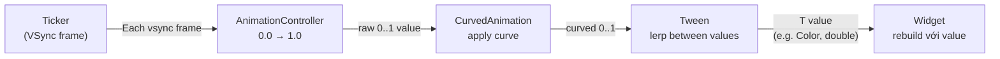

# Bài 8.2 — Explicit Animations & AnimationController

## Phần 1 — Khái Niệm & Mục Tiêu Bài Học

### Tại sao bài này quan trọng?

Khi implicit animations không đủ linh hoạt — bạn cần explicit control:
- Bắt đầu, dừng, reverse theo logic riêng
- Orchestrate nhiều animations theo sequence hoặc parallel
- Lắng nghe animation status để trigger hành động

```dart
// Explicit control: bạn là người điều khiển
_controller.forward();   // Bắt đầu
_controller.reverse();   // Chạy ngược
_controller.repeat();    // Lặp liên tục
_controller.stop();      // Dừng ngay
```

**Cảnh báo quan trọng**: AnimationController phải được `dispose()`! Quên dispose → memory leak.

### Bạn sẽ hiểu được sau bài này:
- `AnimationController`, `Tween`, `CurvedAnimation`
- `AnimatedBuilder` vs `addListener + setState`
- Difference: `forward()`, `reverse()`, `repeat()`, `reset()`
- Chaining animations với `.drive()` và `Interval`

---

## Phần 2 — Cơ Chế Hoạt Động (Under the Hood)

### Animation Value Flow



### AnimationController lifecycle trong State

```
initState() → new AnimationController(vsync: this)
                    ↓
              .forward() / .repeat()
                    ↓
              Each frame → value changes
                    ↓
              AnimatedBuilder rebuilds
                    ↓
dispose() → controller.dispose() ← BẮT BUỘC
```

---

## Phần 3 — Code Mẫu Chuẩn Google

### 3.1 — AnimationController cơ bản

```dart
class PulseButton extends StatefulWidget {
  final VoidCallback onPressed;
  final Widget child;

  const PulseButton({super.key, required this.onPressed, required this.child});

  @override
  State<PulseButton> createState() => _PulseButtonState();
}

class _PulseButtonState extends State<PulseButton>
    with SingleTickerProviderStateMixin {
  // SingleTickerProviderStateMixin: mixin cung cấp Ticker (VSync)
  // Dùng khi chỉ có 1 AnimationController

  late final AnimationController _controller;
  late final Animation<double> _scaleAnimation;

  @override
  void initState() {
    super.initState();

    _controller = AnimationController(
      vsync: this, // "this" = TickerProvider từ mixin
      duration: const Duration(milliseconds: 150),
    );

    // CurvedAnimation: wrap controller để apply curve
    final curvedAnimation = CurvedAnimation(
      parent: _controller,
      curve: Curves.easeInOut,
    );

    // Tween: map 0..1 của animation thành double value
    _scaleAnimation = Tween<double>(
      begin: 1.0,
      end: 0.92,
    ).animate(curvedAnimation);
  }

  @override
  void dispose() {
    _controller.dispose(); // BẮT BUỘC: ngăn memory leak
    super.dispose();
  }

  Future<void> _handleTap() async {
    await _controller.forward();      // Scale xuống
    await _controller.reverse();      // Scale lên lại
    widget.onPressed();               // Gọi callback sau animation
  }

  @override
  Widget build(BuildContext context) {
    // AnimatedBuilder: rebuild CHỈ phần widget bên trong khi animation thay đổi
    // → Hiệu quả hơn setState()
    return AnimatedBuilder(
      animation: _scaleAnimation, // Listen animation này
      builder: (context, child) {
        return Transform.scale(
          scale: _scaleAnimation.value,
          child: child, // child không rebuild theo animation
        );
      },
      child: ElevatedButton(
        // child truyền vào AnimatedBuilder.child không bị rebuild
        // → Flutter optimization: giữ nguyên subtree không đổi
        onPressed: _handleTap,
        child: widget.child,
      ),
    );
  }
}
```

### 3.2 — Nhiều Tween từ một Controller

```dart
class LoadingAnimation extends StatefulWidget {
  const LoadingAnimation({super.key});
  @override State<LoadingAnimation> createState() => _LoadingAnimationState();
}

class _LoadingAnimationState extends State<LoadingAnimation>
    with SingleTickerProviderStateMixin {
  late final AnimationController _controller;

  // Nhiều Animation từ MỘT controller bằng .drive()
  late final Animation<double> _rotationAnimation;
  late final Animation<double> _scaleAnimation;
  late final Animation<Color?> _colorAnimation;

  @override
  void initState() {
    super.initState();

    _controller = AnimationController(
      vsync: this,
      duration: const Duration(seconds: 2),
    )..repeat(); // Lặp liên tục ngay khi tạo

    // .drive(): thay thế .animate() — fluent API
    _rotationAnimation = _controller.drive(
      Tween<double>(begin: 0, end: 1), // 0 → 1 turn = 360 độ
    );

    // CurvedAnimation với Interval: chỉ animate trong khoảng 0.0-0.5
    _scaleAnimation = _controller.drive(
      Tween<double>(begin: 0.8, end: 1.2).chain(
        CurveTween(curve: const Interval(0.0, 0.5, curve: Curves.elasticOut)),
      ),
    );

    // Color animation
    _colorAnimation = _controller.drive(
      ColorTween(
        begin: Colors.blue,
        end: Colors.purple,
      ).chain(CurveTween(curve: Curves.easeInOut)),
    );
  }

  @override
  void dispose() {
    _controller.dispose();
    super.dispose();
  }

  @override
  Widget build(BuildContext context) {
    return AnimatedBuilder(
      animation: _controller, // Listen controller trực tiếp
      builder: (context, _) {
        return RotationTransition(
          turns: _rotationAnimation,
          child: ScaleTransition(
            scale: _scaleAnimation,
            child: Container(
              width: 60,
              height: 60,
              decoration: BoxDecoration(
                color: _colorAnimation.value,
                shape: BoxShape.circle,
              ),
            ),
          ),
        );
      },
    );
  }
}
```

### 3.3 — AnimationStatus Listener

```dart
class ExpandablePanel extends StatefulWidget {
  final Widget header;
  final Widget body;

  const ExpandablePanel({super.key, required this.header, required this.body});
  @override State<ExpandablePanel> createState() => _ExpandablePanelState();
}

class _ExpandablePanelState extends State<ExpandablePanel>
    with SingleTickerProviderStateMixin {
  late final AnimationController _controller;
  late final Animation<double> _expandAnimation;

  bool get _isExpanded => _controller.isCompleted;

  @override
  void initState() {
    super.initState();

    _controller = AnimationController(
      vsync: this,
      duration: const Duration(milliseconds: 300),
    );

    _expandAnimation = CurvedAnimation(
      parent: _controller,
      curve: Curves.easeInOut,
    );

    // Lắng nghe status để update UI state ngoài animation
    _controller.addStatusListener(_onStatusChanged);
  }

  void _onStatusChanged(AnimationStatus status) {
    // Rebuild để update icon rotation
    setState(() {});
  }

  @override
  void dispose() {
    _controller.removeStatusListener(_onStatusChanged); // Cleanup listener
    _controller.dispose();
    super.dispose();
  }

  void _toggle() {
    if (_isExpanded) {
      _controller.reverse();
    } else {
      _controller.forward();
    }
  }

  @override
  Widget build(BuildContext context) {
    return Column(
      children: [
        InkWell(
          onTap: _toggle,
          child: Padding(
            padding: const EdgeInsets.all(16),
            child: Row(
              mainAxisAlignment: MainAxisAlignment.spaceBetween,
              children: [
                widget.header,
                AnimatedRotation(
                  turns: _isExpanded ? 0.5 : 0,
                  duration: const Duration(milliseconds: 300),
                  child: const Icon(Icons.expand_more),
                ),
              ],
            ),
          ),
        ),
        // SizeTransition: animate height từ 0 đến full
        SizeTransition(
          sizeFactor: _expandAnimation,
          child: widget.body,
        ),
      ],
    );
  }
}
```

---

## Phần 4 — Lỗi Sai Phổ Biến & Best Practices

### ❌ Anti-pattern 1: Quên dispose AnimationController

```dart
// ❌ Memory leak: controller giữ Ticker alive sau khi widget unmount
class BadAnimation extends StatefulWidget { ... }
class _BadAnimationState extends State<BadAnimation>
    with SingleTickerProviderStateMixin {
  late final AnimationController _controller;

  @override
  void initState() {
    super.initState();
    _controller = AnimationController(vsync: this, duration: ...);
    _controller.repeat();
  }

  // ❌ Thiếu dispose() → Ticker vẫn chạy!

  @override
  Widget build(BuildContext context) => ...;
}

// ✅ Luôn override dispose
@override
void dispose() {
  _controller.dispose(); // Dừng Ticker, giải phóng resources
  super.dispose();
}
```

### ❌ Anti-pattern 2: addListener + setState thay vì AnimatedBuilder

```dart
// ❌ Không tốt: addListener + setState rebuild toàn bộ widget tree
class BadApproach extends State<MyWidget>
    with SingleTickerProviderStateMixin {
  late final AnimationController _controller;

  @override void initState() {
    super.initState();
    _controller = AnimationController(vsync: this, ...);
    // Mỗi frame → setState → rebuild toàn bộ build()
    _controller.addListener(() => setState(() {}));
  }

  @override
  Widget build(BuildContext context) {
    return Column(
      children: [
        // Chỉ cái này cần animate
        Transform.scale(scale: _controller.value, child: const Icon(Icons.star)),
        // Nhưng CẢ Column bị rebuild!
        const HeavyStaticWidget(),
        const AnotherStaticWidget(),
      ],
    );
  }
}

// ✅ AnimatedBuilder: scope rebuild nhỏ nhất
@override
Widget build(BuildContext context) {
  return Column(
    children: [
      AnimatedBuilder(
        animation: _controller,
        builder: (_, __) => Transform.scale(
          scale: _controller.value,
          child: const Icon(Icons.star),
        ),
      ),
      // Hai widget này KHÔNG rebuild theo animation
      const HeavyStaticWidget(),
      const AnotherStaticWidget(),
    ],
  );
}
```

### ❌ Anti-pattern 3: Dùng TickerProviderStateMixin khi chỉ cần một controller

```dart
// ❌ Không cần thiết: TickerProviderStateMixin cho phép nhiều tickers
class _MyState extends State<MyWidget> with TickerProviderStateMixin {
  late final AnimationController _controller; // Chỉ 1 controller

// ✅ SingleTickerProviderStateMixin khi có đúng 1 controller
class _MyState extends State<MyWidget> with SingleTickerProviderStateMixin {
  late final AnimationController _controller;
```

---

## Phần 5 — Bài Tập Củng Cố Tư Duy

### Challenge: Loading Spinner với AnimationController

**Yêu cầu:**
1. Spinner rotate 360° liên tục (`_controller.repeat()`)
2. Khi tap → spinner dừng, hiện checkmark với scale-in animation
3. Checkmark sau 2 giây → fade out, spinner restart
4. Dùng `addStatusListener` để trigger transition

**Gợi ý:**
- Dùng `TickerProviderStateMixin` vì cần 2 `AnimationController`
- Controller 1: rotation (repeat)
- Controller 2: checkmark appearance (forward, sau đó reverse)
- Manage state transition: loading → success → loading

### Câu hỏi phỏng vấn liên quan:

1. **"Sự khác biệt giữa SingleTickerProviderStateMixin và TickerProviderStateMixin?"**
   - Single: tối ưu cho đúng 1 controller, throw error nếu tạo nhiều hơn 1
   - Multi: cho phép tạo nhiều controllers

2. **"Tại sao AnimatedBuilder tốt hơn addListener + setState?"**
   - AnimatedBuilder chỉ rebuild subtree của mình
   - addListener + setState rebuild toàn bộ `build()` method

3. **"controller.forward() vs controller.repeat()?"**
   - `forward()`: animate từ current → 1.0 (một lần, return Future)
   - `repeat()`: loop mãi 0.0 → 1.0 → 0.0...
