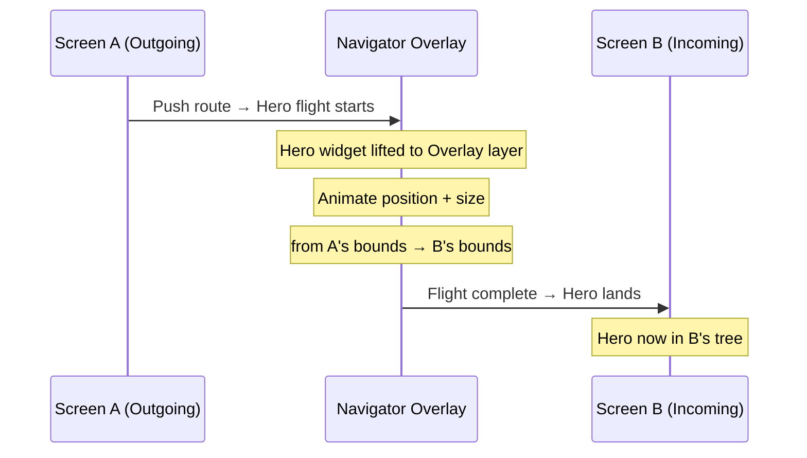

# Bài 8.3 — Hero Animations & Page Transitions

## Phần 1 — Khái Niệm & Mục Tiêu Bài Học

### Tại sao bài này quan trọng?

Hero animations tạo ra cảm giác "continuity" khi navigate — user thấy element di chuyển từ màn hình này sang màn hình khác, thay vì pop/push thô. Đây là kỹ thuật cốt lõi trong mobile UX hiện đại.

```dart
// Màn A: ảnh thumbnail
Hero(tag: 'product-${product.id}', child: Image.asset(product.image))

// Màn B: ảnh full-size
Hero(tag: 'product-${product.id}', child: Image.asset(product.image))
// Flutter tự animate transition!
```

### Bạn sẽ hiểu được sau bài này:
- `Hero` widget và tag matching mechanism
- `FlightShuttleBuilder`: customize widget trong khi đang bay
- `PageRouteBuilder`: tạo custom page transition
- Material animations package: `SharedAxisTransition`, `FadeThrough`

---

## Phần 2 — Cơ Chế Hoạt Động (Under the Hood)

### Hero Flight Mechanism



**Cơ chế thực tế:**
1. Navigator detect hai Hero có cùng `tag`
2. Hero widget được "lift" lên Navigator's overlay
3. Flutter animate `Rect` (position + size) từ A sang B
4. Sau khi animation xong → Hero được "đặt xuống" vào Screen B

---

## Phần 3 — Code Mẫu Chuẩn Google

### 3.1 — Hero Animation cơ bản

```dart
// --- Product List Screen ---
class ProductListScreen extends StatelessWidget {
  const ProductListScreen({super.key});

  @override
  Widget build(BuildContext context) {
    return Scaffold(
      appBar: AppBar(title: const Text('Sản phẩm')),
      body: ListView.builder(
        padding: const EdgeInsets.all(16),
        itemCount: products.length,
        itemBuilder: (context, i) {
          final product = products[i];
          return GestureDetector(
            onTap: () => Navigator.push(
              context,
              MaterialPageRoute(
                builder: (_) => ProductDetailScreen(product: product),
              ),
            ),
            child: Card(
              child: Row(
                children: [
                  // Hero: tag phải UNIQUE và khớp với màn hình detail
                  Hero(
                    tag: 'product-image-${product.id}',
                    child: ClipRRect(
                      borderRadius: BorderRadius.circular(8),
                      child: Image.network(
                        product.imageUrl,
                        width: 80,
                        height: 80,
                        fit: BoxFit.cover,
                      ),
                    ),
                  ),
                  const SizedBox(width: 12),
                  Text(product.name),
                ],
              ),
            ),
          );
        },
      ),
    );
  }
}

// --- Product Detail Screen ---
class ProductDetailScreen extends StatelessWidget {
  final Product product;
  const ProductDetailScreen({super.key, required this.product});

  @override
  Widget build(BuildContext context) {
    return Scaffold(
      body: CustomScrollView(
        slivers: [
          SliverAppBar(
            expandedHeight: 300,
            pinned: true,
            flexibleSpace: FlexibleSpaceBar(
              background: Hero(
                // Cùng tag → Flutter kết nối hai Hero
                tag: 'product-image-${product.id}',
                child: Image.network(
                  product.imageUrl,
                  fit: BoxFit.cover,
                ),
              ),
            ),
          ),
          SliverToBoxAdapter(
            child: Padding(
              padding: const EdgeInsets.all(16),
              child: Column(
                crossAxisAlignment: CrossAxisAlignment.start,
                children: [
                  Text(product.name, style: Theme.of(context).textTheme.headlineMedium),
                  const SizedBox(height: 8),
                  Text(product.description),
                ],
              ),
            ),
          ),
        ],
      ),
    );
  }
}
```

### 3.2 — FlightShuttleBuilder: Custom hero widget

```dart
Hero(
  tag: 'avatar-${user.id}',
  // FlightShuttleBuilder: widget được dùng TRONG KHI bay
  // Thay vì dùng child widget gốc
  flightShuttleBuilder: (
    BuildContext flightContext,
    Animation<double> animation,
    HeroFlightDirection flightDirection,
    BuildContext fromHeroContext,
    BuildContext toHeroContext,
  ) {
    // Có thể dùng animation để customize
    return AnimatedBuilder(
      animation: animation,
      builder: (_, child) => Opacity(
        opacity: animation.value,
        child: child,
      ),
      child: CircleAvatar(
        backgroundImage: NetworkImage(user.avatarUrl),
        radius: 100, // Size lớn hơn để tránh blur khi scale
      ),
    );
  },
  child: CircleAvatar(
    backgroundImage: NetworkImage(user.avatarUrl),
    radius: 24,
  ),
),
```

### 3.3 — PageRouteBuilder: Custom page transition

```dart
// Slide from right + fade
class SlideInRoute<T> extends PageRouteBuilder<T> {
  final Widget child;

  SlideInRoute({required this.child})
      : super(
          transitionDuration: const Duration(milliseconds: 300),
          reverseTransitionDuration: const Duration(milliseconds: 250),
          pageBuilder: (_, __, ___) => child,
          transitionsBuilder: (_, animation, secondaryAnimation, child) {
            // Primary animation: màn hình MỚI vào
            final slideIn = Tween<Offset>(
              begin: const Offset(1, 0), // Từ bên phải
              end: Offset.zero,
            ).animate(CurvedAnimation(
              parent: animation,
              curve: Curves.easeInOutCubic,
            ));

            // Secondary animation: màn hình CŨ ra
            final fadeOut = Tween<double>(begin: 1, end: 0.8).animate(
              CurvedAnimation(parent: secondaryAnimation, curve: Curves.easeIn),
            );

            return FadeTransition(
              opacity: fadeOut,
              child: SlideTransition(position: slideIn, child: child),
            );
          },
        );
}

// Cách dùng:
Navigator.push(
  context,
  SlideInRoute(child: const DetailScreen()),
);
```

### 3.4 — Material Animations Package

```dart
// Material animations package: https://pub.dev/packages/animations
// Provides: SharedAxisTransition, FadeThrough, ContainerTransform

import 'package:animations/animations.dart';

// 1. OpenContainer: container expand animation
class ProductCard extends StatelessWidget {
  final Product product;
  const ProductCard({super.key, required this.product});

  @override
  Widget build(BuildContext context) {
    return OpenContainer<void>(
      transitionDuration: const Duration(milliseconds: 400),
      closedElevation: 2,
      closedShape: RoundedRectangleBorder(
        borderRadius: BorderRadius.circular(12),
      ),
      closedBuilder: (context, openContainer) => InkWell(
        onTap: openContainer, // Trigger animation
        child: ProductTile(product: product),
      ),
      openBuilder: (context, closeContainer) => ProductDetailPage(
        product: product,
        onClose: closeContainer,
      ),
    );
  }
}

// 2. PageTransitionSwitcher với FadeThrough — giữa tabs
class TabbedContent extends StatefulWidget {
  const TabbedContent({super.key});
  @override State<TabbedContent> createState() => _TabbedContentState();
}

class _TabbedContentState extends State<TabbedContent> {
  int _selectedTab = 0;

  final List<Widget> _tabs = const [HomeTab(), SearchTab(), ProfileTab()];

  @override
  Widget build(BuildContext context) {
    return Scaffold(
      body: PageTransitionSwitcher(
        transitionBuilder: (child, animation, secondaryAnimation) {
          return FadeThroughTransition(
            animation: animation,
            secondaryAnimation: secondaryAnimation,
            child: child,
          );
        },
        // Key quan trọng: phân biệt tabs
        child: KeyedSubtree(
          key: ValueKey(_selectedTab),
          child: _tabs[_selectedTab],
        ),
      ),
      bottomNavigationBar: BottomNavigationBar(
        currentIndex: _selectedTab,
        onTap: (i) => setState(() => _selectedTab = i),
        items: const [
          BottomNavigationBarItem(icon: Icon(Icons.home), label: 'Home'),
          BottomNavigationBarItem(icon: Icon(Icons.search), label: 'Search'),
          BottomNavigationBarItem(icon: Icon(Icons.person), label: 'Profile'),
        ],
      ),
    );
  }
}
```

---

## Phần 4 — Lỗi Sai Phổ Biến & Best Practices

### ❌ Anti-pattern 1: Hero tag không unique

```dart
// ❌ Bug: Nhiều item trong list có cùng tag → Hero crash hoặc behavior sai
ListView.builder(
  itemBuilder: (_, i) => Hero(
    tag: 'product-image', // ← Tất cả items cùng tag!
    child: ...,
  ),
)

// ✅ Tag phải unique cho mỗi item
ListView.builder(
  itemBuilder: (_, i) => Hero(
    tag: 'product-image-${products[i].id}', // ← Unique per item
    child: ...,
  ),
)
```

### ❌ Anti-pattern 2: Hero với widget tree phức tạp trong FlightShuttleBuilder

```dart
// ❌ Nặng: FlightShuttleBuilder build widget phức tạp → frame drop
flightShuttleBuilder: (_, __, ___, ____, _____) => ComplexWidget(...),

// ✅ Nhẹ: Chỉ hiển thị image/simple widget khi bay
flightShuttleBuilder: (_, animation, ___, ____, _____) {
  return Image.network(product.imageUrl, fit: BoxFit.cover);
}
```

---

## Phần 5 — Bài Tập Củng Cố Tư Duy

### Challenge: Photo Gallery với Hero

**Yêu cầu:**
1. Màn A: Grid ảnh thumbnail (3 cột)
2. Tap ảnh → Hero animation mở full-screen viewer
3. Swipe left/right để xem ảnh kế (dùng `PageView`)
4. Back button → Hero animation back với ảnh hiện tại

**Gợi ý:**
- Tag Hero phải dynamic theo ảnh hiện tại trong PageView
- Khi swipe sang ảnh khác, tag thay đổi → back về ảnh nào đang xem

### Câu hỏi phỏng vấn liên quan:

1. **"Tại sao Hero tag phải unique?"**
   - Flutter tìm Hero theo tag trong Navigator overlay
   - Duplicate tag → confuse Flutter → crash hoặc wrong animation

2. **"Sự khác biệt giữa Hero và AnimatedContainer?"**
   - Hero: persist element GIỮA các routes (cross-route)
   - AnimatedContainer: animate property thay đổi trong CÙNG route

3. **"PageRouteBuilder vs MaterialPageRoute?"**
   - MaterialPageRoute: default transition (slide/fade tùy platform)
   - PageRouteBuilder: full control — custom transition, duration
