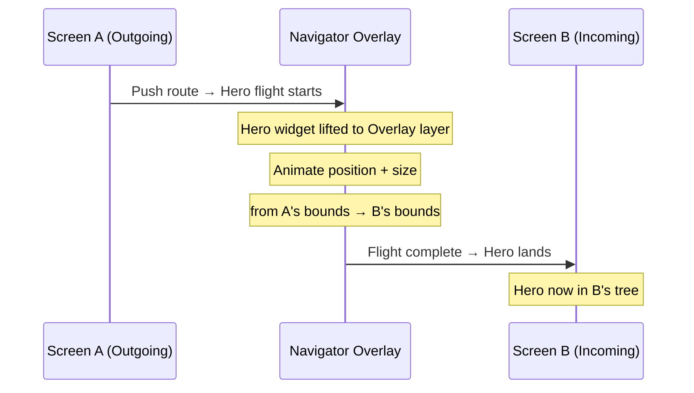

# Bài 8.3 — Hero Animations & Page Transitions

## Phần 1 — Khái Niệm & Mục Tiêu Bài Học

### Tại sao bài này quan trọng?

Hero animations tạo ra cảm giác "continuity" khi navigate — user thấy element di chuyển từ màn hình này sang màn hình khác, thay vì pop/push thô. Đây là kỹ thuật cốt lõi trong mobile UX hiện đại.

```dart
// Màn A: ảnh thumbnail
Hero(tag: 'product-${product.id}', child: Image.asset(product.image))

// Màn B: ảnh full-size
Hero(tag: 'product-${product.id}', child: Image.asset(product.image))
// Flutter tự animate transition!
```

### Bạn sẽ hiểu được sau bài này:
- `Hero` widget và tag matching mechanism
- `FlightShuttleBuilder`: customize widget trong khi đang bay
- `PageRouteBuilder`: tạo custom page transition
- Material animations package: `SharedAxisTransition`, `FadeThrough`

---

## Phần 2 — Cơ Chế Hoạt Động (Under the Hood)

### Hero Flight Mechanism



**Cơ chế thực tế:**
1. Navigator detect hai Hero có cùng `tag`
2. Hero widget được "lift" lên Navigator's overlay
3. Flutter animate `Rect` (position + size) từ A sang B
4. Sau khi animation xong → Hero được "đặt xuống" vào Screen B

---

## Phần 3 — Code Mẫu Chuẩn Google

### 3.1 — Hero Animation cơ bản

```dart
// --- Product List Screen ---
class ProductListScreen extends StatelessWidget {
  const ProductListScreen({super.key});

  @override
  Widget build(BuildContext context) {
    return Scaffold(
      appBar: AppBar(title: const Text('Sản phẩm')),
      body: ListView.builder(
        padding: const EdgeInsets.all(16),
        itemCount: products.length,
        itemBuilder: (context, i) {
          final product = products[i];
          return GestureDetector(
            onTap: () => Navigator.push(
              context,
              MaterialPageRoute(
                builder: (_) => ProductDetailScreen(product: product),
              ),
            ),
            child: Card(
              child: Row(
                children: [
                  // Hero: tag phải UNIQUE và khớp với màn hình detail
                  Hero(
                    tag: 'product-image-${product.id}',
                    child: ClipRRect(
                      borderRadius: BorderRadius.circular(8),
                      child: Image.network(
                        product.imageUrl,
                        width: 80,
                        height: 80,
                        fit: BoxFit.cover,
                      ),
                    ),
                  ),
                  const SizedBox(width: 12),
                  Text(product.name),
                ],
              ),
            ),
          );
        },
      ),
    );
  }
}

// --- Product Detail Screen ---
class ProductDetailScreen extends StatelessWidget {
  final Product product;
  const ProductDetailScreen({super.key, required this.product});

  @override
  Widget build(BuildContext context) {
    return Scaffold(
      body: CustomScrollView(
        slivers: [
          SliverAppBar(
            expandedHeight: 300,
            pinned: true,
            flexibleSpace: FlexibleSpaceBar(
              background: Hero(
                // Cùng tag → Flutter kết nối hai Hero
                tag: 'product-image-${product.id}',
                child: Image.network(
                  product.imageUrl,
                  fit: BoxFit.cover,
                ),
              ),
            ),
          ),
          SliverToBoxAdapter(
            child: Padding(
              padding: const EdgeInsets.all(16),
              child: Column(
                crossAxisAlignment: CrossAxisAlignment.start,
                children: [
                  Text(product.name, style: Theme.of(context).textTheme.headlineMedium),
                  const SizedBox(height: 8),
                  Text(product.description),
                ],
              ),
            ),
          ),
        ],
      ),
    );
  }
}
```

### 3.2 — FlightShuttleBuilder: Custom hero widget

```dart
Hero(
  tag: 'avatar-${user.id}',
  // FlightShuttleBuilder: widget được dùng TRONG KHI bay
  // Thay vì dùng child widget gốc
  flightShuttleBuilder: (
    BuildContext flightContext,
    Animation<double> animation,
    HeroFlightDirection flightDirection,
    BuildContext fromHeroContext,
    BuildContext toHeroContext,
  ) {
    // Có thể dùng animation để customize
    return AnimatedBuilder(
      animation: animation,
      builder: (_, child) => Opacity(
        opacity: animation.value,
        child: child,
      ),
      child: CircleAvatar(
        backgroundImage: NetworkImage(user.avatarUrl),
        radius: 100, // Size lớn hơn để tránh blur khi scale
      ),
    );
  },
  child: CircleAvatar(
    backgroundImage: NetworkImage(user.avatarUrl),
    radius: 24,
  ),
),
```

### 3.3 — PageRouteBuilder: Custom page transition

```dart
// Slide from right + fade
class SlideInRoute<T> extends PageRouteBuilder<T> {
  final Widget child;

  SlideInRoute({required this.child})
      : super(
          transitionDuration: const Duration(milliseconds: 300),
          reverseTransitionDuration: const Duration(milliseconds: 250),
          pageBuilder: (_, __, ___) => child,
          transitionsBuilder: (_, animation, secondaryAnimation, child) {
            // Primary animation: màn hình MỚI vào
            final slideIn = Tween<Offset>(
              begin: const Offset(1, 0), // Từ bên phải
              end: Offset.zero,
            ).animate(CurvedAnimation(
              parent: animation,
              curve: Curves.easeInOutCubic,
            ));

            // Secondary animation: màn hình CŨ ra
            final fadeOut = Tween<double>(begin: 1, end: 0.8).animate(
              CurvedAnimation(parent: secondaryAnimation, curve: Curves.easeIn),
            );

            return FadeTransition(
              opacity: fadeOut,
              child: SlideTransition(position: slideIn, child: child),
            );
          },
        );
}

// Cách dùng:
Navigator.push(
  context,
  SlideInRoute(child: const DetailScreen()),
);
```

### 3.4 — Material Animations Package

```dart
// Material animations package: https://pub.dev/packages/animations
// Provides: SharedAxisTransition, FadeThrough, ContainerTransform

import 'package:animations/animations.dart';

// 1. OpenContainer: container expand animation
class ProductCard extends StatelessWidget {
  final Product product;
  const ProductCard({super.key, required this.product});

  @override
  Widget build(BuildContext context) {
    return OpenContainer<void>(
      transitionDuration: const Duration(milliseconds: 400),
      closedElevation: 2,
      closedShape: RoundedRectangleBorder(
        borderRadius: BorderRadius.circular(12),
      ),
      closedBuilder: (context, openContainer) => InkWell(
        onTap: openContainer, // Trigger animation
        child: ProductTile(product: product),
      ),
      openBuilder: (context, closeContainer) => ProductDetailPage(
        product: product,
        onClose: closeContainer,
      ),
    );
  }
}

// 2. PageTransitionSwitcher với FadeThrough — giữa tabs
class TabbedContent extends StatefulWidget {
  const TabbedContent({super.key});
  @override State<TabbedContent> createState() => _TabbedContentState();
}

class _TabbedContentState extends State<TabbedContent> {
  int _selectedTab = 0;

  final List<Widget> _tabs = const [HomeTab(), SearchTab(), ProfileTab()];

  @override
  Widget build(BuildContext context) {
    return Scaffold(
      body: PageTransitionSwitcher(
        transitionBuilder: (child, animation, secondaryAnimation) {
          return FadeThroughTransition(
            animation: animation,
            secondaryAnimation: secondaryAnimation,
            child: child,
          );
        },
        // Key quan trọng: phân biệt tabs
        child: KeyedSubtree(
          key: ValueKey(_selectedTab),
          child: _tabs[_selectedTab],
        ),
      ),
      bottomNavigationBar: BottomNavigationBar(
        currentIndex: _selectedTab,
        onTap: (i) => setState(() => _selectedTab = i),
        items: const [
          BottomNavigationBarItem(icon: Icon(Icons.home), label: 'Home'),
          BottomNavigationBarItem(icon: Icon(Icons.search), label: 'Search'),
          BottomNavigationBarItem(icon: Icon(Icons.person), label: 'Profile'),
        ],
      ),
    );
  }
}
```

---

## Phần 4 — Lỗi Sai Phổ Biến & Best Practices

### ❌ Anti-pattern 1: Hero tag không unique

```dart
// ❌ Bug: Nhiều item trong list có cùng tag → Hero crash hoặc behavior sai
ListView.builder(
  itemBuilder: (_, i) => Hero(
    tag: 'product-image', // ← Tất cả items cùng tag!
    child: ...,
  ),
)

// ✅ Tag phải unique cho mỗi item
ListView.builder(
  itemBuilder: (_, i) => Hero(
    tag: 'product-image-${products[i].id}', // ← Unique per item
    child: ...,
  ),
)
```

### ❌ Anti-pattern 2: Hero với widget tree phức tạp trong FlightShuttleBuilder

```dart
// ❌ Nặng: FlightShuttleBuilder build widget phức tạp → frame drop
flightShuttleBuilder: (_, __, ___, ____, _____) => ComplexWidget(...),

// ✅ Nhẹ: Chỉ hiển thị image/simple widget khi bay
flightShuttleBuilder: (_, animation, ___, ____, _____) {
  return Image.network(product.imageUrl, fit: BoxFit.cover);
}
```

---

## Phần 5 — Bài Tập Củng Cố Tư Duy

### Challenge: Photo Gallery với Hero

**Yêu cầu:**
1. Màn A: Grid ảnh thumbnail (3 cột)
2. Tap ảnh → Hero animation mở full-screen viewer
3. Swipe left/right để xem ảnh kế (dùng `PageView`)
4. Back button → Hero animation back với ảnh hiện tại

**Gợi ý:**
- Tag Hero phải dynamic theo ảnh hiện tại trong PageView
- Khi swipe sang ảnh khác, tag thay đổi → back về ảnh nào đang xem

### Câu Hỏi Phỏng Vấn

> **[Junior]** — nắm khái niệm | **[Middle]** — hiểu cơ chế | **[Senior]** — hiểu Flutter internals | **[Trace Code]** — đọc code và dự đoán output

---

#### Q1 [Junior] — "Tại sao Hero tag phải unique? Duplicate tag gây ra gì?"

**Trả lời chuẩn:**

Flutter tìm kiếm Hero widgets trong cả source route và destination route theo `tag`. Nếu có duplicate tags:

```dart
// ❌ Duplicate tag trong cùng route → assertion error
Scaffold(
  body: Column(children: [
    Hero(tag: 'image', child: Image.asset('photo.jpg')), // (A)
    Hero(tag: 'image', child: Image.asset('photo2.jpg')), // (B) — SAME TAG!
  ]),
)
// Flutter assert: "There are multiple heroes that share the same tag"
// → throw FlutterError trong debug mode

// ✅ Unique tags
Hero(tag: 'image_1', child: Image.asset('photo.jpg'))
Hero(tag: 'image_2', child: Image.asset('photo2.jpg'))

// ✅ Dynamic tag từ data model (list items)
ListView.builder(
  itemBuilder: (ctx, i) => Hero(
    tag: 'product_${items[i].id}', // unique per item
    child: ProductCard(item: items[i]),
  ),
)
```

---

#### Q2 [Junior] — "Sự khác biệt giữa `Hero` và `AnimatedContainer`?"

**Trả lời chuẩn:**

| | `Hero` | `AnimatedContainer` |
|---|---|---|
| **Scope** | Cross-route (giữa 2 screens) | Same-route (trong 1 screen) |
| **What animates** | Position, size, shape của widget | Properties (color, size, border-radius) |
| **Control** | Tự động khi navigate | Manual — thay đổi value + setState |
| **Use case** | Shared element transition | Value animation trong screen |

```dart
// Hero — widget "bay" từ list screen sang detail screen
// Screen A (list)
Hero(
  tag: 'product_image_${product.id}',
  child: Image.network(product.imageUrl),
)

// Screen B (detail) — cùng tag → Hero animation
Hero(
  tag: 'product_image_${product.id}',
  child: Image.network(product.imageUrl, width: double.infinity),
)
// Khi navigate: image "bay" từ small (list) sang large (detail)

// AnimatedContainer — thay đổi trong cùng screen
AnimatedContainer(
  duration: const Duration(milliseconds: 300),
  width: _isExpanded ? 200 : 100, // animate size change
  color: _isSelected ? Colors.blue : Colors.grey,
)
```

---

#### Q3 [Middle] — "`PageRouteBuilder` vs `MaterialPageRoute` — khi nào cần custom?"

**Trả lời chuẩn:**

| | `MaterialPageRoute` | `PageRouteBuilder` |
|---|---|---|
| **Transition** | Platform default (slide iOS, fade Android) | Custom hoàn toàn |
| **Duration** | Platform default (~300ms) | Tùy chỉnh |
| **Code** | 1 dòng | Nhiều hơn |
| **Use case** | Hầu hết screens | Custom branded transitions |

```dart
// MaterialPageRoute — platform-appropriate transition
Navigator.push(context, MaterialPageRoute(
  builder: (_) => const DetailPage(),
));

// PageRouteBuilder — custom fade + scale transition
Navigator.push(context, PageRouteBuilder(
  pageBuilder: (ctx, anim, secAnim) => const DetailPage(),
  transitionDuration: const Duration(milliseconds: 400),
  reverseTransitionDuration: const Duration(milliseconds: 300),
  transitionsBuilder: (ctx, animation, secondaryAnimation, child) {
    return FadeTransition(
      opacity: CurvedAnimation(parent: animation, curve: Curves.easeOut),
      child: ScaleTransition(
        scale: Tween<double>(begin: 0.9, end: 1.0)
            .animate(CurvedAnimation(parent: animation, curve: Curves.easeOut)),
        child: child,
      ),
    );
  },
));
```

---

#### Q4 [Senior] — "Hero animation cơ chế: Flutter dùng `Overlay` thế nào để 'fly' widget giữa routes?"

**Trả lời chuẩn:**

Hero animation là phức tạp nhất trong Flutter animation system. Cơ chế:

**Phase 1 — Chụp "from" position:**
```
Navigator.push() triggered
  ↓
HeroController.didPush()
  ↓
Flutter scan source route (current) tìm tất cả Hero widgets → fromHeroes map
Flutter scan destination route (new) tìm tất cả Hero widgets → toHeroes map
  ↓
Với mỗi matching tag: capture fromHero.renderBox (position + size)
```

**Phase 2 — Create flight widget:**
```
Tạo OverlayEntry mới → đặt VÀO Overlay (trên cả hai routes)
Flight widget:
  - Bắt đầu tại fromHero position + size
  - Animate đến toHero position + size
  - Source Hero bị ẩn (opacity=0) trong khi flight
  - Destination Hero bị ẩn (opacity=0) trong khi flight

Animation:
  size: lerp(fromSize, toSize)
  position: lerp(fromOffset, toOffset)  
```

**Phase 3 — Landing:**
```
Khi animation complete:
  - OverlayEntry removed
  - Destination Hero hiện lại (opacity=1)
  - Flight widget removed
```

---

#### Q5 [Middle] — "`Hero.flightShuttleBuilder` dùng để làm gì? Khi nào cần custom?"

**Trả lời chuẩn:**

Mặc định, Hero dùng **destination widget** làm flight shuttle (widget bay trên Overlay). `flightShuttleBuilder` cho phép customize widget trong flight:

```dart
Hero(
  tag: 'avatar',
  flightShuttleBuilder: (
    flightContext,
    animation,
    flightDirection,        // HeroFlightDirection.push hoặc .pop
    fromHeroContext,        // context của source Hero
    toHeroContext,          // context của destination Hero
  ) {
    // Return widget sẽ hiện trong suốt flight
    return AnimatedBuilder(
      animation: animation,
      builder: (ctx, _) {
        // Blend từ source → destination appearance
        return Material(
          type: MaterialType.transparency,
          child: Image.network(
            imageUrl,
            // Resize animation
            width: lerpDouble(
              fromHeroContext.size?.width,
              toHeroContext.size?.width,
              animation.value,
            ),
          ),
        );
      },
    );
  },
  child: CircleAvatar(backgroundImage: NetworkImage(imageUrl)),
)
```

**Khi cần `flightShuttleBuilder`:**
- Source và destination có shape khác nhau (circle → rectangle)
- Muốn custom visual trong flight (blend effect)
- Destination widget có loading state cần hide trong flight

---

#### Q6 [Middle] — "Tại sao Hero animation có thể fail với `ListView` recycling widgets?"

**Trả lời chuẩn:**

`ListView.builder` **recycles** Elements — khi item scroll off screen, Element bị deactivated. Nếu Hero widget nằm trong recycled element:

```dart
// ❌ Vấn đề: ListView item scrolled off → Hero Element deactivated
ListView.builder(
  itemBuilder: (ctx, i) => Hero(
    tag: 'item_$i',
    child: Image.network(items[i].url),
  ),
)

// User scroll để item 0 off screen → tap detail của item 0
// Hero animation: Flutter tìm source Hero với tag 'item_0'
// Source Hero element bị deactivated → không tìm thấy → NO animation
```

**Solutions:**

```dart
// Fix 1: Scroll item vào visible trước khi navigate
// Dùng ScrollController.animateTo() để ensure item visible

// Fix 2: Dùng placeholder Hero tại fixed position
// Source: Hero(tag: 'image') ở top của screen (không scroll)
// Destination: Hero(tag: 'image') ở detail

// Fix 3: Wrap ListView trong SingleChildScrollView với fixed-position Hero
Stack(children: [
  ListView.builder(...),
  Positioned(
    top: selectedItemOffset,
    child: Hero(tag: 'image_$selectedId', child: ...),
  ),
])
```

---

#### Q7 [Trace Code] — "Hai Hero cùng tag trong cùng route: lỗi gì xảy ra?"

```dart
// Scenario A: Hai Hero cùng tag trong cùng route
Scaffold(
  body: Column(
    children: [
      Hero(
        tag: 'shared_image',       // (A) tag = 'shared_image'
        child: const FlutterLogo(size: 50),
      ),
      Hero(
        tag: 'shared_image',       // (B) tag = 'shared_image' — DUPLICATE!
        child: const FlutterLogo(size: 100),
      ),
    ],
  ),
)

// Scenario B: Hero trong route nguồn, navigate đến route không có Hero cùng tag
// Route A: Hero(tag: 'unique')
// Route B: không có Hero tag 'unique'
Navigator.push(context, MaterialPageRoute(builder: (_) => const NoHeroPage()));
```

**Scenario A:**
- Trong **debug mode**: Flutter assert `There are multiple heroes that share the same tag within a subtree` → throw `FlutterError` → app crash với red screen
- Trong **release mode**: Behavior undefined — có thể chọn một trong hai Heroes, animation có thể glitch

**Scenario B:**
- **Không lỗi** — Hero animation chỉ xảy ra khi cả source và destination đều có Hero cùng tag
- Nếu không có matching Hero trong destination → widget (A) trong source route vẫn render bình thường — chỉ không có animation
- Transition dùng standard route animation (slide/fade) thay vì Hero animation

**Conclusion:** Hero tag phải unique trong **từng route** (không nhất thiết phải global unique — có thể dùng cùng tag trong 2 routes khác nhau để trigger Hero animation).
