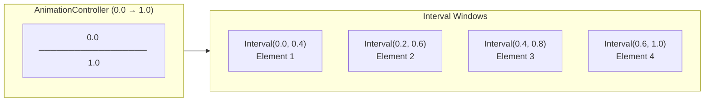

# Bài 8.4 — Staggered Animations

## Phần 1 — Khái Niệm & Mục Tiêu Bài Học

### Tại sao bài này quan trọng?

Staggered animation là kỹ thuật làm nhiều elements animate theo sequence — mỗi element delay nhau một khoảng nhỏ, tạo hiệu ứng "cascade" hoặc "ripple" rất đẹp mắt.

```
Element 1: |████░░░░░░|
Element 2: |░░██████░░|
Element 3: |░░░░████░░|
Element 4: |░░░░░░████|
           0%        100%  (timeline)
```

Kỹ thuật chính: `Interval` curve — chia timeline 0..1 thành các "window" cho từng animation.

### Bạn sẽ hiểu được sau bài này:
- `Interval` curve và stagger timing
- `AnimationController.drive()` chaining
- List item appear animation on scroll
- Real-world: onboarding screen, menu reveal

---

## Phần 2 — Cơ Chế Hoạt Động (Under the Hood)

### Interval Curve



`Interval(begin, end)` maps toàn bộ controller 0..1 vào khoảng `[begin, end]`:
- Trước `begin`: animation value = 0
- Trong `[begin, end]`: interpolate 0..1
- Sau `end`: animation value = 1

---

## Phần 3 — Code Mẫu Chuẩn Google

### 3.1 — Staggered List với Interval

```dart
class StaggeredMenuScreen extends StatefulWidget {
  const StaggeredMenuScreen({super.key});
  @override State<StaggeredMenuScreen> createState() => _StaggeredMenuState();
}

class _StaggeredMenuState extends State<StaggeredMenuScreen>
    with SingleTickerProviderStateMixin {
  late final AnimationController _controller;
  late final List<Animation<Offset>> _slideAnimations;
  late final List<Animation<double>> _fadeAnimations;

  static const _menuItems = [
    ('Trang chủ', Icons.home),
    ('Tìm kiếm', Icons.search),
    ('Đơn hàng', Icons.shopping_bag),
    ('Hồ sơ', Icons.person),
    ('Cài đặt', Icons.settings),
  ];

  @override
  void initState() {
    super.initState();
    _controller = AnimationController(
      vsync: this,
      duration: const Duration(milliseconds: 800),
    );

    final count = _menuItems.length;

    _slideAnimations = List.generate(count, (i) {
      // Stagger: mỗi item bắt đầu delay 0.1 * i
      final start = i * 0.1;
      final end = start + 0.5; // Mỗi item animate trong 50% timeline

      return Tween<Offset>(
        begin: const Offset(-1, 0), // Từ trái
        end: Offset.zero,
      ).animate(CurvedAnimation(
        parent: _controller,
        curve: Interval(start, end.clamp(0.0, 1.0), curve: Curves.easeOut),
      ));
    });

    _fadeAnimations = List.generate(count, (i) {
      final start = i * 0.1;
      final end = (start + 0.4).clamp(0.0, 1.0);

      return Tween<double>(begin: 0, end: 1).animate(CurvedAnimation(
        parent: _controller,
        curve: Interval(start, end, curve: Curves.easeIn),
      ));
    });

    // Auto-play khi màn hình xuất hiện
    _controller.forward();
  }

  @override
  void dispose() {
    _controller.dispose();
    super.dispose();
  }

  @override
  Widget build(BuildContext context) {
    return Scaffold(
      appBar: AppBar(
        title: const Text('Menu'),
        actions: [
          IconButton(
            icon: const Icon(Icons.refresh),
            onPressed: () {
              _controller.reset();
              _controller.forward();
            },
          ),
        ],
      ),
      body: AnimatedBuilder(
        animation: _controller,
        builder: (context, _) {
          return ListView.separated(
            padding: const EdgeInsets.all(16),
            itemCount: _menuItems.length,
            separatorBuilder: (_, __) => const SizedBox(height: 8),
            itemBuilder: (context, i) {
              final (label, icon) = _menuItems[i];
              return FadeTransition(
                opacity: _fadeAnimations[i],
                child: SlideTransition(
                  position: _slideAnimations[i],
                  child: ListTile(
                    leading: Icon(icon),
                    title: Text(label),
                    shape: RoundedRectangleBorder(
                      borderRadius: BorderRadius.circular(12),
                    ),
                    tileColor: Theme.of(context).colorScheme.surfaceVariant,
                    onTap: () {},
                  ),
                ),
              );
            },
          );
        },
      ),
    );
  }
}
```

### 3.2 — Staggered on Scroll (Appear animation)

```dart
class AnimatedOnScrollItem extends StatefulWidget {
  final Widget child;
  final int index; // Để tính delay

  const AnimatedOnScrollItem({
    super.key,
    required this.child,
    required this.index,
  });

  @override
  State<AnimatedOnScrollItem> createState() => _AnimatedOnScrollItemState();
}

class _AnimatedOnScrollItemState extends State<AnimatedOnScrollItem>
    with SingleTickerProviderStateMixin {
  late final AnimationController _controller;
  late final Animation<double> _fadeAnimation;
  late final Animation<Offset> _slideAnimation;

  @override
  void initState() {
    super.initState();

    _controller = AnimationController(
      vsync: this,
      duration: const Duration(milliseconds: 400),
    );

    _fadeAnimation = CurvedAnimation(parent: _controller, curve: Curves.easeOut);
    _slideAnimation = Tween<Offset>(
      begin: const Offset(0, 0.3),
      end: Offset.zero,
    ).animate(CurvedAnimation(parent: _controller, curve: Curves.easeOut));

    // Delay dựa trên index để tạo cascade effect
    Future.delayed(
      Duration(milliseconds: widget.index * 80), // 80ms per item
      () {
        // Check mounted: widget có thể đã bị dispose trong khi delay
        if (mounted) _controller.forward();
      },
    );
  }

  @override
  void dispose() {
    _controller.dispose();
    super.dispose();
  }

  @override
  Widget build(BuildContext context) {
    return FadeTransition(
      opacity: _fadeAnimation,
      child: SlideTransition(position: _slideAnimation, child: widget.child),
    );
  }
}

// Sử dụng trong list:
class ProductGrid extends StatelessWidget {
  final List<Product> products;
  const ProductGrid({super.key, required this.products});

  @override
  Widget build(BuildContext context) {
    return GridView.builder(
      gridDelegate: const SliverGridDelegateWithFixedCrossAxisCount(
        crossAxisCount: 2,
        childAspectRatio: 0.75,
      ),
      itemCount: products.length,
      itemBuilder: (context, i) => AnimatedOnScrollItem(
        index: i,
        child: ProductCard(product: products[i]),
      ),
    );
  }
}
```

### 3.3 — Onboarding Screen với Staggered

```dart
class OnboardingScreen extends StatefulWidget {
  const OnboardingScreen({super.key});
  @override State<OnboardingScreen> createState() => _OnboardingScreenState();
}

class _OnboardingScreenState extends State<OnboardingScreen>
    with SingleTickerProviderStateMixin {
  late final AnimationController _controller;
  late final Animation<double> _imageAnimation;
  late final Animation<double> _titleAnimation;
  late final Animation<double> _subtitleAnimation;
  late final Animation<double> _buttonAnimation;

  @override
  void initState() {
    super.initState();

    _controller = AnimationController(
      vsync: this,
      duration: const Duration(milliseconds: 1200),
    );

    // Image: 0-40% of timeline
    _imageAnimation = CurvedAnimation(
      parent: _controller,
      curve: const Interval(0.0, 0.4, curve: Curves.elasticOut),
    );

    // Title: 25-55%
    _titleAnimation = CurvedAnimation(
      parent: _controller,
      curve: const Interval(0.25, 0.55, curve: Curves.easeOut),
    );

    // Subtitle: 40-70%
    _subtitleAnimation = CurvedAnimation(
      parent: _controller,
      curve: const Interval(0.4, 0.7, curve: Curves.easeOut),
    );

    // Button: 60-100%
    _buttonAnimation = CurvedAnimation(
      parent: _controller,
      curve: const Interval(0.6, 1.0, curve: Curves.easeOut),
    );

    _controller.forward();
  }

  @override
  void dispose() {
    _controller.dispose();
    super.dispose();
  }

  @override
  Widget build(BuildContext context) {
    return Scaffold(
      body: SafeArea(
        child: AnimatedBuilder(
          animation: _controller,
          builder: (context, _) {
            return Column(
              mainAxisAlignment: MainAxisAlignment.center,
              children: [
                // Image: scale in từ nhỏ
                ScaleTransition(
                  scale: _imageAnimation,
                  child: Image.asset('assets/onboarding.png', height: 250),
                ),
                const SizedBox(height: 32),

                // Title: slide up + fade
                SlideTransition(
                  position: Tween<Offset>(
                    begin: const Offset(0, 0.5),
                    end: Offset.zero,
                  ).animate(_titleAnimation),
                  child: FadeTransition(
                    opacity: _titleAnimation,
                    child: Text(
                      'Chào mừng!',
                      style: Theme.of(context).textTheme.headlineMedium,
                      textAlign: TextAlign.center,
                    ),
                  ),
                ),
                const SizedBox(height: 12),

                // Subtitle
                FadeTransition(
                  opacity: _subtitleAnimation,
                  child: const Padding(
                    padding: EdgeInsets.symmetric(horizontal: 32),
                    child: Text(
                      'Trải nghiệm mua sắm tuyệt vời với hàng ngàn sản phẩm.',
                      textAlign: TextAlign.center,
                    ),
                  ),
                ),
                const SizedBox(height: 40),

                // Button: slide up + fade
                SlideTransition(
                  position: Tween<Offset>(
                    begin: const Offset(0, 1),
                    end: Offset.zero,
                  ).animate(_buttonAnimation),
                  child: FadeTransition(
                    opacity: _buttonAnimation,
                    child: ElevatedButton(
                      onPressed: () {},
                      style: ElevatedButton.styleFrom(
                        minimumSize: const Size(200, 48),
                      ),
                      child: const Text('Bắt đầu'),
                    ),
                  ),
                ),
              ],
            );
          },
        ),
      ),
    );
  }
}
```

---

## Phần 4 — Lỗi Sai Phổ Biến & Best Practices

### ❌ Anti-pattern 1: Interval end vượt 1.0

```dart
// ❌ Bug: Interval end > 1.0 → clamp hoặc exception
final lastAnimation = Tween<double>(begin: 0, end: 1).animate(CurvedAnimation(
  parent: _controller,
  curve: const Interval(0.9, 1.2), // ❌ 1.2 > 1.0!
));

// ✅ Clamp hoặc tính toán đúng
final count = items.length;
_animations = List.generate(count, (i) {
  final stagger = 0.8 / count; // Chia 80% timeline cho count items
  final start = i * stagger;
  final end = (start + stagger + 0.2).clamp(0.0, 1.0); // Safe clamp
  return ...;
});
```

### ❌ Anti-pattern 2: Future.delayed trong dispose

```dart
// ❌ Bug: Future.delayed sau khi widget đã dispose
class BadScrollItem extends State<...> {
  @override void initState() {
    super.initState();
    Future.delayed(const Duration(milliseconds: 200), () {
      _controller.forward(); // ← Có thể call sau dispose!
    });
  }
}

// ✅ Kiểm tra mounted
Future.delayed(const Duration(milliseconds: 200), () {
  if (mounted) _controller.forward(); // Safe!
});
```

---

## Phần 5 — Bài Tập Củng Cố Tư Duy

### Challenge: Dashboard Stats Reveal

**Yêu cầu:**
1. Dashboard 4 stats cards (Revenue, Orders, Users, Rating)
2. Khi màn hình load: cards stagger reveal (scale + fade, delay 100ms/card)
3. Mỗi card có một number counter animate từ 0 đến giá trị thực
4. Replay animation khi pull-to-refresh

**Gợi ý:**
- Dùng `TweenAnimationBuilder<int>` cho number counter
- Interval stagger cho card reveal
- `RefreshIndicator` để trigger `_controller.reset()` rồi `forward()`

### Câu hỏi phỏng vấn liên quan:

1. **"Interval curve hoạt động như thế nào?"**
   - Map controller value 0..1 vào khoảng [begin, end]
   - Ngoài khoảng: giữ nguyên begin value (trước) hoặc end value (sau)

2. **"Tại sao cần check mounted trong Future.delayed?"**
   - Widget có thể bị unmount trong khoảng thời gian delay
   - Call setState/controller sau dispose → exception

3. **"Staggered animation với 100 items có vấn đề gì?"**
   - Total delay = 100 * 80ms = 8 giây → quá lâu
   - Giải pháp: giới hạn delay tối đa hoặc chỉ animate visible items
