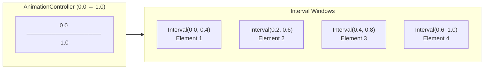

# Bài 8.4 — Staggered Animations

## Phần 1 — Khái Niệm & Mục Tiêu Bài Học

### Tại sao bài này quan trọng?

Staggered animation là kỹ thuật làm nhiều elements animate theo sequence — mỗi element delay nhau một khoảng nhỏ, tạo hiệu ứng "cascade" hoặc "ripple" rất đẹp mắt.

```
Element 1: |████░░░░░░|
Element 2: |░░██████░░|
Element 3: |░░░░████░░|
Element 4: |░░░░░░████|
           0%        100%  (timeline)
```

Kỹ thuật chính: `Interval` curve — chia timeline 0..1 thành các "window" cho từng animation.

### Bạn sẽ hiểu được sau bài này:
- `Interval` curve và stagger timing
- `AnimationController.drive()` chaining
- List item appear animation on scroll
- Real-world: onboarding screen, menu reveal

---

## Phần 2 — Cơ Chế Hoạt Động (Under the Hood)

### Interval Curve



`Interval(begin, end)` maps toàn bộ controller 0..1 vào khoảng `[begin, end]`:
- Trước `begin`: animation value = 0
- Trong `[begin, end]`: interpolate 0..1
- Sau `end`: animation value = 1

---

## Phần 3 — Code Mẫu Chuẩn Google

### 3.1 — Staggered List với Interval

```dart
class StaggeredMenuScreen extends StatefulWidget {
  const StaggeredMenuScreen({super.key});
  @override State<StaggeredMenuScreen> createState() => _StaggeredMenuState();
}

class _StaggeredMenuState extends State<StaggeredMenuScreen>
    with SingleTickerProviderStateMixin {
  late final AnimationController _controller;
  late final List<Animation<Offset>> _slideAnimations;
  late final List<Animation<double>> _fadeAnimations;

  static const _menuItems = [
    ('Trang chủ', Icons.home),
    ('Tìm kiếm', Icons.search),
    ('Đơn hàng', Icons.shopping_bag),
    ('Hồ sơ', Icons.person),
    ('Cài đặt', Icons.settings),
  ];

  @override
  void initState() {
    super.initState();
    _controller = AnimationController(
      vsync: this,
      duration: const Duration(milliseconds: 800),
    );

    final count = _menuItems.length;

    _slideAnimations = List.generate(count, (i) {
      // Stagger: mỗi item bắt đầu delay 0.1 * i
      final start = i * 0.1;
      final end = start + 0.5; // Mỗi item animate trong 50% timeline

      return Tween<Offset>(
        begin: const Offset(-1, 0), // Từ trái
        end: Offset.zero,
      ).animate(CurvedAnimation(
        parent: _controller,
        curve: Interval(start, end.clamp(0.0, 1.0), curve: Curves.easeOut),
      ));
    });

    _fadeAnimations = List.generate(count, (i) {
      final start = i * 0.1;
      final end = (start + 0.4).clamp(0.0, 1.0);

      return Tween<double>(begin: 0, end: 1).animate(CurvedAnimation(
        parent: _controller,
        curve: Interval(start, end, curve: Curves.easeIn),
      ));
    });

    // Auto-play khi màn hình xuất hiện
    _controller.forward();
  }

  @override
  void dispose() {
    _controller.dispose();
    super.dispose();
  }

  @override
  Widget build(BuildContext context) {
    return Scaffold(
      appBar: AppBar(
        title: const Text('Menu'),
        actions: [
          IconButton(
            icon: const Icon(Icons.refresh),
            onPressed: () {
              _controller.reset();
              _controller.forward();
            },
          ),
        ],
      ),
      body: AnimatedBuilder(
        animation: _controller,
        builder: (context, _) {
          return ListView.separated(
            padding: const EdgeInsets.all(16),
            itemCount: _menuItems.length,
            separatorBuilder: (_, __) => const SizedBox(height: 8),
            itemBuilder: (context, i) {
              final (label, icon) = _menuItems[i];
              return FadeTransition(
                opacity: _fadeAnimations[i],
                child: SlideTransition(
                  position: _slideAnimations[i],
                  child: ListTile(
                    leading: Icon(icon),
                    title: Text(label),
                    shape: RoundedRectangleBorder(
                      borderRadius: BorderRadius.circular(12),
                    ),
                    tileColor: Theme.of(context).colorScheme.surfaceVariant,
                    onTap: () {},
                  ),
                ),
              );
            },
          );
        },
      ),
    );
  }
}
```

### 3.2 — Staggered on Scroll (Appear animation)

```dart
class AnimatedOnScrollItem extends StatefulWidget {
  final Widget child;
  final int index; // Để tính delay

  const AnimatedOnScrollItem({
    super.key,
    required this.child,
    required this.index,
  });

  @override
  State<AnimatedOnScrollItem> createState() => _AnimatedOnScrollItemState();
}

class _AnimatedOnScrollItemState extends State<AnimatedOnScrollItem>
    with SingleTickerProviderStateMixin {
  late final AnimationController _controller;
  late final Animation<double> _fadeAnimation;
  late final Animation<Offset> _slideAnimation;

  @override
  void initState() {
    super.initState();

    _controller = AnimationController(
      vsync: this,
      duration: const Duration(milliseconds: 400),
    );

    _fadeAnimation = CurvedAnimation(parent: _controller, curve: Curves.easeOut);
    _slideAnimation = Tween<Offset>(
      begin: const Offset(0, 0.3),
      end: Offset.zero,
    ).animate(CurvedAnimation(parent: _controller, curve: Curves.easeOut));

    // Delay dựa trên index để tạo cascade effect
    Future.delayed(
      Duration(milliseconds: widget.index * 80), // 80ms per item
      () {
        // Check mounted: widget có thể đã bị dispose trong khi delay
        if (mounted) _controller.forward();
      },
    );
  }

  @override
  void dispose() {
    _controller.dispose();
    super.dispose();
  }

  @override
  Widget build(BuildContext context) {
    return FadeTransition(
      opacity: _fadeAnimation,
      child: SlideTransition(position: _slideAnimation, child: widget.child),
    );
  }
}

// Sử dụng trong list:
class ProductGrid extends StatelessWidget {
  final List<Product> products;
  const ProductGrid({super.key, required this.products});

  @override
  Widget build(BuildContext context) {
    return GridView.builder(
      gridDelegate: const SliverGridDelegateWithFixedCrossAxisCount(
        crossAxisCount: 2,
        childAspectRatio: 0.75,
      ),
      itemCount: products.length,
      itemBuilder: (context, i) => AnimatedOnScrollItem(
        index: i,
        child: ProductCard(product: products[i]),
      ),
    );
  }
}
```

### 3.3 — Onboarding Screen với Staggered

```dart
class OnboardingScreen extends StatefulWidget {
  const OnboardingScreen({super.key});
  @override State<OnboardingScreen> createState() => _OnboardingScreenState();
}

class _OnboardingScreenState extends State<OnboardingScreen>
    with SingleTickerProviderStateMixin {
  late final AnimationController _controller;
  late final Animation<double> _imageAnimation;
  late final Animation<double> _titleAnimation;
  late final Animation<double> _subtitleAnimation;
  late final Animation<double> _buttonAnimation;

  @override
  void initState() {
    super.initState();

    _controller = AnimationController(
      vsync: this,
      duration: const Duration(milliseconds: 1200),
    );

    // Image: 0-40% of timeline
    _imageAnimation = CurvedAnimation(
      parent: _controller,
      curve: const Interval(0.0, 0.4, curve: Curves.elasticOut),
    );

    // Title: 25-55%
    _titleAnimation = CurvedAnimation(
      parent: _controller,
      curve: const Interval(0.25, 0.55, curve: Curves.easeOut),
    );

    // Subtitle: 40-70%
    _subtitleAnimation = CurvedAnimation(
      parent: _controller,
      curve: const Interval(0.4, 0.7, curve: Curves.easeOut),
    );

    // Button: 60-100%
    _buttonAnimation = CurvedAnimation(
      parent: _controller,
      curve: const Interval(0.6, 1.0, curve: Curves.easeOut),
    );

    _controller.forward();
  }

  @override
  void dispose() {
    _controller.dispose();
    super.dispose();
  }

  @override
  Widget build(BuildContext context) {
    return Scaffold(
      body: SafeArea(
        child: AnimatedBuilder(
          animation: _controller,
          builder: (context, _) {
            return Column(
              mainAxisAlignment: MainAxisAlignment.center,
              children: [
                // Image: scale in từ nhỏ
                ScaleTransition(
                  scale: _imageAnimation,
                  child: Image.asset('assets/onboarding.png', height: 250),
                ),
                const SizedBox(height: 32),

                // Title: slide up + fade
                SlideTransition(
                  position: Tween<Offset>(
                    begin: const Offset(0, 0.5),
                    end: Offset.zero,
                  ).animate(_titleAnimation),
                  child: FadeTransition(
                    opacity: _titleAnimation,
                    child: Text(
                      'Chào mừng!',
                      style: Theme.of(context).textTheme.headlineMedium,
                      textAlign: TextAlign.center,
                    ),
                  ),
                ),
                const SizedBox(height: 12),

                // Subtitle
                FadeTransition(
                  opacity: _subtitleAnimation,
                  child: const Padding(
                    padding: EdgeInsets.symmetric(horizontal: 32),
                    child: Text(
                      'Trải nghiệm mua sắm tuyệt vời với hàng ngàn sản phẩm.',
                      textAlign: TextAlign.center,
                    ),
                  ),
                ),
                const SizedBox(height: 40),

                // Button: slide up + fade
                SlideTransition(
                  position: Tween<Offset>(
                    begin: const Offset(0, 1),
                    end: Offset.zero,
                  ).animate(_buttonAnimation),
                  child: FadeTransition(
                    opacity: _buttonAnimation,
                    child: ElevatedButton(
                      onPressed: () {},
                      style: ElevatedButton.styleFrom(
                        minimumSize: const Size(200, 48),
                      ),
                      child: const Text('Bắt đầu'),
                    ),
                  ),
                ),
              ],
            );
          },
        ),
      ),
    );
  }
}
```

---

## Phần 4 — Lỗi Sai Phổ Biến & Best Practices

### ❌ Anti-pattern 1: Interval end vượt 1.0

```dart
// ❌ Bug: Interval end > 1.0 → clamp hoặc exception
final lastAnimation = Tween<double>(begin: 0, end: 1).animate(CurvedAnimation(
  parent: _controller,
  curve: const Interval(0.9, 1.2), // ❌ 1.2 > 1.0!
));

// ✅ Clamp hoặc tính toán đúng
final count = items.length;
_animations = List.generate(count, (i) {
  final stagger = 0.8 / count; // Chia 80% timeline cho count items
  final start = i * stagger;
  final end = (start + stagger + 0.2).clamp(0.0, 1.0); // Safe clamp
  return ...;
});
```

### ❌ Anti-pattern 2: Future.delayed trong dispose

```dart
// ❌ Bug: Future.delayed sau khi widget đã dispose
class BadScrollItem extends State<...> {
  @override void initState() {
    super.initState();
    Future.delayed(const Duration(milliseconds: 200), () {
      _controller.forward(); // ← Có thể call sau dispose!
    });
  }
}

// ✅ Kiểm tra mounted
Future.delayed(const Duration(milliseconds: 200), () {
  if (mounted) _controller.forward(); // Safe!
});
```

---

## Phần 5 — Bài Tập Củng Cố Tư Duy

### Challenge: Dashboard Stats Reveal

**Yêu cầu:**
1. Dashboard 4 stats cards (Revenue, Orders, Users, Rating)
2. Khi màn hình load: cards stagger reveal (scale + fade, delay 100ms/card)
3. Mỗi card có một number counter animate từ 0 đến giá trị thực
4. Replay animation khi pull-to-refresh

**Gợi ý:**
- Dùng `TweenAnimationBuilder<int>` cho number counter
- Interval stagger cho card reveal
- `RefreshIndicator` để trigger `_controller.reset()` rồi `forward()`

### Câu Hỏi Phỏng Vấn

> **[Junior]** — nắm khái niệm | **[Middle]** — hiểu cơ chế | **[Senior]** — hiểu Flutter internals | **[Trace Code]** — đọc code và dự đoán output

---

#### Q1 [Junior] — "`Interval` curve hoạt động như thế nào trong staggered animation?"

**Trả lời chuẩn:**

`Interval(begin, end, {curve})` là `Curve` đặc biệt — nó **map** một khoảng con của animation timeline 0..1 về [0..1]:

```dart
// Controller: 0.0 → 1.0 (full duration)
// Interval(0.3, 0.7) — chỉ animate trong khoảng 0.3 → 0.7

final animation = Tween<double>(begin: 0, end: 1).animate(
  CurvedAnimation(
    parent: _controller,
    curve: const Interval(0.3, 0.7, curve: Curves.easeOut),
  ),
);

// Behavior:
// controller.value 0.0 → 0.3: animation.value = 0.0 (giữ begin)
// controller.value 0.3 → 0.7: animation.value = 0.0 → 1.0 (animate)
// controller.value 0.7 → 1.0: animation.value = 1.0 (giữ end)
```

**Staggered example:**
```dart
// 3 items với intervals khác nhau, cùng 1 controller
final item1 = Interval(0.0, 0.4);  // animate trong 0-40%
final item2 = Interval(0.2, 0.6);  // animate trong 20-60% (overlap)
final item3 = Interval(0.4, 1.0);  // animate trong 40-100%
// Item 1 bắt đầu trước, Item 3 kết thúc sau
```

---

#### Q2 [Junior] — "Tại sao cần check `mounted` trong `Future.delayed`?"

**Trả lời chuẩn:**

`Future.delayed` là async — trong khoảng thời gian delay, widget có thể bị unmount (user navigate back, widget bị remove):

```dart
// ❌ Bug — không check mounted
@override
void initState() {
  super.initState();
  Future.delayed(const Duration(milliseconds: 500), () {
    _controller.forward(); // widget có thể đã dispose!
    // AnimationController disposed → assertion error
  });
}

// ✅ Đúng — check mounted
@override
void initState() {
  super.initState();
  Future.delayed(const Duration(milliseconds: 500), () {
    if (!mounted) return; // widget đã dispose → bỏ qua
    _controller.forward();
  });
}

// ✅ Tốt hơn — dùng Timer để có thể cancel
Timer? _delayTimer;

@override
void initState() {
  super.initState();
  _delayTimer = Timer(const Duration(milliseconds: 500), () {
    if (mounted) _controller.forward();
  });
}

@override
void dispose() {
  _delayTimer?.cancel(); // cancel nếu widget unmount trước khi timer fire
  _controller.dispose();
  super.dispose();
}
```

---

#### Q3 [Middle] — "Staggered animation với 100 items có vấn đề gì? Cách giải quyết?"

**Trả lời chuẩn:**

**Vấn đề:** Nếu mỗi item có delay 80ms:
- Item 1: delay 0ms
- Item 2: delay 80ms
- Item 100: delay 7920ms (≈8 giây)
→ User phải đợi 8 giây để thấy item cuối → terrible UX

**Solutions:**

```dart
// Fix 1: Giới hạn delay tối đa
double _getDelay(int index) {
  const maxDelay = 500.0; // tối đa 500ms
  const perItemDelay = 50.0;
  return math.min(index * perItemDelay, maxDelay) / 1000.0; // normalize về 0..0.5
}

// Fix 2: Stagger chỉ visible items
ListView.builder(
  itemBuilder: (ctx, i) {
    // Chỉ animate items trong first viewport (visible)
    final delay = i < 10 ? i * 0.05 : 0.5; // items sau 10 không stagger
    return AnimationItem(delay: delay, child: ItemWidget(items[i]));
  },
)

// Fix 3: Dùng animation_list package hoặc custom stagger approach
AnimationLimiter(
  child: ListView.builder(
    itemBuilder: (ctx, i) => AnimationConfiguration.staggeredList(
      position: i,
      duration: const Duration(milliseconds: 375),
      child: SlideAnimation(child: FadeInAnimation(child: ItemWidget(items[i]))),
    ),
  ),
)

// Fix 4: Interval approach với clamp
final interval = math.min(i * 0.1, 0.8); // max offset = 80%
Interval(interval, math.min(interval + 0.2, 1.0))
```

---

#### Q4 [Senior] — "`Interval` curve math: value ngoài `[begin, end]` được clamp thế nào?"

**Trả lời chuẩn:**

```dart
// Interval source code (simplified)
class Interval extends Curve {
  final double begin;
  final double end;
  final Curve curve;

  @override
  double transformInternal(double t) {
    // t: controller.value (0.0 → 1.0)
    
    // Clamp t vào [begin, end]
    final t2 = ((t - begin) / (end - begin)).clamp(0.0, 1.0);
    // t < begin: (t - begin) < 0 → clamp → 0.0
    // t > end:   (t - begin) / (end - begin) > 1.0 → clamp → 1.0
    
    if (t2 == 0.0 || t2 == 1.0) return t2;
    
    return curve.transform(t2); // apply inner curve
  }
}
```

**Ví dụ với `Interval(0.2, 0.8, curve: Curves.easeOut)`:**

| controller.value | t2 | animation.value |
|---|---|---|
| 0.0 | clamp((-0.2)/0.6) = 0.0 | 0.0 |
| 0.2 | clamp(0/0.6) = 0.0 | 0.0 |
| 0.5 | clamp(0.3/0.6) = 0.5 | easeOut(0.5) ≈ 0.75 |
| 0.8 | clamp(0.6/0.6) = 1.0 | 1.0 |
| 1.0 | clamp(0.8/0.6) = 1.0 | 1.0 |

**Ý nghĩa:** Trước `begin` → animation giữ nguyên ở 0.0. Sau `end` → animation giữ nguyên ở 1.0.

---

#### Q5 [Middle] — "`TweenSequence` vs nhiều `Interval` curves: khi nào dùng `TweenSequence`?"

**Trả lời chuẩn:**

| | `Interval` | `TweenSequence` |
|---|---|---|
| **Dùng cho** | Một property staggered | Một property với nhiều phases |
| **Value type** | Một Tween | Nhiều Tweens nối nhau |
| **Code** | Nhiều Animation objects | Một Animation object |

```dart
// Interval — stagger nhiều properties độc lập
final fadeAnim = Tween<double>(begin: 0, end: 1).animate(
    CurvedAnimation(parent: controller, curve: const Interval(0.0, 0.5)));
final slideAnim = Tween<Offset>(begin: const Offset(0, 0.3), end: Offset.zero).animate(
    CurvedAnimation(parent: controller, curve: const Interval(0.2, 0.7)));

// TweenSequence — một property có nhiều phases (bounce, hold, expand)
final bounceAnim = TweenSequence<double>([
  TweenSequenceItem(
    tween: Tween<double>(begin: 0, end: 1.2) // overshoot
        .chain(CurveTween(curve: Curves.easeOut)),
    weight: 60, // 60% of duration
  ),
  TweenSequenceItem(
    tween: Tween<double>(begin: 1.2, end: 0.9) // pull back
        .chain(CurveTween(curve: Curves.easeIn)),
    weight: 20, // 20% of duration
  ),
  TweenSequenceItem(
    tween: Tween<double>(begin: 0.9, end: 1.0) // settle
        .chain(CurveTween(curve: Curves.easeOut)),
    weight: 20, // 20% of duration
  ),
]).animate(controller);
// Result: scale 0→1.2→0.9→1.0 (bounce effect với 1 Animation object)
```

---

#### Q6 [Middle] — "Staggered list animation: render visible items trước vs đợi tất cả mount — UX trade-off?"

**Trả lời chuẩn:**

**Approach 1: Animate mọi item (kể cả offscreen):**
```dart
// Tất cả items animate khi screen load
ListView.builder(
  itemBuilder: (ctx, i) => AnimatedItem(
    delay: i * 50,  // item 100 delay 5000ms
    child: ItemWidget(items[i]),
  ),
)
// UX: smooth, consistent — nhưng user phải đợi lâu nếu scroll xuống
```

**Approach 2: Animate chỉ visible items (lazy animation):**
```dart
// Dùng VisibilityDetector hoặc AnimationController per-item
ListView.builder(
  itemBuilder: (ctx, i) => VisibilityDetector(
    key: Key('item_$i'),
    onVisibilityChanged: (info) {
      if (info.visibleFraction > 0.1) {
        itemControllers[i].forward();
      }
    },
    child: AnimatedBuilder(
      animation: itemControllers[i],
      builder: (ctx, child) => FadeTransition(...),
    ),
  ),
)
// UX: animate khi scroll đến — mỗi item fresh animation
// Nhưng cần N controllers → memory overhead
```

**Approach 3: Animate chỉ first N items:**
```dart
// Giới hạn stagger trong first viewport
final delay = i < _viewportItemCount
    ? Duration(milliseconds: i * 60)
    : Duration.zero; // items sau viewport = no delay (instant show)
```

**Best practice:** Approach 3 — stagger only visible items on load, instant for others. Tránh Approach 2 (too much overhead) cho simple lists.

---

#### Q7 [Trace Code] — "5 items với delay 100ms each, total duration 500ms: item 3 bắt đầu animate ở t=?"

```dart
// AnimationController với duration = 500ms
// Staggered animation dùng Interval
// 5 items, mỗi item animate trong khoảng 200ms
// items staggered: 0, 100, 200, 300, 400ms start times

// Setup:
// Item 0: Interval(0.0, 0.4)   — 0ms → 200ms
// Item 1: Interval(0.2, 0.6)   — 100ms → 300ms  
// Item 2: Interval(0.4, 0.8)   — 200ms → 400ms
// Item 3: Interval(0.6, 1.0)   — 300ms → 500ms
// Item 4: Interval(0.8, 1.2) ← clamp → Interval(0.8, 1.0)

_controller.forward(); // trigger tại t=0
// Hỏi: Item 3 bắt đầu animate ở t=?
```

**Tính toán:**

Total duration = 500ms

Item 3 dùng `Interval(0.6, 1.0)`:
- `controller.value = 0.6` → `t3 = (0.6 - 0.6) / (1.0 - 0.6) = 0.0` → animation.value = 0.0 (bắt đầu)
- Thời điểm `controller.value = 0.6` = `500ms × 0.6` = **300ms**

**Item 3 bắt đầu animate ở t = 300ms**

**Hoàn thành:** `controller.value = 1.0` = 500ms → Item 3 hoàn thành lúc 500ms

**Items timeline:**
```
t=0ms:   Controller starts. Item 0 starts animating
t=100ms: Item 1 starts animating (controller.value = 0.2)
t=200ms: Item 2 starts. Item 0 finishes (at controller.value=0.4)
t=300ms: Item 3 starts. Item 1 finishes
t=400ms: Item 4 starts. Item 2 finishes
t=500ms: Controller done. Items 3 & 4 finish
```
