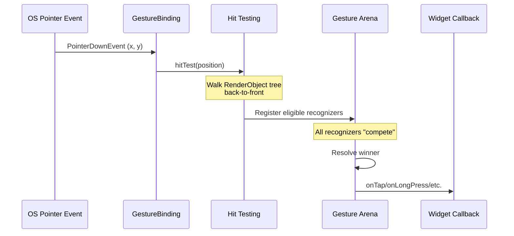

# Bài 9.1 — Gestures, Hit Testing & GestureDetector

## Phần 1 — Khái Niệm & Mục Tiêu Bài Học

### Tại sao bài này quan trọng?

Mọi tương tác của user trên màn hình đều đi qua hệ thống gesture recognition của Flutter. Hiểu cơ chế này giúp bạn:
- Debug tại sao tap không work
- Resolve gesture conflicts (tap vs long press vs scroll)
- Tạo custom gesture recognizers

### Bạn sẽ hiểu được sau bài này:
- Hit testing: từ pointer event đến widget callback
- `GestureDetector` vs `InkWell` vs `Listener`
- Gesture arena: competition và resolution
- Custom gesture handling

---

## Phần 2 — Cơ Chế Hoạt Động (Under the Hood)

### Hit Testing Flow



### Gesture Arena

Khi user touch màn hình, **nhiều** GestureRecognizer có thể cùng claim event. Gesture Arena giải quyết:
- **Win**: Recognizer declare win → nhận tất cả events
- **Lose**: Recognizer declare loss → bị loại
- **Hold**: Recognizer chờ thêm events để quyết định

---

## Phần 3 — Code Mẫu Chuẩn Google

### 3.1 — GestureDetector

```dart
class InteractiveCard extends StatefulWidget {
  final Widget child;
  final VoidCallback? onTap;

  const InteractiveCard({super.key, required this.child, this.onTap});
  @override State<InteractiveCard> createState() => _InteractiveCardState();
}

class _InteractiveCardState extends State<InteractiveCard> {
  bool _isPressed = false;
  Offset? _longPressPosition;

  @override
  Widget build(BuildContext context) {
    return GestureDetector(
      // Tất cả callbacks có thể kết hợp
      onTap: widget.onTap,
      onDoubleTap: () => ScaffoldMessenger.of(context).showSnackBar(
        const SnackBar(content: Text('Double tap!')),
      ),
      onLongPressStart: (details) {
        setState(() => _longPressPosition = details.globalPosition);
        _showContextMenu(details.globalPosition);
      },
      onLongPressEnd: (_) => setState(() => _longPressPosition = null),
      // Swipe detection
      onHorizontalDragEnd: (details) {
        if (details.primaryVelocity! < -500) {
          // Swipe left nhanh
          _onSwipeLeft();
        } else if (details.primaryVelocity! > 500) {
          _onSwipeRight();
        }
      },
      // Visual feedback
      onTapDown: (_) => setState(() => _isPressed = true),
      onTapUp: (_) => setState(() => _isPressed = false),
      onTapCancel: () => setState(() => _isPressed = false),
      child: AnimatedScale(
        scale: _isPressed ? 0.97 : 1.0,
        duration: const Duration(milliseconds: 100),
        child: widget.child,
      ),
    );
  }

  void _showContextMenu(Offset position) {
    showMenu(
      context: context,
      position: RelativeRect.fromLTRB(
        position.dx, position.dy, position.dx, position.dy,
      ),
      items: const [
        PopupMenuItem(child: Text('Chia sẻ')),
        PopupMenuItem(child: Text('Xóa')),
      ],
    );
  }

  void _onSwipeLeft() {}
  void _onSwipeRight() {}
}
```

### 3.2 — InkWell: Material ripple effect

```dart
// InkWell: preferred cho Material apps vì có ripple effect
// GestureDetector: khi cần custom visuals hoặc nhiều gesture types

class MaterialCard extends StatelessWidget {
  final Product product;
  final VoidCallback onTap;

  const MaterialCard({super.key, required this.product, required this.onTap});

  @override
  Widget build(BuildContext context) {
    return Card(
      clipBehavior: Clip.antiAlias, // Ripple không tràn ra ngoài card
      child: InkWell(
        onTap: onTap,
        // Customize ripple color
        splashColor: Theme.of(context).colorScheme.primary.withOpacity(0.1),
        highlightColor: Theme.of(context).colorScheme.primary.withOpacity(0.05),
        child: Padding(
          padding: const EdgeInsets.all(12),
          child: Row(
            children: [
              ClipRRect(
                borderRadius: BorderRadius.circular(8),
                child: Image.network(product.imageUrl, width: 64, height: 64, fit: BoxFit.cover),
              ),
              const SizedBox(width: 12),
              Expanded(
                child: Column(
                  crossAxisAlignment: CrossAxisAlignment.start,
                  children: [
                    Text(product.name, style: Theme.of(context).textTheme.titleSmall),
                    Text(product.price, style: Theme.of(context).textTheme.bodySmall),
                  ],
                ),
              ),
            ],
          ),
        ),
      ),
    );
  }
}
```

### 3.3 — Listener: Low-level pointer events

```dart
// Listener: raw pointer events, trước khi gesture recognition
// Dùng khi cần track mọi pointer movement mà không cần gesture logic

class DrawingCanvas extends StatefulWidget {
  const DrawingCanvas({super.key});
  @override State<DrawingCanvas> createState() => _DrawingCanvasState();
}

class _DrawingCanvasState extends State<DrawingCanvas> {
  final List<List<Offset>> _strokes = [];
  List<Offset> _currentStroke = [];

  @override
  Widget build(BuildContext context) {
    return Listener(
      // PointerDown: bắt đầu stroke mới
      onPointerDown: (event) {
        setState(() {
          _currentStroke = [event.localPosition];
          _strokes.add(_currentStroke);
        });
      },
      // PointerMove: thêm điểm vào stroke hiện tại
      onPointerMove: (event) {
        setState(() {
          _currentStroke.add(event.localPosition);
        });
      },
      // PointerUp: kết thúc stroke
      onPointerUp: (_) {
        _currentStroke = [];
      },
      child: CustomPaint(
        painter: _CanvasPainter(strokes: _strokes),
        size: Size.infinite,
      ),
    );
  }
}

class _CanvasPainter extends CustomPainter {
  final List<List<Offset>> strokes;
  const _CanvasPainter({required this.strokes});

  @override
  void paint(Canvas canvas, Size size) {
    final paint = Paint()
      ..color = Colors.black
      ..strokeWidth = 3
      ..strokeCap = StrokeCap.round
      ..style = PaintingStyle.stroke;

    for (final stroke in strokes) {
      if (stroke.length < 2) continue;
      final path = Path()..moveTo(stroke.first.dx, stroke.first.dy);
      for (final point in stroke.skip(1)) {
        path.lineTo(point.dx, point.dy);
      }
      canvas.drawPath(path, paint);
    }
  }

  @override
  bool shouldRepaint(_CanvasPainter old) => true;
}
```

---

## Phần 4 — Lỗi Sai Phổ Biến & Best Practices

### ❌ Anti-pattern 1: Bọc toàn bộ tree với GestureDetector

```dart
// ❌ Không tốt: GestureDetector lớn chặn tất cả gesture bên trong
GestureDetector(
  onTap: _handleTap,
  child: Column(
    children: [
      ListView.builder(/* ... */), // ← Scroll gesture bị block!
      ElevatedButton(/* ... */),   // ← Button tap bị block!
    ],
  ),
)

// ✅ Đúng: Wrap chính xác phần cần gesture
Column(
  children: [
    ListView.builder(/* ... */), // Scroll hoạt động bình thường
    GestureDetector(
      onTap: _handleTap,
      child: ElevatedButton(/* ... */),
    ),
  ],
)
```

### ❌ Anti-pattern 2: Không biết dùng InkWell hay GestureDetector

```dart
// ❌ Dùng GestureDetector trong Material app khi không cần custom visual
GestureDetector(
  onTap: () => print('tap'),
  child: Container(...), // Không có ripple!
)

// ✅ Dùng InkWell cho Material design
Material(
  child: InkWell(
    onTap: () => print('tap'),
    child: Container(...), // Có ripple!
  ),
)
// Hoặc nếu đã trong Card/Scaffold: Card/ListTile đã handle
```

---

## Phần 5 — Bài Tập Củng Cố Tư Duy

### Challenge: Swipeable List Item

**Yêu cầu:**
1. List item có thể swipe left để reveal "Delete" button
2. Swipe right để reveal "Archive" button
3. Swipe đủ xa → tự xóa với animation
4. Partial swipe → spring back về vị trí ban đầu

**Gợi ý:**
- `GestureDetector.onHorizontalDragUpdate` để track position
- `AnimatedContainer` hoặc `Transform.translate` để move item
- `GestureDetector.onHorizontalDragEnd` để quyết định snap hoặc dismiss

### Thử Thách Tư Duy & Thẩm Định Chuyên Sâu (Conceptual & Deep-Dive Check)

> **[Junior]** — nắm khái niệm | **[Middle]** — hiểu cơ chế | **[Senior]** — hiểu Flutter internals | **[Trace Code]** — đọc code và dự đoán output

---

#### Q1 [Junior] — "Gesture Arena là gì? Recognizer nào win?"

**Trả lời chuẩn:**

**Gesture Arena** là cơ chế Flutter dùng để giải quyết conflict khi nhiều `GestureRecognizer` cùng muốn claim một pointer event:

```
User bắt đầu swipe:
  ↓ PointerDownEvent
  ↓ HitTest → find all GestureDetectors along path
  
Multiple recognizers enter arena:
  - TapGestureRecognizer ("đây có thể là tap")
  - HorizontalDragRecognizer ("đây có thể là swipe")
  - LongPressGestureRecognizer ("đây có thể là long press")
  
Arena waits...
  ↓ PointerMoveEvent (di chuyển 10px ngang)
  
HorizontalDrag: "đây là horizontal drag" → claim victory
TapGestureRecognizer: "không đủ điều kiện" → forfeit
LongPressRecognizer: "chưa đủ 500ms" → forfeit

HorizontalDrag WINS → nhận tất cả events tiếp theo
```

**Winner nhận `onPanStart`, `onPanUpdate`, `onPanEnd` callbacks. Losers không nhận gì.** Arena đảm bảo không có gesture ambiguity.

---

#### Q2 [Junior] — "`GestureDetector` vs `InkWell`: khi nào dùng cái nào?"

**Trả lời chuẩn:**

| | `GestureDetector` | `InkWell` |
|---|---|---|
| **Visual feedback** | Không có | Material ripple effect |
| **Platform feel** | Bất kỳ | Material Design |
| **Gestures** | Tất cả (tap, drag, scale...) | Chủ yếu tap |
| **Clip** | Không | Có (`borderRadius`) |
| **Semantic** | Không | Có (accessibility) |

```dart
// InkWell — button-like với ripple
InkWell(
  onTap: () => print('tapped'),
  borderRadius: BorderRadius.circular(8),
  child: Padding(
    padding: const EdgeInsets.all(16),
    child: Text('Button'),
  ),
)

// GestureDetector — complex gestures, custom visuals
GestureDetector(
  onTap: () {},
  onDoubleTap: () {},
  onLongPress: () {},
  onPanUpdate: (details) => print('dragging: ${details.delta}'),
  onScaleUpdate: (details) => print('scaling: ${details.scale}'),
  child: Container(color: Colors.blue),
)

// Thường kết hợp: InkWell bên ngoài, GestureDetector cho complex gesture
```

---

#### Q3 [Middle] — "Tại sao scroll bị block khi bọc `GestureDetector`? Fix thế nào?"

**Trả lời chuẩn:**

`GestureDetector` tham gia gesture arena với `ScrollView`. Khi user bắt đầu scroll, cả `GestureDetector` (nếu có `onPanUpdate`) và `ScrollView` đều claim gesture → conflict → người thắng block người thua.

```dart
// ❌ Scroll bị block — GestureDetector win trước
GestureDetector(
  onPanUpdate: (details) => print('pan'), // compete với scroll
  child: ListView.builder(...),
)

// ✅ Fix 1: behavior = translucent — GestureDetector nhận event nhưng không chặn
GestureDetector(
  onTap: () {}, // chỉ tap, không pan
  behavior: HitTestBehavior.translucent, // event pass-through cho children
  child: ListView.builder(...),
)

// ✅ Fix 2: Tách gesture area và scroll area
Stack(children: [
  ListView.builder(...), // scroll freely
  GestureDetector(       // nhận gesture ở area riêng
    onHorizontalDragEnd: (details) => _onSwipe(details),
    child: const SizedBox.expand(),
  ),
])

// ✅ Fix 3: Dùng Listener thay vì GestureDetector (low-level, không compete)
Listener(
  onPointerDown: (e) => print('pointer down'),
  child: ListView.builder(...),
)
```

---

#### Q4 [Senior] — "Gesture Arena mechanics: `GestureArenaManager.sweep()` hoạt động thế nào?"

**Trả lời chuẩn:**

`GestureArenaManager` quản lý tất cả arenas (mỗi pointer có một arena riêng):

```dart
// GestureArena lifecycle:
// 1. PointerDownEvent → open new arena cho pointer ID
// 2. HitTest → collect GestureDetectors → mỗi recognizer add vào arena
// 3. Arena "tracking state" — đợi recognizers decide

// Recognizer có thể:
// - resolvePointer(winner) → claim victory
// - rejectGesture(pointer) → forfeit

// sweep() — được gọi khi tất cả members đã decide hoặc pointer up
void sweep(int pointer) {
  final GestureArena arena = _arenas[pointer];
  
  if (arena.members.length == 1) {
    // Chỉ còn 1 → auto-win (uncontested)
    arena.members.first.acceptGesture(pointer);
  } else if (arena.eagerWinner != null) {
    // Ai đó đã claim victory → win
    _resolveByDefault(pointer, arena);
  }
  // Nếu không → arena closed, không ai win
}
```

**Concrete example — TapGestureRecognizer:**
```
PointerDown: enter arena
PointerMove > threshold (18px): TapGestureRecognizer.rejectPointer() — forfeit (di chuyển quá nhiều)
PointerUp < threshold + duration < 300ms: TapGestureRecognizer.resolvePointer() — claim victory
```

---

#### Q5 [Middle] — "`HitTestBehavior.opaque` vs `.translucent` vs `.deferToChild`?"

**Trả lời chuẩn:**

| Behavior | Hit test | Events |
|---|---|---|
| `opaque` | Luôn true (block widgets phía sau) | Nhận events, widget phía sau không nhận |
| `translucent` | True AND forward (pass-through) | Nhận events, widget phía sau CŨNG nhận |
| `deferToChild` | True chỉ nếu child nhận | Chỉ nhận nếu có child tại vị trí tap |

```dart
// opaque — block events đến widget phía sau (Stack)
GestureDetector(
  behavior: HitTestBehavior.opaque,
  onTap: () {},
  child: Container(width: 100, height: 100, color: Colors.transparent),
  // Tap vào vùng transparent → widget NHẬN event, Widgets phía sau KHÔNG nhận
)

// translucent — event đến cả hai
GestureDetector(
  behavior: HitTestBehavior.translucent,
  onTap: () print('detector'),
  child: Container(color: Colors.transparent),
  // Tap → detector nhận + widget phía dưới trong stack cũng nhận
)

// deferToChild (default) — chỉ nhận nếu child nhận
GestureDetector(
  // behavior: HitTestBehavior.deferToChild (default)
  onTap: () {},
  child: Container(color: Colors.blue), // có màu → opaque → nhận
)
GestureDetector(
  // behavior: HitTestBehavior.deferToChild (default)
  onTap: () {},
  child: Container(color: Colors.transparent), // transparent → không nhận → tap miss!
)
```

---

#### Q6 [Middle] — "`Listener` vs `GestureDetector` — khi nào cần dùng low-level `Listener`?"

**Trả lời chuẩn:**

| | `Listener` | `GestureDetector` |
|---|---|---|
| **Level** | Low-level — raw pointer events | High-level — recognized gestures |
| **Events** | PointerDown, PointerMove, PointerUp, PointerHover | Tap, DoubleTap, LongPress, Pan, Scale |
| **Gesture Arena** | Không tham gia | Tham gia (compete với others) |
| **Use case** | Custom gesture recognizer, debugging | Thông thường |

```dart
// Listener — không compete với ScrollView, không block scroll
Listener(
  onPointerDown: (event) {
    print('Pointer down at: ${event.localPosition}');
    // Lấy hover position trên desktop
  },
  onPointerHover: (event) {
    // Hover tracking (không có GestureDetector equivalent)
    setState(() => _hoverPosition = event.localPosition);
  },
  child: ListView.builder(...), // scroll không bị ảnh hưởng
)

// Khi nào dùng Listener:
// 1. Hover effect trên desktop/web
// 2. Custom gesture recognition (không dùng built-in recognizers)
// 3. Debugging — xem raw pointer events
// 4. Cần nhận events mà không compete với gesture arena
```

---

#### Q7 [Trace Code] — "Nested GestureDetector (inner + outer `onTap`): cái nào được gọi?"

```dart
GestureDetector(
  onTap: () => print('Outer tapped'),
  child: Container(
    width: 200,
    height: 200,
    color: Colors.blue,
    child: Center(
      child: GestureDetector(
        onTap: () => print('Inner tapped'),
        child: Container(
          width: 100,
          height: 100,
          color: Colors.red,
        ),
      ),
    ),
  ),
)

// Hỏi:
// Case A: Tap vào vùng RED (inner container)
// Case B: Tap vào vùng BLUE (outer container, không phải inner)
// Case C: Làm thế nào để CẢ HAI onTap được gọi khi tap inner?
```

**Case A — Tap vào RED:**
```
Output: "Inner tapped"
```
Inner GestureDetector win trong arena → outer GestureDetector không nhận event. **Chỉ "Inner tapped"** được in.

**Lý do:** Khi hit test, Flutter tìm GestureDetector từ leaf lên root. Inner GestureDetector nằm ở leaf — recognizer của nó được thêm vào arena. Outer cũng thêm. Khi cả hai TapGestureRecognizer compete — **inner win** vì được added trước và more specific.

**Case B — Tap vào BLUE:**
```
Output: "Outer tapped"
```
Tap ngoài inner container → Inner GestureDetector không trong hit test path → chỉ Outer trong arena → Outer win.

**Case C — Cả hai nhận event:**
```dart
// Không có built-in support cho "event propagation" trong Flutter
// Workaround 1: AbsorbPointer + manual logic
// Workaround 2: dùng Listener (không compete)
Stack(children: [
  GestureDetector(
    behavior: HitTestBehavior.translucent, // pass-through
    onTap: () => print('Outer tapped'),
    child: Container(width: 200, height: 200, color: Colors.blue),
  ),
  Center(
    child: GestureDetector(
      onTap: () => print('Inner tapped'),
      child: Container(width: 100, height: 100, color: Colors.red),
    ),
  ),
])
// → Tap red: "Inner tapped" + "Outer tapped" (translucent pass-through)
```
