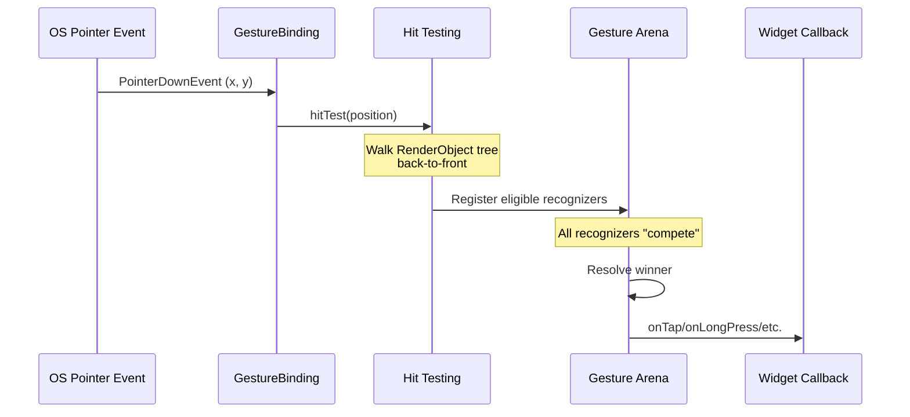

# Bài 9.1 — Gestures, Hit Testing & GestureDetector

## Phần 1 — Khái Niệm & Mục Tiêu Bài Học

### Tại sao bài này quan trọng?

Mọi tương tác của user trên màn hình đều đi qua hệ thống gesture recognition của Flutter. Hiểu cơ chế này giúp bạn:
- Debug tại sao tap không work
- Resolve gesture conflicts (tap vs long press vs scroll)
- Tạo custom gesture recognizers

### Bạn sẽ hiểu được sau bài này:
- Hit testing: từ pointer event đến widget callback
- `GestureDetector` vs `InkWell` vs `Listener`
- Gesture arena: competition và resolution
- Custom gesture handling

---

## Phần 2 — Cơ Chế Hoạt Động (Under the Hood)

### Hit Testing Flow



### Gesture Arena

Khi user touch màn hình, **nhiều** GestureRecognizer có thể cùng claim event. Gesture Arena giải quyết:
- **Win**: Recognizer declare win → nhận tất cả events
- **Lose**: Recognizer declare loss → bị loại
- **Hold**: Recognizer chờ thêm events để quyết định

---

## Phần 3 — Code Mẫu Chuẩn Google

### 3.1 — GestureDetector

```dart
class InteractiveCard extends StatefulWidget {
  final Widget child;
  final VoidCallback? onTap;

  const InteractiveCard({super.key, required this.child, this.onTap});
  @override State<InteractiveCard> createState() => _InteractiveCardState();
}

class _InteractiveCardState extends State<InteractiveCard> {
  bool _isPressed = false;
  Offset? _longPressPosition;

  @override
  Widget build(BuildContext context) {
    return GestureDetector(
      // Tất cả callbacks có thể kết hợp
      onTap: widget.onTap,
      onDoubleTap: () => ScaffoldMessenger.of(context).showSnackBar(
        const SnackBar(content: Text('Double tap!')),
      ),
      onLongPressStart: (details) {
        setState(() => _longPressPosition = details.globalPosition);
        _showContextMenu(details.globalPosition);
      },
      onLongPressEnd: (_) => setState(() => _longPressPosition = null),
      // Swipe detection
      onHorizontalDragEnd: (details) {
        if (details.primaryVelocity! < -500) {
          // Swipe left nhanh
          _onSwipeLeft();
        } else if (details.primaryVelocity! > 500) {
          _onSwipeRight();
        }
      },
      // Visual feedback
      onTapDown: (_) => setState(() => _isPressed = true),
      onTapUp: (_) => setState(() => _isPressed = false),
      onTapCancel: () => setState(() => _isPressed = false),
      child: AnimatedScale(
        scale: _isPressed ? 0.97 : 1.0,
        duration: const Duration(milliseconds: 100),
        child: widget.child,
      ),
    );
  }

  void _showContextMenu(Offset position) {
    showMenu(
      context: context,
      position: RelativeRect.fromLTRB(
        position.dx, position.dy, position.dx, position.dy,
      ),
      items: const [
        PopupMenuItem(child: Text('Chia sẻ')),
        PopupMenuItem(child: Text('Xóa')),
      ],
    );
  }

  void _onSwipeLeft() {}
  void _onSwipeRight() {}
}
```

### 3.2 — InkWell: Material ripple effect

```dart
// InkWell: preferred cho Material apps vì có ripple effect
// GestureDetector: khi cần custom visuals hoặc nhiều gesture types

class MaterialCard extends StatelessWidget {
  final Product product;
  final VoidCallback onTap;

  const MaterialCard({super.key, required this.product, required this.onTap});

  @override
  Widget build(BuildContext context) {
    return Card(
      clipBehavior: Clip.antiAlias, // Ripple không tràn ra ngoài card
      child: InkWell(
        onTap: onTap,
        // Customize ripple color
        splashColor: Theme.of(context).colorScheme.primary.withOpacity(0.1),
        highlightColor: Theme.of(context).colorScheme.primary.withOpacity(0.05),
        child: Padding(
          padding: const EdgeInsets.all(12),
          child: Row(
            children: [
              ClipRRect(
                borderRadius: BorderRadius.circular(8),
                child: Image.network(product.imageUrl, width: 64, height: 64, fit: BoxFit.cover),
              ),
              const SizedBox(width: 12),
              Expanded(
                child: Column(
                  crossAxisAlignment: CrossAxisAlignment.start,
                  children: [
                    Text(product.name, style: Theme.of(context).textTheme.titleSmall),
                    Text(product.price, style: Theme.of(context).textTheme.bodySmall),
                  ],
                ),
              ),
            ],
          ),
        ),
      ),
    );
  }
}
```

### 3.3 — Listener: Low-level pointer events

```dart
// Listener: raw pointer events, trước khi gesture recognition
// Dùng khi cần track mọi pointer movement mà không cần gesture logic

class DrawingCanvas extends StatefulWidget {
  const DrawingCanvas({super.key});
  @override State<DrawingCanvas> createState() => _DrawingCanvasState();
}

class _DrawingCanvasState extends State<DrawingCanvas> {
  final List<List<Offset>> _strokes = [];
  List<Offset> _currentStroke = [];

  @override
  Widget build(BuildContext context) {
    return Listener(
      // PointerDown: bắt đầu stroke mới
      onPointerDown: (event) {
        setState(() {
          _currentStroke = [event.localPosition];
          _strokes.add(_currentStroke);
        });
      },
      // PointerMove: thêm điểm vào stroke hiện tại
      onPointerMove: (event) {
        setState(() {
          _currentStroke.add(event.localPosition);
        });
      },
      // PointerUp: kết thúc stroke
      onPointerUp: (_) {
        _currentStroke = [];
      },
      child: CustomPaint(
        painter: _CanvasPainter(strokes: _strokes),
        size: Size.infinite,
      ),
    );
  }
}

class _CanvasPainter extends CustomPainter {
  final List<List<Offset>> strokes;
  const _CanvasPainter({required this.strokes});

  @override
  void paint(Canvas canvas, Size size) {
    final paint = Paint()
      ..color = Colors.black
      ..strokeWidth = 3
      ..strokeCap = StrokeCap.round
      ..style = PaintingStyle.stroke;

    for (final stroke in strokes) {
      if (stroke.length < 2) continue;
      final path = Path()..moveTo(stroke.first.dx, stroke.first.dy);
      for (final point in stroke.skip(1)) {
        path.lineTo(point.dx, point.dy);
      }
      canvas.drawPath(path, paint);
    }
  }

  @override
  bool shouldRepaint(_CanvasPainter old) => true;
}
```

---

## Phần 4 — Lỗi Sai Phổ Biến & Best Practices

### ❌ Anti-pattern 1: Bọc toàn bộ tree với GestureDetector

```dart
// ❌ Không tốt: GestureDetector lớn chặn tất cả gesture bên trong
GestureDetector(
  onTap: _handleTap,
  child: Column(
    children: [
      ListView.builder(/* ... */), // ← Scroll gesture bị block!
      ElevatedButton(/* ... */),   // ← Button tap bị block!
    ],
  ),
)

// ✅ Đúng: Wrap chính xác phần cần gesture
Column(
  children: [
    ListView.builder(/* ... */), // Scroll hoạt động bình thường
    GestureDetector(
      onTap: _handleTap,
      child: ElevatedButton(/* ... */),
    ),
  ],
)
```

### ❌ Anti-pattern 2: Không biết dùng InkWell hay GestureDetector

```dart
// ❌ Dùng GestureDetector trong Material app khi không cần custom visual
GestureDetector(
  onTap: () => print('tap'),
  child: Container(...), // Không có ripple!
)

// ✅ Dùng InkWell cho Material design
Material(
  child: InkWell(
    onTap: () => print('tap'),
    child: Container(...), // Có ripple!
  ),
)
// Hoặc nếu đã trong Card/Scaffold: Card/ListTile đã handle
```

---

## Phần 5 — Bài Tập Củng Cố Tư Duy

### Challenge: Swipeable List Item

**Yêu cầu:**
1. List item có thể swipe left để reveal "Delete" button
2. Swipe right để reveal "Archive" button
3. Swipe đủ xa → tự xóa với animation
4. Partial swipe → spring back về vị trí ban đầu

**Gợi ý:**
- `GestureDetector.onHorizontalDragUpdate` để track position
- `AnimatedContainer` hoặc `Transform.translate` để move item
- `GestureDetector.onHorizontalDragEnd` để quyết định snap hoặc dismiss

### Câu hỏi phỏng vấn liên quan:

1. **"Gesture Arena là gì?"**
   - System giải quyết conflict khi nhiều recognizer cùng claim một gesture
   - Recognizers "compete" — chỉ một winner nhận toàn bộ events

2. **"GestureDetector vs InkWell: khi nào dùng cái nào?"**
   - InkWell: Material ripple, button-like interactions
   - GestureDetector: Custom visuals, complex gesture (swipe, drag, multi-touch)

3. **"Tại sao scroll bị block khi bọc GestureDetector?"**
   - GestureDetector tham gia gesture arena, có thể win trước ScrollView
   - Fix: `behavior: HitTestBehavior.translucent` hoặc restructure tree
