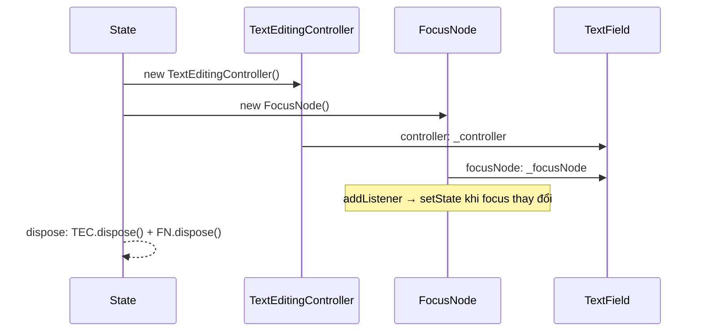

# Bài 9.2 — TextFields, Controllers & FocusNode

## Phần 1 — Khái Niệm & Mục Tiêu Bài Học

### Tại sao bài này quan trọng?

Text input là trái tim của mọi form. Hiểu sâu `TextField`, `TextEditingController`, và `FocusNode` giúp bạn:
- Build multi-field forms mà keyboard flow mượt mà
- Đọc và set text programmatically
- Kiểm soát focus chính xác

### Bạn sẽ hiểu được sau bài này:
- `TextEditingController`: đọc, set, clear text
- `FocusNode`: control focus, listen focus changes
- `TextInputFormatter`: format input theo thời gian thực
- `FocusScope.of(context).nextFocus()` pattern

---

## Phần 2 — Cơ Chế Hoạt Động (Under the Hood)

### TextEditingController & FocusNode Lifecycle



**Quan trọng**: Cả `TextEditingController` và `FocusNode` đều phải được `dispose()`.

---

## Phần 3 — Code Mẫu Chuẩn Google

### 3.1 — TextEditingController

```dart
class SearchBar extends StatefulWidget {
  final ValueChanged<String> onSearch;
  const SearchBar({super.key, required this.onSearch});
  @override State<SearchBar> createState() => _SearchBarState();
}

class _SearchBarState extends State<SearchBar> {
  // Controller: giữ text state và cung cấp API để manipulate
  late final TextEditingController _controller;
  bool _hasText = false;

  @override
  void initState() {
    super.initState();
    _controller = TextEditingController();
    // Listen changes để update clear button
    _controller.addListener(_onTextChanged);
  }

  @override
  void dispose() {
    _controller.removeListener(_onTextChanged); // Cleanup listener
    _controller.dispose(); // BẮT BUỘC: giải phóng resources
    super.dispose();
  }

  void _onTextChanged() {
    setState(() => _hasText = _controller.text.isNotEmpty);
  }

  void _clearText() {
    _controller.clear(); // Xóa text
    widget.onSearch('');
  }

  @override
  Widget build(BuildContext context) {
    return TextField(
      controller: _controller,
      decoration: InputDecoration(
        hintText: 'Tìm kiếm...',
        prefixIcon: const Icon(Icons.search),
        // Clear button chỉ hiện khi có text
        suffixIcon: _hasText
            ? IconButton(
                icon: const Icon(Icons.clear),
                onPressed: _clearText,
              )
            : null,
        border: OutlineInputBorder(
          borderRadius: BorderRadius.circular(24),
          borderSide: BorderSide.none,
        ),
        filled: true,
      ),
      onSubmitted: widget.onSearch,
      textInputAction: TextInputAction.search, // Nút search trên keyboard
    );
  }
}
```

### 3.2 — FocusNode & keyboard flow

```dart
class CheckoutForm extends StatefulWidget {
  const CheckoutForm({super.key});
  @override State<CheckoutForm> createState() => _CheckoutFormState();
}

class _CheckoutFormState extends State<CheckoutForm> {
  // Controller cho mỗi field
  final _nameController = TextEditingController();
  final _emailController = TextEditingController();
  final _phoneController = TextEditingController();
  final _addressController = TextEditingController();

  // FocusNode cho mỗi field
  final _nameFocus = FocusNode();
  final _emailFocus = FocusNode();
  final _phoneFocus = FocusNode();
  final _addressFocus = FocusNode();

  @override
  void initState() {
    super.initState();
    // Listen focus để update UI
    _emailFocus.addListener(() => setState(() {}));
  }

  @override
  void dispose() {
    // Dispose TẤT CẢ controllers và focus nodes
    for (final c in [_nameController, _emailController, _phoneController, _addressController]) {
      c.dispose();
    }
    for (final f in [_nameFocus, _emailFocus, _phoneFocus, _addressFocus]) {
      f.dispose();
    }
    super.dispose();
  }

  // Helper: move focus theo thứ tự form
  void _fieldNextFocus(FocusNode current, FocusNode next) {
    current.unfocus();
    FocusScope.of(context).requestFocus(next);
  }

  @override
  Widget build(BuildContext context) {
    return Column(
      children: [
        _buildField(
          controller: _nameController,
          focusNode: _nameFocus,
          label: 'Họ tên',
          action: TextInputAction.next,
          onSubmitted: (_) => _fieldNextFocus(_nameFocus, _emailFocus),
        ),
        const SizedBox(height: 12),
        _buildField(
          controller: _emailController,
          focusNode: _emailFocus,
          label: 'Email',
          type: TextInputType.emailAddress,
          action: TextInputAction.next,
          onSubmitted: (_) => _fieldNextFocus(_emailFocus, _phoneFocus),
          // Highlight khi focused
          decoration: _emailFocus.hasFocus
              ? InputDecoration(
                  labelText: 'Email',
                  enabledBorder: OutlineInputBorder(
                    borderSide: BorderSide(
                      color: Theme.of(context).colorScheme.primary,
                    ),
                  ),
                )
              : null,
        ),
        const SizedBox(height: 12),
        _buildField(
          controller: _phoneController,
          focusNode: _phoneFocus,
          label: 'Số điện thoại',
          type: TextInputType.phone,
          action: TextInputAction.next,
          // Formatter: chỉ cho phép số
          formatters: [FilteringTextInputFormatter.digitsOnly],
          onSubmitted: (_) => _fieldNextFocus(_phoneFocus, _addressFocus),
        ),
        const SizedBox(height: 12),
        _buildField(
          controller: _addressController,
          focusNode: _addressFocus,
          label: 'Địa chỉ',
          maxLines: 3,
          action: TextInputAction.done, // Done button trên keyboard
          onSubmitted: (_) => _addressFocus.unfocus(),
        ),
      ],
    );
  }

  Widget _buildField({
    required TextEditingController controller,
    required FocusNode focusNode,
    required String label,
    TextInputType type = TextInputType.text,
    TextInputAction action = TextInputAction.next,
    ValueChanged<String>? onSubmitted,
    List<TextInputFormatter>? formatters,
    int maxLines = 1,
    InputDecoration? decoration,
  }) {
    return TextField(
      controller: controller,
      focusNode: focusNode,
      keyboardType: type,
      textInputAction: action,
      onSubmitted: onSubmitted,
      maxLines: maxLines,
      inputFormatters: formatters,
      decoration: decoration ?? InputDecoration(
        labelText: label,
        border: const OutlineInputBorder(),
      ),
    );
  }
}
```

### 3.3 — TextInputFormatter

```dart
// Custom formatter: format số điện thoại Việt Nam
// 0123456789 → 0123 456 789
class VietnamesePhoneFormatter extends TextInputFormatter {
  @override
  TextEditingValue formatEditUpdate(
    TextEditingValue oldValue,
    TextEditingValue newValue,
  ) {
    final digitsOnly = newValue.text.replaceAll(RegExp(r'\D'), '');

    if (digitsOnly.isEmpty) return newValue.copyWith(text: '');

    // Format: XXXX XXX XXX
    final buffer = StringBuffer();
    for (int i = 0; i < digitsOnly.length && i < 10; i++) {
      if (i == 4 || i == 7) buffer.write(' ');
      buffer.write(digitsOnly[i]);
    }

    final formatted = buffer.toString();
    return newValue.copyWith(
      text: formatted,
      selection: TextSelection.collapsed(offset: formatted.length),
    );
  }
}

// Sử dụng:
TextField(
  inputFormatters: [VietnamesePhoneFormatter()],
  keyboardType: TextInputType.phone,
)
```

---

## Phần 4 — Lỗi Sai Phổ Biến & Best Practices

### ❌ Anti-pattern 1: Quên dispose Controller và FocusNode

```dart
// ❌ Memory leak
class _BadState extends State<MyWidget> {
  final _controller = TextEditingController();
  final _focus = FocusNode();

  // Thiếu dispose!

  @override Widget build(BuildContext context) => ...;
}

// ✅ Đúng
@override
void dispose() {
  _controller.dispose();
  _focus.dispose();
  super.dispose();
}
```

### ❌ Anti-pattern 2: Tạo Controller bên trong build()

```dart
// ❌ Bug: Mỗi rebuild tạo controller mới → mất text
Widget build(BuildContext context) {
  return TextField(
    controller: TextEditingController(), // Tạo mới mỗi build!
  );
}

// ✅ Tạo trong initState() hoặc dùng late final
class _State extends State<MyWidget> {
  late final TextEditingController _controller;
  @override void initState() {
    super.initState();
    _controller = TextEditingController();
  }
}
```

---

## Phần 5 — Bài Tập Củng Cố Tư Duy

### Challenge: Credit Card Form

**Yêu cầu:**
1. 3 fields: Card Number, Expiry Date (MM/YY), CVV
2. Card Number: auto format `XXXX XXXX XXXX XXXX` với `TextInputFormatter`
3. Tab/Enter từ field này → tự động focus field tiếp theo
4. Khi tất cả filled → submit button active
5. Clear button trên mỗi field

**Gợi ý:**
- Custom `TextInputFormatter` cho card number và expiry
- `FocusNode` + `TextEditingController` cho mỗi field
- `ValueListenableBuilder` hoặc listener để track all-filled state

### Câu hỏi phỏng vấn liên quan:

1. **"TextEditingController vs uncontrolled TextField?"**
   - Controller: bạn control text state (đọc, set, clear)
   - Uncontrolled: Flutter tự manage text (dùng khi không cần read/set programmatically)

2. **"FocusNode.requestFocus() vs FocusScope.of(context).requestFocus()?"**
   - Gần như tương đương; FocusScope dùng context hiện tại để navigate
   - `FocusScope.of(context).nextFocus()`: chuyển focus theo DOM order

3. **"TextInputFormatter.formatEditUpdate trả về gì?"**
   - `TextEditingValue`: cặp (text, selection)
   - Bạn phải trả về giá trị hợp lệ để cursor placement đúng
