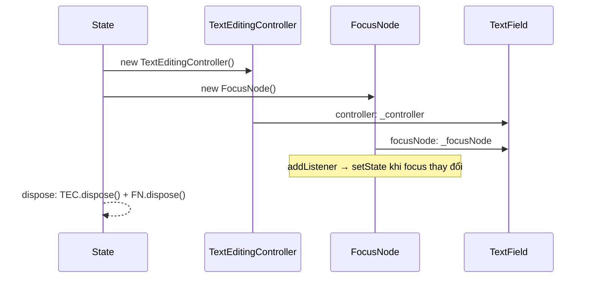

# Bài 9.2 — TextFields, Controllers & FocusNode

## Phần 1 — Khái Niệm & Mục Tiêu Bài Học

### Tại sao bài này quan trọng?

Text input là trái tim của mọi form. Hiểu sâu `TextField`, `TextEditingController`, và `FocusNode` giúp bạn:
- Build multi-field forms mà keyboard flow mượt mà
- Đọc và set text programmatically
- Kiểm soát focus chính xác

### Bạn sẽ hiểu được sau bài này:
- `TextEditingController`: đọc, set, clear text
- `FocusNode`: control focus, listen focus changes
- `TextInputFormatter`: format input theo thời gian thực
- `FocusScope.of(context).nextFocus()` pattern

---

## Phần 2 — Cơ Chế Hoạt Động (Under the Hood)

### TextEditingController & FocusNode Lifecycle



**Quan trọng**: Cả `TextEditingController` và `FocusNode` đều phải được `dispose()`.

---

## Phần 3 — Code Mẫu Chuẩn Google

### 3.1 — TextEditingController

```dart
class SearchBar extends StatefulWidget {
  final ValueChanged<String> onSearch;
  const SearchBar({super.key, required this.onSearch});
  @override State<SearchBar> createState() => _SearchBarState();
}

class _SearchBarState extends State<SearchBar> {
  // Controller: giữ text state và cung cấp API để manipulate
  late final TextEditingController _controller;
  bool _hasText = false;

  @override
  void initState() {
    super.initState();
    _controller = TextEditingController();
    // Listen changes để update clear button
    _controller.addListener(_onTextChanged);
  }

  @override
  void dispose() {
    _controller.removeListener(_onTextChanged); // Cleanup listener
    _controller.dispose(); // BẮT BUỘC: giải phóng resources
    super.dispose();
  }

  void _onTextChanged() {
    setState(() => _hasText = _controller.text.isNotEmpty);
  }

  void _clearText() {
    _controller.clear(); // Xóa text
    widget.onSearch('');
  }

  @override
  Widget build(BuildContext context) {
    return TextField(
      controller: _controller,
      decoration: InputDecoration(
        hintText: 'Tìm kiếm...',
        prefixIcon: const Icon(Icons.search),
        // Clear button chỉ hiện khi có text
        suffixIcon: _hasText
            ? IconButton(
                icon: const Icon(Icons.clear),
                onPressed: _clearText,
              )
            : null,
        border: OutlineInputBorder(
          borderRadius: BorderRadius.circular(24),
          borderSide: BorderSide.none,
        ),
        filled: true,
      ),
      onSubmitted: widget.onSearch,
      textInputAction: TextInputAction.search, // Nút search trên keyboard
    );
  }
}
```

### 3.2 — FocusNode & keyboard flow

```dart
class CheckoutForm extends StatefulWidget {
  const CheckoutForm({super.key});
  @override State<CheckoutForm> createState() => _CheckoutFormState();
}

class _CheckoutFormState extends State<CheckoutForm> {
  // Controller cho mỗi field
  final _nameController = TextEditingController();
  final _emailController = TextEditingController();
  final _phoneController = TextEditingController();
  final _addressController = TextEditingController();

  // FocusNode cho mỗi field
  final _nameFocus = FocusNode();
  final _emailFocus = FocusNode();
  final _phoneFocus = FocusNode();
  final _addressFocus = FocusNode();

  @override
  void initState() {
    super.initState();
    // Listen focus để update UI
    _emailFocus.addListener(() => setState(() {}));
  }

  @override
  void dispose() {
    // Dispose TẤT CẢ controllers và focus nodes
    for (final c in [_nameController, _emailController, _phoneController, _addressController]) {
      c.dispose();
    }
    for (final f in [_nameFocus, _emailFocus, _phoneFocus, _addressFocus]) {
      f.dispose();
    }
    super.dispose();
  }

  // Helper: move focus theo thứ tự form
  void _fieldNextFocus(FocusNode current, FocusNode next) {
    current.unfocus();
    FocusScope.of(context).requestFocus(next);
  }

  @override
  Widget build(BuildContext context) {
    return Column(
      children: [
        _buildField(
          controller: _nameController,
          focusNode: _nameFocus,
          label: 'Họ tên',
          action: TextInputAction.next,
          onSubmitted: (_) => _fieldNextFocus(_nameFocus, _emailFocus),
        ),
        const SizedBox(height: 12),
        _buildField(
          controller: _emailController,
          focusNode: _emailFocus,
          label: 'Email',
          type: TextInputType.emailAddress,
          action: TextInputAction.next,
          onSubmitted: (_) => _fieldNextFocus(_emailFocus, _phoneFocus),
          // Highlight khi focused
          decoration: _emailFocus.hasFocus
              ? InputDecoration(
                  labelText: 'Email',
                  enabledBorder: OutlineInputBorder(
                    borderSide: BorderSide(
                      color: Theme.of(context).colorScheme.primary,
                    ),
                  ),
                )
              : null,
        ),
        const SizedBox(height: 12),
        _buildField(
          controller: _phoneController,
          focusNode: _phoneFocus,
          label: 'Số điện thoại',
          type: TextInputType.phone,
          action: TextInputAction.next,
          // Formatter: chỉ cho phép số
          formatters: [FilteringTextInputFormatter.digitsOnly],
          onSubmitted: (_) => _fieldNextFocus(_phoneFocus, _addressFocus),
        ),
        const SizedBox(height: 12),
        _buildField(
          controller: _addressController,
          focusNode: _addressFocus,
          label: 'Địa chỉ',
          maxLines: 3,
          action: TextInputAction.done, // Done button trên keyboard
          onSubmitted: (_) => _addressFocus.unfocus(),
        ),
      ],
    );
  }

  Widget _buildField({
    required TextEditingController controller,
    required FocusNode focusNode,
    required String label,
    TextInputType type = TextInputType.text,
    TextInputAction action = TextInputAction.next,
    ValueChanged<String>? onSubmitted,
    List<TextInputFormatter>? formatters,
    int maxLines = 1,
    InputDecoration? decoration,
  }) {
    return TextField(
      controller: controller,
      focusNode: focusNode,
      keyboardType: type,
      textInputAction: action,
      onSubmitted: onSubmitted,
      maxLines: maxLines,
      inputFormatters: formatters,
      decoration: decoration ?? InputDecoration(
        labelText: label,
        border: const OutlineInputBorder(),
      ),
    );
  }
}
```

### 3.3 — TextInputFormatter

```dart
// Custom formatter: format số điện thoại Việt Nam
// 0123456789 → 0123 456 789
class VietnamesePhoneFormatter extends TextInputFormatter {
  @override
  TextEditingValue formatEditUpdate(
    TextEditingValue oldValue,
    TextEditingValue newValue,
  ) {
    final digitsOnly = newValue.text.replaceAll(RegExp(r'\D'), '');

    if (digitsOnly.isEmpty) return newValue.copyWith(text: '');

    // Format: XXXX XXX XXX
    final buffer = StringBuffer();
    for (int i = 0; i < digitsOnly.length && i < 10; i++) {
      if (i == 4 || i == 7) buffer.write(' ');
      buffer.write(digitsOnly[i]);
    }

    final formatted = buffer.toString();
    return newValue.copyWith(
      text: formatted,
      selection: TextSelection.collapsed(offset: formatted.length),
    );
  }
}

// Sử dụng:
TextField(
  inputFormatters: [VietnamesePhoneFormatter()],
  keyboardType: TextInputType.phone,
)
```

---

## Phần 4 — Lỗi Sai Phổ Biến & Best Practices

### ❌ Anti-pattern 1: Quên dispose Controller và FocusNode

```dart
// ❌ Memory leak
class _BadState extends State<MyWidget> {
  final _controller = TextEditingController();
  final _focus = FocusNode();

  // Thiếu dispose!

  @override Widget build(BuildContext context) => ...;
}

// ✅ Đúng
@override
void dispose() {
  _controller.dispose();
  _focus.dispose();
  super.dispose();
}
```

### ❌ Anti-pattern 2: Tạo Controller bên trong build()

```dart
// ❌ Bug: Mỗi rebuild tạo controller mới → mất text
Widget build(BuildContext context) {
  return TextField(
    controller: TextEditingController(), // Tạo mới mỗi build!
  );
}

// ✅ Tạo trong initState() hoặc dùng late final
class _State extends State<MyWidget> {
  late final TextEditingController _controller;
  @override void initState() {
    super.initState();
    _controller = TextEditingController();
  }
}
```

---

## Phần 5 — Bài Tập Củng Cố Tư Duy

### Challenge: Credit Card Form

**Yêu cầu:**
1. 3 fields: Card Number, Expiry Date (MM/YY), CVV
2. Card Number: auto format `XXXX XXXX XXXX XXXX` với `TextInputFormatter`
3. Tab/Enter từ field này → tự động focus field tiếp theo
4. Khi tất cả filled → submit button active
5. Clear button trên mỗi field

**Gợi ý:**
- Custom `TextInputFormatter` cho card number và expiry
- `FocusNode` + `TextEditingController` cho mỗi field
- `ValueListenableBuilder` hoặc listener để track all-filled state

### Câu Hỏi Phỏng Vấn

> **[Junior]** — nắm khái niệm | **[Middle]** — hiểu cơ chế | **[Senior]** — hiểu Flutter internals | **[Trace Code]** — đọc code và dự đoán output

---

#### Q1 [Junior] — "`TextEditingController` vs uncontrolled `TextField`: khi nào dùng cái nào?"

**Trả lời chuẩn:**

| | `TextEditingController` | Uncontrolled (`TextField` thuần) |
|---|---|---|
| **State** | Bạn kiểm soát | Flutter quản lý nội bộ |
| **Đọc text** | `controller.text` | Không đọc được programmatically |
| **Set text** | `controller.text = 'value'` | Không thể |
| **Clear** | `controller.clear()` | Không thể |
| **Listen changes** | `controller.addListener()` | `onChanged` callback |
| **Cursor position** | `controller.selection` | Không kiểm soát |

```dart
// Controlled — cần đọc/set text programmatically
class _LoginState extends State<LoginPage> {
  final _emailController = TextEditingController();
  final _passwordController = TextEditingController();
  
  @override
  void dispose() {
    _emailController.dispose(); // QUAN TRỌNG
    _passwordController.dispose();
    super.dispose();
  }
  
  void _submit() {
    final email = _emailController.text.trim();
    final password = _passwordController.text;
    // ... login logic
  }
  
  @override
  Widget build(context) => Column(children: [
    TextField(controller: _emailController),
    TextField(controller: _passwordController, obscureText: true),
    ElevatedButton(onPressed: _submit, child: const Text('Login')),
  ]);
}

// Uncontrolled — chỉ cần react to changes
TextField(
  onChanged: (value) => print('Typing: $value'),
  // Không cần controller nếu không đọc/set text
)
```

---

#### Q2 [Junior] — "`FocusNode.requestFocus()` vs `FocusScope.of(context).requestFocus()`?"

**Trả lời chuẩn:**

| | `focusNode.requestFocus()` | `FocusScope.of(context).requestFocus(node)` |
|---|---|---|
| **Cách dùng** | `myFocusNode.requestFocus()` | `FocusScope.of(context).requestFocus(myFocusNode)` |
| **Result** | Tương đương | Tương đương |
| **Extra** | — | Có `nextFocus()`, `previousFocus()` |

```dart
// Hai cách tương đương để focus vào specific node
_focusNode.requestFocus();
FocusScope.of(context).requestFocus(_focusNode);

// FocusScope exclusive features:
// nextFocus — focus vào field tiếp theo theo thứ tự DOM
FocusScope.of(context).nextFocus();

// Unfocus (dismiss keyboard)
FocusScope.of(context).unfocus();
// hoặc
_focusNode.unfocus();

// Practical: form với multiple fields
TextField(
  focusNode: _emailFocusNode,
  textInputAction: TextInputAction.next, // "Next" button trên keyboard
  onEditingComplete: () => FocusScope.of(context).nextFocus(), // move to next
),
TextField(
  focusNode: _passwordFocusNode,
  textInputAction: TextInputAction.done,
  onEditingComplete: () => FocusScope.of(context).unfocus(), // dismiss keyboard
),
```

---

#### Q3 [Middle] — "`TextInputFormatter.formatEditUpdate()` trả về gì? Cursor placement?"

**Trả lời chuẩn:**

`formatEditUpdate(TextEditingValue old, TextEditingValue new)` nhận giá trị cũ và mới, trả về `TextEditingValue` đã được filter/transform:

```dart
// Custom formatter: chỉ cho phép số, auto-format thành phone number
class PhoneNumberFormatter extends TextInputFormatter {
  @override
  TextEditingValue formatEditUpdate(
    TextEditingValue oldValue,
    TextEditingValue newValue,
  ) {
    // Xóa tất cả non-digit characters
    final digitsOnly = newValue.text.replaceAll(RegExp(r'[^\d]'), '');
    
    // Format: 0901 234 567 → max 10 digits
    if (digitsOnly.length > 10) {
      return oldValue; // reject — trả về giá trị cũ (không thay đổi)
    }
    
    // Build formatted string
    String formatted = digitsOnly;
    if (digitsOnly.length > 4) formatted = '${digitsOnly.substring(0, 4)} ${digitsOnly.substring(4)}';
    if (digitsOnly.length > 7) formatted = '${formatted.substring(0, 9)} ${digitsOnly.substring(7)}';
    
    // QUAN TRỌNG: cursor placement phải đúng
    return TextEditingValue(
      text: formatted,
      selection: TextSelection.collapsed(
        offset: formatted.length, // cursor ở cuối
      ),
    );
  }
}

// Dùng:
TextField(
  inputFormatters: [PhoneNumberFormatter()],
  keyboardType: TextInputType.phone,
)
```

**Cursor placement critical:** Nếu trả về wrong `selection.offset`, cursor nhảy vị trí kỳ lạ → UX xấu. Luôn calculate cursor position based on transformed text.

---

#### Q4 [Senior] — "`FocusNode` và `FocusManager`: khi `requestFocus()`, `FocusManager` làm gì? Platform channel cho keyboard?"

**Trả lời chuẩn:**

```dart
// FocusNode.requestFocus() flow:
focusNode.requestFocus()
  ↓
FocusManager.instance.primaryFocus?.unfocus() // unfocus hiện tại
  ↓
FocusManager._currentFocus = focusNode
  ↓
FocusManager._notifyFocusChange() // notify listeners
  ↓
Nếu focusNode có TextInputClient (TextField):
  TextInputConnection.attach(client, textInputConfiguration)
  ↓
  Platform channel: 'TextInput.setClient' + 'TextInput.show'
  ↓
  iOS: UITextInput protocol → keyboard shows
  Android: InputMethodManager.showSoftInput() → keyboard shows
```

**Platform channel message:**
```dart
// Flutter → Platform (pseudo-code)
SystemChannels.textInput.invokeMethod('TextInput.setClient', [
  clientId,
  {
    'inputType': {'name': 'TextInputType.text'},
    'inputAction': 'TextInputAction.done',
    'keyboardAppearance': 'Brightness.light',
  }
]);
SystemChannels.textInput.invokeMethod('TextInput.show');

// Platform → Flutter (khi user type)
SystemChannels.textInput.setMethodCallHandler((call) {
  if (call.method == 'TextInputClient.updateEditingState') {
    // Update TextEditingController với text mới
  }
});
```

---

#### Q5 [Middle] — "`TextEditingController.dispose()` vs không dispose: memory leak scenario?"

**Trả lời chuẩn:**

`TextEditingController` extends `ValueNotifier<TextEditingValue>` which extends `ChangeNotifier`. Nếu không dispose:

**Memory leak chain:**
```
_controller = TextEditingController()
  ↓ Tạo
_controller.addListener(() => setState((){}))
  ↓ Widget đăng ký listener
Widget unmount → State.dispose() được gọi
  ↓ NHƯNG _controller không dispose!
  
_controller vẫn alive
  ↓ listener (setState callback) vẫn alive  
  ↓ listener giữ reference đến State
  ↓ State giữ reference đến BuildContext
  ↓ BuildContext giữ reference đến element tree

→ Memory leak: toàn bộ chain không được GC
→ _controller vẫn nhận TextInput events → setState trên disposed widget → crash
```

```dart
// ❌ Memory leak
class _FormState extends State<Form> {
  final _controller = TextEditingController();
  // Không có dispose → leak!
}

// ✅ Đúng
class _FormState extends State<Form> {
  final _controller = TextEditingController();
  
  @override
  void dispose() {
    _controller.dispose(); // giải phóng listener list, platform connection
    super.dispose();
  }
}
```

---

#### Q6 [Middle] — "`TextInputFormatter.formatEditUpdate()` được gọi khi nào? `oldValue` vs `newValue`?"

**Trả lời chuẩn:**

`formatEditUpdate()` được gọi **mỗi lần text thay đổi** — bao gồm: typing, paste, delete, autocorrect, programmatic set.

```
User types 'a' trong TextField
  ↓
Platform sends TextInputClient.updateEditingState(newText)
  ↓
Flutter EditableText nhận
  ↓
Gọi tất cả formatters theo thứ tự trong inputFormatters list:
  formatter1.formatEditUpdate(old, new) → result1
  formatter2.formatEditUpdate(old, result1) → result2  ← chain!
  ↓
result2 được set vào TextEditingController
```

**`oldValue` vs `newValue`:**
```dart
@override
TextEditingValue formatEditUpdate(
  TextEditingValue oldValue,  // giá trị TRƯỚC khi user thay đổi
  TextEditingValue newValue,  // giá trị SAU khi user thay đổi (đã có input mới)
) {
  // oldValue: dùng để "reject và restore" nếu input không hợp lệ
  if (isInvalid(newValue.text)) {
    return oldValue; // reject → không thay đổi gì
  }
  
  // newValue: giá trị mới để transform
  return newValue.copyWith(
    text: transform(newValue.text),
  );
}
```

---

#### Q7 [Trace Code] — "Focus leak: navigate away không unfocus → keyboard behavior trên màn hình mới?"

```dart
// Screen A: TextPage
class _TextPageState extends State<TextPage> {
  final _focusNode = FocusNode();
  
  @override
  Widget build(context) {
    return Scaffold(
      body: Column(children: [
        TextField(focusNode: _focusNode),
        ElevatedButton(
          onPressed: () => Navigator.push(context,
              MaterialPageRoute(builder: (_) => const NextPage())),
          child: const Text('Navigate'),
        ),
      ]),
    );
  }
  
  // ❌ Không dispose FocusNode, không unfocus khi navigate
  @override void dispose() { super.dispose(); }
}

// Screen B: NextPage — không có TextField
class NextPage extends StatelessWidget {
  const NextPage({super.key});
  @override Widget build(context) => Scaffold(
    body: Column(children: [
      const Text('Next Page'),
      ElevatedButton(
        onPressed: () => Navigator.pop(context),
        child: const Text('Back'),
      ),
    ]),
  );
}
```

**Điều gì xảy ra:**

1. User tap TextField trên Screen A → keyboard show, `_focusNode` has focus
2. User tap "Navigate" → Screen B push on top
3. **Keyboard vẫn show** trên Screen B vì `_focusNode` vẫn focused
4. Screen B không có TextField → keyboard hiện trên một màn hình không có input → **confusing UX**
5. User có thể type nhưng không có nơi để nhận input

**Fix:**
```dart
// Option 1: Unfocus khi navigate
ElevatedButton(
  onPressed: () {
    FocusScope.of(context).unfocus(); // dismiss keyboard trước khi navigate
    Navigator.push(context, ...);
  },
)

// Option 2: Unfocus trong deactivate
@override
void deactivate() {
  FocusScope.of(context).unfocus(); // auto unfocus khi route deactivated
  super.deactivate();
}

// Option 3: Dispose FocusNode đúng cách → auto unfocus
@override
void dispose() {
  _focusNode.dispose(); // dispose → unfocus automatically
  super.dispose();
}
```
