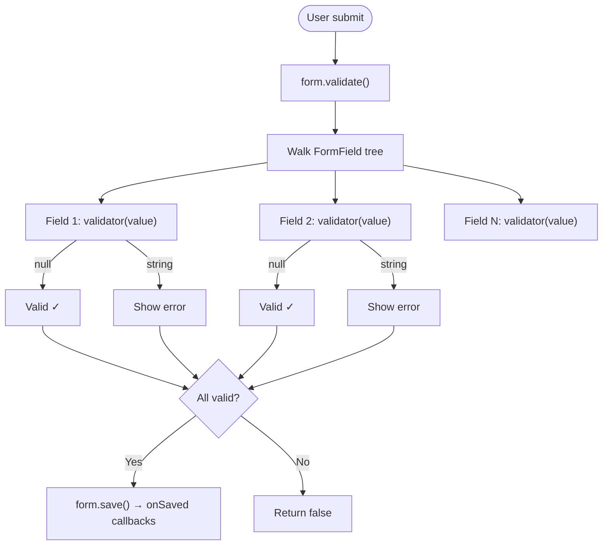

# Bài 9.3 — Form, FormState & Validation

## Phần 1 — Khái Niệm & Mục Tiêu Bài Học

### Tại sao bài này quan trọng?

`Form` + `TextFormField` là Flutter's built-in form validation system. Nó giải quyết vấn đề phức tạp:
- Validate nhiều fields một lúc
- Manage error messages theo field
- Save/reset form state

```dart
// Một lệnh validate toàn bộ form
if (_formKey.currentState!.validate()) {
  _formKey.currentState!.save();
  // Submit!
}
```

### Bạn sẽ hiểu được sau bài này:
- `Form`, `GlobalKey<FormState>`, `TextFormField`
- `validator`: inline validation logic
- `autovalidateMode`: khi nào trigger validation
- `form.save()`, `form.validate()`, `form.reset()`

---

## Phần 2 — Cơ Chế Hoạt Động (Under the Hood)

### Form Validation Flow



---

## Phần 3 — Code Mẫu Chuẩn Google

### 3.1 — Register Form hoàn chỉnh

```dart
class RegisterScreen extends StatefulWidget {
  const RegisterScreen({super.key});
  @override State<RegisterScreen> createState() => _RegisterScreenState();
}

class _RegisterScreenState extends State<RegisterScreen> {
  // GlobalKey: truy cập FormState từ bên ngoài Form widget
  final _formKey = GlobalKey<FormState>();

  // Lưu giá trị form sau khi validate
  String? _savedEmail;
  String? _savedPassword;
  String? _savedName;
  bool _obscurePassword = true;
  bool _isLoading = false;

  @override
  Widget build(BuildContext context) {
    return Scaffold(
      appBar: AppBar(title: const Text('Đăng ký')),
      body: SingleChildScrollView(
        padding: const EdgeInsets.all(16),
        child: Form(
          key: _formKey,
          // onChanged: gọi mỗi khi bất kỳ field nào thay đổi
          // Useful để enable/disable submit button
          autovalidateMode: AutovalidateMode.disabled, // Chỉ validate khi submit
          child: Column(
            children: [
              TextFormField(
                decoration: const InputDecoration(
                  labelText: 'Họ tên',
                  prefixIcon: Icon(Icons.person_outline),
                  border: OutlineInputBorder(),
                ),
                textCapitalization: TextCapitalization.words,
                textInputAction: TextInputAction.next,
                // validator: trả về null nếu hợp lệ, chuỗi lỗi nếu không
                validator: (value) {
                  if (value == null || value.trim().isEmpty) {
                    return 'Vui lòng nhập họ tên';
                  }
                  if (value.trim().length < 2) {
                    return 'Họ tên phải có ít nhất 2 ký tự';
                  }
                  return null; // Valid
                },
                // onSaved: gọi sau form.save()
                onSaved: (value) => _savedName = value?.trim(),
              ),
              const SizedBox(height: 16),

              TextFormField(
                decoration: const InputDecoration(
                  labelText: 'Email',
                  prefixIcon: Icon(Icons.email_outlined),
                  border: OutlineInputBorder(),
                ),
                keyboardType: TextInputType.emailAddress,
                textInputAction: TextInputAction.next,
                autocorrect: false,
                validator: (value) {
                  if (value == null || value.isEmpty) {
                    return 'Vui lòng nhập email';
                  }
                  // RFC-compliant email regex
                  final emailRegex = RegExp(
                    r'^[a-zA-Z0-9._%+-]+@[a-zA-Z0-9.-]+\.[a-zA-Z]{2,}$',
                  );
                  if (!emailRegex.hasMatch(value)) {
                    return 'Email không hợp lệ';
                  }
                  return null;
                },
                onSaved: (value) => _savedEmail = value?.toLowerCase().trim(),
              ),
              const SizedBox(height: 16),

              TextFormField(
                decoration: InputDecoration(
                  labelText: 'Mật khẩu',
                  prefixIcon: const Icon(Icons.lock_outlined),
                  border: const OutlineInputBorder(),
                  suffixIcon: IconButton(
                    icon: Icon(_obscurePassword
                        ? Icons.visibility_off
                        : Icons.visibility),
                    onPressed: () => setState(() => _obscurePassword = !_obscurePassword),
                  ),
                ),
                obscureText: _obscurePassword,
                textInputAction: TextInputAction.done,
                onFieldSubmitted: (_) => _submit(),
                validator: (value) {
                  if (value == null || value.isEmpty) return 'Vui lòng nhập mật khẩu';
                  if (value.length < 8) return 'Mật khẩu phải có ít nhất 8 ký tự';
                  if (!value.contains(RegExp(r'[A-Z]'))) {
                    return 'Phải có ít nhất 1 chữ HOA';
                  }
                  if (!value.contains(RegExp(r'[0-9]'))) {
                    return 'Phải có ít nhất 1 chữ số';
                  }
                  return null;
                },
                onSaved: (value) => _savedPassword = value,
              ),
              const SizedBox(height: 24),

              SizedBox(
                width: double.infinity,
                height: 48,
                child: ElevatedButton(
                  onPressed: _isLoading ? null : _submit,
                  child: _isLoading
                      ? const SizedBox(
                          width: 20,
                          height: 20,
                          child: CircularProgressIndicator(strokeWidth: 2),
                        )
                      : const Text('Đăng ký'),
                ),
              ),
            ],
          ),
        ),
      ),
    );
  }

  Future<void> _submit() async {
    // 1. Validate tất cả fields
    if (!_formKey.currentState!.validate()) return;

    // 2. Save — gọi tất cả onSaved callbacks
    _formKey.currentState!.save();

    setState(() => _isLoading = true);

    try {
      // 3. Submit với saved values
      await AuthRepository().register(
        name: _savedName!,
        email: _savedEmail!,
        password: _savedPassword!,
      );

      if (!mounted) return;
      Navigator.pushReplacementNamed(context, '/home');
    } catch (e) {
      if (!mounted) return;
      ScaffoldMessenger.of(context).showSnackBar(
        SnackBar(content: Text('Lỗi: $e')),
      );
    } finally {
      if (mounted) setState(() => _isLoading = false);
    }
  }
}
```

### 3.2 — AutovalidateMode

```dart
// AutovalidateMode: điều khiển khi nào trigger validator

// 1. disabled (default): chỉ validate khi gọi form.validate() thủ công
Form(autovalidateMode: AutovalidateMode.disabled, ...)

// 2. onUserInteraction: validate sau khi user interact với field
// → UX tốt nhất: không annoying khi form mới load
Form(autovalidateMode: AutovalidateMode.onUserInteraction, ...)

// 3. always: validate liên tục mỗi lần rebuild
// → Dùng khi cần validate ngay khi form render
Form(autovalidateMode: AutovalidateMode.always, ...)
```

### 3.3 — Form Reset

```dart
// Sau submit thành công hoặc Cancel button
_formKey.currentState!.reset(); // Xóa text VÀ error messages
// Hoặc set về initial values:
_emailController.clear();
_passwordController.clear();
```

---

## Phần 4 — Lỗi Sai Phổ Biến & Best Practices

### ❌ Anti-pattern 1: Validate không check null

```dart
// ❌ Crash: value có thể null khi field chưa được tap
validator: (value) {
  if (value.isEmpty) return 'Required'; // NullPointerException!
}

// ✅ Luôn check null trước
validator: (value) {
  if (value == null || value.isEmpty) return 'Bắt buộc';
  return null;
}
```

### ❌ Anti-pattern 2: Quên gọi form.save() trước khi dùng saved values

```dart
// ❌ _savedEmail null vì chưa gọi save()
_formKey.currentState!.validate();
submitData(_savedEmail!); // _savedEmail vẫn null!

// ✅ Thứ tự đúng: validate → save → use
if (_formKey.currentState!.validate()) {
  _formKey.currentState!.save(); // Gọi tất cả onSaved
  submitData(_savedEmail!); // Bây giờ _savedEmail có giá trị
}
```

### ❌ Anti-pattern 3: Đặt logic phức tạp trực tiếp trong validator

```dart
// ❌ Không tốt: validator gọi API (async không hỗ trợ)
validator: (value) async {
  final exists = await api.checkEmailExists(value); // ❌ Không work!
  return exists ? 'Email đã tồn tại' : null;
}

// ✅ Async validation: thực hiện trong submit handler
Future<void> _submit() async {
  if (!_formKey.currentState!.validate()) return;
  _formKey.currentState!.save();
  // Async check sau khi synchronous validation pass
  final exists = await api.checkEmailExists(_savedEmail!);
  if (exists) {
    _formKey.currentState!.fields['email']?.invalidate('Email đã tồn tại');
    return;
  }
  // ...
}
```

---

## Phần 5 — Bài Tập Củng Cố Tư Duy

### Challenge: Multi-step Registration Form

**Yêu cầu:**
1. Step 1: Personal info (Name, DOB, Gender)
2. Step 2: Account info (Email, Username, Password, Confirm Password)
3. Step 3: Review & Submit
4. Mỗi step: validate riêng trước khi Next
5. Back button: giữ nguyên data đã nhập

**Gợi ý:**
- Mỗi step có `Form` + `GlobalKey<FormState>` riêng
- Dùng `PageController` hoặc `IndexedStack` để switch steps
- Giữ data giữa steps trong parent State
- "Confirm Password" validation: so sánh với Password field

### Câu hỏi phỏng vấn liên quan:

1. **"Sự khác biệt giữa TextFormField và TextField?"**
   - `TextField`: standalone, không tích hợp Form
   - `TextFormField`: integrate với `Form`, hỗ trợ validator/onSaved

2. **"AutovalidateMode.onUserInteraction vs disabled: nên dùng cái nào?"**
   - `onUserInteraction`: UX tốt — không show lỗi ngay khi load, validate sau interact
   - `disabled`: validate khi submit — ít aggressive hơn

3. **"Làm sao validate confirm password phải match password?"**
   - Giữ reference đến `TextEditingController` của password field
   - `validator: (value) => value != _passwordController.text ? 'Không khớp' : null`
